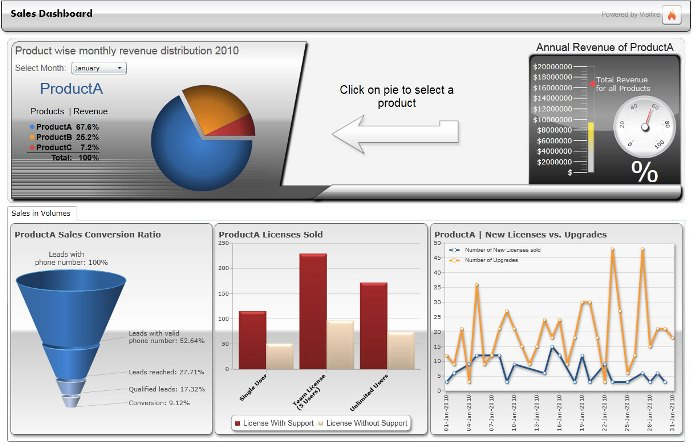
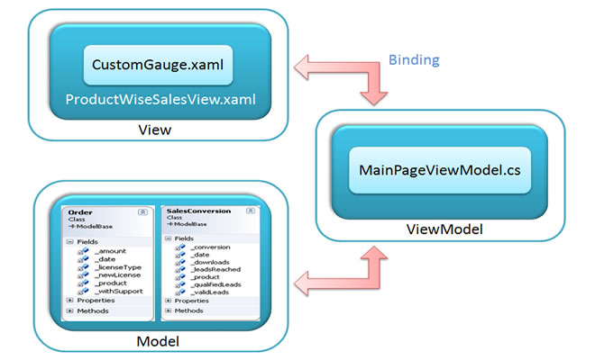

# A guide to create Enterprise Dashboard
## Requires
- Visual Studio 2010
## License
- Apache License, Version 2.0
## Technologies
- Silverlight 4
- Silverlight
- WPF
- Visual Studio 2010
- Silverlight Business Application
- MVVM
- Silverlight 5
## Topics
- Controls
- Data Binding
- Silverlight
- User Interface
- Silverlight Business Application
- charting
- MVVM
- Charts
## Updated
- 08/24/2011
## Description

<strong>Introduction</strong>

Enterprise dashboards provide rich data visualization for analyzing data.&nbsp;A dashboard &ndash; for eg. sales dashboard is a vital tool for C-level executives, business managers and sales persons.
 This sales dashboard is a demo application using rich set of <a href="http://www.visifire.com">
Visifire controls</a> to analyze product wise monthly revenue of a fictitious company.&nbsp;It also shows sales conversion ratio showing how successful the sales team is in converting the leads to sales. Based on several parameters shown in the dashboard the
 decision makers can make informed decisions.

&nbsp;

Click on the above image to see the dashboard in action.

&nbsp;

<strong>How does it work?</strong>

This dashboard application is built based on MVVM pattern and best practices. MVVM follows three basic blocks called Model, View and ViewModel. The figure below shows basic blocks of the dashboard
 application.

 

&nbsp;

<strong>Model</strong>: The Model is also called DataModel which contains business objects and model classes. It is independent of the View(UI).

<strong>View</strong>: The View contains visual elements displayed to the user and allows the user to interact with it. 

<strong>ViewModel</strong>: The ViewModel represents the &ldquo;Model of the View&rdquo; which is also a mediator between View and the Model. It exposes the model&rsquo;s data that is needed by the
 View. 

In this Sales dashboard, the model represents business objects which include Model classes (Order and SalesConversion classes). View mainly represents user interface (XAML) and handles user interaction.
 &ldquo;ProductWiseSalesView&rdquo; contains chart controls to display product wise monthly revenue distribution, sales in volumes like sales conversion ratio, number of licenses sold with or without support and new licenses vs upgrades. The &ldquo;ProductWiseSalesView&rdquo;
 also contains two Gauge controls which displays annual revenue for a particular product. User interacts with the View. Content of the View is handled in the ViewModel through binding. The binding between View and ViewModel is done by setting ViewModel as the
 DataContext of the View. The ViewModel is derived from ModelBase class which in turn implements INotifyPropertyChanged interface to support DataBinding. Hence when ViewModel properties are changed, new changes are automatically reflected in the View.

Browse the attached project for complete source code.

