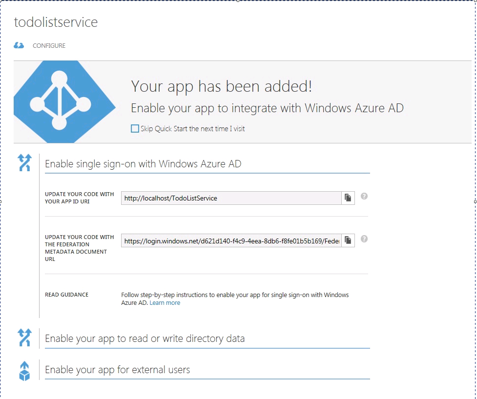
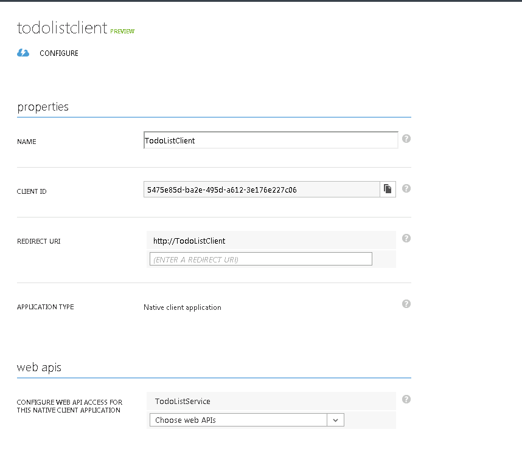

# ADAL - Native App to REST service - Authentication with AAD via Browser Dialog
## Requires
- Visual Studio 2012
## License
- Apache License, Version 2.0
## Technologies
- Microsoft Azure
- Windows Azure Access Control Service
- windows azure active directory
- windows azure authentication library
## Topics
- Authentication
- claims-based authentication
- Identity
## Updated
- 01/10/2015
## Description

<h1>NOTE: This sample is outdated. The technology, methods, and/or user interface instructions used in this sample are still supported, but have been succeeded by newer features. &nbsp;The scenario addressed by
 this sample is accomplished using the latest technology in&nbsp;<a href="https://github.com/azureadsamples/nativeclient-dotnet" target="_blank">NativeClient-DotNet</a>.</h1>
<h1 style="text-align:justify">Authentication via Browser Dialog - Readme</h1>
<h2>Overview</h2>

This sample demonstrates how to use the Active Directory Authentication Library (ADAL)

package to add user authentication capabilities to a WPF client. Furthermore, 
it demonstrates how to authenticate calls to a Web API REST service by 
leveraging the JSON Web Token Handler for Microsoft .Net Framework 4.5 (JWT 
handler).

ADAL is a library, built on .Net 4.0, offering a simple programming model for Windows 
Azure Active Directory (AAD) in client applications. Its main purpose is to 
help developers easily obtain access tokens from Windows Azure Active 
Directory, to be used for requesting access to protected resources such as REST 
services.

 
The JSON Web Token Handler for Microsoft .Net Framework (JWT handler) is a library built on 
.NET 4.5 which adds the JSON Web token format as a first-class citizen in the 
.NET programming model. The JWT handler can be used both within the WIF 
pipeline, to secure existing Web sites and services with JWT tokens in addition 
to the formats supported out of the box (such as SAML1.1 and SAML2). The JWT 
handler can also be used standalone, with no direct dependencies on WIF 
configuration.

&nbsp;

<h2 style="text-align:justify">Prerequisites</h2>

&nbsp;

<ul style="text-align:justify">
<li>Visual Studio 2012.&nbsp;&nbsp;&nbsp;&nbsp;&nbsp;
</li><li>A working internet connection. </li><li>Windows Azure subscription. </li><li>Windows Azure Active Directory tenant. </li><li><a href="http://visualstudiogallery.msdn.microsoft.com/27077b70-9dad-4c64-adcf-c7cf6bc9970c">NuGet package Manager.</a>
</li></ul>

 
<strong>Running the Sample</strong>

 
Before running this sample, you will need to create an Azure Active Directory tenant and register the client and service in the sample with Azure AD and update the sample with your tenant information.

&nbsp;

<ol style="text-align:justify">
<li>If you don&rsquo;t have your own Windows Azure AD tenant, please follow the
<a href="http://msdn.microsoft.com/en-us/library/windowsazure/79e09d59-08b9-446a-8ead-209134a4326d#BKMK_Working">
&ldquo;Create 
a New Directory Tenant and Add a User&rdquo;</a> section in Windows Store app walk 
through to create one. </li></ol>
<ul style="text-align:justify">
&nbsp;
<li style="text-align:left">Copy the domain name (in https://login.windows.net/&lt;domainName&gt;.onmicrosoft.com 
format) into <strong>authority </strong>in 
global.asax.cs file in TodoListService. </li></ul>

&nbsp;

<ol style="text-align:justify">
</ol>

&nbsp;&nbsp;&nbsp;&nbsp;&nbsp;&nbsp; 2. Register the client and service applications in AAD and update the sample

&nbsp;

<ul>
<li>&nbsp;
<ul>
<li>Click Add at the bottom of the page </li><li>Enter &ldquo;TodoListService&rdquo; as the name 
and choose web application or web api option.
</li><li>Enter <a href="https://localhost:44300/">https://localhost:44300/</a> as the App URL and &ldquo;<a href="http://localhost/TodoListService">http://localhost/TodoListService</a>&rdquo; as the App ID URI and click next.
</li><li>Choose Single Sign on as this sample doesn&rsquo;t need to read or write graph data.
</li><li>You should see this page when done </li></ul>
</li></ul>

&nbsp;

&nbsp;

<ul style="text-align:justify">
<li>NOTE: There is no way to delete the applications once they are created through the
portal at this time
<blockquote>
<li>Sign 
in to <a href="https://manage.windowsazure.com">https://manage.windowsazure.com</a>.
</li><li>Click 
on Active Directory in the left hand pane. </li><li>Click your directory. </li><li>Click on Applications. </li><li><em>Add Service application</em>. </li></blockquote>
</li></ul>

Figure 1

&nbsp;

<ul style="text-align:justify">
<li><em>Add 
Client Application</em>. 
<ul>
<li>Go back to Applications and click Add 
at the bottom of the page. </li><li>Enter &ldquo;TodoListClient&rdquo; as the name and 
choose &ldquo;Native Client Application&rdquo;.
</li><li>Click next and enter <a href="http://TodoListClient">
http://TodoListClient</a> as the Redirect Uri. Click the check 
mark. </li><li>Click on &ldquo;Configure access to web APIs&rdquo; 
and then click &ldquo;Configure it now&rdquo;.
</li><li>Choose TodoListService that we created 
above in the drop down &ldquo;Configure web API access for this native client 
application&rdquo; and click Save. </li><li>Copy Client ID to clientId &nbsp;and Redirect URI to redirectUri in 
MainWindow.xaml.cs </li></ul>
</li></ul>

 
 
 
Figure 2

&nbsp;

3. The sample is configured to run the
TodoListService in IIS Express on https. In order to get the sample working,
please copy the localhost certificate with friendly name = &ldquo;IIS Express
Development Certificate&rdquo; from Local Computer -&gt; My store to Trusted Root
store, otherwise the calls to TodoListService made by ADAL (during 401
discovery) and TodoListClient fail with the reason that the https certificate 
is invalid.

<ul style="text-align:justify">
<li>To do this, run mmc.exe.&nbsp; Go to File -&gt;
Add/Remove snap-in, choose certificates and click Add. Choose &ldquo;Computer account&rdquo;,
click &ldquo;Finish&rdquo; and then click &ldquo;OK&rdquo;.
</li><li>Now go to Personal -&gt; Certificates and look for &ldquo;localhost&rdquo; certificate issued 
by &ldquo;localhost&rdquo; and friendly name = &ldquo;IIS Express Development Certificate&rdquo;. 
Export this certificate without the private key and then import into &ldquo;Trusted 
Root Certificate Authorities&rdquo;. </li></ul>

&nbsp;

To run this sample, hit F5. The solution is configured to start multiple projects and will 
take care to put all the right parts in motion.

 
You will get a 401 exception on the call to uthenticationParameters.CreateFromResourceUrl()
which is expected since the client is doing 401 discovery by making a call to
the TodoListService without an access token. Press F5 to continue.

&nbsp;

In order to see 
the scenario in action, enter a value in the textbox and click the &ldquo;Add item&rdquo; 
button in the TodoListManager UI. Given that calling the corresponding service
requires presenting a security token, the application will prompt you with a
sign in page. Sign in as a user of your AAD domain.

&nbsp;

Now that we have 
a token, you will see that subsequent calls to the service will no longer 
trigger an authentication prompt as the token is cached, unless the cache is
cleared by clicking the Clear Cache button. The sample is configured with a
custom cache, CredManCache.cs under TodoListClient. The CredManCache uses
<a href="http://msdn.microsoft.com/en-us/library/aa923650.aspx">credential manager</a> to store the AuthenticationResult
objects that contain access token, refresh token, user id etc.

&nbsp;

To clear the token cache, click the Clear Cache button which also clears the items in the 
Todo items list. When you add an item again, you will be prompted with a sign
in page.

 
When you want to stop debugging, hit the Stop button in Visual Studio.

<h2 style="text-align:justify"> 
Details</h2>

 
Let&rsquo;s take a quick look at the structure of the solution. If you want more detailed 
information, please refer to the comments in the code.

&nbsp;

<strong>TodoListService:</strong>

A .Net 4.5 MVC4 
WebAPI&nbsp;project implementing a simple REST fa&ccedil;ade on top of a collection of
todo items. It utilizes the functionality in the JWT handler package.

 
<strong>TodoListClient:</strong> 
 
A .Net 4.0 WPF project implementing a simple client which consumes the API
exposed by TodoListService. TodoListClient can be used for adding new todo
items and display the ones assigned to the signed in user. It utilizes the
functionality in the ADAL package to display the Browser dialog for
authenticating and getting a JWT token from AAD/ADFS.<strong>&nbsp;</strong>

 
ADAL is provided in the &ldquo;Azure Directory Authentication Library&rdquo; NuGet package and
<em>JWTSecurityTokenHandler</em> in the &ldquo;JSON Web Token Handler for Microsoft .Net Framework 4.5&rdquo; NuGet package. Notice the
assemblies &ldquo;<strong><a class="libraryLink" href="https://msdn.microsoft.com/en-US/library/Microsoft.IdentityModel.Clients.ActiveDirectory.aspx" target="_blank" title="Auto generated link to Microsoft.IdentityModel.Clients.ActiveDirectory">Microsoft.IdentityModel.Clients.ActiveDirectory</a></strong>&rdquo;
and &ldquo;<strong>Microsoft.IdentityModel.Clients.ActiveDirectory.WindowsForms&rdquo;
</strong>under the references node in the Solution Explorer in Visual Studio for 
TodoListClient project and &ldquo;<strong><a class="libraryLink" href="https://msdn.microsoft.com/en-US/library/System.IdentityModel.Tokens.aspx" target="_blank" title="Auto generated link to System.IdentityModel.Tokens">System.IdentityModel.Tokens</a></strong>&rdquo;
in the TodoListService project.

 
Let&rsquo;s start from the client side of the solution. Open the
<strong>TodoListClient</strong> project and 
look at the <strong>MainWindow.xaml.cs</strong>

&nbsp;

<ol style="text-align:justify">
<li>authority 
refers to the AAD tenant in https://login.windows.net/&lt;tenant_name_or_ID&gt;
format, for example, &ldquo;https://login.windows.net/treyresearch.onmicrosoft.com. It could be set to
https://login.windows.net/common to defer figuring out the domain till users
sign in.&nbsp; Here it is set to string.Empty,
as the client is going to get the value from the TodoListService.
</li><li>clientId 
is a unique identifier for the TodoListClient application which is registered 
in AAD for your tenant (see Figure 2).&nbsp; 
</li><li>redirectUri 
is a URI of the client App registered in AAD (see Figure 2).
</li><li>resourceAppIDUri 
is the identifier that will be used by TodoListClient application to identify
the target service resource &nbsp;when 
requesting authorization for the service from Windows Azure AD (see Figure 1).&nbsp; The value of resourceAppIdUri is also going
to be obtained from the TodoListService in addition to authority.
</li></ol>

 
You will also see that we have setup some application-level members,
<em>AuthenticationContext</em> , a &ldquo;proxy&rdquo; for your tenant. On initialization the
<em>AuthenticationContext</em> is set to the authority specified in the authority
variable and the custom cache, CredManCache.

 
 

In the MainWindow() you will see that the client calls
AuthenticationParameters.CreateFromResourceUrl() to do a 401 discovery and get
the values of authority and resourceAppIdUri.

 
 

When the Add item button is clicked the
<em>GetAuthorizationHeader</em>() method is called, which calls AcquireToken() method in ADAL.Net to get
an AuthenticationResult containing an access token and then returns a http
authorization header with the access token obtained from ADAL.

&nbsp;

<ul style="text-align:justify">
<li>AcquireToken() checks the cache to see if there is a valid access token for the given authority, resource and client.
If there is a valid access token, it is returned. Otherwise, ADAL checks if
there is a valid refresh token, if yes, the refresh token would be sent to AAD
to get an access token. If neither of the above is possible, then a browser
dialog is presented to the user to enter credentials.
</li><li>Upon successful authentication <em>AcquireToken
</em>returns an <em>AuthenticationResult</em> which 
is saved in the cache for use in the subsequent calls.
</li></ul>

 
You can see how the JWT token is utilized in the
<em>GetResponseFromService() </em>method. Here the accessToken is put in the Authorization header of the HTTP Request sent to the TodoListService.

 
Finally on the Client side, take a look at CredManCache.cs. You will see that CredManCache is
a dictionary of TokenCacheKey and string pair. TokenCacheKey contains fields
like authority, clientId, resource etc. &nbsp;CredManCache encodes the TokenCacheKey into a
string to store in CredMan and decodes the key back to TokenCacheKey while
reading the entries. CacheHelper.cs has the logic to encode and decode the keys
of type TokenCacheKey. The values in the dictionary are string representation
of AuthenticationResult.

&nbsp;

Since the cache 
is a dictionary, you can run Linq queries on it, for example, to find all the 
tokens obtained from a specific authority or find all the tokens of a specific
user etc.

&nbsp;

Moving on to the 
service side: open the <strong>TodoListService</strong> project and examine
<strong>Global.asax.cs</strong>. The most interesting class here is
<em>TokenValidationHandler, </em>an implementation of DelegatingHandler.&nbsp;
<em>TokenValidationHandler&lsquo;s </em>purpose is<em>
</em>to process request messages before they reach the application code and enforce authentication requirements. The method
<em>TryRetrieveToken </em>inspects incoming http requests to verify if the authorization header contains
an OAuth2 header with a bearer token. If a bearer token is not found, the
request is not authorized and an unauthorized status code along with the 
authorization url and resource Id &nbsp;is sent back to the Client. &nbsp;If the header
contains a bearer token, it is validated through the
<em>JWT handler</em>. A <em>TokenValidationParameters </em>object is created to set the expected
properties, issuer, audience and signing token, on the token. The method
<em>ValidateToken() </em>is then called to validate the token and, upon successful validation, a new
<em>ClaimsPrincipal </em>instance is set as the Principal of the current thread and as the Current user
in HttpContext.

<h2 style="text-align:justify"> 
Deploying the TodoListService to Windows Azure</h2>

 
The sample solution is designed to run from your local machine; you can explore the
scenario without having a Windows Azure subscription, and in fact you can
choose to use ADAL to connect to Windows Azure Active Directory regardless of
where you will run your services.

 
That said, here are detailed instructions you can follow if you want to deploy the
<strong>TodoListService </strong>to Windows Azure.

&nbsp;

The steps below assume that you are using the April 2013 release of the Windows Azure 
SDK. Also note that to debug you will need to run VS in administrator mode.

&nbsp;

<ol style="text-align:justify">
<li>In the Solution Explorer, right click 
on the <strong>TodoListService</strong> project and choose
<em>Add Windows Azure Cloud 
Service Project</em>. &nbsp;This will create a new project called <strong>TodoListService.Azure</strong>.
</li><li>Make sure that multiple startup 
projects are still enabled. The following should be marked as startup projects 
now: </li></ol>

&nbsp;

<ul style="text-align:justify">
<li>TodoListClient </li><li>TodoListService.Azure </li></ul>

&nbsp;

3. To test on the local simulation
environment: open <strong>MainWindow.xaml.cs</strong> in&nbsp;&nbsp; the<strong>&nbsp;&nbsp;&nbsp;&nbsp;&nbsp;&nbsp;&nbsp;&nbsp; TodoListClient
</strong>project and change the <em>resourceBaseAddress
</em>value to <a href="http://127.0.0.1:81/">http://127.0.0.1:81/</a>. You will also have to relax the
validation on resourceAppIdUri, which would not work now. So, move the &ldquo;resourceAppIdUri = parameters.Resource;&rdquo; statement out of the if block and comment out the if and else statement in MainWindow().

<ol style="text-align:justify">
</ol>

4.To publish select <em>
Publish</em> on the <strong>TodoListService.Azure</strong> project. Select the Cloud Service where you
would like to deploy to and choose <em>Publish.</em>

<ol style="text-align:justify">
1. Once published open <strong>MainWindow.xaml.cs </strong>
in the <strong>TodoListClient</strong> project and change the
<em>resourceBaseAddress </em>value to the URL of the published service.
<blockquote>

&nbsp;

</blockquote>
</ol>

&nbsp;&nbsp;&nbsp;&nbsp;&nbsp;&nbsp;&nbsp;&nbsp;&nbsp;2. Once the deployment took place: before
launching the debugger, change your&nbsp;&nbsp; startup projects settings so only the
following projects are enabled:

&nbsp;

<ul style="text-align:justify">
<li>TodoListClient </li></ul>
<h2 style="text-align:justify"> 
Security Considerations</h2>

&nbsp;

<ol style="text-align:justify">
<li>When a custom token cache is plugged 
into ADAL, make sure that the entries in the cache are encrypted so that they 
are secure. </li><li>Note that the browser dialog that is 
used for the authentication flow in ADAL does not have an address bar.
</li><li>The JWT Tokens issued by AAD are bearer 
tokens and may not be encrypted and hence must be sent to the service on a 
secure channel like https in order to prevent information disclosure, spoofing 
and other security attacks. </li><li>The exceptions thrown by the JWT handler 
could contain sensitive information and it is up to the applications using it 
to make sure that this sensitive information is not sent to the Client.
</li><li>JWT handler could be configured to 
skip audience verification and Issuer verification. The security implications 
of turning off these checks should be understood.
</li><li>The 
JWT tokens issued by AAD are credentials (alike to passwords) and include 
information about users which may be considered sensitive information.&nbsp; The JWT token handler does not log tokens.&nbsp; Applications that log tokens should protect 
the log data appropriately to prevent information disclosure, spoofing, and 
other security attacks. </li></ol>
