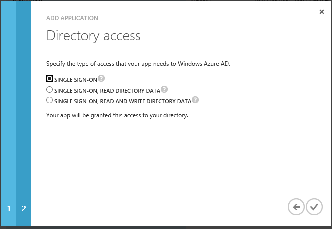

# ADAL - Server to Server Authentication
## Requires
- Visual Studio 2012
## License
- Apache License, Version 2.0
## Technologies
- Microsoft Azure
## Topics
- Authentication
## Updated
- 12/29/2014
## Description

<h1>NOTE: This sample is outdated. The technology, methods, and/or user interface instructions used in this sample are still supported, but have been succeeded by newer features. &nbsp;The scenario addressed by
 this sample is accomplished using the latest technology in&nbsp;<a href="https://github.com/AzureADSamples/Daemon-DotNet" target="_blank" style="font-size:xx-large">Daemon-DotNet</a> and
<a href="https://github.com/AzureADSamples/Daemon-CertificateCredential-DotNet" target="_blank" style="font-size:xx-large">
Daemon-CertificateCredential-DotNet</a>.</h1>
<h1>Overview</h1>

This sample demonstrates how to use the <strong>
Active Directory Authentication Library (ADAL) package</strong> to secure service calls from a server side process or a device (for ex. A sensor)&nbsp; to an MVC4 Web API REST service. The caller processes is simulated in the sample solution by a console application.
 The below free body diagram captures the scenario we are implementing at a high level:

 

Furthermore, it demonstrates how to authenticate calls to a Web API REST service by leveraging
the <strong>JSON Web Token Handler for Microsoft .Net Framework 4.5 (JWT handler).</strong>

&nbsp;

ADAL is a library, built on .Net 4.0, offering a simple programming model for Windows Azure Active Directory (WAAD) and Windows Server Active Directory Federation Services for Windows Server 2012 R2 in client applications. Its
 main purpose is to help developers easily obtain access tokens from Windows Azure Active Directory (WAAD) and Windows Server Active Directory Federation Services for Windows Server 2012 R2, which can then be used for requesting access to protected resources
 such as REST services.

&nbsp;

The JSON Web Token Handler for Microsoft .Net Framework (JWT handler) is a library built on .NET 4.5 which adds the JSON Web token format as a first-class citizen in the .NET programming model. The JWT handler can be used both
 within the WIF pipeline, to secure existing Web sites and services with JWT tokens in addition to the formats supported out of the box (such as SAML1.1 and SAML2). The JWT handler can also be used standalone, with no direct dependencies on WIF configuration.

&nbsp;

<h2><strong>Prerequisites</strong></h2>

&nbsp;

<ul>
<li>Visual Studio 2012 </li><li>Windows Azure Subscription </li><li>Azure AD tenant&nbsp;&nbsp; </li><li>Windows Azure AD Module for Windows PowerShell (<a href="http://technet.microsoft.com/en-us/library/jj151815.aspx">More 
information on setting up PowerShell to use with Windows Azure AD</a>) </li><li><a href="http://visualstudiogallery.msdn.microsoft.com/27077b70-9dad-4c64-adcf-c7cf6bc9970c">NuGet package Manager</a>
</li><li>A working internet connection </li></ul>

&nbsp;

<h2><strong>Running the Sample</strong></h2>

&nbsp;

The sample solution includes three projects:

&nbsp;

<ul>
<li><strong>TelemetryServiceWebAPI</strong> 
 
A .Net 4.5 MVC4 WebAPI&nbsp;project, implementing a simple REST WebAPI 
simulating a service which gathers Telemetry data. 
</li></ul>

&nbsp;

<strong>Note</strong><em>: SSL is mandatory before putting an application following this sample guidance into production.</em>

&nbsp;

<ul>
<li><strong>TelemetryServiceMonitor</strong> 
 
A .Net 4.5 console project simulating a long running server process which consumes the API exposed by
<strong>TelemetryServiceWebAPI</strong>.&nbsp; <strong>TelemetryServiceMonitor </strong>
polls <strong>TelemetryServiceWebAPI</strong> every 20 seconds to get device data from all other
<strong>TelemetryServiceClients</strong> writing to the <strong>TelemetryServiceWebAPI</strong>. The results of every call are displayed as messages in the console.
</li><li><strong>TelemetryServiceClient</strong> 
A .Net 4.5 console project simulating a long running client process which consumes the API exposed by
<strong>TelemetryServiceWebAPI</strong>.&nbsp; <strong>TelemetryServiceClient </strong>
writes Device data {Name, Memory, TimeStamp} to the <strong>TelemetryServiceWebAPI
</strong>every 10 seconds. The data written at every call is also displayed in the 
console along with the URI of the new resource created on the
<strong>TelemetryServiceWebAPI</strong>. </li></ul>

&nbsp;

Before running this sample, you will need to create an Azure Active Directory tenant and register
the client and Services in the sample with Azure AD and update the sample with 
your tenant information.

&nbsp;

1.&nbsp;&nbsp;&nbsp;&nbsp;&nbsp;If&nbsp; you don&rsquo;t have your own Windows Azure AD tenant, please follow the &ldquo;<strong>Working 
with Your Windows Azure AD Directory Tenant</strong>&rdquo; section in <a href="http://msdn.microsoft.com/en-us/library/dn151790.aspx">
Adding Sign-On to Your Web Application Using Windows Azure AD</a> to create one. As you don&rsquo;t need a user for 
this sample you will need to follow steps 1-3 of this section.

&nbsp;

<h3>2.&nbsp;&nbsp;&nbsp; Register a New Application on your Azure AD tenant for&nbsp; T<strong>elemetryServiceWebAPI</strong></h3>

&nbsp;

<ol>
<li>Go to the <strong>
Active Directory</strong> tab in the Windows Azure Management Portal. Click the 
<strong>APPLICATIONS</strong> header in the top area
of the screen. </li><li>This area is dedicated to listing all the applications that are registered in your directory tenant. We say that
an application is &ldquo;registered&rdquo; in a tenant when:
</li></ol>

&nbsp;

<ul>
<li>The application has an entry in the directory, which describes its main coordinates: name, associated endpoints,
and so on. More details later. </li><li>The application itself has been granted permission to perform some operation on the current directory tenant: the operations range from requesting a
 sign-on token to the ability to query the directory. Once again, more details later.
</li></ul>
<h3> 
<strong>Important&nbsp; </strong></h3>

No application can take advantage&nbsp;of Windows Azure AD without having been registered: this is both for security&nbsp;reasons (only apps that the
 administrator approves of should be allowed) and&nbsp;practical considerations (interaction with Windows Azure AD entails use of 
&nbsp;specific open protocols, which in turn require the knowledge of key&nbsp;parameters describing the app).

&nbsp;

3. Clicking the <strong>
Add</strong> button on the Windows Azure Management Portal command bar at the bottom of the screen.
 
 
4. The process of registering one app through the 
Windows Azure Management Portal is structured as a classic wizard, in which
subsequent screens break down the gathering of the required information
according to your choices.

 
 

&nbsp;

&nbsp;&nbsp;&nbsp;&nbsp;&nbsp;&nbsp;&nbsp;&nbsp;&nbsp;&nbsp;&nbsp;&nbsp;&nbsp;&nbsp;&nbsp;&nbsp;&nbsp;&nbsp;&nbsp;&nbsp;&nbsp;&nbsp;&nbsp;&nbsp;&nbsp;&nbsp;&nbsp;&nbsp;&nbsp;&nbsp;&nbsp;&nbsp;&nbsp;&nbsp;&nbsp;&nbsp;&nbsp;&nbsp;&nbsp;&nbsp;&nbsp;&nbsp;&nbsp;&nbsp;&nbsp;&nbsp;&nbsp;&nbsp;&nbsp;&nbsp;&nbsp;&nbsp;&nbsp;&nbsp;&nbsp;&nbsp;&nbsp;&nbsp;&nbsp;&nbsp;&nbsp;&nbsp;&nbsp;&nbsp;&nbsp;&nbsp;&nbsp;&nbsp;&nbsp;&nbsp;&nbsp;&nbsp;&nbsp;

&nbsp;&nbsp;

 
The options offered are straightforward:

&nbsp;

<ul>
<li><strong>Name</strong>: the text entered here is used as human-readable moniker to refer to the app whenever a user -- be it an 
administrator managing the registered apps list or a customer deciding to grant directory access to the app &ndash; needs to do something about it. There is more info about this in the
<a href="http://msdn.microsoft.com/en-us/library/dn151789.aspx">Developing Multi-Tenant Web Applications with Windows Azure AD</a> paper.
</li><li><strong>Type</strong>: This set of radio buttons allows you to specify what kind of app you are trying to build. For the 
purposes of this Sample, in which our goal is to create a WEB API, the proper choice is
<strong>&ldquo;WEB 
APPLICATION AND/OR WEB API&rdquo;</strong>. </li></ul>

&nbsp;

<ol>
</ol>

5. Once you have entered the application&rsquo;s name and chosen the
<strong>&ldquo;WEB APPLICATION AND/OR WEB API&rdquo;</strong> 
access type, click on the arrow on the lower right corner to move to the next 
screen.

<ol>
</ol>

6. In this screen the Windows Azure Management Portal gathers important coordinates
which the service needs to drive the sign-in protocol flow.

&nbsp;

 

 
 

Here there&rsquo;s what you need to enter:

<ul>
<li><strong>APP URL</strong>: Since we are building a web API service
which does not have a sign-in flow we don&rsquo;t really need to provide Windows
Azure AD the physical address where your API is hosted. However since this is a
required field in the portal we can enter a dummy value here. For web
applications this parameter needs to represents the
<em>address</em> of your web application. Windows Azure AD needs to know your application&rsquo;s address so that, after a user
successfully authenticated on Windows Azure AD&rsquo;s pages, it can redirect the
flow back to your application. </li><li><strong>APP ID URI</strong>: this parameter represents the
<em>identifier</em> of your web application. Windows Azure AD uses this value at sign-on time, to determine
that the authentication request is meant to enable a user to access this
particular application - among all the ones registered - so that the correct
settings can be applied, click on the arrow on the lower right corner to move
to the next screen. </li></ul>
<table border="0" cellpadding="0">
<tbody>
<tr>
<td>

<strong>Note 
</strong>

</td>
</tr>
<tr>
<td>

The <strong>APP&nbsp;ID URI</strong> must be unique within the directory tenant. A good&nbsp;&nbsp; default value for it is the
<strong>APP&nbsp; URL</strong> value itself, however with that strategy the uniqueness&nbsp;&nbsp; constraint is not always easy to respect: developing the app on local hosting&nbsp;environments
 such as IIS Express and the Windows Azure Fabric Emulator tend&nbsp;to produce a restricted range of addresses that will be reused by multiple&nbsp;developers or even multiple projects
 from the same developer. One possible&nbsp;&nbsp;strategy is to append something to the
<strong>APP&nbsp;&nbsp; URI</strong> value as a differentiator.

Also note. The <strong>APP ID URI</strong> is a URI, and as such it&nbsp;does not have to correspond to any network addressable endpoint.

</td>
</tr>
</tbody>
</table>

&nbsp;

<ol>
</ol>

7. The options offered allow you to set access your app needs to Azure AD:

<ol>
</ol>

&nbsp;&nbsp;&nbsp;&nbsp;&nbsp;&nbsp;&nbsp;&nbsp;&nbsp;&nbsp;&nbsp;&nbsp;&nbsp;&nbsp;&nbsp;&nbsp;&nbsp;&nbsp;&nbsp;&nbsp;&nbsp;&nbsp;&nbsp;&nbsp;&nbsp;&nbsp;&nbsp;&nbsp;&nbsp;&nbsp;&nbsp;&nbsp;&nbsp;&nbsp;&nbsp;&nbsp;&nbsp;&nbsp;&nbsp;&nbsp;&nbsp;&nbsp;&nbsp;&nbsp;&nbsp;&nbsp;&nbsp;&nbsp;&nbsp;&nbsp;

 
 

<ul>
<li><strong>Access type</strong>: Since this is a Web API and we
don&rsquo;t need directory access the proper choice is
<strong>Single sign-on</strong>. Once you have selected Single Sign-on you can click on the checkbox button on the
lower right corner. Note: The Web API be are building does not support sign-on but
selecting this option registers the API with the minimum access requirements we
need. </li></ul>

 
3.&nbsp;&nbsp;Follow the steps in 2. Above to
<strong>&ldquo;Register a New Application&rdquo; </strong>for the two client applications

&nbsp;

<strong>-TelemetryServiceClient</strong>

<strong>-TelemetryServiceMonitor</strong>

 
<strong>Note</strong>:

- Even though this sample uses console applications to describe the client applications we would
still choose the <strong>&ldquo;WEB APPLICATION AND/OR WEB API&rdquo; option, as the OAuth grant type (&ldquo;Client Credential Grant&rdquo;) that the console application uses applies to any service to service interaction.
 Since the Clients here contain the client secret (as described below) it is expected that the client would be running in a secure environment like:</strong><strong>&nbsp;</strong>

&nbsp;

<ul>
<li><strong>Background job (Cron job) on a server</strong><strong>&nbsp;</strong>
</li><li><strong>&nbsp; 
</strong><strong>Service to service calls made by a Web 
Application to say Graph API where the Web Application is a confidential client 
</strong><strong>&nbsp;</strong> </li><li><strong>Set of embedded devices (For e.g. Sensors) where the 
client secret is stored in a secure storage on the device itself and cannot be 
retrieved\misused by the end user.</strong> </li></ul>

 
- We are leveraging the portal to set up our service 2 service client application. You may notice that
the flow is not optimal of such a client, our purpose of following the above 
steps is to use the Windows Azure management portal to create the 
ServicePrincipal for the application in the directory instance. Some of the below 
points are also worth mentioning:

 
 

- Since in this sample the client applications are console applications the &ldquo;<strong>APP 
ID URL</strong>&rdquo; is not really relevant and you can fill in a dummy value.

&nbsp;

-Similarly the
<strong>&ldquo;WEB APPLICATION AND/OR WEB API&rdquo; and &ldquo;Single-Sign On&rdquo; are not applicable to the client apps we are setting up for Service to Service but are needed none the less to keep the wizard in the portal happy.
</strong>

&nbsp;

<strong>Updating the tenant information in the sample:</strong>

&nbsp;

Start Visual Studio 2012, open the solution

&nbsp;

<strong>Updating TelemetryServiceClient</strong>

&nbsp;

1. Open the <strong>App.config </strong>file of the
<strong>TelemetryServiceClient</strong> project and update the placeholders 
for <strong>Tenant</strong>, <strong>ClientID</strong>,
<strong>ClientSecret</strong>, <strong>Resource</strong>, <strong>ResourceUrl</strong> keys with the values
mentioned below.&nbsp;&nbsp;

&nbsp;

a. Copy your Windows Azure AD tenant endpoint and fill in the &ldquo;value&rdquo; associated with the
<strong>Tenant </strong>&ldquo;key&rdquo;.&nbsp; E.g. https://login.windows.net/yourdomain.onmicrosoft.com

 
b. <strong>Goto</strong> the <strong>TelemetryServiceClient
</strong>app on your tenant. You should be on a screen similar to the one you saw at the
end of registering the client application. Select
<strong>CONFIGURE</strong> at the top of the screen. Scroll all the way down and you&rsquo;ll see a
<strong>CLIENT ID </strong>field<strong>. </strong>Copy the CLIENT ID and fill in the &ldquo;value&rdquo; associated with the
<strong>ClientID</strong> 
&ldquo;key&rdquo;.

 
c.&nbsp;Below <strong>CLIENT ID </strong>you should see a keys section.
<strong>Select</strong> the duration drop down to 
create a new key with the specified duration. When you
<strong>SAVE</strong> the change you will be given the option to copy the key to clipboard by clicking a button
right next to the key. Fill in the &ldquo;value&rdquo; associated with the
<strong>ClientSecret </strong>&ldquo;Key&rdquo; with the clipboard contents.

&nbsp;

d.&nbsp;Copy the <strong>App Id Uri</strong> of the service that you entered in step2 above and fill in the 
&ldquo;value&rdquo; associated with the <strong>Resource
</strong>key.

 
e.&nbsp;<strong>ResourceUrl </strong>key. 
This should be the physical address where your service is hosted

&nbsp;

<strong>Updating TelemetryServiceMonitor</strong>

&nbsp;

1.&nbsp;Open <strong>App.config </strong>of the
<strong>TelemetryServiceMonitor</strong> project and update the placeholders for <strong>
Tenant</strong>, <strong>ClientID</strong>, <strong>
ClientSecret</strong>, <strong>Resource, </strong><strong>ResourceUrl</strong> keys following the exact steps (a-e, except c as there
is no client secret being used by the TelemetryServiceMonitor) described
above.&nbsp;&nbsp;

&nbsp;

Since the <strong>TelemetryServiceMonitor</strong> uses an X.509
certificate instead of a client secret we would additionally need to update
<strong>CertificatePath</strong> and <strong>CertificatePassword</strong> keys with the
respective values for the certificate you intend to use. If you are planning to 
reuse the certificate provided in this sample you can specify the path to the
.pfx file the password for which is &ldquo;password&rdquo;.

&nbsp;

You can create your own self-signed certificate using
<strong>makecert</strong>.<strong>exe</strong> and <strong>PvkPfx</strong>.<strong>exe
</strong>as shown below<strong>:</strong>

&nbsp;

<ul>
<li><strong>makecert.exe</strong> -r -pe -n 
&quot;CN=TelemetryServiceMonitor&quot; -ss My -sr CurrentUser -e 08/04/2015 -sv 
c:\TelemetryServiceMonitor.pvk c:\TelemetryServiceMonitor.cer
</li></ul>

&nbsp;

<ul>
<li><strong>Pvk2Pfx</strong> /pvk c:\TelemetryServiceMonitor.pvk /pi &quot;password&quot; /spc c:\TelemetryServiceMonitor.cer 
/pfx c:\TelemetryServiceMonitor.pfx
</li></ul>

 
 

In order to use the Auth client credential grant with client assertion (which essentially replaces
he secret with a jwt signed by an X.509 certificate) you require your Appcation configured on Windows Azure Active Directory to be able to verify the
 client assertion (signed jwt that the client sends over). To do so you would need to provision the application object on your directory using Windows
Azure AD PowerShell with the X.509 certificate you intend to use. To set up
PowerShell on your machine follow the instructions
<a href="http://technet.microsoft.com/en-us/library/jj151815.aspx">here</a>. Once you have PowerShell set connect to your
tenant using the below commands:

&nbsp;

<strong>PS C:\windows\system32&gt;</strong> connect-msolservice -credential $msolcred

&nbsp;

Once connected run the below to get all the service principal information on your tenant

 
 

<strong>PS C:\windows\system32&gt;</strong> Get-MsolServicePrincipal

&nbsp;

You will see the list of all Service Principals registered on you tenant. Locate the service principals
associated with the <strong>TelemetryServiceMonitor,
</strong>you can do this by looking 
for the App ID URI you earlier specified for the monitor, once you have located 
the Service Principal details you will find among other tenant properties the AppPrincipalID.
Copy the AppPrincipalID and use the below steps to provision the X.509 
certificate on it.

 
 

<strong>PS C:\windows\system32&gt;</strong> $cer = New-Object 
System.Security.Cryptography.X509Certificates.X509Certificate

 
 

&nbsp;<strong>PS C:\windows\system32&gt;</strong> $cer.Import(&quot;<em>Path to Certificate (.cer) file</em>&quot;)

 
 

<strong>PS C:\windows\system32&gt;</strong> $binCert = $cer.GetRawCertData()

 
 

<strong>PS C:\windows\system32&gt;</strong> $credValue = 
[System.Convert]::ToBase64String($binCert);

 
 
 

<strong>PS C:\windows\system32&gt;</strong> New-MsolServicePrincipalCredential 
-AppPrincipalId &quot;Application Principal ID from above&quot; -Type 
asymmetric -Value $credValue -StartDate $cer.GetEffectiveDateString() -EndDate 
$cer.GetExpirationDateString() -Usage verify

 
 

You can check if the certificate was provisioned successfully using the 
Get-MsolServicePrincipalCredential command

&nbsp;

<strong>PS C:\windows\system32&gt;</strong> Get-MsolServicePrincipalCredential 
&ndash;ServicePrincipalName &ldquo;App ID URI<strong>&rdquo;</strong>

 
 

<strong>Updating TelemetryServiceWebAPI</strong>

&nbsp;

1.&nbsp;&nbsp;Open the <strong>global</strong>.<strong>asax</strong>.<strong>cs
</strong>file under <strong>TelemetryServiceWebAPI</strong> project.

 
-Update the <strong>audience </strong>with the service App ID URI, created in step 2 above while registering the
<strong>TelemetryServiceWebAPI</strong> 
application on your tenant

-Update the <strong>domainName </strong>to your tenant/domain name

2.&nbsp;Open the <strong>web.config</strong> file under
<strong>TelemetryServiceWebAPI </strong>and<strong> </strong>replace the 
&ldquo;values&rdquo; associated with the <strong>ClientObjectID1</strong> and
<strong>MonitorObjectID </strong>keys with the Object ID values for the
<strong>TelemetryServiceClient</strong> and <strong>TelemetryServiceMonitor 
</strong>projects respectively. &nbsp;To retrieve the Object Identifier values 
associated with your client applications follow the instructions below:

&nbsp;

In order to configure the sample using the Object ID you first need to retrieve the value of the
Object ID. You can do this by running the Windows Azure AD PowerShell. To set 
up PowerShell on your machine follow the instructions
<a href="http://technet.microsoft.com/en-us/library/jj151815.aspx">here</a>. Once you have PowerShell set connect to your
tenant using the below commands:

&nbsp;

PS 
C:\windows\system32&gt; connect-msolservice -credential $msolcred

&nbsp;

Once connected run the below to get all the service principal information on your tenant

&nbsp;

PS C:\windows\system32&gt; 
Get-MsolServicePrincipal

&nbsp;

You will see the list of all Service Principals registered on you tenant. Locate the service principals
associated with the <strong>TelemetryServiceClient</strong> and
<strong>TelemetryServiceMonitor, 
</strong>you can do this by looking for the App ID URI you earlier specified for 
these, once you have located the Service Principal details you will find among
other tenant properties the ObjectID. You can now use these to reconfigure your
sample.

&nbsp;

To run this sample, hit 
F5. The solution is configured to start the <strong>
TelemetryServiceWebAPI</strong> 
project.

 
 

In order to see the scenario in action, right click the
<strong>TelemetryServiceClient</strong> project, Goto <strong>Debug</strong> and select &ldquo;<strong>Start new instance</strong>&rdquo;. The application will
request a security token from Windows Azure AD and present it to the
TelemetryServiceWebAPI in order to POST device data to the service.

&nbsp;

To see that the data was actually posted we can use the
<strong>TelemetryServiceMonitor</strong>&nbsp; project, right click the
<strong>TelemetryServiceMonitor</strong> project, goto <strong>Debug</strong> and select 
&ldquo;<strong>Start new instance</strong>&rdquo;. The application will request a security token from
Windows Azure AD and present it to the <strong>
TelemetryServiceWebAPI</strong> in order to GET device data written to the service.

&nbsp;

<strong>Details&nbsp;</strong>

&nbsp;

Let&rsquo;s take a quick look at the structure of the solution. For more detailed information, please refer
to the comments in the code.

 
<strong>TelemetryServiceClient</strong> and <strong>
TelemetryServiceMonitor</strong> are .Net 4.5 projects using AAL.&nbsp;
<strong>TelemetryServiceWebAPI</strong> is a .Net 4.5 project using the JWT handler to validate the JWT token received from the
TelemetryServiceClient and TelemetryServiceMonitor. AAL is provided in the
&ldquo;Windows Azure Authentication Library Beta&rdquo; NuGet package and
<em>JWTSecurityTokenHandler </em>in the &ldquo;JSON Web Token Handler for Microsoft .Net Framework 4.5&rdquo; NuGet package.
Notice the assemblies &ldquo;<strong>Microsoft.WindowsAzure.ActiveDirectory.Authentication</strong>&rdquo;&nbsp;
and &ldquo;<strong>System.IdentityModel.Tokens.JWT</strong>&rdquo; under the references node in the
Solution Explorer in Visual Studio for these projects respectively.

 
 

Let&rsquo;s start from the
requesting side of the solution. Open the <strong>
TelemetryServiceMonitor</strong> 
project and look at the <strong>app.config</strong>. Here you will see some values that
are used later by ADAL:

 
 

1.&nbsp;&nbsp;&nbsp;&nbsp;&nbsp;&nbsp;<em>Tenant</em> 
 
This value represents the full URL identifying the Windows Azure Active 
Directory tenant that contains all the settings describing the scenario.

 
2.&nbsp;&nbsp;&nbsp;&nbsp;&nbsp;&nbsp;<em>Resource</em>

&nbsp;

This is an identifier
within the tenant for the service we are accessing. When working with a
directory tenant this value is specified in the form of
an App ID URI.

&nbsp;

3.&nbsp;&nbsp;&nbsp;&nbsp;&nbsp;ClientID

&nbsp;

The unique identifier
for your app.

&nbsp;

4.&nbsp;&nbsp;&nbsp;&nbsp;&nbsp;&nbsp;CertificatePath 
and CertificatePassword: These values reference the path and password of the 
certificate the application uses to sign the jwt token it sends to your 
directory tenant. The application corresponding to the TelemetryServiceMonitor 
on your directory needs to have the corresponding public key (.cer) configured 
in order to verify the incoming jwt signature.

&nbsp;

6. ResourceUrl

 
This is the physical address for the service we are accessing, for instance once you host your
service to a production environment your physical address will change from 
http://localhost:XXX/ to https://XYZ.cloudapp.net/

&nbsp;

The <strong>TelemetryServiceClient
</strong>project&rsquo;s <strong>app.config </strong>
has similar values as described above. The CertificatePath and CertificatePassword are however replaced with just the 
client secret:

&nbsp;

<em>ClientSecret</em> 
 
The ServicePrincipal credentials assigned to TelemetryServiceClient&rsquo;s ServicePrincipal. 
TelemetryServiceClient uses it to identify itself with Windows Azure AD in
order to obtain a token.

&nbsp;

Moving on to the service
side: open the <strong>TelemetryServiceWebAPI</strong> project and examine and examine
<strong>Global.asax.cs</strong>. The most interesting class here is
<em>TokenValidationHandler, </em>an implementation of DelegatingHandler.&nbsp;
<em>TokenValidationHandler&lsquo;s </em>purpose is<em>
</em>to process request messages before they reach the application code and enforce authentication requirements. The method
<em>TryRetrieveToken </em>inspects incoming http requests to verify if the authorization header contains
an OAuth2 header with a bearer token. If a bearer token is not found, the
request is not authorized and an unauthorized status code is sent back to the
Client. If the header contains a bearer token, it is validated through the
<em>JWT handler</em>. A <em>TokenValidationParameters </em>object is created to set the
expected properties, issuer, audience and signing token, on the token. The
method <em>JWT handler.ValidateToken()</em> is then called to validate the token
and, upon successful validation, a new <em>ClaimsPrincipal</em> instance is set
as the Principal of the current thread and as the Current user in HttpContext.

 
 

&nbsp;<strong>TelemetryServiceWebAPI</strong> additionally enforces access control by
ensuring that only specific clients are allowed to perform a POST and others a
GET. In order to enforce this access control the Service relies on checking the
Object ID claim (&ldquo;http://schemas.microsoft.com/identity/claims/objectidentifier&rdquo;) of incoming
request in the claim and restricts actions in the DevicesController.cs class.
The expected Object ID of the <strong>TelemetryServiceMonitor</strong> and
<strong>TelemetryServiceClient </strong>can be set in the
<strong>web.config</strong> of the <strong>TelemetryServiceWebAPI</strong>.

 
 

<strong>Deploying the Telemetry Service to Windows Azure</strong>

 
The sample solution is dsigned to run from your local machine; you can explore the scenario without
being required to have a Windows Azure subscription, and in fact you can choose
to use ADAL to connect to Windows Azure Active Directory regardless of where 
you will run your services. <strong>Note:</strong> Once you are getting ready to deploy
to a production environment you <strong>must</strong> use SSL to secure you service.

&nbsp;

That said, here aredetailed instructions you can follow if you want to deploy the
<strong>TelemetryServiceWebAPI </strong>o Windows Azure.

&nbsp;

&nbsp;The steps below
assume that you are using the October 2012 release of the Windows Azure SDK.
lso note that to debug you will need to run VS in administrator mode.

 
 

1.&nbsp;&nbsp;&nbsp;In the Solution Explorer, right click on the
<strong>TelemetryServiceWebAPI </strong>project and choose
<em>Add Windows Azure Cloud Service Project</em>.&nbsp; This will create a new project called
<strong>TelemetryServiceWebAPI.Azure</strong>.

&nbsp;

2.&nbsp;To publish select
<em>Publish</em> on the <strong>TelemetryServiceWebAPI.Azure </strong>project. Select the Cloud Service where you would like to deploy to and choose
<em>Publish</em>.

&nbsp;

3.&nbsp;&nbsp;&nbsp;&nbsp;&nbsp;&nbsp;Make sure that the
<strong>TelemetryServiceWebAPI </strong>project references the 64 bit 
version of AAL.

&nbsp;

4.&nbsp;&nbsp;&nbsp;Once published open
<strong>app.config</strong> in the <strong>TelmetryServiceMonitor</strong> and <strong>
TelemetryServiceClient </strong>project and change the <em>ResourceUrl</em> value to your URL of the 
published service.

&nbsp;

5.&nbsp;&nbsp;&nbsp;&nbsp;&nbsp;&nbsp;Once the deployment has taken place you can start an instance of the
<strong>TelemetryServiceMonitor</strong> 
followed by the <strong>TelemetryServiceClient</strong> as described earlier.

&nbsp;

<strong>Security Considerations</strong>

 
1.&nbsp;&nbsp;&nbsp;The JWT Tokens issued by Windows Azure AD are not encrypted and hence must be 
sent to the Service on a secure channel like https in order to prevent 
information disclosure, spoofing and other security attacks.

&nbsp;

2.&nbsp;&nbsp;&nbsp;&nbsp;The exceptions thrown by the JWT handler could contain sensitive information 
and it is up to the applications using it to make sure that this sensitive 
information is not sent to the Client.

&nbsp;

3.&nbsp;&nbsp;&nbsp;JWT handler could be configured to do audience verification. The security 
implications of turning off these checks should be understood.

 
4.&nbsp;&nbsp;&nbsp;&nbsp;JWT handler does not log the token but applications logging the tokens should 
be careful about information disclosure.&nbsp;

 
 

&nbsp;

 
 

&nbsp;

&nbsp;&nbsp;&nbsp;&nbsp;&nbsp;&nbsp;&nbsp;

