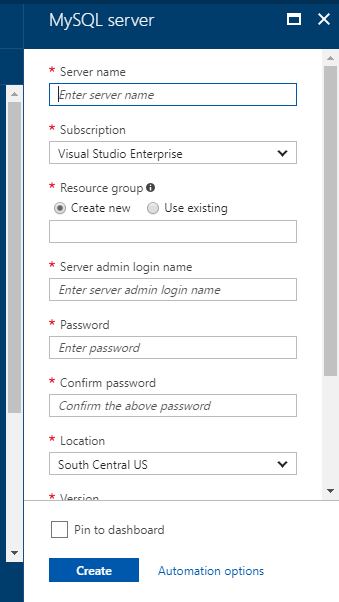
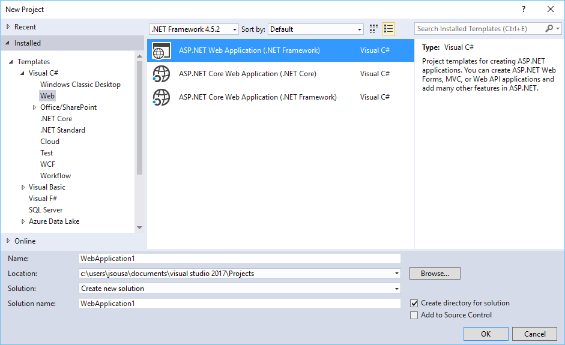
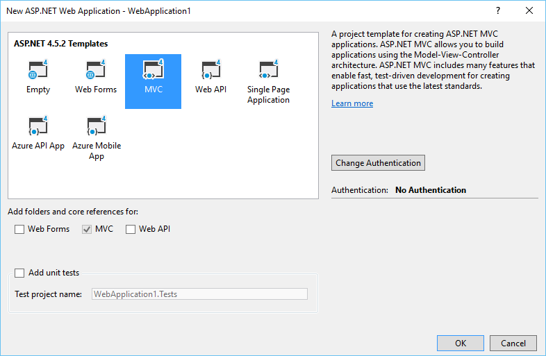
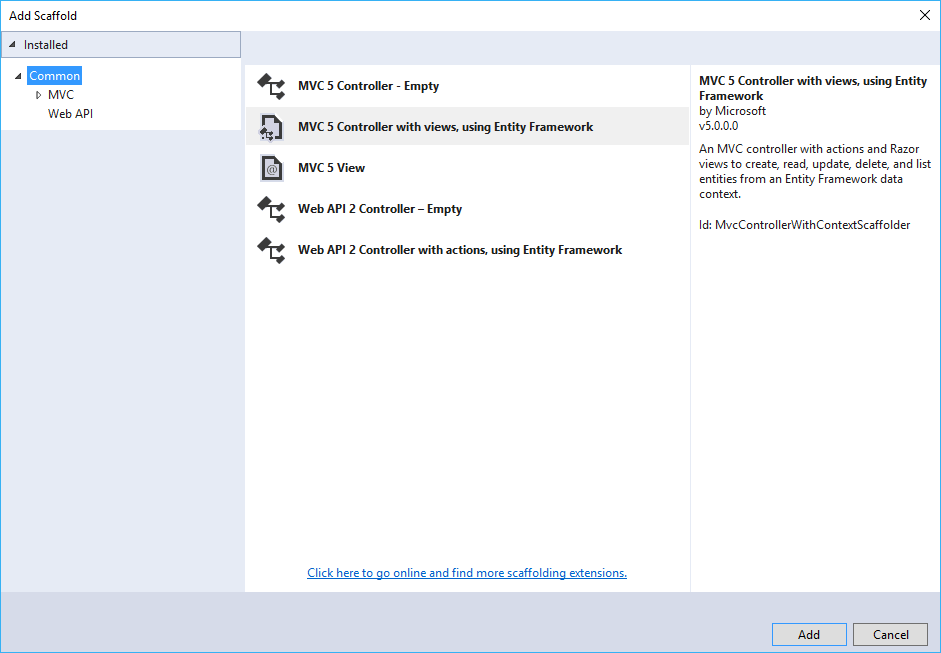
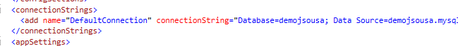
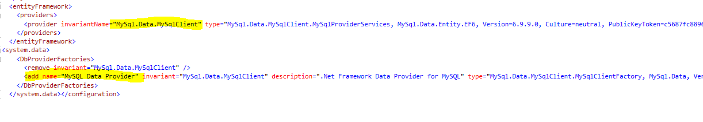
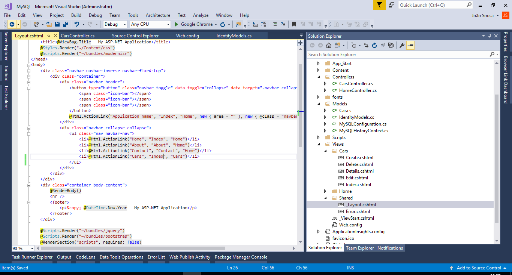
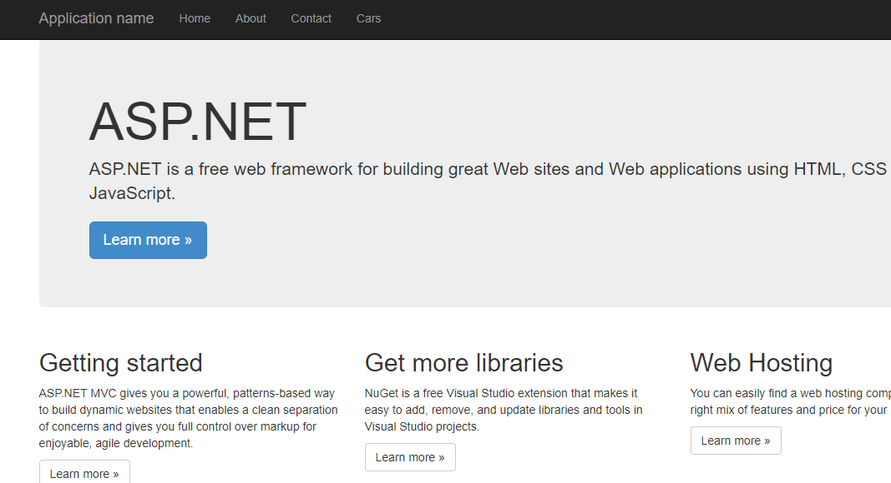

# ASP.NET - Connect to MySQL Azure Database
## Requires
- Visual Studio 2017
## License
- MIT
## Technologies
- C#
- ASP.NET
- Entity Framework
- MySQL
## Topics
- C#
- ASP.NET
- Entity Framework
- MySQL
## Updated
- 10/03/2017
## Description

<strong>Introduction</strong>

Using MVC, Entity Framework, ASP.NET Scaffolding, and Azure MySQL you can create a web application that stores your information on an MongoDB Azure database. This demo shows you how to create a web application with MVC and Entity Framework 7,
 that communicate with a MySQL Azure database.

&nbsp;

<strong>STEP 1 - Create Azure Account</strong>

You need to get a Windows Azure account. Everyone can open a Windows Azure account for free.

Check the link below for more information.

<a href="http://www.windowsazure.com/en-us/pricing/free-trial/">http://www.windowsazure.com/en-us/pricing/free-trial/</a>

 

<strong>STEP 2 - Create MySQL Database on Windows Azure</strong>

After get access to an Azure Account, we need to create a MySQL Database to store your data.

So for that we need to select the option New on the left bottom of our web page and then select the option Data &#43; Storage -&gt; MySQL Database-&gt; Set the name and provide the configurations you need.

After created the Database, we need to get the connection string that will be used on Web Aplication to access the Azure Database.

For that, select the database created and on the main window, on the right side, we have an option called &quot;Show Connection String&quot;.

When we select that option, a new tabwill appear, like the following image, with the connection string formatted to different providers.

&nbsp;

<strong>STEP 3 - Create ASP.NET Web Application</strong>

Go to Visual Studio&rsquo;s&nbsp;File New Project&nbsp;menu, expand the&nbsp;Web&nbsp;category, and pick&nbsp;ASP.NET Web Application like on the image below

&nbsp;

<ul type="disc">
<li>Press OK, and a new screen will appear, with several options of template to use on our project.
</li><li>Select the option MVC. </li></ul>

After selection of our template, your first web application using ASP.NET is created.

&nbsp;

<strong>STEP 4 - Create Data Model</strong>

After we have our web application created, we need to ceate our data model.

For that, select the option Add New Item on solution and choose the option Class. Create the class like the one on the image above.&nbsp;

We need to validate that EntityFramework anf MySQL.Data.Entity are installed like we saw on the image below

&nbsp;

<strong>STEP 5 - Scaffolding</strong>

This could be made&nbsp;easily&nbsp;using the Scaffolding functionality.

On the solution on the top of controller folder, select the option Add New Scaffold Item.

On the new screen, select the option MVC6 Controller with views using entity framework.

&nbsp;

Select the name of the controller, class model and data context class.

The new controllers and views associated, was created with sucess.

&nbsp;

<strong>STEP 6 - Change Connection String</strong>

<strong>STEP 7 - Change Menu Layout</strong>

To test the new entity created, we can add one new entries on the web application menu.

&nbsp;

<strong>STEP 8 - Run Application</strong>

Press now the F5 button, to run the web application.

The new entities appear on the menu.

Press the option car to see our entity in action

