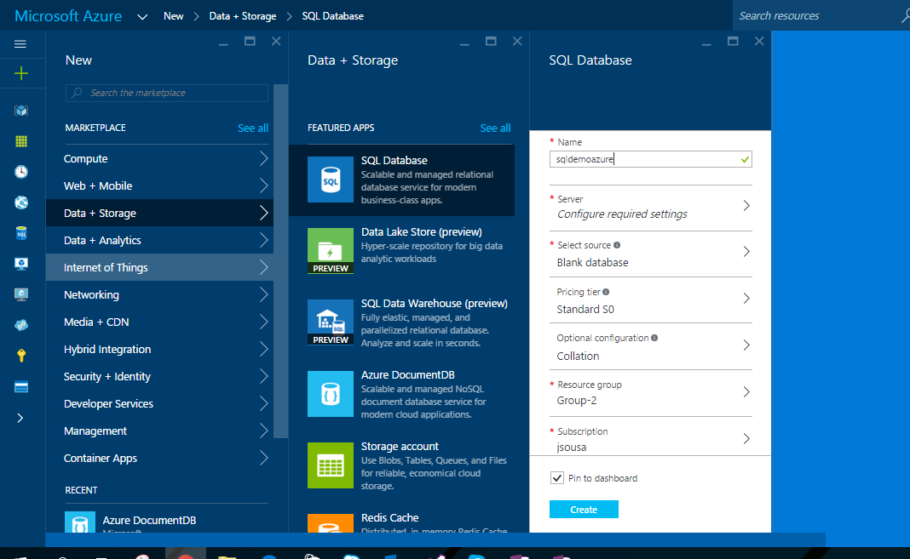
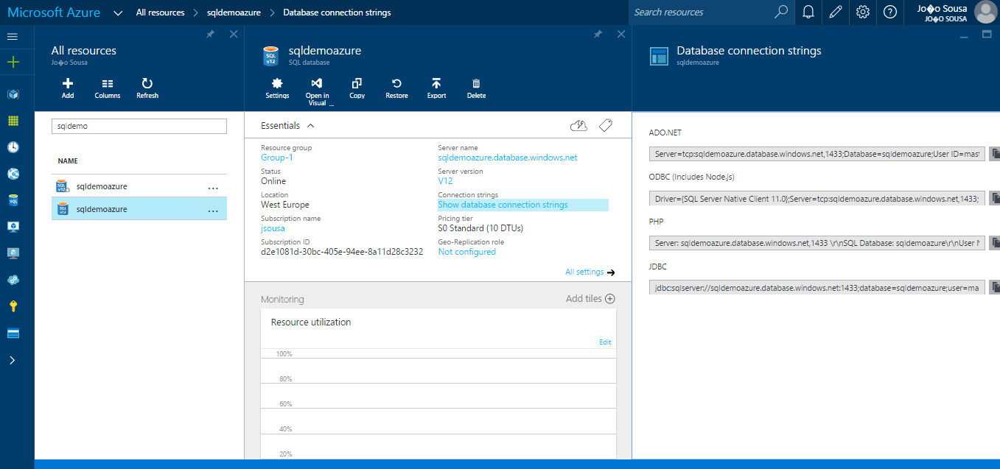
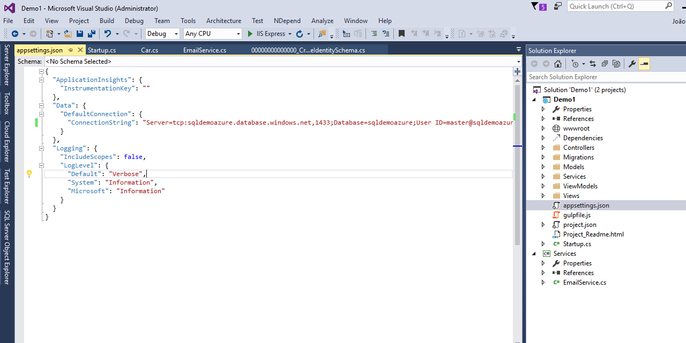
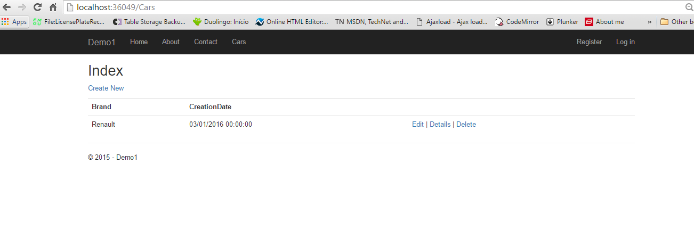

# ASP.NET 5 - Connect to SQL Azure Database
## Requires
- Visual Studio 2015
## License
- MIT
## Technologies
- C#
- SQL
- ASP.NET
- Azure
- Microsoft Azure
- ASP.NET MVC
- SQL Azure
- Microsoft Azure SQL Database
- ASP.NET5
## Topics
- C#
- SQL
- ASP.NET
- Azure
- Microsoft Azure
- ASP.NET MVC
- SQL Azure
- Microsoft Azure SQL Database
- ASP.NET5
## Updated
- 01/03/2016
## Description

<strong>Introduction</strong>

Using MVC, Entity Framework, ASP.NET5 Scaffolding, and Azure SQLServer you can create a web application that stores your information on an SQL Azure database. This demo shows you how to create a web application with MVC and Entity Framework
 7, that communicate with a SQL Azure database.

&nbsp;

<strong>STEP 1 - Create Azure Account</strong>

You need to get a Windows Azure account. Everyone can open a Windows Azure account for free.

Check the link below for more information.

<a href="http://www.windowsazure.com/en-us/pricing/free-trial/">http://www.windowsazure.com/en-us/pricing/free-trial/
</a>

&nbsp;

<strong>STEP 2 - Create SQL Database on Windows Azure</strong>

After get access to an Azure Account, we need to create a SQL Database to store your data.

So for that we need to select the option New on the left bottom of our web page and then select the option Data &#43; Storage -&gt; SQL Database-&gt; Set the name and provide the configurations you need.

On this case our SQL Database will have the name &quot;SQLDemoAzure&quot;.

After created the SQL Database, we need to get the connection string that will be used on Web Aplication to access the Azure SQL Database.

For that, select the databse created and on the main window, on the right side, we have an option called &quot;Show Connection String&quot;.

When we select that option, a new tabwill appear, like the following image, with the connection string formatted to different providers.

&nbsp;

<strong>STEP 3 - Create ASP.NET 5 Web Application</strong>

<ul type="disc">
<li lang="en-US">Open Visual Studio 2015 and create a new project of type ASP.NET 5 Web Application.
</li><li lang="en-US">On this project I create a solution called Demo. </li></ul>

&nbsp;

<ul type="disc">
<li>Press OK, and a new screen will appear, with several options of template to use on our project.
</li><li>Select the option MVC. </li></ul>

&nbsp;

After selection of our template, your first web application using ASP.NET 5 is created.

&nbsp;

&nbsp;

<strong>STEP 4 - Create Data Model</strong>

After we have our web application created, we need to ceate our data model.

For that, select the option Add New Item on solution and choose the option Class. Create the class like the one on the image above.&nbsp;

&nbsp;

&nbsp;

<strong>STEP 5 - Scaffolding</strong>

&nbsp;

This could be made easily using the Scaffolding functionality.

On the solution on the top of controller folder, select the option Add New Scaffold Item.

On the new screen, select the option MVC6 Controller with views using entity framework.

&nbsp;

Select the name of the controller, class model and data context class.

&nbsp;

The new controllers and views associated, was created with sucess.

&nbsp;

&nbsp;

<strong>STEP 6 - Change Connection String</strong>

For that just copy your database connection string, as explain on step1 and past into appsettings.json file.

&nbsp;

<strong>STEP 7 - Change Menu Layout</strong>

To test the two tables, we can add two new entries on the web application menu.

&nbsp;

<strong>STEP 8 - Run Application</strong>

Press now the F5 button, to run the web application.

The new entities appear on the menu.

&nbsp;

Press the option car to see our entiity in action

Checking the database, you can see the table corresponding to the entity created and the data inserted.

&nbsp;

&nbsp;

&nbsp;

&nbsp;

&nbsp;

&nbsp;

