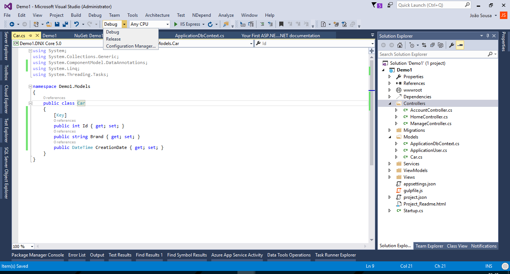
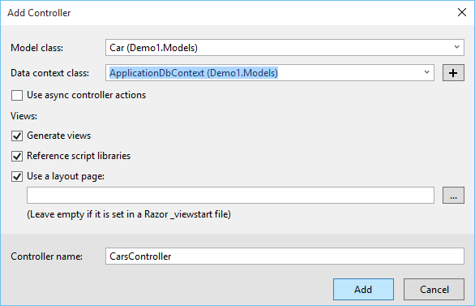
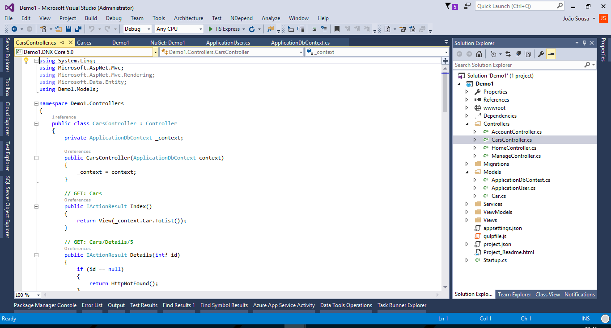
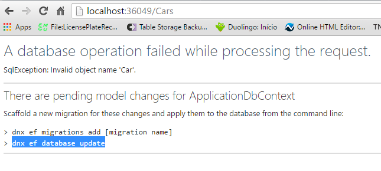
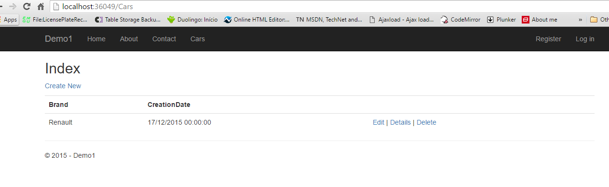

# ASP.NET 5 - Create Web Application Step by Step
## Requires
- Visual Studio 2015
## License
- MIT
## Technologies
- C#
- Code First
- MVC
- MVC 6
- ASP.NET 5
- vNext
- EF
- EF 7
## Topics
- C#
- Code First
- MVC
- MVC 6
- ASP.NET 5
- vNext
- EF
- EF 7
## Updated
- 12/17/2015
## Description

<strong>Introduction</strong>

Using MVC, Entity Framework, ASP.NET Scaffolding you can create a web application that stores your information. This demo shows you how to create a ASP.NET 5 web application with MVC and Entity Framework 7.

&nbsp;

<strong>STEP 1 - Create ASP.NET 5 Web Application</strong>

<ul type="disc">
<li lang="en-US">Open Visual Studio 2015 and create a new project of type ASP.NET 5 Web Application.
</li><li lang="en-US">On this project I create a solution called Demo. </li></ul>

<ul type="disc">
<li>Press OK, and a new screen will appear, with several options of template to use on our project.
</li><li>Select the option MVC. </li></ul>

After selection of our template, your first web application using ASP.NET 5 is created.

&nbsp;

&nbsp;

<strong>STEP 2 - Create Data Model</strong>

After we have our web application created, we need to ceate our data model.

For that, select the option Add New Item on solution and choose the option Class. Create the class like the one on the image above.

&nbsp;

<strong>STEP 3 - Scaffolding</strong>

This could be made easily using the Scaffolding functionality.

On the solution on the top of controller folder, select the option Add New Scaffold Item.

&nbsp;

On the new screen, select the option MVC6 Controller with views using entity framework.

&nbsp;

Select the name of the controller, class model and data context class.

&nbsp;

The new controllers and views associated, was created with sucess.

&nbsp;

&nbsp;

<strong>STEP 4 - Change Menu Layout</strong>

To test the two tables, we can add two new entries on the web application menu.

&nbsp;

<strong>STEP 5 - Run Application</strong>

Press now the F5 button, to run the web application.

The new entities appear on the menu.

&nbsp;

Press the option car to see our entiity in action

An message error will appear sayng that the entity doesn't exists on internal database and that we need to create it using some commands on package manager console.

&nbsp;

Execute the commands like on the image above na try again

An thats it! Now its working

&nbsp;

