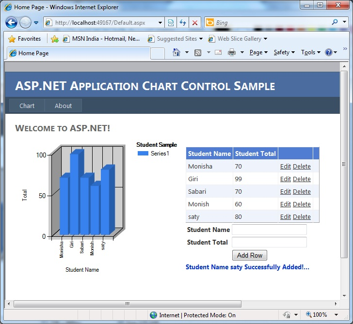
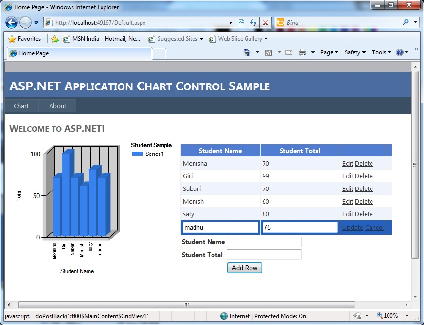
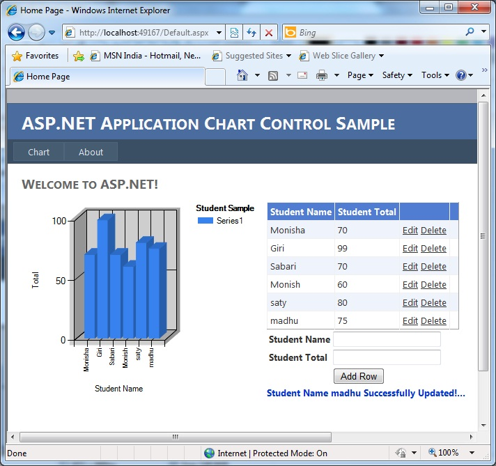
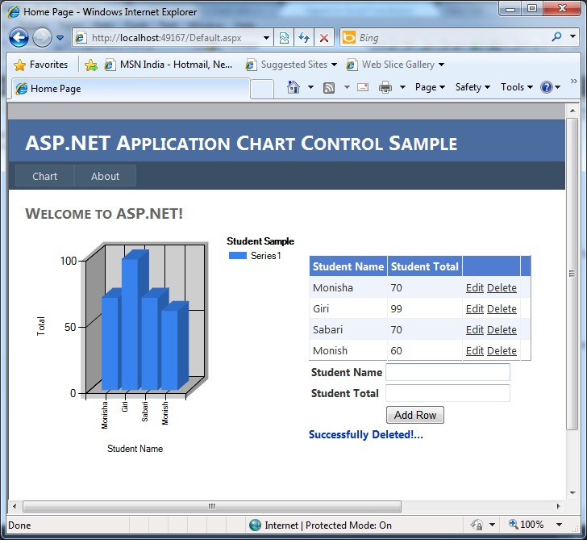

# ASP.NET Chart Control Sample Web Application
## Requires
- Visual Studio 2010
## License
- Apache License, Version 2.0
## Technologies
- ASP.NET
- ASP.NET Code Sample Downloads
## Topics
- ASP.NET
- ASP.NET Code Sample Downloads
- ASPNET
- Chart Control
## Updated
- 08/17/2012
## Description

<h1>Introduction</h1>

<em>This &nbsp;Article shows how to make a 3D Pie chart from a datatable&nbsp;In Business Application reporting functionality is important.&nbsp;</em>

<em>1)Download My Sample.</em>

<em>2)Inside that folder Student.sql file will be there execute it in your database<em>.<em><em>&nbsp;<em><em>&nbsp;</em></em></em></em></em></em><em>&nbsp;</em>

<em>SQL</em>

<em>Edit|Remove</em>

<em>mysql
<pre class="hidden">USE [master]
GO

/****** Object:  Table [dbo].[Student]    Script Date: 08/17/2012 18:31:11 ******/
SET ANSI_NULLS ON
GO

SET QUOTED_IDENTIFIER ON
GO

SET ANSI_PADDING ON
GO

CREATE TABLE [dbo].[Student](
	[pk_id] [int] IDENTITY(1,1) NOT NULL,
	[StudName] [varchar](50) NULL,
	[StudTotal] [int] NULL,
PRIMARY KEY CLUSTERED 
(
	[pk_id] ASC
)WITH (PAD_INDEX  = OFF, STATISTICS_NORECOMPUTE  = OFF, IGNORE_DUP_KEY = OFF, ALLOW_ROW_LOCKS  = ON, ALLOW_PAGE_LOCKS  = ON) ON [PRIMARY]
) ON [PRIMARY]

GO

SET ANSI_PADDING OFF
GO
</pre>

<pre class="js">USE&nbsp;[master]&nbsp;
GO&nbsp;
&nbsp;
/******&nbsp;Object:&nbsp;&nbsp;Table&nbsp;[dbo].[Student]&nbsp;&nbsp;&nbsp;&nbsp;Script&nbsp;Date:&nbsp;08/17/2012&nbsp;18:31:11&nbsp;******/&nbsp;
SET&nbsp;ANSI_NULLS&nbsp;ON&nbsp;
GO&nbsp;
&nbsp;
SET&nbsp;QUOTED_IDENTIFIER&nbsp;ON&nbsp;
GO&nbsp;
&nbsp;
SET&nbsp;ANSI_PADDING&nbsp;ON&nbsp;
GO&nbsp;
&nbsp;
CREATE&nbsp;TABLE&nbsp;[dbo].[Student](&nbsp;
&nbsp;&nbsp;&nbsp;&nbsp;[pk_id]&nbsp;[int]&nbsp;IDENTITY(1,1)&nbsp;NOT&nbsp;NULL,&nbsp;
&nbsp;&nbsp;&nbsp;&nbsp;[StudName]&nbsp;[varchar](50)&nbsp;NULL,&nbsp;
&nbsp;&nbsp;&nbsp;&nbsp;[StudTotal]&nbsp;[int]&nbsp;NULL,&nbsp;
PRIMARY&nbsp;KEY&nbsp;CLUSTERED&nbsp;&nbsp;
(&nbsp;
&nbsp;&nbsp;&nbsp;&nbsp;[pk_id]&nbsp;ASC&nbsp;
)WITH&nbsp;(PAD_INDEX&nbsp;&nbsp;=&nbsp;OFF,&nbsp;STATISTICS_NORECOMPUTE&nbsp;&nbsp;=&nbsp;OFF,&nbsp;IGNORE_DUP_KEY&nbsp;=&nbsp;OFF,&nbsp;ALLOW_ROW_LOCKS&nbsp;&nbsp;=&nbsp;ON,&nbsp;ALLOW_PAGE_LOCKS&nbsp;&nbsp;=&nbsp;ON)&nbsp;ON&nbsp;[PRIMARY]&nbsp;
)&nbsp;ON&nbsp;[PRIMARY]&nbsp;
&nbsp;
GO&nbsp;
&nbsp;
SET&nbsp;ANSI_PADDING&nbsp;OFF&nbsp;
GO&nbsp;
</pre>

</em>

<em>&nbsp;<em><em>

&nbsp;<em>3)Change the connetion string in web.config file.</em><em>&nbsp;</em><em>&nbsp;</em>

</em></em></em>

<em>C#</em>

<em>Edit|Remove</em>

<em>csharp
<pre class="hidden">	&lt;add name=&quot;MyConnection&quot; connectionString=&quot;Data Source=MONISH-PC\MONISH;Initial Catalog=master;Persist Security Info=True;User ID=saty;Password=1234&quot; providerName=&quot;System.Data.SqlClient&quot;/&gt;
	&lt;/connectionStrings&gt;
</pre>

<pre class="js">&nbsp;&nbsp;&nbsp;&nbsp;&lt;add&nbsp;name=&quot;MyConnection&quot;&nbsp;connectionString=&quot;Data&nbsp;Source=MONISH-PC\MONISH;Initial&nbsp;Catalog=master;Persist&nbsp;Security&nbsp;Info=True;User&nbsp;ID=saty;Password=1234&quot;&nbsp;providerName=&quot;System.Data.SqlClient&quot;/&gt;&nbsp;
&nbsp;&nbsp;&nbsp;&nbsp;&lt;/connectionStrings&gt;&nbsp;
</pre>

</em>

<em>&nbsp;4.Build the Application it will work fine..Read on to learn more!</em>

&nbsp;

<h1>Building the Sample</h1>
<ul>
<li><em>Add New Project Choose Web Forms Application.</em>
</li><li><em>Create a Student table in sql server by executing this sql file student.sql</em>
</li><li><em>Adding ASP.NET Chart Control to web forms.</em>
</li><li><em>drag the&nbsp;</em><em>Chart Control and gridview control.</em>
</li><li><em>Using Same Model layer with ASP.NET GridView with Enabling &nbsp;Edit / Delete support of records in SQL server database.</em>
</li><li><em>Reflecting the changes in Chart Controls after editing records from GridView.</em>
</li><li><em>Dynamically changing ASP.NET 4.0 Chart Control Type.</em>
</li></ul>

&nbsp;

&nbsp;

&nbsp;

&nbsp;

&nbsp;

Description

A chart consists of one or more series, which are lists of data points. Typically, each data point is a pair of numbers that provide both the X value and Y value to be plotted.&nbsp;In this sample i coded X value for Student
 Name and Y Value for Total Marks for particular student.

&nbsp;

<h1>Source Code Files</h1>
<ul>
<li><em>student.sql</em> </li></ul>
<h1>More Information</h1>

<em>The Microsoft Chart controls make it easy to take data from a database or some other data store and present it as a chart.you can bind an ADO.NET Dataset directly to the Chart</em>

