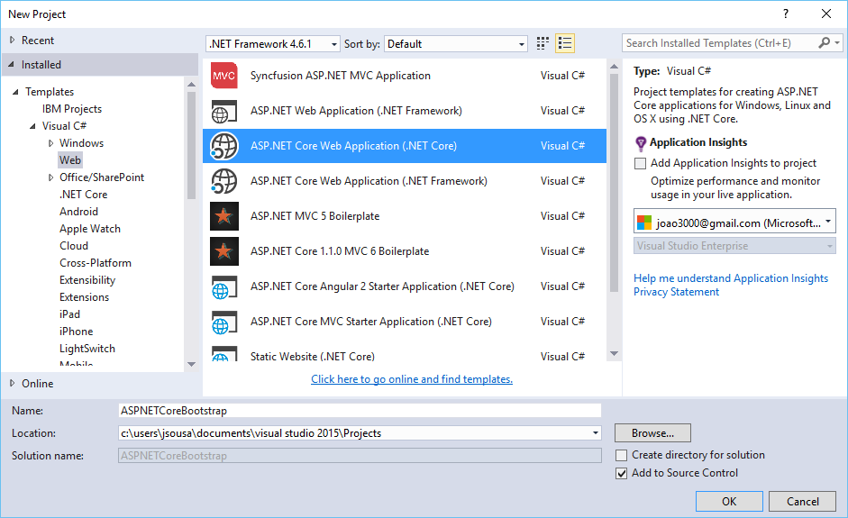
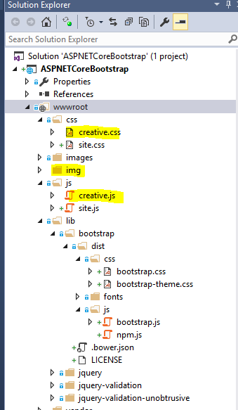
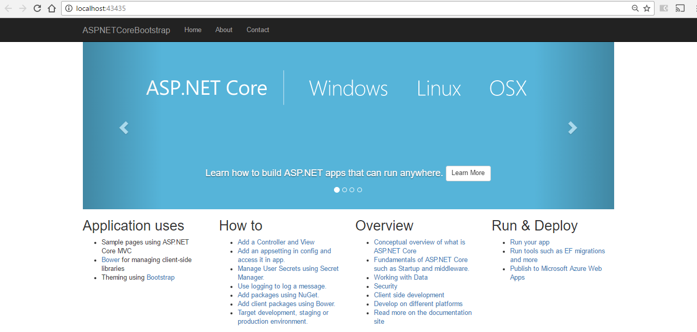

# ASP.NET Core 1.0 - Change Bootstrap layout in 3 Steps
## Requires
- Visual Studio 2015
## License
- MIT
## Technologies
- C#
- ASP.NET
- Bootstrap
- ASP.NET Core
## Topics
- C#
- Bootstrap
- ASP.NET Core
- ASP:NET
## Updated
- 01/09/2017
## Description

<strong>Introduction</strong>

This article walks you through the steps for creating a ASP.NET Core Web Application using Bootstrap as template for layout and change it to a new one.

<strong>STEP 1 - Create ASP.NET Web Application</strong>

<ul type="disc">
<li lang="en-US">Open Visual Studio 2015 and create a new project of type ASP.NET Core Web Application.
</li><li lang="en-US">On this project I create a solution called ASPNETCoreBootstrap.
</li></ul>

&nbsp;&nbsp;

<ul type="disc">
<li>Press OK, and a new screen will appear, with several options of template to use on our project.
</li><li>Select the option web Application. </li></ul>

&nbsp;

<strong>STEP 2 - Upgrade version if necessary</strong>

You can verify the version of bootstrap on two ways.

First one, accessing the files on lib\bootstrap\dist\css folder. If open for example the file Bootstrap.css, we can check that the version of bootstrap is the 3.3.6

&nbsp;

Another way to verify the bootstrap version is to check the installed Bower package.

<ul type="disc">
<li>Right click the solution and select&nbsp;Manage Bower packages for solution.. option.
</li><li>In the Manage Bower screen, select&nbsp;Installed Packages&nbsp;section.
</li><li>Then select the&nbsp;bootstrap&nbsp;package in the center pane to see the version details.
</li></ul>

As you see the version is 3.3.6

&nbsp;

<strong>STEP 3 - Change Layout</strong>

The default bootstrap&nbsp;template&nbsp;used in&nbsp;Visual Studio 2015&nbsp;is&nbsp;Jumbotron.&nbsp;Jumpotron&rsquo;s original source code is available&nbsp;<a href="http://getbootstrap.com/getting-started/#download">here</a>&nbsp;in bootstrap website.

On this sample we will change this template to a free bootstrap template Creative that could be download here:
<a href="https://startbootstrap.com/template-overviews/creative/">https://startbootstrap.com/template-overviews/creative/</a>.

To made tha t change we need to:

<ul type="disc">
<li>Add the style sheet&nbsp;creative.css&nbsp;to the&nbsp;CSS
folder </li><li>Add the style sheet&nbsp;creative.js to the&nbsp;JS
folder </li><li>Add the img folder from template downloaded
</li></ul>

Now,&nbsp;open the layout file&nbsp;_Layout.cshtml&nbsp;in the&nbsp;Shared&nbsp;folder under&nbsp;Views&nbsp;Folder and copy the content from index.html to layout.cshtml according to your layout

This is the sample created with solution:

&nbsp;

This is the sample after our changes:

