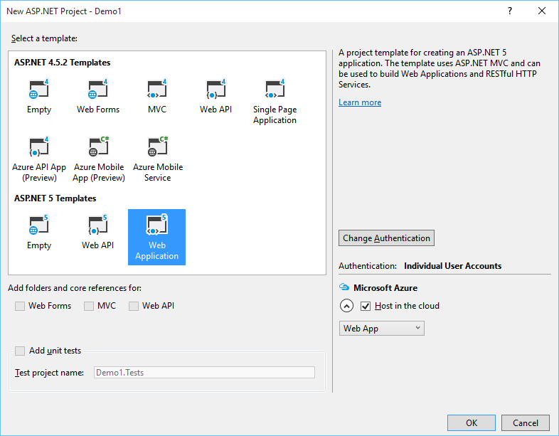
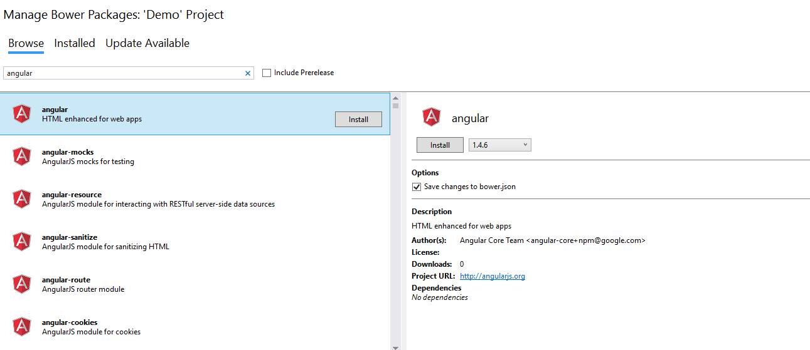
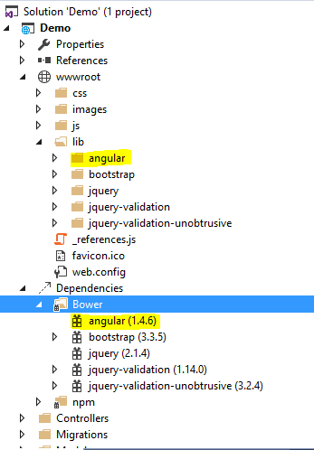

# ASP.NET Core 1.0 and AngularJS - Setup AngularJS
## Requires
- Visual Studio 2015
## License
- MIT
## Technologies
- C#
- ASP.NET
- AngularJS
## Topics
- C#
- ASP.NET
- AngularJS
## Updated
- 06/29/2016
## Description

<strong>Introduction</strong>

This demo shows you how to setup Angular on a ASP.NET 5 web application

&nbsp;

<strong>STEP 1 - Create ASP.NET 5 Web Application</strong>

&nbsp;

<ul type="disc">
<li lang="en-US">Open Visual Studio 2015 and create a new project of type ASP.NET 5 Web Application.
</li><li lang="en-US">On this project I create a solution called Demo. </li></ul>

<ul type="disc">
<li>Press OK, and a new screen will appear, with several options of template to use on our project.
</li><li>Select the option MVC. </li></ul>

After selection of our template, your first web application using ASP.NET 5 is created.

&nbsp;

<strong>STEP 2 - Configure Angular</strong>

To start using AngularJS in your ASP.NET application, you must either install it as part of your project, or reference it from a content delivery network (CDN).

You can add AngularJS using the built-in&nbsp;<a href="https://docs.asp.net/en/latest/client-side/bower.html#bower-index">Bower</a>&nbsp;support. Select
 Bower folder and choose Manage Bower Package has in the image below.

Then select Angular and install it on solution.

After installation, Angular should appear on lib and Bower Dependencies folder.

To finish this setup, we need to reference the angular script on our master page (on this case on _layout.cshtml).

On the body tag just add ng-app directive to indicate that the page is in AngularJS.

Then just to test, I create on the Index.html an expression {{10 &#43; 10}}, that in angular indicate to sum the two operators.

The result is on the image below

&nbsp;

<strong>References:</strong>

<a href="https://docs.asp.net/en/latest/client-side/using-gulp.html">https://docs.asp.net/en/latest/client-side/using-gulp.html</a>

&nbsp;

