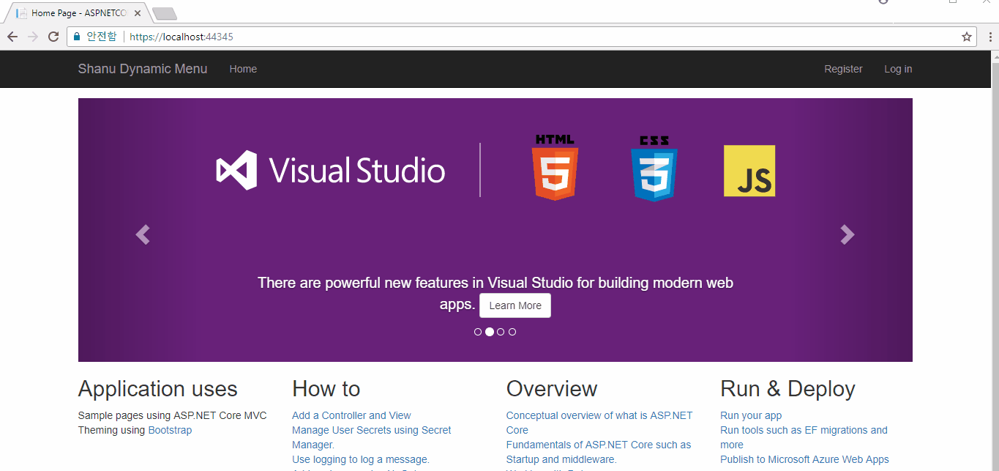
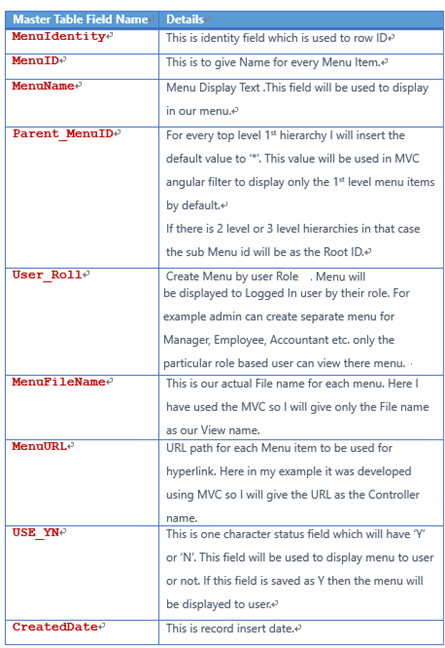
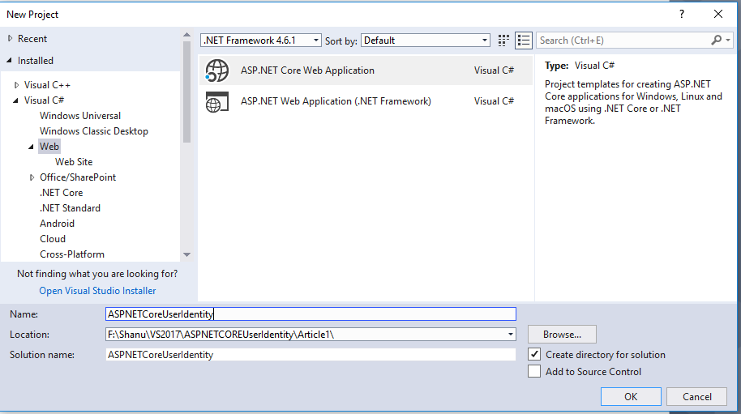
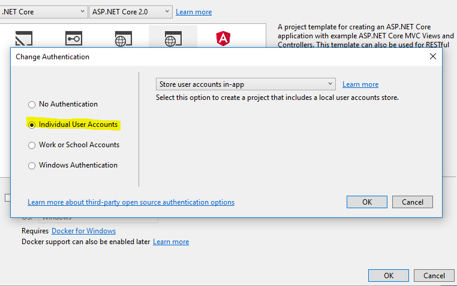
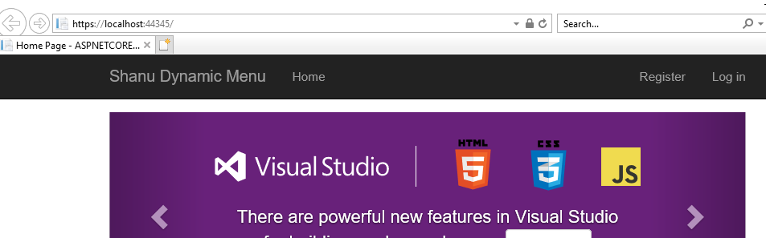
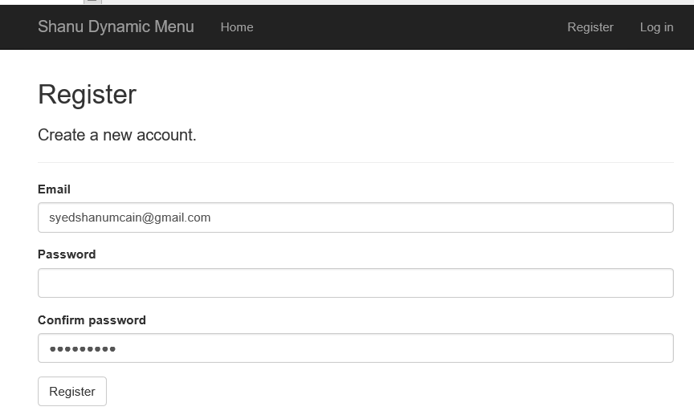
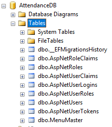

# ASP.NET Core 2.0 User Role Base Menu Management Using Dependency Injection
## Requires
- Visual Studio 2017
## License
- MIT
## Technologies
- ASP.NET Identity
- ASP.NET Core
- ASP.NET Core 2.0
## Topics
- ASP.NET Identity
- ASP.NET Core 2.0
## Updated
- 04/03/2018
## Description

<h1>Introduction</h1>

Before we start this article kindly read our previous article,

<ul>
<li><a href="https://code.msdn.microsoft.com/Getting-Started-With-e98e08b9" target="_blank">Getting Started With ASP.NET Core 2.0 Identity And Role Management</a>&nbsp;
</li></ul>

In our previous article we have discussed in detail about how to use ASP.NET Core Identity in MVC Application for creating user roles and displaying the menu depending on user roles.

In this article we will see in detail how to display role-based dynamic menu after a user logs in. For this we will create a Menu Master table and insert a few records to display the menu and link the URL to the menu based on the logged in user's role.

Here we will see how to:

<ul>
<li>Create default admin and manager users. </li><li>Create MenuMaster table and insert a few sample records for Admin and Manager roles to display menus.
</li><li>Redirect unauthenticated users to the login page.&nbsp; </li><li>Display menu dynamically based on logged in user. </li></ul>
<h1>Building the Sample</h1>
<h1><strong>Prerequisites 
</strong></h1>

Make sure you have installed all the prerequisites in your computer. If not, then download and install all, one by one.

<ol>
<li>First, download and install Visual Studio 2017 from this&nbsp;<a href="https://www.visualstudio.com/" target="_blank">link</a>
</li><li>SQL Server 2014 or above </li></ol>

Description

<h1><strong>Step 1: Create a Database</strong></h1>

This is in continuation of our previous article as we have told that, we will be using a Common Database for both ASP.NET Identity tables and for our own new tables

In our previous article we have explained about creating User Role, here for Role base Menu management we need to make a relationship table between ASP.NET Roles table and our menu table.

Let us see in detail about how to create our new Menu Table which has relationship with ASP.NET Identity AspNetRoles table.

Here we can see Field used for&nbsp;MenuMaster,

Firstly, we will create a Database and set the connection string in&nbsp;<strong>appsettings.json</strong>&nbsp;file for DefaultConnection with our new database connection. We will be using this database for ASP.NET Core Identity table creation.

Create Database: Run the following script to create our database MenuMaster table and sample Menu insert rows script.&nbsp;

&nbsp;

SQL

Edit|Remove

mysql

<pre class="js">USE&nbsp;MASTER&nbsp;&nbsp;&nbsp;&nbsp;&nbsp;&nbsp;&nbsp;&nbsp;
GO&nbsp;&nbsp;&nbsp;&nbsp;&nbsp;&nbsp;&nbsp;&nbsp;
&nbsp;&nbsp;&nbsp;&nbsp;&nbsp;&nbsp;&nbsp;&nbsp;
--&nbsp;1)&nbsp;Check&nbsp;for&nbsp;the&nbsp;Database&nbsp;Exists&nbsp;.If&nbsp;the&nbsp;database&nbsp;is&nbsp;exist&nbsp;then&nbsp;drop&nbsp;and&nbsp;create&nbsp;new&nbsp;DB&nbsp;&nbsp;&nbsp;&nbsp;&nbsp;&nbsp;&nbsp;&nbsp;
IF&nbsp;EXISTS&nbsp;(SELECT&nbsp;[name]&nbsp;FROM&nbsp;sys.databases&nbsp;WHERE&nbsp;[name]&nbsp;=&nbsp;'AttendanceDB'&nbsp;)&nbsp;&nbsp;&nbsp;&nbsp;&nbsp;&nbsp;&nbsp;&nbsp;
DROP&nbsp;DATABASE&nbsp;AttendanceDB&nbsp;&nbsp;&nbsp;&nbsp;&nbsp;&nbsp;&nbsp;&nbsp;
GO&nbsp;&nbsp;&nbsp;&nbsp;&nbsp;&nbsp;&nbsp;&nbsp;
&nbsp;&nbsp;&nbsp;&nbsp;&nbsp;&nbsp;&nbsp;&nbsp;
CREATE&nbsp;DATABASE&nbsp;AttendanceDB&nbsp;&nbsp;&nbsp;&nbsp;&nbsp;&nbsp;&nbsp;&nbsp;
GO&nbsp;&nbsp;&nbsp;&nbsp;&nbsp;&nbsp;&nbsp;&nbsp;
&nbsp;&nbsp;&nbsp;&nbsp;&nbsp;&nbsp;&nbsp;&nbsp;&nbsp;
&nbsp;
USE&nbsp;AttendanceDB&nbsp;&nbsp;&nbsp;&nbsp;&nbsp;
GO&nbsp;&nbsp;&nbsp;&nbsp;&nbsp;
&nbsp;&nbsp;&nbsp;
IF&nbsp;EXISTS&nbsp;(&nbsp;SELECT&nbsp;[name]&nbsp;FROM&nbsp;sys.tables&nbsp;WHERE&nbsp;[name]&nbsp;=&nbsp;'MenuMaster'&nbsp;)&nbsp;&nbsp;&nbsp;&nbsp;&nbsp;
DROP&nbsp;TABLE&nbsp;MenuMaster&nbsp;&nbsp;&nbsp;&nbsp;&nbsp;
GO&nbsp;&nbsp;&nbsp;&nbsp;&nbsp;
&nbsp;&nbsp;&nbsp;&nbsp;&nbsp;
CREATE&nbsp;TABLE&nbsp;MenuMaster&nbsp;&nbsp;&nbsp;&nbsp;&nbsp;
(&nbsp;&nbsp;&nbsp;&nbsp;&nbsp;
&nbsp;&nbsp;&nbsp;MenuIdentity&nbsp;int&nbsp;identity(1,1),&nbsp;&nbsp;&nbsp;&nbsp;&nbsp;
&nbsp;&nbsp;&nbsp;MenuID&nbsp;VARCHAR(30)&nbsp;&nbsp;NOT&nbsp;NULL,&nbsp;&nbsp;&nbsp;&nbsp;&nbsp;
&nbsp;&nbsp;&nbsp;MenuName&nbsp;VARCHAR(30)&nbsp;&nbsp;NOT&nbsp;NULL,&nbsp;&nbsp;&nbsp;
&nbsp;&nbsp;&nbsp;Parent_MenuID&nbsp;&nbsp;VARCHAR(30)&nbsp;&nbsp;NOT&nbsp;NULL,&nbsp;&nbsp;&nbsp;
&nbsp;&nbsp;&nbsp;User_Roll&nbsp;[varchar](256)&nbsp;NOT&nbsp;NULL,&nbsp;&nbsp;&nbsp;&nbsp;
&nbsp;&nbsp;&nbsp;MenuFileName&nbsp;VARCHAR(100)&nbsp;NOT&nbsp;NULL,&nbsp;&nbsp;&nbsp;&nbsp;&nbsp;&nbsp;
&nbsp;&nbsp;&nbsp;MenuURL&nbsp;VARCHAR(500)&nbsp;NOT&nbsp;NULL,&nbsp;&nbsp;&nbsp;&nbsp;&nbsp;
&nbsp;&nbsp;&nbsp;USE_YN&nbsp;Char(1)&nbsp;DEFAULT&nbsp;'Y',&nbsp;&nbsp;&nbsp;&nbsp;&nbsp;
&nbsp;&nbsp;&nbsp;CreatedDate&nbsp;datetime&nbsp;&nbsp;&nbsp;&nbsp;&nbsp;
CONSTRAINT&nbsp;[PK_MenuMaster]&nbsp;PRIMARY&nbsp;KEY&nbsp;CLUSTERED&nbsp;&nbsp;&nbsp;&nbsp;&nbsp;&nbsp;&nbsp;&nbsp;&nbsp;&nbsp;&nbsp;
(&nbsp;&nbsp;&nbsp;&nbsp;&nbsp;&nbsp;&nbsp;&nbsp;&nbsp;&nbsp;
&nbsp;&nbsp;[MenuIdentity]&nbsp;ASC&nbsp;&nbsp;&nbsp;,&nbsp;&nbsp;&nbsp;&nbsp;&nbsp;
&nbsp;&nbsp;[MenuID]&nbsp;ASC,&nbsp;&nbsp;&nbsp;&nbsp;&nbsp;
&nbsp;&nbsp;[MenuName]&nbsp;ASC&nbsp;&nbsp;&nbsp;&nbsp;&nbsp;&nbsp;&nbsp;
)WITH&nbsp;(PAD_INDEX&nbsp;&nbsp;=&nbsp;OFF,&nbsp;STATISTICS_NORECOMPUTE&nbsp;&nbsp;=&nbsp;OFF,&nbsp;IGNORE_DUP_KEY&nbsp;=&nbsp;OFF,&nbsp;ALLOW_ROW_LOCKS&nbsp;&nbsp;=&nbsp;ON,&nbsp;ALLOW_PAGE_LOCKS&nbsp;&nbsp;=&nbsp;ON)&nbsp;ON&nbsp;[PRIMARY]&nbsp;&nbsp;&nbsp;&nbsp;&nbsp;&nbsp;&nbsp;&nbsp;&nbsp;&nbsp;
)&nbsp;ON&nbsp;[PRIMARY]&nbsp;&nbsp;&nbsp;&nbsp;&nbsp;&nbsp;&nbsp;&nbsp;
&nbsp;&nbsp;&nbsp;&nbsp;
select&nbsp;*&nbsp;from&nbsp;MenuMaster&nbsp;&nbsp;&nbsp;
--&nbsp;Insert&nbsp;Admin&nbsp;User&nbsp;Details&nbsp;
Insert&nbsp;into&nbsp;MenuMaster(MenuID&nbsp;,MenuName,Parent_MenuID,User_Roll,MenuFileName,MenuURL,USE_YN,CreatedDate)&nbsp;
&nbsp;&nbsp;&nbsp;&nbsp;Values('AUSER','ADMIN&nbsp;Dashboard','*','ADMIN','INDEX','ADMINC','Y',getDate())&nbsp;&nbsp;&nbsp;
&nbsp;Insert&nbsp;into&nbsp;MenuMaster(MenuID&nbsp;,MenuName,Parent_MenuID,User_Roll,MenuFileName,MenuURL,USE_YN,CreatedDate)&nbsp;
&nbsp;&nbsp;&nbsp;&nbsp;Values('AAbout','About&nbsp;Admin','*','ADMIN','INDEX','ADMINAC','Y',getDate())&nbsp;&nbsp;&nbsp;&nbsp;
Insert&nbsp;into&nbsp;MenuMaster(MenuID&nbsp;,MenuName,Parent_MenuID,User_Roll,MenuFileName,MenuURL,USE_YN,CreatedDate)&nbsp;
&nbsp;&nbsp;&nbsp;&nbsp;Values('LStock','Live&nbsp;Stock','AUSER','ADMIN','INDEX','StockC','Y',getDate())&nbsp;&nbsp;&nbsp;&nbsp;&nbsp;&nbsp;
Insert&nbsp;into&nbsp;MenuMaster(MenuID&nbsp;,MenuName,Parent_MenuID,User_Roll,MenuFileName,MenuURL,USE_YN,CreatedDate)&nbsp;
&nbsp;&nbsp;&nbsp;&nbsp;Values('Profile','User&nbsp;Details','AUSER','ADMIN','INDEX','MemberC','Y',getDate())&nbsp;&nbsp;&nbsp;&nbsp;
Insert&nbsp;into&nbsp;MenuMaster(MenuID&nbsp;,MenuName,Parent_MenuID,User_Roll,MenuFileName,MenuURL,USE_YN,CreatedDate)&nbsp;
&nbsp;&nbsp;&nbsp;&nbsp;Values('MUSER','Manager&nbsp;Dashboard','*','ADMIN','INDEX','ManagerC','Y',getDate())&nbsp;&nbsp;&nbsp;
&nbsp;Insert&nbsp;into&nbsp;MenuMaster(MenuID&nbsp;,MenuName,Parent_MenuID,User_Roll,MenuFileName,MenuURL,USE_YN,CreatedDate)&nbsp;
&nbsp;&nbsp;&nbsp;&nbsp;Values('MAbout','About&nbsp;Manager','*','ADMIN','INDEX','ManagerAC','Y',getDate())&nbsp;&nbsp;&nbsp;&nbsp;
Insert&nbsp;into&nbsp;MenuMaster(MenuID&nbsp;,MenuName,Parent_MenuID,User_Roll,MenuFileName,MenuURL,USE_YN,CreatedDate)&nbsp;
&nbsp;&nbsp;&nbsp;&nbsp;Values('Accounts','Account&nbsp;Details','MUSER','ADMIN','INDEX','AccountC','Y',getDate())&nbsp;&nbsp;&nbsp;&nbsp;&nbsp;
&nbsp;&nbsp;&nbsp;&nbsp;Insert&nbsp;into&nbsp;MenuMaster(MenuID&nbsp;,MenuName,Parent_MenuID,User_Roll,MenuFileName,MenuURL,USE_YN,CreatedDate)&nbsp;
&nbsp;&nbsp;&nbsp;&nbsp;Values('Inventory','Inventory&nbsp;Details','MUSER','ADMIN','INDEX','InventoryC','Y',getDate())&nbsp;&nbsp;&nbsp;
&nbsp;
--&nbsp;Insert&nbsp;Manager&nbsp;User&nbsp;Details&nbsp;&nbsp;
Insert&nbsp;into&nbsp;MenuMaster(MenuID&nbsp;,MenuName,Parent_MenuID,User_Roll,MenuFileName,MenuURL,USE_YN,CreatedDate)&nbsp;
&nbsp;&nbsp;&nbsp;&nbsp;Values('MUSER','Manager&nbsp;Dashboard','*','Manager','INDEX','ManagerC','Y',getDate())&nbsp;&nbsp;&nbsp;
&nbsp;Insert&nbsp;into&nbsp;MenuMaster(MenuID&nbsp;,MenuName,Parent_MenuID,User_Roll,MenuFileName,MenuURL,USE_YN,CreatedDate)&nbsp;
&nbsp;&nbsp;&nbsp;&nbsp;Values('MAbout','About&nbsp;Manager','*','Manager','INDEX','ManagerAC','Y',getDate())&nbsp;&nbsp;&nbsp;&nbsp;
Insert&nbsp;into&nbsp;MenuMaster(MenuID&nbsp;,MenuName,Parent_MenuID,User_Roll,MenuFileName,MenuURL,USE_YN,CreatedDate)&nbsp;
&nbsp;&nbsp;&nbsp;&nbsp;Values('Accounts','Account&nbsp;Details','MUSER','Manager','INDEX','AccountC','Y',getDate())&nbsp;&nbsp;&nbsp;&nbsp;&nbsp;&nbsp;
Insert&nbsp;into&nbsp;MenuMaster(MenuID&nbsp;,MenuName,Parent_MenuID,User_Roll,MenuFileName,MenuURL,USE_YN,CreatedDate)&nbsp;
&nbsp;&nbsp;&nbsp;&nbsp;Values('Inventory','Inventory&nbsp;Details','MUSER','Manager','INDEX','InventoryC','Y',getDate())&nbsp;&nbsp;&nbsp;&nbsp;
&nbsp;
&nbsp;
select&nbsp;*&nbsp;from&nbsp;MenuMaster&nbsp;&nbsp;
&nbsp;
select&nbsp;*&nbsp;from&nbsp;AspnetUserRoles&nbsp;
</pre>

&nbsp;

Here we can see the format we are using in our Menu Master table to insert our records for display menu based on user role.

MenuID = 'AUSER' (We will give unique menu ID)

MenuName = 'ADMIN Dashboard' (We will give menu display text),

Parent_MenuID = '*&rsquo; (If this is main menu then we will give here as &ldquo;*&rdquo; else we will give the MenuID of previous records to display this record to show as submenu)

User_Roll = 'ADMIN' (Here we will give the User Role, if same menu need to be used for multiple roles based users like Admin, Manager, Accountant and etc. then we will insert the same menu details with different user roles. In our sample we have added the
 same menu details as 'Manager Dashboard' for both Admin and Manager User as both can view the menu and page.)

,MenuFileName = 'INDEX' (Here we give our View name to be displayed when the menu is clicked)

MenuURL = 'ADMINC' (Here we give our Controller name to be displayed when the menu is clicked)

USE_YN = 'Y' (This is optional field as we can use this as to display menu or not)

CreatedDate = getDate() &nbsp;(This also optional as to input the Crete date)&nbsp;

In this demo application we have already all the needed controllers and view to be displayed when user click on menu

<h1>Step 2: <strong>Create your ASP.NET Core&nbsp; </strong></h1>

<strong>&nbsp;</strong>After installing our Visual Studio 2017 click Start, then Programs and select&nbsp;<strong>Visual Studio 2017</strong>&nbsp;- Click&nbsp;<strong>Visual Studio 2017</strong>. Click New, then Project, select Web and then select&nbsp;<strong>ASP.NET
 Core Web Application</strong>. Enter your project name and click&nbsp;

Select Web Application(Model-View-Controller) and click on the Change Authentication

&nbsp;

Select Individual User Accounts and click ok to create your project.

<h2><strong>Updating appsettings.json</strong>&nbsp;</h2>

In <strong>appsettings.json</strong>&nbsp; file we can find the&nbsp;DefaultConnection&nbsp;Connection string.Here in connection string change your SQL Server Name, UID and PWD to create and store all user details in one database.&nbsp;

&nbsp;

XML

Edit|Remove

xml

<pre class="js">&quot;ConnectionStrings&quot;:&nbsp;{&quot;DefaultConnection&quot;:&nbsp;&quot;Server=&nbsp;YOURSERVERNAME;Database=InventoryDB;user&nbsp;id=&nbsp;YOURSQLUSERID;password=YOURSQLPASSWORD;Trusted_Connection=True;MultipleActiveResultSets=true&quot;},&nbsp;
</pre>

&nbsp;

<h1><strong>Step 3: Add Identity Service in Startup.cs file</strong></h1>

By default, in your ASP.NET Core application the Identity Service will be added in Startup.cs File /ConfigureServices method. You can also additionally add the password strength while user the register and also set the default login page/logout page and
 also AccessDenaiedPath by using the fallowing code.

&nbsp;

C#

Edit|Remove

csharp

<pre class="js">services.AddIdentity&lt;ApplicationUser,&nbsp;IdentityRole&gt;()&nbsp;
&nbsp;&nbsp;&nbsp;&nbsp;&nbsp;&nbsp;&nbsp;&nbsp;&nbsp;&nbsp;&nbsp;&nbsp;&nbsp;&nbsp;&nbsp;&nbsp;.AddEntityFrameworkStores&lt;ApplicationDbContext&gt;()&nbsp;
&nbsp;&nbsp;&nbsp;&nbsp;&nbsp;&nbsp;&nbsp;&nbsp;&nbsp;&nbsp;&nbsp;&nbsp;&nbsp;&nbsp;&nbsp;&nbsp;.AddDefaultTokenProviders();&nbsp;
&nbsp;
&nbsp;
&nbsp;&nbsp;&nbsp;&nbsp;&nbsp;&nbsp;&nbsp;&nbsp;&nbsp;&nbsp;&nbsp;&nbsp;//Password&nbsp;Strength&nbsp;Setting&nbsp;
&nbsp;&nbsp;&nbsp;&nbsp;&nbsp;&nbsp;&nbsp;&nbsp;&nbsp;&nbsp;&nbsp;&nbsp;services.Configure&lt;IdentityOptions&gt;(options&nbsp;=&gt;&nbsp;
&nbsp;&nbsp;&nbsp;&nbsp;&nbsp;&nbsp;&nbsp;&nbsp;&nbsp;&nbsp;&nbsp;&nbsp;{//&nbsp;Password&nbsp;settings&nbsp;
&nbsp;&nbsp;&nbsp;&nbsp;&nbsp;&nbsp;&nbsp;&nbsp;&nbsp;&nbsp;&nbsp;&nbsp;&nbsp;&nbsp;&nbsp;&nbsp;options.Password.RequireDigit&nbsp;=&nbsp;true;&nbsp;
&nbsp;&nbsp;&nbsp;&nbsp;&nbsp;&nbsp;&nbsp;&nbsp;&nbsp;&nbsp;&nbsp;&nbsp;&nbsp;&nbsp;&nbsp;&nbsp;options.Password.RequiredLength&nbsp;=&nbsp;8;&nbsp;
&nbsp;&nbsp;&nbsp;&nbsp;&nbsp;&nbsp;&nbsp;&nbsp;&nbsp;&nbsp;&nbsp;&nbsp;&nbsp;&nbsp;&nbsp;&nbsp;options.Password.RequireNonAlphanumeric&nbsp;=&nbsp;false;&nbsp;
&nbsp;&nbsp;&nbsp;&nbsp;&nbsp;&nbsp;&nbsp;&nbsp;&nbsp;&nbsp;&nbsp;&nbsp;&nbsp;&nbsp;&nbsp;&nbsp;options.Password.RequireUppercase&nbsp;=&nbsp;true;&nbsp;
&nbsp;&nbsp;&nbsp;&nbsp;&nbsp;&nbsp;&nbsp;&nbsp;&nbsp;&nbsp;&nbsp;&nbsp;&nbsp;&nbsp;&nbsp;&nbsp;options.Password.RequireLowercase&nbsp;=&nbsp;false;&nbsp;
&nbsp;&nbsp;&nbsp;&nbsp;&nbsp;&nbsp;&nbsp;&nbsp;&nbsp;&nbsp;&nbsp;&nbsp;&nbsp;&nbsp;&nbsp;&nbsp;options.Password.RequiredUniqueChars&nbsp;=&nbsp;6;&nbsp;
&nbsp;
&nbsp;&nbsp;&nbsp;&nbsp;&nbsp;&nbsp;&nbsp;&nbsp;&nbsp;&nbsp;&nbsp;&nbsp;&nbsp;&nbsp;&nbsp;&nbsp;//&nbsp;Lockout&nbsp;settings&nbsp;
&nbsp;&nbsp;&nbsp;&nbsp;&nbsp;&nbsp;&nbsp;&nbsp;&nbsp;&nbsp;&nbsp;&nbsp;&nbsp;&nbsp;&nbsp;&nbsp;options.Lockout.DefaultLockoutTimeSpan&nbsp;=&nbsp;TimeSpan.FromMinutes(30);&nbsp;
&nbsp;&nbsp;&nbsp;&nbsp;&nbsp;&nbsp;&nbsp;&nbsp;&nbsp;&nbsp;&nbsp;&nbsp;&nbsp;&nbsp;&nbsp;&nbsp;options.Lockout.MaxFailedAccessAttempts&nbsp;=&nbsp;10;&nbsp;
&nbsp;&nbsp;&nbsp;&nbsp;&nbsp;&nbsp;&nbsp;&nbsp;&nbsp;&nbsp;&nbsp;&nbsp;&nbsp;&nbsp;&nbsp;&nbsp;options.Lockout.AllowedForNewUsers&nbsp;=&nbsp;true;&nbsp;
&nbsp;
&nbsp;&nbsp;&nbsp;&nbsp;&nbsp;&nbsp;&nbsp;&nbsp;&nbsp;&nbsp;&nbsp;&nbsp;&nbsp;&nbsp;&nbsp;&nbsp;//&nbsp;User&nbsp;settings&nbsp;
&nbsp;&nbsp;&nbsp;&nbsp;&nbsp;&nbsp;&nbsp;&nbsp;&nbsp;&nbsp;&nbsp;&nbsp;&nbsp;&nbsp;&nbsp;&nbsp;options.User.RequireUniqueEmail&nbsp;=&nbsp;true;&nbsp;
&nbsp;&nbsp;&nbsp;&nbsp;&nbsp;&nbsp;&nbsp;&nbsp;&nbsp;&nbsp;&nbsp;&nbsp;});&nbsp;
&nbsp;
&nbsp;&nbsp;&nbsp;&nbsp;&nbsp;&nbsp;&nbsp;&nbsp;&nbsp;&nbsp;&nbsp;&nbsp;//Seting&nbsp;the&nbsp;Account&nbsp;Login&nbsp;page&nbsp;
&nbsp;&nbsp;&nbsp;&nbsp;&nbsp;&nbsp;&nbsp;&nbsp;&nbsp;&nbsp;&nbsp;&nbsp;services.ConfigureApplicationCookie(options&nbsp;=&gt;&nbsp;
&nbsp;&nbsp;&nbsp;&nbsp;&nbsp;&nbsp;&nbsp;&nbsp;&nbsp;&nbsp;&nbsp;&nbsp;{//&nbsp;Cookie&nbsp;settings&nbsp;
&nbsp;&nbsp;&nbsp;&nbsp;&nbsp;&nbsp;&nbsp;&nbsp;&nbsp;&nbsp;&nbsp;&nbsp;&nbsp;&nbsp;&nbsp;&nbsp;options.Cookie.HttpOnly&nbsp;=&nbsp;true;&nbsp;
&nbsp;&nbsp;&nbsp;&nbsp;&nbsp;&nbsp;&nbsp;&nbsp;&nbsp;&nbsp;&nbsp;&nbsp;&nbsp;&nbsp;&nbsp;&nbsp;options.ExpireTimeSpan&nbsp;=&nbsp;TimeSpan.FromMinutes(30);&nbsp;
&nbsp;&nbsp;&nbsp;&nbsp;&nbsp;&nbsp;&nbsp;&nbsp;&nbsp;&nbsp;&nbsp;&nbsp;&nbsp;&nbsp;&nbsp;&nbsp;options.LoginPath&nbsp;=&nbsp;&quot;/Account/Login&quot;;&nbsp;//&nbsp;If&nbsp;the&nbsp;LoginPath&nbsp;is&nbsp;not&nbsp;set&nbsp;here,&nbsp;ASP.NET&nbsp;Core&nbsp;will&nbsp;default&nbsp;to&nbsp;/Account/Login&nbsp;
&nbsp;&nbsp;&nbsp;&nbsp;&nbsp;&nbsp;&nbsp;&nbsp;&nbsp;&nbsp;&nbsp;&nbsp;&nbsp;&nbsp;&nbsp;&nbsp;options.LogoutPath&nbsp;=&nbsp;&quot;/Account/Logout&quot;;&nbsp;//&nbsp;If&nbsp;the&nbsp;LogoutPath&nbsp;is&nbsp;not&nbsp;set&nbsp;here,&nbsp;ASP.NET&nbsp;Core&nbsp;will&nbsp;default&nbsp;to&nbsp;/Account/Logout&nbsp;
&nbsp;&nbsp;&nbsp;&nbsp;&nbsp;&nbsp;&nbsp;&nbsp;&nbsp;&nbsp;&nbsp;&nbsp;&nbsp;&nbsp;&nbsp;&nbsp;options.AccessDeniedPath&nbsp;=&nbsp;&quot;/Account/AccessDenied&quot;;&nbsp;//&nbsp;If&nbsp;the&nbsp;AccessDeniedPath&nbsp;is&nbsp;not&nbsp;set&nbsp;here,&nbsp;ASP.NET&nbsp;Core&nbsp;will&nbsp;default&nbsp;to&nbsp;/Account/AccessDenied&nbsp;
&nbsp;&nbsp;&nbsp;&nbsp;&nbsp;&nbsp;&nbsp;&nbsp;&nbsp;&nbsp;&nbsp;&nbsp;&nbsp;&nbsp;&nbsp;&nbsp;options.SlidingExpiration&nbsp;=&nbsp;true;&nbsp;
&nbsp;&nbsp;&nbsp;&nbsp;&nbsp;&nbsp;&nbsp;&nbsp;&nbsp;&nbsp;&nbsp;&nbsp;});&nbsp;
</pre>

&nbsp;

<h1><strong>Step 4: Register and Create Users</strong></h1>

Now our Asp.NET Core web application is ready for user to register in our website and also user can login to our system after registration. We will be doing the Authorization by adding role to user in next steps. Build and run your application to register
 your first default Admin user.

Here we will be registering two users as one for Admin and another user for Manager. We will be using this users for adding roles. We will create 2 users as
<a href="mailto:syedshanumcain@gmail.com">syedshanumcain@gmail.com</a> and <a href="mailto:afraz@gmail.com">
afraz@gmail.com</a> . Note: You can create users as per your need and change the user details in startup code for adding roles to users.

<h2><strong>Refresh the Database:</strong></h2>

When we refresh our database, we can see all the Identity tables has been created.

<h1><strong>Step 5: Create Role and assign User for Role</strong></h1>

We use the below method to create a new Role&rsquo;s as &ldquo;Admin&rdquo; and &ldquo;Manager&rdquo; , we will assign the recently registered users as &ldquo;Admin&rdquo; &nbsp;and&nbsp; &ldquo;Manager&rdquo; to our website. Open Startup.cs file and add
 this method in your Startup.cs file.

&nbsp;

C#

Edit|Remove

csharp

<pre class="js">private&nbsp;async&nbsp;Task&nbsp;CreateUserRoles(IServiceProvider&nbsp;serviceProvider)&nbsp;
&nbsp;&nbsp;&nbsp;&nbsp;&nbsp;&nbsp;&nbsp;&nbsp;{var&nbsp;RoleManager&nbsp;=&nbsp;serviceProvider.GetRequiredService&lt;RoleManager&lt;IdentityRole&gt;&gt;();&nbsp;
&nbsp;&nbsp;&nbsp;&nbsp;&nbsp;&nbsp;&nbsp;&nbsp;&nbsp;&nbsp;&nbsp;&nbsp;var&nbsp;UserManager&nbsp;=&nbsp;serviceProvider.GetRequiredService&lt;UserManager&lt;ApplicationUser&gt;&gt;();&nbsp;
&nbsp;
&nbsp;
&nbsp;&nbsp;&nbsp;&nbsp;&nbsp;&nbsp;&nbsp;&nbsp;&nbsp;&nbsp;&nbsp;&nbsp;IdentityResult&nbsp;roleResult;&nbsp;
&nbsp;&nbsp;&nbsp;&nbsp;&nbsp;&nbsp;&nbsp;&nbsp;&nbsp;&nbsp;&nbsp;&nbsp;//Adding&nbsp;Addmin&nbsp;Role&nbsp;&nbsp;var&nbsp;roleCheck&nbsp;=&nbsp;await&nbsp;RoleManager.RoleExistsAsync(&quot;Admin&quot;);&nbsp;
&nbsp;&nbsp;&nbsp;&nbsp;&nbsp;&nbsp;&nbsp;&nbsp;&nbsp;&nbsp;&nbsp;&nbsp;if&nbsp;(!roleCheck)&nbsp;
&nbsp;&nbsp;&nbsp;&nbsp;&nbsp;&nbsp;&nbsp;&nbsp;&nbsp;&nbsp;&nbsp;&nbsp;{//create&nbsp;the&nbsp;roles&nbsp;and&nbsp;seed&nbsp;them&nbsp;to&nbsp;the&nbsp;database&nbsp;&nbsp;&nbsp;
&nbsp;&nbsp;&nbsp;&nbsp;&nbsp;&nbsp;&nbsp;&nbsp;&nbsp;&nbsp;&nbsp;&nbsp;&nbsp;&nbsp;&nbsp;&nbsp;roleResult&nbsp;=&nbsp;await&nbsp;RoleManager.CreateAsync(new&nbsp;IdentityRole(&quot;Admin&quot;));&nbsp;
&nbsp;&nbsp;&nbsp;&nbsp;&nbsp;&nbsp;&nbsp;&nbsp;&nbsp;&nbsp;&nbsp;&nbsp;}&nbsp;
&nbsp;
&nbsp;&nbsp;&nbsp;&nbsp;&nbsp;&nbsp;&nbsp;&nbsp;&nbsp;&nbsp;&nbsp;&nbsp;roleCheck&nbsp;=&nbsp;await&nbsp;RoleManager.RoleExistsAsync(&quot;Manager&quot;);&nbsp;
&nbsp;&nbsp;&nbsp;&nbsp;&nbsp;&nbsp;&nbsp;&nbsp;&nbsp;&nbsp;&nbsp;&nbsp;if&nbsp;(!roleCheck)&nbsp;
&nbsp;&nbsp;&nbsp;&nbsp;&nbsp;&nbsp;&nbsp;&nbsp;&nbsp;&nbsp;&nbsp;&nbsp;{//create&nbsp;the&nbsp;roles&nbsp;and&nbsp;seed&nbsp;them&nbsp;to&nbsp;the&nbsp;database&nbsp;&nbsp;&nbsp;
&nbsp;&nbsp;&nbsp;&nbsp;&nbsp;&nbsp;&nbsp;&nbsp;&nbsp;&nbsp;&nbsp;&nbsp;&nbsp;&nbsp;&nbsp;&nbsp;roleResult&nbsp;=&nbsp;await&nbsp;RoleManager.CreateAsync(new&nbsp;IdentityRole(&quot;Manager&quot;));&nbsp;
&nbsp;&nbsp;&nbsp;&nbsp;&nbsp;&nbsp;&nbsp;&nbsp;&nbsp;&nbsp;&nbsp;&nbsp;}//Assign&nbsp;Admin&nbsp;role&nbsp;to&nbsp;the&nbsp;main&nbsp;User&nbsp;here&nbsp;we&nbsp;have&nbsp;given&nbsp;our&nbsp;newly&nbsp;loregistered&nbsp;login&nbsp;id&nbsp;for&nbsp;Admin&nbsp;management&nbsp;&nbsp;&nbsp;
&nbsp;&nbsp;&nbsp;&nbsp;&nbsp;&nbsp;&nbsp;&nbsp;&nbsp;&nbsp;&nbsp;&nbsp;ApplicationUser&nbsp;user&nbsp;=&nbsp;await&nbsp;UserManager.FindByEmailAsync(&quot;syedshanumcain@gmail.com&quot;);&nbsp;
&nbsp;&nbsp;&nbsp;&nbsp;&nbsp;&nbsp;&nbsp;&nbsp;&nbsp;&nbsp;&nbsp;&nbsp;var&nbsp;User&nbsp;=&nbsp;new&nbsp;ApplicationUser();&nbsp;
&nbsp;&nbsp;&nbsp;&nbsp;&nbsp;&nbsp;&nbsp;&nbsp;&nbsp;&nbsp;&nbsp;&nbsp;await&nbsp;UserManager.AddToRoleAsync(user,&nbsp;&quot;Admin&quot;);&nbsp;
&nbsp;
&nbsp;
&nbsp;&nbsp;&nbsp;&nbsp;&nbsp;&nbsp;&nbsp;&nbsp;&nbsp;&nbsp;&nbsp;&nbsp;user&nbsp;=&nbsp;await&nbsp;UserManager.FindByEmailAsync(&quot;Afraz@gmail.com&quot;);&nbsp;
&nbsp;&nbsp;&nbsp;&nbsp;&nbsp;&nbsp;&nbsp;&nbsp;&nbsp;&nbsp;&nbsp;&nbsp;await&nbsp;UserManager.AddToRoleAsync(user,&nbsp;&quot;Manager&quot;);&nbsp;
&nbsp;
&nbsp;&nbsp;&nbsp;&nbsp;&nbsp;&nbsp;&nbsp;&nbsp;}</pre>

&nbsp;

From Startup.cs file we can find the Configure method. Call our CreateUserRoles method from this Configure method. When we build and run our application we can see new Role as &ldquo;Admin&rdquo; and &ldquo;Manager&rdquo; will be created in ASPNetRole table.&nbsp;&nbsp;

<h1><strong>Step 6: Create Admin/Manager Page and Set Authorization</strong></h1>

Now we have a Admin/Manager user for our ASP.NET Core web application as a next step lets create Controllers and views to display based on user login, In our previous example we have already seen on how to set Authorization for roles in each page, Using
 that we will be creating all our need Controllers and Views.IN the attached sample demo application you can found all the controllers and views which we have created and create your own as per your need.&nbsp;&nbsp;

<h1><strong>&nbsp;Step 7: Working with Dependency Injection&nbsp;</strong></h1>
<h2><strong>Creating Model Class</strong></h2>

First, we will start with creating a class in our Model folder. We give the class name as MenuMaster as same as our table name in our Database. In MenuMaster class, we need to create properties same like our Table fields like below.

&nbsp;

C#

Edit|Remove

csharp

<pre class="js">public&nbsp;class&nbsp;MenuMaster&nbsp;
&nbsp;&nbsp;&nbsp;&nbsp;{&nbsp;
&nbsp;&nbsp;&nbsp;&nbsp;&nbsp;&nbsp;&nbsp;&nbsp;[Key]&nbsp;
&nbsp;&nbsp;&nbsp;&nbsp;&nbsp;&nbsp;&nbsp;&nbsp;public&nbsp;int&nbsp;MenuIdentity&nbsp;{&nbsp;get;&nbsp;set;&nbsp;}&nbsp;
&nbsp;&nbsp;&nbsp;&nbsp;&nbsp;&nbsp;&nbsp;&nbsp;public&nbsp;string&nbsp;MenuID&nbsp;{&nbsp;get;&nbsp;set;&nbsp;}&nbsp;
&nbsp;&nbsp;&nbsp;&nbsp;&nbsp;&nbsp;&nbsp;&nbsp;public&nbsp;string&nbsp;MenuName&nbsp;{&nbsp;get;&nbsp;set;&nbsp;}&nbsp;
&nbsp;&nbsp;&nbsp;&nbsp;&nbsp;&nbsp;&nbsp;&nbsp;public&nbsp;string&nbsp;Parent_MenuID&nbsp;{&nbsp;get;&nbsp;set;&nbsp;}&nbsp;
&nbsp;&nbsp;&nbsp;&nbsp;&nbsp;&nbsp;&nbsp;&nbsp;public&nbsp;string&nbsp;User_Roll&nbsp;{&nbsp;get;&nbsp;set;&nbsp;}&nbsp;
&nbsp;&nbsp;&nbsp;&nbsp;&nbsp;&nbsp;&nbsp;&nbsp;public&nbsp;string&nbsp;MenuFileName&nbsp;{&nbsp;get;&nbsp;set;&nbsp;}&nbsp;
&nbsp;&nbsp;&nbsp;&nbsp;&nbsp;&nbsp;&nbsp;&nbsp;public&nbsp;string&nbsp;MenuURL&nbsp;{&nbsp;get;&nbsp;set;&nbsp;}&nbsp;
&nbsp;&nbsp;&nbsp;&nbsp;&nbsp;&nbsp;&nbsp;&nbsp;public&nbsp;string&nbsp;USE_YN&nbsp;{&nbsp;get;&nbsp;set;&nbsp;}&nbsp;
&nbsp;&nbsp;&nbsp;&nbsp;&nbsp;&nbsp;&nbsp;&nbsp;public&nbsp;DateTime&nbsp;CreatedDate&nbsp;{&nbsp;get;&nbsp;set;&nbsp;}}</pre>

&nbsp;

<h2><strong>Creating Interface Class</strong></h2>

Now, it&rsquo;s time for us to create an interface with method named GetMenuMaster() , GetMenuMaster(String UserRole) and we will be implementing this interface in our Service to get all the Menu details from the table and also another method to get menu
 by user role. For creating the Interface, add a new class to your model folder and name the class as &ldquo;IMenuMasterService&rdquo;.

We will change the class to an interface as we are going to create an interface to implement in our service. &nbsp;&nbsp;

&nbsp;

C#

Edit|Remove

csharp

<pre class="js">public&nbsp;interface&nbsp;IMenuMasterService&nbsp;
&nbsp;&nbsp;&nbsp;&nbsp;{&nbsp;
&nbsp;&nbsp;&nbsp;&nbsp;&nbsp;&nbsp;&nbsp;&nbsp;IEnumerable&lt;MenuMaster&gt;&nbsp;GetMenuMaster();&nbsp;
&nbsp;&nbsp;&nbsp;&nbsp;&nbsp;&nbsp;&nbsp;&nbsp;IEnumerable&lt;MenuMaster&gt;&nbsp;GetMenuMaster(String&nbsp;UserRole);&nbsp;
&nbsp;&nbsp;&nbsp;&nbsp;&nbsp;}</pre>

&nbsp;

<h2><strong>Creating Service:</strong></h2>

Now, let&rsquo;s add a new class Services folder and name the class as &ldquo;MenuMasterService&rdquo;. In this class, we will be implementing our interface IMenuMasterService. We know that if we implement the interface, then we should declare the interface
 method in our class. In this service, we use the interface method and we return the list with Menu details and also return the Menu details by user role. We will be directly Injecting this on our View page.

&nbsp;

C#

Edit|Remove

csharp

<pre class="js">public&nbsp;class&nbsp;MenuMasterService:IMenuMasterService&nbsp;
&nbsp;&nbsp;&nbsp;&nbsp;{&nbsp;
&nbsp;&nbsp;&nbsp;&nbsp;&nbsp;&nbsp;&nbsp;&nbsp;private&nbsp;readonly&nbsp;ApplicationDbContext&nbsp;_dbContext;&nbsp;
&nbsp;
&nbsp;&nbsp;&nbsp;&nbsp;&nbsp;&nbsp;&nbsp;&nbsp;public&nbsp;MenuMasterService(ApplicationDbContext&nbsp;dbContext)&nbsp;
&nbsp;&nbsp;&nbsp;&nbsp;&nbsp;&nbsp;&nbsp;&nbsp;{&nbsp;
&nbsp;&nbsp;&nbsp;&nbsp;&nbsp;&nbsp;&nbsp;&nbsp;&nbsp;&nbsp;&nbsp;&nbsp;_dbContext&nbsp;=&nbsp;dbContext;&nbsp;
&nbsp;&nbsp;&nbsp;&nbsp;&nbsp;&nbsp;&nbsp;&nbsp;}&nbsp;
&nbsp;
&nbsp;&nbsp;&nbsp;&nbsp;&nbsp;&nbsp;&nbsp;&nbsp;public&nbsp;IEnumerable&lt;MenuMaster&gt;&nbsp;GetMenuMaster()&nbsp;
&nbsp;&nbsp;&nbsp;&nbsp;&nbsp;&nbsp;&nbsp;&nbsp;{return&nbsp;_dbContext.MenuMaster.AsEnumerable();&nbsp;
&nbsp;
&nbsp;&nbsp;&nbsp;&nbsp;&nbsp;&nbsp;&nbsp;&nbsp;}&nbsp;&nbsp;
&nbsp;
&nbsp;&nbsp;&nbsp;&nbsp;&nbsp;&nbsp;&nbsp;&nbsp;public&nbsp;IEnumerable&lt;MenuMaster&gt;&nbsp;GetMenuMaster(string&nbsp;UserRole)&nbsp;
&nbsp;&nbsp;&nbsp;&nbsp;&nbsp;&nbsp;&nbsp;&nbsp;{var&nbsp;result&nbsp;=&nbsp;_dbContext.MenuMaster.Where(m&nbsp;=&gt;&nbsp;m.User_Roll&nbsp;==&nbsp;UserRole).ToList();&nbsp;&nbsp;&nbsp;
&nbsp;&nbsp;&nbsp;&nbsp;&nbsp;&nbsp;&nbsp;&nbsp;&nbsp;&nbsp;&nbsp;&nbsp;return&nbsp;result;&nbsp;
&nbsp;&nbsp;&nbsp;&nbsp;&nbsp;&nbsp;&nbsp;&nbsp;}}</pre>

&nbsp;

<h2><strong>Register the Service</strong></h2>

We need to register our created service to the container. Open the Startup.cs from your project to add the service to the container.

In the Startup.cs class, find the method named as ConfigureServices and add your service &ldquo;MenuMasterService&rdquo; like below.&nbsp;

&nbsp;

C#

Edit|Remove

csharp

<pre class="js">services.AddTransient&lt;MenuMasterService,&nbsp;MenuMasterService&gt;();</pre>

<h2 class="endscriptcode">&nbsp;<strong style="font-size:1.5em">Inject the Service in the _Layout.cshtml page</strong></h2>

&nbsp;Now, it&rsquo;s much simpler and easier as we can directly Inject the service in our View page and bind all the result to our view page. For injecting the Service in our View, here we will be using our existing _Layout.cshtml
 page. Since we are going to display the menu in top of our website an use in all our pages,here we have used the _Layout.cshtml page to bind the menu results as menu based on user logged in.

&nbsp;

Here first we check the user is Authenticated to our website then if the user is logged in then we get the role details of the logged in user and bind the menu based on the user roles. Here we are binding 2 level of menu as Main Menu and Submenu. In our
 table result we check for all the Parenut_MenuID=&rdquo; *&rdquo; as we will be displaying the main menu with the parent_MenuID as &ldquo;*&rdquo; and in next inner loop we display the submenu appropriate to the main menu.

&nbsp;

HTML

Edit|Remove

html

<pre class="js">&lt;div&nbsp;class=&quot;navbar-collapse&nbsp;collapse&quot;&gt;&nbsp;
&nbsp;&lt;ul&nbsp;class=&quot;nav&nbsp;navbar-nav&quot;&gt;&nbsp;
&nbsp;&nbsp;&nbsp;&lt;li&gt;&lt;a&nbsp;asp-area=&quot;&quot;&nbsp;asp-controller=&quot;Home&quot;&nbsp;asp-action=&quot;Index&quot;&gt;Home&lt;/a&gt;&lt;/li&gt;&nbsp;
&nbsp;@if&nbsp;(User.Identity.IsAuthenticated)&nbsp;
&nbsp;&nbsp;&nbsp;&nbsp;&nbsp;&nbsp;&nbsp;&nbsp;{&nbsp;
&nbsp;&nbsp;&nbsp;&nbsp;&nbsp;&nbsp;&nbsp;&nbsp;&nbsp;&nbsp;&nbsp;&nbsp;var&nbsp;UserRoles&nbsp;=&nbsp;&quot;&quot;;&nbsp;
&nbsp;&nbsp;&nbsp;&nbsp;&nbsp;&nbsp;&nbsp;&nbsp;&nbsp;&nbsp;&nbsp;&nbsp;if&nbsp;(@User.IsInRole(&quot;Admin&quot;))&nbsp;
&nbsp;&nbsp;&nbsp;&nbsp;&nbsp;&nbsp;&nbsp;&nbsp;&nbsp;&nbsp;&nbsp;&nbsp;{&nbsp;
&nbsp;&nbsp;&nbsp;&nbsp;&nbsp;&nbsp;&nbsp;&nbsp;&nbsp;&nbsp;&nbsp;&nbsp;&nbsp;&nbsp;&nbsp;&nbsp;UserRoles&nbsp;=&nbsp;&quot;Admin&quot;;&nbsp;
&nbsp;&nbsp;&nbsp;&nbsp;&nbsp;&nbsp;&nbsp;&nbsp;&nbsp;&nbsp;&nbsp;&nbsp;}&nbsp;
&nbsp;&nbsp;&nbsp;&nbsp;&nbsp;&nbsp;&nbsp;&nbsp;&nbsp;&nbsp;&nbsp;&nbsp;else&nbsp;
&nbsp;&nbsp;&nbsp;&nbsp;&nbsp;&nbsp;&nbsp;&nbsp;&nbsp;&nbsp;&nbsp;&nbsp;{&nbsp;
&nbsp;&nbsp;&nbsp;&nbsp;&nbsp;&nbsp;&nbsp;&nbsp;&nbsp;&nbsp;&nbsp;&nbsp;&nbsp;&nbsp;&nbsp;&nbsp;UserRoles&nbsp;=&nbsp;&quot;Manager&quot;;&nbsp;
&nbsp;&nbsp;&nbsp;&nbsp;&nbsp;&nbsp;&nbsp;&nbsp;&nbsp;&nbsp;&nbsp;&nbsp;}&nbsp;
&nbsp;
&nbsp;&nbsp;&nbsp;&nbsp;&nbsp;&nbsp;&nbsp;&nbsp;&nbsp;&nbsp;&nbsp;&nbsp;&nbsp;&nbsp;&nbsp;&nbsp;@if&nbsp;(menus.GetMenuMaster(@UserRoles).Any())&nbsp;
&nbsp;&nbsp;&nbsp;&nbsp;&nbsp;&nbsp;&nbsp;&nbsp;&nbsp;&nbsp;&nbsp;&nbsp;&nbsp;&nbsp;&nbsp;&nbsp;{&nbsp;
&nbsp;&nbsp;&nbsp;&nbsp;&nbsp;&nbsp;&nbsp;&nbsp;&nbsp;&nbsp;&nbsp;&nbsp;&nbsp;&nbsp;&nbsp;&nbsp;@if&nbsp;(menus.GetMenuMaster(@UserRoles).Any())&nbsp;
&nbsp;&nbsp;&nbsp;&nbsp;&nbsp;&nbsp;&nbsp;&nbsp;&nbsp;&nbsp;&nbsp;&nbsp;&nbsp;&nbsp;&nbsp;&nbsp;{&nbsp;
&nbsp;&nbsp;&nbsp;&nbsp;&nbsp;&nbsp;&nbsp;&nbsp;&nbsp;&nbsp;&nbsp;&nbsp;&nbsp;&nbsp;&nbsp;&nbsp;@foreach&nbsp;(var&nbsp;menuNames&nbsp;in&nbsp;menus.GetMenuMaster(@UserRoles).Where(n&nbsp;=&gt;&nbsp;n.Parent_MenuID&nbsp;==&nbsp;&quot;*&quot;))&nbsp;
&nbsp;&nbsp;&nbsp;&nbsp;&nbsp;&nbsp;&nbsp;&nbsp;&nbsp;&nbsp;&nbsp;&nbsp;&nbsp;&nbsp;&nbsp;&nbsp;{&nbsp;
&nbsp;&nbsp;&nbsp;&nbsp;&nbsp;&nbsp;&nbsp;&nbsp;&nbsp;&nbsp;&nbsp;&nbsp;&nbsp;&nbsp;&nbsp;&nbsp;&nbsp;&nbsp;&nbsp;&nbsp;&nbsp;&nbsp;&nbsp;&nbsp;&lt;li&gt;&nbsp;
&nbsp;&nbsp;&nbsp;&nbsp;&nbsp;&nbsp;&nbsp;&nbsp;&nbsp;&nbsp;&nbsp;&nbsp;&nbsp;&nbsp;&nbsp;&nbsp;&nbsp;&nbsp;&nbsp;&nbsp;&nbsp;&nbsp;&nbsp;&nbsp;&nbsp;&nbsp;&nbsp;&nbsp;&lt;a&nbsp;asp-area=&quot;&quot;&nbsp;asp-controller=@menuNames.MenuURL&nbsp;asp-action=@menuNames.MenuFileName&gt;@menuNames.MenuName&lt;/a&gt;&nbsp;
&nbsp;&nbsp;&nbsp;&nbsp;&nbsp;&nbsp;&nbsp;&nbsp;&nbsp;&nbsp;&nbsp;&nbsp;&nbsp;&nbsp;&nbsp;&nbsp;&nbsp;&nbsp;&nbsp;&nbsp;&nbsp;&nbsp;&nbsp;&nbsp;&nbsp;&nbsp;&nbsp;&nbsp;&lt;ul&nbsp;class=&quot;sub-menu&quot;&gt;&nbsp;
&nbsp;&nbsp;&nbsp;&nbsp;&nbsp;&nbsp;&nbsp;&nbsp;&nbsp;&nbsp;&nbsp;&nbsp;&nbsp;&nbsp;&nbsp;&nbsp;&nbsp;&nbsp;&nbsp;&nbsp;&nbsp;&nbsp;&nbsp;&nbsp;&nbsp;&nbsp;&nbsp;&nbsp;&nbsp;&nbsp;&nbsp;&nbsp;@foreach&nbsp;(var&nbsp;subMenu&nbsp;in&nbsp;menus.GetMenuMaster(@UserRoles).Where(n&nbsp;=&gt;&nbsp;n.Parent_MenuID&nbsp;==&nbsp;@menuNames.MenuID))&nbsp;
&nbsp;&nbsp;&nbsp;&nbsp;&nbsp;&nbsp;&nbsp;&nbsp;&nbsp;&nbsp;&nbsp;&nbsp;&nbsp;&nbsp;&nbsp;&nbsp;&nbsp;&nbsp;&nbsp;&nbsp;&nbsp;&nbsp;&nbsp;&nbsp;&nbsp;&nbsp;&nbsp;&nbsp;&nbsp;&nbsp;&nbsp;&nbsp;&nbsp;&nbsp;{&nbsp;
&nbsp;&nbsp;&nbsp;&nbsp;&nbsp;&nbsp;&nbsp;&nbsp;&nbsp;&nbsp;&nbsp;&nbsp;&nbsp;&nbsp;&nbsp;&nbsp;&nbsp;&nbsp;&nbsp;&nbsp;&nbsp;&nbsp;&nbsp;&nbsp;&nbsp;&nbsp;&nbsp;&nbsp;&nbsp;&nbsp;&nbsp;&nbsp;&nbsp;&nbsp;&nbsp;&nbsp;&lt;li&gt;&nbsp;
&nbsp;&nbsp;&nbsp;&nbsp;&nbsp;&nbsp;&nbsp;&nbsp;&nbsp;&nbsp;&nbsp;&nbsp;&nbsp;&nbsp;&nbsp;&nbsp;&nbsp;&nbsp;&nbsp;&nbsp;&nbsp;&nbsp;&nbsp;&nbsp;&nbsp;&nbsp;&nbsp;&nbsp;&nbsp;&nbsp;&nbsp;&nbsp;&nbsp;&nbsp;&nbsp;&nbsp;&nbsp;&nbsp;&nbsp;&nbsp;&lt;a&nbsp;asp-area=&quot;&quot;&nbsp;asp-controller=@subMenu.MenuURL&nbsp;asp-action=@subMenu.MenuFileName&gt;@subMenu.MenuName&lt;/a&gt;&nbsp;
&nbsp;&nbsp;&nbsp;&nbsp;&nbsp;&nbsp;&nbsp;&nbsp;&nbsp;&nbsp;&nbsp;&nbsp;&nbsp;&nbsp;&nbsp;&nbsp;&nbsp;&nbsp;&nbsp;&nbsp;&nbsp;&nbsp;&nbsp;&nbsp;&nbsp;&nbsp;&nbsp;&nbsp;&nbsp;&nbsp;&nbsp;&nbsp;&nbsp;&nbsp;&nbsp;&nbsp;&lt;/li&gt;&nbsp;
&nbsp;&nbsp;&nbsp;&nbsp;&nbsp;&nbsp;&nbsp;&nbsp;&nbsp;&nbsp;&nbsp;&nbsp;&nbsp;&nbsp;&nbsp;&nbsp;&nbsp;&nbsp;&nbsp;&nbsp;&nbsp;&nbsp;&nbsp;&nbsp;&nbsp;&nbsp;&nbsp;&nbsp;&nbsp;&nbsp;&nbsp;&nbsp;&nbsp;&nbsp;&nbsp;}&nbsp;
&nbsp;&nbsp;&nbsp;&nbsp;&nbsp;&nbsp;&nbsp;&nbsp;&nbsp;&nbsp;&nbsp;&nbsp;&nbsp;&nbsp;&nbsp;&nbsp;&nbsp;&nbsp;&nbsp;&nbsp;&nbsp;&nbsp;&nbsp;&nbsp;&nbsp;&nbsp;&nbsp;&nbsp;&lt;/ul&gt;&nbsp;
&nbsp;&nbsp;&nbsp;&nbsp;&nbsp;&nbsp;&nbsp;&nbsp;&nbsp;&nbsp;&nbsp;&nbsp;&nbsp;&nbsp;&nbsp;&nbsp;&nbsp;&nbsp;&nbsp;&nbsp;&nbsp;&nbsp;&nbsp;&nbsp;&nbsp;&nbsp;&nbsp;&nbsp;&lt;/li&gt;&nbsp;
&nbsp;&nbsp;&nbsp;&nbsp;&nbsp;&nbsp;&nbsp;&nbsp;&nbsp;&nbsp;&nbsp;&nbsp;&nbsp;&nbsp;&nbsp;&nbsp;}&nbsp;
&nbsp;&nbsp;&nbsp;&nbsp;&nbsp;&nbsp;&nbsp;&nbsp;&nbsp;&nbsp;&nbsp;&nbsp;&nbsp;&nbsp;&nbsp;&nbsp;}&nbsp;
&nbsp;&nbsp;&nbsp;&nbsp;&nbsp;&nbsp;&nbsp;&nbsp;&nbsp;&nbsp;&nbsp;&nbsp;&nbsp;&nbsp;&nbsp;&nbsp;}&nbsp;
&nbsp;&nbsp;&nbsp;&nbsp;&nbsp;&nbsp;&nbsp;&nbsp;&nbsp;&nbsp;&nbsp;&nbsp;}&nbsp;
&nbsp;&nbsp;&lt;/ul&gt;&nbsp;
</pre>

&nbsp;

&nbsp;

<h1>Source Code Files</h1>
<ul>
<li><em>ASPNETCORERoleManagement -&nbsp; 2018-04-03&nbsp;</em> </li></ul>
<h1>More Information</h1>

Firstly, create a sample AttendanceDB Database in your SQL Server and run the script to create MenuMaster table and insert sample records. In the appsettings.json&nbsp; file change the DefaultConnection connection string with your SQL Server Connections.
 In Startup.cs file add all the code as we discussed in this article. This is simple demo application and we have fixed with Admin and Manager roles, you can change as per your requirement and also the CSS design for menu and sub menu is not good for Mobile
 compatibility you can add your own bootstrap design to implement your menu style. Hope you all like this article and soon we will see in another article with more live examples.

