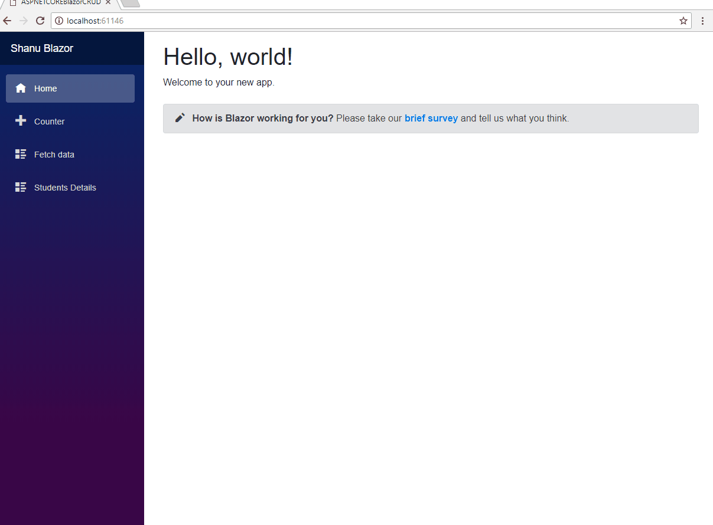
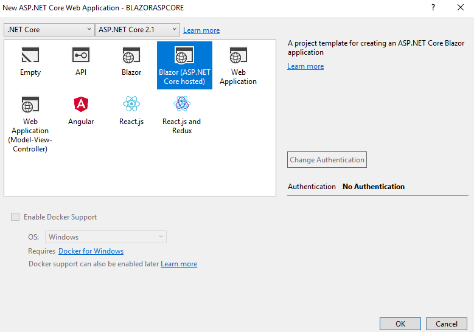
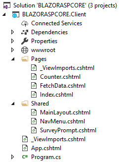
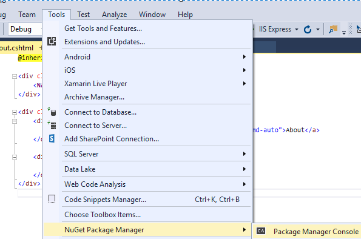
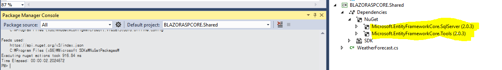
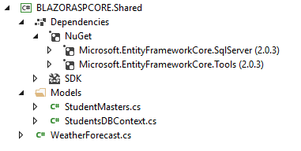
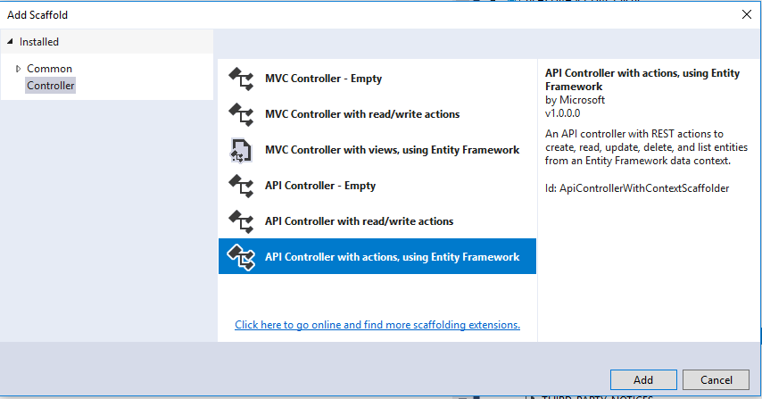
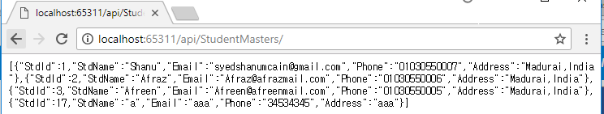

# ASP.NET Core Blazor CRUD using Entity Framework and Web API
## Requires
- Visual Studio 2017
## License
- MIT
## Technologies
- ASP.NET Core
- Blazor
- ASP.NET Core Blazor
## Topics
- ASP.NET Core
- Blazor
- ASP.NET Core Blazor
## Updated
- 06/10/2018
## Description

Introduction

<a title="ASP.NET Core Blazor CRUD using Entity Framework and Web API" href="https://www.youtube.com/watch?v=QgyRxzNN6B0" target="_blank"> 
</a>

In this article we will see on how to create a simple CRUD application for ASP.NET Core Blazor using Entity Framework and Web API. Blazor is a new framework introduced by Microsoft.I love to work with Blazor as this make our SPA full stack application development
 in more simple way and yes now we can use only one Language as C#. Before Blazor we are been using ASP.NET Core with the combination of Angular or ReactJs, now with the help of Blazor support we can create our own SPA application directly with C# Code.If you
 start your SPA application development using Blazor surely you will love it and it was that much simple and fun to work with Blazor.&nbsp;&nbsp;

In this article, we will see the on creating CRUD web Application using ASP.NET Core Blazor

<ul>
<li>C: (Create): Insert new Student Details into the database using ASP.NET Core, Blazor, EF and Web API.
</li><li>R: (Read): Select Student Details from the database using ASP.NET Core, Blazor, EF and Web API.
</li><li>U: (Update): Update Student Details to the database using ASP.NET Core, Blazor, EF and Web API
</li><li>D: (Delete): Delete Student Details from the database using ASP.NET Core, Blazor, EF and Web API.
</li></ul>

We will be using Web API and EF to perform our CRUD operations. Web API has the following four methods as Get/Post/Put and Delete, where

<ul>
<li>Get is to request for the data. (Select) </li><li>Post is to create a data. (Insert) </li><li>Put is to update the data. (Update) </li><li>Delete is to delete data. (Delete) </li></ul>
<h1>Building the Sample</h1>
<h1><strong>Prerequisites</strong></h1>

Make sure, you have installed all the prerequisites in your computer. If not, then download and install all, one by one. Note that since Blazor is the new framework and we must have installed preview of Visual Studio 2017 (15.7) or above.

<ul>
<li>Install the&nbsp;<a href="https://www.microsoft.com/net/download/dotnet-core/sdk-2.1.300-preview2" target="_blank">.NET Core 2.1 Preview 2 SDK</a>. (You can find the all versions from this
<a href="https://www.microsoft.com/net/download/all" target="_blank">link</a>&nbsp;
</li></ul>
<ul>
<li>Install the latest preview of&nbsp;<a href="https://www.visualstudio.com/vs/preview/" target="_blank">Visual Studio 2017 (15.7)</a>.&nbsp;
</li></ul>
<ul>
<li>Install the&nbsp;<a href="https://marketplace.visualstudio.com/items?itemName=aspnet.blazor" target="_blank">ASP.NET Core Blazor Language Services</a>&nbsp;for Blazor Extentions.
</li></ul>

Description

<strong>Code part</strong>

<strong>Step 1 -&nbsp;Create a database and a table</strong>

We will be using our SQL Server database for our WEB API and EF. First, we create a database named StudentsDB and a table as StudentMaster. Here is the SQL script to create a database table and sample record insert query in our table. Run the query given
 below in your local SQL Server to create a database and a table to be used in our project.&nbsp;

&nbsp;

SQL

Edit|Remove

mysql

<pre class="js">USE&nbsp;MASTER&nbsp;&nbsp;&nbsp;&nbsp;&nbsp;&nbsp;
GO&nbsp;&nbsp;&nbsp;&nbsp;&nbsp;&nbsp;
&nbsp;&nbsp;&nbsp;&nbsp;&nbsp;&nbsp;
--&nbsp;1)&nbsp;Check&nbsp;for&nbsp;the&nbsp;Database&nbsp;Exists&nbsp;.If&nbsp;the&nbsp;database&nbsp;is&nbsp;exist&nbsp;then&nbsp;drop&nbsp;and&nbsp;create&nbsp;new&nbsp;DB&nbsp;&nbsp;&nbsp;&nbsp;&nbsp;&nbsp;
IF&nbsp;EXISTS&nbsp;(SELECT&nbsp;[name]&nbsp;FROM&nbsp;sys.databases&nbsp;WHERE&nbsp;[name]&nbsp;=&nbsp;'StudentsDB'&nbsp;)&nbsp;&nbsp;&nbsp;&nbsp;&nbsp;&nbsp;
DROP&nbsp;DATABASE&nbsp;StudentsDB&nbsp;&nbsp;&nbsp;&nbsp;&nbsp;&nbsp;
GO&nbsp;&nbsp;&nbsp;&nbsp;&nbsp;&nbsp;
&nbsp;&nbsp;&nbsp;&nbsp;&nbsp;&nbsp;
CREATE&nbsp;DATABASE&nbsp;StudentsDB&nbsp;&nbsp;&nbsp;&nbsp;&nbsp;&nbsp;
GO&nbsp;&nbsp;&nbsp;&nbsp;&nbsp;&nbsp;
&nbsp;&nbsp;&nbsp;&nbsp;&nbsp;&nbsp;
USE&nbsp;StudentsDB&nbsp;&nbsp;&nbsp;&nbsp;&nbsp;&nbsp;
GO&nbsp;&nbsp;&nbsp;&nbsp;&nbsp;&nbsp;
&nbsp;&nbsp;&nbsp;&nbsp;&nbsp;&nbsp;
&nbsp;&nbsp;&nbsp;&nbsp;&nbsp;&nbsp;
--&nbsp;1)&nbsp;////////////&nbsp;StudentMasters&nbsp;&nbsp;&nbsp;&nbsp;&nbsp;&nbsp;
&nbsp;&nbsp;&nbsp;&nbsp;&nbsp;&nbsp;
IF&nbsp;EXISTS&nbsp;(&nbsp;SELECT&nbsp;[name]&nbsp;FROM&nbsp;sys.tables&nbsp;WHERE&nbsp;[name]&nbsp;=&nbsp;'StudentMasters'&nbsp;)&nbsp;&nbsp;&nbsp;&nbsp;&nbsp;&nbsp;
DROP&nbsp;TABLE&nbsp;StudentMasters&nbsp;&nbsp;&nbsp;&nbsp;&nbsp;&nbsp;
GO&nbsp;&nbsp;&nbsp;&nbsp;&nbsp;&nbsp;
&nbsp;&nbsp;&nbsp;&nbsp;&nbsp;&nbsp;
CREATE&nbsp;TABLE&nbsp;[dbo].[StudentMasters](&nbsp;&nbsp;&nbsp;&nbsp;&nbsp;&nbsp;
&nbsp;&nbsp;&nbsp;&nbsp;&nbsp;&nbsp;&nbsp;&nbsp;[StdID]&nbsp;INT&nbsp;IDENTITY&nbsp;PRIMARY&nbsp;KEY,&nbsp;&nbsp;&nbsp;&nbsp;&nbsp;&nbsp;
&nbsp;&nbsp;&nbsp;&nbsp;&nbsp;&nbsp;&nbsp;&nbsp;[StdName]&nbsp;[varchar](100)&nbsp;NOT&nbsp;NULL,&nbsp;&nbsp;&nbsp;&nbsp;&nbsp;&nbsp;&nbsp;&nbsp;&nbsp;
&nbsp;&nbsp;&nbsp;&nbsp;&nbsp;&nbsp;&nbsp;&nbsp;[Email]&nbsp;&nbsp;[varchar](100)&nbsp;NOT&nbsp;NULL,&nbsp;&nbsp;&nbsp;&nbsp;&nbsp;&nbsp;&nbsp;&nbsp;&nbsp;
&nbsp;&nbsp;&nbsp;&nbsp;&nbsp;&nbsp;&nbsp;&nbsp;[Phone]&nbsp;&nbsp;[varchar](20)&nbsp;NOT&nbsp;NULL,&nbsp;&nbsp;&nbsp;&nbsp;&nbsp;&nbsp;&nbsp;&nbsp;&nbsp;
&nbsp;&nbsp;&nbsp;&nbsp;&nbsp;&nbsp;&nbsp;&nbsp;[Address]&nbsp;&nbsp;[varchar](200)&nbsp;NOT&nbsp;NULL&nbsp;&nbsp;&nbsp;&nbsp;&nbsp;&nbsp;
)&nbsp;&nbsp;&nbsp;&nbsp;&nbsp;&nbsp;
&nbsp;&nbsp;&nbsp;&nbsp;&nbsp;&nbsp;
--&nbsp;insert&nbsp;sample&nbsp;data&nbsp;to&nbsp;Student&nbsp;Master&nbsp;table&nbsp;&nbsp;&nbsp;&nbsp;&nbsp;&nbsp;
INSERT&nbsp;INTO&nbsp;[StudentMasters]&nbsp;&nbsp;&nbsp;([StdName],[Email],[Phone],[Address])&nbsp;&nbsp;&nbsp;&nbsp;&nbsp;&nbsp;
&nbsp;&nbsp;&nbsp;&nbsp;&nbsp;VALUES&nbsp;('Shanu','syedshanumcain@gmail.com','01030550007','Madurai,India')&nbsp;&nbsp;&nbsp;&nbsp;&nbsp;&nbsp;
&nbsp;&nbsp;&nbsp;&nbsp;&nbsp;&nbsp;
INSERT&nbsp;INTO&nbsp;[StudentMasters]&nbsp;&nbsp;&nbsp;([StdName],[Email],[Phone],[Address])&nbsp;&nbsp;&nbsp;&nbsp;&nbsp;&nbsp;
&nbsp;&nbsp;&nbsp;&nbsp;&nbsp;VALUES&nbsp;('Afraz','Afraz@afrazmail.com','01030550006','Madurai,India')&nbsp;&nbsp;&nbsp;&nbsp;&nbsp;&nbsp;
&nbsp;&nbsp;&nbsp;&nbsp;&nbsp;&nbsp;&nbsp;&nbsp;&nbsp;&nbsp;&nbsp;
INSERT&nbsp;INTO&nbsp;[StudentMasters]&nbsp;&nbsp;&nbsp;([StdName],[Email],[Phone],[Address])&nbsp;&nbsp;&nbsp;&nbsp;&nbsp;&nbsp;
&nbsp;&nbsp;&nbsp;&nbsp;&nbsp;VALUES&nbsp;('Afreen','Afreen@afreenmail.com','01030550005','Madurai,India')&nbsp;&nbsp;&nbsp;&nbsp;&nbsp;&nbsp;
&nbsp;&nbsp;&nbsp;&nbsp;&nbsp;&nbsp;&nbsp;&nbsp;&nbsp;&nbsp;&nbsp;
&nbsp;&nbsp;&nbsp;&nbsp;&nbsp;&nbsp;&nbsp;&nbsp;&nbsp;&nbsp;&nbsp;
&nbsp;&nbsp;&nbsp;&nbsp;&nbsp;select&nbsp;*&nbsp;from&nbsp;[StudentMasters]&nbsp;&nbsp;&nbsp;&nbsp;
</pre>

&nbsp;

<strong>Step 2 -&nbsp;Create ASP.NET Core Blazor Application</strong>

After installing all the prerequisites listed above and ASP.NET Core Blazor Language Services, click Start &gt;&gt; Programs &gt;&gt; Visual Studio 2017 &gt;&gt; Visual Studio 2017 on your desktop. Click New &gt;&gt; Project. Select Web &gt;&gt; ASP.NET
 Core Angular Web Application. Enter your project name and click OK.

Select Blazor (ASP.NET Core hosted) and click ok

After creating ASP.NET Core Blazor Application, wait for few seconds. You will see below structure in solution explorer.

<h1><strong>What is new in ASP.NET Core Blazor solution?</strong></h1>

When we create our new ASP.NET Core Blazor application we can see as there will be 3 projects will be automatically created in the solution Explorer.

<h2><strong>Client Project</strong></h2>

The first project created as the Client project and it will be as our Solutionname.Client and here we can see as our Solutionname as &ldquo;BlazorASPCORE&rdquo;. As the project named as client and this project will be mainly focused for all the client-side
 view. Here we will be adding all our page view to be display in the client side in browser.

We can see as few of sample page has been already added here and we can also see a shared folder same like our MVC application where will be having the Sharedfolder and Layout page for the Master page.Here in Blazor we have the MainLayout which will be work
 like the Master page and NavMenu for the left side menu display.

<h2><strong>Server Project</strong></h2>

As the name indicating this project will be used as a Server project. This project is mainly used to create all our Controllers and WEB API Controllers to perform all business logic and perform CRUD operation using WEB API&rsquo;s. In our demo application
 we will be adding a Web API in this Server project and all the WEB API in our Client application. This Server project will be work like get/set the data from Database and from our Client project we bind or send the result to this server to perform the CRUD
 operation in database.

<h2><strong>Shared Project</strong></h2>

As the name indicating this project work like a shred project. This project works as a Model for our Server project and for the Client project. The Model declared in this Shared project will be used in both the Server and in the Client project. We also install
 all the packages needed for our project here, for example to use the Entity Framework we install all the packages in this Shared project.

<strong>Run to test the application</strong>

When we run the application, we can see that the left side has navigation and the right side contains the data. We can see as the default sample pages and menus will be displayed in our Blazor web site. We can use the pages or remove it and start with our
 own page.

Now let&rsquo;s see how to add new page perform the CRUD operation for maintain student details.

<strong>Using Entity Framework</strong>

To use the Entity Framework in our Blazor application we need to install the below packages

<strong>Install the Packages</strong>

Go to Tools and then select -&gt; NuGet Package Manager -&gt; Package Manager Console.

You can see the Console at the bottom of the VS 2017 IDE and in right side of the combobox on the console select the Default project as your shared project&rdquo; Select Shared&rdquo;

1)&nbsp;&nbsp;&nbsp;&nbsp;&nbsp; &nbsp;You can see the PM&gt; and copy and paste the below line to install the Database Provider package. This package is used to set the database provider as SQL Servder

&nbsp;

C#

Edit|Remove

csharp

<pre class="js">Install-Package&nbsp;Microsoft.EntityFrameworkCore.SqlServer</pre>

&nbsp;

&nbsp;

We can see as the package is installed in our Shared folder

Install the Entity Framework

2)&nbsp; &nbsp; &nbsp;You can see the PM&gt; and copy and paste the below line to install the EF package.&nbsp;

&nbsp;

C#

Edit|Remove

csharp

<pre class="js">Install-Package&nbsp;Microsoft.EntityFrameworkCore.Tools</pre>

&nbsp;

&nbsp;

To Create DB Context and set the DB Connection string

&nbsp; &nbsp;3) You can see the PM&gt; and copy and paste the below line set the Connection string and create DB Context. This is important part as we give our SQL Server name, Database Name and SQL server UID and SQL Server Password to connect to our database
 for performing the CRUD operation. We also give our SQL Table name to create the Model class in our Shared project.

&nbsp;

C#

Edit|Remove

csharp

<pre class="js">Scaffold-DbContext&nbsp;&quot;Server=&nbsp;YourSqlServerName;Database=StudentsDB;user&nbsp;id=&nbsp;YourSqlUID;password=&nbsp;YourSqlPassword;Trusted_Connection=True;MultipleActiveResultSets=true&quot;&nbsp;Microsoft.EntityFrameworkCore.SqlServer&nbsp;-OutputDir&nbsp;Models&nbsp;-Tables&nbsp;StudentMasters</pre>

&nbsp;

Press enter create connection string, Model Class and Database Context.

We can see StudentMasters Model class and StudentsDBContext class has been created in our Shared project. We will be using this Model and DBContext in our Server project to create our Web API to perform the CRUD operations.&nbsp;
<strong>&nbsp;</strong>

<strong>Creating Web API for CRUD operation</strong>

To create our WEB API Controller, right click Controllers folder. Click Add New Controller.

Here we will be using Scaffold method to create our WEB API .We select API Controller with actions, using Entity Framework.

Select our Model and DatabaseContext from the Shared project.

Select our StudentMasters Model from the Shared Project for performing the CRUD operation.

Select the Data Context Class as our StudentsDBContext from the Shared project. Our Controller name will be automatically added if you need you can change it and click the ADD.

Our WEB API with Get/Post/Put and Delete method for performing the CRUD operation will be automatically created and we no need to write any code in Web API now as we have used the Scaffold method for all the actions and methods add with code.

To test Get Method, we can run our project and copy the GET method API path. Here, we can see our API path to get api/StudentMasters/
 
 
Run the program and paste API path to test our output.<strong>&nbsp;</strong>

Now we will bind all this WEB API Json result in out View page from our Client project

<strong>Working with Client Project</strong>

First, we need to add the new Razor view page

<strong>Add Razor View</strong>

To add the Razor view page right click the Pages folder from the Client project. Click on Add &gt;&gt; New Item

Select Razor View &gt;&gt; Enter your page name,Here we have given the name as Students.chtml

In Razor view Page we have 3 parts of code as first is the Import part where we import all the references and models for using in the view, HTML design and data bind part and finally we have the function part to call all the web API to bind in our HTML page
 and also to perform client-side business logic to be displayed in View page.

<strong>Import part</strong>

First, we import all the needed support files and references in our Razor View page.Here we have first imported our Model class to be used in our view and also imported HTTPClient for calling the Web API to perform the CRUD operations.

&nbsp;

XML

Edit|Remove

xml

<pre class="js">@using&nbsp;BLAZORASPCORE.Shared&nbsp;
@using&nbsp;BLAZORASPCORE.Shared.Models&nbsp;
@page&nbsp;&quot;/Students&quot;&nbsp;
@using&nbsp;Microsoft.AspNetCore.Blazor.Browser.Interop&nbsp;
@inject&nbsp;HttpClient&nbsp;Http&nbsp;
</pre>

&nbsp;

<strong>HTML design and data Bind part</strong>

Next, we design our Student details page to display the student details from the database and created a form to Insert and update the Student details we also have Delete button to delete the student records from the database.

For binding in Blazor we use the bind=&quot;@stds.StdId&quot; and to call the method using
<strong>onclick</strong>=&quot;@AddNewStudent&quot;

&nbsp;

HTML

Edit|Remove

html

<pre class="js">&lt;h1&gt;&nbsp;ASP.NET&nbsp;Core&nbsp;BLAZOR&nbsp;CRUD&nbsp;demo&nbsp;for&nbsp;Studetns&lt;/h1&gt;&nbsp;
&lt;hr&nbsp;/&gt;&nbsp;
&lt;table&nbsp;width=&quot;100%&quot;&nbsp;style=&quot;background:#05163D;color:honeydew&quot;&gt;&nbsp;
&nbsp;&nbsp;&nbsp;&nbsp;&lt;tr&gt;&nbsp;
&nbsp;&nbsp;&nbsp;&nbsp;&nbsp;&nbsp;&nbsp;&nbsp;&lt;td&nbsp;width=&quot;20&quot;&gt;&amp;nbsp;&lt;/td&gt;&nbsp;
&nbsp;&nbsp;&nbsp;&nbsp;&nbsp;&nbsp;&nbsp;&nbsp;&lt;td&gt;&nbsp;
&nbsp;&nbsp;&nbsp;&nbsp;&nbsp;&nbsp;&nbsp;&nbsp;&nbsp;&nbsp;&nbsp;&nbsp;&lt;h2&gt;&nbsp;Add&nbsp;New&nbsp;Student&nbsp;Details&lt;/h2&gt;&nbsp;
&nbsp;&nbsp;&nbsp;&nbsp;&nbsp;&nbsp;&nbsp;&nbsp;&lt;/td&gt;&nbsp;
&nbsp;&nbsp;&nbsp;&nbsp;&nbsp;&nbsp;&nbsp;&nbsp;&lt;td&gt;&amp;nbsp;&lt;/td&gt;&nbsp;
&nbsp;&nbsp;&nbsp;&nbsp;&nbsp;&nbsp;&nbsp;&nbsp;&lt;td&nbsp;align=&quot;right&quot;&gt;&nbsp;
&nbsp;&nbsp;&nbsp;&nbsp;&nbsp;&nbsp;&nbsp;&nbsp;&nbsp;&nbsp;&nbsp;&nbsp;&lt;button&nbsp;class=&quot;btn&nbsp;btn-info&quot;&nbsp;onclick=&quot;@AddNewStudent&quot;&gt;Add&nbsp;New&nbsp;Student&lt;/button&gt;&nbsp;
&nbsp;&nbsp;&nbsp;&nbsp;&nbsp;&nbsp;&nbsp;&nbsp;&lt;/td&gt;&nbsp;
&nbsp;&nbsp;&nbsp;&nbsp;&nbsp;&nbsp;&nbsp;&nbsp;&lt;td&nbsp;width=&quot;10&quot;&gt;&amp;nbsp;&lt;/td&gt;&nbsp;
&nbsp;&nbsp;&nbsp;&nbsp;&lt;/tr&gt;&nbsp;
&nbsp;&nbsp;&nbsp;&nbsp;&lt;tr&gt;&nbsp;
&nbsp;&nbsp;&nbsp;&nbsp;&nbsp;&nbsp;&nbsp;&nbsp;&lt;td&nbsp;colspan=&quot;2&quot;&gt;&lt;/td&gt;&nbsp;
&nbsp;&nbsp;&nbsp;&nbsp;&lt;/tr&gt;&nbsp;
&lt;/table&gt;&nbsp;
&lt;hr&nbsp;/&gt;&nbsp;
&lt;form&gt;&nbsp;
&nbsp;&nbsp;&nbsp;&nbsp;&lt;table&nbsp;class=&quot;form-group&quot;&gt;&nbsp;
&nbsp;&nbsp;&nbsp;&nbsp;&nbsp;&nbsp;&nbsp;&nbsp;&lt;tr&gt;&nbsp;
&nbsp;&nbsp;&nbsp;&nbsp;&nbsp;&nbsp;&nbsp;&nbsp;&nbsp;&nbsp;&nbsp;&nbsp;&lt;td&gt;&nbsp;
&nbsp;&nbsp;&nbsp;&nbsp;&nbsp;&nbsp;&nbsp;&nbsp;&nbsp;&nbsp;&nbsp;&nbsp;&nbsp;&nbsp;&nbsp;&nbsp;&lt;label&nbsp;for=&quot;Name&quot;&nbsp;class=&quot;control-label&quot;&gt;Student&nbsp;ID&lt;/label&gt;&nbsp;
&nbsp;&nbsp;&nbsp;&nbsp;&nbsp;&nbsp;&nbsp;&nbsp;&nbsp;&nbsp;&nbsp;&nbsp;&lt;/td&gt;&nbsp;
&nbsp;&nbsp;&nbsp;&nbsp;&nbsp;&nbsp;&nbsp;&nbsp;&nbsp;&nbsp;&nbsp;&nbsp;&lt;td&gt;&nbsp;
&nbsp;&nbsp;&nbsp;&nbsp;&nbsp;&nbsp;&nbsp;&nbsp;&nbsp;&nbsp;&nbsp;&nbsp;&nbsp;&nbsp;&nbsp;&nbsp;&lt;input&nbsp;type=&quot;text&quot;&nbsp;class=&quot;form-control&quot;&nbsp;bind=&quot;@stds.StdId&quot;&nbsp;readonly&nbsp;/&gt;&nbsp;
&nbsp;&nbsp;&nbsp;&nbsp;&nbsp;&nbsp;&nbsp;&nbsp;&nbsp;&nbsp;&nbsp;&nbsp;&lt;/td&gt;&nbsp;
&nbsp;&nbsp;&nbsp;&nbsp;&nbsp;&nbsp;&nbsp;&nbsp;&nbsp;&nbsp;&nbsp;&nbsp;&lt;td&nbsp;width=&quot;20&quot;&gt;&amp;nbsp;&lt;/td&gt;&nbsp;
&nbsp;&nbsp;&nbsp;&nbsp;&nbsp;&nbsp;&nbsp;&nbsp;&nbsp;&nbsp;&nbsp;&nbsp;&lt;td&gt;&nbsp;
&nbsp;&nbsp;&nbsp;&nbsp;&nbsp;&nbsp;&nbsp;&nbsp;&nbsp;&nbsp;&nbsp;&nbsp;&nbsp;&nbsp;&nbsp;&nbsp;&lt;label&nbsp;for=&quot;Name&quot;&nbsp;class=&quot;control-label&quot;&gt;Student&nbsp;Name&lt;/label&gt;&nbsp;
&nbsp;&nbsp;&nbsp;&nbsp;&nbsp;&nbsp;&nbsp;&nbsp;&nbsp;&nbsp;&nbsp;&nbsp;&lt;/td&gt;&nbsp;
&nbsp;&nbsp;&nbsp;&nbsp;&nbsp;&nbsp;&nbsp;&nbsp;&nbsp;&nbsp;&nbsp;&nbsp;&lt;td&gt;&nbsp;
&nbsp;&nbsp;&nbsp;&nbsp;&nbsp;&nbsp;&nbsp;&nbsp;&nbsp;&nbsp;&nbsp;&nbsp;&nbsp;&nbsp;&nbsp;&nbsp;&lt;input&nbsp;type=&quot;text&quot;&nbsp;class=&quot;form-control&quot;&nbsp;bind=&quot;@stds.StdName&quot;&nbsp;/&gt;&nbsp;
&nbsp;&nbsp;&nbsp;&nbsp;&nbsp;&nbsp;&nbsp;&nbsp;&nbsp;&nbsp;&nbsp;&nbsp;&lt;/td&gt;&nbsp;
&nbsp;&nbsp;&nbsp;&nbsp;&nbsp;&nbsp;&nbsp;&nbsp;&lt;/tr&gt;&nbsp;
&nbsp;&nbsp;&nbsp;&nbsp;&nbsp;&nbsp;&nbsp;&nbsp;&lt;tr&gt;&nbsp;
&nbsp;&nbsp;&nbsp;&nbsp;&nbsp;&nbsp;&nbsp;&nbsp;&nbsp;&nbsp;&nbsp;&nbsp;&lt;td&gt;&nbsp;
&nbsp;&nbsp;&nbsp;&nbsp;&nbsp;&nbsp;&nbsp;&nbsp;&nbsp;&nbsp;&nbsp;&nbsp;&nbsp;&nbsp;&nbsp;&nbsp;&lt;label&nbsp;for=&quot;Email&quot;&nbsp;class=&quot;control-label&quot;&gt;Email&lt;/label&gt;&nbsp;
&nbsp;&nbsp;&nbsp;&nbsp;&nbsp;&nbsp;&nbsp;&nbsp;&nbsp;&nbsp;&nbsp;&nbsp;&lt;/td&gt;&nbsp;
&nbsp;&nbsp;&nbsp;&nbsp;&nbsp;&nbsp;&nbsp;&nbsp;&nbsp;&nbsp;&nbsp;&nbsp;&lt;td&gt;&nbsp;
&nbsp;&nbsp;&nbsp;&nbsp;&nbsp;&nbsp;&nbsp;&nbsp;&nbsp;&nbsp;&nbsp;&nbsp;&nbsp;&nbsp;&nbsp;&nbsp;&lt;input&nbsp;type=&quot;text&quot;&nbsp;class=&quot;form-control&quot;&nbsp;bind=&quot;@stds.Email&quot;&nbsp;/&gt;&nbsp;
&nbsp;&nbsp;&nbsp;&nbsp;&nbsp;&nbsp;&nbsp;&nbsp;&nbsp;&nbsp;&nbsp;&nbsp;&lt;/td&gt;&nbsp;
&nbsp;&nbsp;&nbsp;&nbsp;&nbsp;&nbsp;&nbsp;&nbsp;&nbsp;&nbsp;&nbsp;&nbsp;&lt;td&nbsp;width=&quot;20&quot;&gt;&amp;nbsp;&lt;/td&gt;&nbsp;
&nbsp;&nbsp;&nbsp;&nbsp;&nbsp;&nbsp;&nbsp;&nbsp;&nbsp;&nbsp;&nbsp;&nbsp;&lt;td&gt;&nbsp;
&nbsp;&nbsp;&nbsp;&nbsp;&nbsp;&nbsp;&nbsp;&nbsp;&nbsp;&nbsp;&nbsp;&nbsp;&nbsp;&nbsp;&nbsp;&nbsp;&lt;label&nbsp;for=&quot;Name&quot;&nbsp;class=&quot;control-label&quot;&gt;Phone&lt;/label&gt;&nbsp;
&nbsp;&nbsp;&nbsp;&nbsp;&nbsp;&nbsp;&nbsp;&nbsp;&nbsp;&nbsp;&nbsp;&nbsp;&lt;/td&gt;&nbsp;
&nbsp;&nbsp;&nbsp;&nbsp;&nbsp;&nbsp;&nbsp;&nbsp;&nbsp;&nbsp;&nbsp;&nbsp;&lt;td&gt;&nbsp;
&nbsp;&nbsp;&nbsp;&nbsp;&nbsp;&nbsp;&nbsp;&nbsp;&nbsp;&nbsp;&nbsp;&nbsp;&nbsp;&nbsp;&nbsp;&nbsp;&lt;input&nbsp;type=&quot;text&quot;&nbsp;class=&quot;form-control&quot;&nbsp;bind=&quot;@stds.Phone&quot;&nbsp;/&gt;&nbsp;
&nbsp;&nbsp;&nbsp;&nbsp;&nbsp;&nbsp;&nbsp;&nbsp;&nbsp;&nbsp;&nbsp;&nbsp;&lt;/td&gt;&nbsp;
&nbsp;&nbsp;&nbsp;&nbsp;&nbsp;&nbsp;&nbsp;&nbsp;&lt;/tr&gt;&nbsp;
&nbsp;&nbsp;&nbsp;&nbsp;&nbsp;&nbsp;&nbsp;&nbsp;&lt;tr&gt;&nbsp;
&nbsp;&nbsp;&nbsp;&nbsp;&nbsp;&nbsp;&nbsp;&nbsp;&nbsp;&nbsp;&nbsp;&nbsp;&lt;td&gt;&nbsp;
&nbsp;&nbsp;&nbsp;&nbsp;&nbsp;&nbsp;&nbsp;&nbsp;&nbsp;&nbsp;&nbsp;&nbsp;&nbsp;&nbsp;&nbsp;&nbsp;&lt;label&nbsp;for=&quot;Name&quot;&nbsp;class=&quot;control-label&quot;&gt;Address&lt;/label&gt;&nbsp;
&nbsp;&nbsp;&nbsp;&nbsp;&nbsp;&nbsp;&nbsp;&nbsp;&nbsp;&nbsp;&nbsp;&nbsp;&lt;/td&gt;&nbsp;
&nbsp;&nbsp;&nbsp;&nbsp;&nbsp;&nbsp;&nbsp;&nbsp;&nbsp;&nbsp;&nbsp;&nbsp;&lt;td&gt;&nbsp;
&nbsp;&nbsp;&nbsp;&nbsp;&nbsp;&nbsp;&nbsp;&nbsp;&nbsp;&nbsp;&nbsp;&nbsp;&nbsp;&nbsp;&nbsp;&nbsp;&lt;input&nbsp;type=&quot;text&quot;&nbsp;class=&quot;form-control&quot;&nbsp;bind=&quot;@stds.Address&quot;&nbsp;/&gt;&nbsp;
&nbsp;&nbsp;&nbsp;&nbsp;&nbsp;&nbsp;&nbsp;&nbsp;&nbsp;&nbsp;&nbsp;&nbsp;&lt;/td&gt;&nbsp;
&nbsp;&nbsp;&nbsp;&nbsp;&nbsp;&nbsp;&nbsp;&nbsp;&nbsp;&nbsp;&nbsp;&nbsp;&lt;td&nbsp;width=&quot;20&quot;&gt;&amp;nbsp;&lt;/td&gt;&nbsp;
&nbsp;&nbsp;&nbsp;&nbsp;&nbsp;&nbsp;&nbsp;&nbsp;&nbsp;&nbsp;&nbsp;&nbsp;&lt;td&gt;&lt;/td&gt;&nbsp;
&nbsp;&nbsp;&nbsp;&nbsp;&nbsp;&nbsp;&nbsp;&nbsp;&nbsp;&nbsp;&nbsp;&nbsp;&lt;td&gt;&nbsp;
&nbsp;&nbsp;&nbsp;&nbsp;&nbsp;&nbsp;&nbsp;&nbsp;&nbsp;&nbsp;&nbsp;&nbsp;&nbsp;&nbsp;&nbsp;&nbsp;&lt;button&nbsp;type=&quot;submit&quot;&nbsp;class=&quot;btn&nbsp;btn-success&quot;&nbsp;onclick=&quot;@(async&nbsp;()&nbsp;=&gt;&nbsp;await&nbsp;AddStudent())&quot;&nbsp;style=&quot;width:220px;&quot;&gt;Save&lt;/button&gt;&nbsp;
&nbsp;&nbsp;&nbsp;&nbsp;&nbsp;&nbsp;&nbsp;&nbsp;&nbsp;&nbsp;&nbsp;&nbsp;&lt;/td&gt;&nbsp;
&nbsp;&nbsp;&nbsp;&nbsp;&nbsp;&nbsp;&nbsp;&nbsp;&lt;/tr&gt;&nbsp;
&nbsp;&nbsp;&nbsp;&nbsp;&lt;/table&gt;&nbsp;
&lt;/form&gt;&nbsp;
&nbsp;
&lt;table&nbsp;width=&quot;100%&quot;&nbsp;style=&quot;background:#0A2464;color:honeydew&quot;&gt;&nbsp;
&nbsp;&nbsp;&nbsp;&nbsp;&lt;tr&gt;&nbsp;
&nbsp;&nbsp;&nbsp;&nbsp;&nbsp;&nbsp;&nbsp;&nbsp;&lt;td&nbsp;width=&quot;20&quot;&gt;&amp;nbsp;&lt;/td&gt;&nbsp;
&nbsp;&nbsp;&nbsp;&nbsp;&nbsp;&nbsp;&nbsp;&nbsp;&lt;td&gt;&nbsp;
&nbsp;&nbsp;&nbsp;&nbsp;&nbsp;&nbsp;&nbsp;&nbsp;&nbsp;&nbsp;&nbsp;&nbsp;&lt;h2&gt;Student&nbsp;Details&lt;/h2&gt;&nbsp;
&nbsp;&nbsp;&nbsp;&nbsp;&nbsp;&nbsp;&nbsp;&nbsp;&lt;/td&gt;&nbsp;
&nbsp;&nbsp;&nbsp;&nbsp;&nbsp;&nbsp;&nbsp;
&nbsp;&nbsp;&nbsp;&nbsp;&lt;/tr&gt;&nbsp;
&nbsp;&nbsp;&nbsp;&nbsp;&lt;tr&gt;&nbsp;
&nbsp;&nbsp;&nbsp;&nbsp;&nbsp;&nbsp;&nbsp;&nbsp;&lt;td&nbsp;colspan=&quot;2&quot;&gt;&lt;/td&gt;&nbsp;
&nbsp;&nbsp;&nbsp;&nbsp;&lt;/tr&gt;&nbsp;
&lt;/table&gt;&nbsp;
&nbsp;
@if&nbsp;(student&nbsp;==&nbsp;null)&nbsp;
{&nbsp;
&nbsp;&nbsp;&nbsp;&nbsp;&lt;p&gt;&lt;em&gt;Loading...&lt;/em&gt;&lt;/p&gt;&nbsp;
}else{&nbsp;
&nbsp;&nbsp;&nbsp;&nbsp;&lt;table&nbsp;class=&quot;table&quot;&gt;&nbsp;
&nbsp;&nbsp;&nbsp;&nbsp;&nbsp;&nbsp;&nbsp;&nbsp;&lt;thead&gt;&nbsp;
&nbsp;&nbsp;&nbsp;&nbsp;&nbsp;&nbsp;&nbsp;&nbsp;&nbsp;&nbsp;&nbsp;&nbsp;&lt;tr&gt;&nbsp;
&nbsp;&nbsp;&nbsp;&nbsp;&nbsp;&nbsp;&nbsp;&nbsp;&nbsp;&nbsp;&nbsp;&nbsp;&nbsp;&nbsp;&nbsp;&nbsp;&lt;th&gt;Student&nbsp;ID&lt;/th&gt;&nbsp;
&nbsp;&nbsp;&nbsp;&nbsp;&nbsp;&nbsp;&nbsp;&nbsp;&nbsp;&nbsp;&nbsp;&nbsp;&nbsp;&nbsp;&nbsp;&nbsp;&lt;th&gt;Student&nbsp;Name&lt;/th&gt;&nbsp;
&nbsp;&nbsp;&nbsp;&nbsp;&nbsp;&nbsp;&nbsp;&nbsp;&nbsp;&nbsp;&nbsp;&nbsp;&nbsp;&nbsp;&nbsp;&nbsp;&lt;th&gt;Email&lt;/th&gt;&nbsp;
&nbsp;&nbsp;&nbsp;&nbsp;&nbsp;&nbsp;&nbsp;&nbsp;&nbsp;&nbsp;&nbsp;&nbsp;&nbsp;&nbsp;&nbsp;&nbsp;&lt;th&gt;Phone&lt;/th&gt;&nbsp;
&nbsp;
&nbsp;&nbsp;&nbsp;&nbsp;&nbsp;&nbsp;&nbsp;&nbsp;&nbsp;&nbsp;&nbsp;&nbsp;&nbsp;&nbsp;&nbsp;&nbsp;&lt;th&gt;Address&lt;/th&gt;&nbsp;
&nbsp;&nbsp;&nbsp;&nbsp;&nbsp;&nbsp;&nbsp;&nbsp;&nbsp;&nbsp;&nbsp;&nbsp;&lt;/tr&gt;&nbsp;
&nbsp;&nbsp;&nbsp;&nbsp;&nbsp;&nbsp;&nbsp;&nbsp;&lt;/thead&gt;&nbsp;
&nbsp;&nbsp;&nbsp;&nbsp;&nbsp;&nbsp;&nbsp;&nbsp;&lt;tbody&gt;&nbsp;
&nbsp;&nbsp;&nbsp;&nbsp;&nbsp;&nbsp;&nbsp;&nbsp;&nbsp;&nbsp;&nbsp;&nbsp;@foreach&nbsp;(var&nbsp;std&nbsp;in&nbsp;student)&nbsp;
&nbsp;&nbsp;&nbsp;&nbsp;&nbsp;&nbsp;&nbsp;&nbsp;&nbsp;&nbsp;&nbsp;&nbsp;{&nbsp;
&nbsp;&nbsp;&nbsp;&nbsp;&nbsp;&nbsp;&nbsp;&nbsp;&nbsp;&nbsp;&nbsp;&nbsp;&nbsp;&nbsp;&nbsp;&nbsp;&lt;tr&gt;&nbsp;
&nbsp;&nbsp;&nbsp;&nbsp;&nbsp;&nbsp;&nbsp;&nbsp;&nbsp;&nbsp;&nbsp;&nbsp;&nbsp;&nbsp;&nbsp;&nbsp;&nbsp;&nbsp;&nbsp;&nbsp;&lt;td&gt;@std.StdId&lt;/td&gt;&nbsp;
&nbsp;&nbsp;&nbsp;&nbsp;&nbsp;&nbsp;&nbsp;&nbsp;&nbsp;&nbsp;&nbsp;&nbsp;&nbsp;&nbsp;&nbsp;&nbsp;&nbsp;&nbsp;&nbsp;&nbsp;&lt;td&gt;@std.StdName&lt;/td&gt;&nbsp;
&nbsp;&nbsp;&nbsp;&nbsp;&nbsp;&nbsp;&nbsp;&nbsp;&nbsp;&nbsp;&nbsp;&nbsp;&nbsp;&nbsp;&nbsp;&nbsp;&nbsp;&nbsp;&nbsp;&nbsp;&lt;td&gt;@std.Email&lt;/td&gt;&nbsp;
&nbsp;&nbsp;&nbsp;&nbsp;&nbsp;&nbsp;&nbsp;&nbsp;&nbsp;&nbsp;&nbsp;&nbsp;&nbsp;&nbsp;&nbsp;&nbsp;&nbsp;&nbsp;&nbsp;&nbsp;&lt;td&gt;@std.Phone&lt;/td&gt;&nbsp;
&nbsp;
&nbsp;&nbsp;&nbsp;&nbsp;&nbsp;&nbsp;&nbsp;&nbsp;&nbsp;&nbsp;&nbsp;&nbsp;&nbsp;&nbsp;&nbsp;&nbsp;&nbsp;&nbsp;&nbsp;&nbsp;&lt;td&gt;@std.Address&lt;/td&gt;&nbsp;
&nbsp;&nbsp;&nbsp;&nbsp;&nbsp;&nbsp;&nbsp;&nbsp;&nbsp;&nbsp;&nbsp;&nbsp;&nbsp;&nbsp;&nbsp;&nbsp;&nbsp;&nbsp;&nbsp;&nbsp;&lt;td&gt;&lt;button&nbsp;class=&quot;btn&nbsp;btn-primary&quot;&nbsp;onclick=&quot;@(async&nbsp;()&nbsp;=&gt;&nbsp;await&nbsp;EditStudent(@std.StdId))&quot;&nbsp;style=&quot;width:110px;&quot;&gt;Edit&lt;/button&gt;&lt;/td&gt;&nbsp;
&nbsp;&nbsp;&nbsp;&nbsp;&nbsp;&nbsp;&nbsp;&nbsp;&nbsp;&nbsp;&nbsp;&nbsp;&nbsp;&nbsp;&nbsp;&nbsp;&nbsp;&nbsp;&nbsp;&nbsp;&lt;td&gt;&lt;button&nbsp;class=&quot;btn&nbsp;btn-danger&quot;&nbsp;onclick=&quot;@(async&nbsp;()&nbsp;=&gt;&nbsp;await&nbsp;DeleteStudent(@std.StdId))&quot;&gt;Delete&lt;/button&gt;&lt;/td&gt;&nbsp;
&nbsp;&nbsp;&nbsp;&nbsp;&nbsp;&nbsp;&nbsp;&nbsp;&nbsp;&nbsp;&nbsp;&nbsp;&nbsp;&nbsp;&nbsp;&nbsp;&lt;/tr&gt;&nbsp;
&nbsp;&nbsp;&nbsp;&nbsp;&nbsp;&nbsp;&nbsp;&nbsp;&nbsp;&nbsp;&nbsp;&nbsp;}&nbsp;
&nbsp;&nbsp;&nbsp;&nbsp;&nbsp;&nbsp;&nbsp;&nbsp;&lt;/tbody&gt;&nbsp;
&nbsp;&nbsp;&nbsp;&nbsp;&lt;/table&gt;&nbsp;
}</pre>

&nbsp;

<strong>Function Part</strong>

function part to call all the web API to bind in our HTML page and also to perform client-side business logic to be displayed in View page.In this Function we create a separate function for Add, Edit and Delete the student details and call the Web API Get,Post,Put
 and Delete method to perform the CRUD operations and in HTML we call all the function and bind the results.

&nbsp;

XML

Edit|Remove

xml

<pre class="js">@functions&nbsp;{&nbsp;
&nbsp;&nbsp;&nbsp;&nbsp;StudentMasters[]&nbsp;student;&nbsp;
&nbsp;
&nbsp;&nbsp;&nbsp;&nbsp;StudentMasters&nbsp;stds&nbsp;=&nbsp;new&nbsp;StudentMasters();&nbsp;
&nbsp;&nbsp;&nbsp;&nbsp;string&nbsp;ids&nbsp;=&nbsp;&quot;0&quot;;&nbsp;
&nbsp;&nbsp;&nbsp;&nbsp;bool&nbsp;showAddrow&nbsp;=&nbsp;false;&nbsp;
&nbsp;&nbsp;&nbsp;&nbsp;protected&nbsp;override&nbsp;async&nbsp;Task&nbsp;OnInitAsync()&nbsp;
&nbsp;&nbsp;&nbsp;&nbsp;{&nbsp;
&nbsp;&nbsp;&nbsp;&nbsp;&nbsp;&nbsp;&nbsp;&nbsp;student&nbsp;=&nbsp;await&nbsp;Http.GetJsonAsync&lt;StudentMasters[]&gt;(&quot;/api/StudentMasters/&quot;);&nbsp;
&nbsp;&nbsp;&nbsp;&nbsp;}&nbsp;
&nbsp;
&nbsp;&nbsp;&nbsp;&nbsp;void&nbsp;AddNewStudent()&nbsp;
&nbsp;&nbsp;&nbsp;&nbsp;{&nbsp;
&nbsp;&nbsp;&nbsp;&nbsp;&nbsp;&nbsp;&nbsp;&nbsp;stds&nbsp;=&nbsp;new&nbsp;StudentMasters();&nbsp;
&nbsp;&nbsp;&nbsp;&nbsp;}&nbsp;
&nbsp;&nbsp;&nbsp;&nbsp;//&nbsp;Add&nbsp;New&nbsp;Student&nbsp;Details&nbsp;Method&nbsp;
&nbsp;&nbsp;&nbsp;&nbsp;protected&nbsp;async&nbsp;Task&nbsp;AddStudent()&nbsp;
&nbsp;&nbsp;&nbsp;&nbsp;{&nbsp;
&nbsp;&nbsp;&nbsp;&nbsp;&nbsp;&nbsp;&nbsp;&nbsp;if&nbsp;(stds.StdId&nbsp;==&nbsp;0)&nbsp;
&nbsp;
&nbsp;&nbsp;&nbsp;&nbsp;&nbsp;&nbsp;&nbsp;&nbsp;{&nbsp;
&nbsp;&nbsp;&nbsp;&nbsp;&nbsp;&nbsp;&nbsp;&nbsp;&nbsp;&nbsp;&nbsp;&nbsp;await&nbsp;Http.SendJsonAsync(HttpMethod.Post,&nbsp;&quot;/api/StudentMasters/&quot;,&nbsp;stds);&nbsp;
&nbsp;
&nbsp;&nbsp;&nbsp;&nbsp;&nbsp;&nbsp;&nbsp;&nbsp;}&nbsp;
&nbsp;&nbsp;&nbsp;&nbsp;&nbsp;&nbsp;&nbsp;&nbsp;else&nbsp;
&nbsp;&nbsp;&nbsp;&nbsp;&nbsp;&nbsp;&nbsp;&nbsp;{&nbsp;
&nbsp;&nbsp;&nbsp;&nbsp;&nbsp;&nbsp;&nbsp;&nbsp;&nbsp;&nbsp;&nbsp;&nbsp;await&nbsp;Http.SendJsonAsync(HttpMethod.Put,&nbsp;&quot;/api/StudentMasters/&quot;&nbsp;&#43;&nbsp;stds.StdId,&nbsp;stds);&nbsp;
&nbsp;&nbsp;&nbsp;&nbsp;&nbsp;&nbsp;&nbsp;&nbsp;}&nbsp;
&nbsp;&nbsp;&nbsp;&nbsp;&nbsp;&nbsp;&nbsp;&nbsp;stds&nbsp;=&nbsp;new&nbsp;StudentMasters();&nbsp;
&nbsp;&nbsp;&nbsp;&nbsp;&nbsp;&nbsp;&nbsp;&nbsp;student&nbsp;=&nbsp;await&nbsp;Http.GetJsonAsync&lt;StudentMasters[]&gt;(&quot;/api/StudentMasters/&quot;);&nbsp;
&nbsp;&nbsp;&nbsp;&nbsp;}&nbsp;
&nbsp;&nbsp;&nbsp;&nbsp;//&nbsp;Edit&nbsp;Method&nbsp;
&nbsp;&nbsp;&nbsp;&nbsp;protected&nbsp;async&nbsp;Task&nbsp;EditStudent(int&nbsp;studentID)&nbsp;
&nbsp;&nbsp;&nbsp;&nbsp;{&nbsp;
&nbsp;&nbsp;&nbsp;&nbsp;&nbsp;&nbsp;&nbsp;&nbsp;ids&nbsp;=&nbsp;studentID.ToString();&nbsp;
&nbsp;&nbsp;&nbsp;&nbsp;&nbsp;&nbsp;&nbsp;&nbsp;stds&nbsp;=&nbsp;await&nbsp;Http.GetJsonAsync&lt;StudentMasters&gt;(&quot;/api/StudentMasters/&quot;&nbsp;&#43;&nbsp;Convert.ToInt32(studentID));&nbsp;
&nbsp;&nbsp;&nbsp;&nbsp;}&nbsp;
&nbsp;&nbsp;&nbsp;&nbsp;//&nbsp;Delte&nbsp;Method&nbsp;
&nbsp;&nbsp;&nbsp;&nbsp;protected&nbsp;async&nbsp;Task&nbsp;DeleteStudent(int&nbsp;studentID)&nbsp;
&nbsp;&nbsp;&nbsp;&nbsp;{&nbsp;
&nbsp;&nbsp;&nbsp;&nbsp;&nbsp;&nbsp;&nbsp;&nbsp;ids&nbsp;=&nbsp;studentID.ToString();&nbsp;
&nbsp;&nbsp;&nbsp;&nbsp;&nbsp;&nbsp;&nbsp;&nbsp;await&nbsp;Http.DeleteAsync(&quot;/api/StudentMasters/&quot;&nbsp;&#43;&nbsp;Convert.ToInt32(studentID));&nbsp;
&nbsp;
&nbsp;&nbsp;&nbsp;&nbsp;&nbsp;&nbsp;&nbsp;&nbsp;//&nbsp;await&nbsp;Http.DeleteAsync(&quot;/api/StudentMasters/Delete/&quot;&nbsp;&#43;&nbsp;Convert.ToInt32(studentID));&nbsp;
&nbsp;
&nbsp;&nbsp;&nbsp;&nbsp;&nbsp;&nbsp;&nbsp;&nbsp;student&nbsp;=&nbsp;await&nbsp;Http.GetJsonAsync&lt;StudentMasters[]&gt;(&quot;/api/StudentMasters/&quot;);&nbsp;
&nbsp;&nbsp;&nbsp;&nbsp;}&nbsp;
&nbsp;
}&nbsp;&nbsp;
</pre>

&nbsp;

<h1>Source Code Files</h1>
<ul>
<li>BLAZORASPCORE.zip - 2018-05-18 </li></ul>
<h1>More Information</h1>

Note as when creating the DBContext and setting the connection string, don&rsquo;t forget to add your SQL connection string. Hope you all like this article and in next article we will see more examples to work with Blazors and its really very cool and awesome
 to work with Blazor.<strong>&nbsp;</strong>

