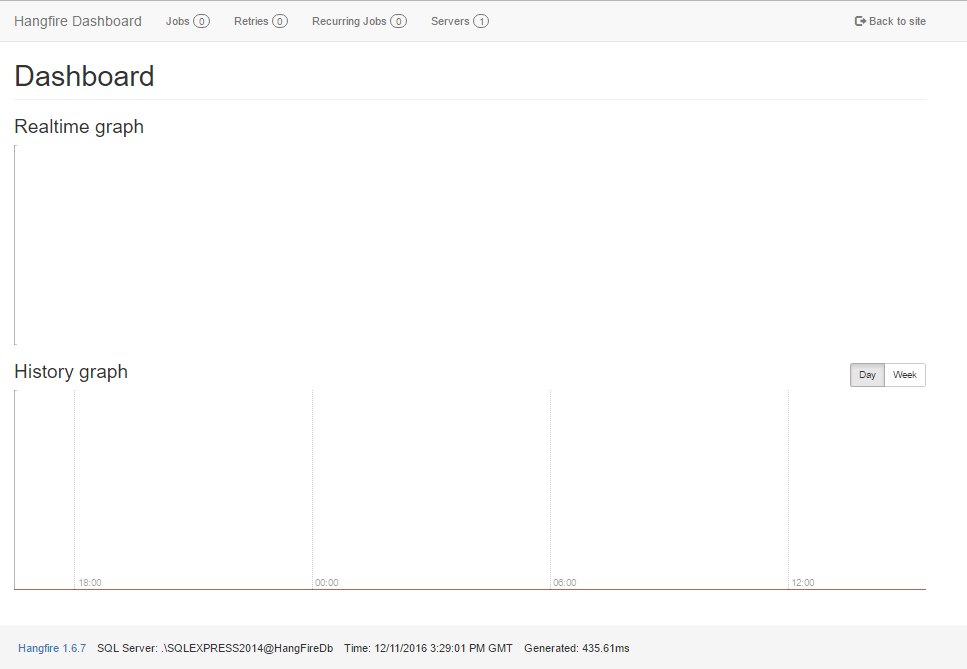
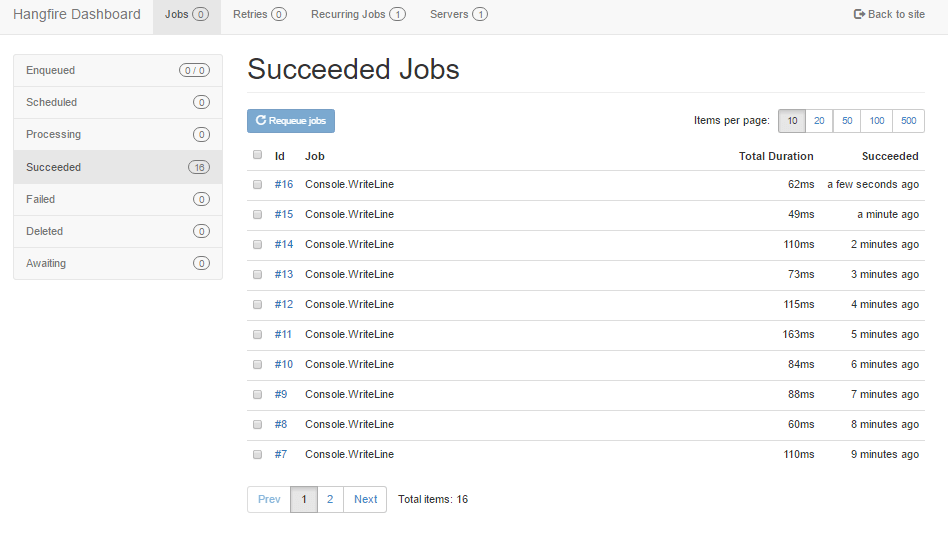

# ASP.NET Core Hangfire : Schedule background jobs using SQL Server
## Requires
- Visual Studio 2015
## License
- MIT
## Technologies
- SQL Server
- NuGet
- Hangfire
- ASP.NET Core
## Topics
- Background thread
- Background Agent
- Background tasks
- Background Workers
- Hangfire
## Updated
- 01/08/2017
## Description

Scheduling and monitoring background task is challenging work. Every big application needs to implement background tasks to accomplish background works like data processing, email reminders, process SMS queue and Email queues etc. Windows service is that
 the most typical approach to meet the necessity.

Today, we are going to setup Hangfire and write some code to schedule an initial job in the ASP.NET Core project.

<h1>Introduction</h1>

Hangfire is an open source library to schedule and execute background jobs in .NET application. you'll be able to create a simple background process inside the same application pool or thread without creating separate application. Hangfire create background
 jobs in persistence storage like MS SQL server, Redis, MongoDb and others, that may prevent from loosing job on recycling IIS pool or exception prevalence.

 
ASP.NET Core is now a common platform for MVC and Web API, no separate project creation needed. Let's create a new ASP.NET Core MVC project. After the project is created install Hangfire from nuget. You can install Hangfire either from Package Management Console
 or Nuget package manager.

Intall via nuget

PM&gt; Install-Package HangFire

<h1>Configuration</h1>

Open&nbsp;<code>Startup.cs</code>&nbsp;class and locate a&nbsp;<code>ConfigureServices</code>&nbsp;method to register Hangefire as a service.

C#

Edit|Remove

csharp
<pre class="hidden">public void ConfigureServices(IServiceCollection services)
{
    // Add Hangfire services.
    services.AddHangfire(x =&gt; x.UseSqlServerStorage(Configuration.GetConnectionString(&quot;DefaultConnection&quot;)));
    
    // Add framework services.
    services.AddMvc();
}</pre>

<pre class="csharp">public&nbsp;void&nbsp;ConfigureServices(IServiceCollection&nbsp;services)&nbsp;
{&nbsp;
&nbsp;&nbsp;&nbsp;&nbsp;//&nbsp;Add&nbsp;Hangfire&nbsp;services.&nbsp;
&nbsp;&nbsp;&nbsp;&nbsp;services.AddHangfire(x&nbsp;=&gt;&nbsp;x.UseSqlServerStorage(Configuration.GetConnectionString(&quot;DefaultConnection&quot;)));&nbsp;
&nbsp;&nbsp;&nbsp;&nbsp;&nbsp;
&nbsp;&nbsp;&nbsp;&nbsp;//&nbsp;Add&nbsp;framework&nbsp;services.&nbsp;
&nbsp;&nbsp;&nbsp;&nbsp;services.AddMvc();&nbsp;
}</pre>

&nbsp;Here we are registering Hangfire will SQL Server. We must provide a connection string to locate SQL server database named&nbsp;<code>HangFireDb</code>.&nbsp;<code>DefaultConnection</code>&nbsp;is
 a connection string name added to&nbsp;<code>appsettings.json</code>&nbsp;file.

C#

Edit|Remove

csharp
<pre class="hidden">&quot;ConnectionStrings&quot;: {
    &quot;DefaultConnection&quot;: &quot;Data Source=.\\SQLEXPRESS2014;Initial Catalog=HangFireDb;Integrated Security=True;&quot;
  }</pre>

<pre class="js">&quot;ConnectionStrings&quot;:&nbsp;{&nbsp;
&nbsp;&nbsp;&nbsp;&nbsp;&quot;DefaultConnection&quot;:&nbsp;&quot;Data&nbsp;Source=.\\SQLEXPRESS2014;Initial&nbsp;Catalog=HangFireDb;Integrated&nbsp;Security=True;&quot;&nbsp;
&nbsp;&nbsp;}</pre>

&nbsp;Once the service is configured,&nbsp; navigate to&nbsp;<code>Configure</code>&nbsp;method to add below codes. Here,&nbsp;<code>app.UseHangfireDashboard()</code>&nbsp;will set up the dashboard&nbsp;<code>http://&lt;website-url&gt;/hangfire</code>,
 and&nbsp;<code>app.UseHangfireServer()</code>&nbsp;will register a new instance for&nbsp;<a href="http://api.hangfire.io/html/T_Hangfire_BackgroundJobServer.htm" target="_blank">BackgroundJobServer</a>.

C#

Edit|Remove

csharp
<pre class="hidden">public void Configure(IApplicationBuilder app, IHostingEnvironment env, ILoggerFactory loggerFactory)
{
    loggerFactory.AddConsole(Configuration.GetSection(&quot;Logging&quot;));
    loggerFactory.AddDebug();

    app.UseHangfireDashboard();
    app.UseHangfireServer();
    
    app.UseDeveloperExceptionPage();
    app.UseBrowserLink();
    
    app.UseStaticFiles();
    app.UseMvc(routes =&gt;
    {
        routes.MapRoute(
            name: &quot;default&quot;,
            template: &quot;{controller=Home}/{action=Index}/{id?}&quot;);
    });
}</pre>

<pre class="js">public&nbsp;void&nbsp;Configure(IApplicationBuilder&nbsp;app,&nbsp;IHostingEnvironment&nbsp;env,&nbsp;ILoggerFactory&nbsp;loggerFactory)&nbsp;
{&nbsp;
&nbsp;&nbsp;&nbsp;&nbsp;loggerFactory.AddConsole(Configuration.GetSection(&quot;Logging&quot;));&nbsp;
&nbsp;&nbsp;&nbsp;&nbsp;loggerFactory.AddDebug();&nbsp;
&nbsp;
&nbsp;&nbsp;&nbsp;&nbsp;app.UseHangfireDashboard();&nbsp;
&nbsp;&nbsp;&nbsp;&nbsp;app.UseHangfireServer();&nbsp;
&nbsp;&nbsp;&nbsp;&nbsp;&nbsp;
&nbsp;&nbsp;&nbsp;&nbsp;app.UseDeveloperExceptionPage();&nbsp;
&nbsp;&nbsp;&nbsp;&nbsp;app.UseBrowserLink();&nbsp;
&nbsp;&nbsp;&nbsp;&nbsp;&nbsp;
&nbsp;&nbsp;&nbsp;&nbsp;app.UseStaticFiles();&nbsp;
&nbsp;&nbsp;&nbsp;&nbsp;app.UseMvc(routes&nbsp;=&gt;&nbsp;
&nbsp;&nbsp;&nbsp;&nbsp;{&nbsp;
&nbsp;&nbsp;&nbsp;&nbsp;&nbsp;&nbsp;&nbsp;&nbsp;routes.MapRoute(&nbsp;
&nbsp;&nbsp;&nbsp;&nbsp;&nbsp;&nbsp;&nbsp;&nbsp;&nbsp;&nbsp;&nbsp;&nbsp;name:&nbsp;&quot;default&quot;,&nbsp;
&nbsp;&nbsp;&nbsp;&nbsp;&nbsp;&nbsp;&nbsp;&nbsp;&nbsp;&nbsp;&nbsp;&nbsp;template:&nbsp;&quot;{controller=Home}/{action=Index}/{id?}&quot;);&nbsp;
&nbsp;&nbsp;&nbsp;&nbsp;});&nbsp;
}</pre>

&nbsp;Now, Let's run the application. Hangfire dashboard is available in browser by hitting<code>http://&lt;website-url&gt;/hangfire</code>&nbsp;url.

 

How it works?

Hangfire handles different types of background jobs, and all of them are invoked in a separate execution context. 
With Hangfire you can create

<h5>Fire-and-forget</h5>

Fire and forget jobs are executed once on an immediate basis after creation. Once you create a fire-and-forget job, it is saved to its queue (&quot;default&quot; by default, but multiple queues supported). The queue is listened by a couple of dedicated workers
 that fetch a job and perform it.&nbsp;

C#

Edit|Remove

csharp
<pre class="hidden">BackgroundJob.Enqueue(() =&gt; Console.WriteLine(&quot;Fire-and-forget Job Executed&quot;));</pre>

<pre class="csharp">BackgroundJob.Enqueue(()&nbsp;=&gt;&nbsp;Console.WriteLine(&quot;Fire-and-forget&nbsp;Job&nbsp;Executed&quot;));</pre>

<h5>Delayed</h5>
After the given delay the job will be put in its queue and invoked as a regular fire-and-forget job.&nbsp;

C#

Edit|Remove

csharp
<pre class="hidden">BackgroundJob.Schedule(() =&gt; Console.WriteLine(&quot;Delayed job executed&quot;), TimeSpan.FromMinutes(1));</pre>

<pre class="js">BackgroundJob.Schedule(()&nbsp;=&gt;&nbsp;Console.WriteLine(&quot;Delayed&nbsp;job&nbsp;executed&quot;),&nbsp;TimeSpan.FromMinutes(1));</pre>

<h5>Recurring</h5>

Recurring jobs will recurrent on every defined interval.You can define interval from milliseconds to year.

C#

Edit|Remove

csharp
<pre class="hidden">RecurringJob.AddOrUpdate(() =&gt; Console.WriteLine(&quot;Minutely Job executed&quot;), Cron.Minutely);</pre>

<pre class="js">RecurringJob.AddOrUpdate(()&nbsp;=&gt;&nbsp;Console.WriteLine(&quot;Minutely&nbsp;Job&nbsp;executed&quot;),&nbsp;Cron.Minutely);</pre>

<h5>Continuations</h5>

Continuations allow you to define complex workflows by chaining multiple background jobs together. Here second is Enqueued with the first job.&nbsp;

C#

Edit|Remove

csharp
<pre class="hidden">var id = BackgroundJob.Enqueue(() =&gt; Console.WriteLine(&quot;Hello, &quot;));
BackgroundJob.ContinueWith(id, () =&gt; Console.WriteLine(&quot;world!&quot;));</pre>

<pre class="js">var&nbsp;id&nbsp;=&nbsp;BackgroundJob.Enqueue(()&nbsp;=&gt;&nbsp;Console.WriteLine(&quot;Hello,&nbsp;&quot;));&nbsp;
BackgroundJob.ContinueWith(id,&nbsp;()&nbsp;=&gt;&nbsp;Console.WriteLine(&quot;world!&quot;));</pre>

&nbsp;After running the application, we have interesting results in a dashboard.

 

That's all. You can find the detailed&nbsp;<a href="http://docs.hangfire.io/en/latest/" target="_blank">documentation</a>&nbsp;from the official&nbsp;<a rel="nofollow" href="http://hangfire.io/" target="_blank">Hangfire</a>&nbsp;website.
 You can fork the&nbsp;<a rel="nofollow" href="https://github.com/HangfireIO/Hangfire" target="_blank">Hangfire project</a>&nbsp;and make contributions on GitHub.

&nbsp;

For more details visit <a href="http://www.dotnetspan.com/2016/12/hangfire-with-aspnet-core-mvc-and-web-api.html">
original article</a>.&nbsp;

