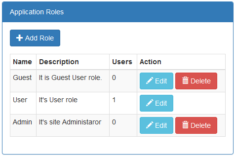
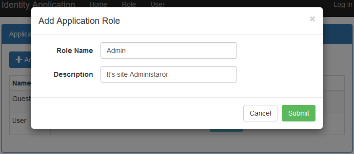
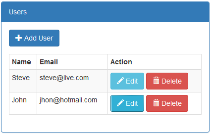
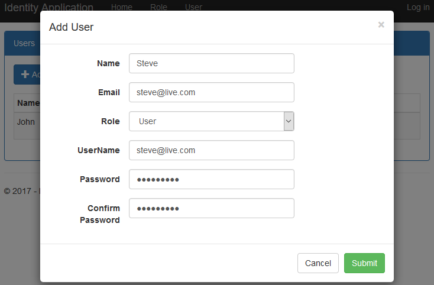
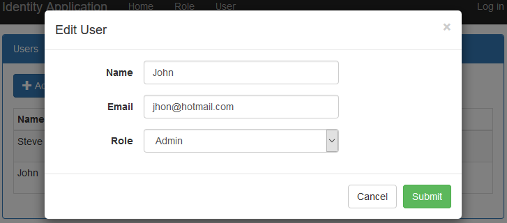
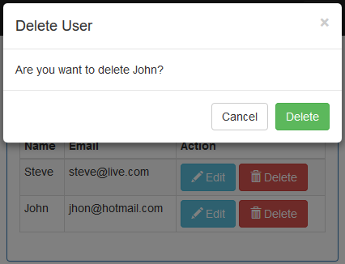
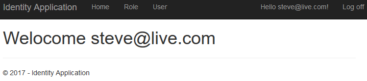
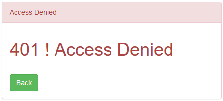

# ASP.NET Core MVC:  Authentication and Role Based  Authorisation  with Identity
## Requires
- Visual Studio 2015
## License
- MIT
## Technologies
- ASP.NET
- ASP.NET Identity
- ASP.NET Core
- ASP.NET Core MVC
- ASP.NET Core 1.1
## Topics
- Authentication
- ASP.NET Identity
- Role-based Authorisation
- ASP.NET Core Identity
## Updated
- 01/16/2017
## Description

<h1>Introduction</h1>

A Visual Studio 2015 project which shows how to implement authentication and role based authorization with ASP.NET identity in the ASP.NET Core MVC application.

The code illustrates the following topics:

<ol>
<li>Listings, create, update and delete application roles. </li><li>Listings, create, update and delete application users. </li><li>Assign and update an application role to the application user. </li><li>Login and Logout functionality. </li><li>Role-based authorization. </li><li>Access denied implemented for unauthorized users. </li><li>Remember me for the authenticate user. </li><li>Show username of the authenticated user. </li><li>Custom application user and role classes. </li></ol>
<h1>Getting Started</h1>

To build and run this sample as-is, you must have Visual Studio 2015 installed. In most cases you can run the application by following these steps:

<ol>
<li>Download and extract the .zip file. </li><li>Open the solution file in Visual Studio. </li><li>Change connection string in the appsettings.json file of the web application.
</li><li>Run the following command for migration and create database.
<ul>
<li>Tools &ndash;&gt; NuGet Package Manager &ndash;&gt; Package Manager Console </li><li>PM&gt; Add-Migration MyFirstMigration </li><li>PM&gt; Update-Database </li></ul>
</li><li>Run the application. </li></ol>
<h1>Running the Sample</h1>

To run the sample, hit F5 or choose the Debug | Start Debugging menu command. You will see the role list screen. From this screen you have role listing screen as shown in below figure. There are also top menu for the &lsquo;Role&rsquo; when clicks on that
 then same screen opens.

Figure 1: Role listing

Now click on &ldquo;Add Role&rdquo; button to add new application role in the application as per following screen.

Figure 2: Add Application Role

As per figure 1, Delete button uses to delete individual application role as per following figure.

Figure 3: Delete Application Role

Now clicks on User menu on the top and shows the application users listing as shown in below figure.

Figure 4: Application User Listing

Now click on &ldquo;Add User&rdquo; button to add new application user in the application as per following screen.

Figure 5: Add Application User

As per figure 4, Edit button uses to edit individual application user as per following figure.

Figure 6: Edit Application User

As per figure 4, Delete button uses to delete individual application role as per following figure.

Figure 7: Delete Application User

Now click on Log In menu button on top the right corner and login with following screen.

Figure 8: User Login Screen

Clicks on &lsquo;Log In&rsquo; button as role based show following screen.The authenticate user must have 'User' role to access this screen.

Figure 9: Welcome Screen After Authorisation

If authenticate user is not authorised then shown following screen.

Figure 10: UnAuthorised Screen

<h1>Source Code Overview</h1>

Most of folders play same role as in MVC application but there are following more folder and files.

<ol>
<li>wwwroot: It holds static js and css files. </li><li>appsettings.json:It holds database connection string. </li><li>Migrations: It holds database migration files. </li><li>ApplicationUser: Custom identity User Class. </li><li>ApplicationRole: Custome Identity Role Class. </li></ol>
