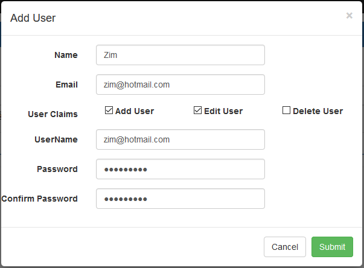
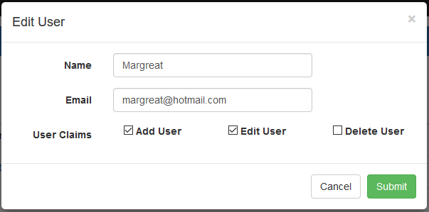
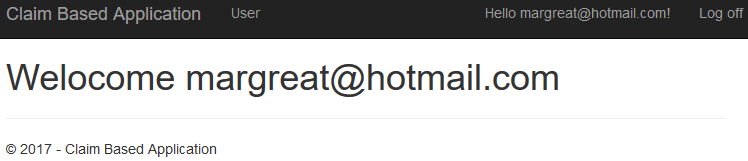
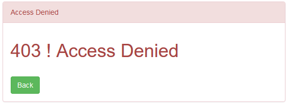

# ASP.NET Core MVC: Authentication and Claim Based authorization with Identity
## Requires
- Visual Studio 2015
## License
- MIT
## Technologies
- ASP.NET
- ASP.NET Core MVC
- ASP.NET Core 1.1
- ASP.NET Core Identity
- Entity Framework Core 1.1
## Topics
- Authentication
- claims-based authentication
- ASP.NET Core Identity
## Updated
- 02/04/2017
## Description

<h1>Introduction</h1>

A Visual Studio 2015 project which shows how to implement authentication and claim based authorization with ASP.NET identity in the ASP.NET Core MVC application.

The code illustrates the following topics:

<ol>
<li>Listings, create, update and delete application users. </li><li>Assign and update claims to the application user. </li><li>Login and Logout functionality. </li><li>Claim and Policy -based authorization. </li><li>Policy with single claim and multiple claim. </li><li>Access denied implemented for unauthorized users. </li><li>Handle authentication and authorization on Ajax request. </li><li>Remember me for the authenticate user. </li><li>Show username of the authenticated user. </li><li>Custom application user class. </li></ol>
<h1>Getting Started</h1>

To build and run this sample as-is, you must have Visual Studio 2015 installed. In most cases you can run the application by following these steps:

<ol>
<li>Download and extract the .zip file. </li><li>Open the solution file in Visual Studio. </li><li>Change connection string in the appsettings.json file of the web application.
</li><li>Run the following command for migration and create database.
<ol>
<li>Tools &ndash;&gt; NuGet Package Manager &ndash;&gt; Package Manager Console </li><li>PM&gt; Add-Migration MyFirstMigration </li><li>PM&gt; Update-Database </li></ol>
</li><li>Run the application. </li></ol>
<h1>Running the Sample</h1>

Before first time run, uncomment authorise attribute for both controller and action methods in user controller so that we can create a user to access application.

To run the sample, hit F5 or choose the Debug | Start Debugging menu command. You will see the application user list screen. From this screen you have user listing screen as shown in below figure. There are also top menu for the &lsquo;User when clicks on
 that then same screen opens.

Figure 1: Application User

Now click on &quot;Add User&quot; button to add new application user in the application as per following screen.

Figure 2: Add New Application User

As per figure 1, Edit button uses to edit individual application user as per following figure.

Figure 3: Edit Application User

As per figure 1, Delete button uses to delete individual application role as per following figure.

Figure 4: Delete Application User

Now click on Log In menu button on top the right corner and login with following screen.

Figure 5: Login Application User

Clicks on &lsquo;Log In&rsquo; button as claim and policy based show following screen.

Figure 6: Welcome Screen after authentication

If authenticate user is not authorised i.e not assigned a claim to access any resource then shown following screen.

Figure 7: Unauthorised Access

<h1>Source Code Overview</h1>

Most of folders play same role as in MVC application but there are following more folder and files.

<ol>
<li>wwwroot: It holds static js and css files. </li><li>appsettings.json:It holds database connection string. </li><li>ApplicationUser: Custom identity User Class. </li><li>Startup.cs:It holds configuration for claims and policy. </li></ol>
