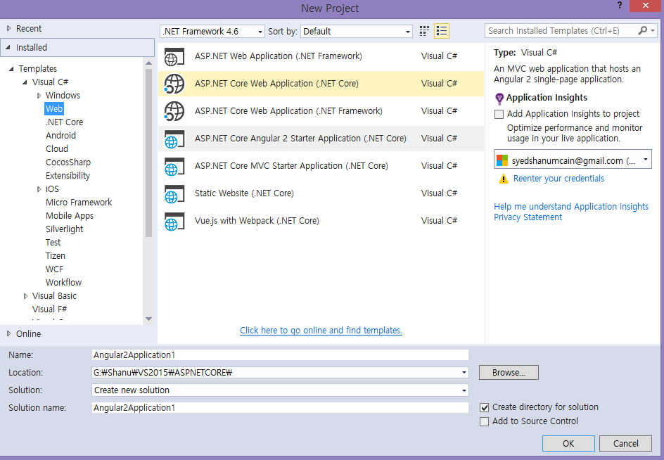
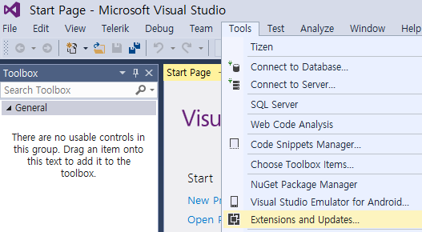
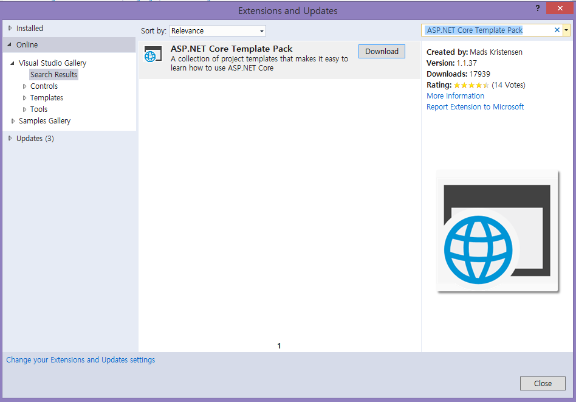
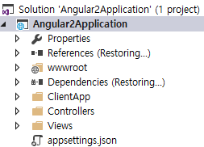
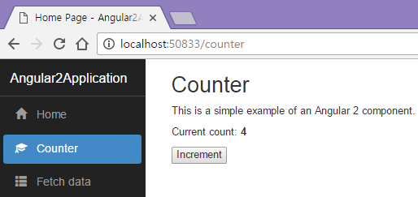
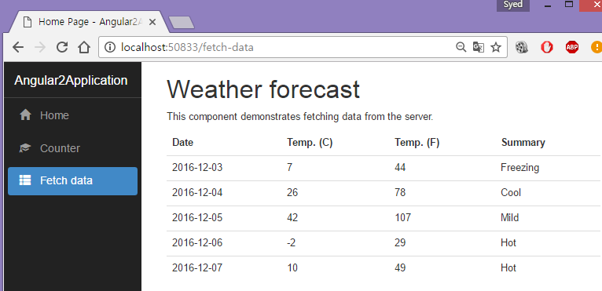
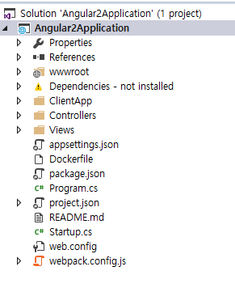
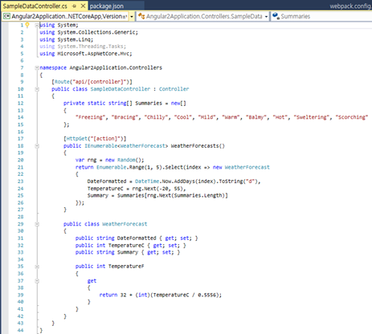

# ASP.NET Core Template Pack
## Requires
- Visual Studio 2015
## License
- MIT
## Technologies
- Angular2
- ASP.NET Core 1.0.1
- ASP.NET Core Template Pack
## Topics
- Angular2
- ASP.NET Core Template Pack
## Updated
- 12/14/2016
## Description

<h1>Introduction</h1>

Now, it has become easier to create an Angular2 application in ASP.NET Core using the ASP.NET Core Template Pack. ASP.NET Core Template contains the following collection of .NET Core Project Templates.

<ul>
<li>ASP.NET Core Angular 2 Starter Application (.NET Core) </li><li>ASP.NET Core MVC Starter Application (.NET Core) </li><li>Static Website (.NET Core) </li><li>Vue.js with Webpack (.NET Core) </li></ul>

After installing our ASP.NET Core Template pack, we can see that the new templates have been added to our Visual Studio.

In this article, we will focus on how to create an ASP.NET Core Angular 2 application. This is normal ASP.NET Core MVC application which hosts Angular 2 single-page application (Reference&nbsp;<a href="http://blog.stevensanderson.com/2016/10/04/angular2-template-for-visual-studio/" target="_blank">link</a>).

<h1>Building the Sample</h1>
<h1><strong>Prerequisites 
</strong></h1>

Make sure, you have installed all the prerequisites in your computer. If not, then download and install all, one by one.

<ol>
<li>First, download and install Visual Studio 2015 with Update 3 from this&nbsp;<a href="https://www.visualstudio.com/downloads/" target="_blank">link</a>.
</li><li>If you have Visual Studio 2015 and not yet updated with update 3, download and install the Visual Studio 2015 Update 3 from this&nbsp;<a href="https://www.visualstudio.com/en-us/news/releasenotes/vs2015-update3-vs" target="_blank">link</a>.&nbsp;
</li><li><a href="https://www.microsoft.com/net/core#windowsvs2015" target="_blank">Download</a>&nbsp;and install .NET Core 1.0.1&nbsp;
</li><li><a href="https://blogs.msdn.microsoft.com/typescript/2016/09/22/announcing-typescript-2-0/" target="_blank">Download</a>&nbsp;and install TypeScript 2.0&nbsp;
</li><li>Download and install Node.js v4.0 or above. I have installed V6.9.1 (Download&nbsp;<a href="https://nodejs.org/en/" target="_blank">link</a>).
</li></ol>

Make sure that you have installed all the listed tools before starting your ASP.NET Core Template Pack. 
 
Now, it&rsquo;s time to install ASP.NET Core Template pack. There are two methods for installing the ASP.NET Core Template Pack.

<h2><strong>First method to install ASP.NET Core Template Pack</strong></h2>

Download ASP.NET Core Template Pack visz file from this&nbsp;<a href="https://marketplace.visualstudio.com/items?itemName=MadsKristensen.ASPNETCoreTemplatePack" target="_blank">link</a>.

<h2><strong>Second Method to install ASP.NET Core Template Pack</strong></h2>

Open Visual Studio 2015 &gt;&gt; Tools &gt;&gt; Select Extensions and Updates.

In the right side click on Search, enter &ldquo;ASP.NET Core Template Pack&rdquo; and download the template. 

Install the ASP.NET Core Template Pack. 

After installation, restart the Visual Studio 2015. Now, we can see that ASP.NET Core Template Pack has been added under web project templates.

 

Description

<h1><strong>Code Part</strong></h1>

Now, let&rsquo;s see how to create our first ASP.NET Core Angular 2 application.

<h1><strong>Step 1- Create ASP.NET Core Angular 2 application</strong></h1>

After installing all the prerequisites listed above and ASP.NET Core Template, click Start &gt;&gt; Programs &gt;&gt; Visual Studio 2015 &gt;&gt; Visual Studio 2015, on your desktop. Click New &gt;&gt; Project. Select Web &gt;&gt; ASP.NET Core Angular
 2 Starter. Enter your project name and click OK.

<h1></h1>

After creating ASP.NET Core Angular 2 application, wait for a few seconds. You will see that all the dependencies are automatically restoring.

<h1></h1>

Here, we can see that all the dependencies have been installed.

Now, our ASP.NET Core Angular 2 application has been successfully created. We can see, this is a very simple and easy method to create ASP.NET Core Angular 2 application.

<h1><strong>Run the Application</strong></h1>

Now, it&rsquo;s time to run our application to see the output.

Here, we can see, the ASP.NET Core Angular 2 application has a few sample outputs, by default, for us to get started. 
 
In left side navigation, we can see &quot;Home/Counter&quot; and &quot;Fetch data&quot; menus. 
 
In this, Home is default menu with &quot;Hello World&quot; message.

<strong>Counter Menu 
 
</strong>We can see simple Angular 2 example for incrementing a counter value.

<strong>Fetch Data 
 
</strong>Next, we have &quot;Fetch data&quot; menu which will display the list of data in Grid, using Angular 2.

Now, ASP.NET Core Template makes our work much easier to develop Angular 2 application.

<h1><strong>Project Solution</strong></h1>

<strong> 
</strong>

In the project Solution Explorer, we can see WWWROOT Folder, ClientApp, Controller, Views, and package.json. In package.json, we can see that all the needed dependencies for Angular 2 have been added by default.

<strong>Controller Folder 
 
</strong>Controller is our MVC Controller folder. In the Controller folder, we can see default HomeController and SampleDataController.

When we run our application, we saw the Fetch output like below.

In &quot;Fetch data&quot; menu, it displays Weather forecast data. This result is being loaded from sampledataController.

In this SampleDataController, we can see Weather Forecasts which returns weather forecast results. This result is being displayed as an output using Angular 2.

<h1>Source Code Files</h1>
<ul>
<li><em><em>Angular2Application.zip.</em></em> </li></ul>
<h1>More Information</h1>

<em>In our next article, we will see more in detail about &nbsp;ClientApp folder and how to customize the MVC Controller to display our own result in our Angular 2 application.</em>

