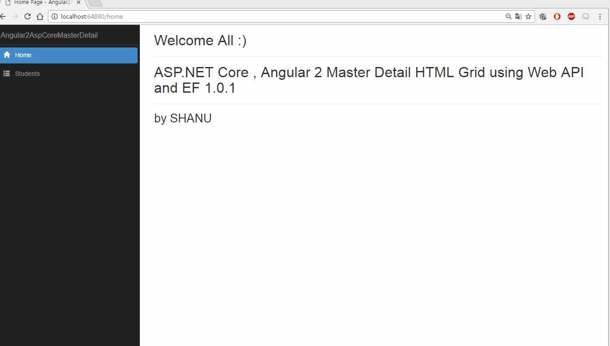
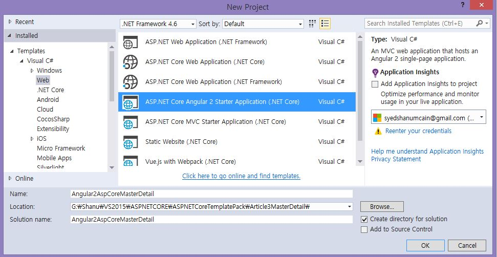
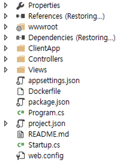
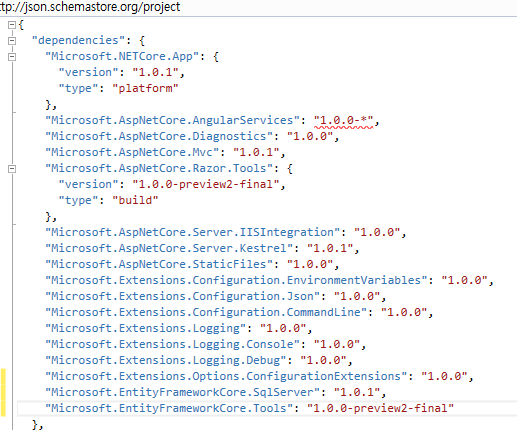
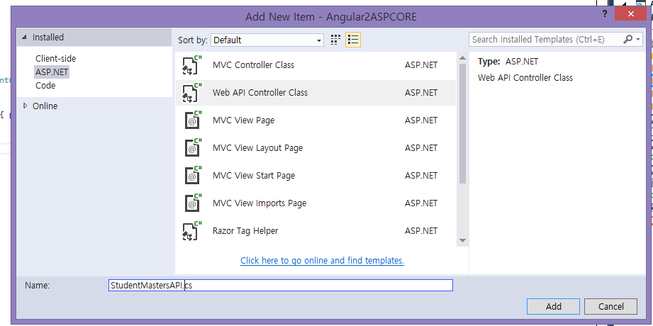
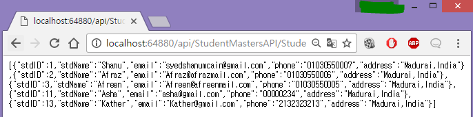
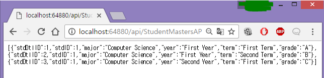

# ASP.NET Core, Angular 2 Master Detail HTML Grid using Web API and EF 1.0.1
## Requires
- Visual Studio 2015
## License
- MIT
## Technologies
- ASP.NET Web API
- ASP.NET Core
- Angular2
- ASP.NET Core 1.0.1
- Entity Framework 1.0.1
## Topics
- ASP.NET Web API
- ASP.NET Core
- Angular2
- ASP.NET Core 1.0.1
- Entity Framework 1.0.1
## Updated
- 01/23/2017
## Description

<h1>Introduction</h1>

In this article let&rsquo;s see how to create our own ASP.NET Core, Angular 2 Master Detail HTML grid using Template pack, Entity Framework 1.0.1 and Web API.

Note: Kindly read our previous article which deeply explains about Getting Started with ASP.NET Core Template Pack&nbsp;

<ul>
<li><a href="https://code.msdn.microsoft.com/ASPNET-Core-Template-Pack-71bcde34?redir=0" target="_blank">ASP.NET Core Template Pack</a>
</li><li><a href="https://code.msdn.microsoft.com/ASPNET-Core-Angular-2-EF-8fbfae0c?redir=0" target="_blank">ASP.NET Core Angular 2 EF 1.0.1 Web API Using Template Pack</a>
</li></ul>

In this article let&rsquo;s see

&nbsp;

<ul>
<li>&nbsp;Creating sample Database and Student Master and Detail Table in SQL Server to display in our web application.
</li><li>&nbsp;How to create ASP.NET Core Angular 2 Starter Application (.NET Core) using Template pack
</li><li>&nbsp;Creating EF, DBContext Class and Model Class. </li><li>&nbsp;Creating WEB API </li><li>Creating our First Component TypeScript file to get WEB API JSON result using Http Module.
</li><li>&nbsp;Creating our first Component HTML file to bind data to Master and Detail HTML Grid
</li></ul>

&nbsp;

This article will explain in detail about how to create a Master /Detail Table and bind the Master related details in inner HTML table to show the output as Master/Detail Grid. Here in this article we have used the Student Master and Student Detail relation
 to show the Master/Detail grid. In Student Master, we store student ID, Name, Email, Phone and Address. In Student Details, we store the student&rsquo;s exam final result for displaying Student Major, studying Year with Term and Grade details.

Here in the below image we can see when the user clicked on the Student ID &ldquo;2&rdquo; then we can see next the details grid was being displayed to show student results in detail by Major, Year, Term and Grade.

Here we display the student details by each student Id.

 

<h1>Building the Sample</h1>
<h1><strong>Prerequisites</strong></h1>

Make sure you have installed all the prerequisites in your computer. If not, then download and install all of them, one by one.

<ol>
<li>First, download and install Visual Studio 2015 with Update 3 from this&nbsp;<a href="https://www.visualstudio.com/downloads/" target="_blank">link</a>.
</li><li>If you have Visual Studio 2015 and have not yet updated with update 3, download and install the Visual Studio 2015 Update 3 from this&nbsp;<a href="https://www.visualstudio.com/en-us/news/releasenotes/vs2015-update3-vs" target="_blank">link</a>.
</li><li><a href="https://www.microsoft.com/net/core#windowsvs2015" target="_blank">Download</a>&nbsp;and install .NET Core 1.0.1
</li><li><a href="https://blogs.msdn.microsoft.com/typescript/2016/09/22/announcing-typescript-2-0/" target="_blank">Download</a>&nbsp;and install TypeScript
 2.0 </li><li>Download and install Node.js v4.0 or above. I have installed V6.9.1 (<a href="https://nodejs.org/en/" target="_blank">Download link</a>).
</li><li>Download and install Download ASP.NET Core Template Pack visz file from this&nbsp;<a href="https://marketplace.visualstudio.com/items?itemName=MadsKristensen.ASPNETCoreTemplatePack" target="_blank">link</a>.
</li></ol>

Description

<h1><strong>Step 1 Create a Database and Table</strong></h1>

We will create a Student Master and Student Detail table to be used for the Master and Detail Grid data binding.

The following is the script to create a database, table and sample insert query.

Run this script in your SQL Server. I have used SQL Server 2014.

&nbsp;

SQL

Edit|Remove

mysql

<pre class="js">USE&nbsp;MASTER&nbsp;&nbsp;&nbsp;
GO&nbsp;&nbsp;&nbsp;
--1)&nbsp;Check&nbsp;&nbsp;&nbsp;
--&nbsp;for&nbsp;the&nbsp;Database&nbsp;Exists.If&nbsp;the&nbsp;database&nbsp;is&nbsp;exist&nbsp;then&nbsp;drop&nbsp;and&nbsp;create&nbsp;new&nbsp;DB&nbsp;&nbsp;&nbsp;
IF&nbsp;EXISTS(SELECT[name]&nbsp;FROM&nbsp;sys.databases&nbsp;WHERE&nbsp;[name]&nbsp;=&nbsp;'StudentsDB')&nbsp;&nbsp;&nbsp;
DROP&nbsp;DATABASE&nbsp;StudentsDB&nbsp;&nbsp;&nbsp;
GO&nbsp;&nbsp;&nbsp;
--CREATEDATABASEStudentsDB&nbsp;&nbsp;&nbsp;
GO&nbsp;&nbsp;&nbsp;
USE&nbsp;StudentsDB&nbsp;&nbsp;&nbsp;
GO&nbsp;&nbsp;&nbsp;
--1)&nbsp;////////////&nbsp;StudentMasters&nbsp;&nbsp;&nbsp;
IF&nbsp;EXISTS(SELECT[name]&nbsp;FROM&nbsp;sys.tables&nbsp;WHERE[name]&nbsp;=&nbsp;'StudentMasters')&nbsp;&nbsp;&nbsp;
DROP&nbsp;TABLE&nbsp;StudentMasters&nbsp;&nbsp;&nbsp;
GO&nbsp;&nbsp;&nbsp;
CREATE&nbsp;TABLE[dbo].[StudentMasters](&nbsp;&nbsp;&nbsp;
&nbsp;&nbsp;&nbsp;&nbsp;&nbsp;&nbsp;&nbsp;&nbsp;[StdID]&nbsp;INT&nbsp;IDENTITY&nbsp;PRIMARY&nbsp;KEY,&nbsp;
&nbsp;&nbsp;&nbsp;&nbsp;&nbsp;&nbsp;&nbsp;&nbsp;[StdName][varchar](100)&nbsp;NOT&nbsp;NULL,&nbsp;&nbsp;
&nbsp;&nbsp;&nbsp;&nbsp;&nbsp;&nbsp;&nbsp;&nbsp;[Email][varchar](100)&nbsp;NOT&nbsp;NULL,&nbsp;&nbsp;
&nbsp;&nbsp;&nbsp;&nbsp;&nbsp;&nbsp;&nbsp;&nbsp;[Phone][varchar](20)&nbsp;NOT&nbsp;NULL,&nbsp;&nbsp;
&nbsp;&nbsp;&nbsp;&nbsp;&nbsp;&nbsp;&nbsp;&nbsp;[Address][varchar](200)&nbsp;NOT&nbsp;NULL&nbsp;&nbsp;&nbsp;
&nbsp;&nbsp;&nbsp;&nbsp;)&nbsp;&nbsp;&nbsp;
&nbsp;&nbsp;&nbsp;&nbsp;--insert&nbsp;sample&nbsp;data&nbsp;to&nbsp;Student&nbsp;Master&nbsp;table&nbsp;&nbsp;&nbsp;
INSERT&nbsp;INTO[StudentMasters]([StdName],&nbsp;[Email],&nbsp;[Phone],&nbsp;[Address])&nbsp;&nbsp;&nbsp;
VALUES('Shanu',&nbsp;'syedshanumcain@gmail.com',&nbsp;'01030550007',&nbsp;'Madurai,India')&nbsp;&nbsp;&nbsp;
INSERT&nbsp;INTO[StudentMasters]([StdName],&nbsp;[Email],&nbsp;[Phone],&nbsp;[Address])&nbsp;&nbsp;&nbsp;
VALUES('Afraz',&nbsp;'Afraz@afrazmail.com',&nbsp;'01030550006',&nbsp;'Madurai,India')&nbsp;&nbsp;&nbsp;
INSERT&nbsp;INTO[StudentMasters]([StdName],&nbsp;[Email],&nbsp;[Phone],&nbsp;[Address])&nbsp;&nbsp;&nbsp;
VALUES('Afreen',&nbsp;'Afreen@afreenmail.com',&nbsp;'01030550005',&nbsp;'Madurai,India')&nbsp;&nbsp;&nbsp;
&nbsp;
select&nbsp;*&nbsp;from[StudentMasters]&nbsp;&nbsp;&nbsp;
&nbsp;
IF&nbsp;EXISTS(SELECT[name]&nbsp;FROM&nbsp;sys.tables&nbsp;WHERE[name]&nbsp;=&nbsp;'StudentDetails')&nbsp;&nbsp;&nbsp;
DROP&nbsp;TABLE&nbsp;StudentDetails&nbsp;&nbsp;&nbsp;
GO&nbsp;
CREATE&nbsp;TABLE[dbo].[StudentDetails](&nbsp;&nbsp;&nbsp;
&nbsp;&nbsp;&nbsp;&nbsp;&nbsp;&nbsp;&nbsp;&nbsp;[StdDtlID]&nbsp;INT&nbsp;IDENTITY&nbsp;PRIMARY&nbsp;KEY,&nbsp;
&nbsp;&nbsp;&nbsp;&nbsp;&nbsp;&nbsp;&nbsp;&nbsp;[StdID]&nbsp;INT&nbsp;,&nbsp;
&nbsp;&nbsp;&nbsp;&nbsp;&nbsp;&nbsp;&nbsp;&nbsp;[Major][varchar](100)&nbsp;NOT&nbsp;NULL,&nbsp;&nbsp;
&nbsp;&nbsp;&nbsp;&nbsp;&nbsp;&nbsp;&nbsp;&nbsp;[Year][varchar](30)&nbsp;NOT&nbsp;NULL,&nbsp;&nbsp;
&nbsp;&nbsp;&nbsp;&nbsp;&nbsp;&nbsp;&nbsp;&nbsp;[Term][varchar](30)&nbsp;NOT&nbsp;NULL,&nbsp;&nbsp;
&nbsp;&nbsp;&nbsp;&nbsp;&nbsp;&nbsp;&nbsp;&nbsp;[Grade][varchar](10)&nbsp;NOT&nbsp;NULL&nbsp;&nbsp;
&nbsp;&nbsp;&nbsp;&nbsp;)&nbsp;&nbsp;&nbsp;
&nbsp;
INSERT&nbsp;INTO[StudentDetails]([StdID],&nbsp;[Major],&nbsp;[Year],&nbsp;[Term],[Grade])&nbsp;&nbsp;&nbsp;
VALUES(1,'Computer&nbsp;Science','First&nbsp;Year','First&nbsp;Term','A')&nbsp;&nbsp;&nbsp;
INSERT&nbsp;INTO[StudentDetails]([StdID],&nbsp;[Major],&nbsp;[Year],&nbsp;[Term],[Grade])&nbsp;&nbsp;&nbsp;
VALUES(1,'Computer&nbsp;Science','First&nbsp;Year','Second&nbsp;Term','B')&nbsp;&nbsp;&nbsp;
INSERT&nbsp;INTO[StudentDetails]([StdID],&nbsp;[Major],&nbsp;[Year],&nbsp;[Term],[Grade])&nbsp;&nbsp;&nbsp;
VALUES(1,'Computer&nbsp;Science','Second&nbsp;Year','First&nbsp;Term','C')&nbsp;&nbsp;&nbsp;
INSERT&nbsp;INTO[StudentDetails]([StdID],&nbsp;[Major],&nbsp;[Year],&nbsp;[Term],[Grade])&nbsp;&nbsp;&nbsp;
VALUES(2,'Computer&nbsp;Engineer','Third&nbsp;Year','First&nbsp;Term','A')&nbsp;&nbsp;&nbsp;
INSERT&nbsp;INTO[StudentDetails]([StdID],&nbsp;[Major],&nbsp;[Year],&nbsp;[Term],[Grade])&nbsp;&nbsp;&nbsp;
VALUES(2,'Computer&nbsp;Engineer','Third&nbsp;Year','Second&nbsp;Term','A')&nbsp;&nbsp;&nbsp;
INSERT&nbsp;INTO[StudentDetails]([StdID],&nbsp;[Major],&nbsp;[Year],&nbsp;[Term],[Grade])&nbsp;&nbsp;&nbsp;
VALUES(3,'English','First&nbsp;Year','First&nbsp;Term','C')&nbsp;&nbsp;&nbsp;
INSERT&nbsp;INTO[StudentDetails]([StdID],&nbsp;[Major],&nbsp;[Year],&nbsp;[Term],[Grade])&nbsp;&nbsp;&nbsp;
VALUES(13,'Economics','First&nbsp;Year','First&nbsp;Term','A')&nbsp;&nbsp;&nbsp;
&nbsp;
select&nbsp;*&nbsp;from&nbsp;StudentDetails&nbsp;
&nbsp;
</pre>

&nbsp;

<h1 class="endscriptcode"><strong>Step 2 Create ASP.NET Core Angular 2 application</strong>&nbsp;</h1>

After installing all the prerequisites listed above and ASP.NET Core Template, click Start &gt;&gt; Programs &gt;&gt; Visual Studio 2015 &gt;&gt; Visual Studio 2015, on your desktop. Click New &gt;&gt; Project. Select Web &gt;&gt;
 ASP.NET Core Angular 2 Starter. Enter your project name and click OK.

After creating ASP.NET Core Angular 2 application, wait for a few seconds. You will see that all the dependencies are automatically restoring.

We will be using all this in our project to create, build and run our Angular 2 with ASP.NET Core Template Pack, WEB API and EF 1.0.1<strong>
</strong>

<h1><strong>Step 3 Creating Entity Framework</strong></h1>

<strong>Add Entity Framework Packages</strong>

To add our Entity Framework Packages in our ASP.NET Core application .Open the Project.JSON File and in dependencies add the below line to.

Note : Here we have used EF version 1.0.1.&nbsp;

&nbsp;

XML

Edit|Remove

xml

<pre class="js">&quot;Microsoft.EntityFrameworkCore.SqlServer&quot;:&nbsp;&quot;1.0.1&quot;,&nbsp;
&nbsp;&nbsp;&nbsp;&nbsp;&quot;Microsoft.EntityFrameworkCore.Tools&quot;:&nbsp;&quot;1.0.0-preview2-final&quot;</pre>

&nbsp;

When we save the project,.json file we can see the Reference was been Restoring.

After few second we can see Entity framework package has been restored and all reference has been added.&nbsp;

<h2><strong>Adding Connection String</strong></h2>

<strong>&nbsp;</strong>To add the connection string with our SQL connection open the &ldquo;appsettings.json&rdquo; file .Yes this is the JSON file and this file looks like the below image by default.

In this appsettings.json file add our connection string&nbsp;&nbsp;

&nbsp;

JavaScript

Edit|Remove

js

<pre class="js">&quot;ConnectionStrings&quot;:&nbsp;{&quot;DefaultConnection&quot;:&nbsp;&quot;Server=YOURDBSERVER;Database=StudentsDB;user&nbsp;id=SQLID;password=SQLPWD;Trusted_Connection=True;MultipleActiveResultSets=true;&quot;},&nbsp;
</pre>

&nbsp;

Note change the SQL connection string as per your local connection.

Next step is we create a folder named &ldquo;Data&rdquo; to create our model and DBContext class

<h2><strong>&nbsp;Model Class for Student Master&nbsp;</strong></h2>

We can create a model by adding a new class file in our Data Folder. Right Click Data folder and click Add&gt;Click Class. Enter the class name as StudentMasters and click Add.

Now in this class we first create property variable, add studentMaster. We will be using this in our WEB API controller.&nbsp;<strong>&nbsp;</strong>

&nbsp;

C#

Edit|Remove

csharp

<pre class="js">using&nbsp;System;&nbsp;
using&nbsp;<a class="libraryLink" href="https://msdn.microsoft.com/en-US/library/System.Collections.Generic.aspx" target="_blank" title="Auto generated link to System.Collections.Generic">System.Collections.Generic</a>;&nbsp;
using&nbsp;<a class="libraryLink" href="https://msdn.microsoft.com/en-US/library/System.Linq.aspx" target="_blank" title="Auto generated link to System.Linq">System.Linq</a>;&nbsp;
using&nbsp;<a class="libraryLink" href="https://msdn.microsoft.com/en-US/library/System.Threading.Tasks.aspx" target="_blank" title="Auto generated link to System.Threading.Tasks">System.Threading.Tasks</a>;&nbsp;
using&nbsp;<a class="libraryLink" href="https://msdn.microsoft.com/en-US/library/System.ComponentModel.DataAnnotations.aspx" target="_blank" title="Auto generated link to System.ComponentModel.DataAnnotations">System.ComponentModel.DataAnnotations</a>;&nbsp;
&nbsp;
namespace&nbsp;Angular2ASPCORE.Data&nbsp;
{&nbsp;
&nbsp;&nbsp;&nbsp;&nbsp;public&nbsp;class&nbsp;StudentMasters&nbsp;
&nbsp;&nbsp;&nbsp;&nbsp;{&nbsp;
&nbsp;&nbsp;&nbsp;&nbsp;&nbsp;&nbsp;&nbsp;&nbsp;[Key]&nbsp;
&nbsp;&nbsp;&nbsp;&nbsp;&nbsp;&nbsp;&nbsp;&nbsp;public&nbsp;int&nbsp;StdID&nbsp;{&nbsp;get;&nbsp;set;&nbsp;}&nbsp;
&nbsp;
&nbsp;&nbsp;&nbsp;&nbsp;&nbsp;&nbsp;&nbsp;&nbsp;[Required]&nbsp;
&nbsp;&nbsp;&nbsp;&nbsp;&nbsp;&nbsp;&nbsp;&nbsp;[Display(Name&nbsp;=&nbsp;&quot;Name&quot;)]&nbsp;
&nbsp;&nbsp;&nbsp;&nbsp;&nbsp;&nbsp;&nbsp;&nbsp;public&nbsp;string&nbsp;StdName&nbsp;{&nbsp;get;&nbsp;set;&nbsp;}&nbsp;
&nbsp;
&nbsp;&nbsp;&nbsp;&nbsp;&nbsp;&nbsp;&nbsp;&nbsp;[Required]&nbsp;
&nbsp;&nbsp;&nbsp;&nbsp;&nbsp;&nbsp;&nbsp;&nbsp;[Display(Name&nbsp;=&nbsp;&quot;Email&quot;)]&nbsp;
&nbsp;&nbsp;&nbsp;&nbsp;&nbsp;&nbsp;&nbsp;&nbsp;public&nbsp;string&nbsp;Email&nbsp;{&nbsp;get;&nbsp;set;&nbsp;}&nbsp;
&nbsp;
&nbsp;&nbsp;&nbsp;&nbsp;&nbsp;&nbsp;&nbsp;&nbsp;[Required]&nbsp;
&nbsp;&nbsp;&nbsp;&nbsp;&nbsp;&nbsp;&nbsp;&nbsp;[Display(Name&nbsp;=&nbsp;&quot;Phone&quot;)]&nbsp;
&nbsp;&nbsp;&nbsp;&nbsp;&nbsp;&nbsp;&nbsp;&nbsp;public&nbsp;string&nbsp;Phone&nbsp;{&nbsp;get;&nbsp;set;&nbsp;}&nbsp;
&nbsp;
&nbsp;&nbsp;&nbsp;&nbsp;&nbsp;&nbsp;&nbsp;&nbsp;public&nbsp;string&nbsp;Address&nbsp;{&nbsp;get;&nbsp;set;&nbsp;}}}</pre>

&nbsp;

<h2><strong>Model Class for Student Detail&nbsp;</strong></h2>

We can create a model by adding a new class file in our Data Folder. Right Click Data folder and click Add&gt;Click Class. Enter the class name as StudentDetails and click Add

Now in this class we first create property variable, add StudentDetails . We will be using this in our WEB API controller.&nbsp;

&nbsp;

C#

Edit|Remove

csharp

<pre class="js">public&nbsp;class&nbsp;StudentDetails&nbsp;
&nbsp;&nbsp;&nbsp;&nbsp;{&nbsp;
&nbsp;&nbsp;&nbsp;&nbsp;&nbsp;&nbsp;&nbsp;&nbsp;[Key]&nbsp;
&nbsp;&nbsp;&nbsp;&nbsp;&nbsp;&nbsp;&nbsp;&nbsp;public&nbsp;int&nbsp;StdDtlID&nbsp;{&nbsp;get;&nbsp;set;&nbsp;}&nbsp;
&nbsp;
&nbsp;&nbsp;&nbsp;&nbsp;&nbsp;&nbsp;&nbsp;&nbsp;[Required]&nbsp;
&nbsp;&nbsp;&nbsp;&nbsp;&nbsp;&nbsp;&nbsp;&nbsp;[Display(Name&nbsp;=&nbsp;&quot;StudentID&quot;)]&nbsp;
&nbsp;&nbsp;&nbsp;&nbsp;&nbsp;&nbsp;&nbsp;&nbsp;public&nbsp;int&nbsp;StdID&nbsp;{&nbsp;get;&nbsp;set;&nbsp;}&nbsp;
&nbsp;
&nbsp;&nbsp;&nbsp;&nbsp;&nbsp;&nbsp;&nbsp;&nbsp;[Required]&nbsp;
&nbsp;&nbsp;&nbsp;&nbsp;&nbsp;&nbsp;&nbsp;&nbsp;[Display(Name&nbsp;=&nbsp;&quot;Major&quot;)]&nbsp;
&nbsp;&nbsp;&nbsp;&nbsp;&nbsp;&nbsp;&nbsp;&nbsp;public&nbsp;string&nbsp;Major&nbsp;{&nbsp;get;&nbsp;set;&nbsp;}&nbsp;
&nbsp;
&nbsp;&nbsp;&nbsp;&nbsp;&nbsp;&nbsp;&nbsp;&nbsp;[Required]&nbsp;
&nbsp;&nbsp;&nbsp;&nbsp;&nbsp;&nbsp;&nbsp;&nbsp;[Display(Name&nbsp;=&nbsp;&quot;Year&quot;)]&nbsp;
&nbsp;&nbsp;&nbsp;&nbsp;&nbsp;&nbsp;&nbsp;&nbsp;public&nbsp;string&nbsp;Year&nbsp;{&nbsp;get;&nbsp;set;&nbsp;}&nbsp;
&nbsp;
&nbsp;&nbsp;&nbsp;&nbsp;&nbsp;&nbsp;&nbsp;&nbsp;[Required]&nbsp;
&nbsp;&nbsp;&nbsp;&nbsp;&nbsp;&nbsp;&nbsp;&nbsp;[Display(Name&nbsp;=&nbsp;&quot;Term&quot;)]&nbsp;
&nbsp;&nbsp;&nbsp;&nbsp;&nbsp;&nbsp;&nbsp;&nbsp;public&nbsp;string&nbsp;Term&nbsp;{&nbsp;get;&nbsp;set;&nbsp;}&nbsp;
&nbsp;
&nbsp;&nbsp;&nbsp;&nbsp;&nbsp;&nbsp;&nbsp;&nbsp;public&nbsp;string&nbsp;Grade&nbsp;{&nbsp;get;&nbsp;set;&nbsp;}}</pre>

&nbsp;

<h2 class="endscriptcode">&nbsp;<strong>Creating Database Context</strong></h2>

DBContext is Entity Framework Class for establishing connection to database

We can create a DBContext class by adding a new class file in our Data Folder. Right Click Data folder and click Add&gt;Click Class. Enter the class name as StudentContext and click Add.

In this class we inherit DbContext and created Dbset for our studentMasters and StudentDetails table.<strong>&nbsp;</strong>

&nbsp;

C#

Edit|Remove

csharp

<pre class="js">using&nbsp;System;&nbsp;
using&nbsp;<a class="libraryLink" href="https://msdn.microsoft.com/en-US/library/System.Collections.Generic.aspx" target="_blank" title="Auto generated link to System.Collections.Generic">System.Collections.Generic</a>;&nbsp;
using&nbsp;<a class="libraryLink" href="https://msdn.microsoft.com/en-US/library/System.Linq.aspx" target="_blank" title="Auto generated link to System.Linq">System.Linq</a>;&nbsp;
using&nbsp;<a class="libraryLink" href="https://msdn.microsoft.com/en-US/library/System.Threading.Tasks.aspx" target="_blank" title="Auto generated link to System.Threading.Tasks">System.Threading.Tasks</a>;&nbsp;
using&nbsp;Microsoft.EntityFrameworkCore;&nbsp;
&nbsp;
namespace&nbsp;Angular2ASPCORE.Data&nbsp;
{&nbsp;
&nbsp;&nbsp;&nbsp;&nbsp;public&nbsp;class&nbsp;studentContext&nbsp;:&nbsp;DbContext&nbsp;
&nbsp;&nbsp;&nbsp;&nbsp;{&nbsp;
&nbsp;&nbsp;&nbsp;&nbsp;&nbsp;&nbsp;&nbsp;&nbsp;public&nbsp;studentContext(DbContextOptions&lt;studentContext&gt;&nbsp;options)&nbsp;
&nbsp;&nbsp;&nbsp;&nbsp;&nbsp;&nbsp;&nbsp;&nbsp;&nbsp;&nbsp;&nbsp;&nbsp;:&nbsp;base(options)&nbsp;{}&nbsp;
&nbsp;&nbsp;&nbsp;&nbsp;&nbsp;&nbsp;&nbsp;&nbsp;public&nbsp;studentContext()&nbsp;{}&nbsp;
&nbsp;&nbsp;&nbsp;&nbsp;&nbsp;&nbsp;&nbsp;&nbsp;public&nbsp;DbSet&lt;StudentMasters&gt;&nbsp;StudentMasters&nbsp;{&nbsp;get;&nbsp;set;&nbsp;}&nbsp;
&nbsp;&nbsp;&nbsp;&nbsp;&nbsp;&nbsp;&nbsp;&nbsp;public&nbsp;DbSet&lt;StudentDetails&gt;&nbsp;StudentDetails&nbsp;{&nbsp;get;&nbsp;set;&nbsp;}}}</pre>

<h2 class="endscriptcode">&nbsp;<strong>Startup.CS</strong></h2>

&nbsp;

Now we need to add our database connection string and provider as SQL SERVER.To add this we add the below code in Startup.cs file under
<strong>ConfigureServices</strong> method.<strong>&nbsp;</strong>

C#

Edit|Remove

csharp

<pre class="js">//&nbsp;Add&nbsp;Entity&nbsp;framework&nbsp;.&nbsp;
&nbsp;&nbsp;&nbsp;&nbsp;&nbsp;&nbsp;&nbsp;&nbsp;&nbsp;&nbsp;&nbsp;&nbsp;services.AddDbContext&lt;studentContext&gt;(options&nbsp;=&gt;&nbsp;
&nbsp;&nbsp;&nbsp;&nbsp;&nbsp;&nbsp;&nbsp;&nbsp;&nbsp;&nbsp;&nbsp;&nbsp;&nbsp;options.UseSqlServer(Configuration.GetConnectionString(&quot;DefaultConnection&quot;)));&nbsp;
</pre>

<h1 class="endscriptcode"><strong style="font-size:2em">Step 4 Creating Web API</strong></h1>

To create our WEB API Controller, right click Controllers folder. Click Add and click New Item.

Click ASP.NET in right side &gt; Click Web API Controller Class. Enter the name as &ldquo;StudentMastersAPI.cs&rdquo; and click Add.

In this we are using only Get method to get all the students result from database and bind the final result using Angular2 to html file.

Here in this web API we get both Student Master , Student Details and Student Details load by condition student ID.

&nbsp;

C#

Edit|Remove

csharp

<pre class="js">[Produces(&quot;application/json&quot;)]&nbsp;
&nbsp;&nbsp;&nbsp;&nbsp;[Route(&quot;api/StudentMastersAPI&quot;)]&nbsp;
&nbsp;&nbsp;&nbsp;&nbsp;public&nbsp;class&nbsp;StudentMastersAPI&nbsp;:&nbsp;Controller&nbsp;
&nbsp;&nbsp;&nbsp;&nbsp;{&nbsp;
&nbsp;&nbsp;&nbsp;&nbsp;&nbsp;&nbsp;&nbsp;&nbsp;private&nbsp;readonly&nbsp;studentContext&nbsp;_context;&nbsp;
&nbsp;
&nbsp;&nbsp;&nbsp;&nbsp;&nbsp;&nbsp;&nbsp;&nbsp;public&nbsp;StudentMastersAPI(studentContext&nbsp;context)&nbsp;
&nbsp;&nbsp;&nbsp;&nbsp;&nbsp;&nbsp;&nbsp;&nbsp;{&nbsp;
&nbsp;&nbsp;&nbsp;&nbsp;&nbsp;&nbsp;&nbsp;&nbsp;&nbsp;&nbsp;&nbsp;&nbsp;_context&nbsp;=&nbsp;context;&nbsp;
&nbsp;&nbsp;&nbsp;&nbsp;&nbsp;&nbsp;&nbsp;&nbsp;}&nbsp;
&nbsp;
&nbsp;&nbsp;&nbsp;&nbsp;&nbsp;&nbsp;&nbsp;&nbsp;//&nbsp;GET:&nbsp;api/values&nbsp;
//&nbsp;For&nbsp;Student&nbsp;Master&nbsp;
&nbsp;&nbsp;&nbsp;&nbsp;&nbsp;&nbsp;&nbsp;&nbsp;[HttpGet]&nbsp;
&nbsp;&nbsp;&nbsp;&nbsp;&nbsp;&nbsp;&nbsp;&nbsp;[Route(&quot;Student&quot;)]&nbsp;
&nbsp;&nbsp;&nbsp;&nbsp;&nbsp;&nbsp;&nbsp;&nbsp;public&nbsp;IEnumerable&lt;StudentMasters&gt;&nbsp;GetStudentMasters()&nbsp;
&nbsp;&nbsp;&nbsp;&nbsp;&nbsp;&nbsp;&nbsp;&nbsp;{&nbsp;
&nbsp;&nbsp;&nbsp;&nbsp;&nbsp;&nbsp;&nbsp;&nbsp;&nbsp;&nbsp;&nbsp;&nbsp;return&nbsp;_context.StudentMasters;&nbsp;
&nbsp;
&nbsp;&nbsp;&nbsp;&nbsp;&nbsp;&nbsp;&nbsp;&nbsp;}&nbsp;
&nbsp;
&nbsp;&nbsp;&nbsp;&nbsp;&nbsp;&nbsp;&nbsp;&nbsp;//&nbsp;GET:&nbsp;api/values&nbsp;
//&nbsp;For&nbsp;Student&nbsp;Detail&nbsp;
&nbsp;
&nbsp;&nbsp;&nbsp;&nbsp;&nbsp;&nbsp;&nbsp;&nbsp;[HttpGet]&nbsp;
&nbsp;&nbsp;&nbsp;&nbsp;&nbsp;&nbsp;&nbsp;&nbsp;[Route(&quot;Details&quot;)]&nbsp;
&nbsp;&nbsp;&nbsp;&nbsp;&nbsp;&nbsp;&nbsp;&nbsp;public&nbsp;IEnumerable&lt;StudentDetails&gt;&nbsp;GetStudentDetails()&nbsp;
&nbsp;&nbsp;&nbsp;&nbsp;&nbsp;&nbsp;&nbsp;&nbsp;{&nbsp;
&nbsp;&nbsp;&nbsp;&nbsp;&nbsp;&nbsp;&nbsp;&nbsp;&nbsp;&nbsp;&nbsp;&nbsp;return&nbsp;_context.StudentDetails;&nbsp;
&nbsp;
&nbsp;&nbsp;&nbsp;&nbsp;&nbsp;&nbsp;&nbsp;&nbsp;}&nbsp;
&nbsp;
//&nbsp;For&nbsp;Student&nbsp;Detail&nbsp;with&nbsp;studentid&nbsp;to&nbsp;load&nbsp;by&nbsp;student&nbsp;ID&nbsp;
&nbsp;
&nbsp;&nbsp;&nbsp;&nbsp;&nbsp;&nbsp;&nbsp;&nbsp;//&nbsp;GET&nbsp;api/values/5&nbsp;
&nbsp;&nbsp;&nbsp;&nbsp;&nbsp;&nbsp;&nbsp;&nbsp;[HttpGet]&nbsp;
&nbsp;&nbsp;&nbsp;&nbsp;&nbsp;&nbsp;&nbsp;&nbsp;[Route(&quot;Details/{id}&quot;)]&nbsp;
&nbsp;&nbsp;&nbsp;&nbsp;&nbsp;&nbsp;&nbsp;&nbsp;public&nbsp;IEnumerable&lt;StudentDetails&gt;&nbsp;GetStudentDetails(int&nbsp;id)&nbsp;
&nbsp;&nbsp;&nbsp;&nbsp;&nbsp;&nbsp;&nbsp;&nbsp;{&nbsp;
&nbsp;&nbsp;&nbsp;&nbsp;&nbsp;&nbsp;&nbsp;&nbsp;&nbsp;&nbsp;&nbsp;&nbsp;return&nbsp;_context.StudentDetails.Where(i&nbsp;=&gt;&nbsp;i.StdID&nbsp;==&nbsp;id).ToList();&nbsp;
&nbsp;&nbsp;&nbsp;&nbsp;&nbsp;&nbsp;&nbsp;&nbsp;}&nbsp;
&nbsp;&nbsp;&nbsp;&nbsp;}&nbsp;
</pre>

&nbsp;To test it we can run our project and copy the get method api path here we can see our API path for get is api/StudentMastersAPI/Student

 
Run the program and paste the above API path to test our output.

&nbsp;

To get the Student Details by Student ID. Here we can see all the Student Details for Student ID=1 has been loaded.

api/StudentMastersAPI/Details/1

<h1><strong>Working with Angular2</strong></h1>

We create all Angular2 related App, Module, Services, Component and html template under ClientApp/App folder.

We create &ldquo;students&rdquo; folder under app folder to create our typescript and html file for displaying Student details.

<h1><strong>Step 5 Creating Component TypeScript</strong></h1>

Right Click on students folder and click on add new Item. Select Client-side from left side and select TypeScript File and name the file as &ldquo;students.component.ts&rdquo; and click Add.

In students.component.ts file we have three parts first is the,

<ol>
<li>import part </li><li>Next is component part </li><li>Next we have the class for writing our business logics. </li></ol>

&nbsp;First we import angular files to be used in our component here we import http for using http client in our Angular2 component.&nbsp;

In component we have selector and template. Selector is to give a name for this app and in our html file we use this selector name to display in our html page. 
 
In template we give our output html file name. here we will create on html file as &ldquo;students.component.html&rdquo;.<strong> 
</strong> 
Export Class is the main class where we do all our business logic and variable declaration to be used in our component template. In this class we get the API method result and bind the result to the student array. &nbsp;

Here we get first all the Student Master data from web API to bind in our html page. We have created one more function named &ldquo;getStudentsDetails&rdquo; to this function we pass the Student ID to load only the selected Student ID related data from Student
 Detail tables. We call this function from button click of each Student Master.

&nbsp;

JavaScript

Edit|Remove

js

<pre class="js">import&nbsp;{&nbsp;Component&nbsp;}&nbsp;from&nbsp;'@angular/core';&nbsp;
import&nbsp;{&nbsp;Http&nbsp;}&nbsp;from&nbsp;&quot;@angular/http&quot;;&nbsp;
&nbsp;
@Component({&nbsp;
&nbsp;&nbsp;&nbsp;&nbsp;selector:&nbsp;'students',&nbsp;
&nbsp;&nbsp;&nbsp;&nbsp;template:&nbsp;require('./students.component.html')&nbsp;
})&nbsp;
&nbsp;
export&nbsp;class&nbsp;studentsComponent&nbsp;{&nbsp;
&nbsp;&nbsp;&nbsp;&nbsp;public&nbsp;student:&nbsp;StudentMasters[]&nbsp;=&nbsp;[];&nbsp;
&nbsp;&nbsp;&nbsp;&nbsp;public&nbsp;studentdetails:&nbsp;StudentDetails[]&nbsp;=&nbsp;[];&nbsp;
&nbsp;&nbsp;&nbsp;&nbsp;myName:&nbsp;string;&nbsp;
&nbsp;&nbsp;&nbsp;&nbsp;activeRow:&nbsp;string&nbsp;=&nbsp;&quot;0&quot;;&nbsp;
&nbsp;&nbsp;&nbsp;&nbsp;constructor(public&nbsp;http:&nbsp;Http)&nbsp;{this.myName&nbsp;=&nbsp;&quot;Shanu&quot;;&nbsp;
&nbsp;&nbsp;&nbsp;&nbsp;&nbsp;&nbsp;&nbsp;&nbsp;this.getStudentMasterData();&nbsp;
&nbsp;&nbsp;&nbsp;&nbsp;}&nbsp;
&nbsp;
&nbsp;&nbsp;&nbsp;&nbsp;getStudentMasterData()&nbsp;{this.http.get('/api/StudentMastersAPI/Student').subscribe(result&nbsp;=&gt;&nbsp;{this.student&nbsp;=&nbsp;result.json();&nbsp;
&nbsp;&nbsp;&nbsp;&nbsp;&nbsp;&nbsp;&nbsp;&nbsp;});&nbsp;
&nbsp;&nbsp;&nbsp;&nbsp;}&nbsp;
&nbsp;
&nbsp;&nbsp;&nbsp;&nbsp;getStudentsDetails(StudID)&nbsp;{this.http.get('/api/StudentMastersAPI/Details/'&nbsp;&#43;&nbsp;StudID).subscribe(result&nbsp;=&gt;&nbsp;{this.studentdetails&nbsp;=&nbsp;result.json();&nbsp;
&nbsp;&nbsp;&nbsp;&nbsp;&nbsp;&nbsp;&nbsp;&nbsp;});&nbsp;
&nbsp;&nbsp;&nbsp;&nbsp;&nbsp;&nbsp;&nbsp;&nbsp;this.activeRow&nbsp;=&nbsp;StudID;&nbsp;&nbsp;
&nbsp;&nbsp;&nbsp;&nbsp;}}////&nbsp;For&nbsp;Student&nbsp;Master&nbsp;
export&nbsp;interface&nbsp;StudentMasters&nbsp;{&nbsp;
&nbsp;&nbsp;&nbsp;&nbsp;stdID:&nbsp;number;&nbsp;
&nbsp;&nbsp;&nbsp;&nbsp;stdName:&nbsp;string;&nbsp;
&nbsp;&nbsp;&nbsp;&nbsp;email:&nbsp;string;&nbsp;
&nbsp;&nbsp;&nbsp;&nbsp;phone:&nbsp;string;&nbsp;
&nbsp;&nbsp;&nbsp;&nbsp;address:&nbsp;string;&nbsp;
}//&nbsp;For&nbsp;Student&nbsp;Details&nbsp;
export&nbsp;interface&nbsp;StudentDetails&nbsp;{&nbsp;
&nbsp;&nbsp;&nbsp;&nbsp;StdDtlID:&nbsp;number;&nbsp;
&nbsp;&nbsp;&nbsp;&nbsp;stdID:&nbsp;number;&nbsp;
&nbsp;&nbsp;&nbsp;&nbsp;Major:&nbsp;string;&nbsp;
&nbsp;&nbsp;&nbsp;&nbsp;Year:&nbsp;string;&nbsp;
&nbsp;&nbsp;&nbsp;&nbsp;Term:&nbsp;string;&nbsp;
&nbsp;&nbsp;&nbsp;&nbsp;Grade:&nbsp;string;&nbsp;
}</pre>

&nbsp;

<h1><strong>Step 6 Creating Component HTML File</strong></h1>

Right Click on students folder and click on add new Item. Select Client-side from left side and select html File and name the file as &ldquo;students.component.html&rdquo; and click Add.

Write the below html code to bind the result in our html page.

Here we have first created HTML Table for loading the Student Master data with Detail Button.

In the Detail Button click we load the Student Details for selected Student and bind the result according to the table row.

&nbsp;

HTML

Edit|Remove

html

<pre class="js">&lt;h1&gt;Angular&nbsp;2with&nbsp;ASP.NET&nbsp;Core&nbsp;Template&nbsp;Pack,&nbsp;WEB&nbsp;API&nbsp;and&nbsp;EF&nbsp;1.0.1&nbsp;&lt;/h1&gt;&nbsp;
&lt;hr&nbsp;/&gt;&nbsp;
&lt;h2&gt;My&nbsp;Name&nbsp;is&nbsp;:&nbsp;{{myName}}&lt;/h2&gt;&nbsp;
&lt;hr&nbsp;/&gt;&nbsp;
&lt;h1&gt;Students&nbsp;Details&nbsp;:&lt;/h1&gt;&nbsp;
&nbsp;&nbsp;
&lt;p&nbsp;*ngIf=&quot;!student&quot;&gt;&lt;em&gt;Loading&nbsp;Student&nbsp;Details&nbsp;please&nbsp;Wait&nbsp;!&nbsp;...&lt;/em&gt;&lt;/p&gt;&nbsp;
&lt;!--&lt;pre&gt;{{&nbsp;studentdetails&nbsp;|&nbsp;json&nbsp;}}&lt;/pre&gt;--&gt;&nbsp;
&lt;table&nbsp;class='table'&nbsp;style=&quot;background-color:#FFFFFF;&nbsp;border:2px&nbsp;#6D7B8D;&nbsp;padding:5px;width:99%;table-layout:fixed;&quot;&nbsp;cellpadding=&quot;2&quot;&nbsp;cellspacing=&quot;2&quot;&nbsp;*ngIf=&quot;student&quot;&gt;&nbsp;
&nbsp;
&nbsp;&nbsp;&nbsp;&nbsp;&lt;tr&nbsp;style=&quot;height:&nbsp;30px;&nbsp;background-color:#336699&nbsp;;&nbsp;color:#FFFFFF&nbsp;;border:&nbsp;solid&nbsp;1px&nbsp;#659EC7;&quot;&gt;&nbsp;
&nbsp;&nbsp;&nbsp;&nbsp;&nbsp;&nbsp;&nbsp;&nbsp;&lt;td&nbsp;&nbsp;width=&quot;80&quot;&nbsp;align=&quot;center&quot;&gt;&lt;/td&gt;&nbsp;
&nbsp;&nbsp;&nbsp;&nbsp;&nbsp;&nbsp;&nbsp;&nbsp;&lt;td&nbsp;width=&quot;80&quot;&nbsp;align=&quot;center&quot;&gt;Student&nbsp;ID&lt;/td&gt;&nbsp;
&nbsp;&nbsp;&nbsp;&nbsp;&nbsp;&nbsp;&nbsp;&nbsp;&lt;td&nbsp;width=&quot;240&quot;&nbsp;align=&quot;center&quot;&gt;Student&nbsp;Name&lt;/td&gt;&nbsp;
&nbsp;&nbsp;&nbsp;&nbsp;&nbsp;&nbsp;&nbsp;&nbsp;&lt;td&nbsp;width=&quot;240&quot;&nbsp;align=&quot;center&quot;&gt;Email&lt;/td&gt;&nbsp;
&nbsp;&nbsp;&nbsp;&nbsp;&nbsp;&nbsp;&nbsp;&nbsp;&lt;td&nbsp;width=&quot;120&quot;&nbsp;align=&quot;center&quot;&gt;Phone&lt;/td&gt;&nbsp;
&nbsp;&nbsp;&nbsp;&nbsp;&nbsp;&nbsp;&nbsp;&nbsp;&lt;td&nbsp;width=&quot;340&quot;&nbsp;align=&quot;center&quot;&gt;Address&lt;/td&gt;&nbsp;
&nbsp;
&nbsp;
&nbsp;&nbsp;&nbsp;&nbsp;&lt;/tr&gt;&nbsp;
&nbsp;&nbsp;&nbsp;&nbsp;&lt;tbody&nbsp;*ngFor=&quot;let&nbsp;StudentMasters&nbsp;&nbsp;of&nbsp;student&quot;&gt;&nbsp;
&nbsp;&nbsp;&nbsp;&nbsp;&nbsp;&nbsp;&nbsp;&nbsp;&lt;tr&gt;&lt;td&nbsp;align=&quot;center&quot;&nbsp;style=&quot;border:&nbsp;solid&nbsp;1px&nbsp;#659EC7;&nbsp;padding:&nbsp;5px;table-layout:fixed;&quot;&gt;&nbsp;
&nbsp;&nbsp;&nbsp;&nbsp;&nbsp;&nbsp;&nbsp;&nbsp;&nbsp;&nbsp;&nbsp;&nbsp;&nbsp;&nbsp;&nbsp;&nbsp;&lt;button&nbsp;(click)=getStudentsDetails(StudentMasters.stdID)&nbsp;style=&quot;background-color:#334668;color:#FFFFFF;font-size:large;width:80px;&nbsp;
&nbsp;&nbsp;&nbsp;&nbsp;&nbsp;&nbsp;&nbsp;&nbsp;&nbsp;&nbsp;&nbsp;&nbsp;&nbsp;&nbsp;&nbsp;&nbsp;&nbsp;&nbsp;&nbsp;&nbsp;&nbsp;&nbsp;&nbsp;&nbsp;&nbsp;&nbsp;&nbsp;&nbsp;&nbsp;&nbsp;border-color:#a2aabe;border-style:dashed;border-width:2px;&quot;&gt;&nbsp;
&nbsp;&nbsp;&nbsp;&nbsp;&nbsp;&nbsp;&nbsp;&nbsp;&nbsp;&nbsp;&nbsp;&nbsp;&nbsp;&nbsp;&nbsp;&nbsp;&nbsp;&nbsp;&nbsp;&nbsp;Detail&nbsp;
&nbsp;&nbsp;&nbsp;&nbsp;&nbsp;&nbsp;&nbsp;&nbsp;&nbsp;&nbsp;&nbsp;&nbsp;&nbsp;&nbsp;&nbsp;&nbsp;&lt;/button&gt;&nbsp;&nbsp;
&nbsp;&nbsp;&nbsp;&nbsp;&nbsp;&nbsp;&nbsp;&nbsp;&nbsp;&nbsp;&nbsp;&nbsp;&nbsp;
&nbsp;&nbsp;&nbsp;&nbsp;&nbsp;&nbsp;&nbsp;&nbsp;&nbsp;&nbsp;&nbsp;&nbsp;&lt;/td&gt;&nbsp;
&nbsp;&nbsp;&nbsp;&nbsp;&nbsp;&nbsp;&nbsp;&nbsp;&nbsp;&nbsp;&nbsp;&nbsp;&lt;td&nbsp;align=&quot;center&quot;&nbsp;style=&quot;border:&nbsp;solid&nbsp;1px&nbsp;#659EC7;&nbsp;padding:&nbsp;5px;table-layout:fixed;&quot;&gt;&nbsp;
&nbsp;&nbsp;&nbsp;&nbsp;&nbsp;&nbsp;&nbsp;&nbsp;&nbsp;&nbsp;&nbsp;&nbsp;&nbsp;&nbsp;&nbsp;&nbsp;&lt;span&nbsp;style=&quot;color:#9F000F&quot;&gt;{{StudentMasters.stdID}}&lt;/span&gt;&nbsp;
&nbsp;&nbsp;&nbsp;&nbsp;&nbsp;&nbsp;&nbsp;&nbsp;&nbsp;&nbsp;&nbsp;&nbsp;&lt;/td&gt;&nbsp;
&nbsp;
&nbsp;&nbsp;&nbsp;&nbsp;&nbsp;&nbsp;&nbsp;&nbsp;&nbsp;&nbsp;&nbsp;&nbsp;&lt;td&nbsp;align=&quot;left&quot;&nbsp;style=&quot;border:&nbsp;solid&nbsp;1px&nbsp;#659EC7;&nbsp;padding:&nbsp;5px;table-layout:fixed;&quot;&gt;&nbsp;
&nbsp;&nbsp;&nbsp;&nbsp;&nbsp;&nbsp;&nbsp;&nbsp;&nbsp;&nbsp;&nbsp;&nbsp;&nbsp;&nbsp;&nbsp;&nbsp;&lt;span&nbsp;style=&quot;color:#9F000F&quot;&gt;{{StudentMasters.stdName}}&lt;/span&gt;&nbsp;
&nbsp;&nbsp;&nbsp;&nbsp;&nbsp;&nbsp;&nbsp;&nbsp;&nbsp;&nbsp;&nbsp;&nbsp;&lt;/td&gt;&nbsp;
&nbsp;
&nbsp;&nbsp;&nbsp;&nbsp;&nbsp;&nbsp;&nbsp;&nbsp;&nbsp;&nbsp;&nbsp;&nbsp;&lt;td&nbsp;align=&quot;left&quot;&nbsp;style=&quot;border:&nbsp;solid&nbsp;1px&nbsp;#659EC7;&nbsp;padding:&nbsp;5px;table-layout:fixed;&quot;&gt;&nbsp;
&nbsp;&nbsp;&nbsp;&nbsp;&nbsp;&nbsp;&nbsp;&nbsp;&nbsp;&nbsp;&nbsp;&nbsp;&nbsp;&nbsp;&nbsp;&nbsp;&lt;span&nbsp;style=&quot;color:#9F000F&quot;&gt;{{StudentMasters.email}}&lt;/span&gt;&nbsp;
&nbsp;&nbsp;&nbsp;&nbsp;&nbsp;&nbsp;&nbsp;&nbsp;&nbsp;&nbsp;&nbsp;&nbsp;&lt;/td&gt;&nbsp;
&nbsp;
&nbsp;&nbsp;&nbsp;&nbsp;&nbsp;&nbsp;&nbsp;&nbsp;&nbsp;&nbsp;&nbsp;&nbsp;&lt;td&nbsp;align=&quot;center&quot;&nbsp;style=&quot;border:&nbsp;solid&nbsp;1px&nbsp;#659EC7;&nbsp;padding:&nbsp;5px;table-layout:fixed;&quot;&gt;&nbsp;
&nbsp;&nbsp;&nbsp;&nbsp;&nbsp;&nbsp;&nbsp;&nbsp;&nbsp;&nbsp;&nbsp;&nbsp;&nbsp;&nbsp;&nbsp;&nbsp;&lt;span&nbsp;style=&quot;color:#9F000F&quot;&gt;{{StudentMasters.phone}}&lt;/span&gt;&nbsp;
&nbsp;&nbsp;&nbsp;&nbsp;&nbsp;&nbsp;&nbsp;&nbsp;&nbsp;&nbsp;&nbsp;&nbsp;&lt;/td&gt;&nbsp;
&nbsp;
&nbsp;&nbsp;&nbsp;&nbsp;&nbsp;&nbsp;&nbsp;&nbsp;&nbsp;&nbsp;&nbsp;&nbsp;&lt;td&nbsp;align=&quot;left&quot;&nbsp;style=&quot;border:&nbsp;solid&nbsp;1px&nbsp;#659EC7;&nbsp;padding:&nbsp;5px;table-layout:fixed;&quot;&gt;&nbsp;
&nbsp;&nbsp;&nbsp;&nbsp;&nbsp;&nbsp;&nbsp;&nbsp;&nbsp;&nbsp;&nbsp;&nbsp;&nbsp;&nbsp;&nbsp;&nbsp;&lt;span&nbsp;style=&quot;color:#9F000F&quot;&gt;{{StudentMasters.address}}&lt;/span&gt;&nbsp;
&nbsp;&nbsp;&nbsp;&nbsp;&nbsp;&nbsp;&nbsp;&nbsp;&nbsp;&nbsp;&nbsp;&nbsp;&lt;/td&gt;&nbsp;
&nbsp;&nbsp;&nbsp;&nbsp;&nbsp;&nbsp;&nbsp;&nbsp;&lt;/tr&gt;&nbsp;&nbsp;
&nbsp;&nbsp;&nbsp;&nbsp;&nbsp;&nbsp;&nbsp;&nbsp;&lt;tr&nbsp;*ngIf=&quot;activeRow==StudentMasters.stdID&quot;&gt;&nbsp;
&nbsp;&nbsp;&nbsp;&nbsp;&nbsp;&nbsp;&nbsp;&nbsp;&nbsp;&nbsp;&nbsp;&nbsp;&lt;td&nbsp;colspan=&quot;6&quot;&nbsp;style=&quot;border:&nbsp;solid&nbsp;1px&nbsp;#659EC7;&nbsp;padding:&nbsp;5px;table-layout:fixed;&quot;&gt;&nbsp;
&nbsp;
&nbsp;&nbsp;&nbsp;&nbsp;&nbsp;&nbsp;&nbsp;&nbsp;&nbsp;&nbsp;&nbsp;&nbsp;&nbsp;&nbsp;&nbsp;&nbsp;&lt;table&nbsp;class='table'&nbsp;style=&quot;background-color:#ECF3F4;&nbsp;border:2px&nbsp;#6D7B8D;&nbsp;padding:5px;width:99%;table-layout:fixed;&quot;&nbsp;cellpadding=&quot;2&quot;&nbsp;cellspacing=&quot;2&quot;&nbsp;*ngIf=&quot;studentdetails&quot;&gt;&nbsp;
&nbsp;
&nbsp;&nbsp;&nbsp;&nbsp;&nbsp;&nbsp;&nbsp;&nbsp;&nbsp;&nbsp;&nbsp;&nbsp;&nbsp;&nbsp;&nbsp;&nbsp;&nbsp;&nbsp;&nbsp;&nbsp;&lt;tr&nbsp;style=&quot;height:&nbsp;30px;&nbsp;background-color:#659EC7&nbsp;;&nbsp;color:#FFFFFF&nbsp;;border:&nbsp;solid&nbsp;1px&nbsp;#659EC7;&quot;&gt;&nbsp;
&nbsp;
&nbsp;&nbsp;&nbsp;&nbsp;&nbsp;&nbsp;&nbsp;&nbsp;&nbsp;&nbsp;&nbsp;&nbsp;&nbsp;&nbsp;&nbsp;&nbsp;&nbsp;&nbsp;&nbsp;&nbsp;&nbsp;&nbsp;&nbsp;&nbsp;&lt;td&nbsp;width=&quot;100&quot;&nbsp;align=&quot;center&quot;&gt;&lt;Strong&gt;Student&nbsp;Detail&nbsp;--&gt;&lt;/Strong&gt;&nbsp;&nbsp;&nbsp;&lt;/td&gt;&nbsp;
&nbsp;&nbsp;&nbsp;&nbsp;&nbsp;&nbsp;&nbsp;&nbsp;&nbsp;&nbsp;&nbsp;&nbsp;&nbsp;&nbsp;&nbsp;&nbsp;&nbsp;&nbsp;&nbsp;&nbsp;&nbsp;&nbsp;&nbsp;&nbsp;&lt;td&nbsp;width=&quot;240&quot;&nbsp;align=&quot;center&quot;&gt;Major&lt;/td&gt;&nbsp;
&nbsp;&nbsp;&nbsp;&nbsp;&nbsp;&nbsp;&nbsp;&nbsp;&nbsp;&nbsp;&nbsp;&nbsp;&nbsp;&nbsp;&nbsp;&nbsp;&nbsp;&nbsp;&nbsp;&nbsp;&nbsp;&nbsp;&nbsp;&nbsp;&lt;td&nbsp;width=&quot;240&quot;&nbsp;align=&quot;center&quot;&gt;Year&lt;/td&gt;&nbsp;
&nbsp;&nbsp;&nbsp;&nbsp;&nbsp;&nbsp;&nbsp;&nbsp;&nbsp;&nbsp;&nbsp;&nbsp;&nbsp;&nbsp;&nbsp;&nbsp;&nbsp;&nbsp;&nbsp;&nbsp;&nbsp;&nbsp;&nbsp;&nbsp;&lt;td&nbsp;width=&quot;120&quot;&nbsp;align=&quot;center&quot;&gt;Term&lt;/td&gt;&nbsp;
&nbsp;&nbsp;&nbsp;&nbsp;&nbsp;&nbsp;&nbsp;&nbsp;&nbsp;&nbsp;&nbsp;&nbsp;&nbsp;&nbsp;&nbsp;&nbsp;&nbsp;&nbsp;&nbsp;&nbsp;&nbsp;&nbsp;&nbsp;&nbsp;&lt;td&nbsp;width=&quot;340&quot;&nbsp;align=&quot;center&quot;&gt;Grade&lt;/td&gt;&nbsp;
&nbsp;
&nbsp;
&nbsp;&nbsp;&nbsp;&nbsp;&nbsp;&nbsp;&nbsp;&nbsp;&nbsp;&nbsp;&nbsp;&nbsp;&nbsp;&nbsp;&nbsp;&nbsp;&nbsp;&nbsp;&nbsp;&nbsp;&lt;/tr&gt;&nbsp;
&nbsp;&nbsp;&nbsp;&nbsp;&nbsp;&nbsp;&nbsp;&nbsp;&nbsp;&nbsp;&nbsp;&nbsp;&nbsp;&nbsp;&nbsp;&nbsp;&nbsp;&nbsp;&nbsp;&nbsp;&lt;tbody&nbsp;*ngFor=&quot;let&nbsp;stddetails&nbsp;&nbsp;of&nbsp;studentdetails&quot;&gt;&nbsp;
&nbsp;&nbsp;&nbsp;&nbsp;&nbsp;&nbsp;&nbsp;&nbsp;&nbsp;&nbsp;&nbsp;&nbsp;&nbsp;&nbsp;&nbsp;&nbsp;&nbsp;&nbsp;&nbsp;&nbsp;&nbsp;&nbsp;&nbsp;&nbsp;&lt;tr&gt;&nbsp;
&nbsp;&nbsp;&nbsp;&nbsp;&nbsp;&nbsp;&nbsp;&nbsp;&nbsp;&nbsp;&nbsp;&nbsp;&nbsp;&nbsp;&nbsp;&nbsp;&nbsp;&nbsp;&nbsp;&nbsp;&nbsp;&nbsp;&nbsp;&nbsp;&nbsp;&nbsp;&nbsp;&nbsp;&lt;td&nbsp;width=&quot;100&quot;&nbsp;align=&quot;center&quot;&gt;&lt;/td&gt;&nbsp;
&nbsp;&nbsp;&nbsp;&nbsp;&nbsp;&nbsp;&nbsp;&nbsp;&nbsp;&nbsp;&nbsp;&nbsp;&nbsp;&nbsp;&nbsp;&nbsp;&nbsp;&nbsp;&nbsp;&nbsp;&nbsp;&nbsp;&nbsp;&nbsp;&nbsp;&nbsp;&nbsp;&nbsp;&lt;td&nbsp;width=&quot;240&quot;&nbsp;align=&quot;center&quot;&gt;{{stddetails.major}}&lt;/td&gt;&nbsp;
&nbsp;&nbsp;&nbsp;&nbsp;&nbsp;&nbsp;&nbsp;&nbsp;&nbsp;&nbsp;&nbsp;&nbsp;&nbsp;&nbsp;&nbsp;&nbsp;&nbsp;&nbsp;&nbsp;&nbsp;&nbsp;&nbsp;&nbsp;&nbsp;&nbsp;&nbsp;&nbsp;&nbsp;&lt;td&nbsp;width=&quot;240&quot;&nbsp;align=&quot;center&quot;&gt;{{stddetails.year}}&lt;/td&gt;&nbsp;
&nbsp;&nbsp;&nbsp;&nbsp;&nbsp;&nbsp;&nbsp;&nbsp;&nbsp;&nbsp;&nbsp;&nbsp;&nbsp;&nbsp;&nbsp;&nbsp;&nbsp;&nbsp;&nbsp;&nbsp;&nbsp;&nbsp;&nbsp;&nbsp;&nbsp;&nbsp;&nbsp;&nbsp;&lt;td&nbsp;width=&quot;120&quot;&nbsp;align=&quot;center&quot;&gt;{{stddetails.term}}&lt;/td&gt;&nbsp;
&nbsp;&nbsp;&nbsp;&nbsp;&nbsp;&nbsp;&nbsp;&nbsp;&nbsp;&nbsp;&nbsp;&nbsp;&nbsp;&nbsp;&nbsp;&nbsp;&nbsp;&nbsp;&nbsp;&nbsp;&nbsp;&nbsp;&nbsp;&nbsp;&nbsp;&nbsp;&nbsp;&nbsp;&lt;td&nbsp;width=&quot;340&quot;&nbsp;align=&quot;center&quot;&gt;{{stddetails.grade}}&nbsp;&nbsp;&lt;/td&gt;&nbsp;
&nbsp;&nbsp;&nbsp;&nbsp;&nbsp;&nbsp;&nbsp;&nbsp;&nbsp;&nbsp;&nbsp;&nbsp;&nbsp;&nbsp;&nbsp;&nbsp;&nbsp;&nbsp;&nbsp;&nbsp;&nbsp;&nbsp;&nbsp;&nbsp;&lt;/tr&gt;&nbsp;
&nbsp;&nbsp;&nbsp;&nbsp;&nbsp;&nbsp;&nbsp;&nbsp;&nbsp;&nbsp;&nbsp;&nbsp;&nbsp;&nbsp;&nbsp;&nbsp;&nbsp;&nbsp;&nbsp;&nbsp;&lt;/tbody&gt;&nbsp;
&nbsp;&nbsp;&nbsp;&nbsp;&nbsp;&nbsp;&nbsp;&nbsp;&nbsp;&nbsp;&nbsp;&nbsp;&nbsp;&nbsp;&nbsp;&nbsp;&lt;/table&gt;&nbsp;
&nbsp;&nbsp;&nbsp;&nbsp;&nbsp;&nbsp;&nbsp;&nbsp;&nbsp;&nbsp;&nbsp;&nbsp;&lt;/td&gt;&nbsp;
&nbsp;&nbsp;&nbsp;&nbsp;&nbsp;&nbsp;&nbsp;&nbsp;&lt;/tr&gt;&nbsp;
&nbsp;&nbsp;&nbsp;&nbsp;&lt;/tbody&gt;&nbsp;
&lt;/table&gt;&nbsp;
</pre>

&nbsp;

<h1 class="endscriptcode"><strong>Step 7 Adding Navigation menu</strong></h1>

We can add our newly created student details menu in existing menu.

TO add our new navigation menu open the &ldquo;navmenu.component.html&rdquo; under navmenu menu.write the below code to add our navigation menu link for students.Here we have removed the existing Count and Fetch menu.<strong>&nbsp;</strong>

HTML

Edit|Remove

html

<pre class="js">&lt;li&nbsp;[routerLinkActive]=&quot;['link-active']&quot;&gt;&nbsp;
&nbsp;&nbsp;&nbsp;&nbsp;&nbsp;&nbsp;&nbsp;&nbsp;&nbsp;&nbsp;&nbsp;&nbsp;&nbsp;&nbsp;&nbsp;&nbsp;&nbsp;&nbsp;&nbsp;&nbsp;&lt;a&nbsp;[routerLink]=&quot;['/students']&quot;&gt;&nbsp;
&nbsp;&nbsp;&nbsp;&nbsp;&nbsp;&nbsp;&nbsp;&nbsp;&nbsp;&nbsp;&nbsp;&nbsp;&nbsp;&nbsp;&nbsp;&nbsp;&nbsp;&nbsp;&nbsp;&nbsp;&nbsp;&nbsp;&nbsp;&nbsp;&lt;span&nbsp;class='glyphicon&nbsp;glyphicon-th-list'&gt;&lt;/span&gt;&nbsp;Students&nbsp;
&nbsp;&nbsp;&nbsp;&nbsp;&nbsp;&nbsp;&nbsp;&nbsp;&nbsp;&nbsp;&nbsp;&nbsp;&nbsp;&nbsp;&nbsp;&nbsp;&nbsp;&nbsp;&nbsp;&nbsp;&lt;/a&gt;&nbsp;
&nbsp;&nbsp;&nbsp;&nbsp;&nbsp;&nbsp;&nbsp;&nbsp;&nbsp;&nbsp;&nbsp;&nbsp;&nbsp;&nbsp;&nbsp;&nbsp;&lt;/li&gt;&nbsp;
</pre>

<h1><strong>Step 8 App Module</strong></h1>

App Module is the root for all files and we can find the app.module.ts under ClientApp\app, and import our students component

App Module is root for all file and we can find the app.module.ts under ClientApp\ app

Import our students component

JavaScript

Edit|Remove

js

<pre class="js">import&nbsp;{&nbsp;NgModule&nbsp;}&nbsp;from&nbsp;'@angular/core';&nbsp;
import&nbsp;{&nbsp;RouterModule&nbsp;}&nbsp;from&nbsp;'@angular/router';&nbsp;
import&nbsp;{&nbsp;UniversalModule&nbsp;}&nbsp;from&nbsp;'angular2-universal';&nbsp;
import&nbsp;{&nbsp;AppComponent&nbsp;}&nbsp;from&nbsp;'./components/app/app.component'&nbsp;
import&nbsp;{&nbsp;NavMenuComponent&nbsp;}&nbsp;from&nbsp;'./components/navmenu/navmenu.component';&nbsp;
import&nbsp;{&nbsp;HomeComponent&nbsp;}&nbsp;from&nbsp;'./components/home/home.component';&nbsp;
import&nbsp;{&nbsp;FetchDataComponent&nbsp;}&nbsp;from&nbsp;'./components/fetchdata/fetchdata.component';&nbsp;
import&nbsp;{&nbsp;CounterComponent&nbsp;}&nbsp;from&nbsp;'./components/counter/counter.component';&nbsp;
import&nbsp;{&nbsp;studentsComponent&nbsp;}&nbsp;from&nbsp;'./components/students/students.component';&nbsp;
&nbsp;
@NgModule({&nbsp;
&nbsp;&nbsp;&nbsp;&nbsp;bootstrap:&nbsp;[&nbsp;AppComponent&nbsp;],&nbsp;
&nbsp;&nbsp;&nbsp;&nbsp;declarations:&nbsp;[&nbsp;
&nbsp;&nbsp;&nbsp;&nbsp;&nbsp;&nbsp;&nbsp;&nbsp;AppComponent,&nbsp;
&nbsp;&nbsp;&nbsp;&nbsp;&nbsp;&nbsp;&nbsp;&nbsp;NavMenuComponent,&nbsp;
&nbsp;&nbsp;&nbsp;&nbsp;&nbsp;&nbsp;&nbsp;&nbsp;CounterComponent,&nbsp;
&nbsp;&nbsp;&nbsp;&nbsp;&nbsp;&nbsp;&nbsp;&nbsp;FetchDataComponent,&nbsp;
&nbsp;&nbsp;&nbsp;&nbsp;&nbsp;&nbsp;&nbsp;&nbsp;HomeComponent,&nbsp;
&nbsp;&nbsp;&nbsp;&nbsp;&nbsp;&nbsp;&nbsp;&nbsp;studentsComponent&nbsp;
&nbsp;&nbsp;&nbsp;&nbsp;],&nbsp;
&nbsp;&nbsp;&nbsp;&nbsp;imports:&nbsp;[&nbsp;
&nbsp;&nbsp;&nbsp;&nbsp;&nbsp;&nbsp;&nbsp;&nbsp;UniversalModule,&nbsp;//&nbsp;Must&nbsp;be&nbsp;first&nbsp;import.&nbsp;This&nbsp;automatically&nbsp;imports&nbsp;BrowserModule,&nbsp;HttpModule,&nbsp;and&nbsp;JsonpModule&nbsp;too.&nbsp;
&nbsp;&nbsp;&nbsp;&nbsp;&nbsp;&nbsp;&nbsp;&nbsp;RouterModule.forRoot([&nbsp;
&nbsp;&nbsp;&nbsp;&nbsp;&nbsp;&nbsp;&nbsp;&nbsp;&nbsp;&nbsp;&nbsp;&nbsp;{&nbsp;path:&nbsp;'',&nbsp;redirectTo:&nbsp;'home',&nbsp;pathMatch:&nbsp;'full'&nbsp;},&nbsp;
&nbsp;&nbsp;&nbsp;&nbsp;&nbsp;&nbsp;&nbsp;&nbsp;&nbsp;&nbsp;&nbsp;&nbsp;{&nbsp;path:&nbsp;'home',&nbsp;component:&nbsp;HomeComponent&nbsp;},&nbsp;
&nbsp;&nbsp;&nbsp;&nbsp;&nbsp;&nbsp;&nbsp;&nbsp;&nbsp;&nbsp;&nbsp;&nbsp;{&nbsp;path:&nbsp;'counter',&nbsp;component:&nbsp;CounterComponent&nbsp;},&nbsp;
&nbsp;&nbsp;&nbsp;&nbsp;&nbsp;&nbsp;&nbsp;&nbsp;&nbsp;&nbsp;&nbsp;&nbsp;{&nbsp;path:&nbsp;'fetch-data',&nbsp;component:&nbsp;FetchDataComponent&nbsp;},&nbsp;
&nbsp;&nbsp;&nbsp;&nbsp;&nbsp;&nbsp;&nbsp;&nbsp;&nbsp;&nbsp;&nbsp;&nbsp;{&nbsp;path:&nbsp;'students',&nbsp;component:&nbsp;studentsComponent&nbsp;},&nbsp;&nbsp;
&nbsp;&nbsp;&nbsp;&nbsp;&nbsp;&nbsp;&nbsp;&nbsp;&nbsp;&nbsp;&nbsp;&nbsp;{&nbsp;path:&nbsp;'**',&nbsp;redirectTo:&nbsp;'home'&nbsp;}&nbsp;
&nbsp;&nbsp;&nbsp;&nbsp;&nbsp;&nbsp;&nbsp;&nbsp;])&nbsp;
&nbsp;&nbsp;&nbsp;&nbsp;]&nbsp;
})&nbsp;
export&nbsp;class&nbsp;AppModule&nbsp;{&nbsp;
}&nbsp;
</pre>

<h1><strong>Step 9 Build and run the Application</strong></h1>

Build and run the application and you can see our Students Master/Detail page will be loaded with all Student Master and Detail information&rsquo;s.

<h1>Source Code Files</h1>
<ul>
<li>Angular2AspCoreMasterDetail.zip </li></ul>
<h1>More Information</h1>

First create the Database and Table in your SQL Server. You can run the SQL Script from this article to create StudentsDB database and StudentMasters and StudentDetails Table and also don&rsquo;t forget to change the Connection string from &ldquo;appsettings.json&rdquo;.<strong>&nbsp;</strong>

