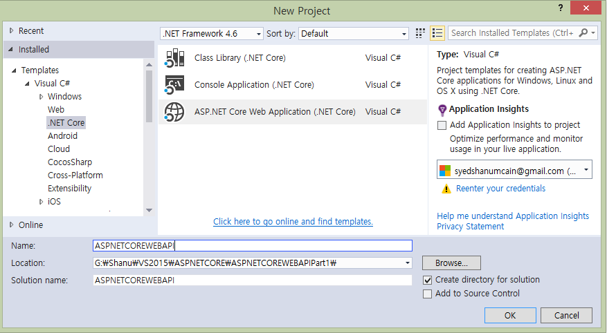
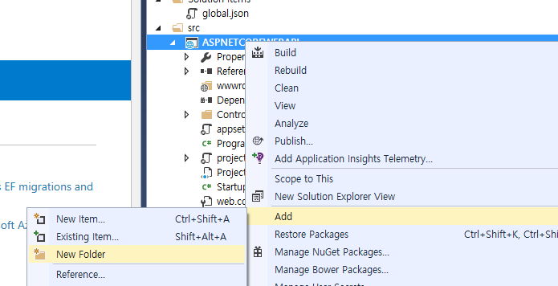
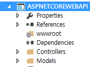
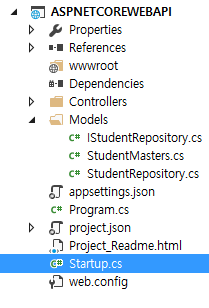
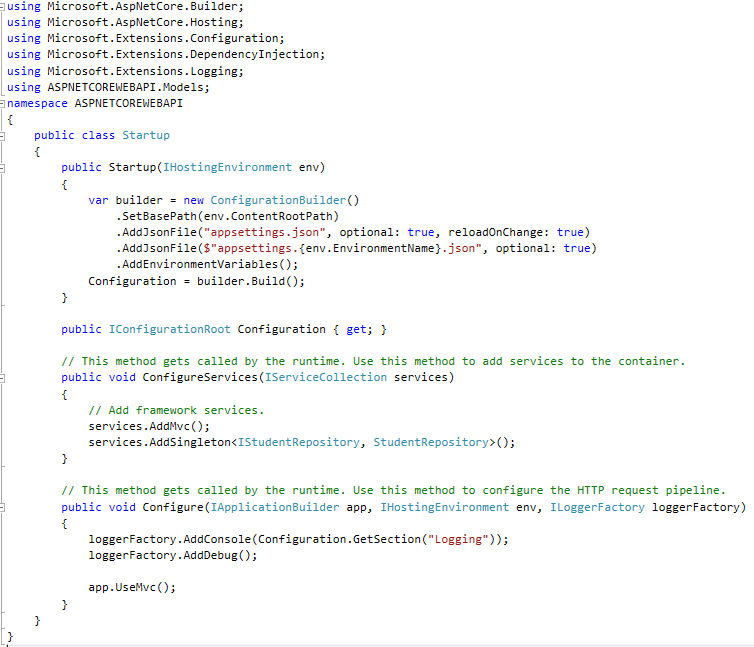
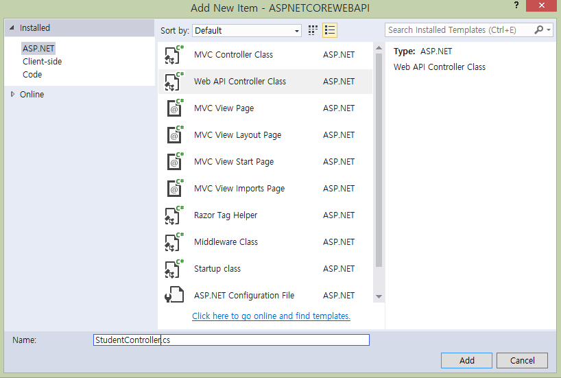

# ASP.NET Core, WEB API and Repository Class
## Requires
- Visual Studio 2015
## License
- MIT
## Technologies
- Repository Pattern
- ASP.NET Web API
- ASP.NET Core
- ASP.NET Core 1.0.1
## Topics
- Repository Pattern
- ASP.NET Web API
- ASP.NET Core
## Updated
- 12/04/2016
## Description

<h1>Introduction</h1>

This will be the series of article. In this series, we will see one by one in detail about

<ol>
<li>Introduction to ASP.NET Core, WEB API and Repository Class </li><li>ASP.NET Core, WEB API and Repository Class display using MVC View </li><li>ASP.NET Core CRUD using WEB API and Repository Class </li><li>ASP.NET Core CRUD with Database using WEB API and Repository Class </li></ol>

In this article, we will see in detail about how to create ASP.NET Core with Repository pattern in the WEB API.

This will be the series of article in the first series will see how to create a simple ASP.NET Core application and creating our first WEB API with Repository Class and view our JSON output in our browser.,&nbsp;

<h1>Building the Sample</h1>

<strong>WEB API</strong>

Web API is a simple and easy way to build HTTP Services for Browsers and Mobiles. It has the following four methods as Get/Post/Put and Delete where.

<ul type="disc">
<li>Get is used to request for the data. (Select) </li><li>Post is used to create a data. (Insert) </li><li>Put is used to update the data. </li><li>Delete used is to delete the data. </li></ul>

&nbsp;Reference&nbsp;<a href="https://docs.microsoft.com/en-us/aspnet/core/tutorials/first-web-api" target="_blank">Link</a>

<strong>Repository Class</strong>

Repository Patten allows us to create a new layer for our business logics and Database operations. We can user repository to store our data.to know more about repository check this&nbsp;<a href="https://msdn.microsoft.com/en-us/library/ff649690.aspx?f=255&MSPPError=-2147217396" target="_blank">link&nbsp;</a>

<strong>Prerequisites</strong>

<ul type="disc">
<li><em>Visual Studio 2015:</em>&nbsp;You can download it from&nbsp;<a href="https://www.visualstudio.com/en-us/downloads/visual-studio-2015-downloads-vs.aspx" target="_blank">here</a>.
</li><li><em>.NET Core 1.0.1:&nbsp;</em>download&nbsp;<a href="https://www.microsoft.com/net" target="_blank">link</a>,<a href="https://www.microsoft.com/net/core#windows" target="_blank">link2</a>.
</li></ul>

Description

<strong>Step 1: Create our ASP.NET Core 1.0.1 Web Application.</strong><strong> 
 
</strong>After installing both Visual Studio 2015 and ASP.NET Core 1.0.1. Click Start, then Programs and select Visual Studio 2015 - Click Visual Studio 2015. Click New, then Project, select Web and select ASP.NET Core Web Application. Enter your
 Project Name and click OK.

Next select WEB API. Click OK.

<strong>Step 2: Creating Modules</strong>

To create our module class first, we create one folder in side our solution project.

Right click our solution &gt; Click Add &gt; Click New Folder

Name the folder as&nbsp;Models.

&nbsp;<strong>Creating Model Class</strong>

Right Click the Model Folder, add new class and name it as&nbsp;<strong>&ldquo;StudentMasters.cs&rdquo;</strong>

In this class, we declare our property variables.&nbsp;

&nbsp;

C#

Edit|Remove

csharp

<pre class="csharp">namespace&nbsp;ASPNETCOREWEBAPI.Models&nbsp;&nbsp;&nbsp;
{&nbsp;&nbsp;&nbsp;
&nbsp;&nbsp;&nbsp;&nbsp;publicclass&nbsp;StudentMasters&nbsp;&nbsp;&nbsp;
&nbsp;&nbsp;&nbsp;&nbsp;{&nbsp;&nbsp;&nbsp;
&nbsp;&nbsp;&nbsp;&nbsp;&nbsp;&nbsp;&nbsp;&nbsp;publicstring&nbsp;StdName&nbsp;{&nbsp;get;&nbsp;set;&nbsp;}&nbsp;&nbsp;&nbsp;
&nbsp;&nbsp;&nbsp;&nbsp;&nbsp;&nbsp;&nbsp;&nbsp;publicstring&nbsp;Email&nbsp;{&nbsp;get;&nbsp;set;&nbsp;}&nbsp;&nbsp;&nbsp;
&nbsp;&nbsp;&nbsp;&nbsp;&nbsp;&nbsp;&nbsp;&nbsp;publicstring&nbsp;Phone&nbsp;{&nbsp;get;&nbsp;set;&nbsp;}&nbsp;&nbsp;&nbsp;
&nbsp;&nbsp;&nbsp;&nbsp;&nbsp;&nbsp;&nbsp;&nbsp;publicstring&nbsp;Address&nbsp;{&nbsp;get;&nbsp;set;&nbsp;}&nbsp;&nbsp;&nbsp;
&nbsp;&nbsp;&nbsp;&nbsp;}&nbsp;&nbsp;&nbsp;
}&nbsp;&nbsp;</pre>

&nbsp;

<strong>Step 3: Repository Class</strong>

<strong>Creating Repository Class</strong>

Here we create a Repository class to inject in to our Controllers. To create a Repository class,

Right click on Models Folder and click Add Class.

Name the class as&nbsp;IStudentRepository .

Here we can see that I have given the class name starting with I as this class we will be using as Interface and here we will declare only our methods to be used in our StudentRepository class.

&nbsp;

C#

Edit|Remove

csharp

<pre class="js">public&nbsp;interface&nbsp;IStudentRepository&nbsp;&nbsp;&nbsp;
&nbsp;&nbsp;&nbsp;&nbsp;{&nbsp;&nbsp;&nbsp;
&nbsp;&nbsp;&nbsp;&nbsp;&nbsp;&nbsp;&nbsp;&nbsp;IEnumerable&lt;StudentMasters&gt;&nbsp;GetAll();&nbsp;&nbsp;&nbsp;
&nbsp;&nbsp;&nbsp;&nbsp;&nbsp;&nbsp;&nbsp;&nbsp;void&nbsp;Add(StudentMasters&nbsp;info);&nbsp;&nbsp;&nbsp;
&nbsp;&nbsp;&nbsp;&nbsp;}</pre>

&nbsp;

In this interface, we have added only Get and Add method. In our next article, we will see in details for CRUD operations.

Creating a class to implement the interface.

Now we create one more class inside Models folder as &ldquo;StudentRepository&rdquo;<strong>&nbsp;we will</strong>

In this class we create method to get all the student information and to add student Information&rsquo;s.

&nbsp;

C#

Edit|Remove

csharp

<pre class="js">using&nbsp;System;&nbsp;&nbsp;&nbsp;
using&nbsp;<a class="libraryLink" href="https://msdn.microsoft.com/en-US/library/System.Collections.Concurrent.aspx" target="_blank" title="Auto generated link to System.Collections.Concurrent">System.Collections.Concurrent</a>;&nbsp;&nbsp;&nbsp;
using&nbsp;<a class="libraryLink" href="https://msdn.microsoft.com/en-US/library/System.Collections.Generic.aspx" target="_blank" title="Auto generated link to System.Collections.Generic">System.Collections.Generic</a>;&nbsp;&nbsp;&nbsp;
using&nbsp;<a class="libraryLink" href="https://msdn.microsoft.com/en-US/library/System.Linq.aspx" target="_blank" title="Auto generated link to System.Linq">System.Linq</a>;&nbsp;&nbsp;&nbsp;
using&nbsp;<a class="libraryLink" href="https://msdn.microsoft.com/en-US/library/System.Threading.Tasks.aspx" target="_blank" title="Auto generated link to System.Threading.Tasks">System.Threading.Tasks</a>;&nbsp;&nbsp;&nbsp;
namespace&nbsp;ASPNETCOREWEBAPI.Models&nbsp;&nbsp;&nbsp;
{&nbsp;&nbsp;&nbsp;
&nbsp;&nbsp;&nbsp;&nbsp;public&nbsp;class&nbsp;StudentRepository:&nbsp;IStudentRepository&nbsp;&nbsp;&nbsp;
&nbsp;&nbsp;&nbsp;&nbsp;{&nbsp;&nbsp;&nbsp;
&nbsp;&nbsp;&nbsp;&nbsp;&nbsp;&nbsp;&nbsp;&nbsp;private&nbsp;static&nbsp;ConcurrentDictionary&lt;string,&nbsp;StudentMasters&gt;&nbsp;stdMaster&nbsp;=&nbsp;new&nbsp;ConcurrentDictionary&lt;string,&nbsp;StudentMasters&gt;();&nbsp;&nbsp;&nbsp;
&nbsp;&nbsp;&nbsp;
&nbsp;&nbsp;&nbsp;&nbsp;&nbsp;&nbsp;&nbsp;&nbsp;public&nbsp;StudentRepository()&nbsp;&nbsp;&nbsp;
&nbsp;&nbsp;&nbsp;&nbsp;&nbsp;&nbsp;&nbsp;&nbsp;{&nbsp;&nbsp;&nbsp;
&nbsp;&nbsp;&nbsp;
&nbsp;&nbsp;&nbsp;&nbsp;&nbsp;&nbsp;&nbsp;&nbsp;&nbsp;&nbsp;&nbsp;&nbsp;Add(new&nbsp;StudentMasters&nbsp;&nbsp;&nbsp;
&nbsp;&nbsp;&nbsp;&nbsp;&nbsp;&nbsp;&nbsp;&nbsp;&nbsp;&nbsp;&nbsp;&nbsp;{&nbsp;&nbsp;&nbsp;
&nbsp;&nbsp;&nbsp;&nbsp;&nbsp;&nbsp;&nbsp;&nbsp;&nbsp;&nbsp;&nbsp;&nbsp;&nbsp;&nbsp;&nbsp;&nbsp;StdName&nbsp;=&nbsp;&quot;Shanu&quot;,&nbsp;&nbsp;&nbsp;
&nbsp;&nbsp;&nbsp;&nbsp;&nbsp;&nbsp;&nbsp;&nbsp;&nbsp;&nbsp;&nbsp;&nbsp;&nbsp;&nbsp;&nbsp;&nbsp;Phone&nbsp;=&nbsp;&quot;&#43;821039120700&quot;,&nbsp;&nbsp;&nbsp;
&nbsp;&nbsp;&nbsp;&nbsp;&nbsp;&nbsp;&nbsp;&nbsp;&nbsp;&nbsp;&nbsp;&nbsp;&nbsp;&nbsp;&nbsp;&nbsp;Email&nbsp;=&nbsp;&quot;syedshanumcain@gmail.com&quot;,&nbsp;&nbsp;&nbsp;
&nbsp;&nbsp;&nbsp;&nbsp;&nbsp;&nbsp;&nbsp;&nbsp;&nbsp;&nbsp;&nbsp;&nbsp;&nbsp;&nbsp;&nbsp;&nbsp;Address&nbsp;=&nbsp;&quot;Seoul,Korea&quot;});&nbsp;&nbsp;&nbsp;
&nbsp;&nbsp;&nbsp;
&nbsp;&nbsp;&nbsp;&nbsp;&nbsp;&nbsp;&nbsp;&nbsp;}&nbsp;&nbsp;&nbsp;
&nbsp;&nbsp;&nbsp;
&nbsp;&nbsp;&nbsp;&nbsp;&nbsp;&nbsp;&nbsp;&nbsp;public&nbsp;IEnumerable&lt;StudentMasters&gt;&nbsp;GetAll()&nbsp;&nbsp;&nbsp;
&nbsp;&nbsp;&nbsp;&nbsp;&nbsp;&nbsp;&nbsp;&nbsp;{return&nbsp;stdMaster.Values;&nbsp;&nbsp;&nbsp;
&nbsp;&nbsp;&nbsp;&nbsp;&nbsp;&nbsp;&nbsp;&nbsp;}&nbsp;&nbsp;&nbsp;
&nbsp;&nbsp;&nbsp;
&nbsp;&nbsp;&nbsp;&nbsp;&nbsp;&nbsp;&nbsp;&nbsp;public&nbsp;void&nbsp;Add(StudentMasters&nbsp;studentInfo)&nbsp;&nbsp;&nbsp;
&nbsp;&nbsp;&nbsp;&nbsp;&nbsp;&nbsp;&nbsp;&nbsp;{&nbsp;&nbsp;&nbsp;
&nbsp;&nbsp;&nbsp;&nbsp;&nbsp;&nbsp;&nbsp;&nbsp;&nbsp;&nbsp;&nbsp;&nbsp;stdMaster[studentInfo.StdName]&nbsp;=&nbsp;studentInfo;&nbsp;&nbsp;&nbsp;
&nbsp;&nbsp;&nbsp;&nbsp;&nbsp;&nbsp;&nbsp;&nbsp;}}}</pre>

&nbsp;

<strong>Adding Repository Class in Configure Services:</strong>

To Inject our repository in Controllers we need to register the repository class with Dependency Injection Container.

To understand what is Dependency Injection(DI) check this&nbsp;<a href="https://docs.microsoft.com/en-us/aspnet/core/fundamentals/dependency-injection" target="_blank">link&nbsp;</a>

Open the Stratup.cs file from our solution project

First we add the using to import our Models folder&nbsp;

&nbsp;

C#

Edit|Remove

csharp

<pre class="js">using&nbsp;ASPNETCOREWEBAPI.Models;&nbsp;&nbsp;</pre>

&nbsp;Next we register our own services like the code below.&nbsp;

C#

Edit|Remove

csharp

<pre class="js">services.AddSingleton&lt;IStudentRepository,&nbsp;StudentRepository&gt;();&nbsp;&nbsp;</pre>

&nbsp;&nbsp;like this&nbsp;

C#

Edit|Remove

csharp

<pre class="csharp">//&nbsp;This&nbsp;method&nbsp;gets&nbsp;called&nbsp;by&nbsp;the&nbsp;runtime.&nbsp;Use&nbsp;this&nbsp;method&nbsp;to&nbsp;add&nbsp;services&nbsp;to&nbsp;the&nbsp;container.&nbsp;&nbsp;&nbsp;
&nbsp;&nbsp;&nbsp;&nbsp;&nbsp;&nbsp;&nbsp;&nbsp;public&nbsp;void&nbsp;ConfigureServices(IServiceCollection&nbsp;services)&nbsp;&nbsp;&nbsp;
&nbsp;&nbsp;&nbsp;&nbsp;&nbsp;&nbsp;&nbsp;&nbsp;{&nbsp;&nbsp;&nbsp;
&nbsp;&nbsp;&nbsp;&nbsp;&nbsp;&nbsp;&nbsp;&nbsp;&nbsp;&nbsp;&nbsp;&nbsp;//&nbsp;Add&nbsp;framework&nbsp;services.&nbsp;&nbsp;&nbsp;
&nbsp;&nbsp;&nbsp;&nbsp;&nbsp;&nbsp;&nbsp;&nbsp;&nbsp;&nbsp;&nbsp;&nbsp;services.AddMvc();&nbsp;&nbsp;&nbsp;
&nbsp;&nbsp;&nbsp;&nbsp;&nbsp;&nbsp;&nbsp;&nbsp;&nbsp;&nbsp;&nbsp;&nbsp;services.AddSingleton&lt;IStudentRepository,&nbsp;StudentRepository&gt;();&nbsp;&nbsp;&nbsp;
&nbsp;&nbsp;&nbsp;&nbsp;&nbsp;&nbsp;&nbsp;&nbsp;}&nbsp;&nbsp;</pre>

&nbsp;Here is complete Startup.cs class

 

&nbsp;

&nbsp;<strong>Step 4:Creating Controllers</strong>

Right Click the Controllers Folder &gt; Click Add &gt; Click New Item.

Select ASP.NET from left side&gt; Select Web API Controller Class.

Give your controller name as &ldquo;StudentController.cs&rdquo;

By default, our Controller class will be like this&nbsp;

&nbsp;

JavaScript

Edit|Remove

js

<pre class="js">using&nbsp;System;&nbsp;&nbsp;&nbsp;
using&nbsp;<a class="libraryLink" href="https://msdn.microsoft.com/en-US/library/System.Collections.Generic.aspx" target="_blank" title="Auto generated link to System.Collections.Generic">System.Collections.Generic</a>;&nbsp;&nbsp;&nbsp;
using&nbsp;<a class="libraryLink" href="https://msdn.microsoft.com/en-US/library/System.Linq.aspx" target="_blank" title="Auto generated link to System.Linq">System.Linq</a>;&nbsp;&nbsp;&nbsp;
using&nbsp;<a class="libraryLink" href="https://msdn.microsoft.com/en-US/library/System.Threading.Tasks.aspx" target="_blank" title="Auto generated link to System.Threading.Tasks">System.Threading.Tasks</a>;&nbsp;&nbsp;&nbsp;
using&nbsp;Microsoft.AspNetCore.Mvc;&nbsp;&nbsp;&nbsp;
&nbsp;&nbsp;&nbsp;
//&nbsp;For&nbsp;more&nbsp;information&nbsp;on&nbsp;enabling&nbsp;Web&nbsp;API&nbsp;for&nbsp;empty&nbsp;projects,&nbsp;visit&nbsp;http://go.microsoft.com/fwlink/?LinkID=397860&nbsp;&nbsp;&nbsp;
&nbsp;&nbsp;&nbsp;
namespace&nbsp;ASPNETCOREWEBAPI.Controllers&nbsp;&nbsp;&nbsp;
{&nbsp;&nbsp;&nbsp;
&nbsp;&nbsp;&nbsp;&nbsp;[Route(&quot;api/[controller]&quot;)]&nbsp;&nbsp;&nbsp;
&nbsp;&nbsp;&nbsp;&nbsp;public&nbsp;class&nbsp;StudentController&nbsp;:&nbsp;Controller&nbsp;&nbsp;&nbsp;
&nbsp;&nbsp;&nbsp;&nbsp;{&nbsp;&nbsp;&nbsp;
&nbsp;&nbsp;&nbsp;&nbsp;&nbsp;&nbsp;&nbsp;&nbsp;//&nbsp;GET:&nbsp;api/values&nbsp;&nbsp;&nbsp;
&nbsp;&nbsp;&nbsp;&nbsp;&nbsp;&nbsp;&nbsp;&nbsp;[HttpGet]&nbsp;&nbsp;&nbsp;
&nbsp;&nbsp;&nbsp;&nbsp;&nbsp;&nbsp;&nbsp;&nbsp;public&nbsp;IEnumerable&lt;string&gt;&nbsp;Get()&nbsp;&nbsp;&nbsp;
&nbsp;&nbsp;&nbsp;&nbsp;&nbsp;&nbsp;&nbsp;&nbsp;{&nbsp;&nbsp;&nbsp;
&nbsp;&nbsp;&nbsp;&nbsp;&nbsp;&nbsp;&nbsp;&nbsp;&nbsp;&nbsp;&nbsp;&nbsp;return&nbsp;new&nbsp;string[]&nbsp;{&nbsp;&quot;value1&quot;,&nbsp;&quot;value2&quot;&nbsp;};&nbsp;&nbsp;&nbsp;
&nbsp;&nbsp;&nbsp;&nbsp;&nbsp;&nbsp;&nbsp;&nbsp;}&nbsp;&nbsp;&nbsp;
&nbsp;&nbsp;&nbsp;
&nbsp;&nbsp;&nbsp;&nbsp;&nbsp;&nbsp;&nbsp;&nbsp;//&nbsp;GET&nbsp;api/values/5&nbsp;&nbsp;&nbsp;
&nbsp;&nbsp;&nbsp;&nbsp;&nbsp;&nbsp;&nbsp;&nbsp;[HttpGet(&quot;{id}&quot;)]&nbsp;&nbsp;&nbsp;
&nbsp;&nbsp;&nbsp;&nbsp;&nbsp;&nbsp;&nbsp;&nbsp;public&nbsp;string&nbsp;Get(int&nbsp;id)&nbsp;&nbsp;&nbsp;
&nbsp;&nbsp;&nbsp;&nbsp;&nbsp;&nbsp;&nbsp;&nbsp;{&nbsp;&nbsp;&nbsp;
&nbsp;&nbsp;&nbsp;&nbsp;&nbsp;&nbsp;&nbsp;&nbsp;&nbsp;&nbsp;&nbsp;&nbsp;return&nbsp;&quot;value&quot;;&nbsp;&nbsp;&nbsp;
&nbsp;&nbsp;&nbsp;&nbsp;&nbsp;&nbsp;&nbsp;&nbsp;}&nbsp;&nbsp;&nbsp;
&nbsp;&nbsp;&nbsp;
&nbsp;&nbsp;&nbsp;&nbsp;&nbsp;&nbsp;&nbsp;&nbsp;//&nbsp;POST&nbsp;api/values&nbsp;&nbsp;&nbsp;
&nbsp;&nbsp;&nbsp;&nbsp;&nbsp;&nbsp;&nbsp;&nbsp;[HttpPost]&nbsp;&nbsp;&nbsp;
&nbsp;&nbsp;&nbsp;&nbsp;&nbsp;&nbsp;&nbsp;&nbsp;public&nbsp;void&nbsp;Post([FromBody]string&nbsp;value)&nbsp;&nbsp;&nbsp;
&nbsp;&nbsp;&nbsp;&nbsp;&nbsp;&nbsp;&nbsp;&nbsp;{&nbsp;&nbsp;&nbsp;
&nbsp;&nbsp;&nbsp;&nbsp;&nbsp;&nbsp;&nbsp;&nbsp;}&nbsp;&nbsp;&nbsp;
&nbsp;&nbsp;&nbsp;
&nbsp;&nbsp;&nbsp;&nbsp;&nbsp;&nbsp;&nbsp;&nbsp;//&nbsp;PUT&nbsp;api/values/5&nbsp;&nbsp;&nbsp;
&nbsp;&nbsp;&nbsp;&nbsp;&nbsp;&nbsp;&nbsp;&nbsp;[HttpPut(&quot;{id}&quot;)]&nbsp;&nbsp;&nbsp;
&nbsp;&nbsp;&nbsp;&nbsp;&nbsp;&nbsp;&nbsp;&nbsp;public&nbsp;void&nbsp;Put(int&nbsp;id,&nbsp;[FromBody]string&nbsp;value)&nbsp;&nbsp;&nbsp;
&nbsp;&nbsp;&nbsp;&nbsp;&nbsp;&nbsp;&nbsp;&nbsp;{&nbsp;&nbsp;&nbsp;
&nbsp;&nbsp;&nbsp;&nbsp;&nbsp;&nbsp;&nbsp;&nbsp;}&nbsp;&nbsp;&nbsp;
&nbsp;&nbsp;&nbsp;
&nbsp;&nbsp;&nbsp;&nbsp;&nbsp;&nbsp;&nbsp;&nbsp;//&nbsp;DELETE&nbsp;api/values/5&nbsp;&nbsp;&nbsp;
&nbsp;&nbsp;&nbsp;&nbsp;&nbsp;&nbsp;&nbsp;&nbsp;[HttpDelete(&quot;{id}&quot;)]&nbsp;&nbsp;&nbsp;
&nbsp;&nbsp;&nbsp;&nbsp;&nbsp;&nbsp;&nbsp;&nbsp;public&nbsp;void&nbsp;Delete(int&nbsp;id)&nbsp;&nbsp;&nbsp;
&nbsp;&nbsp;&nbsp;&nbsp;&nbsp;&nbsp;&nbsp;&nbsp;{&nbsp;&nbsp;&nbsp;
&nbsp;&nbsp;&nbsp;&nbsp;&nbsp;&nbsp;&nbsp;&nbsp;}&nbsp;&nbsp;&nbsp;
&nbsp;&nbsp;&nbsp;&nbsp;}&nbsp;&nbsp;&nbsp;
}&nbsp;</pre>

&nbsp;Remove all the default method inside our controller and change like to add our code.&nbsp;

C#

Edit|Remove

csharp

<pre class="js">using&nbsp;System;&nbsp;&nbsp;&nbsp;
using&nbsp;<a class="libraryLink" href="https://msdn.microsoft.com/en-US/library/System.Collections.Generic.aspx" target="_blank" title="Auto generated link to System.Collections.Generic">System.Collections.Generic</a>;&nbsp;&nbsp;&nbsp;
using&nbsp;<a class="libraryLink" href="https://msdn.microsoft.com/en-US/library/System.Linq.aspx" target="_blank" title="Auto generated link to System.Linq">System.Linq</a>;&nbsp;&nbsp;&nbsp;
using&nbsp;<a class="libraryLink" href="https://msdn.microsoft.com/en-US/library/System.Threading.Tasks.aspx" target="_blank" title="Auto generated link to System.Threading.Tasks">System.Threading.Tasks</a>;&nbsp;&nbsp;&nbsp;
using&nbsp;Microsoft.AspNetCore.Mvc;&nbsp;&nbsp;&nbsp;
&nbsp;&nbsp;&nbsp;
//&nbsp;For&nbsp;more&nbsp;information&nbsp;on&nbsp;enabling&nbsp;Web&nbsp;API&nbsp;for&nbsp;empty&nbsp;projects,&nbsp;visit&nbsp;http://go.microsoft.com/fwlink/?LinkID=397860&nbsp;&nbsp;&nbsp;
&nbsp;&nbsp;&nbsp;
namespace&nbsp;ASPNETCOREWEBAPI.Controllers&nbsp;&nbsp;&nbsp;
{&nbsp;&nbsp;&nbsp;
&nbsp;&nbsp;&nbsp;&nbsp;[Route(&quot;api/[controller]&quot;)]&nbsp;&nbsp;&nbsp;
&nbsp;&nbsp;&nbsp;&nbsp;public&nbsp;class&nbsp;StudentController&nbsp;:&nbsp;Controller&nbsp;&nbsp;&nbsp;
&nbsp;&nbsp;&nbsp;&nbsp;{&nbsp;&nbsp;&nbsp;
&nbsp;&nbsp;&nbsp;
}&nbsp;&nbsp;</pre>

First we add the using in our controller class&nbsp;&nbsp;

C#

Edit|Remove

csharp

<pre class="js">using&nbsp;ASPNETCOREWEBAPI.Models;&nbsp;</pre>

&nbsp;Next we will create object for our Models.&nbsp;

&nbsp;

&nbsp;

C#

Edit|Remove

csharp

<pre class="js">[Route(&quot;api/[controller]&quot;)]&nbsp;&nbsp;&nbsp;
&nbsp;&nbsp;&nbsp;&nbsp;public&nbsp;class&nbsp;StudentController&nbsp;:&nbsp;Controller&nbsp;&nbsp;&nbsp;
&nbsp;&nbsp;&nbsp;&nbsp;{&nbsp;&nbsp;&nbsp;
&nbsp;&nbsp;&nbsp;&nbsp;&nbsp;&nbsp;&nbsp;&nbsp;private&nbsp;List&lt;StudentMasters&gt;&nbsp;_stdInfo;&nbsp;&nbsp;&nbsp;
&nbsp;&nbsp;&nbsp;
}&nbsp;&nbsp;</pre>

&nbsp;<strong style="outline:0px; color:#333333; font-family:&quot;Open Sans&quot;,sans-serif; font-size:15px">Adding Sample Information</strong>

&nbsp;

&nbsp;

<strong style="outline:0px">&nbsp;</strong>

Next we add few sample student information to be get from our WEB API method.&nbsp;

&nbsp;

C#

Edit|Remove

csharp

<pre class="js">[Route(&quot;api/[controller]&quot;)]&nbsp;&nbsp;&nbsp;
&nbsp;&nbsp;&nbsp;&nbsp;public&nbsp;class&nbsp;StudentController&nbsp;:&nbsp;Controller&nbsp;&nbsp;&nbsp;
&nbsp;&nbsp;&nbsp;&nbsp;{&nbsp;&nbsp;&nbsp;
&nbsp;&nbsp;&nbsp;&nbsp;&nbsp;&nbsp;&nbsp;&nbsp;private&nbsp;List&lt;StudentMasters&gt;&nbsp;_stdInfo;&nbsp;&nbsp;&nbsp;
&nbsp;&nbsp;&nbsp;
&nbsp;&nbsp;&nbsp;&nbsp;&nbsp;&nbsp;&nbsp;&nbsp;public&nbsp;StudentController()&nbsp;&nbsp;&nbsp;
&nbsp;&nbsp;&nbsp;&nbsp;&nbsp;&nbsp;&nbsp;&nbsp;{&nbsp;&nbsp;&nbsp;
&nbsp;&nbsp;&nbsp;&nbsp;&nbsp;&nbsp;&nbsp;&nbsp;&nbsp;&nbsp;&nbsp;&nbsp;InitializeData();&nbsp;&nbsp;&nbsp;
&nbsp;&nbsp;&nbsp;&nbsp;&nbsp;&nbsp;&nbsp;&nbsp;}&nbsp;&nbsp;&nbsp;
&nbsp;&nbsp;&nbsp;
//To&nbsp;bind&nbsp;initial&nbsp;Student&nbsp;Information&nbsp;&nbsp;&nbsp;
&nbsp;&nbsp;&nbsp;&nbsp;&nbsp;&nbsp;&nbsp;&nbsp;private&nbsp;void&nbsp;InitializeData()&nbsp;&nbsp;&nbsp;
&nbsp;&nbsp;&nbsp;&nbsp;&nbsp;&nbsp;&nbsp;&nbsp;{&nbsp;&nbsp;&nbsp;
&nbsp;&nbsp;&nbsp;&nbsp;&nbsp;&nbsp;&nbsp;&nbsp;&nbsp;&nbsp;&nbsp;&nbsp;_stdInfo&nbsp;=&nbsp;new&nbsp;List&lt;StudentMasters&gt;();&nbsp;&nbsp;&nbsp;
&nbsp;&nbsp;&nbsp;
&nbsp;&nbsp;&nbsp;&nbsp;&nbsp;&nbsp;&nbsp;&nbsp;&nbsp;&nbsp;&nbsp;&nbsp;var&nbsp;studentInfo1&nbsp;=&nbsp;new&nbsp;StudentMasters&nbsp;&nbsp;&nbsp;
&nbsp;&nbsp;&nbsp;&nbsp;&nbsp;&nbsp;&nbsp;&nbsp;&nbsp;&nbsp;&nbsp;&nbsp;{&nbsp;&nbsp;&nbsp;
&nbsp;&nbsp;&nbsp;&nbsp;&nbsp;&nbsp;&nbsp;&nbsp;&nbsp;&nbsp;&nbsp;&nbsp;&nbsp;&nbsp;&nbsp;&nbsp;StdName&nbsp;=&nbsp;&quot;Shanu&quot;,&nbsp;&nbsp;&nbsp;
&nbsp;&nbsp;&nbsp;&nbsp;&nbsp;&nbsp;&nbsp;&nbsp;&nbsp;&nbsp;&nbsp;&nbsp;&nbsp;&nbsp;&nbsp;&nbsp;Phone&nbsp;=&nbsp;&quot;&#43;821039120700&quot;,&nbsp;&nbsp;&nbsp;
&nbsp;&nbsp;&nbsp;&nbsp;&nbsp;&nbsp;&nbsp;&nbsp;&nbsp;&nbsp;&nbsp;&nbsp;&nbsp;&nbsp;&nbsp;&nbsp;Email&nbsp;=&nbsp;&quot;syedshanumcain@gmail.com&quot;,&nbsp;&nbsp;&nbsp;
&nbsp;&nbsp;&nbsp;&nbsp;&nbsp;&nbsp;&nbsp;&nbsp;&nbsp;&nbsp;&nbsp;&nbsp;&nbsp;&nbsp;&nbsp;&nbsp;Address&nbsp;=&nbsp;&quot;Seoul,Korea&quot;&nbsp;&nbsp;&nbsp;
&nbsp;&nbsp;&nbsp;&nbsp;&nbsp;&nbsp;&nbsp;&nbsp;&nbsp;&nbsp;&nbsp;&nbsp;};&nbsp;&nbsp;&nbsp;
&nbsp;&nbsp;&nbsp;
&nbsp;&nbsp;&nbsp;&nbsp;&nbsp;&nbsp;&nbsp;&nbsp;&nbsp;&nbsp;&nbsp;&nbsp;var&nbsp;studentInfo2&nbsp;=&nbsp;new&nbsp;StudentMasters&nbsp;&nbsp;&nbsp;
&nbsp;&nbsp;&nbsp;&nbsp;&nbsp;&nbsp;&nbsp;&nbsp;&nbsp;&nbsp;&nbsp;&nbsp;{&nbsp;&nbsp;&nbsp;
&nbsp;&nbsp;&nbsp;&nbsp;&nbsp;&nbsp;&nbsp;&nbsp;&nbsp;&nbsp;&nbsp;&nbsp;&nbsp;&nbsp;&nbsp;&nbsp;StdName&nbsp;=&nbsp;&quot;Afraz&quot;,&nbsp;&nbsp;&nbsp;
&nbsp;&nbsp;&nbsp;&nbsp;&nbsp;&nbsp;&nbsp;&nbsp;&nbsp;&nbsp;&nbsp;&nbsp;&nbsp;&nbsp;&nbsp;&nbsp;Phone&nbsp;=&nbsp;&quot;&#43;821000000700&quot;,&nbsp;&nbsp;&nbsp;
&nbsp;&nbsp;&nbsp;&nbsp;&nbsp;&nbsp;&nbsp;&nbsp;&nbsp;&nbsp;&nbsp;&nbsp;&nbsp;&nbsp;&nbsp;&nbsp;Email&nbsp;=&nbsp;&quot;afraz@gmail.com&quot;,&nbsp;&nbsp;&nbsp;
&nbsp;&nbsp;&nbsp;&nbsp;&nbsp;&nbsp;&nbsp;&nbsp;&nbsp;&nbsp;&nbsp;&nbsp;&nbsp;&nbsp;&nbsp;&nbsp;Address&nbsp;=&nbsp;&quot;Madurai,India&quot;&nbsp;&nbsp;&nbsp;
&nbsp;&nbsp;&nbsp;&nbsp;&nbsp;&nbsp;&nbsp;&nbsp;&nbsp;&nbsp;&nbsp;&nbsp;};&nbsp;&nbsp;&nbsp;
&nbsp;&nbsp;&nbsp;
&nbsp;&nbsp;&nbsp;&nbsp;&nbsp;&nbsp;&nbsp;&nbsp;&nbsp;&nbsp;&nbsp;&nbsp;var&nbsp;studentInfo3&nbsp;=&nbsp;new&nbsp;StudentMasters&nbsp;&nbsp;&nbsp;
&nbsp;&nbsp;&nbsp;&nbsp;&nbsp;&nbsp;&nbsp;&nbsp;&nbsp;&nbsp;&nbsp;&nbsp;{&nbsp;&nbsp;&nbsp;
&nbsp;&nbsp;&nbsp;&nbsp;&nbsp;&nbsp;&nbsp;&nbsp;&nbsp;&nbsp;&nbsp;&nbsp;&nbsp;&nbsp;&nbsp;&nbsp;StdName&nbsp;=&nbsp;&quot;Afreen&quot;,&nbsp;&nbsp;&nbsp;
&nbsp;&nbsp;&nbsp;&nbsp;&nbsp;&nbsp;&nbsp;&nbsp;&nbsp;&nbsp;&nbsp;&nbsp;&nbsp;&nbsp;&nbsp;&nbsp;Phone&nbsp;=&nbsp;&quot;&#43;821012340700&quot;,&nbsp;&nbsp;&nbsp;
&nbsp;&nbsp;&nbsp;&nbsp;&nbsp;&nbsp;&nbsp;&nbsp;&nbsp;&nbsp;&nbsp;&nbsp;&nbsp;&nbsp;&nbsp;&nbsp;Email&nbsp;=&nbsp;&quot;afreen@gmail.com&quot;,&nbsp;&nbsp;&nbsp;
&nbsp;&nbsp;&nbsp;&nbsp;&nbsp;&nbsp;&nbsp;&nbsp;&nbsp;&nbsp;&nbsp;&nbsp;&nbsp;&nbsp;&nbsp;&nbsp;Address&nbsp;=&nbsp;&quot;Chennai,India&quot;&nbsp;&nbsp;&nbsp;
&nbsp;&nbsp;&nbsp;&nbsp;&nbsp;&nbsp;&nbsp;&nbsp;&nbsp;&nbsp;&nbsp;&nbsp;};&nbsp;&nbsp;&nbsp;
&nbsp;&nbsp;&nbsp;
&nbsp;&nbsp;&nbsp;&nbsp;&nbsp;&nbsp;&nbsp;&nbsp;&nbsp;&nbsp;&nbsp;&nbsp;_stdInfo.Add(studentInfo1);&nbsp;&nbsp;&nbsp;
&nbsp;&nbsp;&nbsp;&nbsp;&nbsp;&nbsp;&nbsp;&nbsp;&nbsp;&nbsp;&nbsp;&nbsp;_stdInfo.Add(studentInfo2);&nbsp;&nbsp;&nbsp;
&nbsp;&nbsp;&nbsp;&nbsp;&nbsp;&nbsp;&nbsp;&nbsp;&nbsp;&nbsp;&nbsp;&nbsp;_stdInfo.Add(studentInfo3);&nbsp;&nbsp;&nbsp;
&nbsp;&nbsp;&nbsp;&nbsp;&nbsp;&nbsp;&nbsp;&nbsp;}&nbsp;&nbsp;&nbsp;
}&nbsp;&nbsp;</pre>

&nbsp;<strong style="outline:0px; color:#333333; font-family:&quot;Open Sans&quot;,sans-serif; font-size:15px">WEB API Get Method</strong>

&nbsp;

&nbsp;

Using this get method we return all the student information as JSON result.&nbsp;

&nbsp;

C#

Edit|Remove

csharp

<pre class="js">[Route(&quot;api/[controller]&quot;)]&nbsp;&nbsp;&nbsp;
&nbsp;&nbsp;&nbsp;&nbsp;public&nbsp;class&nbsp;StudentController&nbsp;:&nbsp;Controller&nbsp;&nbsp;&nbsp;
&nbsp;&nbsp;&nbsp;&nbsp;{&nbsp;&nbsp;&nbsp;
&nbsp;&nbsp;&nbsp;&nbsp;&nbsp;&nbsp;&nbsp;&nbsp;private&nbsp;List&lt;StudentMasters&gt;&nbsp;_stdInfo;&nbsp;&nbsp;&nbsp;
&nbsp;&nbsp;&nbsp;
&nbsp;&nbsp;&nbsp;&nbsp;&nbsp;&nbsp;&nbsp;&nbsp;public&nbsp;StudentController()&nbsp;&nbsp;&nbsp;
&nbsp;&nbsp;&nbsp;&nbsp;&nbsp;&nbsp;&nbsp;&nbsp;{&nbsp;&nbsp;&nbsp;
&nbsp;&nbsp;&nbsp;&nbsp;&nbsp;&nbsp;&nbsp;&nbsp;&nbsp;&nbsp;&nbsp;&nbsp;InitializeData();&nbsp;&nbsp;&nbsp;
&nbsp;&nbsp;&nbsp;&nbsp;&nbsp;&nbsp;&nbsp;&nbsp;}&nbsp;&nbsp;&nbsp;
&nbsp;&nbsp;&nbsp;
&nbsp;&nbsp;&nbsp;
&nbsp;&nbsp;&nbsp;&nbsp;&nbsp;&nbsp;&nbsp;&nbsp;//This&nbsp;will&nbsp;return&nbsp;all&nbsp;Student&nbsp;Information&nbsp;&nbsp;&nbsp;
&nbsp;&nbsp;&nbsp;&nbsp;&nbsp;&nbsp;&nbsp;&nbsp;[HttpGet]&nbsp;&nbsp;&nbsp;
&nbsp;&nbsp;&nbsp;&nbsp;&nbsp;&nbsp;&nbsp;&nbsp;public&nbsp;IEnumerable&lt;StudentMasters&gt;&nbsp;GetAll()&nbsp;&nbsp;&nbsp;
&nbsp;&nbsp;&nbsp;&nbsp;&nbsp;&nbsp;&nbsp;&nbsp;{&nbsp;&nbsp;&nbsp;
&nbsp;&nbsp;&nbsp;&nbsp;&nbsp;&nbsp;&nbsp;&nbsp;&nbsp;&nbsp;&nbsp;&nbsp;return&nbsp;_stdInfo;&nbsp;&nbsp;&nbsp;
&nbsp;&nbsp;&nbsp;&nbsp;&nbsp;&nbsp;&nbsp;&nbsp;}&nbsp;&nbsp;&nbsp;
}&nbsp;&nbsp;</pre>

&nbsp;Here is the complete code for our controller class with both Adding sample data and using WEB API Get method.&nbsp;

&nbsp;

&nbsp;

C#

Edit|Remove

csharp

<pre class="js">using&nbsp;System;&nbsp;&nbsp;&nbsp;
using&nbsp;<a class="libraryLink" href="https://msdn.microsoft.com/en-US/library/System.Collections.Generic.aspx" target="_blank" title="Auto generated link to System.Collections.Generic">System.Collections.Generic</a>;&nbsp;&nbsp;&nbsp;
using&nbsp;<a class="libraryLink" href="https://msdn.microsoft.com/en-US/library/System.Linq.aspx" target="_blank" title="Auto generated link to System.Linq">System.Linq</a>;&nbsp;&nbsp;&nbsp;
using&nbsp;<a class="libraryLink" href="https://msdn.microsoft.com/en-US/library/System.Threading.Tasks.aspx" target="_blank" title="Auto generated link to System.Threading.Tasks">System.Threading.Tasks</a>;&nbsp;&nbsp;&nbsp;
using&nbsp;Microsoft.AspNetCore.Mvc;&nbsp;&nbsp;&nbsp;
using&nbsp;ASPNETCOREWEBAPI.Models;&nbsp;&nbsp;&nbsp;
//&nbsp;For&nbsp;more&nbsp;information&nbsp;on&nbsp;enabling&nbsp;Web&nbsp;API&nbsp;for&nbsp;empty&nbsp;projects,&nbsp;visit&nbsp;http://go.microsoft.com/fwlink/?LinkID=397860&nbsp;&nbsp;&nbsp;
&nbsp;&nbsp;&nbsp;
namespace&nbsp;ASPNETCOREWEBAPI.Controllers&nbsp;&nbsp;&nbsp;
{&nbsp;&nbsp;&nbsp;
&nbsp;&nbsp;&nbsp;&nbsp;[Route(&quot;api/[controller]&quot;)]&nbsp;&nbsp;&nbsp;
&nbsp;&nbsp;&nbsp;&nbsp;public&nbsp;class&nbsp;StudentController&nbsp;:&nbsp;Controller&nbsp;&nbsp;&nbsp;
&nbsp;&nbsp;&nbsp;&nbsp;{&nbsp;&nbsp;&nbsp;
&nbsp;&nbsp;&nbsp;&nbsp;&nbsp;&nbsp;&nbsp;&nbsp;private&nbsp;List&lt;StudentMasters&gt;&nbsp;_stdInfo;&nbsp;&nbsp;&nbsp;
&nbsp;&nbsp;&nbsp;
&nbsp;&nbsp;&nbsp;&nbsp;&nbsp;&nbsp;&nbsp;&nbsp;public&nbsp;StudentController()&nbsp;&nbsp;&nbsp;
&nbsp;&nbsp;&nbsp;&nbsp;&nbsp;&nbsp;&nbsp;&nbsp;{&nbsp;&nbsp;&nbsp;
&nbsp;&nbsp;&nbsp;&nbsp;&nbsp;&nbsp;&nbsp;&nbsp;&nbsp;&nbsp;&nbsp;&nbsp;InitializeData();&nbsp;&nbsp;&nbsp;
&nbsp;&nbsp;&nbsp;&nbsp;&nbsp;&nbsp;&nbsp;&nbsp;}&nbsp;&nbsp;&nbsp;
&nbsp;&nbsp;&nbsp;
&nbsp;&nbsp;&nbsp;
&nbsp;&nbsp;&nbsp;&nbsp;&nbsp;&nbsp;&nbsp;&nbsp;//This&nbsp;will&nbsp;return&nbsp;all&nbsp;Student&nbsp;Information&nbsp;&nbsp;&nbsp;
&nbsp;&nbsp;&nbsp;&nbsp;&nbsp;&nbsp;&nbsp;&nbsp;[HttpGet]&nbsp;&nbsp;&nbsp;
&nbsp;&nbsp;&nbsp;&nbsp;&nbsp;&nbsp;&nbsp;&nbsp;public&nbsp;IEnumerable&lt;StudentMasters&gt;&nbsp;GetAll()&nbsp;&nbsp;&nbsp;
&nbsp;&nbsp;&nbsp;&nbsp;&nbsp;&nbsp;&nbsp;&nbsp;{&nbsp;&nbsp;&nbsp;
&nbsp;&nbsp;&nbsp;&nbsp;&nbsp;&nbsp;&nbsp;&nbsp;&nbsp;&nbsp;&nbsp;&nbsp;return&nbsp;_stdInfo;&nbsp;&nbsp;&nbsp;
&nbsp;&nbsp;&nbsp;&nbsp;&nbsp;&nbsp;&nbsp;&nbsp;}&nbsp;&nbsp;&nbsp;
&nbsp;&nbsp;&nbsp;
&nbsp;&nbsp;&nbsp;
&nbsp;&nbsp;&nbsp;&nbsp;&nbsp;&nbsp;&nbsp;&nbsp;//To&nbsp;bind&nbsp;initial&nbsp;Student&nbsp;Information&nbsp;&nbsp;&nbsp;
&nbsp;&nbsp;&nbsp;&nbsp;&nbsp;&nbsp;&nbsp;&nbsp;private&nbsp;void&nbsp;InitializeData()&nbsp;&nbsp;&nbsp;
&nbsp;&nbsp;&nbsp;&nbsp;&nbsp;&nbsp;&nbsp;&nbsp;{&nbsp;&nbsp;&nbsp;
&nbsp;&nbsp;&nbsp;&nbsp;&nbsp;&nbsp;&nbsp;&nbsp;&nbsp;&nbsp;&nbsp;&nbsp;_stdInfo&nbsp;=&nbsp;new&nbsp;List&lt;StudentMasters&gt;();&nbsp;&nbsp;&nbsp;
&nbsp;&nbsp;&nbsp;
&nbsp;&nbsp;&nbsp;&nbsp;&nbsp;&nbsp;&nbsp;&nbsp;&nbsp;&nbsp;&nbsp;&nbsp;var&nbsp;studentInfo1&nbsp;=&nbsp;new&nbsp;StudentMasters&nbsp;&nbsp;&nbsp;
&nbsp;&nbsp;&nbsp;&nbsp;&nbsp;&nbsp;&nbsp;&nbsp;&nbsp;&nbsp;&nbsp;&nbsp;{&nbsp;&nbsp;&nbsp;
&nbsp;&nbsp;&nbsp;&nbsp;&nbsp;&nbsp;&nbsp;&nbsp;&nbsp;&nbsp;&nbsp;&nbsp;&nbsp;&nbsp;&nbsp;&nbsp;StdName&nbsp;=&nbsp;&quot;Shanu&quot;,&nbsp;&nbsp;&nbsp;
&nbsp;&nbsp;&nbsp;&nbsp;&nbsp;&nbsp;&nbsp;&nbsp;&nbsp;&nbsp;&nbsp;&nbsp;&nbsp;&nbsp;&nbsp;&nbsp;Phone&nbsp;=&nbsp;&quot;&#43;821039120700&quot;,&nbsp;&nbsp;&nbsp;
&nbsp;&nbsp;&nbsp;&nbsp;&nbsp;&nbsp;&nbsp;&nbsp;&nbsp;&nbsp;&nbsp;&nbsp;&nbsp;&nbsp;&nbsp;&nbsp;Email&nbsp;=&nbsp;&quot;syedshanumcain@gmail.com&quot;,&nbsp;&nbsp;&nbsp;
&nbsp;&nbsp;&nbsp;&nbsp;&nbsp;&nbsp;&nbsp;&nbsp;&nbsp;&nbsp;&nbsp;&nbsp;&nbsp;&nbsp;&nbsp;&nbsp;Address&nbsp;=&nbsp;&quot;Seoul,Korea&quot;&nbsp;&nbsp;&nbsp;
&nbsp;&nbsp;&nbsp;&nbsp;&nbsp;&nbsp;&nbsp;&nbsp;&nbsp;&nbsp;&nbsp;&nbsp;};&nbsp;&nbsp;&nbsp;
&nbsp;&nbsp;&nbsp;
&nbsp;&nbsp;&nbsp;&nbsp;&nbsp;&nbsp;&nbsp;&nbsp;&nbsp;&nbsp;&nbsp;&nbsp;var&nbsp;studentInfo2&nbsp;=&nbsp;new&nbsp;StudentMasters&nbsp;&nbsp;&nbsp;
&nbsp;&nbsp;&nbsp;&nbsp;&nbsp;&nbsp;&nbsp;&nbsp;&nbsp;&nbsp;&nbsp;&nbsp;{&nbsp;&nbsp;&nbsp;
&nbsp;&nbsp;&nbsp;&nbsp;&nbsp;&nbsp;&nbsp;&nbsp;&nbsp;&nbsp;&nbsp;&nbsp;&nbsp;&nbsp;&nbsp;&nbsp;StdName&nbsp;=&nbsp;&quot;Afraz&quot;,&nbsp;&nbsp;&nbsp;
&nbsp;&nbsp;&nbsp;&nbsp;&nbsp;&nbsp;&nbsp;&nbsp;&nbsp;&nbsp;&nbsp;&nbsp;&nbsp;&nbsp;&nbsp;&nbsp;Phone&nbsp;=&nbsp;&quot;&#43;821000000700&quot;,&nbsp;&nbsp;&nbsp;
&nbsp;&nbsp;&nbsp;&nbsp;&nbsp;&nbsp;&nbsp;&nbsp;&nbsp;&nbsp;&nbsp;&nbsp;&nbsp;&nbsp;&nbsp;&nbsp;Email&nbsp;=&nbsp;&quot;afraz@gmail.com&quot;,&nbsp;&nbsp;&nbsp;
&nbsp;&nbsp;&nbsp;&nbsp;&nbsp;&nbsp;&nbsp;&nbsp;&nbsp;&nbsp;&nbsp;&nbsp;&nbsp;&nbsp;&nbsp;&nbsp;Address&nbsp;=&nbsp;&quot;Madurai,India&quot;&nbsp;&nbsp;&nbsp;
&nbsp;&nbsp;&nbsp;&nbsp;&nbsp;&nbsp;&nbsp;&nbsp;&nbsp;&nbsp;&nbsp;&nbsp;};&nbsp;&nbsp;&nbsp;
&nbsp;&nbsp;&nbsp;
&nbsp;&nbsp;&nbsp;&nbsp;&nbsp;&nbsp;&nbsp;&nbsp;&nbsp;&nbsp;&nbsp;&nbsp;var&nbsp;studentInfo3&nbsp;=&nbsp;new&nbsp;StudentMasters&nbsp;&nbsp;&nbsp;
&nbsp;&nbsp;&nbsp;&nbsp;&nbsp;&nbsp;&nbsp;&nbsp;&nbsp;&nbsp;&nbsp;&nbsp;{&nbsp;&nbsp;&nbsp;
&nbsp;&nbsp;&nbsp;&nbsp;&nbsp;&nbsp;&nbsp;&nbsp;&nbsp;&nbsp;&nbsp;&nbsp;&nbsp;&nbsp;&nbsp;&nbsp;StdName&nbsp;=&nbsp;&quot;Afreen&quot;,&nbsp;&nbsp;&nbsp;
&nbsp;&nbsp;&nbsp;&nbsp;&nbsp;&nbsp;&nbsp;&nbsp;&nbsp;&nbsp;&nbsp;&nbsp;&nbsp;&nbsp;&nbsp;&nbsp;Phone&nbsp;=&nbsp;&quot;&#43;821012340700&quot;,&nbsp;&nbsp;&nbsp;
&nbsp;&nbsp;&nbsp;&nbsp;&nbsp;&nbsp;&nbsp;&nbsp;&nbsp;&nbsp;&nbsp;&nbsp;&nbsp;&nbsp;&nbsp;&nbsp;Email&nbsp;=&nbsp;&quot;afreen@gmail.com&quot;,&nbsp;&nbsp;&nbsp;
&nbsp;&nbsp;&nbsp;&nbsp;&nbsp;&nbsp;&nbsp;&nbsp;&nbsp;&nbsp;&nbsp;&nbsp;&nbsp;&nbsp;&nbsp;&nbsp;Address&nbsp;=&nbsp;&quot;Chennai,India&quot;&nbsp;&nbsp;&nbsp;
&nbsp;&nbsp;&nbsp;&nbsp;&nbsp;&nbsp;&nbsp;&nbsp;&nbsp;&nbsp;&nbsp;&nbsp;};&nbsp;&nbsp;&nbsp;
&nbsp;&nbsp;&nbsp;
&nbsp;&nbsp;&nbsp;&nbsp;&nbsp;&nbsp;&nbsp;&nbsp;&nbsp;&nbsp;&nbsp;&nbsp;_stdInfo.Add(studentInfo1);&nbsp;&nbsp;&nbsp;
&nbsp;&nbsp;&nbsp;&nbsp;&nbsp;&nbsp;&nbsp;&nbsp;&nbsp;&nbsp;&nbsp;&nbsp;_stdInfo.Add(studentInfo2);&nbsp;&nbsp;&nbsp;
&nbsp;&nbsp;&nbsp;&nbsp;&nbsp;&nbsp;&nbsp;&nbsp;&nbsp;&nbsp;&nbsp;&nbsp;_stdInfo.Add(studentInfo3);&nbsp;&nbsp;&nbsp;
&nbsp;&nbsp;&nbsp;&nbsp;&nbsp;&nbsp;&nbsp;&nbsp;}&nbsp;&nbsp;&nbsp;
&nbsp;&nbsp;&nbsp;&nbsp;}&nbsp;&nbsp;&nbsp;
}&nbsp;&nbsp;</pre>

&nbsp;<strong style="outline:0px; color:#333333; font-family:&quot;Open Sans&quot;,sans-serif; font-size:15px">Step 5: Run the application</strong>

&nbsp;

&nbsp;

To see the result runt the application .

When we run the application by default we can see the values controller result as values

http://localhost:64764/api/values

Change the Values with our newly created controller name as student &ldquo;http://localhost:64764/api/student&ldquo;.&nbsp;

Here now we can see all our added student information has been displayed as JSON result.

Source Code Files

<ul>
<li><em>source code file name #1 - summary for this source code file.</em> </li><li><em><em>source code file name #2 - summary for this source code file.</em></em>
</li></ul>
<h1>More Information</h1>

This will be series of article in this first series we have seen in details about our first ASP.NET Core, WEB API and Repository Class for Get method. In next series, we will
 see how to bind this result in our MVC View.

&nbsp;

&nbsp;Give your controller name as &ldquo;StudentController.cs&rdquo;

By default, our Controller class will be like this&nbsp;

<ol class="dp-c" style="outline:0px; padding:0px; border:none; list-style-position:initial; background-color:#ffffff; color:#5c5c5c; margin:0px 1px 1px 45px!important">
<li class="alt" style="outline:0px; border-top:none; border-right:none; border-bottom:none; border-left:3px solid #6ce26c; list-style-type:decimal-leading-zero; color:inherit; line-height:14px; margin:0px!important; padding:0px 3px 0px 10px!important; list-style-position:outside!important">
using&nbsp;System;&nbsp;&nbsp;
</li><li style="outline:0px; border-top:none; border-right:none; border-bottom:none; border-left:3px solid #6ce26c; list-style-type:decimal-leading-zero; background-color:#f8f8f8; line-height:14px; margin:0px!important; padding:0px 3px 0px 10px!important; list-style-position:outside!important">
using&nbsp;<a class="libraryLink" href="https://msdn.microsoft.com/en-US/library/System.Collections.Generic.aspx" target="_blank" title="Auto generated link to System.Collections.Generic">System.Collections.Generic</a>;&nbsp;&nbsp;
</li><li class="alt" style="outline:0px; border-top:none; border-right:none; border-bottom:none; border-left:3px solid #6ce26c; list-style-type:decimal-leading-zero; color:inherit; line-height:14px; margin:0px!important; padding:0px 3px 0px 10px!important; list-style-position:outside!important">
using&nbsp;<a class="libraryLink" href="https://msdn.microsoft.com/en-US/library/System.Linq.aspx" target="_blank" title="Auto generated link to System.Linq">System.Linq</a>;&nbsp;&nbsp;
</li><li style="outline:0px; border-top:none; border-right:none; border-bottom:none; border-left:3px solid #6ce26c; list-style-type:decimal-leading-zero; background-color:#f8f8f8; line-height:14px; margin:0px!important; padding:0px 3px 0px 10px!important; list-style-position:outside!important">
using&nbsp;<a class="libraryLink" href="https://msdn.microsoft.com/en-US/library/System.Threading.Tasks.aspx" target="_blank" title="Auto generated link to System.Threading.Tasks">System.Threading.Tasks</a>;&nbsp;&nbsp;
</li><li class="alt" style="outline:0px; border-top:none; border-right:none; border-bottom:none; border-left:3px solid #6ce26c; list-style-type:decimal-leading-zero; color:inherit; line-height:14px; margin:0px!important; padding:0px 3px 0px 10px!important; list-style-position:outside!important">
using&nbsp;Microsoft.AspNetCore.Mvc;&nbsp;&nbsp;
</li><li style="outline:0px; border-top:none; border-right:none; border-bottom:none; border-left:3px solid #6ce26c; list-style-type:decimal-leading-zero; background-color:#f8f8f8; line-height:14px; margin:0px!important; padding:0px 3px 0px 10px!important; list-style-position:outside!important">
&nbsp;&nbsp;
</li><li class="alt" style="outline:0px; border-top:none; border-right:none; border-bottom:none; border-left:3px solid #6ce26c; list-style-type:decimal-leading-zero; color:inherit; line-height:14px; margin:0px!important; padding:0px 3px 0px 10px!important; list-style-position:outside!important">
//&nbsp;For&nbsp;more&nbsp;information&nbsp;on&nbsp;enabling&nbsp;Web&nbsp;API&nbsp;for&nbsp;empty&nbsp;projects,&nbsp;visit&nbsp;http://go.microsoft.com/fwlink/?LinkID=397860&nbsp;&nbsp;
</li><li style="outline:0px; border-top:none; border-right:none; border-bottom:none; border-left:3px solid #6ce26c; list-style-type:decimal-leading-zero; background-color:#f8f8f8; line-height:14px; margin:0px!important; padding:0px 3px 0px 10px!important; list-style-position:outside!important">
&nbsp;&nbsp;
</li><li class="alt" style="outline:0px; border-top:none; border-right:none; border-bottom:none; border-left:3px solid #6ce26c; list-style-type:decimal-leading-zero; color:inherit; line-height:14px; margin:0px!important; padding:0px 3px 0px 10px!important; list-style-position:outside!important">
namespace&nbsp;ASPNETCOREWEBAPI.Controllers&nbsp;&nbsp;
</li><li style="outline:0px; border-top:none; border-right:none; border-bottom:none; border-left:3px solid #6ce26c; list-style-type:decimal-leading-zero; background-color:#f8f8f8; line-height:14px; margin:0px!important; padding:0px 3px 0px 10px!important; list-style-position:outside!important">
{&nbsp;&nbsp;
</li><li class="alt" style="outline:0px; border-top:none; border-right:none; border-bottom:none; border-left:3px solid #6ce26c; list-style-type:decimal-leading-zero; color:inherit; line-height:14px; margin:0px!important; padding:0px 3px 0px 10px!important; list-style-position:outside!important">
&nbsp;&nbsp;&nbsp;&nbsp;[Route(&quot;api/[controller]&quot;)]&nbsp;&nbsp;
</li><li style="outline:0px; border-top:none; border-right:none; border-bottom:none; border-left:3px solid #6ce26c; list-style-type:decimal-leading-zero; background-color:#f8f8f8; line-height:14px; margin:0px!important; padding:0px 3px 0px 10px!important; list-style-position:outside!important">
&nbsp;&nbsp;&nbsp;&nbsp;public&nbsp;class&nbsp;StudentController&nbsp;:&nbsp;Controller&nbsp;&nbsp;
</li><li class="alt" style="outline:0px; border-top:none; border-right:none; border-bottom:none; border-left:3px solid #6ce26c; list-style-type:decimal-leading-zero; color:inherit; line-height:14px; margin:0px!important; padding:0px 3px 0px 10px!important; list-style-position:outside!important">
&nbsp;&nbsp;&nbsp;&nbsp;{&nbsp;&nbsp;
</li><li style="outline:0px; border-top:none; border-right:none; border-bottom:none; border-left:3px solid #6ce26c; list-style-type:decimal-leading-zero; background-color:#f8f8f8; line-height:14px; margin:0px!important; padding:0px 3px 0px 10px!important; list-style-position:outside!important">
&nbsp;&nbsp;&nbsp;&nbsp;&nbsp;&nbsp;&nbsp;&nbsp;//&nbsp;GET:&nbsp;api/values&nbsp;&nbsp;
</li><li class="alt" style="outline:0px; border-top:none; border-right:none; border-bottom:none; border-left:3px solid #6ce26c; list-style-type:decimal-leading-zero; color:inherit; line-height:14px; margin:0px!important; padding:0px 3px 0px 10px!important; list-style-position:outside!important">
&nbsp;&nbsp;&nbsp;&nbsp;&nbsp;&nbsp;&nbsp;&nbsp;[HttpGet]&nbsp;&nbsp;
</li><li style="outline:0px; border-top:none; border-right:none; border-bottom:none; border-left:3px solid #6ce26c; list-style-type:decimal-leading-zero; background-color:#f8f8f8; line-height:14px; margin:0px!important; padding:0px 3px 0px 10px!important; list-style-position:outside!important">
&nbsp;&nbsp;&nbsp;&nbsp;&nbsp;&nbsp;&nbsp;&nbsp;public&nbsp;IEnumerable&lt;string&gt;&nbsp;Get()&nbsp;&nbsp;
</li><li class="alt" style="outline:0px; border-top:none; border-right:none; border-bottom:none; border-left:3px solid #6ce26c; list-style-type:decimal-leading-zero; color:inherit; line-height:14px; margin:0px!important; padding:0px 3px 0px 10px!important; list-style-position:outside!important">
&nbsp;&nbsp;&nbsp;&nbsp;&nbsp;&nbsp;&nbsp;&nbsp;{&nbsp;&nbsp;
</li><li style="outline:0px; border-top:none; border-right:none; border-bottom:none; border-left:3px solid #6ce26c; list-style-type:decimal-leading-zero; background-color:#f8f8f8; line-height:14px; margin:0px!important; padding:0px 3px 0px 10px!important; list-style-position:outside!important">
&nbsp;&nbsp;&nbsp;&nbsp;&nbsp;&nbsp;&nbsp;&nbsp;&nbsp;&nbsp;&nbsp;&nbsp;return&nbsp;new&nbsp;string[]&nbsp;{&nbsp;&quot;value1&quot;,&nbsp;&quot;value2&quot;&nbsp;};&nbsp;&nbsp;
</li><li class="alt" style="outline:0px; border-top:none; border-right:none; border-bottom:none; border-left:3px solid #6ce26c; list-style-type:decimal-leading-zero; color:inherit; line-height:14px; margin:0px!important; padding:0px 3px 0px 10px!important; list-style-position:outside!important">
&nbsp;&nbsp;&nbsp;&nbsp;&nbsp;&nbsp;&nbsp;&nbsp;}&nbsp;&nbsp;
</li><li style="outline:0px; border-top:none; border-right:none; border-bottom:none; border-left:3px solid #6ce26c; list-style-type:decimal-leading-zero; background-color:#f8f8f8; line-height:14px; margin:0px!important; padding:0px 3px 0px 10px!important; list-style-position:outside!important">
&nbsp;&nbsp;
</li><li class="alt" style="outline:0px; border-top:none; border-right:none; border-bottom:none; border-left:3px solid #6ce26c; list-style-type:decimal-leading-zero; color:inherit; line-height:14px; margin:0px!important; padding:0px 3px 0px 10px!important; list-style-position:outside!important">
&nbsp;&nbsp;&nbsp;&nbsp;&nbsp;&nbsp;&nbsp;&nbsp;//&nbsp;GET&nbsp;api/values/5&nbsp;&nbsp;
</li><li style="outline:0px; border-top:none; border-right:none; border-bottom:none; border-left:3px solid #6ce26c; list-style-type:decimal-leading-zero; background-color:#f8f8f8; line-height:14px; margin:0px!important; padding:0px 3px 0px 10px!important; list-style-position:outside!important">
&nbsp;&nbsp;&nbsp;&nbsp;&nbsp;&nbsp;&nbsp;&nbsp;[HttpGet(&quot;{id}&quot;)]&nbsp;&nbsp;
</li><li class="alt" style="outline:0px; border-top:none; border-right:none; border-bottom:none; border-left:3px solid #6ce26c; list-style-type:decimal-leading-zero; color:inherit; line-height:14px; margin:0px!important; padding:0px 3px 0px 10px!important; list-style-position:outside!important">
&nbsp;&nbsp;&nbsp;&nbsp;&nbsp;&nbsp;&nbsp;&nbsp;public&nbsp;string&nbsp;Get(int&nbsp;id)&nbsp;&nbsp;
</li><li style="outline:0px; border-top:none; border-right:none; border-bottom:none; border-left:3px solid #6ce26c; list-style-type:decimal-leading-zero; background-color:#f8f8f8; line-height:14px; margin:0px!important; padding:0px 3px 0px 10px!important; list-style-position:outside!important">
&nbsp;&nbsp;&nbsp;&nbsp;&nbsp;&nbsp;&nbsp;&nbsp;{&nbsp;&nbsp;
</li><li class="alt" style="outline:0px; border-top:none; border-right:none; border-bottom:none; border-left:3px solid #6ce26c; list-style-type:decimal-leading-zero; color:inherit; line-height:14px; margin:0px!important; padding:0px 3px 0px 10px!important; list-style-position:outside!important">
&nbsp;&nbsp;&nbsp;&nbsp;&nbsp;&nbsp;&nbsp;&nbsp;&nbsp;&nbsp;&nbsp;&nbsp;return&nbsp;&quot;value&quot;;&nbsp;&nbsp;
</li><li style="outline:0px; border-top:none; border-right:none; border-bottom:none; border-left:3px solid #6ce26c; list-style-type:decimal-leading-zero; background-color:#f8f8f8; line-height:14px; margin:0px!important; padding:0px 3px 0px 10px!important; list-style-position:outside!important">
&nbsp;&nbsp;&nbsp;&nbsp;&nbsp;&nbsp;&nbsp;&nbsp;}&nbsp;&nbsp;
</li><li class="alt" style="outline:0px; border-top:none; border-right:none; border-bottom:none; border-left:3px solid #6ce26c; list-style-type:decimal-leading-zero; color:inherit; line-height:14px; margin:0px!important; padding:0px 3px 0px 10px!important; list-style-position:outside!important">
&nbsp;&nbsp;
</li><li style="outline:0px; border-top:none; border-right:none; border-bottom:none; border-left:3px solid #6ce26c; list-style-type:decimal-leading-zero; background-color:#f8f8f8; line-height:14px; margin:0px!important; padding:0px 3px 0px 10px!important; list-style-position:outside!important">
&nbsp;&nbsp;&nbsp;&nbsp;&nbsp;&nbsp;&nbsp;&nbsp;//&nbsp;POST&nbsp;api/values&nbsp;&nbsp;
</li><li class="alt" style="outline:0px; border-top:none; border-right:none; border-bottom:none; border-left:3px solid #6ce26c; list-style-type:decimal-leading-zero; color:inherit; line-height:14px; margin:0px!important; padding:0px 3px 0px 10px!important; list-style-position:outside!important">
&nbsp;&nbsp;&nbsp;&nbsp;&nbsp;&nbsp;&nbsp;&nbsp;[HttpPost]&nbsp;&nbsp;
</li><li style="outline:0px; border-top:none; border-right:none; border-bottom:none; border-left:3px solid #6ce26c; list-style-type:decimal-leading-zero; background-color:#f8f8f8; line-height:14px; margin:0px!important; padding:0px 3px 0px 10px!important; list-style-position:outside!important">
&nbsp;&nbsp;&nbsp;&nbsp;&nbsp;&nbsp;&nbsp;&nbsp;public&nbsp;void&nbsp;Post([FromBody]string&nbsp;value)&nbsp;&nbsp;
</li><li class="alt" style="outline:0px; border-top:none; border-right:none; border-bottom:none; border-left:3px solid #6ce26c; list-style-type:decimal-leading-zero; color:inherit; line-height:14px; margin:0px!important; padding:0px 3px 0px 10px!important; list-style-position:outside!important">
&nbsp;&nbsp;&nbsp;&nbsp;&nbsp;&nbsp;&nbsp;&nbsp;{&nbsp;&nbsp;
</li><li style="outline:0px; border-top:none; border-right:none; border-bottom:none; border-left:3px solid #6ce26c; list-style-type:decimal-leading-zero; background-color:#f8f8f8; line-height:14px; margin:0px!important; padding:0px 3px 0px 10px!important; list-style-position:outside!important">
&nbsp;&nbsp;&nbsp;&nbsp;&nbsp;&nbsp;&nbsp;&nbsp;}&nbsp;&nbsp;
</li><li class="alt" style="outline:0px; border-top:none; border-right:none; border-bottom:none; border-left:3px solid #6ce26c; list-style-type:decimal-leading-zero; color:inherit; line-height:14px; margin:0px!important; padding:0px 3px 0px 10px!important; list-style-position:outside!important">
&nbsp;&nbsp;
</li><li style="outline:0px; border-top:none; border-right:none; border-bottom:none; border-left:3px solid #6ce26c; list-style-type:decimal-leading-zero; background-color:#f8f8f8; line-height:14px; margin:0px!important; padding:0px 3px 0px 10px!important; list-style-position:outside!important">
&nbsp;&nbsp;&nbsp;&nbsp;&nbsp;&nbsp;&nbsp;&nbsp;//&nbsp;PUT&nbsp;api/values/5&nbsp;&nbsp;
</li><li class="alt" style="outline:0px; border-top:none; border-right:none; border-bottom:none; border-left:3px solid #6ce26c; list-style-type:decimal-leading-zero; color:inherit; line-height:14px; margin:0px!important; padding:0px 3px 0px 10px!important; list-style-position:outside!important">
&nbsp;&nbsp;&nbsp;&nbsp;&nbsp;&nbsp;&nbsp;&nbsp;[HttpPut(&quot;{id}&quot;)]&nbsp;&nbsp;
</li><li style="outline:0px; border-top:none; border-right:none; border-bottom:none; border-left:3px solid #6ce26c; list-style-type:decimal-leading-zero; background-color:#f8f8f8; line-height:14px; margin:0px!important; padding:0px 3px 0px 10px!important; list-style-position:outside!important">
&nbsp;&nbsp;&nbsp;&nbsp;&nbsp;&nbsp;&nbsp;&nbsp;public&nbsp;void&nbsp;Put(int&nbsp;id,&nbsp;[FromBody]string&nbsp;value)&nbsp;&nbsp;
</li><li class="alt" style="outline:0px; border-top:none; border-right:none; border-bottom:none; border-left:3px solid #6ce26c; list-style-type:decimal-leading-zero; color:inherit; line-height:14px; margin:0px!important; padding:0px 3px 0px 10px!important; list-style-position:outside!important">
&nbsp;&nbsp;&nbsp;&nbsp;&nbsp;&nbsp;&nbsp;&nbsp;{&nbsp;&nbsp;
</li><li style="outline:0px; border-top:none; border-right:none; border-bottom:none; border-left:3px solid #6ce26c; list-style-type:decimal-leading-zero; background-color:#f8f8f8; line-height:14px; margin:0px!important; padding:0px 3px 0px 10px!important; list-style-position:outside!important">
&nbsp;&nbsp;&nbsp;&nbsp;&nbsp;&nbsp;&nbsp;&nbsp;}&nbsp;&nbsp;
</li><li class="alt" style="outline:0px; border-top:none; border-right:none; border-bottom:none; border-left:3px solid #6ce26c; list-style-type:decimal-leading-zero; color:inherit; line-height:14px; margin:0px!important; padding:0px 3px 0px 10px!important; list-style-position:outside!important">
&nbsp;&nbsp;
</li><li style="outline:0px; border-top:none; border-right:none; border-bottom:none; border-left:3px solid #6ce26c; list-style-type:decimal-leading-zero; background-color:#f8f8f8; line-height:14px; margin:0px!important; padding:0px 3px 0px 10px!important; list-style-position:outside!important">
&nbsp;&nbsp;&nbsp;&nbsp;&nbsp;&nbsp;&nbsp;&nbsp;//&nbsp;DELETE&nbsp;api/values/5&nbsp;&nbsp;
</li><li class="alt" style="outline:0px; border-top:none; border-right:none; border-bottom:none; border-left:3px solid #6ce26c; list-style-type:decimal-leading-zero; color:inherit; line-height:14px; margin:0px!important; padding:0px 3px 0px 10px!important; list-style-position:outside!important">
&nbsp;&nbsp;&nbsp;&nbsp;&nbsp;&nbsp;&nbsp;&nbsp;[HttpDelete(&quot;{id}&quot;)]&nbsp;&nbsp;
</li><li style="outline:0px; border-top:none; border-right:none; border-bottom:none; border-left:3px solid #6ce26c; list-style-type:decimal-leading-zero; background-color:#f8f8f8; line-height:14px; margin:0px!important; padding:0px 3px 0px 10px!important; list-style-position:outside!important">
&nbsp;&nbsp;&nbsp;&nbsp;&nbsp;&nbsp;&nbsp;&nbsp;public&nbsp;void&nbsp;Delete(int&nbsp;id)&nbsp;&nbsp;
</li><li class="alt" style="outline:0px; border-top:none; border-right:none; border-bottom:none; border-left:3px solid #6ce26c; list-style-type:decimal-leading-zero; color:inherit; line-height:14px; margin:0px!important; padding:0px 3px 0px 10px!important; list-style-position:outside!important">
&nbsp;&nbsp;&nbsp;&nbsp;&nbsp;&nbsp;&nbsp;&nbsp;{&nbsp;&nbsp;
</li><li style="outline:0px; border-top:none; border-right:none; border-bottom:none; border-left:3px solid #6ce26c; list-style-type:decimal-leading-zero; background-color:#f8f8f8; line-height:14px; margin:0px!important; padding:0px 3px 0px 10px!important; list-style-position:outside!important">
&nbsp;&nbsp;&nbsp;&nbsp;&nbsp;&nbsp;&nbsp;&nbsp;}&nbsp;&nbsp;
</li><li class="alt" style="outline:0px; border-top:none; border-right:none; border-bottom:none; border-left:3px solid #6ce26c; list-style-type:decimal-leading-zero; color:inherit; line-height:14px; margin:0px!important; padding:0px 3px 0px 10px!important; list-style-position:outside!important">
&nbsp;&nbsp;&nbsp;&nbsp;}&nbsp;&nbsp;
</li><li style="outline:0px; border-top:none; border-right:none; border-bottom:none; border-left:3px solid #6ce26c; list-style-type:decimal-leading-zero; background-color:#f8f8f8; line-height:14px; margin:0px!important; padding:0px 3px 0px 10px!important; list-style-position:outside!important">
}&nbsp;&nbsp;
</li></ol>

&nbsp;Remove all the default method inside our controller and change like to add our code.&nbsp;

<ol class="dp-c" style="outline:0px; padding:0px; border:none; list-style-position:initial; background-color:#ffffff; color:#5c5c5c; margin:0px 1px 1px 45px!important">
<li class="alt" style="outline:0px; border-top:none; border-right:none; border-bottom:none; border-left:3px solid #6ce26c; list-style-type:decimal-leading-zero; color:inherit; line-height:14px; margin:0px!important; padding:0px 3px 0px 10px!important; list-style-position:outside!important">
using&nbsp;System;&nbsp;&nbsp;
</li><li style="outline:0px; border-top:none; border-right:none; border-bottom:none; border-left:3px solid #6ce26c; list-style-type:decimal-leading-zero; background-color:#f8f8f8; line-height:14px; margin:0px!important; padding:0px 3px 0px 10px!important; list-style-position:outside!important">
using&nbsp;<a class="libraryLink" href="https://msdn.microsoft.com/en-US/library/System.Collections.Generic.aspx" target="_blank" title="Auto generated link to System.Collections.Generic">System.Collections.Generic</a>;&nbsp;&nbsp;
</li><li class="alt" style="outline:0px; border-top:none; border-right:none; border-bottom:none; border-left:3px solid #6ce26c; list-style-type:decimal-leading-zero; color:inherit; line-height:14px; margin:0px!important; padding:0px 3px 0px 10px!important; list-style-position:outside!important">
using&nbsp;<a class="libraryLink" href="https://msdn.microsoft.com/en-US/library/System.Linq.aspx" target="_blank" title="Auto generated link to System.Linq">System.Linq</a>;&nbsp;&nbsp;
</li><li style="outline:0px; border-top:none; border-right:none; border-bottom:none; border-left:3px solid #6ce26c; list-style-type:decimal-leading-zero; background-color:#f8f8f8; line-height:14px; margin:0px!important; padding:0px 3px 0px 10px!important; list-style-position:outside!important">
using&nbsp;<a class="libraryLink" href="https://msdn.microsoft.com/en-US/library/System.Threading.Tasks.aspx" target="_blank" title="Auto generated link to System.Threading.Tasks">System.Threading.Tasks</a>;&nbsp;&nbsp;
</li><li class="alt" style="outline:0px; border-top:none; border-right:none; border-bottom:none; border-left:3px solid #6ce26c; list-style-type:decimal-leading-zero; color:inherit; line-height:14px; margin:0px!important; padding:0px 3px 0px 10px!important; list-style-position:outside!important">
using&nbsp;Microsoft.AspNetCore.Mvc;&nbsp;&nbsp;
</li><li style="outline:0px; border-top:none; border-right:none; border-bottom:none; border-left:3px solid #6ce26c; list-style-type:decimal-leading-zero; background-color:#f8f8f8; line-height:14px; margin:0px!important; padding:0px 3px 0px 10px!important; list-style-position:outside!important">
&nbsp;&nbsp;
</li><li class="alt" style="outline:0px; border-top:none; border-right:none; border-bottom:none; border-left:3px solid #6ce26c; list-style-type:decimal-leading-zero; color:inherit; line-height:14px; margin:0px!important; padding:0px 3px 0px 10px!important; list-style-position:outside!important">
//&nbsp;For&nbsp;more&nbsp;information&nbsp;on&nbsp;enabling&nbsp;Web&nbsp;API&nbsp;for&nbsp;empty&nbsp;projects,&nbsp;visit&nbsp;http://go.microsoft.com/fwlink/?LinkID=397860&nbsp;&nbsp;
</li><li style="outline:0px; border-top:none; border-right:none; border-bottom:none; border-left:3px solid #6ce26c; list-style-type:decimal-leading-zero; background-color:#f8f8f8; line-height:14px; margin:0px!important; padding:0px 3px 0px 10px!important; list-style-position:outside!important">
&nbsp;&nbsp;
</li><li class="alt" style="outline:0px; border-top:none; border-right:none; border-bottom:none; border-left:3px solid #6ce26c; list-style-type:decimal-leading-zero; color:inherit; line-height:14px; margin:0px!important; padding:0px 3px 0px 10px!important; list-style-position:outside!important">
namespace&nbsp;ASPNETCOREWEBAPI.Controllers&nbsp;&nbsp;
</li><li style="outline:0px; border-top:none; border-right:none; border-bottom:none; border-left:3px solid #6ce26c; list-style-type:decimal-leading-zero; background-color:#f8f8f8; line-height:14px; margin:0px!important; padding:0px 3px 0px 10px!important; list-style-position:outside!important">
{&nbsp;&nbsp;
</li><li class="alt" style="outline:0px; border-top:none; border-right:none; border-bottom:none; border-left:3px solid #6ce26c; list-style-type:decimal-leading-zero; color:inherit; line-height:14px; margin:0px!important; padding:0px 3px 0px 10px!important; list-style-position:outside!important">
&nbsp;&nbsp;&nbsp;&nbsp;[Route(&quot;api/[controller]&quot;)]&nbsp;&nbsp;
</li><li style="outline:0px; border-top:none; border-right:none; border-bottom:none; border-left:3px solid #6ce26c; list-style-type:decimal-leading-zero; background-color:#f8f8f8; line-height:14px; margin:0px!important; padding:0px 3px 0px 10px!important; list-style-position:outside!important">
&nbsp;&nbsp;&nbsp;&nbsp;public&nbsp;class&nbsp;StudentController&nbsp;:&nbsp;Controller&nbsp;&nbsp;
</li><li class="alt" style="outline:0px; border-top:none; border-right:none; border-bottom:none; border-left:3px solid #6ce26c; list-style-type:decimal-leading-zero; color:inherit; line-height:14px; margin:0px!important; padding:0px 3px 0px 10px!important; list-style-position:outside!important">
&nbsp;&nbsp;&nbsp;&nbsp;{&nbsp;&nbsp;
</li><li style="outline:0px; border-top:none; border-right:none; border-bottom:none; border-left:3px solid #6ce26c; list-style-type:decimal-leading-zero; background-color:#f8f8f8; line-height:14px; margin:0px!important; padding:0px 3px 0px 10px!important; list-style-position:outside!important">
&nbsp;&nbsp;
</li><li class="alt" style="outline:0px; border-top:none; border-right:none; border-bottom:none; border-left:3px solid #6ce26c; list-style-type:decimal-leading-zero; color:inherit; line-height:14px; margin:0px!important; padding:0px 3px 0px 10px!important; list-style-position:outside!important">
}&nbsp;&nbsp;
</li></ol>

&nbsp;First we add the using in our controller class&nbsp;

<ol class="dp-c" style="outline:0px; padding:0px; border:none; list-style-position:initial; background-color:#ffffff; color:#5c5c5c; margin:0px 1px 1px 45px!important">
<li class="alt" style="outline:0px; border-top:none; border-right:none; border-bottom:none; border-left:3px solid #6ce26c; list-style-type:decimal-leading-zero; color:inherit; line-height:14px; margin:0px!important; padding:0px 3px 0px 10px!important; list-style-position:outside!important">
using&nbsp;ASPNETCOREWEBAPI.Models;&nbsp;&nbsp;
</li></ol>

&nbsp;Next we will create object for our Models.&nbsp;

<ol class="dp-c" style="outline:0px; padding:0px; border:none; list-style-position:initial; background-color:#ffffff; color:#5c5c5c; margin:0px 1px 1px 45px!important">
<li class="alt" style="outline:0px; border-top:none; border-right:none; border-bottom:none; border-left:3px solid #6ce26c; list-style-type:decimal-leading-zero; color:inherit; line-height:14px; margin:0px!important; padding:0px 3px 0px 10px!important; list-style-position:outside!important">
[Route(&quot;api/[controller]&quot;)]&nbsp;&nbsp;
</li><li style="outline:0px; border-top:none; border-right:none; border-bottom:none; border-left:3px solid #6ce26c; list-style-type:decimal-leading-zero; background-color:#f8f8f8; line-height:14px; margin:0px!important; padding:0px 3px 0px 10px!important; list-style-position:outside!important">
&nbsp;&nbsp;&nbsp;&nbsp;public&nbsp;class&nbsp;StudentController&nbsp;:&nbsp;Controller&nbsp;&nbsp;
</li><li class="alt" style="outline:0px; border-top:none; border-right:none; border-bottom:none; border-left:3px solid #6ce26c; list-style-type:decimal-leading-zero; color:inherit; line-height:14px; margin:0px!important; padding:0px 3px 0px 10px!important; list-style-position:outside!important">
&nbsp;&nbsp;&nbsp;&nbsp;{&nbsp;&nbsp;
</li><li style="outline:0px; border-top:none; border-right:none; border-bottom:none; border-left:3px solid #6ce26c; list-style-type:decimal-leading-zero; background-color:#f8f8f8; line-height:14px; margin:0px!important; padding:0px 3px 0px 10px!important; list-style-position:outside!important">
&nbsp;&nbsp;&nbsp;&nbsp;&nbsp;&nbsp;&nbsp;&nbsp;private&nbsp;List&lt;StudentMasters&gt;&nbsp;_stdInfo;&nbsp;&nbsp;
</li><li class="alt" style="outline:0px; border-top:none; border-right:none; border-bottom:none; border-left:3px solid #6ce26c; list-style-type:decimal-leading-zero; color:inherit; line-height:14px; margin:0px!important; padding:0px 3px 0px 10px!important; list-style-position:outside!important">
&nbsp;&nbsp;
</li><li style="outline:0px; border-top:none; border-right:none; border-bottom:none; border-left:3px solid #6ce26c; list-style-type:decimal-leading-zero; background-color:#f8f8f8; line-height:14px; margin:0px!important; padding:0px 3px 0px 10px!important; list-style-position:outside!important">
}&nbsp;&nbsp;
</li></ol>

&nbsp;<strong style="outline:0px">Adding Sample Information</strong>

<strong style="outline:0px">&nbsp;</strong>

Next we add few sample student information to be get from our WEB API method.&nbsp;

<ol class="dp-c" style="outline:0px; padding:0px; border:none; list-style-position:initial; background-color:#ffffff; color:#5c5c5c; margin:0px 1px 1px 45px!important">
<li class="alt" style="outline:0px; border-top:none; border-right:none; border-bottom:none; border-left:3px solid #6ce26c; list-style-type:decimal-leading-zero; color:inherit; line-height:14px; margin:0px!important; padding:0px 3px 0px 10px!important; list-style-position:outside!important">
[Route(&quot;api/[controller]&quot;)]&nbsp;&nbsp;
</li><li style="outline:0px; border-top:none; border-right:none; border-bottom:none; border-left:3px solid #6ce26c; list-style-type:decimal-leading-zero; background-color:#f8f8f8; line-height:14px; margin:0px!important; padding:0px 3px 0px 10px!important; list-style-position:outside!important">
&nbsp;&nbsp;&nbsp;&nbsp;public&nbsp;class&nbsp;StudentController&nbsp;:&nbsp;Controller&nbsp;&nbsp;
</li><li class="alt" style="outline:0px; border-top:none; border-right:none; border-bottom:none; border-left:3px solid #6ce26c; list-style-type:decimal-leading-zero; color:inherit; line-height:14px; margin:0px!important; padding:0px 3px 0px 10px!important; list-style-position:outside!important">
&nbsp;&nbsp;&nbsp;&nbsp;{&nbsp;&nbsp;
</li><li style="outline:0px; border-top:none; border-right:none; border-bottom:none; border-left:3px solid #6ce26c; list-style-type:decimal-leading-zero; background-color:#f8f8f8; line-height:14px; margin:0px!important; padding:0px 3px 0px 10px!important; list-style-position:outside!important">
&nbsp;&nbsp;&nbsp;&nbsp;&nbsp;&nbsp;&nbsp;&nbsp;private&nbsp;List&lt;StudentMasters&gt;&nbsp;_stdInfo;&nbsp;&nbsp;
</li><li class="alt" style="outline:0px; border-top:none; border-right:none; border-bottom:none; border-left:3px solid #6ce26c; list-style-type:decimal-leading-zero; color:inherit; line-height:14px; margin:0px!important; padding:0px 3px 0px 10px!important; list-style-position:outside!important">
&nbsp;&nbsp;
</li><li style="outline:0px; border-top:none; border-right:none; border-bottom:none; border-left:3px solid #6ce26c; list-style-type:decimal-leading-zero; background-color:#f8f8f8; line-height:14px; margin:0px!important; padding:0px 3px 0px 10px!important; list-style-position:outside!important">
&nbsp;&nbsp;&nbsp;&nbsp;&nbsp;&nbsp;&nbsp;&nbsp;public&nbsp;StudentController()&nbsp;&nbsp;
</li><li class="alt" style="outline:0px; border-top:none; border-right:none; border-bottom:none; border-left:3px solid #6ce26c; list-style-type:decimal-leading-zero; color:inherit; line-height:14px; margin:0px!important; padding:0px 3px 0px 10px!important; list-style-position:outside!important">
&nbsp;&nbsp;&nbsp;&nbsp;&nbsp;&nbsp;&nbsp;&nbsp;{&nbsp;&nbsp;
</li><li style="outline:0px; border-top:none; border-right:none; border-bottom:none; border-left:3px solid #6ce26c; list-style-type:decimal-leading-zero; background-color:#f8f8f8; line-height:14px; margin:0px!important; padding:0px 3px 0px 10px!important; list-style-position:outside!important">
&nbsp;&nbsp;&nbsp;&nbsp;&nbsp;&nbsp;&nbsp;&nbsp;&nbsp;&nbsp;&nbsp;&nbsp;InitializeData();&nbsp;&nbsp;
</li><li class="alt" style="outline:0px; border-top:none; border-right:none; border-bottom:none; border-left:3px solid #6ce26c; list-style-type:decimal-leading-zero; color:inherit; line-height:14px; margin:0px!important; padding:0px 3px 0px 10px!important; list-style-position:outside!important">
&nbsp;&nbsp;&nbsp;&nbsp;&nbsp;&nbsp;&nbsp;&nbsp;}&nbsp;&nbsp;
</li><li style="outline:0px; border-top:none; border-right:none; border-bottom:none; border-left:3px solid #6ce26c; list-style-type:decimal-leading-zero; background-color:#f8f8f8; line-height:14px; margin:0px!important; padding:0px 3px 0px 10px!important; list-style-position:outside!important">
&nbsp;&nbsp;
</li><li class="alt" style="outline:0px; border-top:none; border-right:none; border-bottom:none; border-left:3px solid #6ce26c; list-style-type:decimal-leading-zero; color:inherit; line-height:14px; margin:0px!important; padding:0px 3px 0px 10px!important; list-style-position:outside!important">
//To&nbsp;bind&nbsp;initial&nbsp;Student&nbsp;Information&nbsp;&nbsp;
</li><li style="outline:0px; border-top:none; border-right:none; border-bottom:none; border-left:3px solid #6ce26c; list-style-type:decimal-leading-zero; background-color:#f8f8f8; line-height:14px; margin:0px!important; padding:0px 3px 0px 10px!important; list-style-position:outside!important">
&nbsp;&nbsp;&nbsp;&nbsp;&nbsp;&nbsp;&nbsp;&nbsp;private&nbsp;void&nbsp;InitializeData()&nbsp;&nbsp;
</li><li class="alt" style="outline:0px; border-top:none; border-right:none; border-bottom:none; border-left:3px solid #6ce26c; list-style-type:decimal-leading-zero; color:inherit; line-height:14px; margin:0px!important; padding:0px 3px 0px 10px!important; list-style-position:outside!important">
&nbsp;&nbsp;&nbsp;&nbsp;&nbsp;&nbsp;&nbsp;&nbsp;{&nbsp;&nbsp;
</li><li style="outline:0px; border-top:none; border-right:none; border-bottom:none; border-left:3px solid #6ce26c; list-style-type:decimal-leading-zero; background-color:#f8f8f8; line-height:14px; margin:0px!important; padding:0px 3px 0px 10px!important; list-style-position:outside!important">
&nbsp;&nbsp;&nbsp;&nbsp;&nbsp;&nbsp;&nbsp;&nbsp;&nbsp;&nbsp;&nbsp;&nbsp;_stdInfo&nbsp;=&nbsp;new&nbsp;List&lt;StudentMasters&gt;();&nbsp;&nbsp;
</li><li class="alt" style="outline:0px; border-top:none; border-right:none; border-bottom:none; border-left:3px solid #6ce26c; list-style-type:decimal-leading-zero; color:inherit; line-height:14px; margin:0px!important; padding:0px 3px 0px 10px!important; list-style-position:outside!important">
&nbsp;&nbsp;
</li><li style="outline:0px; border-top:none; border-right:none; border-bottom:none; border-left:3px solid #6ce26c; list-style-type:decimal-leading-zero; background-color:#f8f8f8; line-height:14px; margin:0px!important; padding:0px 3px 0px 10px!important; list-style-position:outside!important">
&nbsp;&nbsp;&nbsp;&nbsp;&nbsp;&nbsp;&nbsp;&nbsp;&nbsp;&nbsp;&nbsp;&nbsp;var&nbsp;studentInfo1&nbsp;=&nbsp;new&nbsp;StudentMasters&nbsp;&nbsp;
</li><li class="alt" style="outline:0px; border-top:none; border-right:none; border-bottom:none; border-left:3px solid #6ce26c; list-style-type:decimal-leading-zero; color:inherit; line-height:14px; margin:0px!important; padding:0px 3px 0px 10px!important; list-style-position:outside!important">
&nbsp;&nbsp;&nbsp;&nbsp;&nbsp;&nbsp;&nbsp;&nbsp;&nbsp;&nbsp;&nbsp;&nbsp;{&nbsp;&nbsp;
</li><li style="outline:0px; border-top:none; border-right:none; border-bottom:none; border-left:3px solid #6ce26c; list-style-type:decimal-leading-zero; background-color:#f8f8f8; line-height:14px; margin:0px!important; padding:0px 3px 0px 10px!important; list-style-position:outside!important">
&nbsp;&nbsp;&nbsp;&nbsp;&nbsp;&nbsp;&nbsp;&nbsp;&nbsp;&nbsp;&nbsp;&nbsp;&nbsp;&nbsp;&nbsp;&nbsp;StdName&nbsp;=&nbsp;&quot;Shanu&quot;,&nbsp;&nbsp;
</li><li class="alt" style="outline:0px; border-top:none; border-right:none; border-bottom:none; border-left:3px solid #6ce26c; list-style-type:decimal-leading-zero; color:inherit; line-height:14px; margin:0px!important; padding:0px 3px 0px 10px!important; list-style-position:outside!important">
&nbsp;&nbsp;&nbsp;&nbsp;&nbsp;&nbsp;&nbsp;&nbsp;&nbsp;&nbsp;&nbsp;&nbsp;&nbsp;&nbsp;&nbsp;&nbsp;Phone&nbsp;=&nbsp;&quot;&#43;821039120700&quot;,&nbsp;&nbsp;
</li><li style="outline:0px; border-top:none; border-right:none; border-bottom:none; border-left:3px solid #6ce26c; list-style-type:decimal-leading-zero; background-color:#f8f8f8; line-height:14px; margin:0px!important; padding:0px 3px 0px 10px!important; list-style-position:outside!important">
&nbsp;&nbsp;&nbsp;&nbsp;&nbsp;&nbsp;&nbsp;&nbsp;&nbsp;&nbsp;&nbsp;&nbsp;&nbsp;&nbsp;&nbsp;&nbsp;Email&nbsp;=&nbsp;&quot;syedshanumcain@gmail.com&quot;,&nbsp;&nbsp;
</li><li class="alt" style="outline:0px; border-top:none; border-right:none; border-bottom:none; border-left:3px solid #6ce26c; list-style-type:decimal-leading-zero; color:inherit; line-height:14px; margin:0px!important; padding:0px 3px 0px 10px!important; list-style-position:outside!important">
&nbsp;&nbsp;&nbsp;&nbsp;&nbsp;&nbsp;&nbsp;&nbsp;&nbsp;&nbsp;&nbsp;&nbsp;&nbsp;&nbsp;&nbsp;&nbsp;Address&nbsp;=&nbsp;&quot;Seoul,Korea&quot;&nbsp;&nbsp;
</li><li style="outline:0px; border-top:none; border-right:none; border-bottom:none; border-left:3px solid #6ce26c; list-style-type:decimal-leading-zero; background-color:#f8f8f8; line-height:14px; margin:0px!important; padding:0px 3px 0px 10px!important; list-style-position:outside!important">
&nbsp;&nbsp;&nbsp;&nbsp;&nbsp;&nbsp;&nbsp;&nbsp;&nbsp;&nbsp;&nbsp;&nbsp;};&nbsp;&nbsp;
</li><li class="alt" style="outline:0px; border-top:none; border-right:none; border-bottom:none; border-left:3px solid #6ce26c; list-style-type:decimal-leading-zero; color:inherit; line-height:14px; margin:0px!important; padding:0px 3px 0px 10px!important; list-style-position:outside!important">
&nbsp;&nbsp;
</li><li style="outline:0px; border-top:none; border-right:none; border-bottom:none; border-left:3px solid #6ce26c; list-style-type:decimal-leading-zero; background-color:#f8f8f8; line-height:14px; margin:0px!important; padding:0px 3px 0px 10px!important; list-style-position:outside!important">
&nbsp;&nbsp;&nbsp;&nbsp;&nbsp;&nbsp;&nbsp;&nbsp;&nbsp;&nbsp;&nbsp;&nbsp;var&nbsp;studentInfo2&nbsp;=&nbsp;new&nbsp;StudentMasters&nbsp;&nbsp;
</li><li class="alt" style="outline:0px; border-top:none; border-right:none; border-bottom:none; border-left:3px solid #6ce26c; list-style-type:decimal-leading-zero; color:inherit; line-height:14px; margin:0px!important; padding:0px 3px 0px 10px!important; list-style-position:outside!important">
&nbsp;&nbsp;&nbsp;&nbsp;&nbsp;&nbsp;&nbsp;&nbsp;&nbsp;&nbsp;&nbsp;&nbsp;{&nbsp;&nbsp;
</li><li style="outline:0px; border-top:none; border-right:none; border-bottom:none; border-left:3px solid #6ce26c; list-style-type:decimal-leading-zero; background-color:#f8f8f8; line-height:14px; margin:0px!important; padding:0px 3px 0px 10px!important; list-style-position:outside!important">
&nbsp;&nbsp;&nbsp;&nbsp;&nbsp;&nbsp;&nbsp;&nbsp;&nbsp;&nbsp;&nbsp;&nbsp;&nbsp;&nbsp;&nbsp;&nbsp;StdName&nbsp;=&nbsp;&quot;Afraz&quot;,&nbsp;&nbsp;
</li><li class="alt" style="outline:0px; border-top:none; border-right:none; border-bottom:none; border-left:3px solid #6ce26c; list-style-type:decimal-leading-zero; color:inherit; line-height:14px; margin:0px!important; padding:0px 3px 0px 10px!important; list-style-position:outside!important">
&nbsp;&nbsp;&nbsp;&nbsp;&nbsp;&nbsp;&nbsp;&nbsp;&nbsp;&nbsp;&nbsp;&nbsp;&nbsp;&nbsp;&nbsp;&nbsp;Phone&nbsp;=&nbsp;&quot;&#43;821000000700&quot;,&nbsp;&nbsp;
</li><li style="outline:0px; border-top:none; border-right:none; border-bottom:none; border-left:3px solid #6ce26c; list-style-type:decimal-leading-zero; background-color:#f8f8f8; line-height:14px; margin:0px!important; padding:0px 3px 0px 10px!important; list-style-position:outside!important">
&nbsp;&nbsp;&nbsp;&nbsp;&nbsp;&nbsp;&nbsp;&nbsp;&nbsp;&nbsp;&nbsp;&nbsp;&nbsp;&nbsp;&nbsp;&nbsp;Email&nbsp;=&nbsp;&quot;afraz@gmail.com&quot;,&nbsp;&nbsp;
</li><li class="alt" style="outline:0px; border-top:none; border-right:none; border-bottom:none; border-left:3px solid #6ce26c; list-style-type:decimal-leading-zero; color:inherit; line-height:14px; margin:0px!important; padding:0px 3px 0px 10px!important; list-style-position:outside!important">
&nbsp;&nbsp;&nbsp;&nbsp;&nbsp;&nbsp;&nbsp;&nbsp;&nbsp;&nbsp;&nbsp;&nbsp;&nbsp;&nbsp;&nbsp;&nbsp;Address&nbsp;=&nbsp;&quot;Madurai,India&quot;&nbsp;&nbsp;
</li><li style="outline:0px; border-top:none; border-right:none; border-bottom:none; border-left:3px solid #6ce26c; list-style-type:decimal-leading-zero; background-color:#f8f8f8; line-height:14px; margin:0px!important; padding:0px 3px 0px 10px!important; list-style-position:outside!important">
&nbsp;&nbsp;&nbsp;&nbsp;&nbsp;&nbsp;&nbsp;&nbsp;&nbsp;&nbsp;&nbsp;&nbsp;};&nbsp;&nbsp;
</li><li class="alt" style="outline:0px; border-top:none; border-right:none; border-bottom:none; border-left:3px solid #6ce26c; list-style-type:decimal-leading-zero; color:inherit; line-height:14px; margin:0px!important; padding:0px 3px 0px 10px!important; list-style-position:outside!important">
&nbsp;&nbsp;
</li><li style="outline:0px; border-top:none; border-right:none; border-bottom:none; border-left:3px solid #6ce26c; list-style-type:decimal-leading-zero; background-color:#f8f8f8; line-height:14px; margin:0px!important; padding:0px 3px 0px 10px!important; list-style-position:outside!important">
&nbsp;&nbsp;&nbsp;&nbsp;&nbsp;&nbsp;&nbsp;&nbsp;&nbsp;&nbsp;&nbsp;&nbsp;var&nbsp;studentInfo3&nbsp;=&nbsp;new&nbsp;StudentMasters&nbsp;&nbsp;
</li><li class="alt" style="outline:0px; border-top:none; border-right:none; border-bottom:none; border-left:3px solid #6ce26c; list-style-type:decimal-leading-zero; color:inherit; line-height:14px; margin:0px!important; padding:0px 3px 0px 10px!important; list-style-position:outside!important">
&nbsp;&nbsp;&nbsp;&nbsp;&nbsp;&nbsp;&nbsp;&nbsp;&nbsp;&nbsp;&nbsp;&nbsp;{&nbsp;&nbsp;
</li><li style="outline:0px; border-top:none; border-right:none; border-bottom:none; border-left:3px solid #6ce26c; list-style-type:decimal-leading-zero; background-color:#f8f8f8; line-height:14px; margin:0px!important; padding:0px 3px 0px 10px!important; list-style-position:outside!important">
&nbsp;&nbsp;&nbsp;&nbsp;&nbsp;&nbsp;&nbsp;&nbsp;&nbsp;&nbsp;&nbsp;&nbsp;&nbsp;&nbsp;&nbsp;&nbsp;StdName&nbsp;=&nbsp;&quot;Afreen&quot;,&nbsp;&nbsp;
</li><li class="alt" style="outline:0px; border-top:none; border-right:none; border-bottom:none; border-left:3px solid #6ce26c; list-style-type:decimal-leading-zero; color:inherit; line-height:14px; margin:0px!important; padding:0px 3px 0px 10px!important; list-style-position:outside!important">
&nbsp;&nbsp;&nbsp;&nbsp;&nbsp;&nbsp;&nbsp;&nbsp;&nbsp;&nbsp;&nbsp;&nbsp;&nbsp;&nbsp;&nbsp;&nbsp;Phone&nbsp;=&nbsp;&quot;&#43;821012340700&quot;,&nbsp;&nbsp;
</li><li style="outline:0px; border-top:none; border-right:none; border-bottom:none; border-left:3px solid #6ce26c; list-style-type:decimal-leading-zero; background-color:#f8f8f8; line-height:14px; margin:0px!important; padding:0px 3px 0px 10px!important; list-style-position:outside!important">
&nbsp;&nbsp;&nbsp;&nbsp;&nbsp;&nbsp;&nbsp;&nbsp;&nbsp;&nbsp;&nbsp;&nbsp;&nbsp;&nbsp;&nbsp;&nbsp;Email&nbsp;=&nbsp;&quot;afreen@gmail.com&quot;,&nbsp;&nbsp;
</li><li class="alt" style="outline:0px; border-top:none; border-right:none; border-bottom:none; border-left:3px solid #6ce26c; list-style-type:decimal-leading-zero; color:inherit; line-height:14px; margin:0px!important; padding:0px 3px 0px 10px!important; list-style-position:outside!important">
&nbsp;&nbsp;&nbsp;&nbsp;&nbsp;&nbsp;&nbsp;&nbsp;&nbsp;&nbsp;&nbsp;&nbsp;&nbsp;&nbsp;&nbsp;&nbsp;Address&nbsp;=&nbsp;&quot;Chennai,India&quot;&nbsp;&nbsp;
</li><li style="outline:0px; border-top:none; border-right:none; border-bottom:none; border-left:3px solid #6ce26c; list-style-type:decimal-leading-zero; background-color:#f8f8f8; line-height:14px; margin:0px!important; padding:0px 3px 0px 10px!important; list-style-position:outside!important">
&nbsp;&nbsp;&nbsp;&nbsp;&nbsp;&nbsp;&nbsp;&nbsp;&nbsp;&nbsp;&nbsp;&nbsp;};&nbsp;&nbsp;
</li><li class="alt" style="outline:0px; border-top:none; border-right:none; border-bottom:none; border-left:3px solid #6ce26c; list-style-type:decimal-leading-zero; color:inherit; line-height:14px; margin:0px!important; padding:0px 3px 0px 10px!important; list-style-position:outside!important">
&nbsp;&nbsp;
</li><li style="outline:0px; border-top:none; border-right:none; border-bottom:none; border-left:3px solid #6ce26c; list-style-type:decimal-leading-zero; background-color:#f8f8f8; line-height:14px; margin:0px!important; padding:0px 3px 0px 10px!important; list-style-position:outside!important">
&nbsp;&nbsp;&nbsp;&nbsp;&nbsp;&nbsp;&nbsp;&nbsp;&nbsp;&nbsp;&nbsp;&nbsp;_stdInfo.Add(studentInfo1);&nbsp;&nbsp;
</li><li class="alt" style="outline:0px; border-top:none; border-right:none; border-bottom:none; border-left:3px solid #6ce26c; list-style-type:decimal-leading-zero; color:inherit; line-height:14px; margin:0px!important; padding:0px 3px 0px 10px!important; list-style-position:outside!important">
&nbsp;&nbsp;&nbsp;&nbsp;&nbsp;&nbsp;&nbsp;&nbsp;&nbsp;&nbsp;&nbsp;&nbsp;_stdInfo.Add(studentInfo2);&nbsp;&nbsp;
</li><li style="outline:0px; border-top:none; border-right:none; border-bottom:none; border-left:3px solid #6ce26c; list-style-type:decimal-leading-zero; background-color:#f8f8f8; line-height:14px; margin:0px!important; padding:0px 3px 0px 10px!important; list-style-position:outside!important">
&nbsp;&nbsp;&nbsp;&nbsp;&nbsp;&nbsp;&nbsp;&nbsp;&nbsp;&nbsp;&nbsp;&nbsp;_stdInfo.Add(studentInfo3);&nbsp;&nbsp;
</li><li class="alt" style="outline:0px; border-top:none; border-right:none; border-bottom:none; border-left:3px solid #6ce26c; list-style-type:decimal-leading-zero; color:inherit; line-height:14px; margin:0px!important; padding:0px 3px 0px 10px!important; list-style-position:outside!important">
&nbsp;&nbsp;&nbsp;&nbsp;&nbsp;&nbsp;&nbsp;&nbsp;}&nbsp;&nbsp;
</li><li style="outline:0px; border-top:none; border-right:none; border-bottom:none; border-left:3px solid #6ce26c; list-style-type:decimal-leading-zero; background-color:#f8f8f8; line-height:14px; margin:0px!important; padding:0px 3px 0px 10px!important; list-style-position:outside!important">
}&nbsp;&nbsp;
</li></ol>

&nbsp;<strong style="outline:0px">WEB API Get Method</strong>

Using this get method we return all the student information as JSON result.&nbsp;

<ol class="dp-c" style="outline:0px; padding:0px; border:none; list-style-position:initial; background-color:#ffffff; color:#5c5c5c; margin:0px 1px 1px 45px!important">
<li class="alt" style="outline:0px; border-top:none; border-right:none; border-bottom:none; border-left:3px solid #6ce26c; list-style-type:decimal-leading-zero; color:inherit; line-height:14px; margin:0px!important; padding:0px 3px 0px 10px!important; list-style-position:outside!important">
[Route(&quot;api/[controller]&quot;)]&nbsp;&nbsp;
</li><li style="outline:0px; border-top:none; border-right:none; border-bottom:none; border-left:3px solid #6ce26c; list-style-type:decimal-leading-zero; background-color:#f8f8f8; line-height:14px; margin:0px!important; padding:0px 3px 0px 10px!important; list-style-position:outside!important">
&nbsp;&nbsp;&nbsp;&nbsp;public&nbsp;class&nbsp;StudentController&nbsp;:&nbsp;Controller&nbsp;&nbsp;
</li><li class="alt" style="outline:0px; border-top:none; border-right:none; border-bottom:none; border-left:3px solid #6ce26c; list-style-type:decimal-leading-zero; color:inherit; line-height:14px; margin:0px!important; padding:0px 3px 0px 10px!important; list-style-position:outside!important">
&nbsp;&nbsp;&nbsp;&nbsp;{&nbsp;&nbsp;
</li><li style="outline:0px; border-top:none; border-right:none; border-bottom:none; border-left:3px solid #6ce26c; list-style-type:decimal-leading-zero; background-color:#f8f8f8; line-height:14px; margin:0px!important; padding:0px 3px 0px 10px!important; list-style-position:outside!important">
&nbsp;&nbsp;&nbsp;&nbsp;&nbsp;&nbsp;&nbsp;&nbsp;private&nbsp;List&lt;StudentMasters&gt;&nbsp;_stdInfo;&nbsp;&nbsp;
</li><li class="alt" style="outline:0px; border-top:none; border-right:none; border-bottom:none; border-left:3px solid #6ce26c; list-style-type:decimal-leading-zero; color:inherit; line-height:14px; margin:0px!important; padding:0px 3px 0px 10px!important; list-style-position:outside!important">
&nbsp;&nbsp;
</li><li style="outline:0px; border-top:none; border-right:none; border-bottom:none; border-left:3px solid #6ce26c; list-style-type:decimal-leading-zero; background-color:#f8f8f8; line-height:14px; margin:0px!important; padding:0px 3px 0px 10px!important; list-style-position:outside!important">
&nbsp;&nbsp;&nbsp;&nbsp;&nbsp;&nbsp;&nbsp;&nbsp;public&nbsp;StudentController()&nbsp;&nbsp;
</li><li class="alt" style="outline:0px; border-top:none; border-right:none; border-bottom:none; border-left:3px solid #6ce26c; list-style-type:decimal-leading-zero; color:inherit; line-height:14px; margin:0px!important; padding:0px 3px 0px 10px!important; list-style-position:outside!important">
&nbsp;&nbsp;&nbsp;&nbsp;&nbsp;&nbsp;&nbsp;&nbsp;{&nbsp;&nbsp;
</li><li style="outline:0px; border-top:none; border-right:none; border-bottom:none; border-left:3px solid #6ce26c; list-style-type:decimal-leading-zero; background-color:#f8f8f8; line-height:14px; margin:0px!important; padding:0px 3px 0px 10px!important; list-style-position:outside!important">
&nbsp;&nbsp;&nbsp;&nbsp;&nbsp;&nbsp;&nbsp;&nbsp;&nbsp;&nbsp;&nbsp;&nbsp;InitializeData();&nbsp;&nbsp;
</li><li class="alt" style="outline:0px; border-top:none; border-right:none; border-bottom:none; border-left:3px solid #6ce26c; list-style-type:decimal-leading-zero; color:inherit; line-height:14px; margin:0px!important; padding:0px 3px 0px 10px!important; list-style-position:outside!important">
&nbsp;&nbsp;&nbsp;&nbsp;&nbsp;&nbsp;&nbsp;&nbsp;}&nbsp;&nbsp;
</li><li style="outline:0px; border-top:none; border-right:none; border-bottom:none; border-left:3px solid #6ce26c; list-style-type:decimal-leading-zero; background-color:#f8f8f8; line-height:14px; margin:0px!important; padding:0px 3px 0px 10px!important; list-style-position:outside!important">
&nbsp;&nbsp;
</li><li class="alt" style="outline:0px; border-top:none; border-right:none; border-bottom:none; border-left:3px solid #6ce26c; list-style-type:decimal-leading-zero; color:inherit; line-height:14px; margin:0px!important; padding:0px 3px 0px 10px!important; list-style-position:outside!important">
&nbsp;&nbsp;
</li><li style="outline:0px; border-top:none; border-right:none; border-bottom:none; border-left:3px solid #6ce26c; list-style-type:decimal-leading-zero; background-color:#f8f8f8; line-height:14px; margin:0px!important; padding:0px 3px 0px 10px!important; list-style-position:outside!important">
&nbsp;&nbsp;&nbsp;&nbsp;&nbsp;&nbsp;&nbsp;&nbsp;//This&nbsp;will&nbsp;return&nbsp;all&nbsp;Student&nbsp;Information&nbsp;&nbsp;
</li><li class="alt" style="outline:0px; border-top:none; border-right:none; border-bottom:none; border-left:3px solid #6ce26c; list-style-type:decimal-leading-zero; color:inherit; line-height:14px; margin:0px!important; padding:0px 3px 0px 10px!important; list-style-position:outside!important">
&nbsp;&nbsp;&nbsp;&nbsp;&nbsp;&nbsp;&nbsp;&nbsp;[HttpGet]&nbsp;&nbsp;
</li><li style="outline:0px; border-top:none; border-right:none; border-bottom:none; border-left:3px solid #6ce26c; list-style-type:decimal-leading-zero; background-color:#f8f8f8; line-height:14px; margin:0px!important; padding:0px 3px 0px 10px!important; list-style-position:outside!important">
&nbsp;&nbsp;&nbsp;&nbsp;&nbsp;&nbsp;&nbsp;&nbsp;public&nbsp;IEnumerable&lt;StudentMasters&gt;&nbsp;GetAll()&nbsp;&nbsp;
</li><li class="alt" style="outline:0px; border-top:none; border-right:none; border-bottom:none; border-left:3px solid #6ce26c; list-style-type:decimal-leading-zero; color:inherit; line-height:14px; margin:0px!important; padding:0px 3px 0px 10px!important; list-style-position:outside!important">
&nbsp;&nbsp;&nbsp;&nbsp;&nbsp;&nbsp;&nbsp;&nbsp;{&nbsp;&nbsp;
</li><li style="outline:0px; border-top:none; border-right:none; border-bottom:none; border-left:3px solid #6ce26c; list-style-type:decimal-leading-zero; background-color:#f8f8f8; line-height:14px; margin:0px!important; padding:0px 3px 0px 10px!important; list-style-position:outside!important">
&nbsp;&nbsp;&nbsp;&nbsp;&nbsp;&nbsp;&nbsp;&nbsp;&nbsp;&nbsp;&nbsp;&nbsp;return&nbsp;_stdInfo;&nbsp;&nbsp;
</li><li class="alt" style="outline:0px; border-top:none; border-right:none; border-bottom:none; border-left:3px solid #6ce26c; list-style-type:decimal-leading-zero; color:inherit; line-height:14px; margin:0px!important; padding:0px 3px 0px 10px!important; list-style-position:outside!important">
&nbsp;&nbsp;&nbsp;&nbsp;&nbsp;&nbsp;&nbsp;&nbsp;}&nbsp;&nbsp;
</li><li style="outline:0px; border-top:none; border-right:none; border-bottom:none; border-left:3px solid #6ce26c; list-style-type:decimal-leading-zero; background-color:#f8f8f8; line-height:14px; margin:0px!important; padding:0px 3px 0px 10px!important; list-style-position:outside!important">
}&nbsp;&nbsp;
</li></ol>

&nbsp;Here is the complete code for our controller class with both Adding sample data and using WEB API Get method.&nbsp;

<ol class="dp-c" style="outline:0px; padding:0px; border:none; list-style-position:initial; background-color:#ffffff; color:#5c5c5c; margin:0px 1px 1px 45px!important">
<li class="alt" style="outline:0px; border-top:none; border-right:none; border-bottom:none; border-left:3px solid #6ce26c; list-style-type:decimal-leading-zero; color:inherit; line-height:14px; margin:0px!important; padding:0px 3px 0px 10px!important; list-style-position:outside!important">
using&nbsp;System;&nbsp;&nbsp;
</li><li style="outline:0px; border-top:none; border-right:none; border-bottom:none; border-left:3px solid #6ce26c; list-style-type:decimal-leading-zero; background-color:#f8f8f8; line-height:14px; margin:0px!important; padding:0px 3px 0px 10px!important; list-style-position:outside!important">
using&nbsp;<a class="libraryLink" href="https://msdn.microsoft.com/en-US/library/System.Collections.Generic.aspx" target="_blank" title="Auto generated link to System.Collections.Generic">System.Collections.Generic</a>;&nbsp;&nbsp;
</li><li class="alt" style="outline:0px; border-top:none; border-right:none; border-bottom:none; border-left:3px solid #6ce26c; list-style-type:decimal-leading-zero; color:inherit; line-height:14px; margin:0px!important; padding:0px 3px 0px 10px!important; list-style-position:outside!important">
using&nbsp;<a class="libraryLink" href="https://msdn.microsoft.com/en-US/library/System.Linq.aspx" target="_blank" title="Auto generated link to System.Linq">System.Linq</a>;&nbsp;&nbsp;
</li><li style="outline:0px; border-top:none; border-right:none; border-bottom:none; border-left:3px solid #6ce26c; list-style-type:decimal-leading-zero; background-color:#f8f8f8; line-height:14px; margin:0px!important; padding:0px 3px 0px 10px!important; list-style-position:outside!important">
using&nbsp;<a class="libraryLink" href="https://msdn.microsoft.com/en-US/library/System.Threading.Tasks.aspx" target="_blank" title="Auto generated link to System.Threading.Tasks">System.Threading.Tasks</a>;&nbsp;&nbsp;
</li><li class="alt" style="outline:0px; border-top:none; border-right:none; border-bottom:none; border-left:3px solid #6ce26c; list-style-type:decimal-leading-zero; color:inherit; line-height:14px; margin:0px!important; padding:0px 3px 0px 10px!important; list-style-position:outside!important">
using&nbsp;Microsoft.AspNetCore.Mvc;&nbsp;&nbsp;
</li><li style="outline:0px; border-top:none; border-right:none; border-bottom:none; border-left:3px solid #6ce26c; list-style-type:decimal-leading-zero; background-color:#f8f8f8; line-height:14px; margin:0px!important; padding:0px 3px 0px 10px!important; list-style-position:outside!important">
using&nbsp;ASPNETCOREWEBAPI.Models;&nbsp;&nbsp;
</li><li class="alt" style="outline:0px; border-top:none; border-right:none; border-bottom:none; border-left:3px solid #6ce26c; list-style-type:decimal-leading-zero; color:inherit; line-height:14px; margin:0px!important; padding:0px 3px 0px 10px!important; list-style-position:outside!important">
//&nbsp;For&nbsp;more&nbsp;information&nbsp;on&nbsp;enabling&nbsp;Web&nbsp;API&nbsp;for&nbsp;empty&nbsp;projects,&nbsp;visit&nbsp;http://go.microsoft.com/fwlink/?LinkID=397860&nbsp;&nbsp;
</li><li style="outline:0px; border-top:none; border-right:none; border-bottom:none; border-left:3px solid #6ce26c; list-style-type:decimal-leading-zero; background-color:#f8f8f8; line-height:14px; margin:0px!important; padding:0px 3px 0px 10px!important; list-style-position:outside!important">
&nbsp;&nbsp;
</li><li class="alt" style="outline:0px; border-top:none; border-right:none; border-bottom:none; border-left:3px solid #6ce26c; list-style-type:decimal-leading-zero; color:inherit; line-height:14px; margin:0px!important; padding:0px 3px 0px 10px!important; list-style-position:outside!important">
namespace&nbsp;ASPNETCOREWEBAPI.Controllers&nbsp;&nbsp;
</li><li style="outline:0px; border-top:none; border-right:none; border-bottom:none; border-left:3px solid #6ce26c; list-style-type:decimal-leading-zero; background-color:#f8f8f8; line-height:14px; margin:0px!important; padding:0px 3px 0px 10px!important; list-style-position:outside!important">
{&nbsp;&nbsp;
</li><li class="alt" style="outline:0px; border-top:none; border-right:none; border-bottom:none; border-left:3px solid #6ce26c; list-style-type:decimal-leading-zero; color:inherit; line-height:14px; margin:0px!important; padding:0px 3px 0px 10px!important; list-style-position:outside!important">
&nbsp;&nbsp;&nbsp;&nbsp;[Route(&quot;api/[controller]&quot;)]&nbsp;&nbsp;
</li><li style="outline:0px; border-top:none; border-right:none; border-bottom:none; border-left:3px solid #6ce26c; list-style-type:decimal-leading-zero; background-color:#f8f8f8; line-height:14px; margin:0px!important; padding:0px 3px 0px 10px!important; list-style-position:outside!important">
&nbsp;&nbsp;&nbsp;&nbsp;public&nbsp;class&nbsp;StudentController&nbsp;:&nbsp;Controller&nbsp;&nbsp;
</li><li class="alt" style="outline:0px; border-top:none; border-right:none; border-bottom:none; border-left:3px solid #6ce26c; list-style-type:decimal-leading-zero; color:inherit; line-height:14px; margin:0px!important; padding:0px 3px 0px 10px!important; list-style-position:outside!important">
&nbsp;&nbsp;&nbsp;&nbsp;{&nbsp;&nbsp;
</li><li style="outline:0px; border-top:none; border-right:none; border-bottom:none; border-left:3px solid #6ce26c; list-style-type:decimal-leading-zero; background-color:#f8f8f8; line-height:14px; margin:0px!important; padding:0px 3px 0px 10px!important; list-style-position:outside!important">
&nbsp;&nbsp;&nbsp;&nbsp;&nbsp;&nbsp;&nbsp;&nbsp;private&nbsp;List&lt;StudentMasters&gt;&nbsp;_stdInfo;&nbsp;&nbsp;
</li><li class="alt" style="outline:0px; border-top:none; border-right:none; border-bottom:none; border-left:3px solid #6ce26c; list-style-type:decimal-leading-zero; color:inherit; line-height:14px; margin:0px!important; padding:0px 3px 0px 10px!important; list-style-position:outside!important">
&nbsp;&nbsp;
</li><li style="outline:0px; border-top:none; border-right:none; border-bottom:none; border-left:3px solid #6ce26c; list-style-type:decimal-leading-zero; background-color:#f8f8f8; line-height:14px; margin:0px!important; padding:0px 3px 0px 10px!important; list-style-position:outside!important">
&nbsp;&nbsp;&nbsp;&nbsp;&nbsp;&nbsp;&nbsp;&nbsp;public&nbsp;StudentController()&nbsp;&nbsp;
</li><li class="alt" style="outline:0px; border-top:none; border-right:none; border-bottom:none; border-left:3px solid #6ce26c; list-style-type:decimal-leading-zero; color:inherit; line-height:14px; margin:0px!important; padding:0px 3px 0px 10px!important; list-style-position:outside!important">
&nbsp;&nbsp;&nbsp;&nbsp;&nbsp;&nbsp;&nbsp;&nbsp;{&nbsp;&nbsp;
</li><li style="outline:0px; border-top:none; border-right:none; border-bottom:none; border-left:3px solid #6ce26c; list-style-type:decimal-leading-zero; background-color:#f8f8f8; line-height:14px; margin:0px!important; padding:0px 3px 0px 10px!important; list-style-position:outside!important">
&nbsp;&nbsp;&nbsp;&nbsp;&nbsp;&nbsp;&nbsp;&nbsp;&nbsp;&nbsp;&nbsp;&nbsp;InitializeData();&nbsp;&nbsp;
</li><li class="alt" style="outline:0px; border-top:none; border-right:none; border-bottom:none; border-left:3px solid #6ce26c; list-style-type:decimal-leading-zero; color:inherit; line-height:14px; margin:0px!important; padding:0px 3px 0px 10px!important; list-style-position:outside!important">
&nbsp;&nbsp;&nbsp;&nbsp;&nbsp;&nbsp;&nbsp;&nbsp;}&nbsp;&nbsp;
</li><li style="outline:0px; border-top:none; border-right:none; border-bottom:none; border-left:3px solid #6ce26c; list-style-type:decimal-leading-zero; background-color:#f8f8f8; line-height:14px; margin:0px!important; padding:0px 3px 0px 10px!important; list-style-position:outside!important">
&nbsp;&nbsp;
</li><li class="alt" style="outline:0px; border-top:none; border-right:none; border-bottom:none; border-left:3px solid #6ce26c; list-style-type:decimal-leading-zero; color:inherit; line-height:14px; margin:0px!important; padding:0px 3px 0px 10px!important; list-style-position:outside!important">
&nbsp;&nbsp;
</li><li style="outline:0px; border-top:none; border-right:none; border-bottom:none; border-left:3px solid #6ce26c; list-style-type:decimal-leading-zero; background-color:#f8f8f8; line-height:14px; margin:0px!important; padding:0px 3px 0px 10px!important; list-style-position:outside!important">
&nbsp;&nbsp;&nbsp;&nbsp;&nbsp;&nbsp;&nbsp;&nbsp;//This&nbsp;will&nbsp;return&nbsp;all&nbsp;Student&nbsp;Information&nbsp;&nbsp;
</li><li class="alt" style="outline:0px; border-top:none; border-right:none; border-bottom:none; border-left:3px solid #6ce26c; list-style-type:decimal-leading-zero; color:inherit; line-height:14px; margin:0px!important; padding:0px 3px 0px 10px!important; list-style-position:outside!important">
&nbsp;&nbsp;&nbsp;&nbsp;&nbsp;&nbsp;&nbsp;&nbsp;[HttpGet]&nbsp;&nbsp;
</li><li style="outline:0px; border-top:none; border-right:none; border-bottom:none; border-left:3px solid #6ce26c; list-style-type:decimal-leading-zero; background-color:#f8f8f8; line-height:14px; margin:0px!important; padding:0px 3px 0px 10px!important; list-style-position:outside!important">
&nbsp;&nbsp;&nbsp;&nbsp;&nbsp;&nbsp;&nbsp;&nbsp;public&nbsp;IEnumerable&lt;StudentMasters&gt;&nbsp;GetAll()&nbsp;&nbsp;
</li><li class="alt" style="outline:0px; border-top:none; border-right:none; border-bottom:none; border-left:3px solid #6ce26c; list-style-type:decimal-leading-zero; color:inherit; line-height:14px; margin:0px!important; padding:0px 3px 0px 10px!important; list-style-position:outside!important">
&nbsp;&nbsp;&nbsp;&nbsp;&nbsp;&nbsp;&nbsp;&nbsp;{&nbsp;&nbsp;
</li><li style="outline:0px; border-top:none; border-right:none; border-bottom:none; border-left:3px solid #6ce26c; list-style-type:decimal-leading-zero; background-color:#f8f8f8; line-height:14px; margin:0px!important; padding:0px 3px 0px 10px!important; list-style-position:outside!important">
&nbsp;&nbsp;&nbsp;&nbsp;&nbsp;&nbsp;&nbsp;&nbsp;&nbsp;&nbsp;&nbsp;&nbsp;return&nbsp;_stdInfo;&nbsp;&nbsp;
</li><li class="alt" style="outline:0px; border-top:none; border-right:none; border-bottom:none; border-left:3px solid #6ce26c; list-style-type:decimal-leading-zero; color:inherit; line-height:14px; margin:0px!important; padding:0px 3px 0px 10px!important; list-style-position:outside!important">
&nbsp;&nbsp;&nbsp;&nbsp;&nbsp;&nbsp;&nbsp;&nbsp;}&nbsp;&nbsp;
</li><li style="outline:0px; border-top:none; border-right:none; border-bottom:none; border-left:3px solid #6ce26c; list-style-type:decimal-leading-zero; background-color:#f8f8f8; line-height:14px; margin:0px!important; padding:0px 3px 0px 10px!important; list-style-position:outside!important">
&nbsp;&nbsp;
</li><li class="alt" style="outline:0px; border-top:none; border-right:none; border-bottom:none; border-left:3px solid #6ce26c; list-style-type:decimal-leading-zero; color:inherit; line-height:14px; margin:0px!important; padding:0px 3px 0px 10px!important; list-style-position:outside!important">
&nbsp;&nbsp;
</li><li style="outline:0px; border-top:none; border-right:none; border-bottom:none; border-left:3px solid #6ce26c; list-style-type:decimal-leading-zero; background-color:#f8f8f8; line-height:14px; margin:0px!important; padding:0px 3px 0px 10px!important; list-style-position:outside!important">
&nbsp;&nbsp;&nbsp;&nbsp;&nbsp;&nbsp;&nbsp;&nbsp;//To&nbsp;bind&nbsp;initial&nbsp;Student&nbsp;Information&nbsp;&nbsp;
</li><li class="alt" style="outline:0px; border-top:none; border-right:none; border-bottom:none; border-left:3px solid #6ce26c; list-style-type:decimal-leading-zero; color:inherit; line-height:14px; margin:0px!important; padding:0px 3px 0px 10px!important; list-style-position:outside!important">
&nbsp;&nbsp;&nbsp;&nbsp;&nbsp;&nbsp;&nbsp;&nbsp;private&nbsp;void&nbsp;InitializeData()&nbsp;&nbsp;
</li><li style="outline:0px; border-top:none; border-right:none; border-bottom:none; border-left:3px solid #6ce26c; list-style-type:decimal-leading-zero; background-color:#f8f8f8; line-height:14px; margin:0px!important; padding:0px 3px 0px 10px!important; list-style-position:outside!important">
&nbsp;&nbsp;&nbsp;&nbsp;&nbsp;&nbsp;&nbsp;&nbsp;{&nbsp;&nbsp;
</li><li class="alt" style="outline:0px; border-top:none; border-right:none; border-bottom:none; border-left:3px solid #6ce26c; list-style-type:decimal-leading-zero; color:inherit; line-height:14px; margin:0px!important; padding:0px 3px 0px 10px!important; list-style-position:outside!important">
&nbsp;&nbsp;&nbsp;&nbsp;&nbsp;&nbsp;&nbsp;&nbsp;&nbsp;&nbsp;&nbsp;&nbsp;_stdInfo&nbsp;=&nbsp;new&nbsp;List&lt;StudentMasters&gt;();&nbsp;&nbsp;
</li><li style="outline:0px; border-top:none; border-right:none; border-bottom:none; border-left:3px solid #6ce26c; list-style-type:decimal-leading-zero; background-color:#f8f8f8; line-height:14px; margin:0px!important; padding:0px 3px 0px 10px!important; list-style-position:outside!important">
&nbsp;&nbsp;
</li><li class="alt" style="outline:0px; border-top:none; border-right:none; border-bottom:none; border-left:3px solid #6ce26c; list-style-type:decimal-leading-zero; color:inherit; line-height:14px; margin:0px!important; padding:0px 3px 0px 10px!important; list-style-position:outside!important">
&nbsp;&nbsp;&nbsp;&nbsp;&nbsp;&nbsp;&nbsp;&nbsp;&nbsp;&nbsp;&nbsp;&nbsp;var&nbsp;studentInfo1&nbsp;=&nbsp;new&nbsp;StudentMasters&nbsp;&nbsp;
</li><li style="outline:0px; border-top:none; border-right:none; border-bottom:none; border-left:3px solid #6ce26c; list-style-type:decimal-leading-zero; background-color:#f8f8f8; line-height:14px; margin:0px!important; padding:0px 3px 0px 10px!important; list-style-position:outside!important">
&nbsp;&nbsp;&nbsp;&nbsp;&nbsp;&nbsp;&nbsp;&nbsp;&nbsp;&nbsp;&nbsp;&nbsp;{&nbsp;&nbsp;
</li><li class="alt" style="outline:0px; border-top:none; border-right:none; border-bottom:none; border-left:3px solid #6ce26c; list-style-type:decimal-leading-zero; color:inherit; line-height:14px; margin:0px!important; padding:0px 3px 0px 10px!important; list-style-position:outside!important">
&nbsp;&nbsp;&nbsp;&nbsp;&nbsp;&nbsp;&nbsp;&nbsp;&nbsp;&nbsp;&nbsp;&nbsp;&nbsp;&nbsp;&nbsp;&nbsp;StdName&nbsp;=&nbsp;&quot;Shanu&quot;,&nbsp;&nbsp;
</li><li style="outline:0px; border-top:none; border-right:none; border-bottom:none; border-left:3px solid #6ce26c; list-style-type:decimal-leading-zero; background-color:#f8f8f8; line-height:14px; margin:0px!important; padding:0px 3px 0px 10px!important; list-style-position:outside!important">
&nbsp;&nbsp;&nbsp;&nbsp;&nbsp;&nbsp;&nbsp;&nbsp;&nbsp;&nbsp;&nbsp;&nbsp;&nbsp;&nbsp;&nbsp;&nbsp;Phone&nbsp;=&nbsp;&quot;&#43;821039120700&quot;,&nbsp;&nbsp;
</li><li class="alt" style="outline:0px; border-top:none; border-right:none; border-bottom:none; border-left:3px solid #6ce26c; list-style-type:decimal-leading-zero; color:inherit; line-height:14px; margin:0px!important; padding:0px 3px 0px 10px!important; list-style-position:outside!important">
&nbsp;&nbsp;&nbsp;&nbsp;&nbsp;&nbsp;&nbsp;&nbsp;&nbsp;&nbsp;&nbsp;&nbsp;&nbsp;&nbsp;&nbsp;&nbsp;Email&nbsp;=&nbsp;&quot;syedshanumcain@gmail.com&quot;,&nbsp;&nbsp;
</li><li style="outline:0px; border-top:none; border-right:none; border-bottom:none; border-left:3px solid #6ce26c; list-style-type:decimal-leading-zero; background-color:#f8f8f8; line-height:14px; margin:0px!important; padding:0px 3px 0px 10px!important; list-style-position:outside!important">
&nbsp;&nbsp;&nbsp;&nbsp;&nbsp;&nbsp;&nbsp;&nbsp;&nbsp;&nbsp;&nbsp;&nbsp;&nbsp;&nbsp;&nbsp;&nbsp;Address&nbsp;=&nbsp;&quot;Seoul,Korea&quot;&nbsp;&nbsp;
</li><li class="alt" style="outline:0px; border-top:none; border-right:none; border-bottom:none; border-left:3px solid #6ce26c; list-style-type:decimal-leading-zero; color:inherit; line-height:14px; margin:0px!important; padding:0px 3px 0px 10px!important; list-style-position:outside!important">
&nbsp;&nbsp;&nbsp;&nbsp;&nbsp;&nbsp;&nbsp;&nbsp;&nbsp;&nbsp;&nbsp;&nbsp;};&nbsp;&nbsp;
</li><li style="outline:0px; border-top:none; border-right:none; border-bottom:none; border-left:3px solid #6ce26c; list-style-type:decimal-leading-zero; background-color:#f8f8f8; line-height:14px; margin:0px!important; padding:0px 3px 0px 10px!important; list-style-position:outside!important">
&nbsp;&nbsp;
</li><li class="alt" style="outline:0px; border-top:none; border-right:none; border-bottom:none; border-left:3px solid #6ce26c; list-style-type:decimal-leading-zero; color:inherit; line-height:14px; margin:0px!important; padding:0px 3px 0px 10px!important; list-style-position:outside!important">
&nbsp;&nbsp;&nbsp;&nbsp;&nbsp;&nbsp;&nbsp;&nbsp;&nbsp;&nbsp;&nbsp;&nbsp;var&nbsp;studentInfo2&nbsp;=&nbsp;new&nbsp;StudentMasters&nbsp;&nbsp;
</li><li style="outline:0px; border-top:none; border-right:none; border-bottom:none; border-left:3px solid #6ce26c; list-style-type:decimal-leading-zero; background-color:#f8f8f8; line-height:14px; margin:0px!important; padding:0px 3px 0px 10px!important; list-style-position:outside!important">
&nbsp;&nbsp;&nbsp;&nbsp;&nbsp;&nbsp;&nbsp;&nbsp;&nbsp;&nbsp;&nbsp;&nbsp;{&nbsp;&nbsp;
</li><li class="alt" style="outline:0px; border-top:none; border-right:none; border-bottom:none; border-left:3px solid #6ce26c; list-style-type:decimal-leading-zero; color:inherit; line-height:14px; margin:0px!important; padding:0px 3px 0px 10px!important; list-style-position:outside!important">
&nbsp;&nbsp;&nbsp;&nbsp;&nbsp;&nbsp;&nbsp;&nbsp;&nbsp;&nbsp;&nbsp;&nbsp;&nbsp;&nbsp;&nbsp;&nbsp;StdName&nbsp;=&nbsp;&quot;Afraz&quot;,&nbsp;&nbsp;
</li><li style="outline:0px; border-top:none; border-right:none; border-bottom:none; border-left:3px solid #6ce26c; list-style-type:decimal-leading-zero; background-color:#f8f8f8; line-height:14px; margin:0px!important; padding:0px 3px 0px 10px!important; list-style-position:outside!important">
&nbsp;&nbsp;&nbsp;&nbsp;&nbsp;&nbsp;&nbsp;&nbsp;&nbsp;&nbsp;&nbsp;&nbsp;&nbsp;&nbsp;&nbsp;&nbsp;Phone&nbsp;=&nbsp;&quot;&#43;821000000700&quot;,&nbsp;&nbsp;
</li><li class="alt" style="outline:0px; border-top:none; border-right:none; border-bottom:none; border-left:3px solid #6ce26c; list-style-type:decimal-leading-zero; color:inherit; line-height:14px; margin:0px!important; padding:0px 3px 0px 10px!important; list-style-position:outside!important">
&nbsp;&nbsp;&nbsp;&nbsp;&nbsp;&nbsp;&nbsp;&nbsp;&nbsp;&nbsp;&nbsp;&nbsp;&nbsp;&nbsp;&nbsp;&nbsp;Email&nbsp;=&nbsp;&quot;afraz@gmail.com&quot;,&nbsp;&nbsp;
</li><li style="outline:0px; border-top:none; border-right:none; border-bottom:none; border-left:3px solid #6ce26c; list-style-type:decimal-leading-zero; background-color:#f8f8f8; line-height:14px; margin:0px!important; padding:0px 3px 0px 10px!important; list-style-position:outside!important">
&nbsp;&nbsp;&nbsp;&nbsp;&nbsp;&nbsp;&nbsp;&nbsp;&nbsp;&nbsp;&nbsp;&nbsp;&nbsp;&nbsp;&nbsp;&nbsp;Address&nbsp;=&nbsp;&quot;Madurai,India&quot;&nbsp;&nbsp;
</li><li class="alt" style="outline:0px; border-top:none; border-right:none; border-bottom:none; border-left:3px solid #6ce26c; list-style-type:decimal-leading-zero; color:inherit; line-height:14px; margin:0px!important; padding:0px 3px 0px 10px!important; list-style-position:outside!important">
&nbsp;&nbsp;&nbsp;&nbsp;&nbsp;&nbsp;&nbsp;&nbsp;&nbsp;&nbsp;&nbsp;&nbsp;};&nbsp;&nbsp;
</li><li style="outline:0px; border-top:none; border-right:none; border-bottom:none; border-left:3px solid #6ce26c; list-style-type:decimal-leading-zero; background-color:#f8f8f8; line-height:14px; margin:0px!important; padding:0px 3px 0px 10px!important; list-style-position:outside!important">
&nbsp;&nbsp;
</li><li class="alt" style="outline:0px; border-top:none; border-right:none; border-bottom:none; border-left:3px solid #6ce26c; list-style-type:decimal-leading-zero; color:inherit; line-height:14px; margin:0px!important; padding:0px 3px 0px 10px!important; list-style-position:outside!important">
&nbsp;&nbsp;&nbsp;&nbsp;&nbsp;&nbsp;&nbsp;&nbsp;&nbsp;&nbsp;&nbsp;&nbsp;var&nbsp;studentInfo3&nbsp;=&nbsp;new&nbsp;StudentMasters&nbsp;&nbsp;
</li><li style="outline:0px; border-top:none; border-right:none; border-bottom:none; border-left:3px solid #6ce26c; list-style-type:decimal-leading-zero; background-color:#f8f8f8; line-height:14px; margin:0px!important; padding:0px 3px 0px 10px!important; list-style-position:outside!important">
&nbsp;&nbsp;&nbsp;&nbsp;&nbsp;&nbsp;&nbsp;&nbsp;&nbsp;&nbsp;&nbsp;&nbsp;{&nbsp;&nbsp;
</li><li class="alt" style="outline:0px; border-top:none; border-right:none; border-bottom:none; border-left:3px solid #6ce26c; list-style-type:decimal-leading-zero; color:inherit; line-height:14px; margin:0px!important; padding:0px 3px 0px 10px!important; list-style-position:outside!important">
&nbsp;&nbsp;&nbsp;&nbsp;&nbsp;&nbsp;&nbsp;&nbsp;&nbsp;&nbsp;&nbsp;&nbsp;&nbsp;&nbsp;&nbsp;&nbsp;StdName&nbsp;=&nbsp;&quot;Afreen&quot;,&nbsp;&nbsp;
</li><li style="outline:0px; border-top:none; border-right:none; border-bottom:none; border-left:3px solid #6ce26c; list-style-type:decimal-leading-zero; background-color:#f8f8f8; line-height:14px; margin:0px!important; padding:0px 3px 0px 10px!important; list-style-position:outside!important">
&nbsp;&nbsp;&nbsp;&nbsp;&nbsp;&nbsp;&nbsp;&nbsp;&nbsp;&nbsp;&nbsp;&nbsp;&nbsp;&nbsp;&nbsp;&nbsp;Phone&nbsp;=&nbsp;&quot;&#43;821012340700&quot;,&nbsp;&nbsp;
</li><li class="alt" style="outline:0px; border-top:none; border-right:none; border-bottom:none; border-left:3px solid #6ce26c; list-style-type:decimal-leading-zero; color:inherit; line-height:14px; margin:0px!important; padding:0px 3px 0px 10px!important; list-style-position:outside!important">
&nbsp;&nbsp;&nbsp;&nbsp;&nbsp;&nbsp;&nbsp;&nbsp;&nbsp;&nbsp;&nbsp;&nbsp;&nbsp;&nbsp;&nbsp;&nbsp;Email&nbsp;=&nbsp;&quot;afreen@gmail.com&quot;,&nbsp;&nbsp;
</li><li style="outline:0px; border-top:none; border-right:none; border-bottom:none; border-left:3px solid #6ce26c; list-style-type:decimal-leading-zero; background-color:#f8f8f8; line-height:14px; margin:0px!important; padding:0px 3px 0px 10px!important; list-style-position:outside!important">
&nbsp;&nbsp;&nbsp;&nbsp;&nbsp;&nbsp;&nbsp;&nbsp;&nbsp;&nbsp;&nbsp;&nbsp;&nbsp;&nbsp;&nbsp;&nbsp;Address&nbsp;=&nbsp;&quot;Chennai,India&quot;&nbsp;&nbsp;
</li><li class="alt" style="outline:0px; border-top:none; border-right:none; border-bottom:none; border-left:3px solid #6ce26c; list-style-type:decimal-leading-zero; color:inherit; line-height:14px; margin:0px!important; padding:0px 3px 0px 10px!important; list-style-position:outside!important">
&nbsp;&nbsp;&nbsp;&nbsp;&nbsp;&nbsp;&nbsp;&nbsp;&nbsp;&nbsp;&nbsp;&nbsp;};&nbsp;&nbsp;
</li><li style="outline:0px; border-top:none; border-right:none; border-bottom:none; border-left:3px solid #6ce26c; list-style-type:decimal-leading-zero; background-color:#f8f8f8; line-height:14px; margin:0px!important; padding:0px 3px 0px 10px!important; list-style-position:outside!important">
&nbsp;&nbsp;
</li><li class="alt" style="outline:0px; border-top:none; border-right:none; border-bottom:none; border-left:3px solid #6ce26c; list-style-type:decimal-leading-zero; color:inherit; line-height:14px; margin:0px!important; padding:0px 3px 0px 10px!important; list-style-position:outside!important">
&nbsp;&nbsp;&nbsp;&nbsp;&nbsp;&nbsp;&nbsp;&nbsp;&nbsp;&nbsp;&nbsp;&nbsp;_stdInfo.Add(studentInfo1);&nbsp;&nbsp;
</li><li style="outline:0px; border-top:none; border-right:none; border-bottom:none; border-left:3px solid #6ce26c; list-style-type:decimal-leading-zero; background-color:#f8f8f8; line-height:14px; margin:0px!important; padding:0px 3px 0px 10px!important; list-style-position:outside!important">
&nbsp;&nbsp;&nbsp;&nbsp;&nbsp;&nbsp;&nbsp;&nbsp;&nbsp;&nbsp;&nbsp;&nbsp;_stdInfo.Add(studentInfo2);&nbsp;&nbsp;
</li><li class="alt" style="outline:0px; border-top:none; border-right:none; border-bottom:none; border-left:3px solid #6ce26c; list-style-type:decimal-leading-zero; color:inherit; line-height:14px; margin:0px!important; padding:0px 3px 0px 10px!important; list-style-position:outside!important">
&nbsp;&nbsp;&nbsp;&nbsp;&nbsp;&nbsp;&nbsp;&nbsp;&nbsp;&nbsp;&nbsp;&nbsp;_stdInfo.Add(studentInfo3);&nbsp;&nbsp;
</li><li style="outline:0px; border-top:none; border-right:none; border-bottom:none; border-left:3px solid #6ce26c; list-style-type:decimal-leading-zero; background-color:#f8f8f8; line-height:14px; margin:0px!important; padding:0px 3px 0px 10px!important; list-style-position:outside!important">
&nbsp;&nbsp;&nbsp;&nbsp;&nbsp;&nbsp;&nbsp;&nbsp;}&nbsp;&nbsp;
</li><li class="alt" style="outline:0px; border-top:none; border-right:none; border-bottom:none; border-left:3px solid #6ce26c; list-style-type:decimal-leading-zero; color:inherit; line-height:14px; margin:0px!important; padding:0px 3px 0px 10px!important; list-style-position:outside!important">
&nbsp;&nbsp;&nbsp;&nbsp;}&nbsp;&nbsp;
</li><li style="outline:0px; border-top:none; border-right:none; border-bottom:none; border-left:3px solid #6ce26c; list-style-type:decimal-leading-zero; background-color:#f8f8f8; line-height:14px; margin:0px!important; padding:0px 3px 0px 10px!important; list-style-position:outside!important">
}&nbsp;&nbsp;
</li></ol>

&nbsp;<strong style="outline:0px">Step 5: Run the application</strong>

To see the result runt the application .

When we run the application by default we can see the values controller result as values

http://localhost:64764/api/values

&nbsp;

&nbsp;Change the Values with our newly created controller name as student &ldquo;<a href="http://localhost:64764/api/student" target="_blank" style="outline:0px; text-decoration:none; font-family:Consolas; font-size:9.5pt">http://localhost:64764/api/student</a>&nbsp;&ldquo;.

Here now we can see all our added student information has been displayed as JSON result.

&nbsp;

&nbsp;

&nbsp;<strong style="outline:0px">Conclusion:</strong>

This will be series of article in this first series we have seen in details about our first ASP.NET Core, WEB API and Repository Class for Get method. In next series, we will see how to bind this result in our MVC View.

&nbsp;

<a id="linkAd" class="linkAd LinkNormalBlue" href="http://www.c-sharpcorner.com/AdRedirector.aspx?AdId=92&target=http://www.e-iceblue.com/Introduce/free-products.html?aff_id=100" target="_blank" style="outline:0px; text-decoration:none; color:#0066cc">Download
 100% FREE Spire Office APIs</a>

<a class="HeaderTagCloud" href="http://www.c-sharpcorner.com/topics/web-api" style="outline:0px; text-decoration:none; border:0px; color:#ffffff; background:#0ab7ff; zoom:1; padding:0px 8px; margin:0px 4px 4px 0px; display:inline-block; line-height:2.2">WEB
 API</a>&nbsp;<a class="HeaderTagCloud" href="http://www.c-sharpcorner.com/topics/asp-net-core" style="outline:0px; text-decoration:none; border:0px; color:#ffffff; background:#0ab7ff; zoom:1; padding:0px 8px; margin:0px 4px 4px 0px; display:inline-block; line-height:2.2">ASP.NET
 Core</a>

<a id="ctl00_AuthorName" class="userName" href="http://www.c-sharpcorner.com/members/syed-shanu" style="outline:0px; text-decoration:none; color:#ff6600; font-family:BebasNeueRegular; font-size:26px; padding:0px; margin-right:4px">Syed
 Shanu</a>&nbsp;

Microsoft MVP | CSharp Corner MVP | Code Project MVP | Author | Blogger and always happy to Share what he knows to others.For any queries you can contact him to his facebook id.

<a id="ctl00_PersonalBlog" class="LinkNormalBlue personalProfileLink" href="http://shanucsharp.blogspot.kr/" target="_blank" style="outline:0px; text-decoration:none; color:#0066cc; padding-left:23px; line-height:18px; min-height:21px; display:inline-block; word-break:break-all">http://shanucsharp.blogspot.kr/</a>

<ul class="social" style="outline:0px; margin:0px; padding:0px; right:0px; top:12px">
<li class="github" style="outline:0px; display:block; float:left; list-style:none outside none">
<a id="ctl00_GitHubProfileUrl" class="notSet" title="Not Available" target="_blank" style="outline:0px; display:block; height:32px; line-height:28px; margin-left:10px; text-indent:-9999px; width:32px">GitHub</a>
</li><li class="twitter" style="outline:0px; display:block; float:left; list-style:none outside none">
<a id="ctl00_TwitterFollow" title="Follow Syed on Twitter" href="https://twitter.com/intent/follow?screen_name=syedshanu3" target="_blank" style="outline:0px; text-decoration:none; display:block; height:32px; line-height:28px; margin-left:10px; text-indent:-9999px; width:32px">Follow</a>
</li><li class="facebook" style="outline:0px; display:block; float:left; list-style:none outside none">
<a id="ctl00_FacebookProfileUrl" title="Follow Syed on Facebook" href="https://www.facebook.com/syed.shanu.9" target="_blank" style="outline:0px; text-decoration:none; display:block; height:32px; line-height:28px; margin-left:10px; text-indent:-9999px; width:32px">Facebook</a>
</li><li class="linkedIn" style="outline:0px; display:block; float:left; list-style:none outside none">
<a id="ctl00_LinkedInProfileUrl" title="Follow Syed on LinkedIn" href="https://www.linkedin.com/hp/?dnr=azIOr7uy4Ybsrsnw5AbOoeVw41LDYjLvvtm" target="_blank" style="outline:0px; text-decoration:none; display:block; height:32px; line-height:28px; margin-left:10px; text-indent:-9999px; width:32px">LinkedIn</a>
</li></ul>

<ul style="outline:0px; display:table-row; list-style:none outside none; margin:0px; overflow:hidden; padding:0px; text-align:center">
<li id="LiAuthorRank" class="li_1" title="Overall Rank" style="outline:0px; display:inline-block; height:58px; text-align:center; vertical-align:middle; float:left; padding:1px 16px 0px 55px">
<a href="http://www.c-sharpcorner.com/top-members" style="outline:0px; text-decoration:none">&nbsp;60Rank</a>
</li><li class="li_2" title="Total Views" style="outline:0px; display:inline-block; height:58px; text-align:center; vertical-align:middle; float:left; padding:0px 16px 0px 66px">
<a href="http://www.c-sharpcorner.com/members/syed-shanu/top-articles" style="outline:0px; text-decoration:none">&nbsp;1.4mRead</a>
</li><li id="ctl00_listMedal" class="li_4" title="Platinum Member" style="outline:0px; display:inline-block; height:58px; text-align:center; vertical-align:middle; float:left; padding:15px 16px 0px 48px">
&nbsp;PlatinumMember
</li><li id="ctl00_CSharpMVP" class="li_3" title="User is a C# Corner MVP" style="outline:0px; display:inline-block; height:58px; text-align:center; vertical-align:middle; float:left; padding:0px 16px 0px 77px">
<a href="http://www.c-sharpcorner.com/Members/mvps/" style="outline:0px; text-decoration:none">&nbsp;2Times</a>
</li><li id="ctl00_MicrosoftMVP" class="li_5" title="User is a Microsoft MVP" style="outline:0px; display:inline-block; height:58px; text-align:center; vertical-align:middle; float:left; padding:0px 16px 0px 55px">
<a id="ImageMsMVP" target="_blank" style="outline:0px">&nbsp;1Time</a>
</li></ul>

<h2 class="headerControls" style="outline:0px; margin:0px; padding:0px; height:30px; line-height:30px; font-size:20px; font-family:BebasNeueRegular; color:#727272; font-weight:normal; text-transform:uppercase; clear:both">
TRENDING UP</h2>
<ul class="trendingBox" style="outline:0px; overflow:hidden; list-style:none; margin:10px 5px 5px; padding:0px">
<li style="outline:0px; overflow:hidden; display:block; border-bottom:1px solid #f5f5f5; padding:0px 0px 3px; margin-bottom:3px">
01

<a href="http://www.c-sharpcorner.com/article/tips-for-writing-clean-and-best-code-in-c-sharp/" style="outline:0px; text-decoration:none; padding:0px; color:#7f8080; display:inline-block">Tips
 For Writing Clean And Concise Code In C#</a>

</li><li style="outline:0px; overflow:hidden; display:block; border-bottom:1px solid #f5f5f5; padding:0px 0px 3px; margin-bottom:3px">
02

<a href="http://www.c-sharpcorner.com/article/asp-net-mvc-hotel-booking-system-using-angularjs/" style="outline:0px; text-decoration:none; padding:0px; color:#7f8080; display:inline-block">ASP.NET
 MVC Hotel Booking System Using AngularJS</a>

</li><li style="outline:0px; overflow:hidden; display:block; border-bottom:1px solid #f5f5f5; padding:0px 0px 3px; margin-bottom:3px">
03

<a href="http://www.c-sharpcorner.com/article/programming-language-for-2017/" style="outline:0px; text-decoration:none; padding:0px; color:#7f8080; display:inline-block">Programming
 Language For 2017</a>

</li><li style="outline:0px; overflow:hidden; display:block; border-bottom:1px solid #f5f5f5; padding:0px 0px 3px; margin-bottom:3px">
04

<a href="http://www.c-sharpcorner.com/article/why-developers-should-focus-on-communication/" style="outline:0px; text-decoration:none; padding:0px; color:#7f8080; display:inline-block">Why
 Developers Should Focus On Communication</a>

</li><li style="outline:0px; overflow:hidden; display:block; border-bottom:1px solid #f5f5f5; padding:0px 0px 3px; margin-bottom:3px">
05

<a href="http://www.c-sharpcorner.com/article/crud-operations-in-asp-net-core-using-entity-framework-core-code-first/" style="outline:0px; text-decoration:none; padding:0px; color:#7f8080; display:inline-block">CRUD
 Operations In ASP.NET Core Using Entity Framework Core Code First</a>

</li><li style="outline:0px; overflow:hidden; display:block; border-bottom:1px solid #f5f5f5; padding:0px 0px 3px; margin-bottom:3px">
06

<a href="http://www.c-sharpcorner.com/article/creating-web-api-with-repository-pattern-and-dependency-injection/" style="outline:0px; text-decoration:none; padding:0px; color:#7f8080; display:inline-block">Creating
 Web API With Repository Pattern And Dependency Injection</a>

</li><li style="outline:0px; overflow:hidden; display:block; border-bottom:1px solid #f5f5f5; padding:0px 0px 3px; margin-bottom:3px">
07

<a href="http://www.c-sharpcorner.com/article/steps-to-create-custom-master-page-in-sharepoint-2013-using-design-manager/" style="outline:0px; text-decoration:none; padding:0px; color:#7f8080; display:inline-block">Steps
 To Create Custom Master Page In SharePoint 2013 Using Design Manager</a>

</li><li style="outline:0px; overflow:hidden; display:block; border-bottom:1px solid #f5f5f5; padding:0px 0px 3px; margin-bottom:3px">
08

<a href="http://www.c-sharpcorner.com/article/web-scraping-in-c-sharp/" style="outline:0px; text-decoration:none; padding:0px; color:#7f8080; display:inline-block">Web Scraping In C#</a>

</li><li style="outline:0px; overflow:hidden; display:block; border-bottom:1px solid #f5f5f5; padding:0px 0px 3px; margin-bottom:3px">
09

<a href="http://www.c-sharpcorner.com/article/steps-to-create-custom-display-templates-in-sharepoint-2013/" style="outline:0px; text-decoration:none; padding:0px; color:#7f8080; display:inline-block">Steps
 To Create Custom Display Templates In SharePoint 2013</a>

</li><li style="outline:0px; overflow:hidden; display:block; border-bottom:1px solid #f5f5f5; padding:0px 0px 3px; margin-bottom:3px">
10

<a href="http://www.c-sharpcorner.com/article/how-to-scroll-and-view-millions-of-records/" style="outline:0px; text-decoration:none; padding:0px; color:#7f8080; display:inline-block">How
 To Scroll And View Millions Of Records</a>

</li></ul>
<a class="viewAllLink" href="http://www.c-sharpcorner.com/top-articles" style="outline:0px; text-decoration:none; margin:0px 10px 10px 0px; padding:0px 22px 1px 0px; color:#3366cc; float:right">View All<em style="outline:0px; right:0px; top:1px; width:21px; height:21px">&nbsp;</em></a>

&nbsp;

<ul style="outline:0px; float:left; margin:0px; padding:0px">
<li class="first" style="outline:0px; display:block; float:left; background:0px center; color:#ff6600">
<a href="http://www.c-sharpcorner.com/members/mvps/" style="outline:0px; text-decoration:none; display:block; padding:4px 10px 4px 0px; font-size:12px; color:#000000">MVPs</a>
</li><li style="outline:0px; display:block; float:left"><a href="http://www.c-sharpcorner.com/most-viewed-articles" style="outline:0px; text-decoration:none; display:block; padding:4px 10px 4px 15px; font-size:12px; color:#000000">MOST VIEWED</a>
</li><li style="outline:0px; display:block; float:left"><a href="http://www.c-sharpcorner.com/members/legend/" style="outline:0px; text-decoration:none; display:block; padding:4px 10px 4px 15px; font-size:12px; color:#000000">LEGENDS</a>
</li><li style="outline:0px; display:block; float:left"><a href="http://www.c-sharpcorner.com/articles/" style="outline:0px; text-decoration:none; display:block; padding:4px 10px 4px 15px; font-size:12px; color:#000000">NOW</a>
</li><li style="outline:0px; display:block; float:left"><a href="http://www.c-sharpcorner.com/prizes/" style="outline:0px; text-decoration:none; display:block; padding:4px 10px 4px 15px; font-size:12px; color:#000000">PRIZES</a>
</li><li style="outline:0px; display:block; float:left"><a href="http://www.c-sharpcorner.com/reviews/" style="outline:0px; text-decoration:none; display:block; padding:4px 10px 4px 15px; font-size:12px; color:#000000">REVIEWS</a>
</li><li style="outline:0px; display:block; float:left"><a href="http://www.c-sharpcorner.com/survey/" style="outline:0px; text-decoration:none; display:block; padding:4px 10px 4px 15px; font-size:12px; color:#000000">SURVEY</a>
</li><li style="outline:0px; display:block; float:left"><a href="http://www.c-sharpcorner.com/certification/" style="outline:0px; text-decoration:none; display:block; padding:4px 10px 4px 15px; font-size:12px; color:#000000">CERTIFICATIONS</a>
</li><li style="outline:0px; display:block; float:left"><a href="http://www.c-sharpcorner.com/downloads/" style="outline:0px; text-decoration:none; display:block; padding:4px 10px 4px 15px; font-size:12px; color:#000000">DOWNLOADS</a>
</li></ul>

<a href="http://www.cbeyond.net/" target="_blank" style="outline:0px; text-decoration:none; font-size:14px; color:#982929; margin-top:3px; display:block">Hosted
 By&nbsp;CBeyond Cloud Services</a>

<ul style="outline:0px; list-style:none; margin:0px; padding:0px">
<li class="first" style="outline:0px; display:block; float:left; background:0px center">
<a href="http://www.c-sharpcorner.com/resources/aboutus.aspx" style="outline:0px; text-decoration:none; color:#ffffff; display:block; padding:8px 10px 0px 0px; height:27px; float:left; text-transform:uppercase">ABOUT US</a>
</li><li style="outline:0px; display:block; float:left"><a href="http://www.c-sharpcorner.com/faq" style="outline:0px; text-decoration:none; color:#ffffff; display:block; padding:8px 10px 0px 11px; height:27px; float:left; text-transform:uppercase">FAQ</a>
</li><li style="outline:0px; display:block; float:left"><a href="http://www.c-sharpcorner.com/media/contactus.aspx" style="outline:0px; text-decoration:none; color:#ffffff; display:block; padding:8px 10px 0px 11px; height:27px; float:left; text-transform:uppercase">MEDIA
 KIT</a> </li><li style="outline:0px; display:block; float:left"><a href="http://www.c-sharpcorner.com/members/" style="outline:0px; text-decoration:none; color:#ffffff; display:block; padding:8px 10px 0px 11px; height:27px; float:left; text-transform:uppercase">MEMBERS</a>
</li><li style="outline:0px; display:block; float:left"><a href="http://www.c-sharpcorner.com/beginners/" style="outline:0px; text-decoration:none; color:#ffffff; display:block; padding:8px 10px 0px 11px; height:27px; float:left; text-transform:uppercase">STUDENTS</a>
</li><li style="outline:0px; display:block; float:left"><a href="http://www.c-sharpcorner.com/resources/" style="outline:0px; text-decoration:none; color:#ffffff; display:block; padding:8px 10px 0px 11px; height:27px; float:left; text-transform:uppercase">LINKS</a>
</li></ul>

<ul style="outline:0px; float:left; margin:0px; padding:0px">
<li class="first" style="outline:0px; display:block; float:left; background:0px center; color:#ff6600">
<a href="http://www.c-sharpcorner.com/contactus.aspx" style="outline:0px; text-decoration:none; color:gray; display:block; padding:8px 7px 0px 0px; font-size:12px">CONTACT US</a>
</li><li style="outline:0px; display:block; float:left"><a href="http://www.c-sharpcorner.com/privacypolicy.aspx" style="outline:0px; text-decoration:none; color:gray; display:block; padding:8px 7px 0px 10px; font-size:12px">PRIVACY POLICY</a>
</li><li style="outline:0px; display:block; float:left"><a href="http://www.c-sharpcorner.com/termsconditions.aspx" style="outline:0px; text-decoration:none; color:gray; display:block; padding:8px 7px 0px 10px; font-size:12px">TERMS &amp; CONDITIONS</a>
</li><li style="outline:0px; display:block; float:left"><a href="http://www.c-sharpcorner.com/sitemap/" style="outline:0px; text-decoration:none; color:gray; display:block; padding:8px 7px 0px 10px; font-size:12px">SITEMAP</a>
</li><li style="outline:0px; display:block; float:left"><a href="http://www.c-sharpcorner.com/report-bugs" style="outline:0px; text-decoration:none; color:gray; display:block; padding:8px 7px 0px 10px; font-size:12px">REPORT A BUG</a>
</li></ul>

<ul style="outline:0px; float:right; margin:0px; padding:0px 0px 6px">
<li style="outline:0px; display:block; float:left; background:0px center"><a class="facebook" href="http://www.facebook.com/pages/C-Corner/194086953935286" target="_blank" style="outline:0px; text-decoration:none; color:gray; display:block; padding:0px; font-size:12px; margin-right:7px; float:left; text-indent:-9999px; width:30px; height:30px">facebook</a>
</li><li style="outline:0px; display:block; float:left; background:0px center"><a class="twitter" href="http://twitter.com/csharpcorner" target="_blank" style="outline:0px; text-decoration:none; color:gray; display:block; padding:0px; font-size:12px; margin-right:7px; float:left; text-indent:-9999px; width:30px; height:30px">twitter</a>
</li><li style="outline:0px; display:block; float:left; background:0px center"><a class="google" href="https://plus.google.com/u/0/114221266846457741050/posts" target="_blank" style="outline:0px; text-decoration:none; color:gray; display:block; padding:0px; font-size:12px; margin-right:7px; float:left; text-indent:-9999px; width:30px; height:30px">google</a>
</li><li style="outline:0px; display:block; float:left; background:0px center"><a class="media" href="http://www.youtube.com/user/CsharpCorner1/" target="_blank" style="outline:0px; text-decoration:none; color:gray; display:block; padding:0px; font-size:12px; margin-right:7px; float:left; text-indent:-9999px; width:30px; height:30px">media</a>
</li></ul>

&copy;2016 C# Corner. All contents are copyright of their authors.

