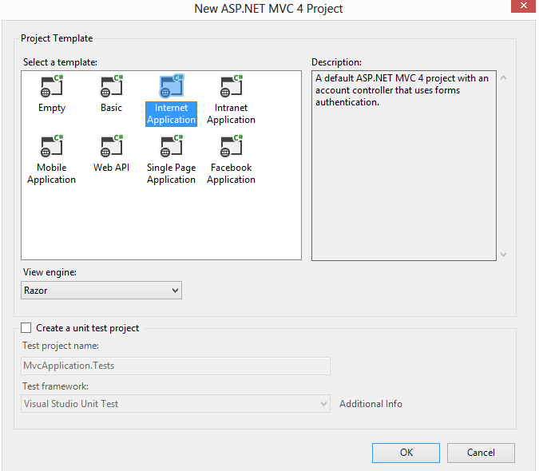
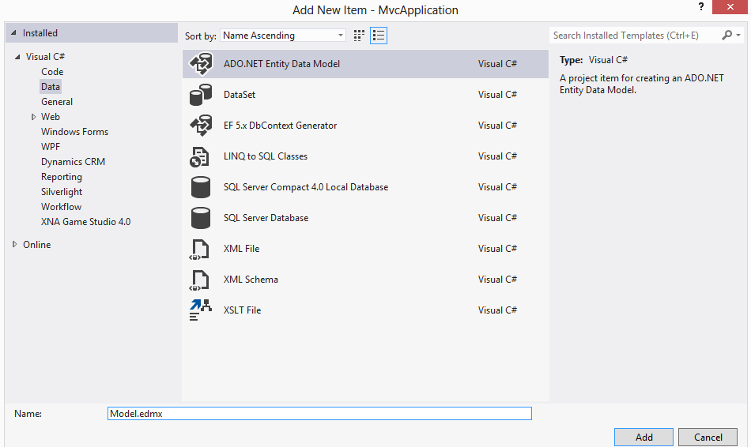
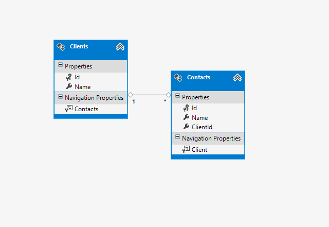
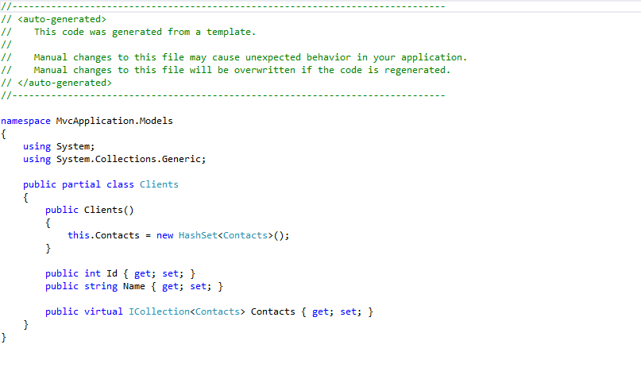
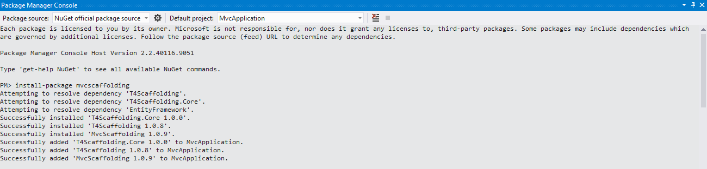
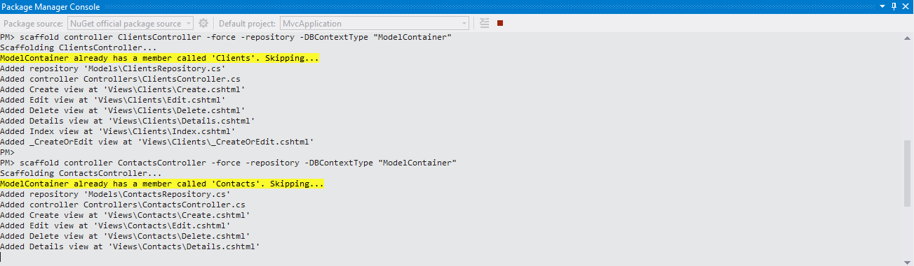
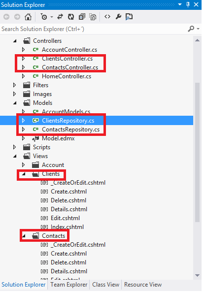
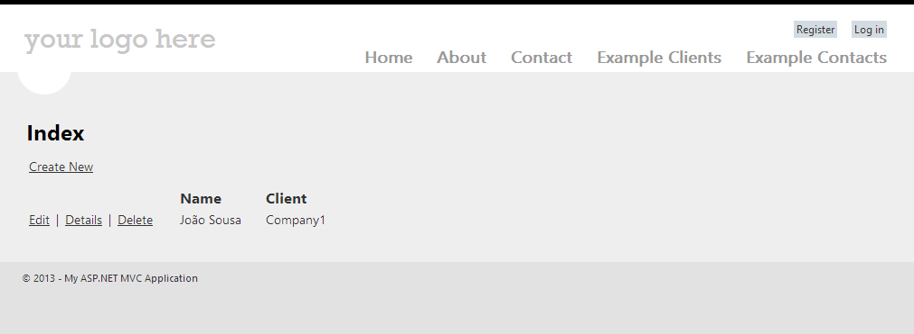

# ASP.NET MVC 4 – CRUD operations Entity Framework (8 steps to create your site)
## Requires
- Visual Studio 2012
## License
- Apache License, Version 2.0
## Technologies
- C#
- ADO.NET Entity Framework
- ASP.NET
- .NET Framework
- ASP.NET MVC 4
- Entity Framework 5
## Topics
- Controls
- C#
- Data Binding
- ADO.NET Entity Framework
- User Interface
- Data Access
- ASP.NET MVC
- Entity Framework
## Updated
- 02/01/2014
## Description

<strong>MVC4 &ndash; Entity Framework</strong> 
 
<strong>8 Steps to create your site</strong>

 
Jo&atilde;o Sousa

&nbsp;

<h1>STEP1</h1>

Create a new project of type ASP.NET MVC 4 Web Application&nbsp;&nbsp;

Choose the option Internet Application

 
After project creation, it look like this:

&nbsp;

 
 

<h1>STEP2</h1>

Add new items of type ADO.NET Entity Data Model to the solution.

Name it to Model.edmx

&nbsp;

 
 

<h1>STEP3</h1>

Open the Model.edmx, with double click on the top of the file and create the data structure.

&nbsp;

On this sample, we have two entities (Clients and Contacts).

After save this model, two new classes will be generated (Clients.cs and Contacts.cs)

&nbsp;

<strong>Clients:</strong>

&nbsp;

<strong>Contacts:</strong>

&nbsp;

<h1>STEP4</h1>

On the package manager console, execute the follow command.

<strong>Install-package mvcscaffolding</strong>

<a href="http://www.nuget.org/packages/MVCScaffolding/">http://www.nuget.org/packages/MVCScaffolding/</a><strong>&nbsp;</strong>

 

<h1>STEP5</h1>

Now we can scaffold a controller and a set of Create, Read, Update and Delete (CRUD) views. In the Package Management console run the following command.

<strong>Scaffold controller ClientsController &ndash;force &ndash;DBContextType &ldquo;ModelContainer&rdquo;</strong>

<strong>Scaffold controller ContactsController &ndash;force &ndash;DBContextType &ldquo;ModelContainer&rdquo;</strong>

This will generate a set of views, a controller and an Entity Framework database context.

&nbsp;

On the next image, you can see the files created by the command executed.

The repositories, controllers and views.

 
 

<h1>STEP6</h1>

Comment the line //throw new UnintentionalCodeFirstException()

&nbsp;

 
 

<h1>STEP7</h1>

Create two new entries on the application menu.

One to call the Clients entities and other to call Contacts entities. This could be made on the /Views/Shared/_Layout.cshmtl.

&nbsp;

 
 

<h1>STEP8</h1>

Run the application.

Verify that two new entries exists on menu and that you can Create/Edit/Delete both entities created.

 
&nbsp;

 
 

