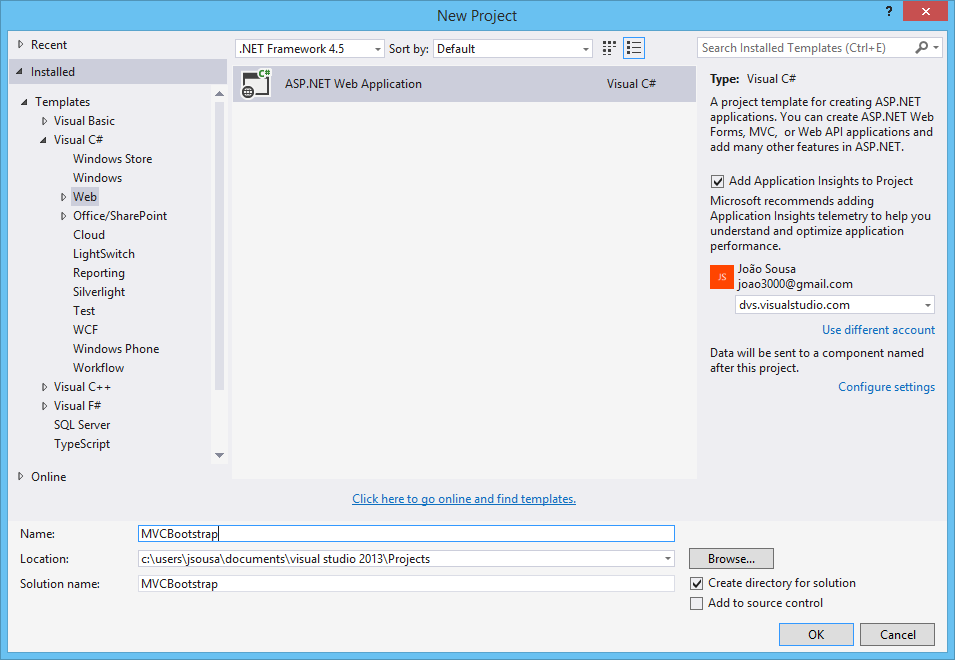
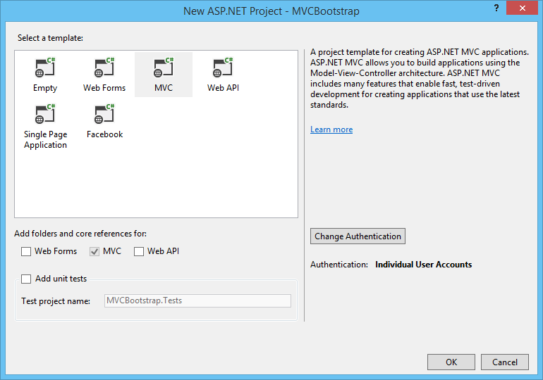
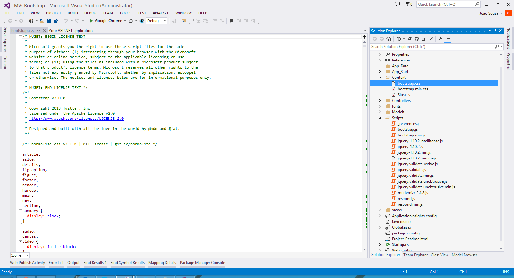
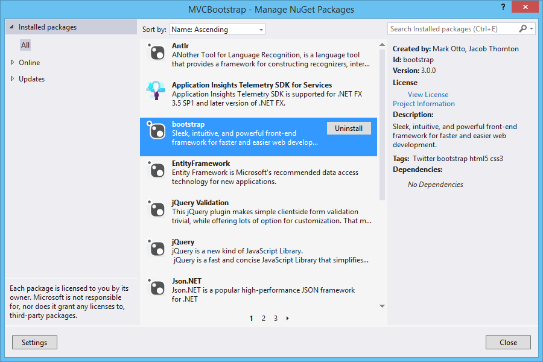
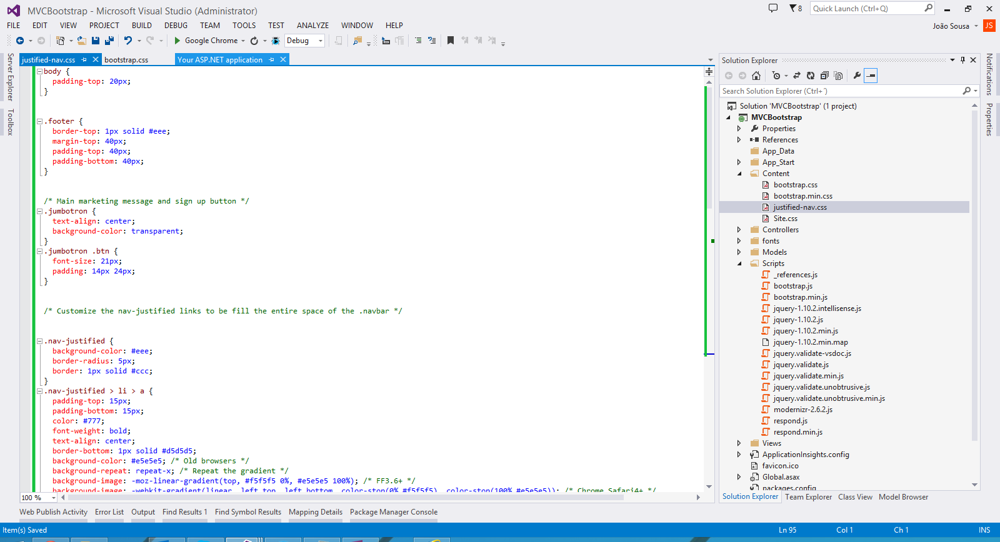
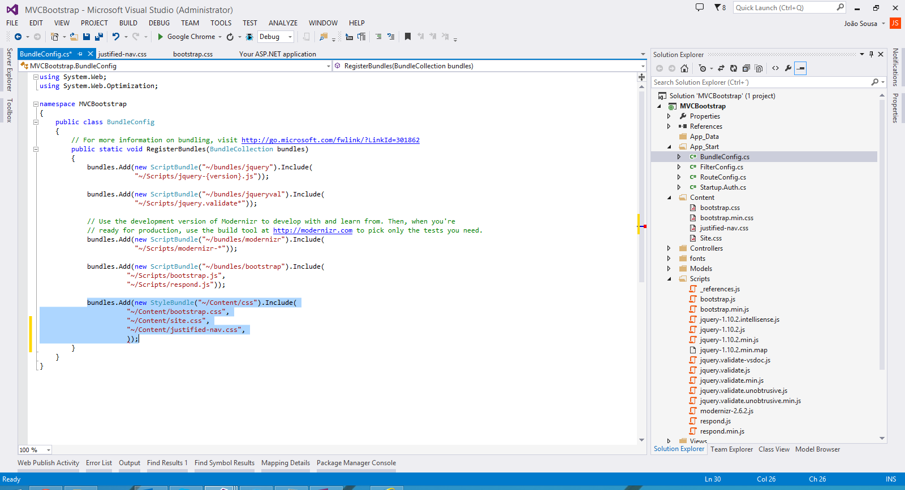
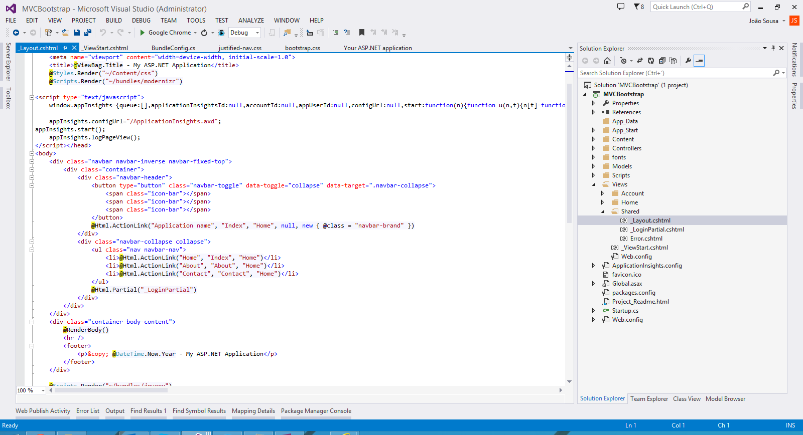
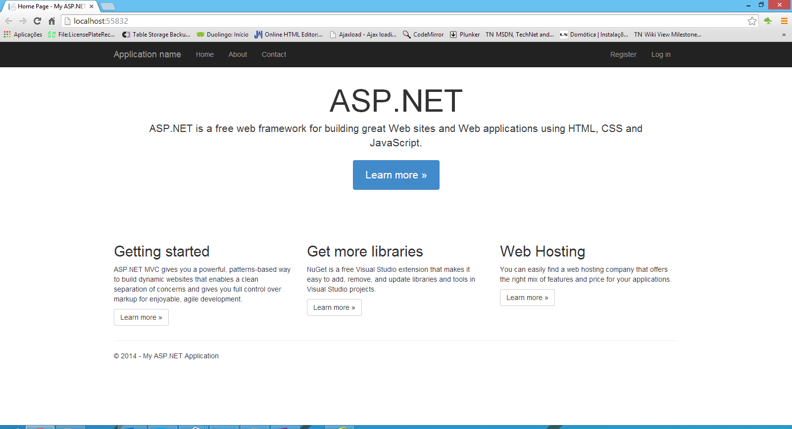
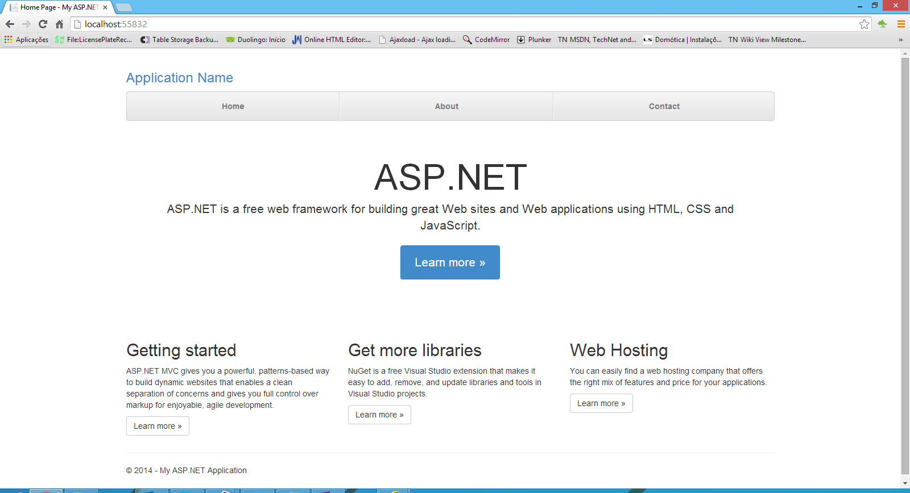
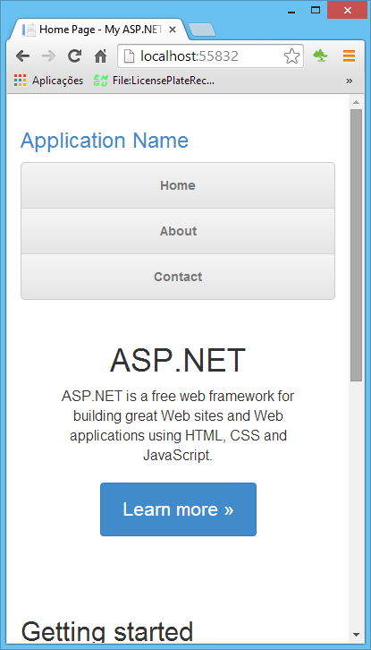

# ASP.NET MVC 5 - Bootstrap 3.0 in 3 Steps
## Requires
- Visual Studio 2013
## License
- Apache License, Version 2.0
## Technologies
- C#
- ASP.NET MVC
- Bootstrap
- ASP.NET MVC 5
## Topics
- C#
- ASP.NET MVC
- Bootstrap
## Updated
- 05/31/2014
## Description

<strong>Introduction</strong>

This article walks you through the steps for creating a ASP.NET MVC&nbsp; 5 Web Application using Bootstrap as template for layout.

&nbsp;

<strong>STEP 1 - Create ASP.NET Web Application</strong>

&nbsp;

<ul type="disc">
<li lang="en-US">Open Visual Studio 2013 and create a new project of type ASP.NET Web Application.
</li><li lang="en-US">On this project I create a solution called MVCBootstrap.
</li></ul>

<ul type="disc">
<li>Press OK, and a new screen will appear, with several options of template to use on our project.
</li><li>Select the option MVC. </li></ul>

<strong>STEP 2 - Upgrade version if necessary</strong>

You can verify the version of bootstrap on two ways.

First one, accessing the files on Content or Scripts folder. If open for example the file Bootstrap.css, we can check that the version of bootstrap is the 3.0.0

Another way to verify the bootstrap version is to check the installed NuGet package.

<ul type="disc">
<li>Right click the solution and select&nbsp;Manage NuGet packages for solution.. option.
</li><li>In the Manage NuGet screen, select&nbsp;Installed Packages&nbsp;section.
</li><li>Then select the&nbsp;bootstrap&nbsp;package in the center pane to see the version details.
</li></ul>

As you see the version is 3.0.0

<strong>STEP 3 - Change Layout</strong>

The default bootstrap&nbsp;template&nbsp;used in&nbsp;Visual Studio 2013&nbsp;is&nbsp;Jumbotron.&nbsp;Jumpotron&rsquo;s original source code is available&nbsp;<a href="http://getbootstrap.com/getting-started/#download">here</a>&nbsp;in bootstrap website.

On this sample we will chabge this template to the Justified-Nav one. So for that do the next steps:

<ul type="disc">
<li>Add the style sheet&nbsp;justified-nav.css&nbsp;to the&nbsp;Content&nbsp;folder
</li></ul>

<ul type="disc">
<li>Open the&nbsp;BundleConfig.cs&nbsp;file under the&nbsp;App_Start&nbsp;folder.
</li><li>Add the&nbsp;justified-nav.css&nbsp;to the &ldquo;~/Content/css&rdquo; style bundle.
</li></ul>

<ul type="disc">
<li>Now,&nbsp;open the layout file&nbsp;_Layout.cshtml&nbsp;in the&nbsp;Shared&nbsp;folder under&nbsp;Views&nbsp;Folder
</li><li>Remove the section within the&nbsp;div&nbsp;tag with&nbsp;class=&rdquo;navbar navbar-inverse navbar-fixed-top
</li></ul>

<ul type="disc">
<li>Open the&nbsp;Index.cshtml&nbsp;file in the&nbsp;Home&nbsp;folder under&nbsp;Views
</li><li>Change the class col-md-4 to col-lg-4
</li><li>Now the sample is&nbsp;ready. </li></ul>

&nbsp;

This is the sample created with solution:

This is the sample after our changes:

&nbsp;

&nbsp;

