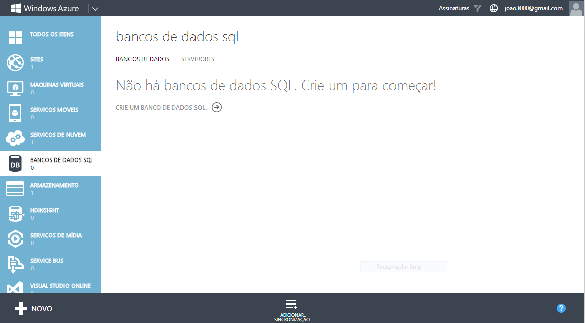
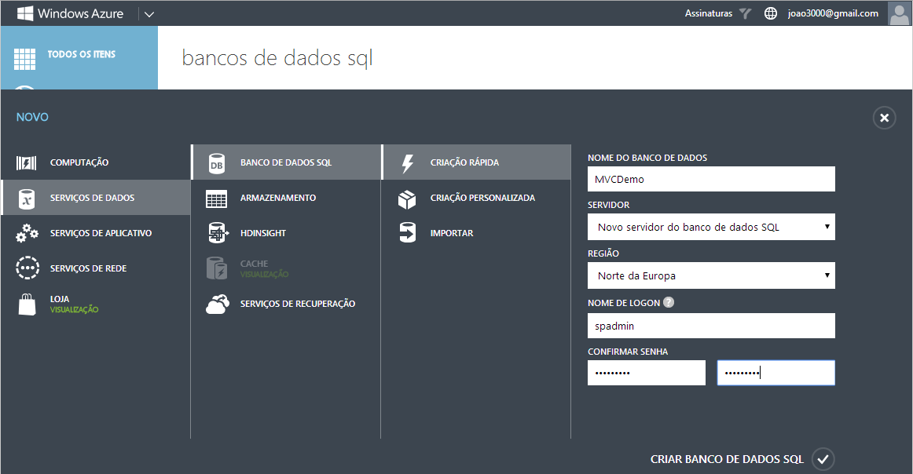
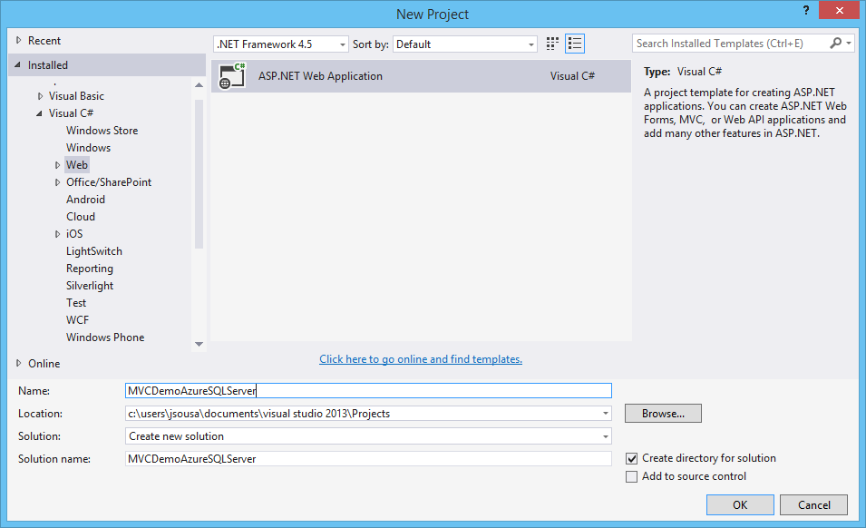
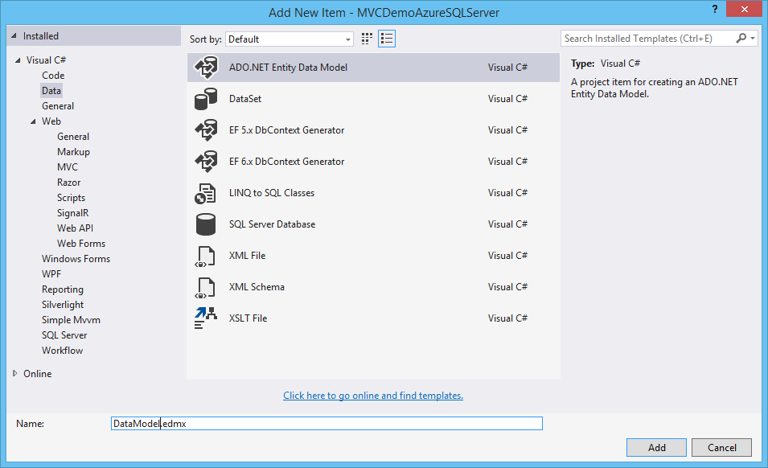
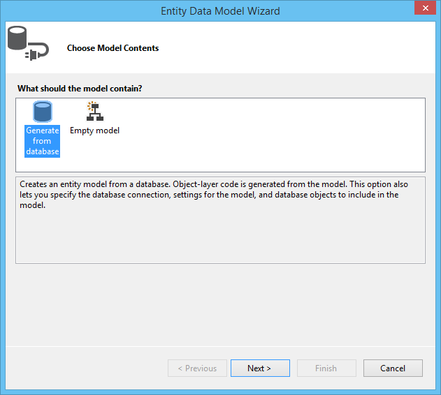
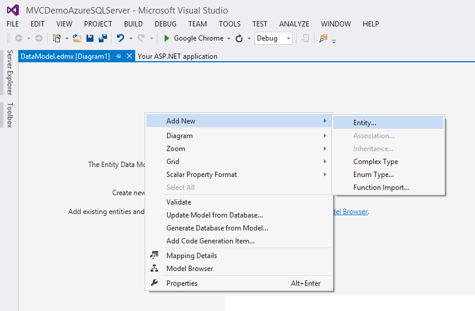
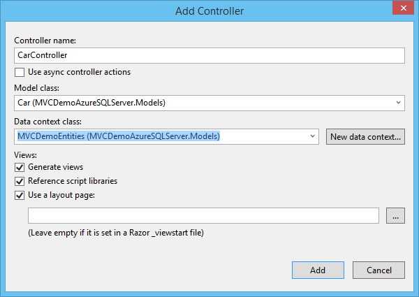
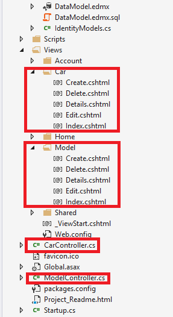
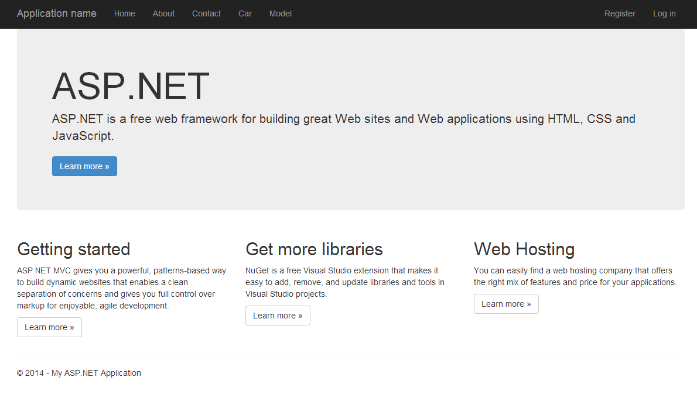
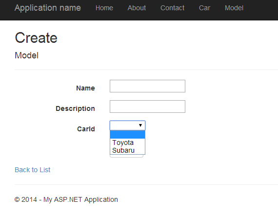

# ASP.NET MVC 5 - Connect with Azure SQLServer Database
## Requires
- Visual Studio 2013
## License
- Apache License, Version 2.0
## Technologies
- C#
- Microsoft Azure
- ASP.NET MVC
- SQL Azure
- ASP.NET MVC 5
- MVC5
## Topics
- C#
- Microsoft Azure
- ASP.NET MVC
- SQL Azure
## Updated
- 04/23/2014
## Description

<strong>Introduction</strong>

Using MVC, Entity Framework, ASP.NET Scaffolding, and Azure SQLServer you can create a web application that stores your information on an SQL Azure database. This demo shows you how to create a web application with MVC and Entity Framework 6,
 that communicate with a SQL Azure database.

&nbsp;

<strong>STEP 1 - Create Azure Account</strong>

You need to get a Windows Azure account. Everyone can open a Windows Azure account for free.

Check the link below for more information.

<a href="http://www.windowsazure.com/en-us/pricing/free-trial/">http://www.windowsazure.com/en-us/pricing/free-trial/
</a>

&nbsp;

<strong>STEP 2 - Create SQL Database on Windows Azure</strong>

After get access to an Azure Account, we need to create a SQL Database to store your data.

So for that we need to select the option New on the left bottom of our web page and then select the option Data Services -&gt; SQL Database-&gt; Quick Create and give a name to your SQL Database and provide credentials.

On this case our SQL Database will have the name &quot;MVCDemo&quot;.

After created the SQL Database, we need to get the connection string that will be used on Web Aplication to access the Azure SQL Database.

For that, select the databse cretaed and on the main window, on the right side, we have an option called &quot;Show Connection String&quot;.

When we select that option, a new window will appear, like the following image, with the connection string formatted to different providers.

&nbsp;

<strong>STEP 3 - Create ASP.NET Web Application</strong>

I will be using Visual Studio 2013 as my development environment. Our first step will be to create an ASP.NET Web Application.

<ul type="disc">
<li lang="en-US">Open Visual Studio 2013 and create a new project of type ASP.NET Web Application.
</li><li lang="en-US">On this project I create a solution called MVCDemoAzureSQLServer.
</li></ul>

&nbsp;&nbsp;

<ul type="disc">
<li>Press OK, and a new screen will appear, with several options of template to use on our project.
</li><li>Select the option MVC. </li></ul>

&nbsp;

<strong>STEP 4 - Create Data Model</strong>

After we have our web application created, we need to ceate our data model.

For that, select the option Add New Item on solution and choose the option ADO.NET Entity Data Model.

On this sample, we call it DataModel.edmx.

&nbsp;

After we select this component, a configuration wizard will appear.

On the first screen, we need to choose model contents. Two options will be available:

<ol type="1">
<li>Generate from database </li><li>Empty Model </li></ol>

&nbsp;

By selecting&nbsp;Generate from database, you can generate an .edmx file from an existing database. In the next steps, the Entity Data Model Wizard will guide you through selecting a data source, database, and database objects
 to include in the conceptual model.

By selecting&nbsp;Empty model, you can add an .edmx file that contains empty conceptual model, storage model, and mapping sections to your project. Select this option if you plan to use the Entity Designer to build your conceptual
 model and later generate a database that supports the model. 

On this sample, we select the first one.

On the next screen, we need to select the Data Connection.

Select the option New Connection and paste the information existent on STEP2 to ADO.NET provider.

The database will be filled with the name of our Azure SQL Database.

On this moment we have our empty .edmx file created with the correct connection string to our Azure SQL Database.

So, lets add some entities to our model.

On the DataModel.edmx diagram select the option Add New -&gt; Entity

&nbsp;

Create two entities like the existent on the next image.

&nbsp;

Select the option Generate Dabase from Model.

This option, will generate a SQL script. Execute the script in your sql database.

Right now, we have our Azure SQL Database created, and our web application with the connection to it.

Lets create our web application controllers and views.

&nbsp;

<strong>STEP 5 - Scaffolding</strong>

This could be made easily using the Scaffolding functionality.

On the solution, select the option Add New Scaffolded Item like on the image below.

&nbsp;

On the new screen, select the option MVC5 Controller with views using entity framework.

&nbsp;

Select the name of the controller, class model and data context class.

&nbsp;

Do the same to the other entity (Model)

The two new controllers and views associated, were created with sucess.

&nbsp;

<strong>STEP 6 - Change Menu Layout</strong>

To test the two tables, we can add two new entries on the web application menu.

&nbsp;

<strong>STEP 7 - Run Application</strong>

Press now the F5 button, to run the web application.

The new entities appear on the menu.

Select the first one and add, new brands.

Select the second one, and check that the brands created, appear on the create view, to associate model to a existent car.

