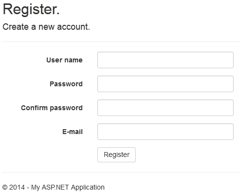

# ASP.NET MVC 5 Conferma Email Utente
## Requires
- Visual Studio 2012
## License
- Apache License, Version 2.0
## Technologies
- ASP.NET MVC
- ASP.NET MVC 4
- ASP.NET MVC 5
## Topics
- ASP.NET MVC
- ASP.NET Identity
## Updated
- 03/06/2014
## Description

<h1>Introduction</h1>

Con l&rsquo;avvento del nuovo ASP.NET Identity, le Nostre applicazioni sono sempre pi&ugrave; legate all&rsquo;integrazione con i social network.

A fronte di queste integrazioni, il nuovo membership fornito di default con ASP.NET MVC 4/5, &egrave; (volutamente) molto &ldquo;scarno&rdquo; e privo di molte funzionalit&agrave; utilizzate per la gestione custom degli account presenti sulla propria applicazione.

Una delle funzionalit&agrave; &ldquo;mancanti&rdquo; &egrave; la possibilit&agrave; di inviare un&rsquo;Email di conferma a fronte della registrazione di un utente, per verificare che l&rsquo;indirizzo Email sia esistente.

<ul>
</ul>
<h1>Description</h1>

Di seguito spiegher&ograve; passo passo come creare una semplice registrazione &ldquo;custom&rdquo; che abbia l&rsquo;invio di una Mail di conferma per la registrazione del sito.

<h5>Model Utente:</h5>

Creando un&rsquo;applicazione di tipo ASP.NET MVC per default nella cartella Models troviamo la classe ApplicationUser, questa classe contiene la definizione del modello del nostro Utente.

Aggiungiamo alla nostra classe le seguanti Propriet&agrave;:

<ul>
<li>Email: Indirizzo Email del Nostro utente </li><li>ConfirmedEmail: Valore booleano che indica l&rsquo;avvenuta conferma dell&rsquo;indirizzo Email da parte dell&rsquo;utente.
</li></ul>

C#

Modifica script|Remove

csharp
<pre class="hidden">public class ApplicationUser : IdentityUser
{
   public string Email{ get; set; }
   public bool ConfirmedEmail { get; set; }
}</pre>

<pre class="csharp">public&nbsp;class&nbsp;ApplicationUser&nbsp;:&nbsp;IdentityUser&nbsp;
{&nbsp;
&nbsp;&nbsp;&nbsp;public&nbsp;string&nbsp;Email{&nbsp;get;&nbsp;set;&nbsp;}&nbsp;
&nbsp;&nbsp;&nbsp;public&nbsp;bool&nbsp;ConfirmedEmail&nbsp;{&nbsp;get;&nbsp;set;&nbsp;}&nbsp;
}</pre>

<h5>ViewModel Registrazione:</h5>

Una volta aggiunto la propriet&agrave; Email al nostro modello, andiamo a modificare Il view model utilizzato nella registrazione dell&rsquo;utente aggiungendo il campo Email:

&nbsp;

C#

Modifica script|Remove

csharp
<pre class="hidden">public class RegisterViewModel
    {
        [Required]
        [Display(Name = &quot;User name&quot;)]
        public string UserName { get; set; }

        [Required]
        [StringLength(100, ErrorMessage = &quot;The {0} must be at least {2} characters long.&quot;, MinimumLength = 6)]
        [DataType(DataType.Password)]
        [Display(Name = &quot;Password&quot;)]
        public string Password { get; set; }

        [DataType(DataType.Password)]
        [Display(Name = &quot;Confirm password&quot;)]
        [Compare(&quot;Password&quot;, ErrorMessage = &quot;The password and confirmation password do not match.&quot;)]
        public string ConfirmPassword { get; set; }

        [Required]
        [EmailAddress]
        [Display(Name = &quot;E-mail&quot;)]
        public string Email { get; set; }

    }</pre>

<pre class="csharp">publicclass&nbsp;RegisterViewModel&nbsp;
&nbsp;&nbsp;&nbsp;&nbsp;{&nbsp;
&nbsp;&nbsp;&nbsp;&nbsp;&nbsp;&nbsp;&nbsp;&nbsp;[Required]&nbsp;
&nbsp;&nbsp;&nbsp;&nbsp;&nbsp;&nbsp;&nbsp;&nbsp;[Display(Name&nbsp;=&nbsp;&quot;User&nbsp;name&quot;)]&nbsp;
&nbsp;&nbsp;&nbsp;&nbsp;&nbsp;&nbsp;&nbsp;&nbsp;publicstring&nbsp;UserName&nbsp;{&nbsp;get;&nbsp;set;&nbsp;}&nbsp;
&nbsp;
&nbsp;&nbsp;&nbsp;&nbsp;&nbsp;&nbsp;&nbsp;&nbsp;[Required]&nbsp;
&nbsp;&nbsp;&nbsp;&nbsp;&nbsp;&nbsp;&nbsp;&nbsp;[StringLength(100,&nbsp;ErrorMessage&nbsp;=&nbsp;&quot;The&nbsp;{0}&nbsp;must&nbsp;be&nbsp;at&nbsp;least&nbsp;{2}&nbsp;characters&nbsp;long.&quot;,&nbsp;MinimumLength&nbsp;=&nbsp;6)]&nbsp;
&nbsp;&nbsp;&nbsp;&nbsp;&nbsp;&nbsp;&nbsp;&nbsp;[DataType(DataType.Password)]&nbsp;
&nbsp;&nbsp;&nbsp;&nbsp;&nbsp;&nbsp;&nbsp;&nbsp;[Display(Name&nbsp;=&nbsp;&quot;Password&quot;)]&nbsp;
&nbsp;&nbsp;&nbsp;&nbsp;&nbsp;&nbsp;&nbsp;&nbsp;publicstring&nbsp;Password&nbsp;{&nbsp;get;&nbsp;set;&nbsp;}&nbsp;
&nbsp;
&nbsp;&nbsp;&nbsp;&nbsp;&nbsp;&nbsp;&nbsp;&nbsp;[DataType(DataType.Password)]&nbsp;
&nbsp;&nbsp;&nbsp;&nbsp;&nbsp;&nbsp;&nbsp;&nbsp;[Display(Name&nbsp;=&nbsp;&quot;Confirm&nbsp;password&quot;)]&nbsp;
&nbsp;&nbsp;&nbsp;&nbsp;&nbsp;&nbsp;&nbsp;&nbsp;[Compare(&quot;Password&quot;,&nbsp;ErrorMessage&nbsp;=&nbsp;&quot;The&nbsp;password&nbsp;and&nbsp;confirmation&nbsp;password&nbsp;do&nbsp;not&nbsp;match.&quot;)]&nbsp;
&nbsp;&nbsp;&nbsp;&nbsp;&nbsp;&nbsp;&nbsp;&nbsp;publicstring&nbsp;ConfirmPassword&nbsp;{&nbsp;get;&nbsp;set;&nbsp;}&nbsp;
&nbsp;
&nbsp;&nbsp;&nbsp;&nbsp;&nbsp;&nbsp;&nbsp;&nbsp;[Required]&nbsp;
&nbsp;&nbsp;&nbsp;&nbsp;&nbsp;&nbsp;&nbsp;&nbsp;[EmailAddress]&nbsp;
&nbsp;&nbsp;&nbsp;&nbsp;&nbsp;&nbsp;&nbsp;&nbsp;[Display(Name&nbsp;=&nbsp;&quot;E-mail&quot;)]&nbsp;
&nbsp;&nbsp;&nbsp;&nbsp;&nbsp;&nbsp;&nbsp;&nbsp;publicstring&nbsp;Email&nbsp;{&nbsp;get;&nbsp;set;&nbsp;}&nbsp;
&nbsp;
&nbsp;
&nbsp;&nbsp;&nbsp;&nbsp;}</pre>

&nbsp;

l Nostro campo, in fase di registrazione sar&agrave; obbligatorio ([Required])&nbsp; e di tipo Email ([EmailAddress]), in questo modo lato front end saranno attivati gli script per il controllo sulla presenza del dato e sulla validit&agrave; formale (Indirizzo
 Email) dello stesso.

<h5>Form Registrazione:</h5>

Una volta modificato il ViewModel della registrazione possiamo aggiornare la View di registrazione dell&rsquo;Utente:

&nbsp;

HTML

Modifica script|Remove

html
<pre class="hidden">@model WebIdentity.Models.RegisterViewModel
@{
    ViewBag.Title = &quot;Register&quot;;
}

&lt;h2&gt;@ViewBag.Title.&lt;/h2&gt;

@using (Html.BeginForm(&quot;Register&quot;, &quot;Account&quot;, FormMethod.Post, new { @class = &quot;form-horizontal&quot;, role = &quot;form&quot; }))
{
    @Html.AntiForgeryToken()
    &lt;h4&gt;Create a new account.&lt;/h4&gt;
    &lt;hr /&gt;
    @Html.ValidationSummary()
    &lt;div class=&quot;form-group&quot;&gt;
        @Html.LabelFor(m =&gt; m.UserName, new { @class = &quot;col-md-2 control-label&quot; })
        &lt;div class=&quot;col-md-10&quot;&gt;
            @Html.TextBoxFor(m =&gt; m.UserName, new { @class = &quot;form-control&quot; })
        &lt;/div&gt;
    &lt;/div&gt;
    &lt;div class=&quot;form-group&quot;&gt;
        @Html.LabelFor(m =&gt; m.Password, new { @class = &quot;col-md-2 control-label&quot; })
        &lt;div class=&quot;col-md-10&quot;&gt;
            @Html.PasswordFor(m =&gt; m.Password, new { @class = &quot;form-control&quot; })
        &lt;/div&gt;
    &lt;/div&gt;
    &lt;div class=&quot;form-group&quot;&gt;
        @Html.LabelFor(m =&gt; m.ConfirmPassword, new { @class = &quot;col-md-2 control-label&quot; })
        &lt;div class=&quot;col-md-10&quot;&gt;
            @Html.PasswordFor(m =&gt; m.ConfirmPassword, new { @class = &quot;form-control&quot; })
        &lt;/div&gt;
    &lt;/div&gt;
    &lt;div class=&quot;form-group&quot;&gt;
        @Html.LabelFor(m =&gt; m.Email, new { @class = &quot;col-md-2 control-label&quot; })
        &lt;div class=&quot;col-md-10&quot;&gt;
            @Html.TextBoxFor(m =&gt; m.Email, new { @class = &quot;form-control&quot; })
        &lt;/div&gt;
    &lt;/div&gt;
    &lt;div class=&quot;form-group&quot;&gt;
        &lt;div class=&quot;col-md-offset-2 col-md-10&quot;&gt;
            &lt;input type=&quot;submit&quot; class=&quot;btn btn-default&quot; value=&quot;Register&quot; /&gt;
        &lt;/div&gt;
    &lt;/div&gt;
}

@section Scripts {
    @Scripts.Render(&quot;~/bundles/jqueryval&quot;)
}
</pre>

<pre class="js">@model&nbsp;WebIdentity.Models.RegisterViewModel&nbsp;
@{&nbsp;
&nbsp;&nbsp;&nbsp;&nbsp;ViewBag.Title&nbsp;=&nbsp;&quot;Register&quot;;&nbsp;
}&nbsp;
&nbsp;
&lt;h2&gt;@ViewBag.Title.&lt;/h2&gt;&nbsp;
&nbsp;
@using&nbsp;(Html.BeginForm(&quot;Register&quot;,&nbsp;&quot;Account&quot;,&nbsp;FormMethod.Post,&nbsp;new&nbsp;{&nbsp;@class&nbsp;=&nbsp;&quot;form-horizontal&quot;,&nbsp;role&nbsp;=&nbsp;&quot;form&quot;&nbsp;}))&nbsp;
{&nbsp;
&nbsp;&nbsp;&nbsp;&nbsp;@Html.AntiForgeryToken()&nbsp;
&nbsp;&nbsp;&nbsp;&nbsp;&lt;h4&gt;Create&nbsp;a&nbsp;new&nbsp;account.&lt;/h4&gt;&nbsp;
&nbsp;&nbsp;&nbsp;&nbsp;&lt;hr&nbsp;/&gt;&nbsp;
&nbsp;&nbsp;&nbsp;&nbsp;@Html.ValidationSummary()&nbsp;
&nbsp;&nbsp;&nbsp;&nbsp;&lt;div&nbsp;class=&quot;form-group&quot;&gt;&nbsp;
&nbsp;&nbsp;&nbsp;&nbsp;&nbsp;&nbsp;&nbsp;&nbsp;@Html.LabelFor(m&nbsp;=&gt;&nbsp;m.UserName,&nbsp;new&nbsp;{&nbsp;@class&nbsp;=&nbsp;&quot;col-md-2&nbsp;control-label&quot;&nbsp;})&nbsp;
&nbsp;&nbsp;&nbsp;&nbsp;&nbsp;&nbsp;&nbsp;&nbsp;&lt;div&nbsp;class=&quot;col-md-10&quot;&gt;&nbsp;
&nbsp;&nbsp;&nbsp;&nbsp;&nbsp;&nbsp;&nbsp;&nbsp;&nbsp;&nbsp;&nbsp;&nbsp;@Html.TextBoxFor(m&nbsp;=&gt;&nbsp;m.UserName,&nbsp;new&nbsp;{&nbsp;@class&nbsp;=&nbsp;&quot;form-control&quot;&nbsp;})&nbsp;
&nbsp;&nbsp;&nbsp;&nbsp;&nbsp;&nbsp;&nbsp;&nbsp;&lt;/div&gt;&nbsp;
&nbsp;&nbsp;&nbsp;&nbsp;&lt;/div&gt;&nbsp;
&nbsp;&nbsp;&nbsp;&nbsp;&lt;div&nbsp;class=&quot;form-group&quot;&gt;&nbsp;
&nbsp;&nbsp;&nbsp;&nbsp;&nbsp;&nbsp;&nbsp;&nbsp;@Html.LabelFor(m&nbsp;=&gt;&nbsp;m.Password,&nbsp;new&nbsp;{&nbsp;@class&nbsp;=&nbsp;&quot;col-md-2&nbsp;control-label&quot;&nbsp;})&nbsp;
&nbsp;&nbsp;&nbsp;&nbsp;&nbsp;&nbsp;&nbsp;&nbsp;&lt;div&nbsp;class=&quot;col-md-10&quot;&gt;&nbsp;
&nbsp;&nbsp;&nbsp;&nbsp;&nbsp;&nbsp;&nbsp;&nbsp;&nbsp;&nbsp;&nbsp;&nbsp;@Html.PasswordFor(m&nbsp;=&gt;&nbsp;m.Password,&nbsp;new&nbsp;{&nbsp;@class&nbsp;=&nbsp;&quot;form-control&quot;&nbsp;})&nbsp;
&nbsp;&nbsp;&nbsp;&nbsp;&nbsp;&nbsp;&nbsp;&nbsp;&lt;/div&gt;&nbsp;
&nbsp;&nbsp;&nbsp;&nbsp;&lt;/div&gt;&nbsp;
&nbsp;&nbsp;&nbsp;&nbsp;&lt;div&nbsp;class=&quot;form-group&quot;&gt;&nbsp;
&nbsp;&nbsp;&nbsp;&nbsp;&nbsp;&nbsp;&nbsp;&nbsp;@Html.LabelFor(m&nbsp;=&gt;&nbsp;m.ConfirmPassword,&nbsp;new&nbsp;{&nbsp;@class&nbsp;=&nbsp;&quot;col-md-2&nbsp;control-label&quot;&nbsp;})&nbsp;
&nbsp;&nbsp;&nbsp;&nbsp;&nbsp;&nbsp;&nbsp;&nbsp;&lt;div&nbsp;class=&quot;col-md-10&quot;&gt;&nbsp;
&nbsp;&nbsp;&nbsp;&nbsp;&nbsp;&nbsp;&nbsp;&nbsp;&nbsp;&nbsp;&nbsp;&nbsp;@Html.PasswordFor(m&nbsp;=&gt;&nbsp;m.ConfirmPassword,&nbsp;new&nbsp;{&nbsp;@class&nbsp;=&nbsp;&quot;form-control&quot;&nbsp;})&nbsp;
&nbsp;&nbsp;&nbsp;&nbsp;&nbsp;&nbsp;&nbsp;&nbsp;&lt;/div&gt;&nbsp;
&nbsp;&nbsp;&nbsp;&nbsp;&lt;/div&gt;&nbsp;
&nbsp;&nbsp;&nbsp;&nbsp;&lt;div&nbsp;class=&quot;form-group&quot;&gt;&nbsp;
&nbsp;&nbsp;&nbsp;&nbsp;&nbsp;&nbsp;&nbsp;&nbsp;@Html.LabelFor(m&nbsp;=&gt;&nbsp;m.Email,&nbsp;new&nbsp;{&nbsp;@class&nbsp;=&nbsp;&quot;col-md-2&nbsp;control-label&quot;&nbsp;})&nbsp;
&nbsp;&nbsp;&nbsp;&nbsp;&nbsp;&nbsp;&nbsp;&nbsp;&lt;div&nbsp;class=&quot;col-md-10&quot;&gt;&nbsp;
&nbsp;&nbsp;&nbsp;&nbsp;&nbsp;&nbsp;&nbsp;&nbsp;&nbsp;&nbsp;&nbsp;&nbsp;@Html.TextBoxFor(m&nbsp;=&gt;&nbsp;m.Email,&nbsp;new&nbsp;{&nbsp;@class&nbsp;=&nbsp;&quot;form-control&quot;&nbsp;})&nbsp;
&nbsp;&nbsp;&nbsp;&nbsp;&nbsp;&nbsp;&nbsp;&nbsp;&lt;/div&gt;&nbsp;
&nbsp;&nbsp;&nbsp;&nbsp;&lt;/div&gt;&nbsp;
&nbsp;&nbsp;&nbsp;&nbsp;&lt;div&nbsp;class=&quot;form-group&quot;&gt;&nbsp;
&nbsp;&nbsp;&nbsp;&nbsp;&nbsp;&nbsp;&nbsp;&nbsp;&lt;div&nbsp;class=&quot;col-md-offset-2&nbsp;col-md-10&quot;&gt;&nbsp;
&nbsp;&nbsp;&nbsp;&nbsp;&nbsp;&nbsp;&nbsp;&nbsp;&nbsp;&nbsp;&nbsp;&nbsp;&lt;input&nbsp;type=&quot;submit&quot;&nbsp;class=&quot;btn&nbsp;btn-default&quot;&nbsp;value=&quot;Register&quot;&nbsp;/&gt;&nbsp;
&nbsp;&nbsp;&nbsp;&nbsp;&nbsp;&nbsp;&nbsp;&nbsp;&lt;/div&gt;&nbsp;
&nbsp;&nbsp;&nbsp;&nbsp;&lt;/div&gt;&nbsp;
}&nbsp;
&nbsp;
@section&nbsp;Scripts&nbsp;{&nbsp;
&nbsp;&nbsp;&nbsp;&nbsp;@Scripts.Render(&quot;~/bundles/jqueryval&quot;)&nbsp;
}&nbsp;
</pre>

&nbsp;
<h5>Action ConfirmEmail e Register:</h5>

Dopo la modifica dell&rsquo;interfaccia (View), possiamo finalmente aggiungere uan nuova Action ConfirmEmail e modificare l&rsquo;Action Register del nostro controller (AccountController) utilizzato per la registrazione, aggiungendo l&rsquo;invio di una
 mail all&rsquo;indirizzo fornito in fase di registrazione:

&nbsp;

C#

Modifica script|Remove

csharp
<pre class="hidden">// GET: /Account/ConfirmEmail
        [AllowAnonymous]
        public async Task&lt;ActionResult&gt; ConfirmEmail(string Token, string Email)
        {
            ApplicationUser user = this.UserManager.FindById(Token);
            if (user != null)
            {
                if (user.Email == Email)
                {
                    user.ConfirmedEmail = true;
                    await UserManager.UpdateAsync(user);
                    await SignInAsync(user, isPersistent: false);
                    return RedirectToAction(&quot;Index&quot;, &quot;Home&quot;, new { ConfirmedEmail = user.Email });
                }
                else
                {
                    return RedirectToAction(&quot;Confirm&quot;, &quot;Account&quot;, new { Email = user.Email });
                }
            }
            else
            {
                return RedirectToAction(&quot;Confirm&quot;, &quot;Account&quot;, new { Email = &quot;&quot; });
            }

        }

 //
        // POST: /Account/Register
        [HttpPost]
        [AllowAnonymous]
        [ValidateAntiForgeryToken]
        public async Task&lt;ActionResult&gt; Register(RegisterViewModel model)
        {
            if (ModelState.IsValid)
            {
                var user = new ApplicationUser() { UserName = model.UserName };
                user.Email = model.Email;
                user.ConfirmedEmail = false;
                var result = await UserManager.CreateAsync(user, model.Password);
                if (result.Succeeded)
                {
                    System.Net.Mail.MailMessage m = new System.Net.Mail.MailMessage(
                        new System.Net.Mail.MailAddress(&quot;sender@mydomain.com&quot;, &quot;Web Registration&quot;),
                        new System.Net.Mail.MailAddress(user.Email));
                    m.Subject = &quot;Email confirmation&quot;;
                    m.Body = string.Format(&quot;Dear {0}&lt;BR/&gt;Thank you for your registration, please click on the below link to comlete your registration: &lt;a href=\&quot;{1}\&quot; title=\&quot;User Email Confirm\&quot;&gt;{1}&lt;/a&gt;&quot;, user.UserName, Url.Action(&quot;ConfirmEmail&quot;, &quot;Account&quot;, new { Token = user.Id, Email = user.Email }, Request.Url.Scheme));
                    m.IsBodyHtml = true;
                    System.Net.Mail.SmtpClient smtp = new System.Net.Mail.SmtpClient(&quot;smtp.mydomain.com&quot;);
                    smtp.Credentials = new System.Net.NetworkCredential(&quot;sender@mydomain.com&quot;, &quot;password&quot;);
                    smtp.EnableSsl = true;
                    smtp.Send(m);
                    return RedirectToAction(&quot;Confirm&quot;, &quot;Account&quot;, new { Email = user.Email });
                }
                else
                {
                    AddErrors(result);
                }
            }

            // If we got this far, something failed, redisplay form
            return View(model);
        }
</pre>

<pre class="csharp">//&nbsp;GET:&nbsp;/Account/ConfirmEmail&nbsp;
&nbsp;&nbsp;&nbsp;&nbsp;&nbsp;&nbsp;&nbsp;&nbsp;[AllowAnonymous]&nbsp;
&nbsp;&nbsp;&nbsp;&nbsp;&nbsp;&nbsp;&nbsp;&nbsp;public&nbsp;async&nbsp;Task&lt;ActionResult&gt;&nbsp;ConfirmEmail(string&nbsp;Token,&nbsp;string&nbsp;Email)&nbsp;
&nbsp;&nbsp;&nbsp;&nbsp;&nbsp;&nbsp;&nbsp;&nbsp;{&nbsp;
&nbsp;&nbsp;&nbsp;&nbsp;&nbsp;&nbsp;&nbsp;&nbsp;&nbsp;&nbsp;&nbsp;&nbsp;ApplicationUser&nbsp;user&nbsp;=&nbsp;this.UserManager.FindById(Token);&nbsp;
&nbsp;&nbsp;&nbsp;&nbsp;&nbsp;&nbsp;&nbsp;&nbsp;&nbsp;&nbsp;&nbsp;&nbsp;if&nbsp;(user&nbsp;!=&nbsp;null)&nbsp;
&nbsp;&nbsp;&nbsp;&nbsp;&nbsp;&nbsp;&nbsp;&nbsp;&nbsp;&nbsp;&nbsp;&nbsp;{&nbsp;
&nbsp;&nbsp;&nbsp;&nbsp;&nbsp;&nbsp;&nbsp;&nbsp;&nbsp;&nbsp;&nbsp;&nbsp;&nbsp;&nbsp;&nbsp;&nbsp;if&nbsp;(user.Email&nbsp;==&nbsp;Email)&nbsp;
&nbsp;&nbsp;&nbsp;&nbsp;&nbsp;&nbsp;&nbsp;&nbsp;&nbsp;&nbsp;&nbsp;&nbsp;&nbsp;&nbsp;&nbsp;&nbsp;{&nbsp;
&nbsp;&nbsp;&nbsp;&nbsp;&nbsp;&nbsp;&nbsp;&nbsp;&nbsp;&nbsp;&nbsp;&nbsp;&nbsp;&nbsp;&nbsp;&nbsp;&nbsp;&nbsp;&nbsp;&nbsp;user.ConfirmedEmail&nbsp;=&nbsp;true;&nbsp;
&nbsp;&nbsp;&nbsp;&nbsp;&nbsp;&nbsp;&nbsp;&nbsp;&nbsp;&nbsp;&nbsp;&nbsp;&nbsp;&nbsp;&nbsp;&nbsp;&nbsp;&nbsp;&nbsp;&nbsp;await&nbsp;UserManager.UpdateAsync(user);&nbsp;
&nbsp;&nbsp;&nbsp;&nbsp;&nbsp;&nbsp;&nbsp;&nbsp;&nbsp;&nbsp;&nbsp;&nbsp;&nbsp;&nbsp;&nbsp;&nbsp;&nbsp;&nbsp;&nbsp;&nbsp;await&nbsp;SignInAsync(user,&nbsp;isPersistent:&nbsp;false);&nbsp;
&nbsp;&nbsp;&nbsp;&nbsp;&nbsp;&nbsp;&nbsp;&nbsp;&nbsp;&nbsp;&nbsp;&nbsp;&nbsp;&nbsp;&nbsp;&nbsp;&nbsp;&nbsp;&nbsp;&nbsp;return&nbsp;RedirectToAction(&quot;Index&quot;,&nbsp;&quot;Home&quot;,&nbsp;new&nbsp;{&nbsp;ConfirmedEmail&nbsp;=&nbsp;user.Email&nbsp;});&nbsp;
&nbsp;&nbsp;&nbsp;&nbsp;&nbsp;&nbsp;&nbsp;&nbsp;&nbsp;&nbsp;&nbsp;&nbsp;&nbsp;&nbsp;&nbsp;&nbsp;}&nbsp;
&nbsp;&nbsp;&nbsp;&nbsp;&nbsp;&nbsp;&nbsp;&nbsp;&nbsp;&nbsp;&nbsp;&nbsp;&nbsp;&nbsp;&nbsp;&nbsp;else&nbsp;
&nbsp;&nbsp;&nbsp;&nbsp;&nbsp;&nbsp;&nbsp;&nbsp;&nbsp;&nbsp;&nbsp;&nbsp;&nbsp;&nbsp;&nbsp;&nbsp;{&nbsp;
&nbsp;&nbsp;&nbsp;&nbsp;&nbsp;&nbsp;&nbsp;&nbsp;&nbsp;&nbsp;&nbsp;&nbsp;&nbsp;&nbsp;&nbsp;&nbsp;&nbsp;&nbsp;&nbsp;&nbsp;return&nbsp;RedirectToAction(&quot;Confirm&quot;,&nbsp;&quot;Account&quot;,&nbsp;new&nbsp;{&nbsp;Email&nbsp;=&nbsp;user.Email&nbsp;});&nbsp;
&nbsp;&nbsp;&nbsp;&nbsp;&nbsp;&nbsp;&nbsp;&nbsp;&nbsp;&nbsp;&nbsp;&nbsp;&nbsp;&nbsp;&nbsp;&nbsp;}&nbsp;
&nbsp;&nbsp;&nbsp;&nbsp;&nbsp;&nbsp;&nbsp;&nbsp;&nbsp;&nbsp;&nbsp;&nbsp;}&nbsp;
&nbsp;&nbsp;&nbsp;&nbsp;&nbsp;&nbsp;&nbsp;&nbsp;&nbsp;&nbsp;&nbsp;&nbsp;else&nbsp;
&nbsp;&nbsp;&nbsp;&nbsp;&nbsp;&nbsp;&nbsp;&nbsp;&nbsp;&nbsp;&nbsp;&nbsp;{&nbsp;
&nbsp;&nbsp;&nbsp;&nbsp;&nbsp;&nbsp;&nbsp;&nbsp;&nbsp;&nbsp;&nbsp;&nbsp;&nbsp;&nbsp;&nbsp;&nbsp;return&nbsp;RedirectToAction(&quot;Confirm&quot;,&nbsp;&quot;Account&quot;,&nbsp;new&nbsp;{&nbsp;Email&nbsp;=&nbsp;&quot;&quot;&nbsp;});&nbsp;
&nbsp;&nbsp;&nbsp;&nbsp;&nbsp;&nbsp;&nbsp;&nbsp;&nbsp;&nbsp;&nbsp;&nbsp;}&nbsp;
&nbsp;
&nbsp;&nbsp;&nbsp;&nbsp;&nbsp;&nbsp;&nbsp;&nbsp;}&nbsp;
&nbsp;
&nbsp;////&nbsp;POST:&nbsp;/Account/Register&nbsp;
&nbsp;&nbsp;&nbsp;&nbsp;&nbsp;&nbsp;&nbsp;&nbsp;[HttpPost]&nbsp;
&nbsp;&nbsp;&nbsp;&nbsp;&nbsp;&nbsp;&nbsp;&nbsp;[AllowAnonymous]&nbsp;
&nbsp;&nbsp;&nbsp;&nbsp;&nbsp;&nbsp;&nbsp;&nbsp;[ValidateAntiForgeryToken]&nbsp;
&nbsp;&nbsp;&nbsp;&nbsp;&nbsp;&nbsp;&nbsp;&nbsp;public&nbsp;async&nbsp;Task&lt;ActionResult&gt;&nbsp;Register(RegisterViewModel&nbsp;model)&nbsp;
&nbsp;&nbsp;&nbsp;&nbsp;&nbsp;&nbsp;&nbsp;&nbsp;{&nbsp;
&nbsp;&nbsp;&nbsp;&nbsp;&nbsp;&nbsp;&nbsp;&nbsp;&nbsp;&nbsp;&nbsp;&nbsp;if&nbsp;(ModelState.IsValid)&nbsp;
&nbsp;&nbsp;&nbsp;&nbsp;&nbsp;&nbsp;&nbsp;&nbsp;&nbsp;&nbsp;&nbsp;&nbsp;{&nbsp;
&nbsp;&nbsp;&nbsp;&nbsp;&nbsp;&nbsp;&nbsp;&nbsp;&nbsp;&nbsp;&nbsp;&nbsp;&nbsp;&nbsp;&nbsp;&nbsp;var&nbsp;user&nbsp;=&nbsp;new&nbsp;ApplicationUser()&nbsp;{&nbsp;UserName&nbsp;=&nbsp;model.UserName&nbsp;};&nbsp;
&nbsp;&nbsp;&nbsp;&nbsp;&nbsp;&nbsp;&nbsp;&nbsp;&nbsp;&nbsp;&nbsp;&nbsp;&nbsp;&nbsp;&nbsp;&nbsp;user.Email&nbsp;=&nbsp;model.Email;&nbsp;
&nbsp;&nbsp;&nbsp;&nbsp;&nbsp;&nbsp;&nbsp;&nbsp;&nbsp;&nbsp;&nbsp;&nbsp;&nbsp;&nbsp;&nbsp;&nbsp;user.ConfirmedEmail&nbsp;=&nbsp;false;&nbsp;
&nbsp;&nbsp;&nbsp;&nbsp;&nbsp;&nbsp;&nbsp;&nbsp;&nbsp;&nbsp;&nbsp;&nbsp;&nbsp;&nbsp;&nbsp;&nbsp;var&nbsp;result&nbsp;=&nbsp;await&nbsp;UserManager.CreateAsync(user,&nbsp;model.Password);&nbsp;
&nbsp;&nbsp;&nbsp;&nbsp;&nbsp;&nbsp;&nbsp;&nbsp;&nbsp;&nbsp;&nbsp;&nbsp;&nbsp;&nbsp;&nbsp;&nbsp;if&nbsp;(result.Succeeded)&nbsp;
&nbsp;&nbsp;&nbsp;&nbsp;&nbsp;&nbsp;&nbsp;&nbsp;&nbsp;&nbsp;&nbsp;&nbsp;&nbsp;&nbsp;&nbsp;&nbsp;{&nbsp;
&nbsp;&nbsp;&nbsp;&nbsp;&nbsp;&nbsp;&nbsp;&nbsp;&nbsp;&nbsp;&nbsp;&nbsp;&nbsp;&nbsp;&nbsp;&nbsp;&nbsp;&nbsp;&nbsp;&nbsp;System.Net.Mail.MailMessage&nbsp;m&nbsp;=&nbsp;new&nbsp;System.Net.Mail.MailMessage(&nbsp;
&nbsp;&nbsp;&nbsp;&nbsp;&nbsp;&nbsp;&nbsp;&nbsp;&nbsp;&nbsp;&nbsp;&nbsp;&nbsp;&nbsp;&nbsp;&nbsp;&nbsp;&nbsp;&nbsp;&nbsp;&nbsp;&nbsp;&nbsp;&nbsp;new&nbsp;System.Net.Mail.MailAddress(&quot;sender@mydomain.com&quot;,&nbsp;&quot;Web&nbsp;Registration&quot;),&nbsp;
&nbsp;&nbsp;&nbsp;&nbsp;&nbsp;&nbsp;&nbsp;&nbsp;&nbsp;&nbsp;&nbsp;&nbsp;&nbsp;&nbsp;&nbsp;&nbsp;&nbsp;&nbsp;&nbsp;&nbsp;&nbsp;&nbsp;&nbsp;&nbsp;new&nbsp;System.Net.Mail.MailAddress(user.Email));&nbsp;
&nbsp;&nbsp;&nbsp;&nbsp;&nbsp;&nbsp;&nbsp;&nbsp;&nbsp;&nbsp;&nbsp;&nbsp;&nbsp;&nbsp;&nbsp;&nbsp;&nbsp;&nbsp;&nbsp;&nbsp;m.Subject&nbsp;=&nbsp;&quot;Email&nbsp;confirmation&quot;;&nbsp;
&nbsp;&nbsp;&nbsp;&nbsp;&nbsp;&nbsp;&nbsp;&nbsp;&nbsp;&nbsp;&nbsp;&nbsp;&nbsp;&nbsp;&nbsp;&nbsp;&nbsp;&nbsp;&nbsp;&nbsp;m.Body&nbsp;=&nbsp;string.Format(&quot;Dear&nbsp;{0}&lt;BR/&gt;Thank&nbsp;you&nbsp;for&nbsp;your&nbsp;registration,&nbsp;please&nbsp;click&nbsp;on&nbsp;the&nbsp;below&nbsp;link&nbsp;to&nbsp;comlete&nbsp;your&nbsp;registration:&nbsp;&lt;a&nbsp;href=\&quot;{1}\&quot;&nbsp;title=\&quot;User&nbsp;Email&nbsp;Confirm\&quot;&gt;{1}&lt;/a&gt;&quot;,&nbsp;user.UserName,&nbsp;Url.Action(&quot;ConfirmEmail&quot;,&nbsp;&quot;Account&quot;,&nbsp;new&nbsp;{&nbsp;Token&nbsp;=&nbsp;user.Id,&nbsp;Email&nbsp;=&nbsp;user.Email&nbsp;},&nbsp;Request.Url.Scheme));&nbsp;
&nbsp;&nbsp;&nbsp;&nbsp;&nbsp;&nbsp;&nbsp;&nbsp;&nbsp;&nbsp;&nbsp;&nbsp;&nbsp;&nbsp;&nbsp;&nbsp;&nbsp;&nbsp;&nbsp;&nbsp;m.IsBodyHtml&nbsp;=&nbsp;true;&nbsp;
&nbsp;&nbsp;&nbsp;&nbsp;&nbsp;&nbsp;&nbsp;&nbsp;&nbsp;&nbsp;&nbsp;&nbsp;&nbsp;&nbsp;&nbsp;&nbsp;&nbsp;&nbsp;&nbsp;&nbsp;System.Net.Mail.SmtpClient&nbsp;smtp&nbsp;=&nbsp;new&nbsp;System.Net.Mail.SmtpClient(&quot;smtp.mydomain.com&quot;);&nbsp;
&nbsp;&nbsp;&nbsp;&nbsp;&nbsp;&nbsp;&nbsp;&nbsp;&nbsp;&nbsp;&nbsp;&nbsp;&nbsp;&nbsp;&nbsp;&nbsp;&nbsp;&nbsp;&nbsp;&nbsp;smtp.Credentials&nbsp;=&nbsp;new&nbsp;System.Net.NetworkCredential(&quot;sender@mydomain.com&quot;,&nbsp;&quot;password&quot;);&nbsp;
&nbsp;&nbsp;&nbsp;&nbsp;&nbsp;&nbsp;&nbsp;&nbsp;&nbsp;&nbsp;&nbsp;&nbsp;&nbsp;&nbsp;&nbsp;&nbsp;&nbsp;&nbsp;&nbsp;&nbsp;smtp.EnableSsl&nbsp;=&nbsp;true;&nbsp;
&nbsp;&nbsp;&nbsp;&nbsp;&nbsp;&nbsp;&nbsp;&nbsp;&nbsp;&nbsp;&nbsp;&nbsp;&nbsp;&nbsp;&nbsp;&nbsp;&nbsp;&nbsp;&nbsp;&nbsp;smtp.Send(m);&nbsp;
&nbsp;&nbsp;&nbsp;&nbsp;&nbsp;&nbsp;&nbsp;&nbsp;&nbsp;&nbsp;&nbsp;&nbsp;&nbsp;&nbsp;&nbsp;&nbsp;&nbsp;&nbsp;&nbsp;&nbsp;return&nbsp;RedirectToAction(&quot;Confirm&quot;,&nbsp;&quot;Account&quot;,&nbsp;new&nbsp;{&nbsp;Email&nbsp;=&nbsp;user.Email&nbsp;});&nbsp;
&nbsp;&nbsp;&nbsp;&nbsp;&nbsp;&nbsp;&nbsp;&nbsp;&nbsp;&nbsp;&nbsp;&nbsp;&nbsp;&nbsp;&nbsp;&nbsp;}&nbsp;
&nbsp;&nbsp;&nbsp;&nbsp;&nbsp;&nbsp;&nbsp;&nbsp;&nbsp;&nbsp;&nbsp;&nbsp;&nbsp;&nbsp;&nbsp;&nbsp;else&nbsp;
&nbsp;&nbsp;&nbsp;&nbsp;&nbsp;&nbsp;&nbsp;&nbsp;&nbsp;&nbsp;&nbsp;&nbsp;&nbsp;&nbsp;&nbsp;&nbsp;{&nbsp;
&nbsp;&nbsp;&nbsp;&nbsp;&nbsp;&nbsp;&nbsp;&nbsp;&nbsp;&nbsp;&nbsp;&nbsp;&nbsp;&nbsp;&nbsp;&nbsp;&nbsp;&nbsp;&nbsp;&nbsp;AddErrors(result);&nbsp;
&nbsp;&nbsp;&nbsp;&nbsp;&nbsp;&nbsp;&nbsp;&nbsp;&nbsp;&nbsp;&nbsp;&nbsp;&nbsp;&nbsp;&nbsp;&nbsp;}&nbsp;
&nbsp;&nbsp;&nbsp;&nbsp;&nbsp;&nbsp;&nbsp;&nbsp;&nbsp;&nbsp;&nbsp;&nbsp;}&nbsp;
&nbsp;
&nbsp;&nbsp;&nbsp;&nbsp;&nbsp;&nbsp;&nbsp;&nbsp;&nbsp;&nbsp;&nbsp;&nbsp;//&nbsp;If&nbsp;we&nbsp;got&nbsp;this&nbsp;far,&nbsp;something&nbsp;failed,&nbsp;redisplay&nbsp;formreturn&nbsp;View(model);&nbsp;
&nbsp;&nbsp;&nbsp;&nbsp;&nbsp;&nbsp;&nbsp;&nbsp;}&nbsp;
</pre>

&nbsp;

Essendo codice di esempio lascio a voi la modifica per la gestione localizzata delle stringhe e per i parametri dell&rsquo;invio della mail (nell&rsquo;esempio viene utilizzato un account live ma si pu&ograve; usare un qualisasi indirizzo Email valido).

<h5>Action/View Confirm:</h5>

Come si pu&ograve; vedere dal codice, una volta inserito il nuovo Utente viene inviata una Mail e, a differenza della registrazione di default, viene richiamata l&rsquo;action &ldquo;Confirm&rdquo; che serve per visualizzare a video la notifica dell&rsquo;invio
 della Mail di conferma registrazione all&rsquo;indirizzo indicato nel form di registrazione:

&nbsp;

C#

Modifica script|Remove

csharp
<pre class="hidden">[AllowAnonymous]
public ActionResult Confirm(string Email)
{
ViewBag.Email = Email;return View();
} </pre>

<pre class="js">[AllowAnonymous]&nbsp;
public&nbsp;ActionResult&nbsp;Confirm(string&nbsp;Email)&nbsp;
{&nbsp;
ViewBag.Email&nbsp;=&nbsp;Email;return&nbsp;View();&nbsp;
}</pre>

&nbsp;Per ultimo aggiungiamo la View Confirm:

HTML

Modifica script|Remove

html
<pre class="hidden">@{
    ViewBag.Title = &quot;Confirm Email Address Sent&quot;;
}
&lt;h2&gt;@ViewBag.Title.&lt;/h2&gt;

&lt;div class=&quot;row&quot;&gt;
    &lt;div class=&quot;col-md-8&quot;&gt;
        Please check your Email Inbox, a confirm Email is Sent to @ViewBag.Email
        &lt;/div&gt;
 &lt;/div&gt;

</pre>

<pre class="js">@{&nbsp;
&nbsp;&nbsp;&nbsp;&nbsp;ViewBag.Title&nbsp;=&nbsp;&quot;Confirm&nbsp;Email&nbsp;Address&nbsp;Sent&quot;;&nbsp;
}&nbsp;
&lt;h2&gt;@ViewBag.Title.&lt;/h2&gt;&nbsp;
&nbsp;
&lt;div&nbsp;class=&quot;row&quot;&gt;&nbsp;
&nbsp;&nbsp;&nbsp;&nbsp;&lt;div&nbsp;class=&quot;col-md-8&quot;&gt;&nbsp;
&nbsp;&nbsp;&nbsp;&nbsp;&nbsp;&nbsp;&nbsp;&nbsp;Please&nbsp;check&nbsp;your&nbsp;Email&nbsp;Inbox,&nbsp;a&nbsp;confirm&nbsp;Email&nbsp;is&nbsp;Sent&nbsp;to&nbsp;@ViewBag.Email&nbsp;
&nbsp;&nbsp;&nbsp;&nbsp;&nbsp;&nbsp;&nbsp;&nbsp;&lt;/div&gt;&nbsp;
&nbsp;&lt;/div&gt;&nbsp;
&nbsp;
</pre>

&nbsp;

Una volta applicate le modifiche riportate nei pragrafi precedenti, &egrave; possibile compilare la web application e provare una registrazione.

Se tutto &egrave; corretto arriver&agrave; un&rsquo;Email, all&rsquo;indirizzo indicato nella compilazione del form di registrazione, contenente un link utile per la conferma dell&rsquo;Email, per semplicit&agrave; all&rsquo;interno del link verr&agrave;
 passato l&rsquo;identificativo univoco dell&rsquo;utente e l&rsquo;indirizzo email di riferimento.

Cliccando sul link inserito nella Mail, verr&agrave; richiamata l&rsquo;Action &ldquo;ConfirmEmail&rdquo; la quale, una volta controllati i dati, segner&agrave; come confermato l&rsquo;indirizzo Email dell&rsquo;utente.

<h5>Login Utente</h5>

E&rsquo; possibile inoltre modificare il flusso della login per evitare l&rsquo;accesso al sito di un utente non ancora &ldquo;confermato&rdquo; sempre modificando il nostro controller:

&nbsp;

C#

Modifica script|Remove

csharp
<pre class="hidden"> //
        // POST: /Account/Login
        [HttpPost]
        [AllowAnonymous]
        [ValidateAntiForgeryToken]
        public async Task&lt;ActionResult&gt; Login(LoginViewModel model, string returnUrl)
        {
            if (ModelState.IsValid)
            {
                var user = await UserManager.FindAsync(model.UserName, model.Password); if (user != null)
                {
                    if (user.ConfirmedEmail == true)
                    {
                        await SignInAsync(user, model.RememberMe); return RedirectToLocal(returnUrl);
                    }
                    else
                    {
                        ModelState.AddModelError(&quot;&quot;, &quot;Confirm Email Address.&quot;);
                    }
                }
                else
                {
                    ModelState.AddModelError(&quot;&quot;, &quot;Invalid username or password.&quot;);
                }
            }
            // If we got this far, something failed, redisplay form
            return View(model);
        }
</pre>

<pre class="js">////&nbsp;POST:&nbsp;/Account/Login&nbsp;
&nbsp;&nbsp;&nbsp;&nbsp;&nbsp;&nbsp;&nbsp;&nbsp;[HttpPost]&nbsp;
&nbsp;&nbsp;&nbsp;&nbsp;&nbsp;&nbsp;&nbsp;&nbsp;[AllowAnonymous]&nbsp;
&nbsp;&nbsp;&nbsp;&nbsp;&nbsp;&nbsp;&nbsp;&nbsp;[ValidateAntiForgeryToken]&nbsp;
&nbsp;&nbsp;&nbsp;&nbsp;&nbsp;&nbsp;&nbsp;&nbsp;public&nbsp;async&nbsp;Task&lt;ActionResult&gt;&nbsp;Login(LoginViewModel&nbsp;model,&nbsp;string&nbsp;returnUrl)&nbsp;
&nbsp;&nbsp;&nbsp;&nbsp;&nbsp;&nbsp;&nbsp;&nbsp;{if&nbsp;(ModelState.IsValid)&nbsp;
&nbsp;&nbsp;&nbsp;&nbsp;&nbsp;&nbsp;&nbsp;&nbsp;&nbsp;&nbsp;&nbsp;&nbsp;{var&nbsp;user&nbsp;=&nbsp;await&nbsp;UserManager.FindAsync(model.UserName,&nbsp;model.Password);&nbsp;if&nbsp;(user&nbsp;!=&nbsp;null)&nbsp;
&nbsp;&nbsp;&nbsp;&nbsp;&nbsp;&nbsp;&nbsp;&nbsp;&nbsp;&nbsp;&nbsp;&nbsp;&nbsp;&nbsp;&nbsp;&nbsp;{if&nbsp;(user.ConfirmedEmail&nbsp;==&nbsp;true)&nbsp;
&nbsp;&nbsp;&nbsp;&nbsp;&nbsp;&nbsp;&nbsp;&nbsp;&nbsp;&nbsp;&nbsp;&nbsp;&nbsp;&nbsp;&nbsp;&nbsp;&nbsp;&nbsp;&nbsp;&nbsp;{&nbsp;
&nbsp;&nbsp;&nbsp;&nbsp;&nbsp;&nbsp;&nbsp;&nbsp;&nbsp;&nbsp;&nbsp;&nbsp;&nbsp;&nbsp;&nbsp;&nbsp;&nbsp;&nbsp;&nbsp;&nbsp;&nbsp;&nbsp;&nbsp;&nbsp;await&nbsp;SignInAsync(user,&nbsp;model.RememberMe);&nbsp;return&nbsp;RedirectToLocal(returnUrl);&nbsp;
&nbsp;&nbsp;&nbsp;&nbsp;&nbsp;&nbsp;&nbsp;&nbsp;&nbsp;&nbsp;&nbsp;&nbsp;&nbsp;&nbsp;&nbsp;&nbsp;&nbsp;&nbsp;&nbsp;&nbsp;}else{&nbsp;
&nbsp;&nbsp;&nbsp;&nbsp;&nbsp;&nbsp;&nbsp;&nbsp;&nbsp;&nbsp;&nbsp;&nbsp;&nbsp;&nbsp;&nbsp;&nbsp;&nbsp;&nbsp;&nbsp;&nbsp;&nbsp;&nbsp;&nbsp;&nbsp;ModelState.AddModelError(&quot;&quot;,&nbsp;&quot;Confirm&nbsp;Email&nbsp;Address.&quot;);&nbsp;
&nbsp;&nbsp;&nbsp;&nbsp;&nbsp;&nbsp;&nbsp;&nbsp;&nbsp;&nbsp;&nbsp;&nbsp;&nbsp;&nbsp;&nbsp;&nbsp;&nbsp;&nbsp;&nbsp;&nbsp;}}else{&nbsp;
&nbsp;&nbsp;&nbsp;&nbsp;&nbsp;&nbsp;&nbsp;&nbsp;&nbsp;&nbsp;&nbsp;&nbsp;&nbsp;&nbsp;&nbsp;&nbsp;&nbsp;&nbsp;&nbsp;&nbsp;ModelState.AddModelError(&quot;&quot;,&nbsp;&quot;Invalid&nbsp;username&nbsp;or&nbsp;password.&quot;);&nbsp;
&nbsp;&nbsp;&nbsp;&nbsp;&nbsp;&nbsp;&nbsp;&nbsp;&nbsp;&nbsp;&nbsp;&nbsp;&nbsp;&nbsp;&nbsp;&nbsp;}}//&nbsp;If&nbsp;we&nbsp;got&nbsp;this&nbsp;far,&nbsp;something&nbsp;failed,&nbsp;redisplay&nbsp;formreturn&nbsp;View(model);&nbsp;
&nbsp;&nbsp;&nbsp;&nbsp;&nbsp;&nbsp;&nbsp;&nbsp;}</pre>

&nbsp;

In pratica basta controllare il valore della propriet&agrave; ConfirmedEmail dell&rsquo;Uternte prima di eseguire l&rsquo;accesso.

Spero la guida sia stata di vostro gradimento.

P.S. Ricordate di cambiare i parametri per l&rsquo;invio della posta!

Happy Coding!

&nbsp;

