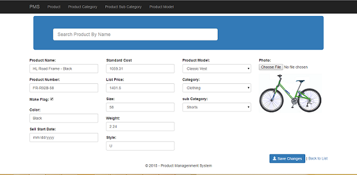

# ASP.NET MVC 5 Entity Framework code First  N-tier Application Architecture
## Requires
- Visual Studio 2013
## License
- MIT
## Technologies
- C# Language
- Bootstrap
- ASP.NET MVC 4
- Visual Studio 2013
- Jquery Ajax
- HTML5/JavaScript
- Entity Framework 6
## Topics
- Architecture and Design
## Updated
- 05/15/2015
## Description

&nbsp;

<h1>Introduction</h1>

Before going to this please go through below link

Level 1

https://code.msdn.microsoft.com/windowsdesktop/ASPNET-MVC-5-Entity-a1e27f08

Level 2

https://code.msdn.microsoft.com/windowsdesktop/ASPNET-MVC-5-Entity-23dad50e

Level 2

https://code.msdn.microsoft.com/windowsdesktop/Solution-Architecture-677426d9

&nbsp;

<em>this application is help full for&nbsp;beginners who are looking for to learn ASP.NET MVC 5 application,</em>

<em>UI/UI design using Bootstrap and Data Access using Entity Framework</em>

&nbsp;

<em>how to run application please click on the below url for Video</em>

http://youtu.be/MZo0yhbvlCA

<h1>Building the Sample</h1>

<em>Change the Data Source with your local SQL Server Instance name in web.comfig file connetection string&nbsp;</em>

<em>if any dependency dll are missing please Manage Nuget package and build the application</em>

<em>how to run application please click on the below url for Video</em>

http://youtu.be/MZo0yhbvlCA

Description

<em>How does this sample solve the problem?</em>

<em>how to run application please click on the below url for Video</em>

http://youtu.be/MZo0yhbvlCA

<ul>
<li>Apply the user interface design for a web application(Bootstrap, CSS, HTML) </li></ul>
<ul>
<li>Design and implement UI behaviour(Ajax, Jquery, Javascript, partial updates) </li></ul>
<ul>
<li>Compose the UI layout of an application(Razor) </li></ul>
<ul>
<li>Enhance application behaviour and style based on browser feature detection(BootStrap)
</li></ul>
<ul>
<li>Planning an adaptive UI layout (BootStrap) </li></ul>
<ul>
<li>Reduce network bandwidth (Bundling and minification) </li></ul>
<ul>
<li>improve the quality (Handling Exception ) </li></ul>

<em> 
</em>

<em>You can include <em><strong>code snippets,&nbsp;</strong></em><strong>images</strong>,
<strong>videos</strong></em>

<em>. &nbsp;&nbsp;</em>

&nbsp;

C#

Edit|Remove

csharp
<pre class="hidden">using PDM.IRepository;
using PDM.Model;
using PDM.Repository;
using System;
using System.Collections.Generic;
using System.Linq;
using System.Web;
using System.Web.Mvc;

namespace PDM.Web.Controllers
{
    public class ProductController : Controller
    {
        private IRepositoryBase&lt;Product&gt; repository = new ProductRepository();
        public ActionResult Index()
        {
            return View(repository.GetAll().ToList());
        }

        public ActionResult Create()
        {
            Product product = new Product();
            GetProduct(product);
            return View(product);
        }

        [HttpPost]
        public ActionResult Create(Product product, int ProductModelId, int ProductCategoryID, int ProductSubCategoryID, HttpPostedFileBase file)
        {
            if (ModelState.IsValid)
            {
                if (file != null)
                {
                    IRepositoryBase&lt;Photo&gt; repositoryPhoto = new PhotoRepository();
                    Photo photo = new Photo();
                    photo.Name = file.FileName;
                    photo.Image = new byte[file.ContentLength];
                    file.InputStream.Read(photo.Image, 0, file.ContentLength);
                    product.PhotoID = repositoryPhoto.Create(photo);
                }
                (repository as IProductRepository).Create(product, ProductModelId, ProductCategoryID, ProductSubCategoryID);
                return RedirectToAction(&quot;Index&quot;);
            }
            else
            {
                return View(product);
            }
        }

        public PartialViewResult List()
        {
            return PartialView(repository.GetAll().ToList());
        }
        [HttpGet]
        public ActionResult Edit(int id)
        {
            var product = repository.GetByID(id);
            GetProduct(product);
            ViewBag.ProductModelID = product.ProductModelId;
            IRepositoryBase&lt;ProductSubCategory&gt; repositorySubCategory = new ProductSubCategoryRepository();
            ViewBag.ProductCategoryID = repositorySubCategory.GetAll().Where(x =&gt; x.ProductSubCategoryID == product.ProductSubCategoryID).Select(y =&gt; y.ProductCategoryID).FirstOrDefault();
            ViewBag.ProductSubCategoryID = product.ProductSubCategoryID;
            return View(product);
        }

        [HttpPost]

        public ActionResult Edit(Product product, int ProductModelId, int ProductCategoryID, int ProductSubCategoryID, HttpPostedFileBase file)
        {
            if (ModelState.IsValid)
            {
                if (file != null)
                {
                    IRepositoryBase&lt;Photo&gt; repositoryPhoto = new PhotoRepository();
                    Photo photo = repositoryPhoto.GetByID(product.PhotoID);
                    photo.Name = file.FileName;
                    photo.Image = new byte[file.ContentLength];
                    file.InputStream.Read(photo.Image, 0, file.ContentLength);
                    product.PhotoID = repositoryPhoto.Update(photo);
                }
                (repository as IProductRepository).Edit(product, ProductModelId, ProductSubCategoryID);
                return RedirectToAction(&quot;Index&quot;);
            }
            return View(product);
        }

        public ActionResult Details(int id)
        {
            var product = repository.GetByID(id);
            GetProduct(product);
            return PartialView(product);
        }

        public ActionResult Delete(int id)
        {
            var product = repository.GetByID(id);
            return PartialView(product);
        }

        [HttpPost]
        public ActionResult Delete(Product product)
        {
            repository.Delete(product.ProductID);
            return RedirectToAction(&quot;List&quot;);
        }

        public FileContentResult GetImage(int id)
        {
            IRepositoryBase&lt;Photo&gt; repositoryPhoto = new PhotoRepository();
            var photo = repositoryPhoto.GetByID(id);
            return File(photo.Image, photo.Name);

        }

        public JsonResult GetSubCategory(int selectedValue)
        {
            IRepositoryBase&lt;ProductSubCategory&gt; repositorySubCategory = new ProductSubCategoryRepository();
            var items = repositorySubCategory.GetAll().Where(x =&gt; x.ProductCategoryID == selectedValue).ToList();
            return Json(items, JsonRequestBehavior.AllowGet);
        }

        public JsonResult Search(string name)
        {
            var result = (from p in repository.GetAll()
                          where p.Name.ToLower().Contains(name.ToLower())
                          select new { p.Name }).Distinct();
            return Json(result, JsonRequestBehavior.AllowGet);
        }

        public Product GetProduct(Product product)
        {
            IRepositoryBase&lt;ProductCategory&gt; repositoryCategory = new ProductCategoryRepository();
            product.ProductCategoryCollection = repositoryCategory.GetAll().ToList();
            IRepositoryBase&lt;ProductSubCategory&gt; repositorySubCategory = new ProductSubCategoryRepository();
            product.ProductSubCategoryCollection = repositorySubCategory.GetAll().ToList();
            IRepositoryBase&lt;ProductModel&gt; repositoryProductModel = new ProductModelRepository();
            product.ProductModelCollection = repositoryProductModel.GetAll().ToList();
            return product;
        }
    }
}</pre>

<pre class="csharp">using&nbsp;PDM.IRepository;&nbsp;
using&nbsp;PDM.Model;&nbsp;
using&nbsp;PDM.Repository;&nbsp;
using&nbsp;System;&nbsp;
using&nbsp;System.Collections.Generic;&nbsp;
using&nbsp;System.Linq;&nbsp;
using&nbsp;System.Web;&nbsp;
using&nbsp;System.Web.Mvc;&nbsp;
&nbsp;
namespace&nbsp;PDM.Web.Controllers&nbsp;
{&nbsp;
&nbsp;&nbsp;&nbsp;&nbsp;public&nbsp;class&nbsp;ProductController&nbsp;:&nbsp;Controller&nbsp;
&nbsp;&nbsp;&nbsp;&nbsp;{&nbsp;
&nbsp;&nbsp;&nbsp;&nbsp;&nbsp;&nbsp;&nbsp;&nbsp;private&nbsp;IRepositoryBase&lt;Product&gt;&nbsp;repository&nbsp;=&nbsp;new&nbsp;ProductRepository();&nbsp;
&nbsp;&nbsp;&nbsp;&nbsp;&nbsp;&nbsp;&nbsp;&nbsp;public&nbsp;ActionResult&nbsp;Index()&nbsp;
&nbsp;&nbsp;&nbsp;&nbsp;&nbsp;&nbsp;&nbsp;&nbsp;{&nbsp;
&nbsp;&nbsp;&nbsp;&nbsp;&nbsp;&nbsp;&nbsp;&nbsp;&nbsp;&nbsp;&nbsp;&nbsp;return&nbsp;View(repository.GetAll().ToList());&nbsp;
&nbsp;&nbsp;&nbsp;&nbsp;&nbsp;&nbsp;&nbsp;&nbsp;}&nbsp;
&nbsp;
&nbsp;&nbsp;&nbsp;&nbsp;&nbsp;&nbsp;&nbsp;&nbsp;public&nbsp;ActionResult&nbsp;Create()&nbsp;
&nbsp;&nbsp;&nbsp;&nbsp;&nbsp;&nbsp;&nbsp;&nbsp;{&nbsp;
&nbsp;&nbsp;&nbsp;&nbsp;&nbsp;&nbsp;&nbsp;&nbsp;&nbsp;&nbsp;&nbsp;&nbsp;Product&nbsp;product&nbsp;=&nbsp;new&nbsp;Product();&nbsp;
&nbsp;&nbsp;&nbsp;&nbsp;&nbsp;&nbsp;&nbsp;&nbsp;&nbsp;&nbsp;&nbsp;&nbsp;GetProduct(product);&nbsp;
&nbsp;&nbsp;&nbsp;&nbsp;&nbsp;&nbsp;&nbsp;&nbsp;&nbsp;&nbsp;&nbsp;&nbsp;return&nbsp;View(product);&nbsp;
&nbsp;&nbsp;&nbsp;&nbsp;&nbsp;&nbsp;&nbsp;&nbsp;}&nbsp;
&nbsp;
&nbsp;&nbsp;&nbsp;&nbsp;&nbsp;&nbsp;&nbsp;&nbsp;[HttpPost]&nbsp;
&nbsp;&nbsp;&nbsp;&nbsp;&nbsp;&nbsp;&nbsp;&nbsp;public&nbsp;ActionResult&nbsp;Create(Product&nbsp;product,&nbsp;int&nbsp;ProductModelId,&nbsp;int&nbsp;ProductCategoryID,&nbsp;int&nbsp;ProductSubCategoryID,&nbsp;HttpPostedFileBase&nbsp;file)&nbsp;
&nbsp;&nbsp;&nbsp;&nbsp;&nbsp;&nbsp;&nbsp;&nbsp;{&nbsp;
&nbsp;&nbsp;&nbsp;&nbsp;&nbsp;&nbsp;&nbsp;&nbsp;&nbsp;&nbsp;&nbsp;&nbsp;if&nbsp;(ModelState.IsValid)&nbsp;
&nbsp;&nbsp;&nbsp;&nbsp;&nbsp;&nbsp;&nbsp;&nbsp;&nbsp;&nbsp;&nbsp;&nbsp;{&nbsp;
&nbsp;&nbsp;&nbsp;&nbsp;&nbsp;&nbsp;&nbsp;&nbsp;&nbsp;&nbsp;&nbsp;&nbsp;&nbsp;&nbsp;&nbsp;&nbsp;if&nbsp;(file&nbsp;!=&nbsp;null)&nbsp;
&nbsp;&nbsp;&nbsp;&nbsp;&nbsp;&nbsp;&nbsp;&nbsp;&nbsp;&nbsp;&nbsp;&nbsp;&nbsp;&nbsp;&nbsp;&nbsp;{&nbsp;
&nbsp;&nbsp;&nbsp;&nbsp;&nbsp;&nbsp;&nbsp;&nbsp;&nbsp;&nbsp;&nbsp;&nbsp;&nbsp;&nbsp;&nbsp;&nbsp;&nbsp;&nbsp;&nbsp;&nbsp;IRepositoryBase&lt;Photo&gt;&nbsp;repositoryPhoto&nbsp;=&nbsp;new&nbsp;PhotoRepository();&nbsp;
&nbsp;&nbsp;&nbsp;&nbsp;&nbsp;&nbsp;&nbsp;&nbsp;&nbsp;&nbsp;&nbsp;&nbsp;&nbsp;&nbsp;&nbsp;&nbsp;&nbsp;&nbsp;&nbsp;&nbsp;Photo&nbsp;photo&nbsp;=&nbsp;new&nbsp;Photo();&nbsp;
&nbsp;&nbsp;&nbsp;&nbsp;&nbsp;&nbsp;&nbsp;&nbsp;&nbsp;&nbsp;&nbsp;&nbsp;&nbsp;&nbsp;&nbsp;&nbsp;&nbsp;&nbsp;&nbsp;&nbsp;photo.Name&nbsp;=&nbsp;file.FileName;&nbsp;
&nbsp;&nbsp;&nbsp;&nbsp;&nbsp;&nbsp;&nbsp;&nbsp;&nbsp;&nbsp;&nbsp;&nbsp;&nbsp;&nbsp;&nbsp;&nbsp;&nbsp;&nbsp;&nbsp;&nbsp;photo.Image&nbsp;=&nbsp;new&nbsp;byte[file.ContentLength];&nbsp;
&nbsp;&nbsp;&nbsp;&nbsp;&nbsp;&nbsp;&nbsp;&nbsp;&nbsp;&nbsp;&nbsp;&nbsp;&nbsp;&nbsp;&nbsp;&nbsp;&nbsp;&nbsp;&nbsp;&nbsp;file.InputStream.Read(photo.Image,&nbsp;0,&nbsp;file.ContentLength);&nbsp;
&nbsp;&nbsp;&nbsp;&nbsp;&nbsp;&nbsp;&nbsp;&nbsp;&nbsp;&nbsp;&nbsp;&nbsp;&nbsp;&nbsp;&nbsp;&nbsp;&nbsp;&nbsp;&nbsp;&nbsp;product.PhotoID&nbsp;=&nbsp;repositoryPhoto.Create(photo);&nbsp;
&nbsp;&nbsp;&nbsp;&nbsp;&nbsp;&nbsp;&nbsp;&nbsp;&nbsp;&nbsp;&nbsp;&nbsp;&nbsp;&nbsp;&nbsp;&nbsp;}&nbsp;
&nbsp;&nbsp;&nbsp;&nbsp;&nbsp;&nbsp;&nbsp;&nbsp;&nbsp;&nbsp;&nbsp;&nbsp;&nbsp;&nbsp;&nbsp;&nbsp;(repository&nbsp;as&nbsp;IProductRepository).Create(product,&nbsp;ProductModelId,&nbsp;ProductCategoryID,&nbsp;ProductSubCategoryID);&nbsp;
&nbsp;&nbsp;&nbsp;&nbsp;&nbsp;&nbsp;&nbsp;&nbsp;&nbsp;&nbsp;&nbsp;&nbsp;&nbsp;&nbsp;&nbsp;&nbsp;return&nbsp;RedirectToAction(&quot;Index&quot;);&nbsp;
&nbsp;&nbsp;&nbsp;&nbsp;&nbsp;&nbsp;&nbsp;&nbsp;&nbsp;&nbsp;&nbsp;&nbsp;}&nbsp;
&nbsp;&nbsp;&nbsp;&nbsp;&nbsp;&nbsp;&nbsp;&nbsp;&nbsp;&nbsp;&nbsp;&nbsp;else&nbsp;
&nbsp;&nbsp;&nbsp;&nbsp;&nbsp;&nbsp;&nbsp;&nbsp;&nbsp;&nbsp;&nbsp;&nbsp;{&nbsp;
&nbsp;&nbsp;&nbsp;&nbsp;&nbsp;&nbsp;&nbsp;&nbsp;&nbsp;&nbsp;&nbsp;&nbsp;&nbsp;&nbsp;&nbsp;&nbsp;return&nbsp;View(product);&nbsp;
&nbsp;&nbsp;&nbsp;&nbsp;&nbsp;&nbsp;&nbsp;&nbsp;&nbsp;&nbsp;&nbsp;&nbsp;}&nbsp;
&nbsp;&nbsp;&nbsp;&nbsp;&nbsp;&nbsp;&nbsp;&nbsp;}&nbsp;
&nbsp;
&nbsp;&nbsp;&nbsp;&nbsp;&nbsp;&nbsp;&nbsp;&nbsp;public&nbsp;PartialViewResult&nbsp;List()&nbsp;
&nbsp;&nbsp;&nbsp;&nbsp;&nbsp;&nbsp;&nbsp;&nbsp;{&nbsp;
&nbsp;&nbsp;&nbsp;&nbsp;&nbsp;&nbsp;&nbsp;&nbsp;&nbsp;&nbsp;&nbsp;&nbsp;return&nbsp;PartialView(repository.GetAll().ToList());&nbsp;
&nbsp;&nbsp;&nbsp;&nbsp;&nbsp;&nbsp;&nbsp;&nbsp;}&nbsp;
&nbsp;&nbsp;&nbsp;&nbsp;&nbsp;&nbsp;&nbsp;&nbsp;[HttpGet]&nbsp;
&nbsp;&nbsp;&nbsp;&nbsp;&nbsp;&nbsp;&nbsp;&nbsp;public&nbsp;ActionResult&nbsp;Edit(int&nbsp;id)&nbsp;
&nbsp;&nbsp;&nbsp;&nbsp;&nbsp;&nbsp;&nbsp;&nbsp;{&nbsp;
&nbsp;&nbsp;&nbsp;&nbsp;&nbsp;&nbsp;&nbsp;&nbsp;&nbsp;&nbsp;&nbsp;&nbsp;var&nbsp;product&nbsp;=&nbsp;repository.GetByID(id);&nbsp;
&nbsp;&nbsp;&nbsp;&nbsp;&nbsp;&nbsp;&nbsp;&nbsp;&nbsp;&nbsp;&nbsp;&nbsp;GetProduct(product);&nbsp;
&nbsp;&nbsp;&nbsp;&nbsp;&nbsp;&nbsp;&nbsp;&nbsp;&nbsp;&nbsp;&nbsp;&nbsp;ViewBag.ProductModelID&nbsp;=&nbsp;product.ProductModelId;&nbsp;
&nbsp;&nbsp;&nbsp;&nbsp;&nbsp;&nbsp;&nbsp;&nbsp;&nbsp;&nbsp;&nbsp;&nbsp;IRepositoryBase&lt;ProductSubCategory&gt;&nbsp;repositorySubCategory&nbsp;=&nbsp;new&nbsp;ProductSubCategoryRepository();&nbsp;
&nbsp;&nbsp;&nbsp;&nbsp;&nbsp;&nbsp;&nbsp;&nbsp;&nbsp;&nbsp;&nbsp;&nbsp;ViewBag.ProductCategoryID&nbsp;=&nbsp;repositorySubCategory.GetAll().Where(x&nbsp;=&gt;&nbsp;x.ProductSubCategoryID&nbsp;==&nbsp;product.ProductSubCategoryID).Select(y&nbsp;=&gt;&nbsp;y.ProductCategoryID).FirstOrDefault();&nbsp;
&nbsp;&nbsp;&nbsp;&nbsp;&nbsp;&nbsp;&nbsp;&nbsp;&nbsp;&nbsp;&nbsp;&nbsp;ViewBag.ProductSubCategoryID&nbsp;=&nbsp;product.ProductSubCategoryID;&nbsp;
&nbsp;&nbsp;&nbsp;&nbsp;&nbsp;&nbsp;&nbsp;&nbsp;&nbsp;&nbsp;&nbsp;&nbsp;return&nbsp;View(product);&nbsp;
&nbsp;&nbsp;&nbsp;&nbsp;&nbsp;&nbsp;&nbsp;&nbsp;}&nbsp;
&nbsp;
&nbsp;&nbsp;&nbsp;&nbsp;&nbsp;&nbsp;&nbsp;&nbsp;[HttpPost]&nbsp;
&nbsp;
&nbsp;&nbsp;&nbsp;&nbsp;&nbsp;&nbsp;&nbsp;&nbsp;public&nbsp;ActionResult&nbsp;Edit(Product&nbsp;product,&nbsp;int&nbsp;ProductModelId,&nbsp;int&nbsp;ProductCategoryID,&nbsp;int&nbsp;ProductSubCategoryID,&nbsp;HttpPostedFileBase&nbsp;file)&nbsp;
&nbsp;&nbsp;&nbsp;&nbsp;&nbsp;&nbsp;&nbsp;&nbsp;{&nbsp;
&nbsp;&nbsp;&nbsp;&nbsp;&nbsp;&nbsp;&nbsp;&nbsp;&nbsp;&nbsp;&nbsp;&nbsp;if&nbsp;(ModelState.IsValid)&nbsp;
&nbsp;&nbsp;&nbsp;&nbsp;&nbsp;&nbsp;&nbsp;&nbsp;&nbsp;&nbsp;&nbsp;&nbsp;{&nbsp;
&nbsp;&nbsp;&nbsp;&nbsp;&nbsp;&nbsp;&nbsp;&nbsp;&nbsp;&nbsp;&nbsp;&nbsp;&nbsp;&nbsp;&nbsp;&nbsp;if&nbsp;(file&nbsp;!=&nbsp;null)&nbsp;
&nbsp;&nbsp;&nbsp;&nbsp;&nbsp;&nbsp;&nbsp;&nbsp;&nbsp;&nbsp;&nbsp;&nbsp;&nbsp;&nbsp;&nbsp;&nbsp;{&nbsp;
&nbsp;&nbsp;&nbsp;&nbsp;&nbsp;&nbsp;&nbsp;&nbsp;&nbsp;&nbsp;&nbsp;&nbsp;&nbsp;&nbsp;&nbsp;&nbsp;&nbsp;&nbsp;&nbsp;&nbsp;IRepositoryBase&lt;Photo&gt;&nbsp;repositoryPhoto&nbsp;=&nbsp;new&nbsp;PhotoRepository();&nbsp;
&nbsp;&nbsp;&nbsp;&nbsp;&nbsp;&nbsp;&nbsp;&nbsp;&nbsp;&nbsp;&nbsp;&nbsp;&nbsp;&nbsp;&nbsp;&nbsp;&nbsp;&nbsp;&nbsp;&nbsp;Photo&nbsp;photo&nbsp;=&nbsp;repositoryPhoto.GetByID(product.PhotoID);&nbsp;
&nbsp;&nbsp;&nbsp;&nbsp;&nbsp;&nbsp;&nbsp;&nbsp;&nbsp;&nbsp;&nbsp;&nbsp;&nbsp;&nbsp;&nbsp;&nbsp;&nbsp;&nbsp;&nbsp;&nbsp;photo.Name&nbsp;=&nbsp;file.FileName;&nbsp;
&nbsp;&nbsp;&nbsp;&nbsp;&nbsp;&nbsp;&nbsp;&nbsp;&nbsp;&nbsp;&nbsp;&nbsp;&nbsp;&nbsp;&nbsp;&nbsp;&nbsp;&nbsp;&nbsp;&nbsp;photo.Image&nbsp;=&nbsp;new&nbsp;byte[file.ContentLength];&nbsp;
&nbsp;&nbsp;&nbsp;&nbsp;&nbsp;&nbsp;&nbsp;&nbsp;&nbsp;&nbsp;&nbsp;&nbsp;&nbsp;&nbsp;&nbsp;&nbsp;&nbsp;&nbsp;&nbsp;&nbsp;file.InputStream.Read(photo.Image,&nbsp;0,&nbsp;file.ContentLength);&nbsp;
&nbsp;&nbsp;&nbsp;&nbsp;&nbsp;&nbsp;&nbsp;&nbsp;&nbsp;&nbsp;&nbsp;&nbsp;&nbsp;&nbsp;&nbsp;&nbsp;&nbsp;&nbsp;&nbsp;&nbsp;product.PhotoID&nbsp;=&nbsp;repositoryPhoto.Update(photo);&nbsp;
&nbsp;&nbsp;&nbsp;&nbsp;&nbsp;&nbsp;&nbsp;&nbsp;&nbsp;&nbsp;&nbsp;&nbsp;&nbsp;&nbsp;&nbsp;&nbsp;}&nbsp;
&nbsp;&nbsp;&nbsp;&nbsp;&nbsp;&nbsp;&nbsp;&nbsp;&nbsp;&nbsp;&nbsp;&nbsp;&nbsp;&nbsp;&nbsp;&nbsp;(repository&nbsp;as&nbsp;IProductRepository).Edit(product,&nbsp;ProductModelId,&nbsp;ProductSubCategoryID);&nbsp;
&nbsp;&nbsp;&nbsp;&nbsp;&nbsp;&nbsp;&nbsp;&nbsp;&nbsp;&nbsp;&nbsp;&nbsp;&nbsp;&nbsp;&nbsp;&nbsp;return&nbsp;RedirectToAction(&quot;Index&quot;);&nbsp;
&nbsp;&nbsp;&nbsp;&nbsp;&nbsp;&nbsp;&nbsp;&nbsp;&nbsp;&nbsp;&nbsp;&nbsp;}&nbsp;
&nbsp;&nbsp;&nbsp;&nbsp;&nbsp;&nbsp;&nbsp;&nbsp;&nbsp;&nbsp;&nbsp;&nbsp;return&nbsp;View(product);&nbsp;
&nbsp;&nbsp;&nbsp;&nbsp;&nbsp;&nbsp;&nbsp;&nbsp;}&nbsp;
&nbsp;
&nbsp;&nbsp;&nbsp;&nbsp;&nbsp;&nbsp;&nbsp;&nbsp;public&nbsp;ActionResult&nbsp;Details(int&nbsp;id)&nbsp;
&nbsp;&nbsp;&nbsp;&nbsp;&nbsp;&nbsp;&nbsp;&nbsp;{&nbsp;
&nbsp;&nbsp;&nbsp;&nbsp;&nbsp;&nbsp;&nbsp;&nbsp;&nbsp;&nbsp;&nbsp;&nbsp;var&nbsp;product&nbsp;=&nbsp;repository.GetByID(id);&nbsp;
&nbsp;&nbsp;&nbsp;&nbsp;&nbsp;&nbsp;&nbsp;&nbsp;&nbsp;&nbsp;&nbsp;&nbsp;GetProduct(product);&nbsp;
&nbsp;&nbsp;&nbsp;&nbsp;&nbsp;&nbsp;&nbsp;&nbsp;&nbsp;&nbsp;&nbsp;&nbsp;return&nbsp;PartialView(product);&nbsp;
&nbsp;&nbsp;&nbsp;&nbsp;&nbsp;&nbsp;&nbsp;&nbsp;}&nbsp;
&nbsp;
&nbsp;&nbsp;&nbsp;&nbsp;&nbsp;&nbsp;&nbsp;&nbsp;public&nbsp;ActionResult&nbsp;Delete(int&nbsp;id)&nbsp;
&nbsp;&nbsp;&nbsp;&nbsp;&nbsp;&nbsp;&nbsp;&nbsp;{&nbsp;
&nbsp;&nbsp;&nbsp;&nbsp;&nbsp;&nbsp;&nbsp;&nbsp;&nbsp;&nbsp;&nbsp;&nbsp;var&nbsp;product&nbsp;=&nbsp;repository.GetByID(id);&nbsp;
&nbsp;&nbsp;&nbsp;&nbsp;&nbsp;&nbsp;&nbsp;&nbsp;&nbsp;&nbsp;&nbsp;&nbsp;return&nbsp;PartialView(product);&nbsp;
&nbsp;&nbsp;&nbsp;&nbsp;&nbsp;&nbsp;&nbsp;&nbsp;}&nbsp;
&nbsp;
&nbsp;&nbsp;&nbsp;&nbsp;&nbsp;&nbsp;&nbsp;&nbsp;[HttpPost]&nbsp;
&nbsp;&nbsp;&nbsp;&nbsp;&nbsp;&nbsp;&nbsp;&nbsp;public&nbsp;ActionResult&nbsp;Delete(Product&nbsp;product)&nbsp;
&nbsp;&nbsp;&nbsp;&nbsp;&nbsp;&nbsp;&nbsp;&nbsp;{&nbsp;
&nbsp;&nbsp;&nbsp;&nbsp;&nbsp;&nbsp;&nbsp;&nbsp;&nbsp;&nbsp;&nbsp;&nbsp;repository.Delete(product.ProductID);&nbsp;
&nbsp;&nbsp;&nbsp;&nbsp;&nbsp;&nbsp;&nbsp;&nbsp;&nbsp;&nbsp;&nbsp;&nbsp;return&nbsp;RedirectToAction(&quot;List&quot;);&nbsp;
&nbsp;&nbsp;&nbsp;&nbsp;&nbsp;&nbsp;&nbsp;&nbsp;}&nbsp;
&nbsp;
&nbsp;&nbsp;&nbsp;&nbsp;&nbsp;&nbsp;&nbsp;&nbsp;public&nbsp;FileContentResult&nbsp;GetImage(int&nbsp;id)&nbsp;
&nbsp;&nbsp;&nbsp;&nbsp;&nbsp;&nbsp;&nbsp;&nbsp;{&nbsp;
&nbsp;&nbsp;&nbsp;&nbsp;&nbsp;&nbsp;&nbsp;&nbsp;&nbsp;&nbsp;&nbsp;&nbsp;IRepositoryBase&lt;Photo&gt;&nbsp;repositoryPhoto&nbsp;=&nbsp;new&nbsp;PhotoRepository();&nbsp;
&nbsp;&nbsp;&nbsp;&nbsp;&nbsp;&nbsp;&nbsp;&nbsp;&nbsp;&nbsp;&nbsp;&nbsp;var&nbsp;photo&nbsp;=&nbsp;repositoryPhoto.GetByID(id);&nbsp;
&nbsp;&nbsp;&nbsp;&nbsp;&nbsp;&nbsp;&nbsp;&nbsp;&nbsp;&nbsp;&nbsp;&nbsp;return&nbsp;File(photo.Image,&nbsp;photo.Name);&nbsp;
&nbsp;
&nbsp;&nbsp;&nbsp;&nbsp;&nbsp;&nbsp;&nbsp;&nbsp;}&nbsp;
&nbsp;
&nbsp;&nbsp;&nbsp;&nbsp;&nbsp;&nbsp;&nbsp;&nbsp;public&nbsp;JsonResult&nbsp;GetSubCategory(int&nbsp;selectedValue)&nbsp;
&nbsp;&nbsp;&nbsp;&nbsp;&nbsp;&nbsp;&nbsp;&nbsp;{&nbsp;
&nbsp;&nbsp;&nbsp;&nbsp;&nbsp;&nbsp;&nbsp;&nbsp;&nbsp;&nbsp;&nbsp;&nbsp;IRepositoryBase&lt;ProductSubCategory&gt;&nbsp;repositorySubCategory&nbsp;=&nbsp;new&nbsp;ProductSubCategoryRepository();&nbsp;
&nbsp;&nbsp;&nbsp;&nbsp;&nbsp;&nbsp;&nbsp;&nbsp;&nbsp;&nbsp;&nbsp;&nbsp;var&nbsp;items&nbsp;=&nbsp;repositorySubCategory.GetAll().Where(x&nbsp;=&gt;&nbsp;x.ProductCategoryID&nbsp;==&nbsp;selectedValue).ToList();&nbsp;
&nbsp;&nbsp;&nbsp;&nbsp;&nbsp;&nbsp;&nbsp;&nbsp;&nbsp;&nbsp;&nbsp;&nbsp;return&nbsp;Json(items,&nbsp;JsonRequestBehavior.AllowGet);&nbsp;
&nbsp;&nbsp;&nbsp;&nbsp;&nbsp;&nbsp;&nbsp;&nbsp;}&nbsp;
&nbsp;
&nbsp;&nbsp;&nbsp;&nbsp;&nbsp;&nbsp;&nbsp;&nbsp;public&nbsp;JsonResult&nbsp;Search(string&nbsp;name)&nbsp;
&nbsp;&nbsp;&nbsp;&nbsp;&nbsp;&nbsp;&nbsp;&nbsp;{&nbsp;
&nbsp;&nbsp;&nbsp;&nbsp;&nbsp;&nbsp;&nbsp;&nbsp;&nbsp;&nbsp;&nbsp;&nbsp;var&nbsp;result&nbsp;=&nbsp;(from&nbsp;p&nbsp;in&nbsp;repository.GetAll()&nbsp;
&nbsp;&nbsp;&nbsp;&nbsp;&nbsp;&nbsp;&nbsp;&nbsp;&nbsp;&nbsp;&nbsp;&nbsp;&nbsp;&nbsp;&nbsp;&nbsp;&nbsp;&nbsp;&nbsp;&nbsp;&nbsp;&nbsp;&nbsp;&nbsp;&nbsp;&nbsp;where&nbsp;p.Name.ToLower().Contains(name.ToLower())&nbsp;
&nbsp;&nbsp;&nbsp;&nbsp;&nbsp;&nbsp;&nbsp;&nbsp;&nbsp;&nbsp;&nbsp;&nbsp;&nbsp;&nbsp;&nbsp;&nbsp;&nbsp;&nbsp;&nbsp;&nbsp;&nbsp;&nbsp;&nbsp;&nbsp;&nbsp;&nbsp;select&nbsp;new&nbsp;{&nbsp;p.Name&nbsp;}).Distinct();&nbsp;
&nbsp;&nbsp;&nbsp;&nbsp;&nbsp;&nbsp;&nbsp;&nbsp;&nbsp;&nbsp;&nbsp;&nbsp;return&nbsp;Json(result,&nbsp;JsonRequestBehavior.AllowGet);&nbsp;
&nbsp;&nbsp;&nbsp;&nbsp;&nbsp;&nbsp;&nbsp;&nbsp;}&nbsp;
&nbsp;
&nbsp;&nbsp;&nbsp;&nbsp;&nbsp;&nbsp;&nbsp;&nbsp;public&nbsp;Product&nbsp;GetProduct(Product&nbsp;product)&nbsp;
&nbsp;&nbsp;&nbsp;&nbsp;&nbsp;&nbsp;&nbsp;&nbsp;{&nbsp;
&nbsp;&nbsp;&nbsp;&nbsp;&nbsp;&nbsp;&nbsp;&nbsp;&nbsp;&nbsp;&nbsp;&nbsp;IRepositoryBase&lt;ProductCategory&gt;&nbsp;repositoryCategory&nbsp;=&nbsp;new&nbsp;ProductCategoryRepository();&nbsp;
&nbsp;&nbsp;&nbsp;&nbsp;&nbsp;&nbsp;&nbsp;&nbsp;&nbsp;&nbsp;&nbsp;&nbsp;product.ProductCategoryCollection&nbsp;=&nbsp;repositoryCategory.GetAll().ToList();&nbsp;
&nbsp;&nbsp;&nbsp;&nbsp;&nbsp;&nbsp;&nbsp;&nbsp;&nbsp;&nbsp;&nbsp;&nbsp;IRepositoryBase&lt;ProductSubCategory&gt;&nbsp;repositorySubCategory&nbsp;=&nbsp;new&nbsp;ProductSubCategoryRepository();&nbsp;
&nbsp;&nbsp;&nbsp;&nbsp;&nbsp;&nbsp;&nbsp;&nbsp;&nbsp;&nbsp;&nbsp;&nbsp;product.ProductSubCategoryCollection&nbsp;=&nbsp;repositorySubCategory.GetAll().ToList();&nbsp;
&nbsp;&nbsp;&nbsp;&nbsp;&nbsp;&nbsp;&nbsp;&nbsp;&nbsp;&nbsp;&nbsp;&nbsp;IRepositoryBase&lt;ProductModel&gt;&nbsp;repositoryProductModel&nbsp;=&nbsp;new&nbsp;ProductModelRepository();&nbsp;
&nbsp;&nbsp;&nbsp;&nbsp;&nbsp;&nbsp;&nbsp;&nbsp;&nbsp;&nbsp;&nbsp;&nbsp;product.ProductModelCollection&nbsp;=&nbsp;repositoryProductModel.GetAll().ToList();&nbsp;
&nbsp;&nbsp;&nbsp;&nbsp;&nbsp;&nbsp;&nbsp;&nbsp;&nbsp;&nbsp;&nbsp;&nbsp;return&nbsp;product;&nbsp;
&nbsp;&nbsp;&nbsp;&nbsp;&nbsp;&nbsp;&nbsp;&nbsp;}&nbsp;
&nbsp;&nbsp;&nbsp;&nbsp;}&nbsp;
}</pre>

<h1>Source Code Files</h1>
<ul>
<li><em>source code file name #1 - summary for this source code file.</em> </li><li><em><em>source code file name #2 - summary for this source code file.</em></em>
</li></ul>
<h1>More Information</h1>

<em>For more information on X, see ...?</em>

