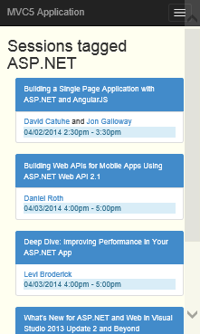

# ASP.NET MVC 5 Mobile Web Application
## Requires
- Visual Studio 2013
## License
- MS-LPL
## Technologies
- Bootstrap
- Windows Azure Web Sites
- ASP.NET MVC 5
## Topics
- Bootstrap
- mobile application development
- Responsive web Design
## Updated
- 05/22/2014
## Description

<h1>Introduction</h1>

This starter project compliments the Windows Azure <a href="http://azure.microsoft.com/en-us/documentation/articles/web-sites-dotnet-deploy-aspnet-mvc-mobile-app/">
tutorial</a>, which shows you how to build a mobile-friendly MVC 5 application and deploy and test it in Windows Azure Websites. The MVC 5 Web Application template in Visual Studio 2013 has built-in support of the Bootstrap CSS Framework, and the tutorial highlights
 the different Boostrap components you can use to quickly build a responsive Web application using ASP.NET MVC 5.<em></em>

<strong>The project state after completing the tutorial is included as a zip file in the download package called &quot;Mvc5MobileCompleted.zip&quot;.</strong><em> 
</em>

<h1>What You'll Build</h1>

The tutorial shows you how to add mobile features to a simple conference-listing application. The following screenshot shows the ASP.NET sessions in the completed application, as seen in the browser emulator in Internet Explorer 11 F12 developer tools.

<h1>Skills You'll Learn</h1>

Here's what you'll learn by following the tutorial with the starter application:

<ul>
<li>How to use Visual Studio 2013 to publish your Web application directly to a Windows Azure Website.
</li><li>How the ASP.NET MVC 5 templates use the CSS Bootstrap framework to improve display on mobile devices
</li><li>How to create mobile-specific views to target specific mobile browsers, such as the iPhone and Android
</li><li>How to create responsive views (views that respond to different browsers across devices)
</li></ul>
<h1>More Information</h1>
<ul>
<li><a href="http://www.asp.net/">ASP.NET</a> site </li><li><a href="http://getbootstrap.com/">Bootstrap</a> site </li><li><a href="http://blog.getbootstrap.com/">Official Bootstrap Blog</a> </li><li><a href="http://www.tutorialrepublic.com/twitter-bootstrap-tutorial/">Twitter Bootstrap Tutorial from Tutorial Republic</a>
</li><li><a href="http://www.bootply.com/">The Bootstrap Playground</a> </li><li><a href="http://www.w3.org/TR/mwabp/">W3C Recommendation Mobile Web Application Best Practices</a>
</li><li><a href="http://www.w3.org/TR/css3-mediaqueries/">W3C Candidate Recommendation for media queries</a>
</li></ul>
