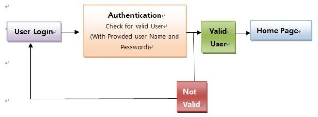
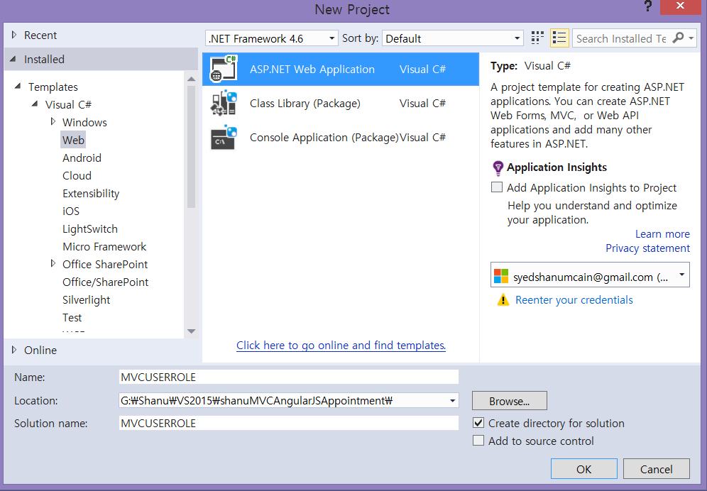
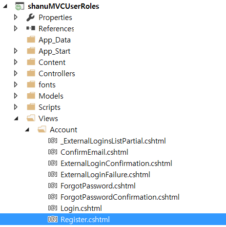
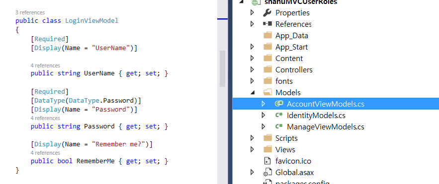
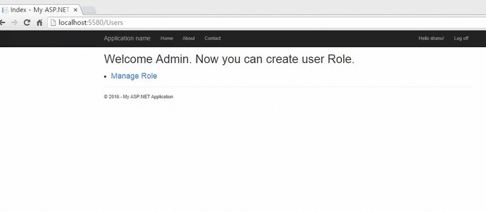

# ASP.NET MVC 5 Security And Creating User Role
## Requires
- Visual Studio 2015
## License
- MIT
## Technologies
- ASP.NET MVC
- MVC
- ASP.NET MVC 5
- ASP.NET Identity
## Topics
- ASP.NET MVC
- MVC
- ASP.NET Identity
## Updated
- 06/19/2019
## Description

<h1>Introduction</h1>

In this article we will see how to use ASP.NET Identity in MVC Application for creating user roles and displaying the menu depending on user roles.

Here we will see how to:&nbsp;

<ul>
<li>Create default admin role and other roles. </li><li>Create default admin users. </li><li>Add Username for new User Registration. </li><li>Select User Role during User Registration. </li><li>Change Login Email with User Name. </li><li>Display Role Creation Menu only for Admin User. </li><li>Display message for normal user. </li><li>Redirect Unauthenticated users to default home page.&nbsp;
</li></ul>
<h2><strong>Authentication and Authorization 
</strong> 
<strong>Authentication</strong></h2>

Check for the Valid User. Here the question is how to check whether a user is valid or not. When a user comes to a Web ssite for the first time he will register for that Web site. All his information, like user name, password, email, and so on will
 be stored in the Web site database. When a user enters his userID and password, the information will be checked with the database. If the user has entered the same userID and Password as in the database then he or she is a valid user and will be redirected
 to the Web site home page. If the user enters a UserID and/or Password that does not match the database then the login page will give a message, something like &ldquo;Enter valid Name or Password&rdquo;. The entire process of checking whether the user is valid
 or not for accessing the Web site is called Authentication.

<strong>Authorization 
</strong> 
Once the user is authenticated he needs to be redirected to the appropriate page by his role. For example, when an Admin is logged in, then he is to be redirected to the Admin Page. If an Accountant is logged in, then he is to be redirected to his Accounts
 page. If an End User is logged in, then he is to be redirected to his page.

<h1>Building the Sample</h1>

<strong>Prerequisites</strong>

<strong>Visual Studio 2015:</strong>&nbsp;You can download it from&nbsp;<a href="https://www.visualstudio.com/en-us/downloads/visual-studio-2015-downloads-vs.aspx">here</a>.

Description

<strong>Create your Web Application in Visual Studio 2015 
</strong> 
After installing our Visual Studio 2015 click Start, then Programs and select&nbsp;<strong>Visual Studio 2015</strong>&nbsp;- Click<strong>Visual Studio 2015</strong>. Click New, then Project, select Web and then select&nbsp;<strong>ASP.NET
 Web Application</strong>. Enter your project name and click OK.

Select MVC and click OK.

<h2><strong>Create a Database</strong></h2>

Firstly, we will create a Database and set the connection string in&nbsp;<strong>web.config</strong>&nbsp;file for DefaultConnection with our new database connection. We will be using this database for ASP.NET Identity table creation and also our sample
 attendance Web project. Instead of using two databases as one for default ASP.NET user database and another for our Attendance DB, here we will be using one common database for both user details and for our sample web project demo.

Create Database: Run the following and create database script to create our sample test database.&nbsp;

SQL

Edit|Remove

mysql

<pre class="mysql">--&nbsp;=============================================&nbsp;&nbsp;&nbsp;&nbsp;&nbsp;&nbsp;&nbsp;&nbsp;&nbsp;&nbsp;&nbsp;&nbsp;&nbsp;&nbsp;&nbsp;&nbsp;&nbsp;&nbsp;&nbsp;&nbsp;&nbsp;&nbsp;&nbsp;&nbsp;&nbsp;&nbsp;&nbsp;&nbsp;&nbsp;&nbsp;&nbsp;&nbsp;--&nbsp;Author&nbsp;&nbsp;&nbsp;&nbsp;&nbsp;&nbsp;:&nbsp;Shanu&nbsp;&nbsp;&nbsp;&nbsp;&nbsp;&nbsp;&nbsp;&nbsp;&nbsp;&nbsp;&nbsp;&nbsp;&nbsp;&nbsp;&nbsp;&nbsp;&nbsp;&nbsp;&nbsp;&nbsp;&nbsp;&nbsp;&nbsp;&nbsp;&nbsp;&nbsp;&nbsp;&nbsp;&nbsp;&nbsp;&nbsp;&nbsp;&nbsp;&nbsp;--&nbsp;Create&nbsp;date&nbsp;:&nbsp;2016-01-17&nbsp;&nbsp;&nbsp;&nbsp;&nbsp;&nbsp;&nbsp;&nbsp;&nbsp;&nbsp;&nbsp;&nbsp;&nbsp;&nbsp;&nbsp;&nbsp;&nbsp;&nbsp;&nbsp;&nbsp;&nbsp;&nbsp;&nbsp;&nbsp;&nbsp;&nbsp;&nbsp;&nbsp;&nbsp;&nbsp;&nbsp;--&nbsp;Description&nbsp;:&nbsp;To&nbsp;Create&nbsp;Database&nbsp;&nbsp;&nbsp;&nbsp;&nbsp;&nbsp;&nbsp;&nbsp;&nbsp;&nbsp;&nbsp;&nbsp;&nbsp;&nbsp;&nbsp;&nbsp;&nbsp;&nbsp;&nbsp;&nbsp;&nbsp;&nbsp;&nbsp;&nbsp;&nbsp;&nbsp;--&nbsp;=============================================&nbsp;&nbsp;&nbsp;
--ScripttocreateDB,TableandsampleInsertdataUSEMASTER;&nbsp;&nbsp;&nbsp;
--&nbsp;1)&nbsp;Check&nbsp;for&nbsp;the&nbsp;Database&nbsp;Exists&nbsp;.If&nbsp;the&nbsp;database&nbsp;is&nbsp;exist&nbsp;then&nbsp;drop&nbsp;and&nbsp;create&nbsp;new&nbsp;DB&nbsp;&nbsp;IFEXISTS&nbsp;(SELECT&nbsp;[name]&nbsp;FROMsys.databasesWHERE&nbsp;[name]&nbsp;=&nbsp;'AttendanceDB'&nbsp;)&nbsp;&nbsp;&nbsp;
BEGINALTERDATABASEAttendanceDBSETSINGLE_USERWITHROLLBACKIMMEDIATEDROPDATABASEAttendanceDB&nbsp;;&nbsp;&nbsp;&nbsp;
ENDCREATEDATABASEAttendanceDBGOUSEAttendanceDB</pre>

<strong>Web.Config</strong>

 
In web.config file we can find the&nbsp;DefaultConnection&nbsp;Connection string. By default ASP.NET MVC will use this connection string to create all ASP.NET Identity related tables like AspNetUsers, etc. For our application
 we also need to use database for other page activities instead of using two different databases, one for User details and one for our own functionality. Here I will be using one database where all ASP.NET Identity tables will be created and also we can create
 our own tables for other page uses.

Here in connection string change your SQL Server Name, UID and PWD to create and store all user details in one database.&nbsp;

XML

Edit|Remove

xml

<pre class="js">&lt;connectionStrings&gt;&nbsp;&nbsp;&nbsp;
&nbsp;&nbsp;&nbsp;&nbsp;&lt;add&nbsp;name=&quot;DefaultConnection&quot;&nbsp;connectionString=&quot;data&nbsp;source=YOURSERVERNAME;initial&nbsp;catalog=AttendanceDB;user&nbsp;id=UID;password=PWD;Integrated&nbsp;Security=True&quot;&nbsp;providerName=&quot;System.Data.SqlClient&quot;&nbsp;&nbsp;/&gt;&nbsp;&nbsp;&nbsp;&nbsp;
&nbsp;&lt;/connectionStrings&gt;&nbsp;</pre>

<strong style="font-size:1.5em">Create default Role and Admin User</strong>

Firstly, create default user role like &ldquo;Admin&rdquo;,&rdquo;Manager&rdquo;, etc and also we will create a default admin user. We will be creating all default roles and user in &ldquo;Startup.cs&rdquo;

OWIN (OPEN WEB Interface for .NET) defines a standard interface between .NET and WEB Server and each OWIN application has a&nbsp;<strong>Startup Class</strong>&nbsp;where we can specify components.

<strong>Reference</strong>

<ul>
<li><a href="http://www.asp.net/aspnet/overview/owin-and-katana" target="_blank">OWIN and Katana</a>
</li></ul>

In &ldquo;Startup.cs&rdquo; file we can find the&nbsp;Configuration&nbsp;method. From this method we will be calling our<strong>createRolesandUsers()</strong>&nbsp;method to create a default user role and user.&nbsp;We
 will check for Roles already created or not. If Roles, like Admin, is not created, then we will create a new Role as &ldquo;Admin&rdquo; and we will create a default user and set the user role as Admin. We will be using this user as super user where the user
 can create new roles from our MVC application.&nbsp;

C#

Edit|Remove

csharp

<pre class="csharp">public&nbsp;void&nbsp;Configuration(IAppBuilder&nbsp;app)&nbsp;&nbsp;&nbsp;
&nbsp;&nbsp;&nbsp;&nbsp;&nbsp;&nbsp;&nbsp;&nbsp;{&nbsp;&nbsp;&nbsp;
&nbsp;&nbsp;&nbsp;&nbsp;&nbsp;&nbsp;&nbsp;&nbsp;&nbsp;&nbsp;&nbsp;&nbsp;ConfigureAuth(app);&nbsp;&nbsp;&nbsp;
&nbsp;&nbsp;&nbsp;&nbsp;&nbsp;&nbsp;&nbsp;&nbsp;&nbsp;&nbsp;&nbsp;&nbsp;createRolesandUsers();&nbsp;&nbsp;&nbsp;
&nbsp;&nbsp;&nbsp;&nbsp;&nbsp;&nbsp;&nbsp;&nbsp;}&nbsp;&nbsp;&nbsp;
&nbsp;&nbsp;&nbsp;
&nbsp;&nbsp;&nbsp;
&nbsp;&nbsp;&nbsp;&nbsp;&nbsp;&nbsp;&nbsp;&nbsp;//&nbsp;In&nbsp;this&nbsp;method&nbsp;we&nbsp;will&nbsp;create&nbsp;default&nbsp;User&nbsp;roles&nbsp;and&nbsp;Admin&nbsp;user&nbsp;for&nbsp;login&nbsp;&nbsp;&nbsp;
&nbsp;&nbsp;&nbsp;&nbsp;&nbsp;&nbsp;&nbsp;&nbsp;private&nbsp;void&nbsp;createRolesandUsers()&nbsp;&nbsp;&nbsp;
&nbsp;&nbsp;&nbsp;&nbsp;&nbsp;&nbsp;&nbsp;&nbsp;{&nbsp;&nbsp;&nbsp;
&nbsp;&nbsp;&nbsp;&nbsp;&nbsp;&nbsp;&nbsp;&nbsp;&nbsp;&nbsp;&nbsp;&nbsp;ApplicationDbContext&nbsp;context&nbsp;=&nbsp;new&nbsp;ApplicationDbContext();&nbsp;&nbsp;&nbsp;
&nbsp;&nbsp;&nbsp;
&nbsp;&nbsp;&nbsp;&nbsp;&nbsp;&nbsp;&nbsp;&nbsp;&nbsp;&nbsp;&nbsp;&nbsp;var&nbsp;roleManager&nbsp;=&nbsp;new&nbsp;RoleManager&lt;IdentityRole&gt;(new&nbsp;RoleStore&lt;IdentityRole&gt;(context));&nbsp;&nbsp;&nbsp;
&nbsp;&nbsp;&nbsp;&nbsp;&nbsp;&nbsp;&nbsp;&nbsp;&nbsp;&nbsp;&nbsp;&nbsp;var&nbsp;UserManager&nbsp;=&nbsp;new&nbsp;UserManager&lt;ApplicationUser&gt;(new&nbsp;UserStore&lt;ApplicationUser&gt;(context));&nbsp;&nbsp;&nbsp;
&nbsp;&nbsp;&nbsp;
&nbsp;&nbsp;&nbsp;
&nbsp;&nbsp;&nbsp;&nbsp;&nbsp;&nbsp;&nbsp;&nbsp;&nbsp;&nbsp;&nbsp;&nbsp;//&nbsp;In&nbsp;Startup&nbsp;iam&nbsp;creating&nbsp;first&nbsp;Admin&nbsp;Role&nbsp;and&nbsp;creating&nbsp;a&nbsp;default&nbsp;Admin&nbsp;User&nbsp;&nbsp;&nbsp;&nbsp;
&nbsp;&nbsp;&nbsp;&nbsp;&nbsp;&nbsp;&nbsp;&nbsp;&nbsp;&nbsp;&nbsp;&nbsp;if&nbsp;(!roleManager.RoleExists(&quot;Admin&quot;))&nbsp;&nbsp;&nbsp;
&nbsp;&nbsp;&nbsp;&nbsp;&nbsp;&nbsp;&nbsp;&nbsp;&nbsp;&nbsp;&nbsp;&nbsp;{&nbsp;&nbsp;&nbsp;
&nbsp;&nbsp;&nbsp;
&nbsp;&nbsp;&nbsp;&nbsp;&nbsp;&nbsp;&nbsp;&nbsp;&nbsp;&nbsp;&nbsp;&nbsp;&nbsp;&nbsp;&nbsp;&nbsp;//&nbsp;first&nbsp;we&nbsp;create&nbsp;Admin&nbsp;rool&nbsp;&nbsp;&nbsp;
&nbsp;&nbsp;&nbsp;&nbsp;&nbsp;&nbsp;&nbsp;&nbsp;&nbsp;&nbsp;&nbsp;&nbsp;&nbsp;&nbsp;&nbsp;&nbsp;var&nbsp;role&nbsp;=&nbsp;new&nbsp;<a class="libraryLink" href="https://msdn.microsoft.com/en-US/library/Microsoft.AspNet.Identity.EntityFramework.IdentityRole.aspx" target="_blank" title="Auto generated link to Microsoft.AspNet.Identity.EntityFramework.IdentityRole">Microsoft.AspNet.Identity.EntityFramework.IdentityRole</a>();&nbsp;&nbsp;&nbsp;
&nbsp;&nbsp;&nbsp;&nbsp;&nbsp;&nbsp;&nbsp;&nbsp;&nbsp;&nbsp;&nbsp;&nbsp;&nbsp;&nbsp;&nbsp;&nbsp;role.Name&nbsp;=&nbsp;&quot;Admin&quot;;&nbsp;&nbsp;&nbsp;
&nbsp;&nbsp;&nbsp;&nbsp;&nbsp;&nbsp;&nbsp;&nbsp;&nbsp;&nbsp;&nbsp;&nbsp;&nbsp;&nbsp;&nbsp;&nbsp;roleManager.Create(role);&nbsp;&nbsp;&nbsp;
&nbsp;&nbsp;&nbsp;
&nbsp;&nbsp;&nbsp;&nbsp;&nbsp;&nbsp;&nbsp;&nbsp;&nbsp;&nbsp;&nbsp;&nbsp;&nbsp;&nbsp;&nbsp;&nbsp;//Here&nbsp;we&nbsp;create&nbsp;a&nbsp;Admin&nbsp;super&nbsp;user&nbsp;who&nbsp;will&nbsp;maintain&nbsp;the&nbsp;website&nbsp;&nbsp;&nbsp;&nbsp;&nbsp;&nbsp;&nbsp;&nbsp;&nbsp;&nbsp;&nbsp;&nbsp;&nbsp;&nbsp;&nbsp;&nbsp;&nbsp;&nbsp;
&nbsp;&nbsp;&nbsp;
&nbsp;&nbsp;&nbsp;&nbsp;&nbsp;&nbsp;&nbsp;&nbsp;&nbsp;&nbsp;&nbsp;&nbsp;&nbsp;&nbsp;&nbsp;&nbsp;var&nbsp;user&nbsp;=&nbsp;new&nbsp;ApplicationUser();&nbsp;&nbsp;&nbsp;
&nbsp;&nbsp;&nbsp;&nbsp;&nbsp;&nbsp;&nbsp;&nbsp;&nbsp;&nbsp;&nbsp;&nbsp;&nbsp;&nbsp;&nbsp;&nbsp;user.UserName&nbsp;=&nbsp;&quot;shanu&quot;;&nbsp;&nbsp;&nbsp;
&nbsp;&nbsp;&nbsp;&nbsp;&nbsp;&nbsp;&nbsp;&nbsp;&nbsp;&nbsp;&nbsp;&nbsp;&nbsp;&nbsp;&nbsp;&nbsp;user.Email&nbsp;=&nbsp;&quot;syedshanumcain@gmail.com&quot;;&nbsp;&nbsp;&nbsp;
&nbsp;&nbsp;&nbsp;
&nbsp;&nbsp;&nbsp;&nbsp;&nbsp;&nbsp;&nbsp;&nbsp;&nbsp;&nbsp;&nbsp;&nbsp;&nbsp;&nbsp;&nbsp;&nbsp;string&nbsp;userPWD&nbsp;=&nbsp;&quot;A@Z200711&quot;;&nbsp;&nbsp;&nbsp;
&nbsp;&nbsp;&nbsp;
&nbsp;&nbsp;&nbsp;&nbsp;&nbsp;&nbsp;&nbsp;&nbsp;&nbsp;&nbsp;&nbsp;&nbsp;&nbsp;&nbsp;&nbsp;&nbsp;var&nbsp;chkUser&nbsp;=&nbsp;UserManager.Create(user,&nbsp;userPWD);&nbsp;&nbsp;&nbsp;
&nbsp;&nbsp;&nbsp;
&nbsp;&nbsp;&nbsp;&nbsp;&nbsp;&nbsp;&nbsp;&nbsp;&nbsp;&nbsp;&nbsp;&nbsp;&nbsp;&nbsp;&nbsp;&nbsp;//Add&nbsp;default&nbsp;User&nbsp;to&nbsp;Role&nbsp;Admin&nbsp;&nbsp;&nbsp;
&nbsp;&nbsp;&nbsp;&nbsp;&nbsp;&nbsp;&nbsp;&nbsp;&nbsp;&nbsp;&nbsp;&nbsp;&nbsp;&nbsp;&nbsp;&nbsp;if&nbsp;(chkUser.Succeeded)&nbsp;&nbsp;&nbsp;
&nbsp;&nbsp;&nbsp;&nbsp;&nbsp;&nbsp;&nbsp;&nbsp;&nbsp;&nbsp;&nbsp;&nbsp;&nbsp;&nbsp;&nbsp;&nbsp;{&nbsp;&nbsp;&nbsp;
&nbsp;&nbsp;&nbsp;&nbsp;&nbsp;&nbsp;&nbsp;&nbsp;&nbsp;&nbsp;&nbsp;&nbsp;&nbsp;&nbsp;&nbsp;&nbsp;&nbsp;&nbsp;&nbsp;&nbsp;var&nbsp;result1&nbsp;=&nbsp;UserManager.AddToRole(user.Id,&nbsp;&quot;Admin&quot;);&nbsp;&nbsp;&nbsp;
&nbsp;&nbsp;&nbsp;
&nbsp;&nbsp;&nbsp;&nbsp;&nbsp;&nbsp;&nbsp;&nbsp;&nbsp;&nbsp;&nbsp;&nbsp;&nbsp;&nbsp;&nbsp;&nbsp;}&nbsp;&nbsp;&nbsp;
&nbsp;&nbsp;&nbsp;&nbsp;&nbsp;&nbsp;&nbsp;&nbsp;&nbsp;&nbsp;&nbsp;&nbsp;}&nbsp;&nbsp;&nbsp;
&nbsp;&nbsp;&nbsp;
&nbsp;&nbsp;&nbsp;&nbsp;&nbsp;&nbsp;&nbsp;&nbsp;&nbsp;&nbsp;&nbsp;&nbsp;//&nbsp;creating&nbsp;Creating&nbsp;Manager&nbsp;role&nbsp;&nbsp;&nbsp;&nbsp;
&nbsp;&nbsp;&nbsp;&nbsp;&nbsp;&nbsp;&nbsp;&nbsp;&nbsp;&nbsp;&nbsp;&nbsp;if&nbsp;(!roleManager.RoleExists(&quot;Manager&quot;))&nbsp;&nbsp;&nbsp;
&nbsp;&nbsp;&nbsp;&nbsp;&nbsp;&nbsp;&nbsp;&nbsp;&nbsp;&nbsp;&nbsp;&nbsp;{&nbsp;&nbsp;&nbsp;
&nbsp;&nbsp;&nbsp;&nbsp;&nbsp;&nbsp;&nbsp;&nbsp;&nbsp;&nbsp;&nbsp;&nbsp;&nbsp;&nbsp;&nbsp;&nbsp;var&nbsp;role&nbsp;=&nbsp;new&nbsp;<a class="libraryLink" href="https://msdn.microsoft.com/en-US/library/Microsoft.AspNet.Identity.EntityFramework.IdentityRole.aspx" target="_blank" title="Auto generated link to Microsoft.AspNet.Identity.EntityFramework.IdentityRole">Microsoft.AspNet.Identity.EntityFramework.IdentityRole</a>();&nbsp;&nbsp;&nbsp;
&nbsp;&nbsp;&nbsp;&nbsp;&nbsp;&nbsp;&nbsp;&nbsp;&nbsp;&nbsp;&nbsp;&nbsp;&nbsp;&nbsp;&nbsp;&nbsp;role.Name&nbsp;=&nbsp;&quot;Manager&quot;;&nbsp;&nbsp;&nbsp;
&nbsp;&nbsp;&nbsp;&nbsp;&nbsp;&nbsp;&nbsp;&nbsp;&nbsp;&nbsp;&nbsp;&nbsp;&nbsp;&nbsp;&nbsp;&nbsp;roleManager.Create(role);&nbsp;&nbsp;&nbsp;
&nbsp;&nbsp;&nbsp;
&nbsp;&nbsp;&nbsp;&nbsp;&nbsp;&nbsp;&nbsp;&nbsp;&nbsp;&nbsp;&nbsp;&nbsp;}&nbsp;&nbsp;&nbsp;
&nbsp;&nbsp;&nbsp;
&nbsp;&nbsp;&nbsp;&nbsp;&nbsp;&nbsp;&nbsp;&nbsp;&nbsp;&nbsp;&nbsp;&nbsp;//&nbsp;creating&nbsp;Creating&nbsp;Employee&nbsp;role&nbsp;&nbsp;&nbsp;&nbsp;
&nbsp;&nbsp;&nbsp;&nbsp;&nbsp;&nbsp;&nbsp;&nbsp;&nbsp;&nbsp;&nbsp;&nbsp;if&nbsp;(!roleManager.RoleExists(&quot;Employee&quot;))&nbsp;&nbsp;&nbsp;
&nbsp;&nbsp;&nbsp;&nbsp;&nbsp;&nbsp;&nbsp;&nbsp;&nbsp;&nbsp;&nbsp;&nbsp;{&nbsp;&nbsp;&nbsp;
&nbsp;&nbsp;&nbsp;&nbsp;&nbsp;&nbsp;&nbsp;&nbsp;&nbsp;&nbsp;&nbsp;&nbsp;&nbsp;&nbsp;&nbsp;&nbsp;var&nbsp;role&nbsp;=&nbsp;new&nbsp;<a class="libraryLink" href="https://msdn.microsoft.com/en-US/library/Microsoft.AspNet.Identity.EntityFramework.IdentityRole.aspx" target="_blank" title="Auto generated link to Microsoft.AspNet.Identity.EntityFramework.IdentityRole">Microsoft.AspNet.Identity.EntityFramework.IdentityRole</a>();&nbsp;&nbsp;&nbsp;
&nbsp;&nbsp;&nbsp;&nbsp;&nbsp;&nbsp;&nbsp;&nbsp;&nbsp;&nbsp;&nbsp;&nbsp;&nbsp;&nbsp;&nbsp;&nbsp;role.Name&nbsp;=&nbsp;&quot;Employee&quot;;&nbsp;&nbsp;&nbsp;
&nbsp;&nbsp;&nbsp;&nbsp;&nbsp;&nbsp;&nbsp;&nbsp;&nbsp;&nbsp;&nbsp;&nbsp;&nbsp;&nbsp;&nbsp;&nbsp;roleManager.Create(role);&nbsp;&nbsp;&nbsp;
&nbsp;&nbsp;&nbsp;
&nbsp;&nbsp;&nbsp;&nbsp;&nbsp;&nbsp;&nbsp;&nbsp;&nbsp;&nbsp;&nbsp;&nbsp;}&nbsp;&nbsp;&nbsp;
&nbsp;&nbsp;&nbsp;&nbsp;&nbsp;&nbsp;&nbsp;&nbsp;}&nbsp;</pre>

&nbsp;When we run our application we can see new default ASP.NET user related tables will be created in our&nbsp;<strong>AttendanceDB</strong>&nbsp;Database. Here we can see in the following image as all ASP.NET
 user related tables will be automatically created when we run our application and also all our default user roles will be inserted in AspNetRoles table and default admin user will be created in AspNetUsers table.

 

 

<strong>Customize User Registration</strong><strong>&nbsp;with adding username and Role</strong>

 

By default for user registration in ASP.NET MVC 5 we can use Email and passoword. Here, we will customize the default user registration with adding a username and a ComboBox to display the user roles. User can enter their username and select there user role
 during registration.

<strong>View Part:&nbsp;</strong>Firstly, add a TextBox for username and ComboBox for displaying User Role in Register.cshtml,

Double click the&nbsp;<strong>Register.cshtml</strong>&nbsp;and change the html code like the following to add textbox and combobox with caption. Here we can see first we add a textbox and Combobox .We bind the combobox with (SelectList)
 ViewBag.Name.&nbsp;

HTML

Edit|Remove

html

<pre class="csharp">@model&nbsp;shanuMVCUserRoles.Models.RegisterViewModel&nbsp;&nbsp;&nbsp;
@{&nbsp;&nbsp;&nbsp;
&nbsp;&nbsp;&nbsp;&nbsp;ViewBag.Title&nbsp;=&nbsp;&quot;Register&quot;;&nbsp;&nbsp;&nbsp;
}&nbsp;&nbsp;&nbsp;
&nbsp;&nbsp;&nbsp;
&lt;h2&gt;@ViewBag.Title.&lt;/h2&gt;&nbsp;&nbsp;&nbsp;
&nbsp;&nbsp;&nbsp;
@using&nbsp;(Html.BeginForm(&quot;Register&quot;,&nbsp;&quot;Account&quot;,&nbsp;FormMethod.Post,&nbsp;new&nbsp;{&nbsp;@class&nbsp;=&nbsp;&quot;form-horizontal&quot;,&nbsp;role&nbsp;=&nbsp;&quot;form&quot;&nbsp;}))&nbsp;&nbsp;&nbsp;
{&nbsp;&nbsp;&nbsp;
&nbsp;&nbsp;&nbsp;&nbsp;@Html.AntiForgeryToken()&nbsp;&nbsp;&nbsp;
&nbsp;&nbsp;&nbsp;&nbsp;&lt;h4&gt;Create&nbsp;a&nbsp;new&nbsp;account.&lt;/h4&gt;&nbsp;&nbsp;&nbsp;
&nbsp;&nbsp;&nbsp;&nbsp;&lt;hr&nbsp;/&gt;&nbsp;&nbsp;&nbsp;
&nbsp;&nbsp;&nbsp;&nbsp;@Html.ValidationSummary(&quot;&quot;,&nbsp;new&nbsp;{&nbsp;@class&nbsp;=&nbsp;&quot;text-danger&quot;&nbsp;})&nbsp;&nbsp;&nbsp;
&nbsp;&nbsp;&nbsp;&nbsp;&lt;div&nbsp;class=&quot;form-group&quot;&gt;&nbsp;&nbsp;&nbsp;
&nbsp;&nbsp;&nbsp;&nbsp;&nbsp;&nbsp;&nbsp;&nbsp;@Html.LabelFor(m&nbsp;=&gt;&nbsp;m.Email,&nbsp;new&nbsp;{&nbsp;@class&nbsp;=&nbsp;&quot;col-md-2&nbsp;control-label&quot;&nbsp;})&nbsp;&nbsp;&nbsp;
&nbsp;&nbsp;&nbsp;&nbsp;&nbsp;&nbsp;&nbsp;&nbsp;&lt;div&nbsp;class=&quot;col-md-10&quot;&gt;&nbsp;&nbsp;&nbsp;
&nbsp;&nbsp;&nbsp;&nbsp;&nbsp;&nbsp;&nbsp;&nbsp;&nbsp;&nbsp;&nbsp;&nbsp;@Html.TextBoxFor(m&nbsp;=&gt;&nbsp;m.Email,&nbsp;new&nbsp;{&nbsp;@class&nbsp;=&nbsp;&quot;form-control&quot;&nbsp;})&nbsp;&nbsp;&nbsp;
&nbsp;&nbsp;&nbsp;&nbsp;&nbsp;&nbsp;&nbsp;&nbsp;&lt;/div&gt;&nbsp;&nbsp;&nbsp;
&nbsp;&nbsp;&nbsp;&nbsp;&lt;/div&gt;&nbsp;&nbsp;&nbsp;
&nbsp;&nbsp;&nbsp;
&nbsp;&nbsp;&nbsp;
&nbsp;&nbsp;&nbsp;&nbsp;&lt;div&nbsp;class=&quot;form-group&quot;&gt;&nbsp;&nbsp;&nbsp;
&nbsp;&nbsp;&nbsp;&nbsp;&nbsp;&nbsp;&nbsp;&nbsp;@Html.LabelFor(m&nbsp;=&gt;&nbsp;m.UserName,&nbsp;new&nbsp;{&nbsp;@class&nbsp;=&nbsp;&quot;col-md-2&nbsp;control-label&quot;&nbsp;})&nbsp;&nbsp;&nbsp;
&nbsp;&nbsp;&nbsp;&nbsp;&nbsp;&nbsp;&nbsp;&nbsp;&lt;div&nbsp;class=&quot;col-md-10&quot;&gt;&nbsp;&nbsp;&nbsp;
&nbsp;&nbsp;&nbsp;&nbsp;&nbsp;&nbsp;&nbsp;&nbsp;&nbsp;&nbsp;&nbsp;&nbsp;@Html.TextBoxFor(m&nbsp;=&gt;&nbsp;m.UserName,&nbsp;new&nbsp;{&nbsp;@class&nbsp;=&nbsp;&quot;form-control&quot;&nbsp;})&nbsp;&nbsp;&nbsp;
&nbsp;&nbsp;&nbsp;&nbsp;&nbsp;&nbsp;&nbsp;&nbsp;&lt;/div&gt;&nbsp;&nbsp;&nbsp;
&nbsp;&nbsp;&nbsp;&nbsp;&lt;/div&gt;&nbsp;&nbsp;&nbsp;
&nbsp;&nbsp;&nbsp;&nbsp;&lt;div&nbsp;class=&quot;form-group&quot;&gt;&nbsp;&nbsp;&nbsp;
&nbsp;&nbsp;&nbsp;&nbsp;&nbsp;&nbsp;&nbsp;&nbsp;@Html.LabelFor(m&nbsp;=&gt;&nbsp;m.Password,&nbsp;new&nbsp;{&nbsp;@class&nbsp;=&nbsp;&quot;col-md-2&nbsp;control-label&quot;&nbsp;})&nbsp;&nbsp;&nbsp;
&nbsp;&nbsp;&nbsp;&nbsp;&nbsp;&nbsp;&nbsp;&nbsp;&lt;div&nbsp;class=&quot;col-md-10&quot;&gt;&nbsp;&nbsp;&nbsp;
&nbsp;&nbsp;&nbsp;&nbsp;&nbsp;&nbsp;&nbsp;&nbsp;&nbsp;&nbsp;&nbsp;&nbsp;@Html.PasswordFor(m&nbsp;=&gt;&nbsp;m.Password,&nbsp;new&nbsp;{&nbsp;@class&nbsp;=&nbsp;&quot;form-control&quot;&nbsp;})&nbsp;&nbsp;&nbsp;
&nbsp;&nbsp;&nbsp;&nbsp;&nbsp;&nbsp;&nbsp;&nbsp;&lt;/div&gt;&nbsp;&nbsp;&nbsp;
&nbsp;&nbsp;&nbsp;&nbsp;&lt;/div&gt;&nbsp;&nbsp;&nbsp;
&nbsp;&nbsp;&nbsp;&nbsp;&lt;div&nbsp;class=&quot;form-group&quot;&gt;&nbsp;&nbsp;&nbsp;
&nbsp;&nbsp;&nbsp;&nbsp;&nbsp;&nbsp;&nbsp;&nbsp;@Html.LabelFor(m&nbsp;=&gt;&nbsp;m.ConfirmPassword,&nbsp;new&nbsp;{&nbsp;@class&nbsp;=&nbsp;&quot;col-md-2&nbsp;control-label&quot;&nbsp;})&nbsp;&nbsp;&nbsp;
&nbsp;&nbsp;&nbsp;&nbsp;&nbsp;&nbsp;&nbsp;&nbsp;&lt;div&nbsp;class=&quot;col-md-10&quot;&gt;&nbsp;&nbsp;&nbsp;
&nbsp;&nbsp;&nbsp;&nbsp;&nbsp;&nbsp;&nbsp;&nbsp;&nbsp;&nbsp;&nbsp;&nbsp;@Html.PasswordFor(m&nbsp;=&gt;&nbsp;m.ConfirmPassword,&nbsp;new&nbsp;{&nbsp;@class&nbsp;=&nbsp;&quot;form-control&quot;&nbsp;})&nbsp;&nbsp;&nbsp;
&nbsp;&nbsp;&nbsp;&nbsp;&nbsp;&nbsp;&nbsp;&nbsp;&lt;/div&gt;&nbsp;&nbsp;&nbsp;
&nbsp;&nbsp;&nbsp;&nbsp;&lt;/div&gt;&nbsp;&nbsp;&nbsp;
&nbsp;&nbsp;&nbsp;
&nbsp;&nbsp;&nbsp;&nbsp;&lt;div&nbsp;class=&quot;form-group&quot;&gt;&nbsp;&nbsp;&nbsp;
&nbsp;&nbsp;&nbsp;&nbsp;&nbsp;&nbsp;&nbsp;&nbsp;@Html.Label(&quot;user&nbsp;Role&quot;,&nbsp;new&nbsp;{&nbsp;@class&nbsp;=&nbsp;&quot;col-md-2&nbsp;control-label&quot;&nbsp;})&nbsp;&nbsp;&nbsp;
&nbsp;&nbsp;&nbsp;&nbsp;&nbsp;&nbsp;&nbsp;&nbsp;&lt;div&nbsp;class=&quot;col-md-10&quot;&gt;&nbsp;&nbsp;&nbsp;
&nbsp;&nbsp;&nbsp;&nbsp;&nbsp;&nbsp;&nbsp;&nbsp;&nbsp;&nbsp;&nbsp;&nbsp;@*@Html.DropDownList(&quot;Name&quot;)*@&nbsp;&nbsp;&nbsp;
&nbsp;&nbsp;&nbsp;&nbsp;&nbsp;&nbsp;&nbsp;&nbsp;&nbsp;&nbsp;&nbsp;&nbsp;@Html.DropDownList(&quot;UserRoles&quot;,&nbsp;(SelectList)ViewBag.Name,&nbsp;&quot;&nbsp;&quot;)&nbsp;&nbsp;&nbsp;
&nbsp;&nbsp;&nbsp;&nbsp;&nbsp;&nbsp;&nbsp;&nbsp;&lt;/div&gt;&nbsp;&nbsp;&nbsp;
&nbsp;&nbsp;&nbsp;&nbsp;&lt;/div&gt;&nbsp;&nbsp;&nbsp;
&nbsp;&nbsp;&nbsp;
&nbsp;&nbsp;&nbsp;&nbsp;&lt;div&nbsp;class=&quot;form-group&quot;&gt;&nbsp;&nbsp;&nbsp;
&nbsp;&nbsp;&nbsp;&nbsp;&nbsp;&nbsp;&nbsp;&nbsp;&lt;div&nbsp;class=&quot;col-md-offset-2&nbsp;col-md-10&quot;&gt;&nbsp;&nbsp;&nbsp;
&nbsp;&nbsp;&nbsp;&nbsp;&nbsp;&nbsp;&nbsp;&nbsp;&nbsp;&nbsp;&nbsp;&nbsp;&lt;input&nbsp;type=&quot;submit&quot;&nbsp;class=&quot;btn&nbsp;btn-default&quot;&nbsp;value=&quot;Register&quot;&nbsp;/&gt;&nbsp;&nbsp;&nbsp;
&nbsp;&nbsp;&nbsp;&nbsp;&nbsp;&nbsp;&nbsp;&nbsp;&lt;/div&gt;&nbsp;&nbsp;&nbsp;
&nbsp;&nbsp;&nbsp;&nbsp;&lt;/div&gt;&nbsp;&nbsp;&nbsp;
}&nbsp;&nbsp;&nbsp;
&nbsp;&nbsp;&nbsp;
@section&nbsp;Scripts&nbsp;{&nbsp;&nbsp;&nbsp;
&nbsp;&nbsp;&nbsp;&nbsp;@Scripts.Render(&quot;~/bundles/jqueryval&quot;)&nbsp;&nbsp;&nbsp;
}&nbsp;&nbsp;</pre>

&nbsp;<strong>Model Part 
</strong> 
Next in&nbsp;<strong>AccountViewModel.cs</strong>&nbsp;check for the RegisterViewModel and add the UserRoles and UserName properties with required for validation.

Double click the&nbsp;<strong>AccountViewModel.cs</strong>&nbsp;file from Models folder, find the RegisterViewModel class, add UserName and UserRoles properties as in the following.&nbsp;

C#

Edit|Remove

csharp

<pre class="js">public&nbsp;class&nbsp;RegisterViewModel&nbsp;&nbsp;&nbsp;
&nbsp;&nbsp;&nbsp;&nbsp;{&nbsp;&nbsp;&nbsp;
&nbsp;&nbsp;&nbsp;&nbsp;&nbsp;&nbsp;&nbsp;&nbsp;[Required]&nbsp;&nbsp;&nbsp;
&nbsp;&nbsp;&nbsp;&nbsp;&nbsp;&nbsp;&nbsp;&nbsp;[Display(Name&nbsp;=&nbsp;&quot;UserRoles&quot;)]&nbsp;&nbsp;&nbsp;
&nbsp;&nbsp;&nbsp;&nbsp;&nbsp;&nbsp;&nbsp;&nbsp;public&nbsp;string&nbsp;UserRoles&nbsp;{&nbsp;get;&nbsp;set;&nbsp;}&nbsp;&nbsp;&nbsp;
&nbsp;&nbsp;&nbsp;
&nbsp;&nbsp;&nbsp;&nbsp;&nbsp;&nbsp;&nbsp;&nbsp;[Required]&nbsp;&nbsp;&nbsp;
&nbsp;&nbsp;&nbsp;&nbsp;&nbsp;&nbsp;&nbsp;&nbsp;[EmailAddress]&nbsp;&nbsp;&nbsp;
&nbsp;&nbsp;&nbsp;&nbsp;&nbsp;&nbsp;&nbsp;&nbsp;[Display(Name&nbsp;=&nbsp;&quot;Email&quot;)]&nbsp;&nbsp;&nbsp;
&nbsp;&nbsp;&nbsp;&nbsp;&nbsp;&nbsp;&nbsp;&nbsp;public&nbsp;string&nbsp;Email&nbsp;{&nbsp;get;&nbsp;set;&nbsp;}&nbsp;&nbsp;&nbsp;
&nbsp;&nbsp;&nbsp;
&nbsp;&nbsp;&nbsp;&nbsp;&nbsp;&nbsp;&nbsp;&nbsp;[Required]&nbsp;&nbsp;&nbsp;
&nbsp;&nbsp;&nbsp;&nbsp;&nbsp;&nbsp;&nbsp;&nbsp;[Display(Name&nbsp;=&nbsp;&quot;UserName&quot;)]&nbsp;&nbsp;&nbsp;
&nbsp;&nbsp;&nbsp;&nbsp;&nbsp;&nbsp;&nbsp;&nbsp;public&nbsp;string&nbsp;UserName&nbsp;{&nbsp;get;&nbsp;set;&nbsp;}&nbsp;&nbsp;&nbsp;
&nbsp;&nbsp;&nbsp;
&nbsp;&nbsp;&nbsp;&nbsp;&nbsp;&nbsp;&nbsp;&nbsp;[Required]&nbsp;&nbsp;&nbsp;
&nbsp;&nbsp;&nbsp;&nbsp;&nbsp;&nbsp;&nbsp;&nbsp;[StringLength(100,&nbsp;ErrorMessage&nbsp;=&nbsp;&quot;The&nbsp;{0}&nbsp;must&nbsp;be&nbsp;at&nbsp;least&nbsp;{2}&nbsp;characters&nbsp;long.&quot;,&nbsp;MinimumLength&nbsp;=&nbsp;6)]&nbsp;&nbsp;&nbsp;
&nbsp;&nbsp;&nbsp;&nbsp;&nbsp;&nbsp;&nbsp;&nbsp;[DataType(DataType.Password)]&nbsp;&nbsp;&nbsp;
&nbsp;&nbsp;&nbsp;&nbsp;&nbsp;&nbsp;&nbsp;&nbsp;[Display(Name&nbsp;=&nbsp;&quot;Password&quot;)]&nbsp;&nbsp;&nbsp;
&nbsp;&nbsp;&nbsp;&nbsp;&nbsp;&nbsp;&nbsp;&nbsp;public&nbsp;string&nbsp;Password&nbsp;{&nbsp;get;&nbsp;set;&nbsp;}&nbsp;&nbsp;&nbsp;
&nbsp;&nbsp;&nbsp;
&nbsp;&nbsp;&nbsp;&nbsp;&nbsp;&nbsp;&nbsp;&nbsp;[DataType(DataType.Password)]&nbsp;&nbsp;&nbsp;
&nbsp;&nbsp;&nbsp;&nbsp;&nbsp;&nbsp;&nbsp;&nbsp;[Display(Name&nbsp;=&nbsp;&quot;Confirm&nbsp;password&quot;)]&nbsp;&nbsp;&nbsp;
&nbsp;&nbsp;&nbsp;&nbsp;&nbsp;&nbsp;&nbsp;&nbsp;[Compare(&quot;Password&quot;,&nbsp;ErrorMessage&nbsp;=&nbsp;&quot;The&nbsp;password&nbsp;and&nbsp;confirmation&nbsp;password&nbsp;do&nbsp;not&nbsp;match.&quot;)]&nbsp;&nbsp;&nbsp;
&nbsp;&nbsp;&nbsp;&nbsp;&nbsp;&nbsp;&nbsp;&nbsp;public&nbsp;string&nbsp;ConfirmPassword&nbsp;{&nbsp;get;&nbsp;set;&nbsp;}&nbsp;&nbsp;&nbsp;
&nbsp;&nbsp;&nbsp;&nbsp;}&nbsp;&nbsp;</pre>

&nbsp;<strong>Controller Part</strong> 
 
Next in<strong>&nbsp;AccountController.cs f</strong>irst we get all the role names to be bound in ComboBox except Admin role and in register button click we will add the functionality to insert username and set user selected role in ASP.NET
 identity database.

Firstly, create an object for our ApplicationDBContext. Here, ApplicationDBContext is a class which is used to perform all ASP.NET Identity database functions like create user, roles, etc.&nbsp;

C#

Edit|Remove

csharp

<pre class="csharp">ApplicationDbContext&nbsp;context;&nbsp;&nbsp;&nbsp;
&nbsp;&nbsp;&nbsp;&nbsp;&nbsp;&nbsp;&nbsp;&nbsp;public&nbsp;AccountController()&nbsp;&nbsp;&nbsp;
&nbsp;&nbsp;&nbsp;&nbsp;&nbsp;&nbsp;&nbsp;&nbsp;{&nbsp;&nbsp;&nbsp;
&nbsp;&nbsp;&nbsp;&nbsp;&nbsp;&nbsp;&nbsp;&nbsp;&nbsp;&nbsp;&nbsp;&nbsp;context&nbsp;=&nbsp;new&nbsp;ApplicationDbContext();&nbsp;&nbsp;&nbsp;
&nbsp;&nbsp;&nbsp;&nbsp;&nbsp;&nbsp;&nbsp;&nbsp;}&nbsp;&nbsp;</pre>

&nbsp;<strong>Register ActionResult method:&nbsp;</strong>

Using the&nbsp;<strong>ApplicationDBConterxt&nbsp;</strong>object we will get all the roles from database. For user registration we will not display the Admin roles. User can select rest of any role type during registration.&nbsp;

C#

Edit|Remove

csharp

<pre class="csharp">//&nbsp;GET:&nbsp;/Account/Register&nbsp;&nbsp;&nbsp;
&nbsp;&nbsp;&nbsp;&nbsp;&nbsp;&nbsp;&nbsp;&nbsp;[AllowAnonymous]&nbsp;&nbsp;&nbsp;
&nbsp;&nbsp;&nbsp;&nbsp;&nbsp;&nbsp;&nbsp;&nbsp;public&nbsp;ActionResult&nbsp;Register()&nbsp;&nbsp;&nbsp;
&nbsp;&nbsp;&nbsp;&nbsp;&nbsp;&nbsp;&nbsp;&nbsp;{&nbsp;&nbsp;&nbsp;
&nbsp;&nbsp;&nbsp;&nbsp;&nbsp;&nbsp;&nbsp;&nbsp;&nbsp;&nbsp;&nbsp;&nbsp;ViewBag.Name&nbsp;=&nbsp;new&nbsp;SelectList(context.Roles.Where(u&nbsp;=&gt;&nbsp;!u.Name.Contains(&quot;Admin&quot;))&nbsp;&nbsp;&nbsp;
&nbsp;&nbsp;&nbsp;&nbsp;&nbsp;&nbsp;&nbsp;&nbsp;&nbsp;&nbsp;&nbsp;&nbsp;&nbsp;&nbsp;&nbsp;&nbsp;&nbsp;&nbsp;&nbsp;&nbsp;&nbsp;&nbsp;&nbsp;&nbsp;&nbsp;&nbsp;&nbsp;&nbsp;&nbsp;&nbsp;&nbsp;&nbsp;&nbsp;&nbsp;&nbsp;&nbsp;&nbsp;&nbsp;&nbsp;&nbsp;&nbsp;&nbsp;&nbsp;&nbsp;.ToList(),&nbsp;&quot;Name&quot;,&nbsp;&quot;Name&quot;);&nbsp;&nbsp;&nbsp;
&nbsp;&nbsp;&nbsp;&nbsp;&nbsp;&nbsp;&nbsp;&nbsp;&nbsp;&nbsp;&nbsp;&nbsp;return&nbsp;View();&nbsp;&nbsp;&nbsp;
&nbsp;&nbsp;&nbsp;&nbsp;&nbsp;&nbsp;&nbsp;&nbsp;}&nbsp;&nbsp;</pre>

&nbsp;<strong>Register User 
</strong> 
By default the user email will be stored as username in AspNetUsers table. Here we will change to store the user entered name. After user was created successfully we will set the user selected role for the user.

C#

Edit|Remove

csharp

<pre class="csharp">//&nbsp;POST:&nbsp;/Account/Register&nbsp;&nbsp;&nbsp;
&nbsp;&nbsp;&nbsp;&nbsp;&nbsp;&nbsp;&nbsp;&nbsp;[HttpPost]&nbsp;&nbsp;&nbsp;
&nbsp;&nbsp;&nbsp;&nbsp;&nbsp;&nbsp;&nbsp;&nbsp;[AllowAnonymous]&nbsp;&nbsp;&nbsp;
&nbsp;&nbsp;&nbsp;&nbsp;&nbsp;&nbsp;&nbsp;&nbsp;[ValidateAntiForgeryToken]&nbsp;&nbsp;&nbsp;
&nbsp;&nbsp;&nbsp;&nbsp;&nbsp;&nbsp;&nbsp;&nbsp;public&nbsp;async&nbsp;Task&lt;ActionResult&gt;&nbsp;Register(RegisterViewModel&nbsp;model)&nbsp;&nbsp;&nbsp;
&nbsp;&nbsp;&nbsp;&nbsp;&nbsp;&nbsp;&nbsp;&nbsp;{&nbsp;&nbsp;&nbsp;
&nbsp;&nbsp;&nbsp;&nbsp;&nbsp;&nbsp;&nbsp;&nbsp;&nbsp;&nbsp;&nbsp;&nbsp;if&nbsp;(ModelState.IsValid)&nbsp;&nbsp;&nbsp;
&nbsp;&nbsp;&nbsp;&nbsp;&nbsp;&nbsp;&nbsp;&nbsp;&nbsp;&nbsp;&nbsp;&nbsp;{&nbsp;&nbsp;&nbsp;
&nbsp;&nbsp;&nbsp;&nbsp;&nbsp;&nbsp;&nbsp;&nbsp;&nbsp;&nbsp;&nbsp;&nbsp;&nbsp;&nbsp;&nbsp;&nbsp;var&nbsp;user&nbsp;=&nbsp;new&nbsp;ApplicationUser&nbsp;{&nbsp;UserName&nbsp;=&nbsp;model.UserName,&nbsp;Email&nbsp;=&nbsp;model.Email&nbsp;};&nbsp;&nbsp;&nbsp;
&nbsp;&nbsp;&nbsp;&nbsp;&nbsp;&nbsp;&nbsp;&nbsp;&nbsp;&nbsp;&nbsp;&nbsp;&nbsp;&nbsp;&nbsp;&nbsp;var&nbsp;result&nbsp;=&nbsp;await&nbsp;UserManager.CreateAsync(user,&nbsp;model.Password);&nbsp;&nbsp;&nbsp;
&nbsp;&nbsp;&nbsp;&nbsp;&nbsp;&nbsp;&nbsp;&nbsp;&nbsp;&nbsp;&nbsp;&nbsp;&nbsp;&nbsp;&nbsp;&nbsp;if&nbsp;(result.Succeeded)&nbsp;&nbsp;&nbsp;
&nbsp;&nbsp;&nbsp;&nbsp;&nbsp;&nbsp;&nbsp;&nbsp;&nbsp;&nbsp;&nbsp;&nbsp;&nbsp;&nbsp;&nbsp;&nbsp;{&nbsp;&nbsp;&nbsp;
&nbsp;&nbsp;&nbsp;&nbsp;&nbsp;&nbsp;&nbsp;&nbsp;&nbsp;&nbsp;&nbsp;&nbsp;&nbsp;&nbsp;&nbsp;&nbsp;&nbsp;&nbsp;&nbsp;&nbsp;await&nbsp;SignInManager.SignInAsync(user,&nbsp;isPersistent:&nbsp;false,&nbsp;rememberBrowser:&nbsp;false);&nbsp;&nbsp;&nbsp;
&nbsp;&nbsp;&nbsp;
&nbsp;&nbsp;&nbsp;&nbsp;&nbsp;&nbsp;&nbsp;&nbsp;&nbsp;&nbsp;&nbsp;&nbsp;&nbsp;&nbsp;&nbsp;&nbsp;&nbsp;&nbsp;&nbsp;&nbsp;//&nbsp;For&nbsp;more&nbsp;information&nbsp;on&nbsp;how&nbsp;to&nbsp;enable&nbsp;account&nbsp;confirmation&nbsp;and&nbsp;password&nbsp;reset&nbsp;please&nbsp;visit&nbsp;http://go.microsoft.com/fwlink/?LinkID=320771&nbsp;&nbsp;//&nbsp;Send&nbsp;an&nbsp;email&nbsp;with&nbsp;this&nbsp;link&nbsp;&nbsp;//&nbsp;string&nbsp;code&nbsp;=&nbsp;await&nbsp;UserManager.GenerateEmailConfirmationTokenAsync(user.Id);&nbsp;&nbsp;//&nbsp;var&nbsp;callbackUrl&nbsp;=&nbsp;Url.Action(&quot;ConfirmEmail&quot;,&nbsp;&quot;Account&quot;,&nbsp;new&nbsp;{&nbsp;userId&nbsp;=&nbsp;user.Id,&nbsp;code&nbsp;=&nbsp;code&nbsp;},&nbsp;protocol:&nbsp;Request.Url.Scheme);&nbsp;&nbsp;//&nbsp;await&nbsp;UserManager.SendEmailAsync(user.Id,&nbsp;&quot;Confirm&nbsp;your&nbsp;account&quot;,&nbsp;&quot;Please&nbsp;confirm&nbsp;your&nbsp;account&nbsp;by&nbsp;clicking&nbsp;&lt;a&nbsp;href=\&quot;&quot;&nbsp;&#43;&nbsp;callbackUrl&nbsp;&#43;&nbsp;&quot;\&quot;&gt;here&lt;/a&gt;&quot;);&nbsp;&nbsp;//Assign&nbsp;Role&nbsp;to&nbsp;user&nbsp;Here&nbsp;&nbsp;&nbsp;&nbsp;&nbsp;&nbsp;
&nbsp;&nbsp;&nbsp;&nbsp;&nbsp;&nbsp;&nbsp;&nbsp;&nbsp;&nbsp;&nbsp;&nbsp;&nbsp;&nbsp;&nbsp;&nbsp;&nbsp;&nbsp;&nbsp;&nbsp;await&nbsp;this.UserManager.AddToRoleAsync(user.Id,&nbsp;model.UserRoles);&nbsp;&nbsp;&nbsp;
&nbsp;&nbsp;&nbsp;&nbsp;&nbsp;&nbsp;&nbsp;&nbsp;&nbsp;&nbsp;&nbsp;&nbsp;&nbsp;&nbsp;&nbsp;&nbsp;&nbsp;&nbsp;&nbsp;&nbsp;//Ends&nbsp;Here&nbsp;&nbsp;&nbsp;return&nbsp;RedirectToAction(&quot;Index&quot;,&nbsp;&quot;Users&quot;);&nbsp;&nbsp;&nbsp;
&nbsp;&nbsp;&nbsp;&nbsp;&nbsp;&nbsp;&nbsp;&nbsp;&nbsp;&nbsp;&nbsp;&nbsp;&nbsp;&nbsp;&nbsp;&nbsp;}&nbsp;&nbsp;&nbsp;
&nbsp;&nbsp;&nbsp;&nbsp;&nbsp;&nbsp;&nbsp;&nbsp;&nbsp;&nbsp;&nbsp;&nbsp;&nbsp;&nbsp;&nbsp;&nbsp;ViewBag.Name&nbsp;=&nbsp;new&nbsp;SelectList(context.Roles.Where(u&nbsp;=&gt;&nbsp;!u.Name.Contains(&quot;Admin&quot;))&nbsp;&nbsp;&nbsp;
&nbsp;&nbsp;&nbsp;&nbsp;&nbsp;&nbsp;&nbsp;&nbsp;&nbsp;&nbsp;&nbsp;&nbsp;&nbsp;&nbsp;&nbsp;&nbsp;&nbsp;&nbsp;&nbsp;&nbsp;&nbsp;&nbsp;&nbsp;&nbsp;&nbsp;&nbsp;&nbsp;&nbsp;&nbsp;&nbsp;&nbsp;&nbsp;&nbsp;&nbsp;&nbsp;&nbsp;&nbsp;&nbsp;&nbsp;&nbsp;&nbsp;&nbsp;.ToList(),&nbsp;&quot;Name&quot;,&nbsp;&quot;Name&quot;);&nbsp;&nbsp;&nbsp;
&nbsp;&nbsp;&nbsp;&nbsp;&nbsp;&nbsp;&nbsp;&nbsp;&nbsp;&nbsp;&nbsp;&nbsp;&nbsp;&nbsp;&nbsp;&nbsp;AddErrors(result);&nbsp;&nbsp;&nbsp;
&nbsp;&nbsp;&nbsp;&nbsp;&nbsp;&nbsp;&nbsp;&nbsp;&nbsp;&nbsp;&nbsp;&nbsp;}&nbsp;&nbsp;&nbsp;
&nbsp;&nbsp;&nbsp;
&nbsp;&nbsp;&nbsp;&nbsp;&nbsp;&nbsp;&nbsp;&nbsp;&nbsp;&nbsp;&nbsp;&nbsp;//&nbsp;If&nbsp;we&nbsp;got&nbsp;this&nbsp;far,&nbsp;something&nbsp;failed,&nbsp;redisplay&nbsp;form&nbsp;&nbsp;return&nbsp;View(model);&nbsp;&nbsp;&nbsp;
&nbsp;&nbsp;&nbsp;&nbsp;&nbsp;&nbsp;&nbsp;&nbsp;}&nbsp;&nbsp;</pre>

<strong style="font-size:1.5em">Customize User&nbsp;</strong><strong style="font-size:1.5em">login</strong>

In the same way as user registration we will customize user login to change email as username to enter. By default in ASP.NET MVC 5 for login user needs to enter Email and password. Here we will customize for user by entering username and password.
 In this demo we are not using any other Facebook, Gmail or Twitter login so we will be using UserName instead of Email.

<strong>View Part 
</strong> 
Here we will change the email with UserName in&nbsp;<strong>Login.cshtml</strong>. We can find the&nbsp;<strong>Login.cshtml</strong>&nbsp;file from the folder inside&nbsp;<strong>Views/Account/Login.cshtml.</strong>

C#

Edit|Remove

csharp

<pre class="csharp">@using&nbsp;shanuMVCUserRoles.Models&nbsp;&nbsp;&nbsp;
@model&nbsp;LoginViewModel&nbsp;&nbsp;&nbsp;
@{&nbsp;&nbsp;&nbsp;
&nbsp;&nbsp;&nbsp;&nbsp;ViewBag.Title&nbsp;=&nbsp;&quot;Log&nbsp;in&quot;;&nbsp;&nbsp;&nbsp;
}&nbsp;&nbsp;&nbsp;
&nbsp;&nbsp;&nbsp;
&lt;h2&gt;@ViewBag.Title&lt;/h2&gt;&nbsp;&nbsp;&nbsp;
&lt;div&nbsp;class=&quot;row&quot;&gt;&nbsp;&nbsp;&nbsp;
&nbsp;&nbsp;&nbsp;&nbsp;&lt;div&nbsp;class=&quot;col-md-8&quot;&gt;&nbsp;&nbsp;&nbsp;
&nbsp;&nbsp;&nbsp;&nbsp;&nbsp;&nbsp;&nbsp;&nbsp;&lt;section&nbsp;id=&quot;loginForm&quot;&gt;&nbsp;&nbsp;&nbsp;
&nbsp;&nbsp;&nbsp;&nbsp;&nbsp;&nbsp;&nbsp;&nbsp;&nbsp;&nbsp;&nbsp;&nbsp;@using&nbsp;(Html.BeginForm(&quot;Login&quot;,&nbsp;&quot;Account&quot;,&nbsp;new&nbsp;{&nbsp;ReturnUrl&nbsp;=&nbsp;ViewBag.ReturnUrl&nbsp;},&nbsp;FormMethod.Post,&nbsp;new&nbsp;{&nbsp;@class&nbsp;=&nbsp;&quot;form-horizontal&quot;,&nbsp;role&nbsp;=&nbsp;&quot;form&quot;&nbsp;}))&nbsp;&nbsp;&nbsp;
&nbsp;&nbsp;&nbsp;&nbsp;&nbsp;&nbsp;&nbsp;&nbsp;&nbsp;&nbsp;&nbsp;&nbsp;{&nbsp;&nbsp;&nbsp;
&nbsp;&nbsp;&nbsp;&nbsp;&nbsp;&nbsp;&nbsp;&nbsp;&nbsp;&nbsp;&nbsp;&nbsp;&nbsp;&nbsp;&nbsp;&nbsp;@Html.AntiForgeryToken()&nbsp;&nbsp;&nbsp;
&nbsp;&nbsp;&nbsp;&nbsp;&nbsp;&nbsp;&nbsp;&nbsp;&nbsp;&nbsp;&nbsp;&nbsp;&nbsp;&nbsp;&nbsp;&nbsp;&lt;h4&gt;Use&nbsp;a&nbsp;local&nbsp;account&nbsp;to&nbsp;log&nbsp;in.&lt;/h4&gt;&nbsp;&nbsp;&nbsp;
&nbsp;&nbsp;&nbsp;&nbsp;&nbsp;&nbsp;&nbsp;&nbsp;&nbsp;&nbsp;&nbsp;&nbsp;&nbsp;&nbsp;&nbsp;&nbsp;&lt;hr&nbsp;/&gt;&nbsp;&nbsp;&nbsp;
&nbsp;&nbsp;&nbsp;&nbsp;&nbsp;&nbsp;&nbsp;&nbsp;&nbsp;&nbsp;&nbsp;&nbsp;&nbsp;&nbsp;&nbsp;&nbsp;@Html.ValidationSummary(true,&nbsp;&quot;&quot;,&nbsp;new&nbsp;{&nbsp;@class&nbsp;=&nbsp;&quot;text-danger&quot;&nbsp;})&nbsp;&nbsp;&nbsp;
&nbsp;&nbsp;&nbsp;&nbsp;&nbsp;&nbsp;&nbsp;&nbsp;&nbsp;&nbsp;&nbsp;&nbsp;&nbsp;&nbsp;&nbsp;&nbsp;&lt;div&nbsp;class=&quot;form-group&quot;&gt;&nbsp;&nbsp;&nbsp;
&nbsp;&nbsp;&nbsp;&nbsp;&nbsp;&nbsp;&nbsp;&nbsp;&nbsp;&nbsp;&nbsp;&nbsp;&nbsp;&nbsp;&nbsp;&nbsp;&nbsp;&nbsp;&nbsp;&nbsp;@Html.LabelFor(m&nbsp;=&gt;&nbsp;m.UserName,&nbsp;new&nbsp;{&nbsp;@class&nbsp;=&nbsp;&quot;col-md-2&nbsp;control-label&quot;&nbsp;})&nbsp;&nbsp;&nbsp;
&nbsp;&nbsp;&nbsp;&nbsp;&nbsp;&nbsp;&nbsp;&nbsp;&nbsp;&nbsp;&nbsp;&nbsp;&nbsp;&nbsp;&nbsp;&nbsp;&nbsp;&nbsp;&nbsp;&nbsp;&lt;div&nbsp;class=&quot;col-md-10&quot;&gt;&nbsp;&nbsp;&nbsp;
&nbsp;&nbsp;&nbsp;&nbsp;&nbsp;&nbsp;&nbsp;&nbsp;&nbsp;&nbsp;&nbsp;&nbsp;&nbsp;&nbsp;&nbsp;&nbsp;&nbsp;&nbsp;&nbsp;&nbsp;&nbsp;&nbsp;&nbsp;&nbsp;@Html.TextBoxFor(m&nbsp;=&gt;&nbsp;m.UserName,&nbsp;new&nbsp;{&nbsp;@class&nbsp;=&nbsp;&quot;form-control&quot;&nbsp;})&nbsp;&nbsp;&nbsp;
&nbsp;&nbsp;&nbsp;&nbsp;&nbsp;&nbsp;&nbsp;&nbsp;&nbsp;&nbsp;&nbsp;&nbsp;&nbsp;&nbsp;&nbsp;&nbsp;&nbsp;&nbsp;&nbsp;&nbsp;&nbsp;&nbsp;&nbsp;&nbsp;@Html.ValidationMessageFor(m&nbsp;=&gt;&nbsp;m.UserName,&nbsp;&quot;&quot;,&nbsp;new&nbsp;{&nbsp;@class&nbsp;=&nbsp;&quot;text-danger&quot;&nbsp;})&nbsp;&nbsp;&nbsp;
&nbsp;&nbsp;&nbsp;&nbsp;&nbsp;&nbsp;&nbsp;&nbsp;&nbsp;&nbsp;&nbsp;&nbsp;&nbsp;&nbsp;&nbsp;&nbsp;&nbsp;&nbsp;&nbsp;&nbsp;&lt;/div&gt;&nbsp;&nbsp;&nbsp;
&nbsp;&nbsp;&nbsp;&nbsp;&nbsp;&nbsp;&nbsp;&nbsp;&nbsp;&nbsp;&nbsp;&nbsp;&nbsp;&nbsp;&nbsp;&nbsp;&lt;/div&gt;&nbsp;&nbsp;&nbsp;
&nbsp;&nbsp;&nbsp;&nbsp;&nbsp;&nbsp;&nbsp;&nbsp;&nbsp;&nbsp;&nbsp;&nbsp;&nbsp;&nbsp;&nbsp;&nbsp;&lt;div&nbsp;class=&quot;form-group&quot;&gt;&nbsp;&nbsp;&nbsp;
&nbsp;&nbsp;&nbsp;&nbsp;&nbsp;&nbsp;&nbsp;&nbsp;&nbsp;&nbsp;&nbsp;&nbsp;&nbsp;&nbsp;&nbsp;&nbsp;&nbsp;&nbsp;&nbsp;&nbsp;@Html.LabelFor(m&nbsp;=&gt;&nbsp;m.Password,&nbsp;new&nbsp;{&nbsp;@class&nbsp;=&nbsp;&quot;col-md-2&nbsp;control-label&quot;&nbsp;})&nbsp;&nbsp;&nbsp;
&nbsp;&nbsp;&nbsp;&nbsp;&nbsp;&nbsp;&nbsp;&nbsp;&nbsp;&nbsp;&nbsp;&nbsp;&nbsp;&nbsp;&nbsp;&nbsp;&nbsp;&nbsp;&nbsp;&nbsp;&lt;div&nbsp;class=&quot;col-md-10&quot;&gt;&nbsp;&nbsp;&nbsp;
&nbsp;&nbsp;&nbsp;&nbsp;&nbsp;&nbsp;&nbsp;&nbsp;&nbsp;&nbsp;&nbsp;&nbsp;&nbsp;&nbsp;&nbsp;&nbsp;&nbsp;&nbsp;&nbsp;&nbsp;&nbsp;&nbsp;&nbsp;&nbsp;@Html.PasswordFor(m&nbsp;=&gt;&nbsp;m.Password,&nbsp;new&nbsp;{&nbsp;@class&nbsp;=&nbsp;&quot;form-control&quot;&nbsp;})&nbsp;&nbsp;&nbsp;
&nbsp;&nbsp;&nbsp;&nbsp;&nbsp;&nbsp;&nbsp;&nbsp;&nbsp;&nbsp;&nbsp;&nbsp;&nbsp;&nbsp;&nbsp;&nbsp;&nbsp;&nbsp;&nbsp;&nbsp;&nbsp;&nbsp;&nbsp;&nbsp;@Html.ValidationMessageFor(m&nbsp;=&gt;&nbsp;m.Password,&nbsp;&quot;&quot;,&nbsp;new&nbsp;{&nbsp;@class&nbsp;=&nbsp;&quot;text-danger&quot;&nbsp;})&nbsp;&nbsp;&nbsp;
&nbsp;&nbsp;&nbsp;&nbsp;&nbsp;&nbsp;&nbsp;&nbsp;&nbsp;&nbsp;&nbsp;&nbsp;&nbsp;&nbsp;&nbsp;&nbsp;&nbsp;&nbsp;&nbsp;&nbsp;&lt;/div&gt;&nbsp;&nbsp;&nbsp;
&nbsp;&nbsp;&nbsp;&nbsp;&nbsp;&nbsp;&nbsp;&nbsp;&nbsp;&nbsp;&nbsp;&nbsp;&nbsp;&nbsp;&nbsp;&nbsp;&lt;/div&gt;&nbsp;&nbsp;&nbsp;
&nbsp;&nbsp;&nbsp;&nbsp;&nbsp;&nbsp;&nbsp;&nbsp;&nbsp;&nbsp;&nbsp;&nbsp;&nbsp;&nbsp;&nbsp;&nbsp;&lt;div&nbsp;class=&quot;form-group&quot;&gt;&nbsp;&nbsp;&nbsp;
&nbsp;&nbsp;&nbsp;&nbsp;&nbsp;&nbsp;&nbsp;&nbsp;&nbsp;&nbsp;&nbsp;&nbsp;&nbsp;&nbsp;&nbsp;&nbsp;&nbsp;&nbsp;&nbsp;&nbsp;&lt;div&nbsp;class=&quot;col-md-offset-2&nbsp;col-md-10&quot;&gt;&nbsp;&nbsp;&nbsp;
&nbsp;&nbsp;&nbsp;&nbsp;&nbsp;&nbsp;&nbsp;&nbsp;&nbsp;&nbsp;&nbsp;&nbsp;&nbsp;&nbsp;&nbsp;&nbsp;&nbsp;&nbsp;&nbsp;&nbsp;&nbsp;&nbsp;&nbsp;&nbsp;&lt;div&nbsp;class=&quot;checkbox&quot;&gt;&nbsp;&nbsp;&nbsp;
&nbsp;&nbsp;&nbsp;&nbsp;&nbsp;&nbsp;&nbsp;&nbsp;&nbsp;&nbsp;&nbsp;&nbsp;&nbsp;&nbsp;&nbsp;&nbsp;&nbsp;&nbsp;&nbsp;&nbsp;&nbsp;&nbsp;&nbsp;&nbsp;&nbsp;&nbsp;&nbsp;&nbsp;@Html.CheckBoxFor(m&nbsp;=&gt;&nbsp;m.RememberMe)&nbsp;&nbsp;&nbsp;
&nbsp;&nbsp;&nbsp;&nbsp;&nbsp;&nbsp;&nbsp;&nbsp;&nbsp;&nbsp;&nbsp;&nbsp;&nbsp;&nbsp;&nbsp;&nbsp;&nbsp;&nbsp;&nbsp;&nbsp;&nbsp;&nbsp;&nbsp;&nbsp;&nbsp;&nbsp;&nbsp;&nbsp;@Html.LabelFor(m&nbsp;=&gt;&nbsp;m.RememberMe)&nbsp;&nbsp;&nbsp;
&nbsp;&nbsp;&nbsp;&nbsp;&nbsp;&nbsp;&nbsp;&nbsp;&nbsp;&nbsp;&nbsp;&nbsp;&nbsp;&nbsp;&nbsp;&nbsp;&nbsp;&nbsp;&nbsp;&nbsp;&nbsp;&nbsp;&nbsp;&nbsp;&lt;/div&gt;&nbsp;&nbsp;&nbsp;
&nbsp;&nbsp;&nbsp;&nbsp;&nbsp;&nbsp;&nbsp;&nbsp;&nbsp;&nbsp;&nbsp;&nbsp;&nbsp;&nbsp;&nbsp;&nbsp;&nbsp;&nbsp;&nbsp;&nbsp;&lt;/div&gt;&nbsp;&nbsp;&nbsp;
&nbsp;&nbsp;&nbsp;&nbsp;&nbsp;&nbsp;&nbsp;&nbsp;&nbsp;&nbsp;&nbsp;&nbsp;&nbsp;&nbsp;&nbsp;&nbsp;&lt;/div&gt;&nbsp;&nbsp;&nbsp;
&nbsp;&nbsp;&nbsp;&nbsp;&nbsp;&nbsp;&nbsp;&nbsp;&nbsp;&nbsp;&nbsp;&nbsp;&nbsp;&nbsp;&nbsp;&nbsp;&lt;div&nbsp;class=&quot;form-group&quot;&gt;&nbsp;&nbsp;&nbsp;
&nbsp;&nbsp;&nbsp;&nbsp;&nbsp;&nbsp;&nbsp;&nbsp;&nbsp;&nbsp;&nbsp;&nbsp;&nbsp;&nbsp;&nbsp;&nbsp;&nbsp;&nbsp;&nbsp;&nbsp;&lt;div&nbsp;class=&quot;col-md-offset-2&nbsp;col-md-10&quot;&gt;&nbsp;&nbsp;&nbsp;
&nbsp;&nbsp;&nbsp;&nbsp;&nbsp;&nbsp;&nbsp;&nbsp;&nbsp;&nbsp;&nbsp;&nbsp;&nbsp;&nbsp;&nbsp;&nbsp;&nbsp;&nbsp;&nbsp;&nbsp;&nbsp;&nbsp;&nbsp;&nbsp;&lt;input&nbsp;type=&quot;submit&quot;&nbsp;value=&quot;Log&nbsp;in&quot;&nbsp;class=&quot;btn&nbsp;btn-default&quot;&nbsp;/&gt;&nbsp;&nbsp;&nbsp;
&nbsp;&nbsp;&nbsp;&nbsp;&nbsp;&nbsp;&nbsp;&nbsp;&nbsp;&nbsp;&nbsp;&nbsp;&nbsp;&nbsp;&nbsp;&nbsp;&nbsp;&nbsp;&nbsp;&nbsp;&lt;/div&gt;&nbsp;&nbsp;&nbsp;
&nbsp;&nbsp;&nbsp;&nbsp;&nbsp;&nbsp;&nbsp;&nbsp;&nbsp;&nbsp;&nbsp;&nbsp;&nbsp;&nbsp;&nbsp;&nbsp;&lt;/div&gt;&nbsp;&nbsp;&nbsp;
&nbsp;&nbsp;&nbsp;&nbsp;&nbsp;&nbsp;&nbsp;&nbsp;&nbsp;&nbsp;&nbsp;&nbsp;&nbsp;&nbsp;&nbsp;&nbsp;&lt;p&gt;&nbsp;&nbsp;&nbsp;
&nbsp;&nbsp;&nbsp;&nbsp;&nbsp;&nbsp;&nbsp;&nbsp;&nbsp;&nbsp;&nbsp;&nbsp;&nbsp;&nbsp;&nbsp;&nbsp;&nbsp;&nbsp;&nbsp;&nbsp;@Html.ActionLink(&quot;Register&nbsp;as&nbsp;a&nbsp;new&nbsp;user&quot;,&nbsp;&quot;Register&quot;)&nbsp;&nbsp;&nbsp;
&nbsp;&nbsp;&nbsp;&nbsp;&nbsp;&nbsp;&nbsp;&nbsp;&nbsp;&nbsp;&nbsp;&nbsp;&nbsp;&nbsp;&nbsp;&nbsp;&lt;/p&gt;&nbsp;&nbsp;&nbsp;
&nbsp;&nbsp;&nbsp;&nbsp;&nbsp;&nbsp;&nbsp;&nbsp;&nbsp;&nbsp;&nbsp;&nbsp;&nbsp;&nbsp;&nbsp;&nbsp;@*&nbsp;Enable&nbsp;this&nbsp;once&nbsp;you&nbsp;have&nbsp;account&nbsp;confirmation&nbsp;enabled&nbsp;for&nbsp;password&nbsp;reset&nbsp;functionality&nbsp;&nbsp;&nbsp;
&nbsp;&nbsp;&nbsp;&nbsp;&nbsp;&nbsp;&nbsp;&nbsp;&nbsp;&nbsp;&nbsp;&nbsp;&nbsp;&nbsp;&nbsp;&nbsp;&nbsp;&nbsp;&nbsp;&nbsp;&lt;p&gt;&nbsp;&nbsp;&nbsp;
&nbsp;&nbsp;&nbsp;&nbsp;&nbsp;&nbsp;&nbsp;&nbsp;&nbsp;&nbsp;&nbsp;&nbsp;&nbsp;&nbsp;&nbsp;&nbsp;&nbsp;&nbsp;&nbsp;&nbsp;&nbsp;&nbsp;&nbsp;&nbsp;@Html.ActionLink(&quot;Forgot&nbsp;your&nbsp;password?&quot;,&nbsp;&quot;ForgotPassword&quot;)&nbsp;&nbsp;&nbsp;
&nbsp;&nbsp;&nbsp;&nbsp;&nbsp;&nbsp;&nbsp;&nbsp;&nbsp;&nbsp;&nbsp;&nbsp;&nbsp;&nbsp;&nbsp;&nbsp;&nbsp;&nbsp;&nbsp;&nbsp;&lt;/p&gt;*@&nbsp;&nbsp;&nbsp;
}&nbsp;&nbsp;&nbsp;
&nbsp;&nbsp;&nbsp;&nbsp;&nbsp;&nbsp;&nbsp;&nbsp;&lt;/section&gt;&nbsp;&nbsp;&nbsp;
&nbsp;&nbsp;&nbsp;&nbsp;&lt;/div&gt;&nbsp;&nbsp;&nbsp;
&nbsp;&nbsp;&nbsp;&nbsp;&lt;div&nbsp;class=&quot;col-md-4&quot;&gt;&nbsp;&nbsp;&nbsp;
&nbsp;&nbsp;&nbsp;&nbsp;&nbsp;&nbsp;&nbsp;&nbsp;&lt;section&nbsp;id=&quot;socialLoginForm&quot;&gt;&nbsp;&nbsp;&nbsp;
&nbsp;&nbsp;&nbsp;&nbsp;&nbsp;&nbsp;&nbsp;&nbsp;&nbsp;&nbsp;&nbsp;&nbsp;@Html.Partial(&quot;_ExternalLoginsListPartial&quot;,&nbsp;new&nbsp;ExternalLoginListViewModel&nbsp;{&nbsp;ReturnUrl&nbsp;=&nbsp;ViewBag.ReturnUrl&nbsp;})&nbsp;&nbsp;&nbsp;
&nbsp;&nbsp;&nbsp;&nbsp;&nbsp;&nbsp;&nbsp;&nbsp;&lt;/section&gt;&nbsp;&nbsp;&nbsp;
&nbsp;&nbsp;&nbsp;&nbsp;&lt;/div&gt;&nbsp;&nbsp;&nbsp;
&lt;/div&gt;&nbsp;&nbsp;&nbsp;
&nbsp;&nbsp;&nbsp;
@section&nbsp;Scripts&nbsp;{&nbsp;&nbsp;&nbsp;
&nbsp;&nbsp;&nbsp;&nbsp;@Scripts.Render(&quot;~/bundles/jqueryval&quot;)&nbsp;&nbsp;&nbsp;
}&nbsp;&nbsp;</pre>

&nbsp;<strong>Model Part</strong>

&nbsp;

Same as Registration in AccountViewModel we need to find the loginViewModel to change the Email with UserName,

 

&nbsp;

Here in the following code we can see that we have changed the Email property to UserName. &nbsp;

C#

Edit|Remove

csharp

<pre class="csharp">publicclass&nbsp;LoginViewModel&nbsp;&nbsp;&nbsp;
&nbsp;&nbsp;&nbsp;&nbsp;{&nbsp;&nbsp;&nbsp;
&nbsp;&nbsp;&nbsp;&nbsp;&nbsp;&nbsp;&nbsp;&nbsp;[Required]&nbsp;&nbsp;&nbsp;
&nbsp;&nbsp;&nbsp;&nbsp;&nbsp;&nbsp;&nbsp;&nbsp;[Display(Name&nbsp;=&nbsp;&quot;UserName&quot;)]&nbsp;&nbsp;&nbsp;
&nbsp;&nbsp;&nbsp;
&nbsp;&nbsp;&nbsp;&nbsp;&nbsp;&nbsp;&nbsp;&nbsp;publicstring&nbsp;UserName&nbsp;{&nbsp;get;&nbsp;set;&nbsp;}&nbsp;&nbsp;&nbsp;
&nbsp;&nbsp;&nbsp;
&nbsp;&nbsp;&nbsp;&nbsp;&nbsp;&nbsp;&nbsp;&nbsp;[Required]&nbsp;&nbsp;&nbsp;
&nbsp;&nbsp;&nbsp;&nbsp;&nbsp;&nbsp;&nbsp;&nbsp;[DataType(DataType.Password)]&nbsp;&nbsp;&nbsp;
&nbsp;&nbsp;&nbsp;&nbsp;&nbsp;&nbsp;&nbsp;&nbsp;[Display(Name&nbsp;=&nbsp;&quot;Password&quot;)]&nbsp;&nbsp;&nbsp;
&nbsp;&nbsp;&nbsp;&nbsp;&nbsp;&nbsp;&nbsp;&nbsp;publicstring&nbsp;Password&nbsp;{&nbsp;get;&nbsp;set;&nbsp;}&nbsp;&nbsp;&nbsp;
&nbsp;&nbsp;&nbsp;
&nbsp;&nbsp;&nbsp;&nbsp;&nbsp;&nbsp;&nbsp;&nbsp;[Display(Name&nbsp;=&nbsp;&quot;Remember&nbsp;me?&quot;)]&nbsp;&nbsp;&nbsp;
&nbsp;&nbsp;&nbsp;&nbsp;&nbsp;&nbsp;&nbsp;&nbsp;publicbool&nbsp;RememberMe&nbsp;{&nbsp;get;&nbsp;set;&nbsp;}&nbsp;&nbsp;&nbsp;
&nbsp;&nbsp;&nbsp;&nbsp;}&nbsp;&nbsp;</pre>

<strong>Controller Part: 
</strong> 
In login button click we need to change the email with username to check from database for user Authentication. Here in the following code we can see as we changed the email with username after successful login we will be redirect to the user page. Next we
 will see how to create a user page and display the text and menu by user role.&nbsp;

C#

Edit|Remove

csharp

<pre class="js">//&nbsp;POST:&nbsp;/Account/Login&nbsp;&nbsp;&nbsp;
&nbsp;&nbsp;&nbsp;&nbsp;&nbsp;&nbsp;&nbsp;&nbsp;[HttpPost]&nbsp;&nbsp;&nbsp;
&nbsp;&nbsp;&nbsp;&nbsp;&nbsp;&nbsp;&nbsp;&nbsp;[AllowAnonymous]&nbsp;&nbsp;&nbsp;
&nbsp;&nbsp;&nbsp;&nbsp;&nbsp;&nbsp;&nbsp;&nbsp;[ValidateAntiForgeryToken]&nbsp;&nbsp;&nbsp;
&nbsp;&nbsp;&nbsp;&nbsp;&nbsp;&nbsp;&nbsp;&nbsp;public&nbsp;async&nbsp;Task&lt;ActionResult&gt;&nbsp;Login(LoginViewModel&nbsp;model,&nbsp;string&nbsp;returnUrl)&nbsp;&nbsp;&nbsp;
&nbsp;&nbsp;&nbsp;&nbsp;&nbsp;&nbsp;&nbsp;&nbsp;{if&nbsp;(!ModelState.IsValid)&nbsp;&nbsp;&nbsp;
&nbsp;&nbsp;&nbsp;&nbsp;&nbsp;&nbsp;&nbsp;&nbsp;&nbsp;&nbsp;&nbsp;&nbsp;{return&nbsp;View(model);&nbsp;&nbsp;&nbsp;
&nbsp;&nbsp;&nbsp;&nbsp;&nbsp;&nbsp;&nbsp;&nbsp;&nbsp;&nbsp;&nbsp;&nbsp;}//&nbsp;This&nbsp;doesn't&nbsp;count&nbsp;login&nbsp;failures&nbsp;towards&nbsp;account&nbsp;lockout&nbsp;&nbsp;//&nbsp;To&nbsp;enable&nbsp;password&nbsp;failures&nbsp;to&nbsp;trigger&nbsp;account&nbsp;lockout,&nbsp;change&nbsp;to&nbsp;shouldLockout:&nbsp;true&nbsp;&nbsp;var&nbsp;result&nbsp;=&nbsp;await&nbsp;SignInManager.PasswordSignInAsync(model.UserName,&nbsp;model.Password,&nbsp;model.RememberMe,&nbsp;shouldLockout:&nbsp;false);&nbsp;&nbsp;&nbsp;
&nbsp;&nbsp;&nbsp;&nbsp;&nbsp;&nbsp;&nbsp;&nbsp;&nbsp;&nbsp;&nbsp;&nbsp;switch&nbsp;(result)&nbsp;&nbsp;&nbsp;
&nbsp;&nbsp;&nbsp;&nbsp;&nbsp;&nbsp;&nbsp;&nbsp;&nbsp;&nbsp;&nbsp;&nbsp;{case&nbsp;SignInStatus.Success:&nbsp;&nbsp;&nbsp;
&nbsp;&nbsp;&nbsp;&nbsp;&nbsp;&nbsp;&nbsp;&nbsp;&nbsp;&nbsp;&nbsp;&nbsp;&nbsp;&nbsp;&nbsp;&nbsp;&nbsp;&nbsp;&nbsp;&nbsp;return&nbsp;RedirectToLocal(returnUrl);&nbsp;&nbsp;&nbsp;
&nbsp;&nbsp;&nbsp;&nbsp;&nbsp;&nbsp;&nbsp;&nbsp;&nbsp;&nbsp;&nbsp;&nbsp;&nbsp;&nbsp;&nbsp;&nbsp;case&nbsp;SignInStatus.LockedOut:&nbsp;&nbsp;&nbsp;
&nbsp;&nbsp;&nbsp;&nbsp;&nbsp;&nbsp;&nbsp;&nbsp;&nbsp;&nbsp;&nbsp;&nbsp;&nbsp;&nbsp;&nbsp;&nbsp;&nbsp;&nbsp;&nbsp;&nbsp;return&nbsp;View(&quot;Lockout&quot;);&nbsp;&nbsp;&nbsp;
&nbsp;&nbsp;&nbsp;&nbsp;&nbsp;&nbsp;&nbsp;&nbsp;&nbsp;&nbsp;&nbsp;&nbsp;&nbsp;&nbsp;&nbsp;&nbsp;case&nbsp;SignInStatus.RequiresVerification:&nbsp;&nbsp;&nbsp;
&nbsp;&nbsp;&nbsp;&nbsp;&nbsp;&nbsp;&nbsp;&nbsp;&nbsp;&nbsp;&nbsp;&nbsp;&nbsp;&nbsp;&nbsp;&nbsp;&nbsp;&nbsp;&nbsp;&nbsp;return&nbsp;RedirectToAction(&quot;SendCode&quot;,&nbsp;new{&nbsp;ReturnUrl&nbsp;=&nbsp;returnUrl,&nbsp;RememberMe&nbsp;=&nbsp;model.RememberMe&nbsp;});&nbsp;&nbsp;&nbsp;
&nbsp;&nbsp;&nbsp;&nbsp;&nbsp;&nbsp;&nbsp;&nbsp;&nbsp;&nbsp;&nbsp;&nbsp;&nbsp;&nbsp;&nbsp;&nbsp;case&nbsp;SignInStatus.Failure:&nbsp;&nbsp;&nbsp;
&nbsp;&nbsp;&nbsp;&nbsp;&nbsp;&nbsp;&nbsp;&nbsp;&nbsp;&nbsp;&nbsp;&nbsp;&nbsp;&nbsp;&nbsp;&nbsp;default:&nbsp;&nbsp;&nbsp;
&nbsp;&nbsp;&nbsp;&nbsp;&nbsp;&nbsp;&nbsp;&nbsp;&nbsp;&nbsp;&nbsp;&nbsp;&nbsp;&nbsp;&nbsp;&nbsp;&nbsp;&nbsp;&nbsp;&nbsp;ModelState.AddModelError(&quot;&quot;,&nbsp;&quot;Invalid&nbsp;login&nbsp;attempt.&quot;);&nbsp;&nbsp;&nbsp;
&nbsp;&nbsp;&nbsp;&nbsp;&nbsp;&nbsp;&nbsp;&nbsp;&nbsp;&nbsp;&nbsp;&nbsp;&nbsp;&nbsp;&nbsp;&nbsp;&nbsp;&nbsp;&nbsp;&nbsp;return&nbsp;View(model);&nbsp;&nbsp;&nbsp;
&nbsp;&nbsp;&nbsp;&nbsp;&nbsp;&nbsp;&nbsp;&nbsp;&nbsp;&nbsp;&nbsp;&nbsp;}}//&nbsp;&nbsp;//&nbsp;GET:&nbsp;/Account/VerifyCode&nbsp;&nbsp;&nbsp;
&nbsp;&nbsp;&nbsp;&nbsp;&nbsp;&nbsp;&nbsp;&nbsp;[AllowAnonymous]&nbsp;&nbsp;&nbsp;
&nbsp;&nbsp;&nbsp;&nbsp;&nbsp;&nbsp;&nbsp;&nbsp;public&nbsp;async&nbsp;Task&lt;ActionResult&gt;&nbsp;VerifyCode(string&nbsp;provider,&nbsp;string&nbsp;returnUrl,&nbsp;bool&nbsp;rememberMe)&nbsp;&nbsp;&nbsp;
&nbsp;&nbsp;&nbsp;&nbsp;&nbsp;&nbsp;&nbsp;&nbsp;{//&nbsp;Require&nbsp;that&nbsp;the&nbsp;user&nbsp;has&nbsp;already&nbsp;logged&nbsp;in&nbsp;via&nbsp;username/password&nbsp;or&nbsp;external&nbsp;login&nbsp;&nbsp;if&nbsp;(!await&nbsp;SignInManager.HasBeenVerifiedAsync())&nbsp;&nbsp;&nbsp;
&nbsp;&nbsp;&nbsp;&nbsp;&nbsp;&nbsp;&nbsp;&nbsp;&nbsp;&nbsp;&nbsp;&nbsp;{return&nbsp;View(&quot;Error&quot;);&nbsp;&nbsp;&nbsp;
&nbsp;&nbsp;&nbsp;&nbsp;&nbsp;&nbsp;&nbsp;&nbsp;&nbsp;&nbsp;&nbsp;&nbsp;}return&nbsp;View(new&nbsp;VerifyCodeViewModel&nbsp;{&nbsp;Provider&nbsp;=&nbsp;provider,&nbsp;ReturnUrl&nbsp;=&nbsp;returnUrl,&nbsp;RememberMe&nbsp;=&nbsp;rememberMe&nbsp;});&nbsp;&nbsp;&nbsp;
&nbsp;&nbsp;&nbsp;&nbsp;&nbsp;&nbsp;&nbsp;&nbsp;}</pre>

<strong style="font-size:1.5em">Authenticated and Authorized User page</strong>

Here we create a new page for displaying message of Authenticated and Authorized user by their role.

If the logged in user role is Admin, then we will display the welcome message for Admin and display the menu forcreating new roles.

If the logged in users roles are Manager, Employee, Accounts, etc. then we will display a welcome message for them.

Firstly, create a new Empty Controller named &ldquo;<strong>userscontroller.cs</strong>&rdquo;. In this controller first we add the [Authorize] at the top of controller for checking the valid users.

Creating our View: Right click on index ActionResult and create a view .

In view we check for the ViewBag.displayMenu&nbsp;value. If the value is &ldquo;<strong>Yes</strong>&quot;, then we display the Admin welcome message and a link for creating new Menu. If the&nbsp;<strong>ViewBag.</strong><strong>displayMenu</strong>&nbsp;is
 &ldquo;<strong>No,&nbsp;</strong>then display other users name with welcome message.&nbsp;

HTML

Edit|Remove

html

<pre class="html">@{&nbsp;&nbsp;&nbsp;
&nbsp;&nbsp;&nbsp;&nbsp;ViewBag.Title&nbsp;=&nbsp;&quot;Index&quot;;&nbsp;&nbsp;&nbsp;
}&nbsp;&nbsp;&nbsp;
&nbsp;&nbsp;&nbsp;
&nbsp;&nbsp;&nbsp;
&nbsp;&nbsp;&nbsp;
@if&nbsp;(ViewBag.displayMenu&nbsp;==&nbsp;&quot;Yes&quot;)&nbsp;&nbsp;&nbsp;
{&nbsp;&nbsp;&nbsp;
&nbsp;&nbsp;&nbsp;&nbsp;&lt;h1&gt;Welcome&nbsp;Admin.&nbsp;Now&nbsp;you&nbsp;can&nbsp;create&nbsp;user&nbsp;Role.&lt;/h1&gt;&lt;h3&gt;&nbsp;&lt;li&gt;@Html.ActionLink(&quot;Manage&nbsp;Role&quot;,&nbsp;&quot;Index&quot;,&nbsp;&quot;Role&quot;)&lt;/li&gt;&lt;/h3&gt;&nbsp;&nbsp;&nbsp;
}&nbsp;&nbsp;&nbsp;
else&nbsp;&nbsp;&nbsp;
{&nbsp;&nbsp;&nbsp;
&nbsp;&nbsp;&nbsp;&nbsp;&lt;h2&gt;&nbsp;&nbsp;Welcome&nbsp;&lt;strong&gt;@ViewBag.Name&lt;/strong&gt;&nbsp;:)&nbsp;.We&nbsp;will&nbsp;add&nbsp;user&nbsp;module&nbsp;soon&nbsp;&lt;/h2&gt;&nbsp;&nbsp;&nbsp;
}&nbsp;&nbsp;</pre>

<strong>Controller part</strong>

In controller we will check the user is logged in to the system or not. If the user did not log in, then

Display the message as &ldquo;<strong>Not Logged In</strong>&rdquo; and if the user is authenticated, then we check the logged in users role. If the users role is &ldquo;Admin&quot;, then we set&nbsp;<strong>ViewBag.displayMenu = &quot;Yes&quot;</strong>, else we set<strong>ViewBag.displayMenu
 = &quot;No&quot;</strong>.&nbsp;

C#

Edit|Remove

csharp

<pre class="csharp">public&nbsp;ActionResult&nbsp;Index()&nbsp;&nbsp;&nbsp;
&nbsp;&nbsp;&nbsp;&nbsp;&nbsp;&nbsp;&nbsp;&nbsp;{&nbsp;&nbsp;&nbsp;
&nbsp;&nbsp;&nbsp;&nbsp;&nbsp;&nbsp;&nbsp;&nbsp;&nbsp;&nbsp;&nbsp;&nbsp;if&nbsp;(User.Identity.IsAuthenticated)&nbsp;&nbsp;&nbsp;
&nbsp;&nbsp;&nbsp;&nbsp;&nbsp;&nbsp;&nbsp;&nbsp;&nbsp;&nbsp;&nbsp;&nbsp;{&nbsp;&nbsp;&nbsp;
&nbsp;&nbsp;&nbsp;&nbsp;&nbsp;&nbsp;&nbsp;&nbsp;&nbsp;&nbsp;&nbsp;&nbsp;&nbsp;&nbsp;&nbsp;&nbsp;var&nbsp;user&nbsp;=&nbsp;User.Identity;&nbsp;&nbsp;&nbsp;
&nbsp;&nbsp;&nbsp;&nbsp;&nbsp;&nbsp;&nbsp;&nbsp;&nbsp;&nbsp;&nbsp;&nbsp;&nbsp;&nbsp;&nbsp;&nbsp;ViewBag.Name&nbsp;=&nbsp;user.Name;&nbsp;&nbsp;&nbsp;
&nbsp;&nbsp;&nbsp;&nbsp;&nbsp;&nbsp;&nbsp;&nbsp;&nbsp;&nbsp;&nbsp;&nbsp;&nbsp;&nbsp;&nbsp;
&nbsp;&nbsp;&nbsp;&nbsp;&nbsp;&nbsp;&nbsp;&nbsp;&nbsp;&nbsp;&nbsp;&nbsp;&nbsp;&nbsp;&nbsp;&nbsp;ViewBag.displayMenu&nbsp;=&nbsp;&quot;No&quot;;&nbsp;&nbsp;&nbsp;
&nbsp;&nbsp;&nbsp;
&nbsp;&nbsp;&nbsp;&nbsp;&nbsp;&nbsp;&nbsp;&nbsp;&nbsp;&nbsp;&nbsp;&nbsp;&nbsp;&nbsp;&nbsp;&nbsp;if&nbsp;(isAdminUser())&nbsp;&nbsp;&nbsp;
&nbsp;&nbsp;&nbsp;&nbsp;&nbsp;&nbsp;&nbsp;&nbsp;&nbsp;&nbsp;&nbsp;&nbsp;&nbsp;&nbsp;&nbsp;&nbsp;{&nbsp;&nbsp;&nbsp;
&nbsp;&nbsp;&nbsp;&nbsp;&nbsp;&nbsp;&nbsp;&nbsp;&nbsp;&nbsp;&nbsp;&nbsp;&nbsp;&nbsp;&nbsp;&nbsp;&nbsp;&nbsp;&nbsp;&nbsp;ViewBag.displayMenu&nbsp;=&nbsp;&quot;Yes&quot;;&nbsp;&nbsp;&nbsp;
&nbsp;&nbsp;&nbsp;&nbsp;&nbsp;&nbsp;&nbsp;&nbsp;&nbsp;&nbsp;&nbsp;&nbsp;&nbsp;&nbsp;&nbsp;&nbsp;}&nbsp;&nbsp;&nbsp;
&nbsp;&nbsp;&nbsp;&nbsp;&nbsp;&nbsp;&nbsp;&nbsp;&nbsp;&nbsp;&nbsp;&nbsp;&nbsp;&nbsp;&nbsp;&nbsp;return&nbsp;View();&nbsp;&nbsp;&nbsp;
&nbsp;&nbsp;&nbsp;&nbsp;&nbsp;&nbsp;&nbsp;&nbsp;&nbsp;&nbsp;&nbsp;&nbsp;}&nbsp;&nbsp;&nbsp;
&nbsp;&nbsp;&nbsp;&nbsp;&nbsp;&nbsp;&nbsp;&nbsp;&nbsp;&nbsp;&nbsp;&nbsp;else&nbsp;&nbsp;&nbsp;
&nbsp;&nbsp;&nbsp;&nbsp;&nbsp;&nbsp;&nbsp;&nbsp;&nbsp;&nbsp;&nbsp;&nbsp;{&nbsp;&nbsp;&nbsp;
&nbsp;&nbsp;&nbsp;&nbsp;&nbsp;&nbsp;&nbsp;&nbsp;&nbsp;&nbsp;&nbsp;&nbsp;&nbsp;&nbsp;&nbsp;&nbsp;ViewBag.Name&nbsp;=&nbsp;&quot;Not&nbsp;Logged&nbsp;IN&quot;;&nbsp;&nbsp;&nbsp;
&nbsp;&nbsp;&nbsp;&nbsp;&nbsp;&nbsp;&nbsp;&nbsp;&nbsp;&nbsp;&nbsp;&nbsp;}&nbsp;&nbsp;&nbsp;
&nbsp;&nbsp;&nbsp;&nbsp;&nbsp;&nbsp;&nbsp;&nbsp;&nbsp;&nbsp;&nbsp;&nbsp;return&nbsp;View();&nbsp;&nbsp;&nbsp;
&nbsp;&nbsp;&nbsp;
&nbsp;&nbsp;&nbsp;&nbsp;&nbsp;&nbsp;&nbsp;&nbsp;}&nbsp;&nbsp;</pre>

For checking the user is logged in we create method and return the Boolean value to our main Index method.&nbsp;

C#

Edit|Remove

csharp

<pre class="csharp">public&nbsp;Boolean&nbsp;isAdminUser()&nbsp;&nbsp;&nbsp;
&nbsp;&nbsp;&nbsp;&nbsp;&nbsp;&nbsp;&nbsp;&nbsp;{&nbsp;&nbsp;&nbsp;
&nbsp;&nbsp;&nbsp;&nbsp;&nbsp;&nbsp;&nbsp;&nbsp;&nbsp;&nbsp;&nbsp;&nbsp;if&nbsp;(User.Identity.IsAuthenticated)&nbsp;&nbsp;&nbsp;
&nbsp;&nbsp;&nbsp;&nbsp;&nbsp;&nbsp;&nbsp;&nbsp;&nbsp;&nbsp;&nbsp;&nbsp;{&nbsp;&nbsp;&nbsp;
&nbsp;&nbsp;&nbsp;&nbsp;&nbsp;&nbsp;&nbsp;&nbsp;&nbsp;&nbsp;&nbsp;&nbsp;&nbsp;&nbsp;&nbsp;&nbsp;var&nbsp;user&nbsp;=&nbsp;User.Identity;&nbsp;&nbsp;&nbsp;
&nbsp;&nbsp;&nbsp;&nbsp;&nbsp;&nbsp;&nbsp;&nbsp;&nbsp;&nbsp;&nbsp;&nbsp;&nbsp;&nbsp;&nbsp;&nbsp;ApplicationDbContext&nbsp;context&nbsp;=&nbsp;new&nbsp;ApplicationDbContext();&nbsp;&nbsp;&nbsp;
&nbsp;&nbsp;&nbsp;&nbsp;&nbsp;&nbsp;&nbsp;&nbsp;&nbsp;&nbsp;&nbsp;&nbsp;&nbsp;&nbsp;&nbsp;&nbsp;var&nbsp;UserManager&nbsp;=&nbsp;new&nbsp;UserManager&lt;ApplicationUser&gt;(new&nbsp;UserStore&lt;ApplicationUser&gt;(context));&nbsp;&nbsp;&nbsp;
&nbsp;&nbsp;&nbsp;&nbsp;&nbsp;&nbsp;&nbsp;&nbsp;&nbsp;&nbsp;&nbsp;&nbsp;&nbsp;&nbsp;&nbsp;&nbsp;var&nbsp;s&nbsp;=&nbsp;UserManager.GetRoles(user.GetUserId());&nbsp;&nbsp;&nbsp;
&nbsp;&nbsp;&nbsp;&nbsp;&nbsp;&nbsp;&nbsp;&nbsp;&nbsp;&nbsp;&nbsp;&nbsp;&nbsp;&nbsp;&nbsp;&nbsp;if&nbsp;(s[0].ToString()&nbsp;==&nbsp;&quot;Admin&quot;)&nbsp;&nbsp;&nbsp;
&nbsp;&nbsp;&nbsp;&nbsp;&nbsp;&nbsp;&nbsp;&nbsp;&nbsp;&nbsp;&nbsp;&nbsp;&nbsp;&nbsp;&nbsp;&nbsp;{&nbsp;&nbsp;&nbsp;
&nbsp;&nbsp;&nbsp;&nbsp;&nbsp;&nbsp;&nbsp;&nbsp;&nbsp;&nbsp;&nbsp;&nbsp;&nbsp;&nbsp;&nbsp;&nbsp;&nbsp;&nbsp;&nbsp;&nbsp;returntrue;&nbsp;&nbsp;&nbsp;
&nbsp;&nbsp;&nbsp;&nbsp;&nbsp;&nbsp;&nbsp;&nbsp;&nbsp;&nbsp;&nbsp;&nbsp;&nbsp;&nbsp;&nbsp;&nbsp;}&nbsp;&nbsp;&nbsp;
&nbsp;&nbsp;&nbsp;&nbsp;&nbsp;&nbsp;&nbsp;&nbsp;&nbsp;&nbsp;&nbsp;&nbsp;&nbsp;&nbsp;&nbsp;&nbsp;else&nbsp;&nbsp;&nbsp;
&nbsp;&nbsp;&nbsp;&nbsp;&nbsp;&nbsp;&nbsp;&nbsp;&nbsp;&nbsp;&nbsp;&nbsp;&nbsp;&nbsp;&nbsp;&nbsp;{&nbsp;&nbsp;&nbsp;
&nbsp;&nbsp;&nbsp;&nbsp;&nbsp;&nbsp;&nbsp;&nbsp;&nbsp;&nbsp;&nbsp;&nbsp;&nbsp;&nbsp;&nbsp;&nbsp;&nbsp;&nbsp;&nbsp;&nbsp;returnfalse;&nbsp;&nbsp;&nbsp;
&nbsp;&nbsp;&nbsp;&nbsp;&nbsp;&nbsp;&nbsp;&nbsp;&nbsp;&nbsp;&nbsp;&nbsp;&nbsp;&nbsp;&nbsp;&nbsp;}&nbsp;&nbsp;&nbsp;
&nbsp;&nbsp;&nbsp;&nbsp;&nbsp;&nbsp;&nbsp;&nbsp;&nbsp;&nbsp;&nbsp;&nbsp;}&nbsp;&nbsp;&nbsp;
&nbsp;&nbsp;&nbsp;&nbsp;&nbsp;&nbsp;&nbsp;&nbsp;&nbsp;&nbsp;&nbsp;&nbsp;returnfalse;&nbsp;&nbsp;&nbsp;
&nbsp;&nbsp;&nbsp;&nbsp;&nbsp;&nbsp;&nbsp;&nbsp;}&nbsp;&nbsp;</pre>

<strong style="font-size:1.5em">Admin users can create Roles</strong>

We already saw that if the Admin user is logged in then we will display the link for creating new users. For admin login we have already created a default user with UserName as &quot;<strong>shanu</strong>&quot; and password as &quot;<strong>A@Z200711</strong>&quot;,

 

For creating user role by admin first we will add a new empty controller and named it RoleController.cs,

In this controller we check that the user role is Admin. If the logged in user role is Admin, then we will get all the role names using&nbsp;ApplicationDbContext&nbsp;object.&nbsp;

C#

Edit|Remove

csharp

<pre class="csharp">public&nbsp;ActionResult&nbsp;Index()&nbsp;&nbsp;&nbsp;
&nbsp;&nbsp;&nbsp;&nbsp;&nbsp;&nbsp;&nbsp;&nbsp;{&nbsp;&nbsp;&nbsp;
&nbsp;&nbsp;&nbsp;
&nbsp;&nbsp;&nbsp;&nbsp;&nbsp;&nbsp;&nbsp;&nbsp;&nbsp;&nbsp;&nbsp;&nbsp;if&nbsp;(User.Identity.IsAuthenticated)&nbsp;&nbsp;&nbsp;
&nbsp;&nbsp;&nbsp;&nbsp;&nbsp;&nbsp;&nbsp;&nbsp;&nbsp;&nbsp;&nbsp;&nbsp;{&nbsp;&nbsp;&nbsp;
&nbsp;&nbsp;&nbsp;
&nbsp;&nbsp;&nbsp;
&nbsp;&nbsp;&nbsp;&nbsp;&nbsp;&nbsp;&nbsp;&nbsp;&nbsp;&nbsp;&nbsp;&nbsp;&nbsp;&nbsp;&nbsp;&nbsp;if&nbsp;(!isAdminUser())&nbsp;&nbsp;&nbsp;
&nbsp;&nbsp;&nbsp;&nbsp;&nbsp;&nbsp;&nbsp;&nbsp;&nbsp;&nbsp;&nbsp;&nbsp;&nbsp;&nbsp;&nbsp;&nbsp;{&nbsp;&nbsp;&nbsp;
&nbsp;&nbsp;&nbsp;&nbsp;&nbsp;&nbsp;&nbsp;&nbsp;&nbsp;&nbsp;&nbsp;&nbsp;&nbsp;&nbsp;&nbsp;&nbsp;&nbsp;&nbsp;&nbsp;&nbsp;return&nbsp;RedirectToAction(&quot;Index&quot;,&nbsp;&quot;Home&quot;);&nbsp;&nbsp;&nbsp;
&nbsp;&nbsp;&nbsp;&nbsp;&nbsp;&nbsp;&nbsp;&nbsp;&nbsp;&nbsp;&nbsp;&nbsp;&nbsp;&nbsp;&nbsp;&nbsp;}&nbsp;&nbsp;&nbsp;
&nbsp;&nbsp;&nbsp;&nbsp;&nbsp;&nbsp;&nbsp;&nbsp;&nbsp;&nbsp;&nbsp;&nbsp;}&nbsp;&nbsp;&nbsp;
&nbsp;&nbsp;&nbsp;&nbsp;&nbsp;&nbsp;&nbsp;&nbsp;&nbsp;&nbsp;&nbsp;&nbsp;else&nbsp;&nbsp;&nbsp;
&nbsp;&nbsp;&nbsp;&nbsp;&nbsp;&nbsp;&nbsp;&nbsp;&nbsp;&nbsp;&nbsp;&nbsp;{&nbsp;&nbsp;&nbsp;
&nbsp;&nbsp;&nbsp;&nbsp;&nbsp;&nbsp;&nbsp;&nbsp;&nbsp;&nbsp;&nbsp;&nbsp;&nbsp;&nbsp;&nbsp;&nbsp;return&nbsp;RedirectToAction(&quot;Index&quot;,&nbsp;&quot;Home&quot;);&nbsp;&nbsp;&nbsp;
&nbsp;&nbsp;&nbsp;&nbsp;&nbsp;&nbsp;&nbsp;&nbsp;&nbsp;&nbsp;&nbsp;&nbsp;}&nbsp;&nbsp;&nbsp;
&nbsp;&nbsp;&nbsp;
&nbsp;&nbsp;&nbsp;&nbsp;&nbsp;&nbsp;&nbsp;&nbsp;&nbsp;&nbsp;&nbsp;&nbsp;var&nbsp;Roles&nbsp;=&nbsp;context.Roles.ToList();&nbsp;&nbsp;&nbsp;
&nbsp;&nbsp;&nbsp;&nbsp;&nbsp;&nbsp;&nbsp;&nbsp;&nbsp;&nbsp;&nbsp;&nbsp;return&nbsp;View(Roles);&nbsp;&nbsp;&nbsp;
&nbsp;&nbsp;&nbsp;
&nbsp;&nbsp;&nbsp;&nbsp;&nbsp;&nbsp;&nbsp;&nbsp;}&nbsp;&nbsp;</pre>

&nbsp;In view we bind all the user roles inside html table.&nbsp;

HTML

Edit|Remove

html

<pre class="html">@model&nbsp;IEnumerable&lt;Microsoft.AspNet.Identity.EntityFramework.IdentityRole&gt;&nbsp;&nbsp;&nbsp;
@{&nbsp;&nbsp;&nbsp;
&nbsp;&nbsp;&nbsp;&nbsp;ViewBag.Title&nbsp;=&nbsp;&quot;Add&nbsp;Role&quot;;&nbsp;&nbsp;&nbsp;
}&nbsp;&nbsp;&nbsp;
&lt;table&nbsp;style=&quot;&nbsp;background-color:#FFFFFF;&nbsp;border:&nbsp;dashed&nbsp;3px&nbsp;#6D7B8D;&nbsp;padding:&nbsp;5px;width:&nbsp;99%;table-layout:fixed;&quot;&nbsp;cellpadding=&quot;6&quot;&nbsp;cellspacing=&quot;6&quot;&gt;&nbsp;&nbsp;&nbsp;
&nbsp;&nbsp;&nbsp;&nbsp;&lt;tr&nbsp;style=&quot;height:&nbsp;30px;&nbsp;background-color:#336699&nbsp;;&nbsp;color:#FFFFFF&nbsp;;border:&nbsp;solid&nbsp;1px&nbsp;#659EC7;&quot;&gt;&nbsp;&nbsp;&nbsp;
&nbsp;&nbsp;&nbsp;&nbsp;&nbsp;&nbsp;&nbsp;&nbsp;&lt;td&nbsp;align=&quot;center&quot;&nbsp;colspan=&quot;2&quot;&gt;&nbsp;&nbsp;&nbsp;
&nbsp;&nbsp;&nbsp;&nbsp;&nbsp;&nbsp;&nbsp;&nbsp;&nbsp;&nbsp;&nbsp;&nbsp;&lt;h2&gt;&nbsp;Create&nbsp;User&nbsp;Roles&lt;/h2&gt;&nbsp;&nbsp;&nbsp;
&nbsp;&nbsp;&nbsp;&nbsp;&nbsp;&nbsp;&nbsp;&nbsp;&lt;/td&gt;&nbsp;&nbsp;&nbsp;
&nbsp;&nbsp;&nbsp;
&nbsp;&nbsp;&nbsp;&nbsp;&lt;/tr&gt;&nbsp;&nbsp;&nbsp;
&nbsp;&nbsp;&nbsp;
&nbsp;&nbsp;&nbsp;&nbsp;&lt;tr&gt;&nbsp;&nbsp;&nbsp;
&nbsp;&nbsp;&nbsp;&nbsp;&nbsp;&nbsp;&nbsp;&nbsp;&lt;td&gt;&nbsp;&nbsp;&nbsp;
&nbsp;&nbsp;&nbsp;&nbsp;&nbsp;&nbsp;&nbsp;&nbsp;&nbsp;&nbsp;&nbsp;&nbsp;&lt;table&nbsp;id=&quot;tbrole&quot;&nbsp;style=&quot;width:100%;&nbsp;border:dotted&nbsp;1px;&nbsp;background-color:gainsboro;&nbsp;padding-left:10px;&quot;&gt;&nbsp;&nbsp;&nbsp;
&nbsp;&nbsp;&nbsp;
&nbsp;&nbsp;&nbsp;&nbsp;&nbsp;&nbsp;&nbsp;&nbsp;&nbsp;&nbsp;&nbsp;&nbsp;&nbsp;&nbsp;&nbsp;&nbsp;@foreach&nbsp;(var&nbsp;item&nbsp;in&nbsp;Model)&nbsp;&nbsp;&nbsp;
&nbsp;&nbsp;&nbsp;&nbsp;&nbsp;&nbsp;&nbsp;&nbsp;&nbsp;&nbsp;&nbsp;&nbsp;&nbsp;&nbsp;&nbsp;&nbsp;{&nbsp;&nbsp;&nbsp;
&nbsp;&nbsp;&nbsp;&nbsp;&nbsp;&nbsp;&nbsp;&nbsp;&nbsp;&nbsp;&nbsp;&nbsp;&nbsp;&nbsp;&nbsp;&nbsp;&nbsp;&nbsp;&nbsp;&nbsp;&lt;tr&gt;&nbsp;&nbsp;&nbsp;
&nbsp;&nbsp;&nbsp;&nbsp;&nbsp;&nbsp;&nbsp;&nbsp;&nbsp;&nbsp;&nbsp;&nbsp;&nbsp;&nbsp;&nbsp;&nbsp;&nbsp;&nbsp;&nbsp;&nbsp;&nbsp;&nbsp;&nbsp;&nbsp;&lt;td&nbsp;style=&quot;width:100%;&nbsp;border:dotted&nbsp;1px;&quot;&gt;&nbsp;&nbsp;&nbsp;
&nbsp;&nbsp;&nbsp;&nbsp;&nbsp;&nbsp;&nbsp;&nbsp;&nbsp;&nbsp;&nbsp;&nbsp;&nbsp;&nbsp;&nbsp;&nbsp;&nbsp;&nbsp;&nbsp;&nbsp;&nbsp;&nbsp;&nbsp;&nbsp;&nbsp;&nbsp;&nbsp;&nbsp;@item.Name&nbsp;&nbsp;&nbsp;
&nbsp;&nbsp;&nbsp;&nbsp;&nbsp;&nbsp;&nbsp;&nbsp;&nbsp;&nbsp;&nbsp;&nbsp;&nbsp;&nbsp;&nbsp;&nbsp;&nbsp;&nbsp;&nbsp;&nbsp;&nbsp;&nbsp;&nbsp;&nbsp;&lt;/td&gt;&nbsp;&nbsp;&nbsp;
&nbsp;&nbsp;&nbsp;&nbsp;&nbsp;&nbsp;&nbsp;&nbsp;&nbsp;&nbsp;&nbsp;&nbsp;&nbsp;&nbsp;&nbsp;&nbsp;&nbsp;&nbsp;&nbsp;&nbsp;&lt;/tr&gt;}&nbsp;&nbsp;&nbsp;
&nbsp;&nbsp;&nbsp;&nbsp;&nbsp;&nbsp;&nbsp;&nbsp;&nbsp;&nbsp;&nbsp;&nbsp;&lt;/table&gt;&nbsp;&nbsp;&nbsp;
&nbsp;&nbsp;&nbsp;&nbsp;&nbsp;&nbsp;&nbsp;&nbsp;&lt;/td&gt;&nbsp;&nbsp;&nbsp;
&nbsp;&nbsp;&nbsp;&nbsp;&nbsp;&nbsp;&nbsp;&nbsp;&lt;td&nbsp;align=&quot;right&quot;&nbsp;style=&quot;color:#FFFFFF;padding-right:10;&quot;&gt;&nbsp;&nbsp;&nbsp;
&nbsp;&nbsp;&nbsp;
&nbsp;&nbsp;&nbsp;
&nbsp;&nbsp;&nbsp;&nbsp;&nbsp;&nbsp;&nbsp;&nbsp;&nbsp;&nbsp;&nbsp;&nbsp;&lt;h3&gt;&nbsp;&nbsp;&nbsp;@Html.ActionLink(&quot;Click&nbsp;to&nbsp;Create&nbsp;New&nbsp;Role&quot;,&nbsp;&quot;Create&quot;,&nbsp;&quot;Role&quot;)&nbsp;&lt;/h3&gt;&nbsp;&nbsp;&nbsp;
&nbsp;&nbsp;&nbsp;&nbsp;&nbsp;&nbsp;&nbsp;&nbsp;&lt;/td&gt;&nbsp;&nbsp;&nbsp;
&nbsp;&nbsp;&nbsp;&nbsp;&lt;/tr&gt;&nbsp;&nbsp;&nbsp;
&lt;/table&gt;&nbsp;</pre>

<h1 class="scriptcode">Source Code Files</h1>
<ul>
<li><em><em>shanuMVCUserRoles.zip.</em></em> </li></ul>
<h1>More Information</h1>

Firstly, create a sample AttendanceDB Database in your SQL Server. In the Web.Config file change the DefaultConnection connection string with your SQL Server Connections. In Startup.cs file I have created default Admin user with UserName &quot;<strong>shanu</strong>&quot;
 and password &quot;<strong>A@Z200711.&quot;&nbsp;</strong>This UserName and password will be used to login as Admin user. You can change this user name and password as you like. For security reason after log in as Admin you can change the Admin user password
 as you like,

<em> 
</em>

