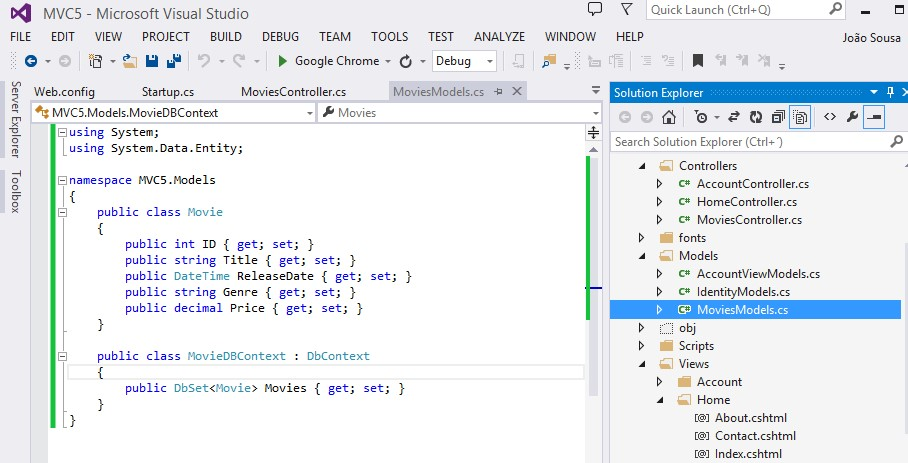
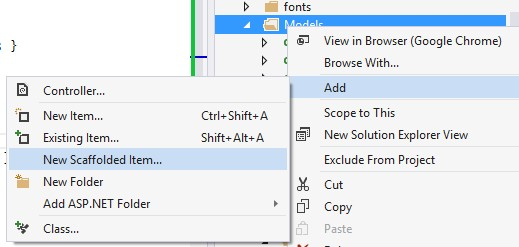
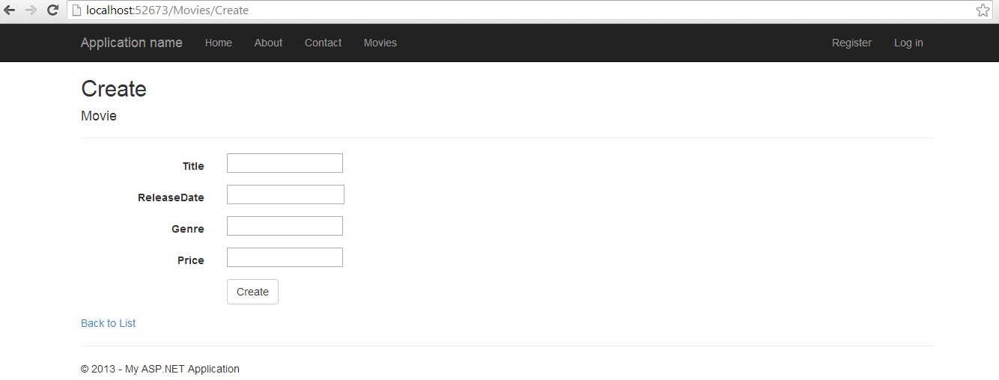
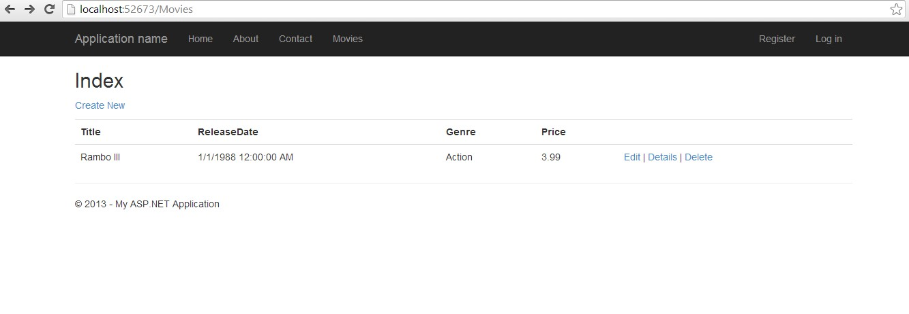

# ASP.NET MVC 5 – CRUD operations with Entity Framework 6 on Visual Studio 2013
## Requires
- Visual Studio 2013
## License
- Apache License, Version 2.0
## Technologies
- C#
- ASP.NET
- .NET
- ASP.NET MVC
- .NET Framework
- Entity Framework
- Visual Studio 2013
- .NET 4.5
- MVC Examples
- ASP.NET MVC 5
- MVC Scaffolding
## Topics
- Controls
- C#
- Data Binding
- Model View Controller (MVC)
- User Interface
- ASP.NET MVC
- Entity Framework
- ASP.NET MVC Basics
- MVC Samples
- MVC Example
- Asp.net MVC 4 Razor
## Updated
- 10/02/2014
## Description

&nbsp;

<table cellspacing="0" cellpadding="0" width="100%">
<tbody>
<tr>
<td>

<strong>MVC5 &ndash; Demo with Entity Framework 6 on Visual Studio 2013</strong>

&nbsp;

</td>
</tr>
</tbody>
</table>

Using MVC, Entity Framework, and ASP.NET Scaffolding, you can create a web application that provides an interface to an existing database table. This demo shows you how to automatically generate code that enables users to display, edit, create, and delete
 data that resides on the database. The generated code corresponds to the columns in the database table.

This demo focuses on using ASP.NET Scaffolding to generate the controllers and views.

&nbsp;

STEP1 - &nbsp;Create new project on Visual Studio 2013

Open Visual Studio

Create new ASP.NET Web Application Project

Give a name to the project (in this case I call him MVC5)

&nbsp;

&nbsp;

<h1>STEP2 - &nbsp;Create class Movies</h1>

Add new class to the project (this class represents a table, and the properties the colums of that table)

Give a name to that class (in my sample I call him MoviesModel)

On the class create the following code:

&nbsp;

&nbsp;

&nbsp;

C#

Edit|Remove

csharp
<pre class="hidden">public class Movie
{
    public int ID { get; set; }
    public string Title { get; set; }
    public DateTime ReleaseDate { get; set; }
    public string Genre { get; set; }
    public decimal Price { get; set; }
}

public class MovieDBContext : DbContext
{
    public DbSet&lt;Movie&gt; Movies { get; set; }
}
</pre>

<pre class="csharp">public&nbsp;class&nbsp;Movie&nbsp;
{&nbsp;
&nbsp;&nbsp;&nbsp;&nbsp;public&nbsp;int&nbsp;ID&nbsp;{&nbsp;get;&nbsp;set;&nbsp;}&nbsp;
&nbsp;&nbsp;&nbsp;&nbsp;public&nbsp;string&nbsp;Title&nbsp;{&nbsp;get;&nbsp;set;&nbsp;}&nbsp;
&nbsp;&nbsp;&nbsp;&nbsp;public&nbsp;DateTime&nbsp;ReleaseDate&nbsp;{&nbsp;get;&nbsp;set;&nbsp;}&nbsp;
&nbsp;&nbsp;&nbsp;&nbsp;public&nbsp;string&nbsp;Genre&nbsp;{&nbsp;get;&nbsp;set;&nbsp;}&nbsp;
&nbsp;&nbsp;&nbsp;&nbsp;public&nbsp;decimal&nbsp;Price&nbsp;{&nbsp;get;&nbsp;set;&nbsp;}&nbsp;
}&nbsp;
&nbsp;
public&nbsp;class&nbsp;MovieDBContext&nbsp;:&nbsp;DbContext&nbsp;
{&nbsp;
&nbsp;&nbsp;&nbsp;&nbsp;public&nbsp;DbSet&lt;Movie&gt;&nbsp;Movies&nbsp;{&nbsp;get;&nbsp;set;&nbsp;}&nbsp;
}&nbsp;
</pre>

&nbsp;Put the class inside the Models folders, just to organize your code.

&nbsp;

&nbsp;

<h1>STEP3 - &nbsp;Create controller with views using Entity Framework</h1>

Add new Scaffolded to the project (new item existent on MVC5)

&nbsp;

&nbsp;

&nbsp;

&nbsp;Choose option MVC5 Controller with views using Entity Framework

&nbsp;

Click Add

If you receive an error, it may be because you did not build the project in the previous section. If so, try building the project, and then add the scaffolded item again.

After the code generation process is complete, you will see a new controller and views in your project.

&nbsp;

&nbsp;

<h1>STEP4 - Controller and Views Generation</h1>
<h1>a. The Controller was automatically created with CRUD operations</h1>

&nbsp;

C#

Edit|Remove

csharp
<pre class="hidden">using System;
using System.Collections.Generic;
using System.Data;
using System.Data.Entity;
using System.Linq;
using System.Net;
using System.Web;
using System.Web.Mvc;
using MVC5.Models;

namespace MVC5
{
    public class MoviesController : Controller
    {
        private MovieDBContext db = new MovieDBContext();

        // GET: /Movies/
        public ActionResult Index()
        {
            return View(db.Movies.ToList());
        }

        // GET: /Movies/Details/5
        public ActionResult Details(int? id)
        {
            if (id == null)
            {
                return new HttpStatusCodeResult(HttpStatusCode.BadRequest);
            }
            Movie movie = db.Movies.Find(id);
            if (movie == null)
            {
                return HttpNotFound();
            }
            return View(movie);
        }

        // GET: /Movies/Create
        public ActionResult Create()
        {
            return View();
        }

        // POST: /Movies/Create
        // To protect from overposting attacks, please enable the specific properties you want to bind to, for 
        // more details see http://go.microsoft.com/fwlink/?LinkId=317598.
        [HttpPost]
        [ValidateAntiForgeryToken]
        public ActionResult Create([Bind(Include=&quot;ID,Title,ReleaseDate,Genre,Price&quot;)] Movie movie)
        {
            if (ModelState.IsValid)
            {
                db.Movies.Add(movie);
                db.SaveChanges();
                return RedirectToAction(&quot;Index&quot;);
            }

            return View(movie);
        }

        // GET: /Movies/Edit/5
        public ActionResult Edit(int? id)
        {
            if (id == null)
            {
                return new HttpStatusCodeResult(HttpStatusCode.BadRequest);
            }
            Movie movie = db.Movies.Find(id);
            if (movie == null)
            {
                return HttpNotFound();
            }
            return View(movie);
        }

        // POST: /Movies/Edit/5
        // To protect from overposting attacks, please enable the specific properties you want to bind to, for 
        // more details see http://go.microsoft.com/fwlink/?LinkId=317598.
        [HttpPost]
        [ValidateAntiForgeryToken]
        public ActionResult Edit([Bind(Include=&quot;ID,Title,ReleaseDate,Genre,Price&quot;)] Movie movie)
        {
            if (ModelState.IsValid)
            {
                db.Entry(movie).State = EntityState.Modified;
                db.SaveChanges();
                return RedirectToAction(&quot;Index&quot;);
            }
            return View(movie);
        }

        // GET: /Movies/Delete/5
        public ActionResult Delete(int? id)
        {
            if (id == null)
            {
                return new HttpStatusCodeResult(HttpStatusCode.BadRequest);
            }
            Movie movie = db.Movies.Find(id);
            if (movie == null)
            {
                return HttpNotFound();
            }
            return View(movie);
        }

        // POST: /Movies/Delete/5
        [HttpPost, ActionName(&quot;Delete&quot;)]
        [ValidateAntiForgeryToken]
        public ActionResult DeleteConfirmed(int id)
        {
            Movie movie = db.Movies.Find(id);
            db.Movies.Remove(movie);
            db.SaveChanges();
            return RedirectToAction(&quot;Index&quot;);
        }

        protected override void Dispose(bool disposing)
        {
            if (disposing)
            {
                db.Dispose();
            }
            base.Dispose(disposing);
        }
    }
}
</pre>

<pre class="csharp">using&nbsp;System;&nbsp;
using&nbsp;System.Collections.Generic;&nbsp;
using&nbsp;System.Data;&nbsp;
using&nbsp;System.Data.Entity;&nbsp;
using&nbsp;System.Linq;&nbsp;
using&nbsp;System.Net;&nbsp;
using&nbsp;System.Web;&nbsp;
using&nbsp;System.Web.Mvc;&nbsp;
using&nbsp;MVC5.Models;&nbsp;
&nbsp;
namespace&nbsp;MVC5&nbsp;
{&nbsp;
&nbsp;&nbsp;&nbsp;&nbsp;public&nbsp;class&nbsp;MoviesController&nbsp;:&nbsp;Controller&nbsp;
&nbsp;&nbsp;&nbsp;&nbsp;{&nbsp;
&nbsp;&nbsp;&nbsp;&nbsp;&nbsp;&nbsp;&nbsp;&nbsp;private&nbsp;MovieDBContext&nbsp;db&nbsp;=&nbsp;new&nbsp;MovieDBContext();&nbsp;
&nbsp;
&nbsp;&nbsp;&nbsp;&nbsp;&nbsp;&nbsp;&nbsp;&nbsp;//&nbsp;GET:&nbsp;/Movies/&nbsp;
&nbsp;&nbsp;&nbsp;&nbsp;&nbsp;&nbsp;&nbsp;&nbsp;public&nbsp;ActionResult&nbsp;Index()&nbsp;
&nbsp;&nbsp;&nbsp;&nbsp;&nbsp;&nbsp;&nbsp;&nbsp;{&nbsp;
&nbsp;&nbsp;&nbsp;&nbsp;&nbsp;&nbsp;&nbsp;&nbsp;&nbsp;&nbsp;&nbsp;&nbsp;return&nbsp;View(db.Movies.ToList());&nbsp;
&nbsp;&nbsp;&nbsp;&nbsp;&nbsp;&nbsp;&nbsp;&nbsp;}&nbsp;
&nbsp;
&nbsp;&nbsp;&nbsp;&nbsp;&nbsp;&nbsp;&nbsp;&nbsp;//&nbsp;GET:&nbsp;/Movies/Details/5&nbsp;
&nbsp;&nbsp;&nbsp;&nbsp;&nbsp;&nbsp;&nbsp;&nbsp;public&nbsp;ActionResult&nbsp;Details(int?&nbsp;id)&nbsp;
&nbsp;&nbsp;&nbsp;&nbsp;&nbsp;&nbsp;&nbsp;&nbsp;{&nbsp;
&nbsp;&nbsp;&nbsp;&nbsp;&nbsp;&nbsp;&nbsp;&nbsp;&nbsp;&nbsp;&nbsp;&nbsp;if&nbsp;(id&nbsp;==&nbsp;null)&nbsp;
&nbsp;&nbsp;&nbsp;&nbsp;&nbsp;&nbsp;&nbsp;&nbsp;&nbsp;&nbsp;&nbsp;&nbsp;{&nbsp;
&nbsp;&nbsp;&nbsp;&nbsp;&nbsp;&nbsp;&nbsp;&nbsp;&nbsp;&nbsp;&nbsp;&nbsp;&nbsp;&nbsp;&nbsp;&nbsp;return&nbsp;new&nbsp;HttpStatusCodeResult(HttpStatusCode.BadRequest);&nbsp;
&nbsp;&nbsp;&nbsp;&nbsp;&nbsp;&nbsp;&nbsp;&nbsp;&nbsp;&nbsp;&nbsp;&nbsp;}&nbsp;
&nbsp;&nbsp;&nbsp;&nbsp;&nbsp;&nbsp;&nbsp;&nbsp;&nbsp;&nbsp;&nbsp;&nbsp;Movie&nbsp;movie&nbsp;=&nbsp;db.Movies.Find(id);&nbsp;
&nbsp;&nbsp;&nbsp;&nbsp;&nbsp;&nbsp;&nbsp;&nbsp;&nbsp;&nbsp;&nbsp;&nbsp;if&nbsp;(movie&nbsp;==&nbsp;null)&nbsp;
&nbsp;&nbsp;&nbsp;&nbsp;&nbsp;&nbsp;&nbsp;&nbsp;&nbsp;&nbsp;&nbsp;&nbsp;{&nbsp;
&nbsp;&nbsp;&nbsp;&nbsp;&nbsp;&nbsp;&nbsp;&nbsp;&nbsp;&nbsp;&nbsp;&nbsp;&nbsp;&nbsp;&nbsp;&nbsp;return&nbsp;HttpNotFound();&nbsp;
&nbsp;&nbsp;&nbsp;&nbsp;&nbsp;&nbsp;&nbsp;&nbsp;&nbsp;&nbsp;&nbsp;&nbsp;}&nbsp;
&nbsp;&nbsp;&nbsp;&nbsp;&nbsp;&nbsp;&nbsp;&nbsp;&nbsp;&nbsp;&nbsp;&nbsp;return&nbsp;View(movie);&nbsp;
&nbsp;&nbsp;&nbsp;&nbsp;&nbsp;&nbsp;&nbsp;&nbsp;}&nbsp;
&nbsp;
&nbsp;&nbsp;&nbsp;&nbsp;&nbsp;&nbsp;&nbsp;&nbsp;//&nbsp;GET:&nbsp;/Movies/Create&nbsp;
&nbsp;&nbsp;&nbsp;&nbsp;&nbsp;&nbsp;&nbsp;&nbsp;public&nbsp;ActionResult&nbsp;Create()&nbsp;
&nbsp;&nbsp;&nbsp;&nbsp;&nbsp;&nbsp;&nbsp;&nbsp;{&nbsp;
&nbsp;&nbsp;&nbsp;&nbsp;&nbsp;&nbsp;&nbsp;&nbsp;&nbsp;&nbsp;&nbsp;&nbsp;return&nbsp;View();&nbsp;
&nbsp;&nbsp;&nbsp;&nbsp;&nbsp;&nbsp;&nbsp;&nbsp;}&nbsp;
&nbsp;
&nbsp;&nbsp;&nbsp;&nbsp;&nbsp;&nbsp;&nbsp;&nbsp;//&nbsp;POST:&nbsp;/Movies/Create&nbsp;
&nbsp;&nbsp;&nbsp;&nbsp;&nbsp;&nbsp;&nbsp;&nbsp;//&nbsp;To&nbsp;protect&nbsp;from&nbsp;overposting&nbsp;attacks,&nbsp;please&nbsp;enable&nbsp;the&nbsp;specific&nbsp;properties&nbsp;you&nbsp;want&nbsp;to&nbsp;bind&nbsp;to,&nbsp;for&nbsp;&nbsp;
&nbsp;&nbsp;&nbsp;&nbsp;&nbsp;&nbsp;&nbsp;&nbsp;//&nbsp;more&nbsp;details&nbsp;see&nbsp;http://go.microsoft.com/fwlink/?LinkId=317598.&nbsp;
&nbsp;&nbsp;&nbsp;&nbsp;&nbsp;&nbsp;&nbsp;&nbsp;[HttpPost]&nbsp;
&nbsp;&nbsp;&nbsp;&nbsp;&nbsp;&nbsp;&nbsp;&nbsp;[ValidateAntiForgeryToken]&nbsp;
&nbsp;&nbsp;&nbsp;&nbsp;&nbsp;&nbsp;&nbsp;&nbsp;public&nbsp;ActionResult&nbsp;Create([Bind(Include=&quot;ID,Title,ReleaseDate,Genre,Price&quot;)]&nbsp;Movie&nbsp;movie)&nbsp;
&nbsp;&nbsp;&nbsp;&nbsp;&nbsp;&nbsp;&nbsp;&nbsp;{&nbsp;
&nbsp;&nbsp;&nbsp;&nbsp;&nbsp;&nbsp;&nbsp;&nbsp;&nbsp;&nbsp;&nbsp;&nbsp;if&nbsp;(ModelState.IsValid)&nbsp;
&nbsp;&nbsp;&nbsp;&nbsp;&nbsp;&nbsp;&nbsp;&nbsp;&nbsp;&nbsp;&nbsp;&nbsp;{&nbsp;
&nbsp;&nbsp;&nbsp;&nbsp;&nbsp;&nbsp;&nbsp;&nbsp;&nbsp;&nbsp;&nbsp;&nbsp;&nbsp;&nbsp;&nbsp;&nbsp;db.Movies.Add(movie);&nbsp;
&nbsp;&nbsp;&nbsp;&nbsp;&nbsp;&nbsp;&nbsp;&nbsp;&nbsp;&nbsp;&nbsp;&nbsp;&nbsp;&nbsp;&nbsp;&nbsp;db.SaveChanges();&nbsp;
&nbsp;&nbsp;&nbsp;&nbsp;&nbsp;&nbsp;&nbsp;&nbsp;&nbsp;&nbsp;&nbsp;&nbsp;&nbsp;&nbsp;&nbsp;&nbsp;return&nbsp;RedirectToAction(&quot;Index&quot;);&nbsp;
&nbsp;&nbsp;&nbsp;&nbsp;&nbsp;&nbsp;&nbsp;&nbsp;&nbsp;&nbsp;&nbsp;&nbsp;}&nbsp;
&nbsp;
&nbsp;&nbsp;&nbsp;&nbsp;&nbsp;&nbsp;&nbsp;&nbsp;&nbsp;&nbsp;&nbsp;&nbsp;return&nbsp;View(movie);&nbsp;
&nbsp;&nbsp;&nbsp;&nbsp;&nbsp;&nbsp;&nbsp;&nbsp;}&nbsp;
&nbsp;
&nbsp;&nbsp;&nbsp;&nbsp;&nbsp;&nbsp;&nbsp;&nbsp;//&nbsp;GET:&nbsp;/Movies/Edit/5&nbsp;
&nbsp;&nbsp;&nbsp;&nbsp;&nbsp;&nbsp;&nbsp;&nbsp;public&nbsp;ActionResult&nbsp;Edit(int?&nbsp;id)&nbsp;
&nbsp;&nbsp;&nbsp;&nbsp;&nbsp;&nbsp;&nbsp;&nbsp;{&nbsp;
&nbsp;&nbsp;&nbsp;&nbsp;&nbsp;&nbsp;&nbsp;&nbsp;&nbsp;&nbsp;&nbsp;&nbsp;if&nbsp;(id&nbsp;==&nbsp;null)&nbsp;
&nbsp;&nbsp;&nbsp;&nbsp;&nbsp;&nbsp;&nbsp;&nbsp;&nbsp;&nbsp;&nbsp;&nbsp;{&nbsp;
&nbsp;&nbsp;&nbsp;&nbsp;&nbsp;&nbsp;&nbsp;&nbsp;&nbsp;&nbsp;&nbsp;&nbsp;&nbsp;&nbsp;&nbsp;&nbsp;return&nbsp;new&nbsp;HttpStatusCodeResult(HttpStatusCode.BadRequest);&nbsp;
&nbsp;&nbsp;&nbsp;&nbsp;&nbsp;&nbsp;&nbsp;&nbsp;&nbsp;&nbsp;&nbsp;&nbsp;}&nbsp;
&nbsp;&nbsp;&nbsp;&nbsp;&nbsp;&nbsp;&nbsp;&nbsp;&nbsp;&nbsp;&nbsp;&nbsp;Movie&nbsp;movie&nbsp;=&nbsp;db.Movies.Find(id);&nbsp;
&nbsp;&nbsp;&nbsp;&nbsp;&nbsp;&nbsp;&nbsp;&nbsp;&nbsp;&nbsp;&nbsp;&nbsp;if&nbsp;(movie&nbsp;==&nbsp;null)&nbsp;
&nbsp;&nbsp;&nbsp;&nbsp;&nbsp;&nbsp;&nbsp;&nbsp;&nbsp;&nbsp;&nbsp;&nbsp;{&nbsp;
&nbsp;&nbsp;&nbsp;&nbsp;&nbsp;&nbsp;&nbsp;&nbsp;&nbsp;&nbsp;&nbsp;&nbsp;&nbsp;&nbsp;&nbsp;&nbsp;return&nbsp;HttpNotFound();&nbsp;
&nbsp;&nbsp;&nbsp;&nbsp;&nbsp;&nbsp;&nbsp;&nbsp;&nbsp;&nbsp;&nbsp;&nbsp;}&nbsp;
&nbsp;&nbsp;&nbsp;&nbsp;&nbsp;&nbsp;&nbsp;&nbsp;&nbsp;&nbsp;&nbsp;&nbsp;return&nbsp;View(movie);&nbsp;
&nbsp;&nbsp;&nbsp;&nbsp;&nbsp;&nbsp;&nbsp;&nbsp;}&nbsp;
&nbsp;
&nbsp;&nbsp;&nbsp;&nbsp;&nbsp;&nbsp;&nbsp;&nbsp;//&nbsp;POST:&nbsp;/Movies/Edit/5&nbsp;
&nbsp;&nbsp;&nbsp;&nbsp;&nbsp;&nbsp;&nbsp;&nbsp;//&nbsp;To&nbsp;protect&nbsp;from&nbsp;overposting&nbsp;attacks,&nbsp;please&nbsp;enable&nbsp;the&nbsp;specific&nbsp;properties&nbsp;you&nbsp;want&nbsp;to&nbsp;bind&nbsp;to,&nbsp;for&nbsp;&nbsp;
&nbsp;&nbsp;&nbsp;&nbsp;&nbsp;&nbsp;&nbsp;&nbsp;//&nbsp;more&nbsp;details&nbsp;see&nbsp;http://go.microsoft.com/fwlink/?LinkId=317598.&nbsp;
&nbsp;&nbsp;&nbsp;&nbsp;&nbsp;&nbsp;&nbsp;&nbsp;[HttpPost]&nbsp;
&nbsp;&nbsp;&nbsp;&nbsp;&nbsp;&nbsp;&nbsp;&nbsp;[ValidateAntiForgeryToken]&nbsp;
&nbsp;&nbsp;&nbsp;&nbsp;&nbsp;&nbsp;&nbsp;&nbsp;public&nbsp;ActionResult&nbsp;Edit([Bind(Include=&quot;ID,Title,ReleaseDate,Genre,Price&quot;)]&nbsp;Movie&nbsp;movie)&nbsp;
&nbsp;&nbsp;&nbsp;&nbsp;&nbsp;&nbsp;&nbsp;&nbsp;{&nbsp;
&nbsp;&nbsp;&nbsp;&nbsp;&nbsp;&nbsp;&nbsp;&nbsp;&nbsp;&nbsp;&nbsp;&nbsp;if&nbsp;(ModelState.IsValid)&nbsp;
&nbsp;&nbsp;&nbsp;&nbsp;&nbsp;&nbsp;&nbsp;&nbsp;&nbsp;&nbsp;&nbsp;&nbsp;{&nbsp;
&nbsp;&nbsp;&nbsp;&nbsp;&nbsp;&nbsp;&nbsp;&nbsp;&nbsp;&nbsp;&nbsp;&nbsp;&nbsp;&nbsp;&nbsp;&nbsp;db.Entry(movie).State&nbsp;=&nbsp;EntityState.Modified;&nbsp;
&nbsp;&nbsp;&nbsp;&nbsp;&nbsp;&nbsp;&nbsp;&nbsp;&nbsp;&nbsp;&nbsp;&nbsp;&nbsp;&nbsp;&nbsp;&nbsp;db.SaveChanges();&nbsp;
&nbsp;&nbsp;&nbsp;&nbsp;&nbsp;&nbsp;&nbsp;&nbsp;&nbsp;&nbsp;&nbsp;&nbsp;&nbsp;&nbsp;&nbsp;&nbsp;return&nbsp;RedirectToAction(&quot;Index&quot;);&nbsp;
&nbsp;&nbsp;&nbsp;&nbsp;&nbsp;&nbsp;&nbsp;&nbsp;&nbsp;&nbsp;&nbsp;&nbsp;}&nbsp;
&nbsp;&nbsp;&nbsp;&nbsp;&nbsp;&nbsp;&nbsp;&nbsp;&nbsp;&nbsp;&nbsp;&nbsp;return&nbsp;View(movie);&nbsp;
&nbsp;&nbsp;&nbsp;&nbsp;&nbsp;&nbsp;&nbsp;&nbsp;}&nbsp;
&nbsp;
&nbsp;&nbsp;&nbsp;&nbsp;&nbsp;&nbsp;&nbsp;&nbsp;//&nbsp;GET:&nbsp;/Movies/Delete/5&nbsp;
&nbsp;&nbsp;&nbsp;&nbsp;&nbsp;&nbsp;&nbsp;&nbsp;public&nbsp;ActionResult&nbsp;Delete(int?&nbsp;id)&nbsp;
&nbsp;&nbsp;&nbsp;&nbsp;&nbsp;&nbsp;&nbsp;&nbsp;{&nbsp;
&nbsp;&nbsp;&nbsp;&nbsp;&nbsp;&nbsp;&nbsp;&nbsp;&nbsp;&nbsp;&nbsp;&nbsp;if&nbsp;(id&nbsp;==&nbsp;null)&nbsp;
&nbsp;&nbsp;&nbsp;&nbsp;&nbsp;&nbsp;&nbsp;&nbsp;&nbsp;&nbsp;&nbsp;&nbsp;{&nbsp;
&nbsp;&nbsp;&nbsp;&nbsp;&nbsp;&nbsp;&nbsp;&nbsp;&nbsp;&nbsp;&nbsp;&nbsp;&nbsp;&nbsp;&nbsp;&nbsp;return&nbsp;new&nbsp;HttpStatusCodeResult(HttpStatusCode.BadRequest);&nbsp;
&nbsp;&nbsp;&nbsp;&nbsp;&nbsp;&nbsp;&nbsp;&nbsp;&nbsp;&nbsp;&nbsp;&nbsp;}&nbsp;
&nbsp;&nbsp;&nbsp;&nbsp;&nbsp;&nbsp;&nbsp;&nbsp;&nbsp;&nbsp;&nbsp;&nbsp;Movie&nbsp;movie&nbsp;=&nbsp;db.Movies.Find(id);&nbsp;
&nbsp;&nbsp;&nbsp;&nbsp;&nbsp;&nbsp;&nbsp;&nbsp;&nbsp;&nbsp;&nbsp;&nbsp;if&nbsp;(movie&nbsp;==&nbsp;null)&nbsp;
&nbsp;&nbsp;&nbsp;&nbsp;&nbsp;&nbsp;&nbsp;&nbsp;&nbsp;&nbsp;&nbsp;&nbsp;{&nbsp;
&nbsp;&nbsp;&nbsp;&nbsp;&nbsp;&nbsp;&nbsp;&nbsp;&nbsp;&nbsp;&nbsp;&nbsp;&nbsp;&nbsp;&nbsp;&nbsp;return&nbsp;HttpNotFound();&nbsp;
&nbsp;&nbsp;&nbsp;&nbsp;&nbsp;&nbsp;&nbsp;&nbsp;&nbsp;&nbsp;&nbsp;&nbsp;}&nbsp;
&nbsp;&nbsp;&nbsp;&nbsp;&nbsp;&nbsp;&nbsp;&nbsp;&nbsp;&nbsp;&nbsp;&nbsp;return&nbsp;View(movie);&nbsp;
&nbsp;&nbsp;&nbsp;&nbsp;&nbsp;&nbsp;&nbsp;&nbsp;}&nbsp;
&nbsp;
&nbsp;&nbsp;&nbsp;&nbsp;&nbsp;&nbsp;&nbsp;&nbsp;//&nbsp;POST:&nbsp;/Movies/Delete/5&nbsp;
&nbsp;&nbsp;&nbsp;&nbsp;&nbsp;&nbsp;&nbsp;&nbsp;[HttpPost,&nbsp;ActionName(&quot;Delete&quot;)]&nbsp;
&nbsp;&nbsp;&nbsp;&nbsp;&nbsp;&nbsp;&nbsp;&nbsp;[ValidateAntiForgeryToken]&nbsp;
&nbsp;&nbsp;&nbsp;&nbsp;&nbsp;&nbsp;&nbsp;&nbsp;public&nbsp;ActionResult&nbsp;DeleteConfirmed(int&nbsp;id)&nbsp;
&nbsp;&nbsp;&nbsp;&nbsp;&nbsp;&nbsp;&nbsp;&nbsp;{&nbsp;
&nbsp;&nbsp;&nbsp;&nbsp;&nbsp;&nbsp;&nbsp;&nbsp;&nbsp;&nbsp;&nbsp;&nbsp;Movie&nbsp;movie&nbsp;=&nbsp;db.Movies.Find(id);&nbsp;
&nbsp;&nbsp;&nbsp;&nbsp;&nbsp;&nbsp;&nbsp;&nbsp;&nbsp;&nbsp;&nbsp;&nbsp;db.Movies.Remove(movie);&nbsp;
&nbsp;&nbsp;&nbsp;&nbsp;&nbsp;&nbsp;&nbsp;&nbsp;&nbsp;&nbsp;&nbsp;&nbsp;db.SaveChanges();&nbsp;
&nbsp;&nbsp;&nbsp;&nbsp;&nbsp;&nbsp;&nbsp;&nbsp;&nbsp;&nbsp;&nbsp;&nbsp;return&nbsp;RedirectToAction(&quot;Index&quot;);&nbsp;
&nbsp;&nbsp;&nbsp;&nbsp;&nbsp;&nbsp;&nbsp;&nbsp;}&nbsp;
&nbsp;
&nbsp;&nbsp;&nbsp;&nbsp;&nbsp;&nbsp;&nbsp;&nbsp;protected&nbsp;override&nbsp;void&nbsp;Dispose(bool&nbsp;disposing)&nbsp;
&nbsp;&nbsp;&nbsp;&nbsp;&nbsp;&nbsp;&nbsp;&nbsp;{&nbsp;
&nbsp;&nbsp;&nbsp;&nbsp;&nbsp;&nbsp;&nbsp;&nbsp;&nbsp;&nbsp;&nbsp;&nbsp;if&nbsp;(disposing)&nbsp;
&nbsp;&nbsp;&nbsp;&nbsp;&nbsp;&nbsp;&nbsp;&nbsp;&nbsp;&nbsp;&nbsp;&nbsp;{&nbsp;
&nbsp;&nbsp;&nbsp;&nbsp;&nbsp;&nbsp;&nbsp;&nbsp;&nbsp;&nbsp;&nbsp;&nbsp;&nbsp;&nbsp;&nbsp;&nbsp;db.Dispose();&nbsp;
&nbsp;&nbsp;&nbsp;&nbsp;&nbsp;&nbsp;&nbsp;&nbsp;&nbsp;&nbsp;&nbsp;&nbsp;}&nbsp;
&nbsp;&nbsp;&nbsp;&nbsp;&nbsp;&nbsp;&nbsp;&nbsp;&nbsp;&nbsp;&nbsp;&nbsp;base.Dispose(disposing);&nbsp;
&nbsp;&nbsp;&nbsp;&nbsp;&nbsp;&nbsp;&nbsp;&nbsp;}&nbsp;
&nbsp;&nbsp;&nbsp;&nbsp;}&nbsp;
}&nbsp;
</pre>

<h1>b. The Views were automatically created</h1>

&nbsp;

&nbsp;

Run the application

&nbsp;

<h1>MVC5 Resources</h1>

Some good online resources about MVC5:

ASP.NET MVC5 : The official Microsoft .NET WebSite 
<a href="http://www.asp.net/mvc/tutorials/mvc-5">http://www.asp.net/mvc/tutorials/mvc-5</a>

&nbsp;

For more examples, follow my blog at

<a href="http://joaoeduardosousa.wordpress.com/">http://joaoeduardosousa.wordpress.com/</a>

&nbsp;

<h1><strong>Check my other source code:</strong></h1>

<a href="http://code.msdn.microsoft.com/MVC4-ENTITY-FRAMEWORK-10-e15ef983" target="_blank">http://code.msdn.microsoft.com/MVC4-ENTITY-FRAMEWORK-10-e15ef983</a>

<a href="http://code.msdn.microsoft.com/ASPNET-MVC-5-Bootstrap-30-622be454" target="_blank">http://code.msdn.microsoft.com/ASPNET-MVC-5-Bootstrap-30-622be454</a>

<a href="http://code.msdn.microsoft.com/MVC5-Authentication-App-b5200efd" target="_blank">http://code.msdn.microsoft.com/MVC5-Authentication-App-b5200efd</a>

<a href="http://code.msdn.microsoft.com/ASPNET-WebAPI-2-Stream-7d96cb70" target="_blank">http://code.msdn.microsoft.com/ASPNET-WebAPI-2-Stream-7d96cb70</a>

<a href="http://code.msdn.microsoft.com/ASPNET-WebAPI-Basic-Redis-ade42ca7" target="_blank">http://code.msdn.microsoft.com/ASPNET-WebAPI-Basic-Redis-ade42ca7</a>

<a href="http://code.msdn.microsoft.com/ASPNET-WebApi-Use-Redis-as-a0d942a3" target="_blank">http://code.msdn.microsoft.com/ASPNET-WebApi-Use-Redis-as-a0d942a3</a>

<a href="http://code.msdn.microsoft.com/ASPNET-MVC-connect-with-1f40770f" target="_blank">http://code.msdn.microsoft.com/ASPNET-MVC-connect-with-1f40770f</a>

<a href="http://code.msdn.microsoft.com/ASPNET-WebAPI-Enable-Cors-666b88eb" target="_blank">http://code.msdn.microsoft.com/ASPNET-WebAPI-Enable-Cors-666b88eb</a>

<a href="http://code.msdn.microsoft.com/ASPNET-WebAPI-Entity-2f8797a1" target="_blank">http://code.msdn.microsoft.com/ASPNET-WebAPI-Entity-2f8797a1</a>

