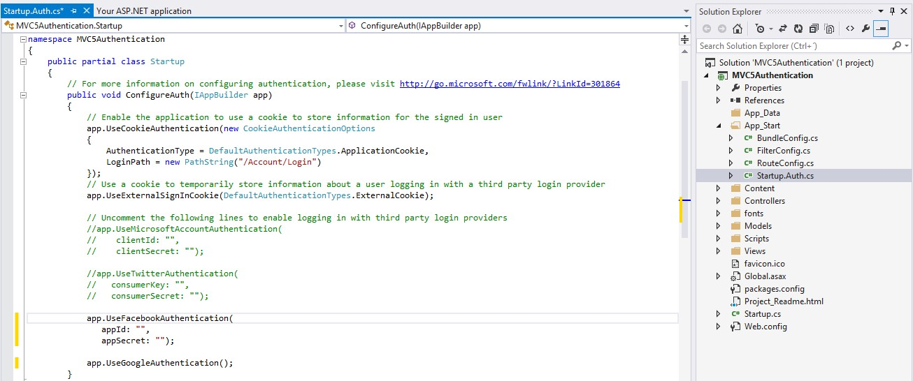
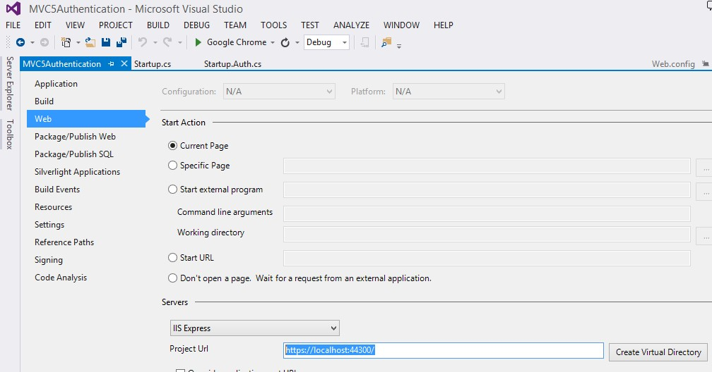
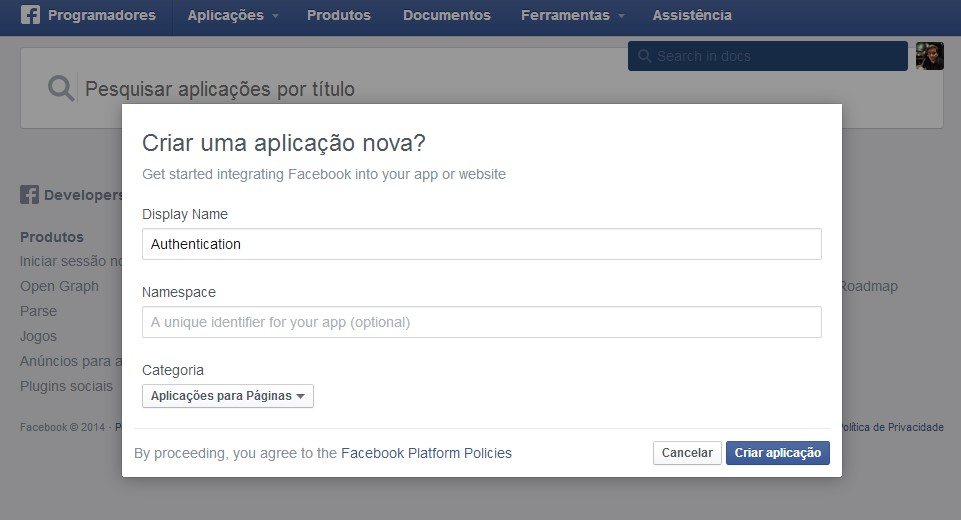
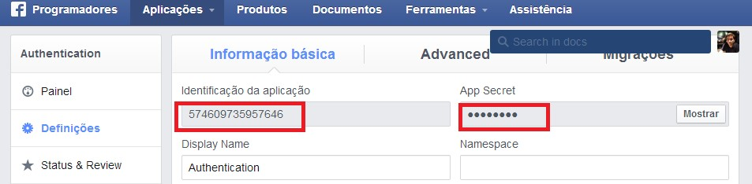
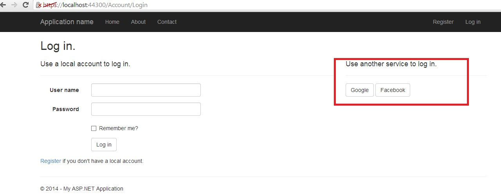

# ASP.NET MVC 5 – Demo Authentication App with Facebook and Google
## Requires
- Visual Studio 2013
## License
- Apache License, Version 2.0
## Technologies
- C#
- ASP.NET
- ASP.NET MVC
- .NET Framework
- .NET Framework 4.0
- ASP.NET MVC 4
- MVC
- MVC Examples
- ASP.NET MVC 5
- MVC5
## Topics
- Controls
- C#
- Data Binding
- User Interface
- Data Access
- ASP.NET MVC
- ASP.NET MVC Basics
- MVC Example
## Updated
- 02/01/2014
## Description

MVC5 came with some really nice stuff. In this post I&rsquo;ll dig into the authentication with external logins as Microsoft calls them.&nbsp;With this demo, I will demonstrate how it&rsquo;s possible to configure application,
 to allow authentication using Google and Facebook.&nbsp;

&nbsp;

<h1>STEP1. Create new project on Visual Studio 2013</h1>

Open Visual Studio

Create new ASP.NET Web Application Project

Give a name to the project (in this case I call him MVC5Authentication)

&nbsp;

<h1>STEP2. Select option Change Authentication</h1>

Select MVC template

Select option Change Authentication

&nbsp;

&nbsp;

This option open a new window, were we need to check the option &ldquo;Individual User Account&rdquo;

&nbsp;

Start application.

As we see on the next image on the right part where it&rsquo;s possible to have other authentication services it&rsquo;s empty.

On the next step, we will configure the application, to provide two new authentication services (Google and Facebook)

&nbsp;

&nbsp;

<h1>STEP3. Enable Google and Facebook OpenID</h1>

Open&nbsp;App_Start\Startup.Auth.cs&nbsp;file and remove the comment&nbsp;characters in&nbsp;//app.UseGoogleAuthentication();&nbsp; to&nbsp;enable Google authentication and in app.UseFacebookAuthentication to enable Facebook authentication.

&nbsp;

&nbsp;

&nbsp;

C#

Edit|Remove

csharp
<pre class="hidden">public partial class Startup

    {

        // For more information on configuring authentication, please visit http://go.microsoft.com/fwlink/?LinkId=301864

        public void ConfigureAuth(IAppBuilder app)

        {

            // Enable the application to use a cookie to store information for the signed in user

            app.UseCookieAuthentication(new CookieAuthenticationOptions

            {

                AuthenticationType = DefaultAuthenticationTypes.ApplicationCookie,

                LoginPath = new PathString(&quot;/Account/Login&quot;)

            });

            // Use a cookie to temporarily store information about a user logging in with a third party login provider

            app.UseExternalSignInCookie(DefaultAuthenticationTypes.ExternalCookie);

 

            // Uncomment the following lines to enable logging in with third party login providers

            //app.UseMicrosoftAccountAuthentication(

            //    clientId: &quot;&quot;,

            //    clientSecret: &quot;&quot;);

 

            //app.UseTwitterAuthentication(

            //   consumerKey: &quot;&quot;,

            //   consumerSecret: &quot;&quot;);

 

            app.UseFacebookAuthentication(

               appId: &quot;&quot;,

               appSecret: &quot;&quot;);

 

            app.UseGoogleAuthentication();

        }

    }</pre>

<pre class="csharp">public&nbsp;partial&nbsp;class&nbsp;Startup&nbsp;
&nbsp;
&nbsp;&nbsp;&nbsp;&nbsp;{&nbsp;
&nbsp;
&nbsp;&nbsp;&nbsp;&nbsp;&nbsp;&nbsp;&nbsp;&nbsp;//&nbsp;For&nbsp;more&nbsp;information&nbsp;on&nbsp;configuring&nbsp;authentication,&nbsp;please&nbsp;visit&nbsp;http://go.microsoft.com/fwlink/?LinkId=301864&nbsp;
&nbsp;
&nbsp;&nbsp;&nbsp;&nbsp;&nbsp;&nbsp;&nbsp;&nbsp;public&nbsp;void&nbsp;ConfigureAuth(IAppBuilder&nbsp;app)&nbsp;
&nbsp;
&nbsp;&nbsp;&nbsp;&nbsp;&nbsp;&nbsp;&nbsp;&nbsp;{&nbsp;
&nbsp;
&nbsp;&nbsp;&nbsp;&nbsp;&nbsp;&nbsp;&nbsp;&nbsp;&nbsp;&nbsp;&nbsp;&nbsp;//&nbsp;Enable&nbsp;the&nbsp;application&nbsp;to&nbsp;use&nbsp;a&nbsp;cookie&nbsp;to&nbsp;store&nbsp;information&nbsp;for&nbsp;the&nbsp;signed&nbsp;in&nbsp;user&nbsp;
&nbsp;
&nbsp;&nbsp;&nbsp;&nbsp;&nbsp;&nbsp;&nbsp;&nbsp;&nbsp;&nbsp;&nbsp;&nbsp;app.UseCookieAuthentication(new&nbsp;CookieAuthenticationOptions&nbsp;
&nbsp;
&nbsp;&nbsp;&nbsp;&nbsp;&nbsp;&nbsp;&nbsp;&nbsp;&nbsp;&nbsp;&nbsp;&nbsp;{&nbsp;
&nbsp;
&nbsp;&nbsp;&nbsp;&nbsp;&nbsp;&nbsp;&nbsp;&nbsp;&nbsp;&nbsp;&nbsp;&nbsp;&nbsp;&nbsp;&nbsp;&nbsp;AuthenticationType&nbsp;=&nbsp;DefaultAuthenticationTypes.ApplicationCookie,&nbsp;
&nbsp;
&nbsp;&nbsp;&nbsp;&nbsp;&nbsp;&nbsp;&nbsp;&nbsp;&nbsp;&nbsp;&nbsp;&nbsp;&nbsp;&nbsp;&nbsp;&nbsp;LoginPath&nbsp;=&nbsp;new&nbsp;PathString(&quot;/Account/Login&quot;)&nbsp;
&nbsp;
&nbsp;&nbsp;&nbsp;&nbsp;&nbsp;&nbsp;&nbsp;&nbsp;&nbsp;&nbsp;&nbsp;&nbsp;});&nbsp;
&nbsp;
&nbsp;&nbsp;&nbsp;&nbsp;&nbsp;&nbsp;&nbsp;&nbsp;&nbsp;&nbsp;&nbsp;&nbsp;//&nbsp;Use&nbsp;a&nbsp;cookie&nbsp;to&nbsp;temporarily&nbsp;store&nbsp;information&nbsp;about&nbsp;a&nbsp;user&nbsp;logging&nbsp;in&nbsp;with&nbsp;a&nbsp;third&nbsp;party&nbsp;login&nbsp;provider&nbsp;
&nbsp;
&nbsp;&nbsp;&nbsp;&nbsp;&nbsp;&nbsp;&nbsp;&nbsp;&nbsp;&nbsp;&nbsp;&nbsp;app.UseExternalSignInCookie(DefaultAuthenticationTypes.ExternalCookie);&nbsp;
&nbsp;
&nbsp;&nbsp;
&nbsp;
&nbsp;&nbsp;&nbsp;&nbsp;&nbsp;&nbsp;&nbsp;&nbsp;&nbsp;&nbsp;&nbsp;&nbsp;//&nbsp;Uncomment&nbsp;the&nbsp;following&nbsp;lines&nbsp;to&nbsp;enable&nbsp;logging&nbsp;in&nbsp;with&nbsp;third&nbsp;party&nbsp;login&nbsp;providers&nbsp;
&nbsp;
&nbsp;&nbsp;&nbsp;&nbsp;&nbsp;&nbsp;&nbsp;&nbsp;&nbsp;&nbsp;&nbsp;&nbsp;//app.UseMicrosoftAccountAuthentication(&nbsp;
&nbsp;
&nbsp;&nbsp;&nbsp;&nbsp;&nbsp;&nbsp;&nbsp;&nbsp;&nbsp;&nbsp;&nbsp;&nbsp;//&nbsp;&nbsp;&nbsp;&nbsp;clientId:&nbsp;&quot;&quot;,&nbsp;
&nbsp;
&nbsp;&nbsp;&nbsp;&nbsp;&nbsp;&nbsp;&nbsp;&nbsp;&nbsp;&nbsp;&nbsp;&nbsp;//&nbsp;&nbsp;&nbsp;&nbsp;clientSecret:&nbsp;&quot;&quot;);&nbsp;
&nbsp;
&nbsp;&nbsp;
&nbsp;
&nbsp;&nbsp;&nbsp;&nbsp;&nbsp;&nbsp;&nbsp;&nbsp;&nbsp;&nbsp;&nbsp;&nbsp;//app.UseTwitterAuthentication(&nbsp;
&nbsp;
&nbsp;&nbsp;&nbsp;&nbsp;&nbsp;&nbsp;&nbsp;&nbsp;&nbsp;&nbsp;&nbsp;&nbsp;//&nbsp;&nbsp;&nbsp;consumerKey:&nbsp;&quot;&quot;,&nbsp;
&nbsp;
&nbsp;&nbsp;&nbsp;&nbsp;&nbsp;&nbsp;&nbsp;&nbsp;&nbsp;&nbsp;&nbsp;&nbsp;//&nbsp;&nbsp;&nbsp;consumerSecret:&nbsp;&quot;&quot;);&nbsp;
&nbsp;
&nbsp;&nbsp;
&nbsp;
&nbsp;&nbsp;&nbsp;&nbsp;&nbsp;&nbsp;&nbsp;&nbsp;&nbsp;&nbsp;&nbsp;&nbsp;app.UseFacebookAuthentication(&nbsp;
&nbsp;
&nbsp;&nbsp;&nbsp;&nbsp;&nbsp;&nbsp;&nbsp;&nbsp;&nbsp;&nbsp;&nbsp;&nbsp;&nbsp;&nbsp;&nbsp;appId:&nbsp;&quot;&quot;,&nbsp;
&nbsp;
&nbsp;&nbsp;&nbsp;&nbsp;&nbsp;&nbsp;&nbsp;&nbsp;&nbsp;&nbsp;&nbsp;&nbsp;&nbsp;&nbsp;&nbsp;appSecret:&nbsp;&quot;&quot;);&nbsp;
&nbsp;
&nbsp;&nbsp;
&nbsp;
&nbsp;&nbsp;&nbsp;&nbsp;&nbsp;&nbsp;&nbsp;&nbsp;&nbsp;&nbsp;&nbsp;&nbsp;app.UseGoogleAuthentication();&nbsp;
&nbsp;
&nbsp;&nbsp;&nbsp;&nbsp;&nbsp;&nbsp;&nbsp;&nbsp;}&nbsp;
&nbsp;
&nbsp;&nbsp;&nbsp;&nbsp;}</pre>

Start application again.

&nbsp;

On the start, the application, give us the following error.

This error, happens because is necessary to create and configure an App on Facebook, that provide us an appID and appSecret, which will be use on the UseFacebookAuthentocation method.

&nbsp;

&nbsp;

&nbsp;

<h1>STEP4. Setting up SSL</h1>

To connect to Facebook, you will need to set up IIS-Express to use SSL. Even&nbsp;though Google doesn't require you to use SSL to log in, it's a security best &nbsp;practice to require SSL in your application.&nbsp;

On the project solution Press F4.

Enable SSL (a new URL will be provided)

&nbsp;

&nbsp;

&nbsp;

Access to the properties of the solution and change the project URL, providing the URL given on the project properties SSL URL

&nbsp;

<h1>STEP5. Configure App Facebook</h1>

Open Facebook web page and create a new App

Set the Display Name and the Category

&nbsp;

&nbsp;

After create the app, we get access to appID and appSecret

&nbsp;

Set the SSL URL, on the valid OAuth URLs, to give access of our application to Facebook.

&nbsp;

&nbsp;

Set appID and appSecret into our code.

&nbsp;

C#

Edit|Remove

csharp
<pre class="hidden">// For more information on configuring authentication, please visit http://go.microsoft.com/fwlink/?LinkId=301864

        public void ConfigureAuth(IAppBuilder app)

        {

            // Enable the application to use a cookie to store information for the signed in user

            app.UseCookieAuthentication(new CookieAuthenticationOptions

            {

                AuthenticationType = DefaultAuthenticationTypes.ApplicationCookie,

                LoginPath = new PathString(&quot;/Account/Login&quot;)

            });

            // Use a cookie to temporarily store information about a user logging in with a third party login provider

            app.UseExternalSignInCookie(DefaultAuthenticationTypes.ExternalCookie);

 

            // Uncomment the following lines to enable logging in with third party login providers

            //app.UseMicrosoftAccountAuthentication(

            //    clientId: &quot;&quot;,

            //    clientSecret: &quot;&quot;);

 

            //app.UseTwitterAuthentication(

            //   consumerKey: &quot;&quot;,

            //   consumerSecret: &quot;&quot;);

 

            //change the id and secret toconnect to your application

            app.UseFacebookAuthentication(

               appId: &quot;574609735957646&quot;,

               appSecret: &quot;4339c983ffa2685c1b09d580e3380455&quot;);

 

            app.UseGoogleAuthentication();

        }</pre>

<pre class="csharp">//&nbsp;For&nbsp;more&nbsp;information&nbsp;on&nbsp;configuring&nbsp;authentication,&nbsp;please&nbsp;visit&nbsp;http://go.microsoft.com/fwlink/?LinkId=301864&nbsp;
&nbsp;
&nbsp;&nbsp;&nbsp;&nbsp;&nbsp;&nbsp;&nbsp;&nbsp;public&nbsp;void&nbsp;ConfigureAuth(IAppBuilder&nbsp;app)&nbsp;
&nbsp;
&nbsp;&nbsp;&nbsp;&nbsp;&nbsp;&nbsp;&nbsp;&nbsp;{&nbsp;
&nbsp;
&nbsp;&nbsp;&nbsp;&nbsp;&nbsp;&nbsp;&nbsp;&nbsp;&nbsp;&nbsp;&nbsp;&nbsp;//&nbsp;Enable&nbsp;the&nbsp;application&nbsp;to&nbsp;use&nbsp;a&nbsp;cookie&nbsp;to&nbsp;store&nbsp;information&nbsp;for&nbsp;the&nbsp;signed&nbsp;in&nbsp;user&nbsp;
&nbsp;
&nbsp;&nbsp;&nbsp;&nbsp;&nbsp;&nbsp;&nbsp;&nbsp;&nbsp;&nbsp;&nbsp;&nbsp;app.UseCookieAuthentication(new&nbsp;CookieAuthenticationOptions&nbsp;
&nbsp;
&nbsp;&nbsp;&nbsp;&nbsp;&nbsp;&nbsp;&nbsp;&nbsp;&nbsp;&nbsp;&nbsp;&nbsp;{&nbsp;
&nbsp;
&nbsp;&nbsp;&nbsp;&nbsp;&nbsp;&nbsp;&nbsp;&nbsp;&nbsp;&nbsp;&nbsp;&nbsp;&nbsp;&nbsp;&nbsp;&nbsp;AuthenticationType&nbsp;=&nbsp;DefaultAuthenticationTypes.ApplicationCookie,&nbsp;
&nbsp;
&nbsp;&nbsp;&nbsp;&nbsp;&nbsp;&nbsp;&nbsp;&nbsp;&nbsp;&nbsp;&nbsp;&nbsp;&nbsp;&nbsp;&nbsp;&nbsp;LoginPath&nbsp;=&nbsp;new&nbsp;PathString(&quot;/Account/Login&quot;)&nbsp;
&nbsp;
&nbsp;&nbsp;&nbsp;&nbsp;&nbsp;&nbsp;&nbsp;&nbsp;&nbsp;&nbsp;&nbsp;&nbsp;});&nbsp;
&nbsp;
&nbsp;&nbsp;&nbsp;&nbsp;&nbsp;&nbsp;&nbsp;&nbsp;&nbsp;&nbsp;&nbsp;&nbsp;//&nbsp;Use&nbsp;a&nbsp;cookie&nbsp;to&nbsp;temporarily&nbsp;store&nbsp;information&nbsp;about&nbsp;a&nbsp;user&nbsp;logging&nbsp;in&nbsp;with&nbsp;a&nbsp;third&nbsp;party&nbsp;login&nbsp;provider&nbsp;
&nbsp;
&nbsp;&nbsp;&nbsp;&nbsp;&nbsp;&nbsp;&nbsp;&nbsp;&nbsp;&nbsp;&nbsp;&nbsp;app.UseExternalSignInCookie(DefaultAuthenticationTypes.ExternalCookie);&nbsp;
&nbsp;
&nbsp;&nbsp;
&nbsp;
&nbsp;&nbsp;&nbsp;&nbsp;&nbsp;&nbsp;&nbsp;&nbsp;&nbsp;&nbsp;&nbsp;&nbsp;//&nbsp;Uncomment&nbsp;the&nbsp;following&nbsp;lines&nbsp;to&nbsp;enable&nbsp;logging&nbsp;in&nbsp;with&nbsp;third&nbsp;party&nbsp;login&nbsp;providers&nbsp;
&nbsp;
&nbsp;&nbsp;&nbsp;&nbsp;&nbsp;&nbsp;&nbsp;&nbsp;&nbsp;&nbsp;&nbsp;&nbsp;//app.UseMicrosoftAccountAuthentication(&nbsp;
&nbsp;
&nbsp;&nbsp;&nbsp;&nbsp;&nbsp;&nbsp;&nbsp;&nbsp;&nbsp;&nbsp;&nbsp;&nbsp;//&nbsp;&nbsp;&nbsp;&nbsp;clientId:&nbsp;&quot;&quot;,&nbsp;
&nbsp;
&nbsp;&nbsp;&nbsp;&nbsp;&nbsp;&nbsp;&nbsp;&nbsp;&nbsp;&nbsp;&nbsp;&nbsp;//&nbsp;&nbsp;&nbsp;&nbsp;clientSecret:&nbsp;&quot;&quot;);&nbsp;
&nbsp;
&nbsp;&nbsp;
&nbsp;
&nbsp;&nbsp;&nbsp;&nbsp;&nbsp;&nbsp;&nbsp;&nbsp;&nbsp;&nbsp;&nbsp;&nbsp;//app.UseTwitterAuthentication(&nbsp;
&nbsp;
&nbsp;&nbsp;&nbsp;&nbsp;&nbsp;&nbsp;&nbsp;&nbsp;&nbsp;&nbsp;&nbsp;&nbsp;//&nbsp;&nbsp;&nbsp;consumerKey:&nbsp;&quot;&quot;,&nbsp;
&nbsp;
&nbsp;&nbsp;&nbsp;&nbsp;&nbsp;&nbsp;&nbsp;&nbsp;&nbsp;&nbsp;&nbsp;&nbsp;//&nbsp;&nbsp;&nbsp;consumerSecret:&nbsp;&quot;&quot;);&nbsp;
&nbsp;
&nbsp;&nbsp;
&nbsp;
&nbsp;&nbsp;&nbsp;&nbsp;&nbsp;&nbsp;&nbsp;&nbsp;&nbsp;&nbsp;&nbsp;&nbsp;//change&nbsp;the&nbsp;id&nbsp;and&nbsp;secret&nbsp;toconnect&nbsp;to&nbsp;your&nbsp;application&nbsp;
&nbsp;
&nbsp;&nbsp;&nbsp;&nbsp;&nbsp;&nbsp;&nbsp;&nbsp;&nbsp;&nbsp;&nbsp;&nbsp;app.UseFacebookAuthentication(&nbsp;
&nbsp;
&nbsp;&nbsp;&nbsp;&nbsp;&nbsp;&nbsp;&nbsp;&nbsp;&nbsp;&nbsp;&nbsp;&nbsp;&nbsp;&nbsp;&nbsp;appId:&nbsp;&quot;574609735957646&quot;,&nbsp;
&nbsp;
&nbsp;&nbsp;&nbsp;&nbsp;&nbsp;&nbsp;&nbsp;&nbsp;&nbsp;&nbsp;&nbsp;&nbsp;&nbsp;&nbsp;&nbsp;appSecret:&nbsp;&quot;4339c983ffa2685c1b09d580e3380455&quot;);&nbsp;
&nbsp;
&nbsp;&nbsp;
&nbsp;
&nbsp;&nbsp;&nbsp;&nbsp;&nbsp;&nbsp;&nbsp;&nbsp;&nbsp;&nbsp;&nbsp;&nbsp;app.UseGoogleAuthentication();&nbsp;
&nbsp;
&nbsp;&nbsp;&nbsp;&nbsp;&nbsp;&nbsp;&nbsp;&nbsp;}</pre>

&nbsp;

&nbsp;

<h1>STEP6. Run application</h1>

Run application after save all the changes below.

As you see, now after our configuration, we application provide two new services of logn (Google and Facebook)

<h1></h1>
<h1>Resources</h1>

&nbsp;

<a href="http://openid.net/specs/openid-authentication-2_0.html">http://openid.net/specs/openid-authentication-2_0.html</a>

<a href="http://oauth.net/2/">http://oauth.net/2/</a>

&nbsp;

For more examples, follow my blog at

<a href="http://joaoeduardosousa.wordpress.com/">http://joaoeduardosousa.wordpress.com/</a>

