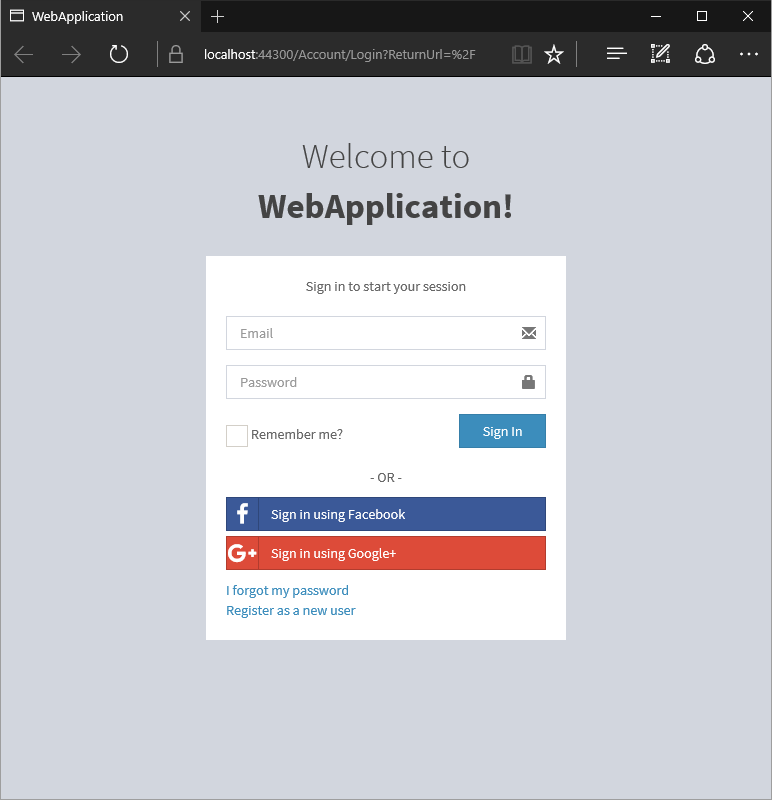
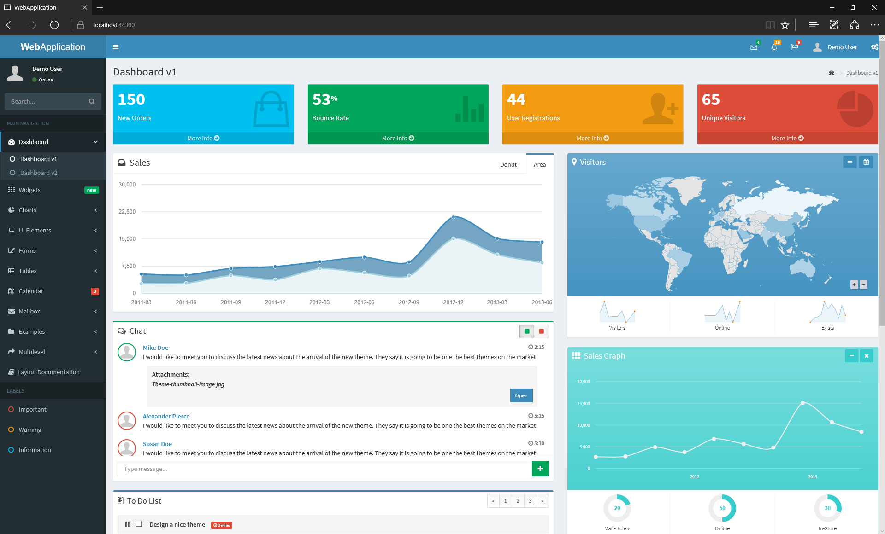

# ASP.NET MVC Application with a Custom Layout
## Requires
- Visual Studio 2015
## License
- MIT
## Technologies
- C#
- CSS
- HTML5/JavaScript
- ASP.NET MVC 5
## Topics
- Bootstrap
- ASP.NET Code Sample Downloads
- ASP.NET MVC Custom Layout
## Updated
- 02/09/2016
## Description

<h1>Introduction</h1>

A Visual Studio 2015 project which shows how use create an Asp.Net MVC Application with a custom layout. The AdminLTE layout (MIT License) from
<a href="https://almsaeedstudio.com/preview">https://almsaeedstudio.com/preview</a> has been selected for the customization.

The project illustrates the following topics:

<ul>
<li>Adding an existing layout to an Asp.Net MVC application. </li><li>Adding 3rd party JavaScript plugins </li></ul>
<h1>Building the Sample</h1>
<ol>
<li>Extract the package WebApplication.zip </li><li>Double-click on the WebApplication.sln </li><li>Click F5 to start debugging </li></ol>

Description

Web Application requires user authorization, click &quot;Register as a new user&quot; link and create an account.

&nbsp;

After registration main page which will appear.

&nbsp;

<strong>Source Code Files 
</strong>

<ul>
</ul>
<ul>
<li><a href="https://almsaeedstudio.com/preview">AdminLTE</a> distribution </li><li>3rd party plugins
<ul>
<li><a href="https://github.com/seiyria/bootstrap-slider">bootstrap-slider</a> </li><li><a href="https://github.com/Edicy/wysihtml5">wysihtml5</a> </li><li><a href="https://github.com/nnnick/Chart.js">Chart.js</a> </li><li><a href="http://ckeditor.com/about/license">ckeditor</a> </li><li><a href="http://mjolnic.github.io/bootstrap-colorpicker/">bootstrap-colorpicker</a>
</li><li><a href="http://www.datatables.net/">DataTables</a> </li><li><a href="https://github.com/eternicode/bootstrap-datepicker/">bootstrap-datepicker</a>
</li><li><a href="https://github.com/dangrossman/bootstrap-daterangepicker">bootstrap-daterangepicker</a>
</li><li><a href="https://github.com/ftlabs/fastclick">fastclick</a> </li><li><a href="http://www.flotcharts.org/">flotcharts</a> </li><li><a href="https://fortawesome.github.io/Font-Awesome/">Font-Awesome</a> </li><li><a href="http://fullcalendar.io/">fullcalendar</a> </li><li><a href="https://github.com/fronteed/iCheck/">iCheck</a> </li><li><a href="http://github.com/RobinHerbots/jquery.inputmask">jquery.inputmask</a>
</li><li><a href="http://ionicons.com/">ionicons</a> </li><li><a href="https://github.com/IonDen/ion.rangeSlider">ion.rangeSlider</a> </li><li><a href="https://jquery.com/">jQuery v2.1.4</a> </li><li><a href="http://jqueryui.com/">jqueryui</a> </li><li><a href="http://jqueryvalidation.org/">jqueryvalidation</a> </li><li><a href="http://jvectormap.com/">jvectormap</a> </li><li><a href="https://github.com/aterrien/jQuery-Knob">jQuery-Knob</a> </li><li><a href="https://github.com/moment/moment">moment</a> </li><li><a href="http://morrisjs.github.io/morris.js/">morris.js</a> </li><li><a href="http://github.hubspot.com/pace/">pace</a> </li><li><a href="https://github.com/DmitryBaranovskiy/raphael">raphael</a> </li><li><a href="https://github.com/select2/select2">select2</a> </li><li><a href="https://github.com/rochal/jQuery-slimScroll">jQuery-slimScroll</a> </li><li><a href="http://omnipotent.net/jquery.sparkline/">jquery.sparkline</a> </li><li><a href="https://github.com/jdewit/bootstrap-timepicker">bootstrap-timepicker</a>
</li></ul>
</li><li>Controllers - controller classes </li><li>Extensions &ndash; claims class helpers </li><li>Scripts - script files for View classes </li><li>Styles - css files for View classes </li><li>View - views for Controllers </li></ul>
<ul>
</ul>
