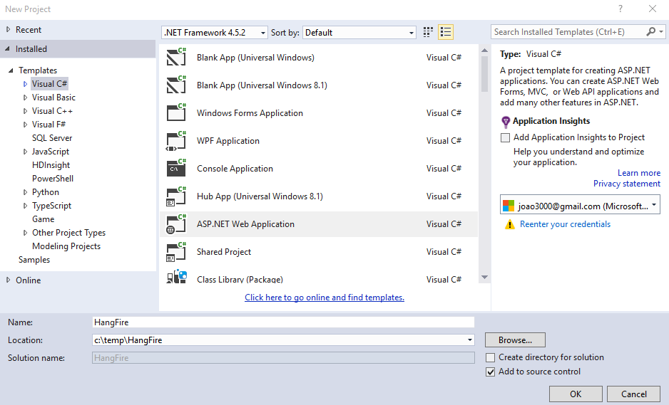
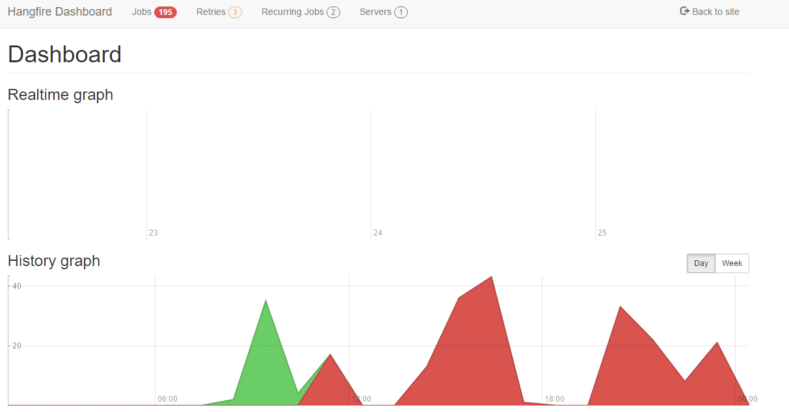
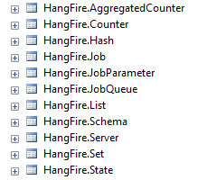

# ASP.NET MVC HangFire - Execute Jobs in Background using SQLServer
## Requires
- Visual Studio 2015
## License
- MIT
## Technologies
- C#
- MVC
- ASP.NET MVC 5
- Hangfire
## Topics
- C#
- ASP.NET
- MVC
- Hangfire
## Updated
- 09/14/2015
## Description

<strong>Introduction</strong>

This article walks you through configuration of HangFire.

&quot;An easy way to perform fire-and-forget, delayed and recurring tasks inside ASP.NET applications&quot; -
<a href="http://hangfire.io/">http://hangfire.io/</a>

We can easily configure different types of jobs (recurring, schedule or fire and forget)

&nbsp;

<strong>STEP 1 - Create ASP.NET Web Application</strong>

<ul type="disc">
<li lang="en-US">Open Visual Studio 2015 and create a new project of type ASP.NET Web Application.
</li><li lang="en-US">On this project I create a solution called HangFire.
</li></ul>

&nbsp;

<ul type="disc">
<li>Press OK, and a new screen will appear, with several options of template to use on our project.
</li><li>Select the option MVC. </li></ul>

&nbsp;

&nbsp;

<strong>STEP 2 - Install Nuget</strong>

&nbsp;

In order to use HangFire we need to install a Nuget package.

We can install using the Package Manager Console

<ul type="disc">
<li>PM&gt; Install-Package HangFire -Version 1.4.6 </li></ul>

Or using the Visual Studio Nuget Management

&nbsp;

&nbsp;

<strong>STEP 3 - Configure Startup class</strong>

&nbsp;

Need to provide connection string to our database.~

&nbsp;

&nbsp;

C#

Edit|Remove

csharp

<pre class="js">using&nbsp;Hangfire;&nbsp;
using&nbsp;<a class="libraryLink" href="https://msdn.microsoft.com/en-US/library/Microsoft.Owin.aspx" target="_blank" title="Auto generated link to Microsoft.Owin">Microsoft.Owin</a>;&nbsp;
using&nbsp;Owin;&nbsp;
using&nbsp;System;&nbsp;
&nbsp;
[assembly:&nbsp;OwinStartupAttribute(typeof(HangFire.Startup))]&nbsp;
namespace&nbsp;HangFire&nbsp;
{&nbsp;
&nbsp;&nbsp;&nbsp;&nbsp;public&nbsp;partial&nbsp;class&nbsp;Startup&nbsp;
&nbsp;&nbsp;&nbsp;&nbsp;{&nbsp;
&nbsp;&nbsp;&nbsp;&nbsp;&nbsp;&nbsp;&nbsp;&nbsp;public&nbsp;void&nbsp;Configuration(IAppBuilder&nbsp;app)&nbsp;
&nbsp;&nbsp;&nbsp;&nbsp;&nbsp;&nbsp;&nbsp;&nbsp;{&nbsp;
&nbsp;&nbsp;&nbsp;&nbsp;&nbsp;&nbsp;&nbsp;&nbsp;&nbsp;&nbsp;&nbsp;&nbsp;ConfigureAuth(app);&nbsp;
&nbsp;
&nbsp;&nbsp;&nbsp;&nbsp;&nbsp;&nbsp;&nbsp;&nbsp;&nbsp;&nbsp;&nbsp;&nbsp;GlobalConfiguration.Configuration&nbsp;
&nbsp;&nbsp;&nbsp;&nbsp;&nbsp;&nbsp;&nbsp;&nbsp;&nbsp;&nbsp;&nbsp;&nbsp;&nbsp;&nbsp;&nbsp;&nbsp;.UseSqlServerStorage(&quot;connectionString&quot;);&nbsp;
&nbsp;
&nbsp;&nbsp;&nbsp;&nbsp;&nbsp;&nbsp;&nbsp;&nbsp;&nbsp;&nbsp;&nbsp;&nbsp;BackgroundJob.Enqueue(()&nbsp;=&gt;&nbsp;Console.WriteLine(&quot;Fire-and-forget!&quot;));&nbsp;
&nbsp;
&nbsp;&nbsp;&nbsp;&nbsp;&nbsp;&nbsp;&nbsp;&nbsp;&nbsp;&nbsp;&nbsp;&nbsp;app.UseHangfireDashboard();&nbsp;
&nbsp;&nbsp;&nbsp;&nbsp;&nbsp;&nbsp;&nbsp;&nbsp;&nbsp;&nbsp;&nbsp;&nbsp;app.UseHangfireServer();&nbsp;
&nbsp;&nbsp;&nbsp;&nbsp;&nbsp;&nbsp;&nbsp;&nbsp;}&nbsp;
&nbsp;&nbsp;&nbsp;&nbsp;}&nbsp;
}&nbsp;
</pre>

&nbsp;

&nbsp;

<strong>STEP 4 - Run</strong>

Run application using the address of it follow by /hangfire, like on the image below.

&nbsp;

When we run this address for the first time, new table will be created on our database.

&nbsp;

<strong>Resources</strong>

Some good resources about Signal could be found here:

<ul type="disc">
<li lang="en-US">My personal blog:&nbsp;<a href="http://joaoeduardosousa.wordpress.com/">http://joaoeduardosousa.wordpress.com/
</a></li></ul>
<ul type="disc">
<li><a href="http://hangfire.io/">http://hangfire.io/</a> </li></ul>
