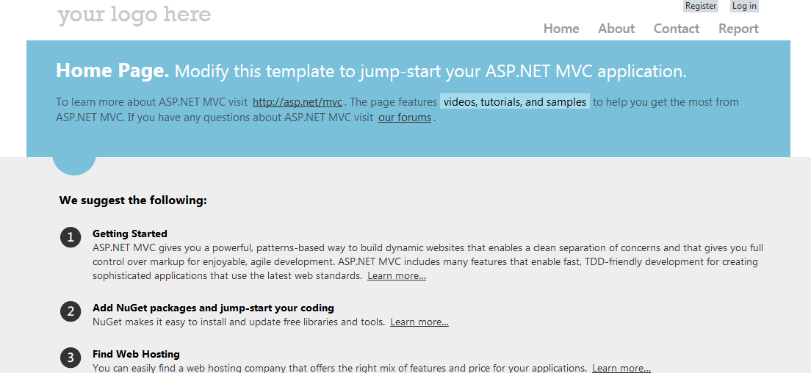
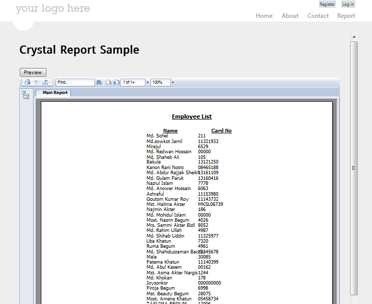

# ASP.NET MVC SAP Crystal report
## Requires
- Visual Studio 2012
## License
- MIT
## Technologies
- C#
- .NET Framework 4.0
- ASP.NET MVC 4
- Visual Studio 2012
## Topics
- Using Crystal Report in ASP.net MVC
- Crystal Report in Visual Studio 2012
- Crystal report using datasource
## Updated
- 11/27/2014
## Description

1.Download the latest version Crystal report from SAP:

3. Close your VS-2012/2013&nbsp; and install the new downloaded&nbsp;<strong>CRforVS
</strong>.

4. Take a new MVC project

code sample

&nbsp;&nbsp; SqlConnectionStringBuilder SConn = new SqlConnectionStringBuilder(ConfigurationManager.ConnectionStrings[&quot;ConnectionStringOther&quot;].ConnectionString); 
&nbsp;&nbsp;&nbsp;&nbsp;&nbsp;&nbsp;&nbsp;&nbsp;&nbsp;&nbsp;&nbsp; SqlConnection thisConnection = new SqlConnection(thisConnectionString); 
&nbsp;&nbsp;&nbsp;&nbsp;&nbsp;&nbsp;&nbsp;&nbsp;&nbsp;&nbsp;&nbsp; // store procedure 
&nbsp;&nbsp;&nbsp;&nbsp;&nbsp;&nbsp;&nbsp;&nbsp;&nbsp;&nbsp;&nbsp; SqlCommand mySelectCommand = new System.Data.SqlClient.SqlCommand(&quot;PIS_GetAllEmployeeInfo&quot;, thisConnection); 
&nbsp;&nbsp;&nbsp;&nbsp;&nbsp;&nbsp;&nbsp;&nbsp;&nbsp;&nbsp;&nbsp; mySelectCommand.CommandType = CommandType.StoredProcedure; 
&nbsp;&nbsp;&nbsp;&nbsp;&nbsp;&nbsp;&nbsp;&nbsp;&nbsp;&nbsp;&nbsp; reportDocument = new ReportDocument(); 
&nbsp;&nbsp;&nbsp;&nbsp;&nbsp;&nbsp;&nbsp;&nbsp;&nbsp;&nbsp;&nbsp; //Report path 
&nbsp;&nbsp;&nbsp;&nbsp;&nbsp;&nbsp;&nbsp;&nbsp;&nbsp;&nbsp;&nbsp; string reportPath = Server.MapPath(&quot;~/Reports/Crystal/EmployeeListCrystalReport.rpt&quot;); 
&nbsp;&nbsp;&nbsp;&nbsp;&nbsp;&nbsp;&nbsp;&nbsp;&nbsp;&nbsp;&nbsp; reportDocument.Load(reportPath); 
&nbsp;&nbsp;&nbsp;&nbsp;&nbsp;&nbsp;&nbsp;&nbsp;&nbsp;&nbsp;&nbsp; // Report connection 
&nbsp;&nbsp;&nbsp;&nbsp;&nbsp;&nbsp;&nbsp;&nbsp;&nbsp;&nbsp;&nbsp; ConnectionInfo connInfo = new ConnectionInfo(); 
&nbsp;&nbsp;&nbsp;&nbsp;&nbsp;&nbsp;&nbsp;&nbsp;&nbsp;&nbsp;&nbsp; connInfo.ServerName = SConn.DataSource; 
&nbsp;&nbsp;&nbsp;&nbsp;&nbsp;&nbsp;&nbsp;&nbsp;&nbsp;&nbsp;&nbsp; connInfo.DatabaseName = SConn.InitialCatalog; 
&nbsp;&nbsp;&nbsp;&nbsp;&nbsp;&nbsp;&nbsp;&nbsp;&nbsp;&nbsp;&nbsp; connInfo.UserID = SConn.UserID; 
&nbsp;&nbsp;&nbsp;&nbsp;&nbsp;&nbsp;&nbsp;&nbsp;&nbsp;&nbsp;&nbsp; connInfo.Password = SConn.Password; 
&nbsp;&nbsp;&nbsp;&nbsp;&nbsp;&nbsp;&nbsp;&nbsp;&nbsp;&nbsp;&nbsp; TableLogOnInfo tableLogOnInfo = new TableLogOnInfo(); 
&nbsp;&nbsp;&nbsp;&nbsp;&nbsp;&nbsp;&nbsp;&nbsp;&nbsp;&nbsp;&nbsp; tableLogOnInfo.ConnectionInfo = connInfo; 
&nbsp;&nbsp;&nbsp;&nbsp;&nbsp;&nbsp;&nbsp;&nbsp;&nbsp;&nbsp;&nbsp; foreach (CrystalDecisions.CrystalReports.Engine.Table table in reportDocument.Database.Tables) 
&nbsp;&nbsp;&nbsp;&nbsp;&nbsp;&nbsp;&nbsp;&nbsp;&nbsp;&nbsp;&nbsp; { 
&nbsp;&nbsp;&nbsp;&nbsp;&nbsp;&nbsp;&nbsp;&nbsp;&nbsp;&nbsp;&nbsp;&nbsp;&nbsp;&nbsp;&nbsp; table.ApplyLogOnInfo(tableLogOnInfo); 
&nbsp;&nbsp;&nbsp;&nbsp;&nbsp;&nbsp;&nbsp;&nbsp;&nbsp;&nbsp;&nbsp;&nbsp;&nbsp;&nbsp;&nbsp; table.LogOnInfo.ConnectionInfo.ServerName = connInfo.ServerName; 
&nbsp;&nbsp;&nbsp;&nbsp;&nbsp;&nbsp;&nbsp;&nbsp;&nbsp;&nbsp;&nbsp;&nbsp;&nbsp;&nbsp;&nbsp; table.LogOnInfo.ConnectionInfo.DatabaseName = connInfo.DatabaseName; 
&nbsp;&nbsp;&nbsp;&nbsp;&nbsp;&nbsp;&nbsp;&nbsp;&nbsp;&nbsp;&nbsp;&nbsp;&nbsp;&nbsp;&nbsp; table.LogOnInfo.ConnectionInfo.UserID = connInfo.UserID; 
&nbsp;&nbsp;&nbsp;&nbsp;&nbsp;&nbsp;&nbsp;&nbsp;&nbsp;&nbsp;&nbsp;&nbsp;&nbsp;&nbsp;&nbsp; table.LogOnInfo.ConnectionInfo.Password = connInfo.Password; 
&nbsp;&nbsp;&nbsp;&nbsp;&nbsp;&nbsp;&nbsp;&nbsp;&nbsp;&nbsp;&nbsp;&nbsp;&nbsp;&nbsp;&nbsp; table.Location = &quot;dbo.&quot; &#43; table.Location; 
&nbsp;&nbsp;&nbsp;&nbsp;&nbsp;&nbsp;&nbsp;&nbsp;&nbsp;&nbsp;&nbsp; } 
&nbsp;&nbsp;&nbsp;&nbsp;&nbsp;&nbsp;&nbsp;&nbsp;&nbsp;&nbsp; // You can pass parameter in your store procedure if you need 
&nbsp;&nbsp;&nbsp;&nbsp;&nbsp;&nbsp;&nbsp;&nbsp;&nbsp;&nbsp;&nbsp; //reportDocument.SetParameterValue(&quot;@FromDate&quot;, ProjectUtilities.ConvertToDate(txtFromDate.Text)); 
&nbsp;&nbsp;&nbsp;&nbsp;&nbsp;&nbsp;&nbsp;&nbsp;&nbsp;&nbsp;&nbsp; //reportDocument.SetParameterValue(&quot;@ToDate&quot;, ProjectUtilities.ConvertToDate(txtToDate.Text)); 
 
&nbsp;&nbsp;&nbsp;&nbsp;&nbsp;&nbsp;&nbsp;&nbsp;&nbsp;&nbsp;&nbsp; EmployeeListCrystalReport.ReportSource = reportDocument; 
&nbsp;&nbsp;&nbsp;&nbsp;&nbsp;&nbsp;&nbsp;&nbsp;&nbsp;&nbsp;&nbsp; EmployeeListCrystalReport.DataBind();

&nbsp;&nbsp;

&nbsp;

<em></em>

&nbsp;

&nbsp;

C#

Edit|Remove

csharp
<pre class="hidden"> public ActionResult EmployeeListReport()
        {
            ReportViewerViewModel model = new ReportViewerViewModel();
            string content = Url.Content(&quot;~/Reports/CrystalViewer/EmployeeList.aspx&quot;);
            model.ReportPath = content;
            return View(&quot;ReportViewer&quot;, model);
        }</pre>

<pre class="csharp">&nbsp;public&nbsp;ActionResult&nbsp;EmployeeListReport()&nbsp;
&nbsp;&nbsp;&nbsp;&nbsp;&nbsp;&nbsp;&nbsp;&nbsp;{&nbsp;
&nbsp;&nbsp;&nbsp;&nbsp;&nbsp;&nbsp;&nbsp;&nbsp;&nbsp;&nbsp;&nbsp;&nbsp;ReportViewerViewModel&nbsp;model&nbsp;=&nbsp;new&nbsp;ReportViewerViewModel();&nbsp;
&nbsp;&nbsp;&nbsp;&nbsp;&nbsp;&nbsp;&nbsp;&nbsp;&nbsp;&nbsp;&nbsp;&nbsp;string&nbsp;content&nbsp;=&nbsp;Url.Content(&quot;~/Reports/CrystalViewer/EmployeeList.aspx&quot;);&nbsp;
&nbsp;&nbsp;&nbsp;&nbsp;&nbsp;&nbsp;&nbsp;&nbsp;&nbsp;&nbsp;&nbsp;&nbsp;model.ReportPath&nbsp;=&nbsp;content;&nbsp;
&nbsp;&nbsp;&nbsp;&nbsp;&nbsp;&nbsp;&nbsp;&nbsp;&nbsp;&nbsp;&nbsp;&nbsp;return&nbsp;View(&quot;ReportViewer&quot;,&nbsp;model);&nbsp;
&nbsp;&nbsp;&nbsp;&nbsp;&nbsp;&nbsp;&nbsp;&nbsp;}</pre>

<em></em>

<h1>More Information</h1>

<em>For more information you can see</em>

<a href="http://atikpassion.blogspot.com/2014/11/aspnet-mvc-sap-crystal-report.html"><em>http://atikpassion.blogspot.com/2014/11/aspnet-mvc-sap-crystal-report.html</em></a>

<em> 
</em>

