# ASP.NET MVC アプリケーション開発入門: 第 1 回 ASP.NET MVC 2 の具体的な開発の全体像
## License
- Apache License, Version 2.0
## Technologies
- Visual Studio 2010
- ASP.NET MVC
## Topics
- ASP.NET MVC アプリケーション
- 連載! ASP.NET MVC
## Updated
- 02/15/2011
## Description

更新日: 2010 年 12 月 10 日

執筆者: <a href="http://msdn.microsoft.com/ja-jp/gg585574#masuda" target="_blank">
moonmile solutions、増田 智明</a>

本連載では、日経 BP 社から発売された<a href="http://ec.nikkeibp.co.jp/item/books/P94380.html" target="_blank">「ひと目でわかる ASP.NET MVC アプリケーション開発入門」</a>をもとにして、執筆時に気づいたことや紙面の都合で書ききれなかった技術を紹介します。

<h2>目次</h2>
<ol>
<li><a href="#01">はじめに</a> </li><li><a href="#02">Visual Studio 2010 を活用する</a> </li><li><a href="#03">ASP.NET MVC プロジェクトを作成</a> </li><li><a href="#04">モデルを追加</a> </li><li><a href="#05">コントローラーを追加</a> </li><li><a href="#06">ビューを追加</a> </li><li><a href="#07">実行する</a> </li><li><a href="#08">作業の流れ</a> </li><li><a href="#09">まとめ</a> </li></ol>

<h2 id="01">1. はじめに</h2>

連載第 1 回は、ASP.NET MVC 2 の具体的な開発の全体像をみていきましょう。

既に発売中の「<a title="新しいウィンドウで開きます" href="http://ec.nikkeibp.co.jp/item/books/P94380.html" target="_blank">ひと目でわかる ASP.NET MVC アプリケーション入門</a> 」のほうでは、Visual Studio 2010 の概要を解説してから、定番の Hello World アプリケーション作っています。その後、少しずつサンプルのショッピング サイト作りをしながら学習していくという構成になっています。

しかし、この記事では、一気にデータベースを使って商品の一覧を表示するところまでを作ってざっくりと ASP.NET MVC の感触を味わって頂きます。

1 回の記事の範囲内で出来るところを見れば、Visual Studio 2010 を使った ASP.NET MVC 2 アプリケーション開発の実力が分かるのではないでしょうか。

<a href="#top"> ページのトップへ</a>

<h2 id="02">2. Visual Studio 2010 を活用する</h2>

まず、Visual Studio 2010 で使う機能を簡単に説明しておきましょう。既に Visual Studio 2010 を持っている方は、Windows アプリケーションや ASP.NET アプリケーションなどを作った経験があると思います。まだ、お持ちでない方は<a title="新しいウィンドウで開きます" href="http://www.microsoft.com/japan/visualstudio/download/" target="_blank">評価版</a> や無償版 (<a title="新しいウィンドウで開きます" href="http://www.microsoft.com/web/" target="_blank">http://www.microsoft.com/web/</a>
 よりダウンロード可能な Web プラットフォーム インストーラーよりセットアップ可能) がありますので、この機会にぜひ活用してみてください。

さて、アプリケーションを新規に作成するときのテンプレートですが、ASP.NET MVC アプリケーションを作る時には下図のように「ASP.NET MVC 2 Web アプリケーション」を選択します。

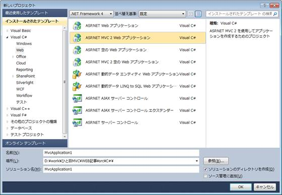

<strong>＜新しいプロジェクト ダイアログ (C#)＞</strong>

&nbsp;

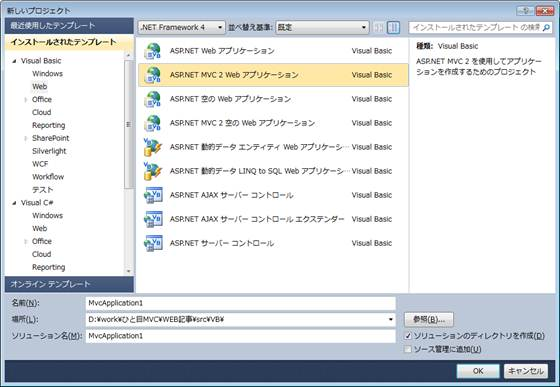

<strong>＜新しいプロジェクト ダイアログ (VB)＞</strong>

実は、ASP.NET MVC 2 アプリケーションの開発では、2 つのテンプレートが用意されています。

<ul>
<li>「ASP.NET MVC 2 Web アプリケーション」 </li><li>「ASP.NET 空の Web アプリケーション」 </li></ul>

ここで使うテンプレートは、ログイン機能などを備えたリッチなひな型のプロジェクトを作ってくれます。マスター ページを使いメニューなどのデザインを統一的にできるため、社内の簡単なアプリケーションであればこちらを使うとよいでしょう。

空の Web アプリケーションの場合は、フォルダー以外は作成されないため最初は戸惑うかもしれません。ある程度開発に慣れてきたり、余計なビューなどを作って欲しくない場合はこちらを使います。

今回は、ASP.NET MVC アプリケーションを最速に作るために「ASP.NET MVC 2 Web アプリケーション」のテンプレートを使っていきます。

次に Visual Studio 2010 の右側に表示されているソリューション エクスプローラーを活用します。

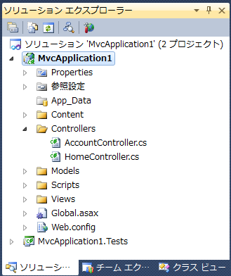

<strong>＜ソリューションエクスプローラー (C#)＞</strong>

&nbsp;

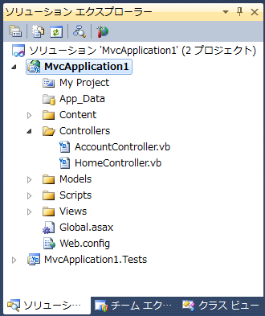

<strong>＜ソリューション エクスプローラー (VB)＞</strong>

ASP.NET Web フォームを使ってアプリケーションを作った方には、このフォルダーの多さに戸惑うかもしれません。Web フォーム ベースのアプリケーションの場合、同じフォルダーに aspx ファイルを並べることが多いので、階層構造は自由に決めていたと思います。

しかし、ASP.NET MVC の場合は、最初に「Models」、「Controllers」、「Views」という 3 つのフォルダーに分けられていることがルールになります。このフォルダー分けが、それぞれ Model、View、Controller に対応しているために、実は常に整理された構成でコーディングができるという利点があるのです。

最後にデータベースを扱うためのクラスです。

書籍のほうは、データベースとの連携などのややこしい話に触れないようにするために、「LINQ to SQL クラス」を使って SQL Server に接続しています。

ただし、今回はデータベースの接続を簡単に行うために「ADO.NET Entity Data Model」を使います。Entity Data Model に関しては、第 4 回の記事で詳しく説明しますので、ここではデータベース接続が簡単になる仕組み、という程度で捉えてください。 
逆に、書籍での「LINQ to SQL クラス」では物足りない方は、第 4 回の記事で Entity Data Model を使ったショッピング サイトの書き換えをしますので、楽しみにしてください。

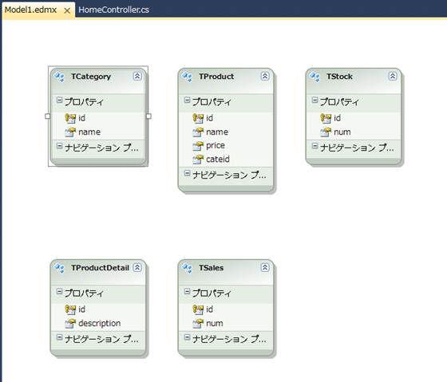

<strong>＜ADO.NET Entity Data Model＞</strong>

ここで使うデータベースは、日経 BP 社のサイトからダウンロードできる<a title="新しいウィンドウで開きます" href="http://ec.nikkeibp.co.jp/nsp/dl/09438/index.shtml" target="_blank">サンプル プログラム</a>に入っています。サンプルをダウンロードして「mvcdb.sql」のスクリプトを使って、あらかじめ SQL Server 上にデータベースを作成しておくかサンプル プログラムにある「mvc2\第02章\02-03\MvcShopping\MvcShopping\App_Data\MVCDB.MDF」というファイルをローカルのデータベース
 ファイルとして使ってください。サンプル プログラムには、書籍で使うプログラムが全て入っていますので、ぜひ活用してください。

さて、これで ASP.NET MVC アプリケーションの作成に必要な道具の準備が整いました。

この次から一気に商品のリストまで表示する画面を作成しましょう。

<a href="#top"> ページのトップへ</a>

<h2 id="03">3. ASP.NET MVC プロジェクトを作成</h2>

Visual Studio 2010 の「新しいプロジェクト」ボタンをクリックして、「ASP.NET MVC 2 Web アプリケーション」を選択します。

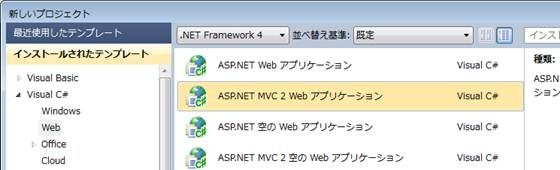

<strong>＜新しいプロジェクト ダイアログ ボックス＞</strong>

「単体プロジェクトの作成」ダイアログが出るので、そのまま「OK」ボタンをクリックします。 
単体プロジェクトは、コントローラーなどをテストするための独自のプロジェクトになります。

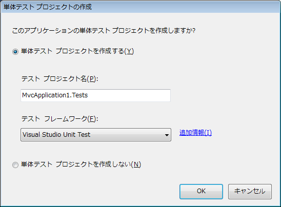

<strong>＜単体テスト プロジェクトの作成＞</strong>

&nbsp;

ログイン機能付きの Web アプリケーションのひな型のプロジェクトが作成されます。 
これを、そのままデバッグ実行すると次の図のようになります。

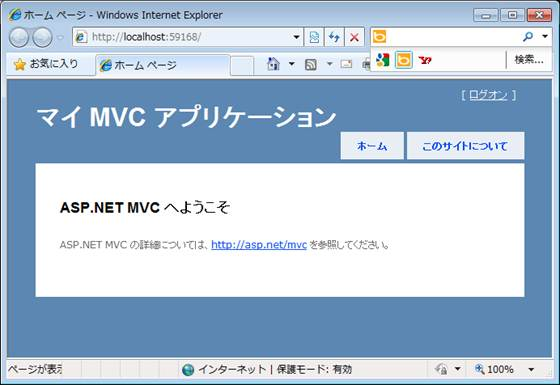

<strong>＜そのまま実行した結果＞</strong>

見て分かる通り、マスター ページを使ったテンプレートになっています。このため、マスター ページとなる Views/Shared/Site.Master ファイルを修正することによって、すべての画面にデザインを反映させることができます。統一的なメニューやタイトルなどはここに記述します。このあたりの説明は、本連載の第 6 回で解説する予定です。

画面のフォーマットが統一できるので、PHP などで作られた CMS (Contents Management System) と同じようにデザインできるのが便利ですね。

<a href="#top"> ページのトップへ</a>

<h2 id="04">4. モデルを追加</h2>

次にソリューション エクスプローラーを使って、モデルのクラスを作ります。 
今回のモデルのクラスは、データベースから直接作成したものを使います。

ソリューション エクスプローラーの「Models」フォルダーを右クリックし、「追加」&rarr;「新しい項目」を選択して、「新しい項目の追加」ダイアログを開きます。

このダイアログで、「インストールされたテンプレート」から「データ」を選択して、「ADO.NET Entity Data Model」を追加します。

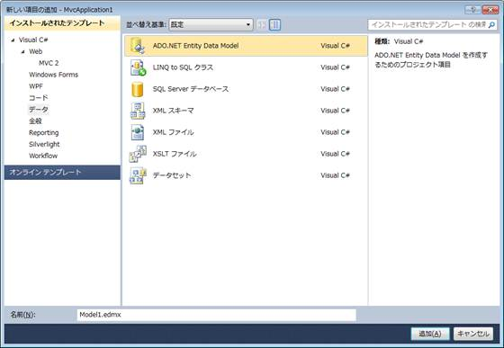

<strong>＜新しい項目の追加ダイアログ ボックス＞</strong>

ここでは「Entity Data Model ウィザード」を使って、データベースから直接クラスを生成しました。

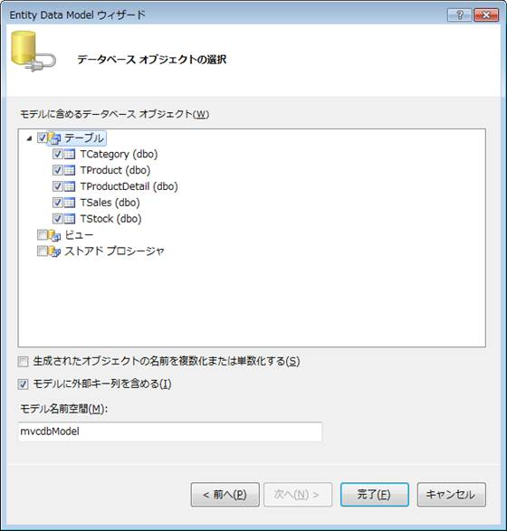

<strong>＜Entity Data Model ウィザード＞</strong>

正常に完了すると、モデルで使えるクラスが自動的に作られます。

ここで一度ビルドをしておいてください。このビルドは、あとでビューでモデルを参照するときに必要なものです。

モデルで使えるクラスは、単純なプロパティを持つクラスで良いので自作することもできます。書籍のでは、LINQ to SQL クラスを使って、モデル用のクラスをひとつずつ作るようにしています。

<a href="#top"> ページのトップへ</a>

<h2 id="05">5. コントローラーを追加</h2>

次に、モデルが持っているデータをビューに渡すためのコントローラーを作成します。

ソリューション エクスプローラーの「Controllers」を右クリックして、「追加」&rarr;「コントローラー」を選択します。

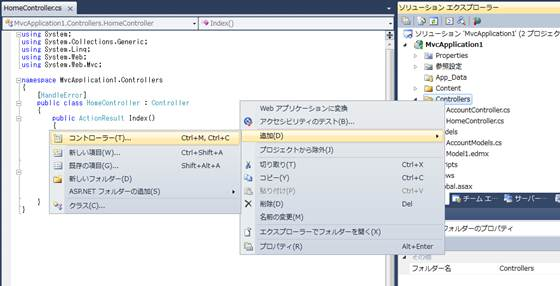

<strong>＜コントローラーを追加＞</strong>

コントローラー名は「AdminController」と入力します。

コントローラーの名前はビューとの連携のために「ビューで使うフォルダー名」＋「Controller」になっています。

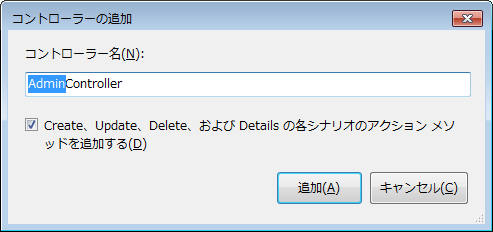

<strong>＜コントローラーを追加ダイアログ ボックス＞</strong>

また、コントローラーの追加ダイアログでは、「Create、Update、Delete、および Details の各シナリオのアクション メソッドを追加する」にチェックを入れます。この指定をすると、データベースにアクセスするメソッドのひな型が作られます。

<strong>＜ソース (C#)＞</strong>

C#

Edit Script

csharp

<pre id="codePreview" class="csharp"><code class="xml">namespace MvcShopping.Controllers
{
    public class AdminController : Controller

    {
        //
        // GET: /Admin/

        public ActionResult Index()
        {
            return View();
        }</code></pre>

&nbsp;

<strong>＜ソース (VB)＞</strong>

Visual Basic

Edit Script

vb

<pre id="codePreview" class="vb"><code class="xml">Namespace MvcApplication1
    Public Class AdminController
        Inherits <a class="libraryLink" href="http://msdn.microsoft.com/ja-JP/library/System.Web.Mvc.Controller.aspx" target="_blank" title="Auto generated link to System.Web.Mvc.Controller">System.Web.Mvc.Controller</a>

        '
        ' GET: /Admin

        Function Index() As ActionResult
            Return View()
        End Function</code></pre>

&nbsp;

いわゆる、CRUD (Create、Read、Update、Delete) のためのメソッドが作られます。このメソッドでテーブルを編集していきます。

ここでは一覧を表示するための Index メソッドだけに手を加えましょう。

<strong>＜ソース (C#)＞</strong>

C#

スクリプトの編集

csharp

<pre id="codePreview" class="csharp">//&nbsp;
//&nbsp;GET:&nbsp;/Admin/&nbsp;
&nbsp;
public&nbsp;ActionResult&nbsp;Index()&nbsp;
{&nbsp;
&nbsp;&nbsp;&nbsp;&nbsp;Models.mvcdbEntities&nbsp;ent&nbsp;=&nbsp;new&nbsp;Models.mvcdbEntities();&nbsp;
&nbsp;&nbsp;&nbsp;&nbsp;return&nbsp;View(ent.TProduct);&nbsp;
}&nbsp;
&nbsp;
</pre>

&nbsp;

<strong>＜ソース (VB)＞</strong>

Visual Basic

Edit Script

vb

<pre id="codePreview" class="vb"><code class="xml">'
' GET: /Admin

Function Index() As ActionResult
    Dim ent As New mvcdbEntities
    Return View(ent.TProduct)
End Function</code></pre>

&nbsp;

既に作成した mvcdbEntities (Entity Data Model) から TProduct (商品テーブル) の内容をビューに渡すだけの処理になります。

<a href="#top"> ページのトップへ</a>

<h2 id="06">6. ビューを追加</h2>

コントローラーから渡されたデータをビューに表示させます。

まず、ソリューション エクスプローラーで「Views」フォルダーの下に「Admin」というフォルダーを作ります。これは先に作ったコントローラーの名前「AdminControllder」に合わせたものです。

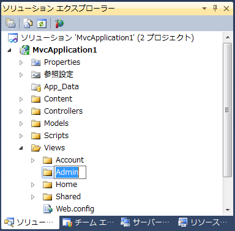

<strong>＜Admin フォルダーを作成＞</strong>

次に、「Admin」フォルダーを右クリックして、「ビュー」を選択します。

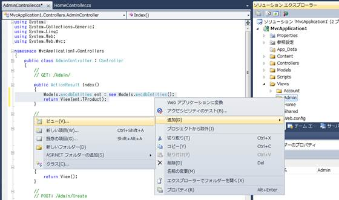

<strong>＜ビューを追加＞</strong>

「ビューの追加」ダイアログでは、ビューの名前とビュー データ クラスを入力します。

ビューの名前は「Index」に変更します。「Index」というビューの名前は特別で、URL で「/Admin/」と指定されたときに、「/Admin/Index」が呼び出される仕組みになっています。

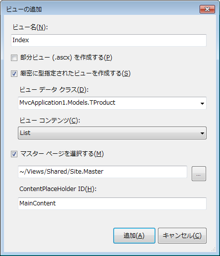

<strong>＜ビューを追加ダイアログ＞</strong>

また、ビューで表示する一覧の HTML タグを自動生成してほしいので、「厳密に型指定されたビューを作成する」をチェックしたあとで、コントローラーで渡したモデルのクラス「MvcApplication1.Models.TProduct」を選択します。これは、ビューから渡された型 (クラス) が分かるようにするためです。クラスのリストの中に「TProduct」のクラス名がない場合は、一度プロジェクトをビルドしてください。モデルのデータ クラス (Entity Dataクラスなど) がビルドされていないと、このドロップ
 ダウンリストにでてきません。

「ビューのコンテンツ」は「List」を選択しておきます。すると「TProduct」というデータのクラスが持つプロパティに従って一覧を表示するための HTML タグ (td タグや列名など) が作成されます。

「追加」ボタンをクリックすると、TProduct テーブルの内容を表示するビューが自動生成されます。

<strong>＜ソース (C#)＞</strong>

C#

スクリプトの編集

csharp

<pre id="codePreview" class="csharp">&lt;%@&nbsp;Page&nbsp;Title=&quot;&quot;&nbsp;Language=&quot;C#&quot;&nbsp;MasterPageFile=&quot;~/Views/Shared/Site.Master&quot;&nbsp;Inherits=&quot;System.Web.Mvc.ViewPage&lt;IEnumerable&lt;MvcApplication1.Models.TProduct&gt;&gt;&quot;&nbsp;%&gt;&nbsp;
&nbsp;
&lt;asp:Content&nbsp;ID=&quot;Content1&quot;&nbsp;ContentPlaceHolderID=&quot;TitleContent&quot;&nbsp;runat=&quot;server&quot;&gt;&nbsp;
&nbsp;&nbsp;&nbsp;&nbsp;Index&nbsp;
&lt;/asp:Content&gt;&nbsp;
&nbsp;
&lt;asp:Content&nbsp;ID=&quot;Content2&quot;&nbsp;ContentPlaceHolderID=&quot;MainContent&quot;&nbsp;runat=&quot;server&quot;&gt;&nbsp;
&nbsp;
&nbsp;&nbsp;&nbsp;&nbsp;&lt;h2&gt;Index&lt;/h2&gt;&nbsp;
&nbsp;
&nbsp;&nbsp;&nbsp;&nbsp;&lt;table&gt;&nbsp;
&nbsp;&nbsp;&nbsp;&nbsp;&nbsp;&nbsp;&nbsp;&nbsp;&lt;tr&gt;&nbsp;
&nbsp;&nbsp;&nbsp;&nbsp;&nbsp;&nbsp;&nbsp;&nbsp;&nbsp;&nbsp;&nbsp;&nbsp;&lt;th&gt;&lt;/th&gt;&nbsp;
&nbsp;&nbsp;&nbsp;&nbsp;&nbsp;&nbsp;&nbsp;&nbsp;&nbsp;&nbsp;&nbsp;&nbsp;&lt;th&gt;&nbsp;
&nbsp;&nbsp;&nbsp;&nbsp;&nbsp;&nbsp;&nbsp;&nbsp;&nbsp;&nbsp;&nbsp;&nbsp;&nbsp;&nbsp;&nbsp;&nbsp;id&nbsp;
&nbsp;&nbsp;&nbsp;&nbsp;&nbsp;&nbsp;&nbsp;&nbsp;&nbsp;&nbsp;&nbsp;&nbsp;&lt;/th&gt;&nbsp;
&nbsp;&nbsp;&nbsp;&nbsp;&nbsp;&nbsp;&nbsp;&nbsp;&nbsp;&nbsp;&nbsp;&nbsp;&lt;th&gt;&nbsp;
&nbsp;&nbsp;&nbsp;&nbsp;&nbsp;&nbsp;&nbsp;&nbsp;&nbsp;&nbsp;&nbsp;&nbsp;&nbsp;&nbsp;&nbsp;&nbsp;name&nbsp;
&nbsp;&nbsp;&nbsp;&nbsp;&nbsp;&nbsp;&nbsp;&nbsp;&nbsp;&nbsp;&nbsp;&nbsp;&lt;/th&gt;&nbsp;
&nbsp;
</pre>

&nbsp;

<strong>＜ソース (VB)＞</strong>

Visual Basic

Edit Script

vb

<pre id="codePreview" class="vb"><code class="xml">&lt;%@ Page Title=&quot;&quot; Language=&quot;VB&quot; MasterPageFile=&quot;~/Views/Shared/Site.Master&quot; Inherits=&quot;<a class="libraryLink" href="http://msdn.microsoft.com/ja-JP/library/System.Web.Mvc.ViewPage.aspx" target="_blank" title="Auto generated link to System.Web.Mvc.ViewPage">System.Web.Mvc.ViewPage</a>(Of IEnumerable (Of MvcApplication1.TProduct))&quot; %&gt;

&lt;asp:Content ID=&quot;Content1&quot; ContentPlaceHolderID=&quot;TitleContent&quot; runat=&quot;server&quot;&gt;
	Index
&lt;/asp:Content&gt;

&lt;asp:Content ID=&quot;Content2&quot; ContentPlaceHolderID=&quot;MainContent&quot; runat=&quot;server&quot;&gt;

    &lt;h2&gt;Index&lt;/h2&gt;

    &lt;p&gt;
        &lt;%: Html.ActionLink(&quot;Create New&quot;, &quot;Create&quot;)%&gt;
    &lt;/p&gt;    

    &lt;table&gt;
        &lt;tr&gt;
            &lt;th&gt;&lt;/th&gt;
            &lt;th&gt;
                id
            &lt;/th&gt;
            &lt;th&gt;
                name
            &lt;/th&gt;</code></pre>

&nbsp;

id、name、price、cateid のように、TProduct テーブルの列名を使った表が作成されます。 
さらに、次のコードのように、編集 (Edit)、詳細 (Details)、削除 (Delete) リンクや、新規作成 (Create New) のリンクが付いて、それぞれのデータを編集できるようになっています。

<strong>＜ソース (C#)＞</strong>

C#

スクリプトの編集

csharp

<pre id="codePreview" class="csharp">&lt;%&nbsp;foreach&nbsp;(var&nbsp;item&nbsp;in&nbsp;Model)&nbsp;{&nbsp;%&gt;&nbsp;&nbsp;&nbsp;&nbsp;&nbsp;
&nbsp;
&nbsp;&nbsp;&nbsp;&nbsp;&nbsp;&nbsp;&nbsp;&nbsp;&lt;tr&gt;&nbsp;
&nbsp;&nbsp;&nbsp;&nbsp;&nbsp;&nbsp;&nbsp;&nbsp;&nbsp;&nbsp;&nbsp;&nbsp;&lt;td&gt;&nbsp;
&nbsp;&nbsp;&nbsp;&nbsp;&nbsp;&nbsp;&nbsp;&nbsp;&nbsp;&nbsp;&nbsp;&nbsp;&nbsp;&nbsp;&nbsp;&nbsp;&lt;%:&nbsp;Html.ActionLink(&quot;Edit&quot;,&nbsp;&quot;Edit&quot;,&nbsp;new&nbsp;{&nbsp;id=item.id&nbsp;})&nbsp;%&gt;&nbsp;|&nbsp;
&nbsp;&nbsp;&nbsp;&nbsp;&nbsp;&nbsp;&nbsp;&nbsp;&nbsp;&nbsp;&nbsp;&nbsp;&nbsp;&nbsp;&nbsp;&nbsp;&lt;%:&nbsp;Html.ActionLink(&quot;Details&quot;,&nbsp;&quot;Details&quot;,&nbsp;new&nbsp;{&nbsp;id=item.id&nbsp;})%&gt;&nbsp;|&nbsp;
&nbsp;&nbsp;&nbsp;&nbsp;&nbsp;&nbsp;&nbsp;&nbsp;&nbsp;&nbsp;&nbsp;&nbsp;&nbsp;&nbsp;&nbsp;&nbsp;&lt;%:&nbsp;Html.ActionLink(&quot;Delete&quot;,&nbsp;&quot;Delete&quot;,&nbsp;new&nbsp;{&nbsp;id=item.id&nbsp;})%&gt;&nbsp;
&nbsp;&nbsp;&nbsp;&nbsp;&nbsp;&nbsp;&nbsp;&nbsp;&nbsp;&nbsp;&nbsp;&nbsp;&lt;/td&gt;&nbsp;
&nbsp;
</pre>

&nbsp;

<strong>＜ソース (VB)＞</strong>

Visual Basic

Edit Script

vb

<pre id="codePreview" class="vb"><code class="xml">&lt;% For Each item In Model%&gt;

        &lt;tr&gt;
            &lt;td&gt;
                &lt;%: Html.ActionLink(&quot;Edit&quot;, &quot;Edit&quot;, New With {.id = item.id})%&gt; |
                &lt;%: Html.ActionLink(&quot;Details&quot;, &quot;Details&quot;, New With {.id = item.id})%&gt; |
                &lt;%: Html.ActionLink(&quot;Delete&quot;, &quot;Delete&quot;, New With {.id = item.id})%&gt;
            &lt;/td&gt;</code></pre>

&nbsp;

<a href="#top"> ページのトップへ</a>

<h2 id="07">7. 実行する</h2>

ソース コードの変更はこれでおしまいです。 
では、早速実行してみましょう。

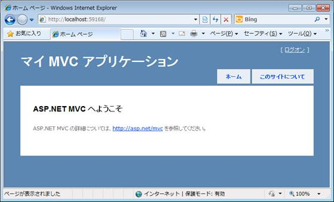

<strong>＜トップページ＞</strong>

最初はトップページが表示されるので、URL を「http://localhost:＜ポート番号＞/Admin」のように、変更します。

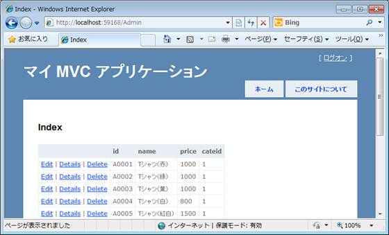

<strong>＜URL 変更後のページ＞</strong>

すると、先ほど作成した商品テーブル (TProduct) の内容が一覧で表示されます。

データの編集や削除なども既にメソッドが用意されているので、順々に組み込んでいけば、データベースを扱うときの CRUD 機能は手順よく実装することができます。

<a href="#top"> ページのトップへ</a>

<h2 id="08">8. 作業の流れ</h2>

ここまでのサンプル アプリケーション作成の流れをちょっとおさらいしておきましょう。

<ol>
<li>データベースから「TProduct」モデルを作成する。 </li><li>「Admin」コントローラーを自動生成する。 </li><li>「Admin」コントローラーの「Index」メソッドで、ビューに「TProduct」モデルを渡す。 </li><li>「TProduct」モデルの一覧表示「List」をするための「Index」ビューを作成する。 </li></ol>

という流れになります。 
これは「モデル」&rarr;「コントローラー」&rarr;「ビュー」の順に作成していきます。

さらに、既に「TProduct」モデルがある状態で新規作成の「Create」ビューを実装しようとした場合は、

<ol>
<li>既に作成されている「TProduct」モデルを使う。 </li><li>「Admin」コントローラーの「Create」メソッドで、ビューに初期データとして「TProduct」モデルを渡す。 </li><li>「TProduct」モデルの新規作成「Create」するための「Create」ビューを作成する。 </li></ol>

というように同じく「モデル」&rarr;「コントローラー」&rarr;「ビュー」の順に作成することになります。

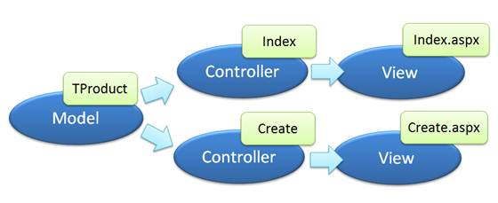

<strong>＜作業するときの流れ＞</strong>

このようにデータを表示する流れは「モデル」&rarr;「コントローラー」&rarr;「ビュー」の順に作っていくと実装がしやすくなります。これはデータの更新であっても、「モデル」&rarr;「コントローラー」の順に実装が進みます。

データが流れる方向に沿って実装する利点は、単体テストがしやすいことです。ASP.NET MVC アプリケーションのテンプレートでは、単体テストのプロジェクトも同時に作成され、ビューを使わずにテストをすることが推奨されています。

また、ASP.NET MVC を扱うときの命名規則 (「Index」や「Create」など) やテーブル名は、モデルから実装するほうが合わせやすいでしょう。最初に、自動生成で使われるひな型を使って動作を確認した後に、少しずつ動作やデザインを変えていくと開発する途中のトラブルが減ります。

<a href="#top"> ページのトップへ</a>

<h2 id="09">9. まとめ</h2>

さて、ASP.NET MVC アプリケーションの一連の流れを追ってみましたが如何だったでしょうか。Visual Studio 2010 を使うと、手軽に ASP.NET MVC が使えることがお分かり頂けたかと思います。実際、更新の少ないマスター データの管理ツールは、このようにテーブル単位で自動作成させると手早く作成できますので、試してみてください。

次回は、ビューを作成するときに「Admin」というフォルダーを作りましたが、これが何を意味するのか、コントローラーで作った「Index」メソッドとビューで作った「Index」とはどう繋がっていくのかという、アクション メソッド、URL ルーティングの話をしたいと思います。

<table>
<tbody>
<tr>
<td></td>
<td></td>
<td>
<ul>
<li>もっと他のコンテンツを見る &gt;&gt; <a href="http://msdn.microsoft.com/ja-jp/asp.net/gg490787" target="_blank">
連載! ASP.NET MVC アプリケーション開発入門一覧へ</a> </li><li>もっと他のレシピを見る &gt;&gt; <a href="http://msdn.microsoft.com/ja-jp/samplecode.recipe">
Code Recipe へ</a> </li><li>もっと ASP.NET の情報を見る &gt;&gt; <a href="http://msdn.microsoft.com/ja-jp/asp.net" target="_blank">
ASP.NET デベロッパーセンターへ</a> </li></ul>
</td>
</tr>
</tbody>
</table>

<a href="#top">ページのトップへ</a>

