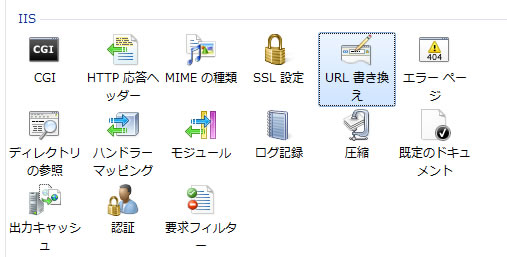
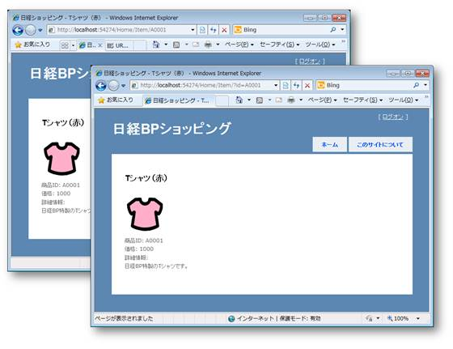
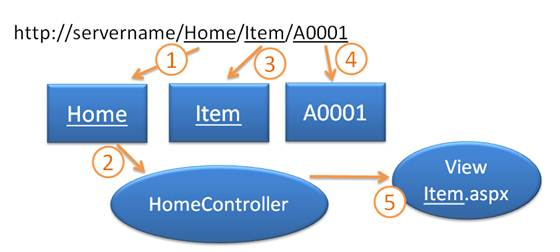
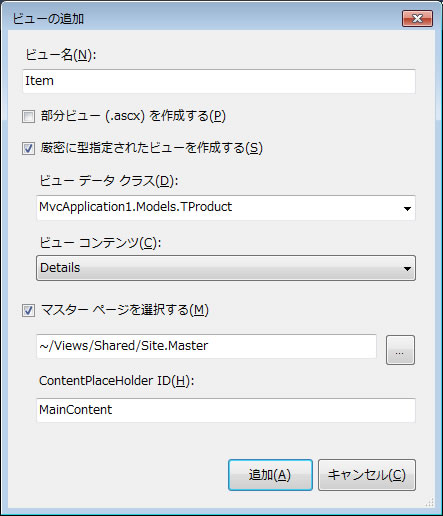
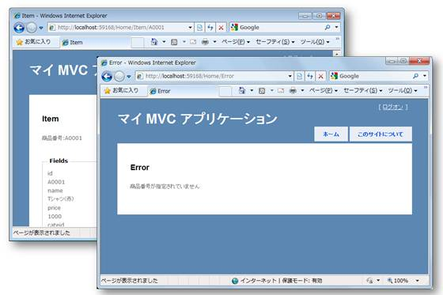
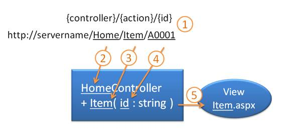
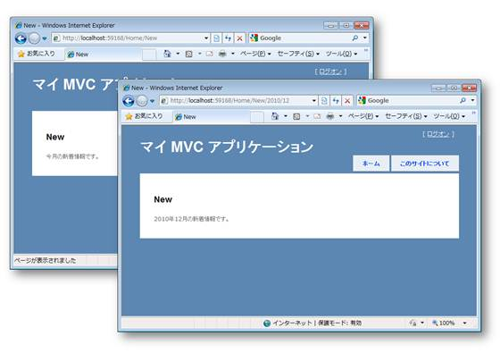
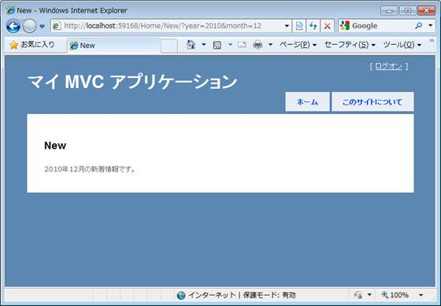
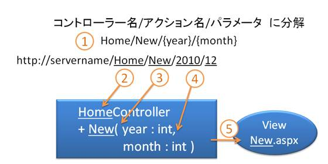

# ASP.NET MVC アプリケーション開発入門: 第 2 回 アクション メソッドについて
## Requires
- 
## License
- Apache License, Version 2.0
## Technologies
- Visual Studio 2010
- ASP.NET MVC
## Topics
- ASP.NET MVC アプリケーション
- 連載! ASP.NET MVC
## Updated
- 02/15/2011
## Description

更新日: 2010 年 12 月 24 日

執筆者: <a href="http://msdn.microsoft.com/ja-jp/gg585574#masuda" target="_blank">
moonmile solutions、増田 智明</a>

本連載では、日経 BP 社から発売された<a href="http://ec.nikkeibp.co.jp/item/books/P94380.html" target="_blank">「ひと目でわかる ASP.NET MVC アプリケーション開発入門」</a>をもとにして、執筆時に気づいたことや紙面の都合で書ききれなかった技術を紹介します。

<h2>目次</h2>

<a href="#01">1. はじめに</a>

<a href="#02">2. URL ルーティングとは何か</a>

<a href="#03">3. URL ルーティングとアクション メソッドの関係</a>

<a href="#04">4. 仕組みを追う</a>

<a href="#05">5. 新しい URL ルーティングを追加する</a>

<a href="#06">6. 動作確認</a>

<a href="#07">7. URL ルーティングのパターンの注意点</a>

<a href="#08">8. おわりに</a>

<h2 id="01">1. はじめに</h2>

連載の第 2 回目は、ASP.NET 4 で導入された「URL ルーティング」と、ASP.NET MVC 2 で必ず理解が必要な「アクション メソッド」についてお話ししましょう。

「URL ルーティング」と「アクション メソッド」は、ASP.NET MVC アプリケーションを作る上で必須な機能です。ですが、複雑な仕組みは既に ASP.NET MVC のフレームワークに織り込まれているために、Visual Studio 2010 を使うと自然と「URL ルーティング」と「アクション メソッド」が関連づけられるようになっています。<a href="http://msdn.microsoft.com/ja-jp/asp.net/gg490411">前回</a>の記事のように Visual
 Studio 2010 上からコントローラーを作ることで、自動的に必要なアクション メソッドが作られる仕掛けも組み込まれています。

今回は、もう一歩踏み込んで、この URL ルーティングがどのように ASP.NET MVC のアクション メソッドに繋がるのかを具体的に追ってみます。

<a href="#top"> ページのトップへ</a>

<h2 id="02">2. URL ルーティングとは何か</h2>

さて、URL ルーティングとは何でしょうか?

ブラウザーで WWW サーバーに接続するときに URL という文字列を入力しますが、この時「/」(スラッシュ) で区切られた文字列だけでなく、「?」や「=」が含まれた文字列がアドレスに表示されることがあります。これを「クエリ文字列」と言います。しかし、クエリ文字列自体は人が覚えやすいものではありません。見た目も分かり辛く、メールなどでアドレスを他人に送る場合にも長くなり過ぎて使いづらいものです。

実はこのクエリ文字列の部分を、あたかもフォルダーを指定しているように「/」で区切る形式にできます。一定のルールで URL をクエリ文字列の形式に直すのが「URL ルーティング」になります。

例えば、ショッピング サイトで商品の ID が「A0001」のページを開くときに次のような URL を指定するとしましょう。

http://servername/Home/Item/A0001

この URL を内部では、次のようなクエリ文字列と同じように扱えるようにします。

http://servername/Home/Item/?id=A0001

この機能は、Apache の mod_rewrite や IIS の <a title="新しいウィンドウで開きます" href="http://www.iis.net/download/URLRewrite" target="_blank">
URL Rewrite モジュール (英語)</a> によって実現されている定番な機能です。URL ルーティングを用いることによって、簡素化された URL を使うことができます。

<strong>図 1. IIS 7 の URL rewrite</strong>

具体的には、書籍<a title="新しいウィンドウで開きます" href="http://ec.nikkeibp.co.jp/item/books/P94380.html" target="_blank">「ひと目でわかるASP.NET MVCアプリケーション入門」</a>のサンプル プログラムを動かしてみると、どちらも同じ動きとなり商品の詳細情報の表示になることが分かります。

<strong>図 2. URL ルーティングを使った場合と使わない場合</strong>

実は Visual Studio 2010 を使って、ASP.NET MVC アプリケーションの枠組みを作ると、既に URL ルーティングの機能が使われています。ASP.NET MVC が使っている URL ルーティングは、ASP.NET 3.5 SP1 以降のフレームワークとして実装されているもので、IIS や Apache のモジュールと違い、ソース コードで URL ルーティングの設定を行います。

<a href="#top"> ページのトップへ</a>

<h2 id="03">3. URL ルーティングとアクション メソッドの関係</h2>

次に URL ルーティングとアクション メソッドの関係を考えていきましょう。

アクション メソッドは、ASP.NET MVC のコントローラーに含まれるメソッドです。URL が指定されると、ルールに従って特定のコントローラー クラスの特定のメソッドが呼び出される仕組みになっています。アクション メソッドにより、どのビューを表示するという MVC パターンの要となる仕組みで、URL ルーティングとワンセットで動作します。

先ほどの URL をコントローラー名やアクション メソッドに分けて見直してみましょう。

http://servername/Home/Item/A0001

この URL は既定で次のように分解されます。

http://servername/＜コントローラー名＞/＜アクション メソッド名＞/＜パラメーター＞

サーバー名 (servername) に続き、コントローラーの名前 (Home)、アクション メソッドの名前 (Item)、パラメーターである商品 ID (A0001) となります。

実際のコントローラーのクラス名は、「Home」＋「Controller」となり、「HomeController」というクラス名になります。コントローラー名は、URL で指定されたコントローラーの名前に「Controller」を付ける、というルールになっているのです。

パラメーターの値は「A0001」となっていますが、実は「?id=A0001」のクエリ文字列と同じ動きをする URL ルーティングの設定なので、パラメーターの名前が「id」、パラメーターの値が「A0001」になります。 
URL を分解する順番を表すと次の図になります。

<strong>図 3. 概要図</strong>

<ol>
<li>コントローラー名を取り出す。 </li><li>「コントローラー名」＋「Controller」のクラスを呼び出す。 </li><li>指定されたアクション メソッドを呼び出す。 </li><li>パラメーターを引き渡す。 </li><li>アクション メソッドが指定のビューを表示する。 </li></ol>

<a href="#top"> ページのトップへ</a>

<h2 id="04">4. 仕組みを追う</h2>

具体的に URL ルーティングとアクション メソッドの仕組みを追っていきましょう。

Visual Studio 2010 で ASP.NET MVC アプリケーションを作成して、ソリューション エクスプローラーで、Global.asax というファイルを開いてみてください。

このファイルの中に、先ほど説明した URL ルーティングのパターンが記述されています。

<strong>＜ソース (C#)＞</strong>

C#

Edit Script

csharp
<pre class="hidden"><code class="xml">public static void RegisterRoutes(RouteCollection routes)
{
    routes.IgnoreRoute(&quot;{resource}.axd/{*pathInfo}&quot;);

    routes.MapRoute(
        &quot;Default&quot;, // ルート名
        &quot;{controller}/{action}/{id}&quot;, // パラメーター付きの URL
        new { controller = &quot;Home&quot;, action = &quot;Index&quot;, id = UrlParameter.Optional } // パラメーターの既定値
    );
}</code></pre>
<pre id="codePreview" class="csharp"><code class="xml">public static void RegisterRoutes(RouteCollection routes)
{
    routes.IgnoreRoute(&quot;{resource}.axd/{*pathInfo}&quot;);

    routes.MapRoute(
        &quot;Default&quot;, // ルート名
        &quot;{controller}/{action}/{id}&quot;, // パラメーター付きの URL
        new { controller = &quot;Home&quot;, action = &quot;Index&quot;, id = UrlParameter.Optional } // パラメーターの既定値
    );
}</code></pre>

&nbsp;

<strong>＜ソース (VB)＞</strong>

Visual Basic

Edit Script

vb
<pre class="hidden"><code class="xml">Shared Sub RegisterRoutes(ByVal routes As RouteCollection)
    routes.IgnoreRoute(&quot;{resource}.axd/{*pathInfo}&quot;)

    ' MapRoute は次のパラメーターを順番に受け取ります:
    ' (1) ルート名
    ' (2) パラメーター付きの URL
    ' (3) パラメーターの既定値
    routes.MapRoute( _
        &quot;Default&quot;, _
        &quot;{controller}/{action}/{id}&quot;, _
        New With {.controller = &quot;Home&quot;, .action = &quot;Index&quot;, .id = UrlParameter.Optional} _
    )
End Sub</code></pre>
<pre id="codePreview" class="vb"><code class="xml">Shared Sub RegisterRoutes(ByVal routes As RouteCollection)
    routes.IgnoreRoute(&quot;{resource}.axd/{*pathInfo}&quot;)

    ' MapRoute は次のパラメーターを順番に受け取ります:
    ' (1) ルート名
    ' (2) パラメーター付きの URL
    ' (3) パラメーターの既定値
    routes.MapRoute( _
        &quot;Default&quot;, _
        &quot;{controller}/{action}/{id}&quot;, _
        New With {.controller = &quot;Home&quot;, .action = &quot;Index&quot;, .id = UrlParameter.Optional} _
    )
End Sub</code></pre>

&nbsp;

Global.asax は、アプリケーションの起動が開始するときに実行されるモジュールです。このファイルに URL ルーティングのパターンが記述されているのです。

&quot;{controller}/{action}/{id}&quot;, // パラメーター付きの URL

この部分が、ASP.NET MVC の URL ルーティングの設定です。中括弧で囲まれた名前はプレースホルダーと呼び、URL ルーティングの処理を行ったときに分解される名前が書かれています。

<table class="grid" border="1" cellspacing="0" cellpadding="5" style="border-collapse:collapse; margin-bottom:10px">
<tbody>
<tr style="background-color:#eff3f7">
<td>名前</td>
<td>意味</td>
</tr>
<tr>
<td>controller&nbsp;</td>
<td>コントローラー名</td>
</tr>
<tr>
<td>action</td>
<td>アクション メソッド名</td>
</tr>
<tr>
<td>id</td>
<td>id という名前のパラメーター</td>
</tr>
</tbody>
</table>

見て分かる通り、コントローラー名とアクション メソッド名の場所が指定され、後ろにパラメーターの名前が指定されています。単純に固定ページを開くだけであれば、この「id」は必要ありませんが、商品の詳細ページのように指定した商品だけを表示するようなページの場合は、識別子 (identify) として利用できる準備が既にできているのです。

商品の詳細ページを表示する例と見比べてみましょう。

http://servername/Home/Item/A0001 は次のようにマッピングできます。

<table class="grid" border="1" cellspacing="0" cellpadding="5" style="border-collapse:collapse; margin-bottom:10px">
<tbody>
<tr style="background-color:#eff3f7">
<td>名前</td>
<td>値</td>
</tr>
<tr>
<td>controller</td>
<td>Home</td>
</tr>
<tr>
<td>action</td>
<td>Item</td>
</tr>
<tr>
<td>id</td>
<td>A0001</td>
</tr>
</tbody>
</table>

では、Item アクション メソッドを作ってみましょう。パラメーターに「id」を持ち、この商品番号 (id) にマッチングする商品をビューで表示するアクション メソッドです。

<strong>＜ソース (C#)＞</strong>

C#

スクリプトの編集

csharp
<pre class="hidden">public ActionResult Item( string id )
{
    if (id == null)
    {
	return Redirect(&quot;/Home/Error&quot;);
    }
    else
    {
        ViewData[&quot;message&quot;] = string.Format(&quot;商品番号:{0}&quot;, id);
        Models.mvcdbEntities ent = new Models.mvcdbEntities();
        var model = from t in ent.TProduct
                    where t.id == id
                    select t;
        return View(model.First());
    }
}</pre>
<pre id="codePreview" class="csharp">public&nbsp;ActionResult&nbsp;Item(&nbsp;string&nbsp;id&nbsp;)&nbsp;
{&nbsp;
&nbsp;&nbsp;&nbsp;&nbsp;if&nbsp;(id&nbsp;==&nbsp;null)&nbsp;
&nbsp;&nbsp;&nbsp;&nbsp;{&nbsp;
&nbsp;&nbsp;&nbsp;&nbsp;return&nbsp;Redirect(&quot;/Home/Error&quot;);&nbsp;
&nbsp;&nbsp;&nbsp;&nbsp;}&nbsp;
&nbsp;&nbsp;&nbsp;&nbsp;else&nbsp;
&nbsp;&nbsp;&nbsp;&nbsp;{&nbsp;
&nbsp;&nbsp;&nbsp;&nbsp;&nbsp;&nbsp;&nbsp;&nbsp;ViewData[&quot;message&quot;]&nbsp;=&nbsp;string.Format(&quot;商品番号:{0}&quot;,&nbsp;id);&nbsp;
&nbsp;&nbsp;&nbsp;&nbsp;&nbsp;&nbsp;&nbsp;&nbsp;Models.mvcdbEntities&nbsp;ent&nbsp;=&nbsp;new&nbsp;Models.mvcdbEntities();&nbsp;
&nbsp;&nbsp;&nbsp;&nbsp;&nbsp;&nbsp;&nbsp;&nbsp;var&nbsp;model&nbsp;=&nbsp;from&nbsp;t&nbsp;in&nbsp;ent.TProduct&nbsp;
&nbsp;&nbsp;&nbsp;&nbsp;&nbsp;&nbsp;&nbsp;&nbsp;&nbsp;&nbsp;&nbsp;&nbsp;&nbsp;&nbsp;&nbsp;&nbsp;&nbsp;&nbsp;&nbsp;&nbsp;where&nbsp;t.id&nbsp;==&nbsp;id&nbsp;
&nbsp;&nbsp;&nbsp;&nbsp;&nbsp;&nbsp;&nbsp;&nbsp;&nbsp;&nbsp;&nbsp;&nbsp;&nbsp;&nbsp;&nbsp;&nbsp;&nbsp;&nbsp;&nbsp;&nbsp;select&nbsp;t;&nbsp;
&nbsp;&nbsp;&nbsp;&nbsp;&nbsp;&nbsp;&nbsp;&nbsp;return&nbsp;View(model.First());&nbsp;
&nbsp;&nbsp;&nbsp;&nbsp;}&nbsp;
}&nbsp;
&nbsp;
</pre>

&nbsp;

<strong>＜ソース (VB)＞</strong>

Visual Basic

Edit Script

vb
<pre class="hidden"><code class="xml">Function Item(ByVal id As String) As ActionResult
    If id Is Nothing Then
	Return Redirect(&quot;/Home/Error&quot;)
    Else
        ViewData(&quot;message&quot;) = String.Format(&quot;商品番号:{0}&quot;, id)
        Dim ent As New mvcdbEntities
        Dim model = From t In ent.TProduct
                    Where t.id = id
                    Select t
        Return View(model.First)
    End If
End Function</code></pre>
<pre id="codePreview" class="vb"><code class="xml">Function Item(ByVal id As String) As ActionResult
    If id Is Nothing Then
	Return Redirect(&quot;/Home/Error&quot;)
    Else
        ViewData(&quot;message&quot;) = String.Format(&quot;商品番号:{0}&quot;, id)
        Dim ent As New mvcdbEntities
        Dim model = From t In ent.TProduct
                    Where t.id = id
                    Select t
        Return View(model.First)
    End If
End Function</code></pre>

&nbsp;

ここで使っているデータベースは、日経BP社より<a title="新しいウィンドウで開きます" href="http://ec.nikkeibp.co.jp/nsp/dl/09438/index.shtml" target="_blank">サンプル プログラム</a>としてダウンロードできますので、活用してみてください。書籍で使われるプログラムが全て入っているものです。 
TProduct テーブルは、商品の情報が入ったテーブルになります。

最初の if 文では、「http://servername/Home/Item」のように id を指定せずに呼び出された時のチェックをしています。id を指定しなかった時には、値が null (VB では Nothing) となるためです。実際にサイトを作る時には、指定された id の商品が TPrduct テーブルに無かった場合もチェックする必要がありますが、ここでは省略しています。

次に、商品を表示するためのビューを作成しましょう。Visual Studio 2010 でビューの追加ダイアログ ボックスを使うと、詳細ページを表示するコードを自動生成してくれますので、これを活用します。

<strong>図 4. ビューの追加ダイアログ ボックス</strong>

<strong>＜ソース (C#)＞</strong>

C#

スクリプトの編集

csharp
<pre class="hidden">&lt;%@ Page Title=&quot;&quot; Language=&quot;C#&quot; MasterPageFile=&quot;~/Views/Shared/Site.Master&quot; Inherits=&quot;System.Web.Mvc.ViewPage&lt;MvcApplication1.Models.TProduct&gt;&quot; %&gt;

&lt;asp:Content ID=&quot;Content1&quot; ContentPlaceHolderID=&quot;TitleContent&quot; runat=&quot;server&quot;&gt;
	Item
&lt;/asp:Content&gt;

&lt;asp:Content ID=&quot;Content2&quot; ContentPlaceHolderID=&quot;MainContent&quot; runat=&quot;server&quot;&gt;

    &lt;h2&gt;Item&lt;/h2&gt;

    &lt;p&gt;&lt;%: ViewData[&quot;message&quot;] %&gt;&lt;/p&gt;

    &lt;fieldset&gt;
        &lt;legend&gt;Fields&lt;/legend&gt;
        
        &lt;div class=&quot;display-label&quot;&gt;id&lt;/div&gt;
        &lt;div class=&quot;display-field&quot;&gt;&lt;%: Model.id%&gt;&lt;/div&gt;
        
        &lt;div class=&quot;display-label&quot;&gt;name&lt;/div&gt;
        &lt;div class=&quot;display-field&quot;&gt;&lt;%: Model.name%&gt;&lt;/div&gt;
        
        &lt;div class=&quot;display-label&quot;&gt;price&lt;/div&gt;
        &lt;div class=&quot;display-field&quot;&gt;&lt;%: Model.price%&gt;&lt;/div&gt;
        
        &lt;div class=&quot;display-label&quot;&gt;cateid&lt;/div&gt;
        &lt;div class=&quot;display-field&quot;&gt;&lt;%: Model.cateid%&gt;&lt;/div&gt;
        
    &lt;/fieldset&gt;

    &lt;p&gt;
        &lt;%: Html.ActionLink(&quot;Edit&quot;, &quot;Edit&quot;, new { id = Model.id })%&gt; |
        &lt;%: Html.ActionLink(&quot;Back to List&quot;, &quot;Index&quot;)%&gt;
    &lt;/p&gt;

&lt;/asp:Content&gt;</pre>
<pre id="codePreview" class="csharp">&lt;%@&nbsp;Page&nbsp;Title=&quot;&quot;&nbsp;Language=&quot;C#&quot;&nbsp;MasterPageFile=&quot;~/Views/Shared/Site.Master&quot;&nbsp;Inherits=&quot;System.Web.Mvc.ViewPage&lt;MvcApplication1.Models.TProduct&gt;&quot;&nbsp;%&gt;&nbsp;
&nbsp;
&lt;asp:Content&nbsp;ID=&quot;Content1&quot;&nbsp;ContentPlaceHolderID=&quot;TitleContent&quot;&nbsp;runat=&quot;server&quot;&gt;&nbsp;
&nbsp;&nbsp;&nbsp;&nbsp;Item&nbsp;
&lt;/asp:Content&gt;&nbsp;
&nbsp;
&lt;asp:Content&nbsp;ID=&quot;Content2&quot;&nbsp;ContentPlaceHolderID=&quot;MainContent&quot;&nbsp;runat=&quot;server&quot;&gt;&nbsp;
&nbsp;
&nbsp;&nbsp;&nbsp;&nbsp;&lt;h2&gt;Item&lt;/h2&gt;&nbsp;
&nbsp;
&nbsp;&nbsp;&nbsp;&nbsp;&lt;p&gt;&lt;%:&nbsp;ViewData[&quot;message&quot;]&nbsp;%&gt;&lt;/p&gt;&nbsp;
&nbsp;
&nbsp;&nbsp;&nbsp;&nbsp;&lt;fieldset&gt;&nbsp;
&nbsp;&nbsp;&nbsp;&nbsp;&nbsp;&nbsp;&nbsp;&nbsp;&lt;legend&gt;Fields&lt;/legend&gt;&nbsp;
&nbsp;&nbsp;&nbsp;&nbsp;&nbsp;&nbsp;&nbsp;&nbsp;&nbsp;
&nbsp;&nbsp;&nbsp;&nbsp;&nbsp;&nbsp;&nbsp;&nbsp;&lt;div&nbsp;class=&quot;display-label&quot;&gt;id&lt;/div&gt;&nbsp;
&nbsp;&nbsp;&nbsp;&nbsp;&nbsp;&nbsp;&nbsp;&nbsp;&lt;div&nbsp;class=&quot;display-field&quot;&gt;&lt;%:&nbsp;Model.id%&gt;&lt;/div&gt;&nbsp;
&nbsp;&nbsp;&nbsp;&nbsp;&nbsp;&nbsp;&nbsp;&nbsp;&nbsp;
&nbsp;&nbsp;&nbsp;&nbsp;&nbsp;&nbsp;&nbsp;&nbsp;&lt;div&nbsp;class=&quot;display-label&quot;&gt;name&lt;/div&gt;&nbsp;
&nbsp;&nbsp;&nbsp;&nbsp;&nbsp;&nbsp;&nbsp;&nbsp;&lt;div&nbsp;class=&quot;display-field&quot;&gt;&lt;%:&nbsp;Model.name%&gt;&lt;/div&gt;&nbsp;
&nbsp;&nbsp;&nbsp;&nbsp;&nbsp;&nbsp;&nbsp;&nbsp;&nbsp;
&nbsp;&nbsp;&nbsp;&nbsp;&nbsp;&nbsp;&nbsp;&nbsp;&lt;div&nbsp;class=&quot;display-label&quot;&gt;price&lt;/div&gt;&nbsp;
&nbsp;&nbsp;&nbsp;&nbsp;&nbsp;&nbsp;&nbsp;&nbsp;&lt;div&nbsp;class=&quot;display-field&quot;&gt;&lt;%:&nbsp;Model.price%&gt;&lt;/div&gt;&nbsp;
&nbsp;&nbsp;&nbsp;&nbsp;&nbsp;&nbsp;&nbsp;&nbsp;&nbsp;
&nbsp;&nbsp;&nbsp;&nbsp;&nbsp;&nbsp;&nbsp;&nbsp;&lt;div&nbsp;class=&quot;display-label&quot;&gt;cateid&lt;/div&gt;&nbsp;
&nbsp;&nbsp;&nbsp;&nbsp;&nbsp;&nbsp;&nbsp;&nbsp;&lt;div&nbsp;class=&quot;display-field&quot;&gt;&lt;%:&nbsp;Model.cateid%&gt;&lt;/div&gt;&nbsp;
&nbsp;&nbsp;&nbsp;&nbsp;&nbsp;&nbsp;&nbsp;&nbsp;&nbsp;
&nbsp;&nbsp;&nbsp;&nbsp;&lt;/fieldset&gt;&nbsp;
&nbsp;
&nbsp;&nbsp;&nbsp;&nbsp;&lt;p&gt;&nbsp;
&nbsp;&nbsp;&nbsp;&nbsp;&nbsp;&nbsp;&nbsp;&nbsp;&lt;%:&nbsp;Html.ActionLink(&quot;Edit&quot;,&nbsp;&quot;Edit&quot;,&nbsp;new&nbsp;{&nbsp;id&nbsp;=&nbsp;Model.id&nbsp;})%&gt;&nbsp;|&nbsp;
&nbsp;&nbsp;&nbsp;&nbsp;&nbsp;&nbsp;&nbsp;&nbsp;&lt;%:&nbsp;Html.ActionLink(&quot;Back&nbsp;to&nbsp;List&quot;,&nbsp;&quot;Index&quot;)%&gt;&nbsp;
&nbsp;&nbsp;&nbsp;&nbsp;&lt;/p&gt;&nbsp;
&nbsp;
&lt;/asp:Content&gt;&nbsp;
&nbsp;
</pre>

&nbsp;

<strong>＜ソース (VB)＞</strong>

Visual Basic

Edit Script

vb
<pre class="hidden"><code class="xml">&lt;%@ Page Title=&quot;&quot; Language=&quot;VB&quot; MasterPageFile=&quot;~/Views/Shared/Site.Master&quot; Inherits=&quot;System.Web.Mvc.ViewPage(Of MvcApplication1.TProduct)&quot; %&gt;

&lt;asp:Content ID=&quot;Content1&quot; ContentPlaceHolderID=&quot;TitleContent&quot; runat=&quot;server&quot;&gt;
	Item
&lt;/asp:Content&gt;

&lt;asp:Content ID=&quot;Content2&quot; ContentPlaceHolderID=&quot;MainContent&quot; runat=&quot;server&quot;&gt;

    &lt;h2&gt;Item&lt;/h2&gt;

    &lt;p&gt;&lt;%: ViewData(&quot;message&quot;) %&gt;&lt;/p&gt;
    &lt;fieldset&gt;
        &lt;legend&gt;Fields&lt;/legend&gt;
        
        &lt;div class=&quot;display-label&quot;&gt;id&lt;/div&gt;
        &lt;div class=&quot;display-field&quot;&gt;&lt;%: Model.id %&gt;&lt;/div&gt;
        
        &lt;div class=&quot;display-label&quot;&gt;name&lt;/div&gt;
        &lt;div class=&quot;display-field&quot;&gt;&lt;%: Model.name %&gt;&lt;/div&gt;
        
        &lt;div class=&quot;display-label&quot;&gt;price&lt;/div&gt;
        &lt;div class=&quot;display-field&quot;&gt;&lt;%: Model.price %&gt;&lt;/div&gt;
        
        &lt;div class=&quot;display-label&quot;&gt;cateid&lt;/div&gt;
        &lt;div class=&quot;display-field&quot;&gt;&lt;%: Model.cateid %&gt;&lt;/div&gt;
        
    &lt;/fieldset&gt;

    &lt;p&gt;
        &lt;%: Html.ActionLink(&quot;Edit&quot;, &quot;Edit&quot;, New With {.id = Model.id})%&gt; |
        &lt;%: Html.ActionLink(&quot;Back to List&quot;, &quot;Index&quot;) %&gt;
    &lt;/p&gt;

&lt;/asp:Content&gt;</code></pre>
<pre id="codePreview" class="vb"><code class="xml">&lt;%@ Page Title=&quot;&quot; Language=&quot;VB&quot; MasterPageFile=&quot;~/Views/Shared/Site.Master&quot; Inherits=&quot;System.Web.Mvc.ViewPage(Of MvcApplication1.TProduct)&quot; %&gt;

&lt;asp:Content ID=&quot;Content1&quot; ContentPlaceHolderID=&quot;TitleContent&quot; runat=&quot;server&quot;&gt;
	Item
&lt;/asp:Content&gt;

&lt;asp:Content ID=&quot;Content2&quot; ContentPlaceHolderID=&quot;MainContent&quot; runat=&quot;server&quot;&gt;

    &lt;h2&gt;Item&lt;/h2&gt;

    &lt;p&gt;&lt;%: ViewData(&quot;message&quot;) %&gt;&lt;/p&gt;
    &lt;fieldset&gt;
        &lt;legend&gt;Fields&lt;/legend&gt;
        
        &lt;div class=&quot;display-label&quot;&gt;id&lt;/div&gt;
        &lt;div class=&quot;display-field&quot;&gt;&lt;%: Model.id %&gt;&lt;/div&gt;
        
        &lt;div class=&quot;display-label&quot;&gt;name&lt;/div&gt;
        &lt;div class=&quot;display-field&quot;&gt;&lt;%: Model.name %&gt;&lt;/div&gt;
        
        &lt;div class=&quot;display-label&quot;&gt;price&lt;/div&gt;
        &lt;div class=&quot;display-field&quot;&gt;&lt;%: Model.price %&gt;&lt;/div&gt;
        
        &lt;div class=&quot;display-label&quot;&gt;cateid&lt;/div&gt;
        &lt;div class=&quot;display-field&quot;&gt;&lt;%: Model.cateid %&gt;&lt;/div&gt;
        
    &lt;/fieldset&gt;

    &lt;p&gt;
        &lt;%: Html.ActionLink(&quot;Edit&quot;, &quot;Edit&quot;, New With {.id = Model.id})%&gt; |
        &lt;%: Html.ActionLink(&quot;Back to List&quot;, &quot;Index&quot;) %&gt;
    &lt;/p&gt;

&lt;/asp:Content&gt;</code></pre>

&nbsp;

商品番号 (id) が指定されない時には、Redirect メソッドを使い、エラー表示のための /Home/Error ページを表示させます。エラー表示をするための、コントローラー (Errorメソッド) とビュー (Error.aspx) は、別途作成しておきます。

<strong>＜ソース (C#)＞</strong>

C#

スクリプトの編集

csharp
<pre class="hidden">public ActionResult Error()
{
    ViewData[&quot;message&quot;] = &quot;商品番号が指定されていません&quot;;
    return View();
}</pre>
<pre id="codePreview" class="csharp">public&nbsp;ActionResult&nbsp;Error()&nbsp;
{&nbsp;
&nbsp;&nbsp;&nbsp;&nbsp;ViewData[&quot;message&quot;]&nbsp;=&nbsp;&quot;商品番号が指定されていません&quot;;&nbsp;
&nbsp;&nbsp;&nbsp;&nbsp;return&nbsp;View();&nbsp;
}&nbsp;
&nbsp;
</pre>

&nbsp;

<strong>＜ソース (VB)＞</strong>

Visual Basic

スクリプトの編集

vb
<pre class="hidden">Function [Error]() As ActionResult
    ViewData(&quot;message&quot;) = &quot;商品番号が指定されていません&quot;
    Return View()
End Function</pre>
<pre id="codePreview" class="vb">Function&nbsp;[Error]()&nbsp;As&nbsp;ActionResult&nbsp;
&nbsp;&nbsp;&nbsp;&nbsp;ViewData(&quot;message&quot;)&nbsp;=&nbsp;&quot;商品番号が指定されていません&quot;&nbsp;
&nbsp;&nbsp;&nbsp;&nbsp;Return&nbsp;View()&nbsp;
End&nbsp;Function&nbsp;
&nbsp;
</pre>

&nbsp;

<strong>＜ソース (C#)＞</strong>

C#

スクリプトの編集

csharp
<pre class="hidden">&lt;%@ Page Title=&quot;&quot; Language=&quot;C#&quot; MasterPageFile=&quot;~/Views/Shared/Site.Master&quot; Inherits=&quot;System.Web.Mvc.ViewPage&lt;dynamic&gt;&quot; %&gt;

&lt;asp:Content ID=&quot;Content1&quot; ContentPlaceHolderID=&quot;TitleContent&quot; runat=&quot;server&quot;&gt;
	Error
&lt;/asp:Content&gt;

&lt;asp:Content ID=&quot;Content2&quot; ContentPlaceHolderID=&quot;MainContent&quot; runat=&quot;server&quot;&gt;

    &lt;h2&gt;Error&lt;/h2&gt;

    &lt;p&gt;&lt;%: ViewData[&quot;message&quot;] %&gt;&lt;/p&gt;

&lt;/asp:Content&gt;</pre>
<pre id="codePreview" class="csharp">&lt;%@&nbsp;Page&nbsp;Title=&quot;&quot;&nbsp;Language=&quot;C#&quot;&nbsp;MasterPageFile=&quot;~/Views/Shared/Site.Master&quot;&nbsp;Inherits=&quot;System.Web.Mvc.ViewPage&lt;dynamic&gt;&quot;&nbsp;%&gt;&nbsp;
&nbsp;
&lt;asp:Content&nbsp;ID=&quot;Content1&quot;&nbsp;ContentPlaceHolderID=&quot;TitleContent&quot;&nbsp;runat=&quot;server&quot;&gt;&nbsp;
&nbsp;&nbsp;&nbsp;&nbsp;Error&nbsp;
&lt;/asp:Content&gt;&nbsp;
&nbsp;
&lt;asp:Content&nbsp;ID=&quot;Content2&quot;&nbsp;ContentPlaceHolderID=&quot;MainContent&quot;&nbsp;runat=&quot;server&quot;&gt;&nbsp;
&nbsp;
&nbsp;&nbsp;&nbsp;&nbsp;&lt;h2&gt;Error&lt;/h2&gt;&nbsp;
&nbsp;
&nbsp;&nbsp;&nbsp;&nbsp;&lt;p&gt;&lt;%:&nbsp;ViewData[&quot;message&quot;]&nbsp;%&gt;&lt;/p&gt;&nbsp;
&nbsp;
&lt;/asp:Content&gt;&nbsp;
&nbsp;
</pre>

&nbsp;

<strong>＜ソース (VB)＞</strong>

Visual Basic

Edit Script

vb
<pre class="hidden"><code class="xml">&lt;%@ Page Title=&quot;&quot; Language=&quot;VB&quot; MasterPageFile=&quot;~/Views/Shared/Site.Master&quot; Inherits=&quot;System.Web.Mvc.ViewPage&quot; %&gt;

&lt;asp:Content ID=&quot;Content1&quot; ContentPlaceHolderID=&quot;TitleContent&quot; runat=&quot;server&quot;&gt;
	Error
&lt;/asp:Content&gt;

&lt;asp:Content ID=&quot;Content2&quot; ContentPlaceHolderID=&quot;MainContent&quot; runat=&quot;server&quot;&gt;

    &lt;h2&gt;Error&lt;/h2&gt;

    &lt;p&gt;&lt;%: ViewData(&quot;message&quot;) %&gt;&lt;/p&gt;

&lt;/asp:Content&gt;</code></pre>
<pre id="codePreview" class="vb"><code class="xml">&lt;%@ Page Title=&quot;&quot; Language=&quot;VB&quot; MasterPageFile=&quot;~/Views/Shared/Site.Master&quot; Inherits=&quot;System.Web.Mvc.ViewPage&quot; %&gt;

&lt;asp:Content ID=&quot;Content1&quot; ContentPlaceHolderID=&quot;TitleContent&quot; runat=&quot;server&quot;&gt;
	Error
&lt;/asp:Content&gt;

&lt;asp:Content ID=&quot;Content2&quot; ContentPlaceHolderID=&quot;MainContent&quot; runat=&quot;server&quot;&gt;

    &lt;h2&gt;Error&lt;/h2&gt;

    &lt;p&gt;&lt;%: ViewData(&quot;message&quot;) %&gt;&lt;/p&gt;

&lt;/asp:Content&gt;</code></pre>

&nbsp;

実行すると次の画面になります。

<strong>図 5. 実行結果</strong>

この動きを URL ルーティングのパターンとアクション メソッドの対応で示すと次の図になります。

<strong>図 6. URL ルーティングのパターンとアクション メソッドの対応</strong>

<ol>
<li>URL ルーティングのパターンにより、コントローラー「Home」、アクション メソッド「Item」、引数「id」を分解する。 </li><li>Home コントローラー (HomeController クラス) が呼び出される。 </li><li>Item アクション メソッドが呼び出される。 </li><li>アクション メソッドに引数 (id) が渡される。 </li><li>処理をした後、Item.aspx ビューを表示する。 </li></ol>

これで URL ルーティングの具体的な動きがつかめたと思います。

URL ルーティングに記述されているパターンと、コントローラー、アクション メソッドの関係が理解できたら、次は新しい URL ルーティングのパターンを追加してみましょう。

<a href="#top"> ページのトップへ</a>

<h2 id="05">5. 新しい URL ルーティングを追加する</h2>

Visual Studio 2010 では、ASP.NET MVC アプリケーションのひな型を作ると、Global.asax に id という引数を持った URL ルーティングが自動的に作成されます。これを利用すると、先ほどの商品番号 (id) を利用したページのように、ひとつだけ識別子 (identify) を持ったページが作れます。

ですが、もっと複雑な条件が指定したい時があります。2 つ以上のパラメーターを持つような URL ルーティングはどのように設定するのでしょうか?

このルーティングの追加を具体的にやってみます。

例えば、特定の月の新着商品を表示するページを作るとしましょう。通常は、次のように「New」だけ URL に指定して、当月の新着の商品を表示させることにします。

http://servername/Home/New

もうひとつ、「2010 年 12 月の新着商品」のように過去の履歴も表示できるようにしましょう。「New」に続いて、年と月をパラメーターとして指定できるようにします。

http://servername/Home/New/2010/12

この URL ルーティングのパターンを新たに追加します。 
Global.asax.cs (VB の場合は Global.asax.vb) のファイルを開いて新着情報を開くときのパターンを追加しましょう。

<strong>＜ソース (C#)＞</strong>

C#

スクリプトの編集

csharp
<pre class="hidden">// 新着情報
routes.MapRoute(
    &quot;New&quot;,
    &quot;Home/New/{year}/{month}&quot;,
    new
    {
        controller = &quot;Home&quot;,
        action = &quot;New&quot;,
        year = UrlParameter.Optional,
        month = UrlParameter.Optional
    }
);</pre>
<pre id="codePreview" class="csharp">//&nbsp;新着情報&nbsp;
routes.MapRoute(&nbsp;
&nbsp;&nbsp;&nbsp;&nbsp;&quot;New&quot;,&nbsp;
&nbsp;&nbsp;&nbsp;&nbsp;&quot;Home/New/{year}/{month}&quot;,&nbsp;
&nbsp;&nbsp;&nbsp;&nbsp;new&nbsp;
&nbsp;&nbsp;&nbsp;&nbsp;{&nbsp;
&nbsp;&nbsp;&nbsp;&nbsp;&nbsp;&nbsp;&nbsp;&nbsp;controller&nbsp;=&nbsp;&quot;Home&quot;,&nbsp;
&nbsp;&nbsp;&nbsp;&nbsp;&nbsp;&nbsp;&nbsp;&nbsp;action&nbsp;=&nbsp;&quot;New&quot;,&nbsp;
&nbsp;&nbsp;&nbsp;&nbsp;&nbsp;&nbsp;&nbsp;&nbsp;year&nbsp;=&nbsp;UrlParameter.Optional,&nbsp;
&nbsp;&nbsp;&nbsp;&nbsp;&nbsp;&nbsp;&nbsp;&nbsp;month&nbsp;=&nbsp;UrlParameter.Optional&nbsp;
&nbsp;&nbsp;&nbsp;&nbsp;}&nbsp;
);&nbsp;
&nbsp;
</pre>

&nbsp;

<strong>＜ソース (VB)＞</strong>

Visual Basic

Edit Script

vb
<pre class="hidden"><code class="xml">routes.MapRoute(
    &quot;New&quot;,
    &quot;Home/New/{year}/{month}&quot;,
    New With {.controller = &quot;Home&quot;, 
              .action = &quot;New&quot;,
              .year = UrlParameter.Optional,
              .month = UrlParameter.Optional}
          )</code></pre>
<pre id="codePreview" class="vb"><code class="xml">routes.MapRoute(
    &quot;New&quot;,
    &quot;Home/New/{year}/{month}&quot;,
    New With {.controller = &quot;Home&quot;, 
              .action = &quot;New&quot;,
              .year = UrlParameter.Optional,
              .month = UrlParameter.Optional}
          )</code></pre>

&nbsp;

ルーティングを追加する時には、MapRoute メソッドを使います。

MapRoute メソッドの 1 つ目の引数は、ルーティングの名前です。

2 つ目の引数は、URL ルーティングのパターンになります。ASP.NET MVC の URL のルールに従って「{controller}」をコントローラー名の「Home」に、「{action}」をアクション メソッド名の「New」に置き換えます。続けて「year」と「month」というパラメーターを付けます。これがそのままアクション メソッドのパラメーターの名前になります。

パラメーターを汎用的に使う場合には「{controller}」と「{action}」のようにプレースホルダーを使うところですが、ここでは、Home コントローラーの New アクション メソッドに限った動作にさせるために、明示的に指定しています。

そして、3 つ目の引数がパラメーターのデフォルト値です。ASP.NET MVC の URL ルーティングでは、controller と action の値が必須となるため、それぞれ「Home」と「New」と指定しています。

次に、Home コントローラーに New メソッドを記述します。年 (year) と月 (month) が渡されるために、2 つの引数を持つアクション メソッドになります。

<strong>＜ソース (C#)＞</strong>

C#

スクリプトの編集

csharp
<pre class="hidden">public ActionResult New(int year = 0, int month = 0 )
{
    if (year == 0)
    {
        ViewData[&quot;date&quot;] = &quot;今月&quot;;
        DateTime now = DateTime.Now;
    }
    else
    {
        ViewData[&quot;date&quot;] = string.Format(&quot;{0}年{1}月&quot;, year, month);
    }
	return View();
}</pre>
<pre id="codePreview" class="csharp">public&nbsp;ActionResult&nbsp;New(int&nbsp;year&nbsp;=&nbsp;0,&nbsp;int&nbsp;month&nbsp;=&nbsp;0&nbsp;)&nbsp;
{&nbsp;
&nbsp;&nbsp;&nbsp;&nbsp;if&nbsp;(year&nbsp;==&nbsp;0)&nbsp;
&nbsp;&nbsp;&nbsp;&nbsp;{&nbsp;
&nbsp;&nbsp;&nbsp;&nbsp;&nbsp;&nbsp;&nbsp;&nbsp;ViewData[&quot;date&quot;]&nbsp;=&nbsp;&quot;今月&quot;;&nbsp;
&nbsp;&nbsp;&nbsp;&nbsp;&nbsp;&nbsp;&nbsp;&nbsp;DateTime&nbsp;now&nbsp;=&nbsp;DateTime.Now;&nbsp;
&nbsp;&nbsp;&nbsp;&nbsp;}&nbsp;
&nbsp;&nbsp;&nbsp;&nbsp;else&nbsp;
&nbsp;&nbsp;&nbsp;&nbsp;{&nbsp;
&nbsp;&nbsp;&nbsp;&nbsp;&nbsp;&nbsp;&nbsp;&nbsp;ViewData[&quot;date&quot;]&nbsp;=&nbsp;string.Format(&quot;{0}年{1}月&quot;,&nbsp;year,&nbsp;month);&nbsp;
&nbsp;&nbsp;&nbsp;&nbsp;}&nbsp;
&nbsp;&nbsp;&nbsp;&nbsp;return&nbsp;View();&nbsp;
}&nbsp;
&nbsp;
</pre>

&nbsp;

<strong>＜ソース (VB)＞</strong>

Visual Basic

Edit Script

vb
<pre class="hidden"><code class="xml">Function [New](Optional ByVal year As Integer = 0,
               Optional ByVal month As Integer = 0) As ActionResult
    If year = 0 Then
        ViewData(&quot;date&quot;) = &quot;今月&quot;
    Else
        ViewData(&quot;date&quot;) = String.Format(&quot;{0}年{1}月&quot;, year, month)
    End If
    Return View()
End Function</code></pre>
<pre id="codePreview" class="vb"><code class="xml">Function [New](Optional ByVal year As Integer = 0,
               Optional ByVal month As Integer = 0) As ActionResult
    If year = 0 Then
        ViewData(&quot;date&quot;) = &quot;今月&quot;
    Else
        ViewData(&quot;date&quot;) = String.Format(&quot;{0}年{1}月&quot;, year, month)
    End If
    Return View()
End Function</code></pre>

&nbsp;

「http://servername/Home/New」のように年月を指定しなかた場合は、引数の year がデフォルト値である「0」になります。この時は、ViewData コレクションに「今月」という文字列を代入しておきます。

「http://servername/Home/New/2010/12」のように年月を指定した場合は、同様に指定した年月を ViewData コレクションに入れて、ビューで確認できるようにしておきます。

実際に作成する場合は、データベースから指定の年月のデータを検索する処理を入れることになります。商品の新着情報だけでなく、指定した年月の月次情報である在庫情報や販売情報などの帳票を作成するときに使えます。

最後に New のビューを作成して、コントローラーで設定した ViewData コレクションの値を表示させましょう。

<strong>＜ソース (C#)＞</strong>

C#

スクリプトの編集

csharp
<pre class="hidden">&lt;asp:Content ID=&quot;Content2&quot; ContentPlaceHolderID=&quot;MainContent&quot; runat=&quot;server&quot;&gt;

    &lt;h2&gt;New&lt;/h2&gt;

    &lt;%: ViewData[&quot;date&quot;] %&gt;の新着情報です。

&lt;/asp:Content&gt;</pre>
<pre id="codePreview" class="csharp">&lt;asp:Content&nbsp;ID=&quot;Content2&quot;&nbsp;ContentPlaceHolderID=&quot;MainContent&quot;&nbsp;runat=&quot;server&quot;&gt;&nbsp;
&nbsp;
&nbsp;&nbsp;&nbsp;&nbsp;&lt;h2&gt;New&lt;/h2&gt;&nbsp;
&nbsp;
&nbsp;&nbsp;&nbsp;&nbsp;&lt;%:&nbsp;ViewData[&quot;date&quot;]&nbsp;%&gt;の新着情報です。&nbsp;
&nbsp;
&lt;/asp:Content&gt;&nbsp;
&nbsp;
</pre>

&nbsp;

<strong>＜ソース (VB)＞</strong>

Visual Basic

Edit Script

vb
<pre class="hidden"><code class="visual basic">&lt;asp:Content ID=&quot;Content2&quot; ContentPlaceHolderID=&quot;MainContent&quot; runat=&quot;server&quot;&gt;

    &lt;h2&gt;New&lt;/h2&gt;

    &lt;%: ViewData(&quot;date&quot;) %&gt;の新着情報です。

&lt;/asp:Content&gt;</code></pre>
<pre id="codePreview" class="vb"><code class="visual basic">&lt;asp:Content ID=&quot;Content2&quot; ContentPlaceHolderID=&quot;MainContent&quot; runat=&quot;server&quot;&gt;

    &lt;h2&gt;New&lt;/h2&gt;

    &lt;%: ViewData(&quot;date&quot;) %&gt;の新着情報です。

&lt;/asp:Content&gt;</code></pre>

&nbsp;

これで準備は整いました。Visual Studio 2010 でデバッグ実行をして、動作を確認してみましょう。

<a href="#top"> ページのトップへ</a>

<h2 id="06">6. 動作確認</h2>

ブラウザーを開いた後に、アドレスに「http://servername/Home/New」を指定します。すると、「今月の新着情報です。」と表示されます。

アドレスに年月を入れて「http://localohst/Home/New/2010/12」のように指定した場合は「2010 年 12 月の新着情報です。」と表示されます。

<strong>図 7. 新着商品</strong>

また、URL ルーティングを使わずに次のようにクエリ文字列として指定しても同じ結果が得られます。

http://servername/Home/New/?year=2010&amp;month=12

<strong>図 8. クエリ指定の場合</strong>

このように URL ルーティングを使うと、コントローラーのアクション メソッドに引数を渡すことができ、クエリ文字列よりも短くて済むので簡素に表せます。

<a href="#top"> ページのトップへ</a>

<h2 id="07">7. URL ルーティングのパターンの注意点</h2>

URL ルーティングのパターンは、MapRoute メソッドで登録した順番でルーティングが行われます。順番に注意しないと、思った通りにマッチングできなくなります。

例えば、Visual Studio 2010 で作成した ASP.NET MVC アプリケーションの既定のルーティングは、次のように記述されています。

&quot;{controller}/{action}/{id}&quot;

これは引数がひとつである全てのアクション メソッドで使われます。 
例えば、商品の詳細情報を表示するための Item メソッドと、指定したカテゴリ内の商品を表示させる Category メソッドの 2 つのアクション メソッドを作ったとしましょう。

http://servername/Home/Item/A0001

この URL は、次の Item アクション メソッドを呼び出します。

public ActionResult Item( string id )

次に、「book」というカテゴリを指定する URL を次のようにします。

http://localohst/Home/Category/book

この URL は、次の Category アクション メソッドを呼び出します。

public ActionResult Category( string id )

Item メソッドと Category メソッドは同じ「id」という名前を付ける必要があります。 
これは、同じ URL ルーティングのパターンによって、メソッドの引数に割り当てられるためです。

public ActionResult Category( string categoryName )

このように引数の名前を、「categoryName」に変えたい場合は次のように URL ルーティングを設定します。

<ol>
<li>&quot;/Home/Category/{categoryName}&quot; </li><li>&quot;{controller}/{action}/{id}&quot; </li></ol>

先に Category メソッドのルーティングを終えた後で、全体のアクション メソッドの処理を行うという順番に変更します。

<a href="#top"> ページのトップへ</a>

<h2 id="08">8. おわりに</h2>

いかがだったでしょうか。URL ルーティングとアクション メソッドの関係、URL ルーティングのパターンの記述の仕方がご理解いただけたでしょうか。

URL ルーティングの記述をすることによって、ブラウザーで指定するアドレスが短くなるだけでなく、ASP.NET MVC では URL で指定した文字列とアクション メソッドがより密接なことが分かったと思います。パターンに設定した名前によって、メソッドの引数に値が割り当てられます。

<ol>
<li>URL ルーティング (controller、action、引数) により分解 </li><li>コントローラーが呼び出される。 </li><li>指定したアクション メソッドが呼び出される。 </li><li>アクション メソッドに引数が渡される。 </li><li>処理をしてビューを作成する。 </li></ol>

<strong>図 9. URL ルーティングとアクション メソッドの関係</strong>

この順番を覚えておけば、簡単に URL ルーティングとアクション メソッドのパターンが掴めると思います。

次回は、今回のサンプル コードの中でも少し使った ViewData コレクションを解説しましょう。モデルを通さずにコントローラーからビューに値を引き渡す仕掛けになります。

<table>
<tbody>
<tr>
<td></td>
<td></td>
<td>
<ul>
<li>もっと他のコンテンツを見る &gt;&gt; <a href="http://msdn.microsoft.com/ja-jp/asp.net/gg490787" target="_blank">
連載! ASP.NET MVC アプリケーション開発入門一覧へ</a> </li><li>もっと他のレシピを見る &gt;&gt; <a href="http://msdn.microsoft.com/ja-jp/samplecode.recipe">
Code Recipe へ</a> </li><li>もっと ASP.NET の情報を見る &gt;&gt; <a href="http://msdn.microsoft.com/ja-jp/asp.net" target="_blank">
ASP.NET デベロッパーセンターへ</a> </li></ul>
</td>
</tr>
</tbody>
</table>

<a href="#top">ページのトップへ</a>

