# ASP.NET MVC アプリケーション開発入門: 第 4 回 Entitiy Frameworkを利用する
## License
- Apache License, Version 2.0
## Technologies
- Visual Studio 2010
- ASP.NET MVC
## Topics
- ASP.NET MVC アプリケーション
- 連載! ASP.NET MVC
## Updated
- 09/04/2011
## Description

執筆者: <a href="http://msdn.microsoft.com/ja-jp/gg585574#masuda" target="_blank">
moonmile solutions 増田 智明</a>

本連載では、日経 BP 社から発売された<a href="http://ec.nikkeibp.co.jp/item/books/P94380.html" target="_blank">「ひと目でわかる ASP.NET MVC アプリケーション開発入門」</a>をもとにして、執筆時に気づいたことや紙面の都合で書ききれなかった技術を紹介します。

<h3>目次</h3>
<ol style="margin-bottom:0">
<li><a href="#01">ADO.NET Entity Framework とは?</a> </li><li><a href="#02">デザイナーで Entity Data Model を作成する</a> </li><li><a href="#03">商品一覧を表示する</a> </li><li><a href="#04">テーブルのリレーションを利用する</a> </li><li><a href="#05">ビューでカテゴリ名を表示させる</a> </li><li><a href="#06">商品の新規作成と更新ページを作る</a> </li><li><a href="#07">複雑なテーブルを Entity Data Model で扱う</a> </li><li><a href="#08">おわりに</a> </li></ol>

<h2 id="01">1. ADO.NET Entity Framework とは?</h2>

今回は、データベースを扱うフレームワーク「ADO.NET Entity Framework」を使ってサンプルを動かしていきます。

ADO.NET Entity Framework は、データベースとオブジェクト指向を橋渡しするフレームワークになります。Visual Studio 2010 では、 Entity Data Model デザイナーと呼ばれるビジュアルにモデルを扱う機能が用意されています。Entity Data Model デザイナー上で、データ構造やリレーションを確認しながら、ASP.NET MVC アプリケーションでコントローラーやビューのコーディングができます。

詳細な情報は <a href="http://msdn.microsoft.com/ja-jp/data/ef" target="_blank">ADO.NET Entity Framework</a> や、<a href="http://msdn.microsoft.com/ja-jp/data/ff723829" target="_blank">SQL Server 2008 R2: サンプルで学ぶ ASP.NET MVC アプリケーション開発</a>を参照してください。

<a href="#top"> ページのトップへ</a>

<h2 id="02">2. デザイナーで Entity Data Model を作成する</h2>

早速 Visual Studio 2010 を使って、Entity Data Model を作成してみましょう。 
利用するデータベースは、日経 BP 社より<a href="http://ec.nikkeibp.co.jp/nsp/dl/09438/index.shtml" target="_blank">サンプル プログラム</a>からダウンロードできるので、適宜作成してください。

ASP.NET MVC アプリケーションのプロジェクトに ADO.NET Entity Data Model を追加は、ソリューション エクスプローラーから行います。Models フォルダーを選択し、右クリックした後で「追加」&rarr;「新しい項目」をクリックすると、新しい項目の追加ダイアログ ボックスが開きます。 
新しい項目の追加ダイアログ ボックスから、インストールされたテンプレートの「データ」を選択して、「ADO.NET Entity Data Model」をクリックします。

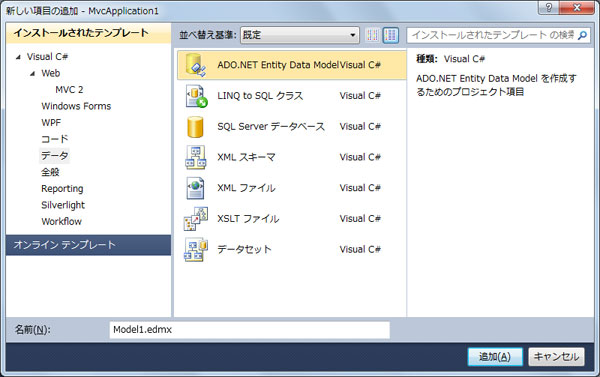

<strong>図 1 新しい項目の追加</strong>

開かれる Entity Data Model ウィザードを使って、データベースからモデルを作成していきます。モデルのコンテンツの選択では、「データベースから生成」を選択します。既にデータベース上にあるテーブルやビューなどを使うことができます。

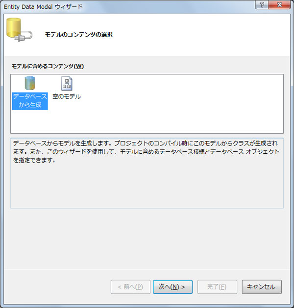

<strong>図 2 データベースから作成</strong>

データ接続の選択のページでは、「新しい接続」ボタンをクリックして、あらかじめ SQL Server 2008 上に作成しておいたデータベースに接続します。 
ここではローカル マシン (同じコンピューター) にインストールされているデータベースに接続するために、サーバー名に「(local)\sqlexpress」を入力しています。実際には、「(local)」の部分がコンピューター名、「sqlexpress」 がSQL Server のインスタンス名になります。 
データベース名は「mvcdb」としています。

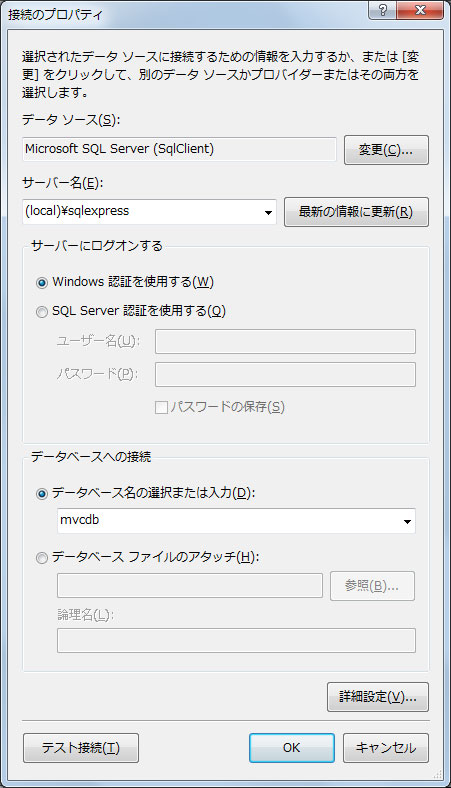

<strong>図 3 接続のプロパティ</strong>

接続のプロパティ ダイアログ ボックスの OK ボタンをクリックして、データ接続の選択に戻ると「エンティティ接続設定に名前を付けて Web.Config に保存」のテキスト ボックスに接続名が設定されます。ここでは「mvcdbEntities」となっています。 
この接続名は、コントローラーなどから、Entity Data Model を扱うときの名前になります。命名規則などある場合、ここで変更しておくとよいでしょう。

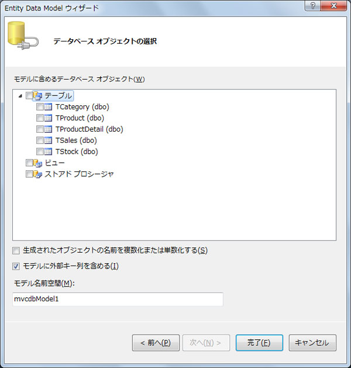

<strong>図 4 データベース オブジェクトの選択</strong>

次へボタンをクリックして、データベース オブジェクトの選択のページを開きます。 
このページで、モデルに含めるテーブルやビューなどを追加します。モデルに不要なテーブルがある場合は、必要なテーブルのみチェックを入れます。 
モデルの名前空間のテキスト ボックスには、リレーションなどで使われる名前空間の名前が入力されています。通常はこのままでよいでしょう。

完了ボタンをクリックすると次のように Entity Data Model が作成されます。

<strong>図 5 Entity Data Model</strong>

ASP.NET MVC のコントローラーやビューで Entity Data Model のモデル クラスを参照できるように、ここで一度ビルドをしておきます。

<a href="#top"> ページのトップへ</a>

<h2 id="03">3. 商品一覧を表示する</h2>

この Entity Data Model を使って、商品テーブル (TProduct) から一覧を表示させてみましょう。 
今回は、商品管理を想定して Admin という名前でコントローラーとビューを作成していきます。

まず、AdminController.cs (VB では AdminController.vb) を作成します。 
ソリューション エクスプローラーで Controllers フォルダーを右クリックして、「追加」&rarr;「コントローラー」を選択します。 
コントローラーの追加ダイアログ ボックスが開かれるので、コントローラー名を「AdminController」にします。 
コントローラーのメソッドを自動生成させるために、「Create、Update、Delete、および Detailes の各シナリオのアクション メソッドを追加する」にチェックを入れて、「追加」ボタンをクリックします。

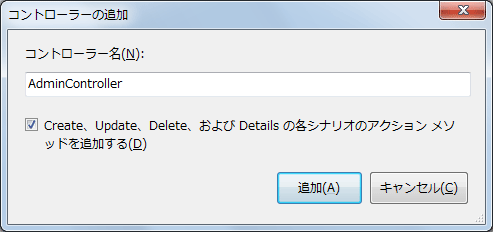

<strong>図 6 コントローラーの追加</strong>

コントローラーの Index メソッドのコードは次のように非常に簡単です。

&nbsp;

C#

スクリプトの編集

csharp

<pre id="codePreview" class="csharp">//&nbsp; //&nbsp;GET:&nbsp;/Admin/&nbsp; &nbsp; public&nbsp;ActionResult&nbsp;Index()&nbsp; {&nbsp; &nbsp;&nbsp;&nbsp;&nbsp;mvcdbEntities&nbsp;ent&nbsp;=&nbsp;new&nbsp;mvcdbEntities();&nbsp; &nbsp;&nbsp;&nbsp;&nbsp;var&nbsp;model&nbsp;=&nbsp;ent.TProduct;&nbsp; &nbsp;&nbsp;&nbsp;&nbsp;return&nbsp;View(model);&nbsp; }&nbsp; &nbsp; </pre>

&nbsp;

Visual Basic

スクリプトの編集

vb

<pre id="codePreview" class="vb">'&nbsp; '&nbsp;GET:&nbsp;/Admin&nbsp; &nbsp; Function&nbsp;Index()&nbsp;As&nbsp;ActionResult&nbsp; &nbsp;&nbsp;&nbsp;&nbsp;Dim&nbsp;ent&nbsp;As&nbsp;New&nbsp;mvcdbEntities&nbsp; &nbsp;&nbsp;&nbsp;&nbsp;Dim&nbsp;model&nbsp;=&nbsp;ent.TProduct&nbsp; &nbsp;&nbsp;&nbsp;&nbsp;Return&nbsp;View(model)&nbsp; End&nbsp;Function&nbsp; &nbsp; </pre>

エンティティの接続オブジェクト (mvcdbEntities) を作成した後で、商品テーブルの一覧 (TProduct) をモデルとして設定するだけです。実際のデータベースの接続やテーブルからの検索は、Entity Data Model 内で行われています。 
 
次に商品の一覧を表示するためのビュー (Index.aspx) を作成しましょう。 
ソリューション エクスプローラーで、Views フォルダー配下に「Admin」フォルダーを作成します。この Admin フォルダーを右クリックして、「追加」&rarr;「ビュー」を選択すると、ビューの追加ダイアログが開かれます。

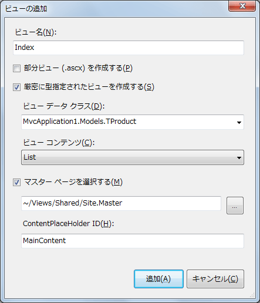

<strong>図 7 ビューの追加</strong>

ビュー名は「Index」にします。 
厳密に型指定されたビューを作成するにチェックを入れて、ビュー データ クラスで「MvcApplication1.Models.TProduct」を選択します。 
ビュー コンテンツは「List」を選択して、一覧が表示されるようにします。 
追加ボタンを押すと、Index.aspx が自動生成されるので、そのままビルドします。

実行した結果が次の図です。

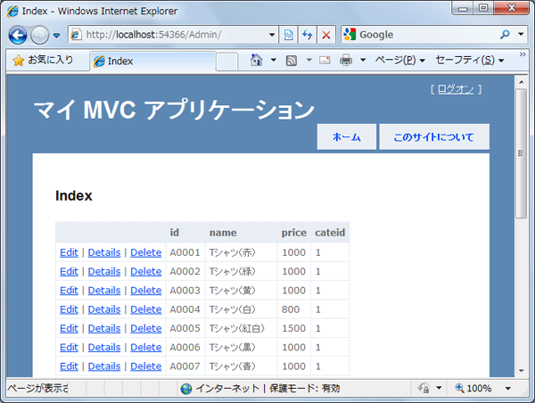

<strong>図 8 実行結果</strong>

Entity Data Model のクラスをそのまま ASP.NET MVC のモデルとして扱うと、Visual Studio 2010 でビューが自動生成できるので、非常に手早く商品の一覧のビューが作成できることがわかります。

<a href="#top"> ページのトップへ</a>

<h2 id="04">4. テーブルのリレーションを利用する</h2>

商品一覧の表示では、商品テーブル (TProduct) のデータだけを表示していました。 
このデータベースには、商品テーブルにカテゴリID (cateid) という列があります。このカテゴリ ID は、カテゴリ テーブル (TCategory) を参照することでカテゴリ名称を表示できる構成になっています。

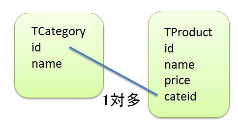

<strong>図 9 商品テーブルとカテゴリの関係</strong>

カテゴリ テーブルと商品テーブルは、1 対多の関係になります。このテーブル同士の関係を示すリレーションという機能をうまく使うと、カテゴリ ID (cateid) の表示をカテゴリ名にすることができます。

ダウンロードしたサンプルのデータベースには、外部キー (リレーション) が設定されていないので、次のスクリプトを動かして商品テーブル (TProduct) とカテゴリ テーブル (TCategory) の外部キーを設定します。 
外部キーの設定は <a href="http://www.microsoft.com/downloads/details.aspx?FamilyID=56ad557c-03e6-4369-9c1d-e81b33d8026b&displayLang=ja" target="_blank">
Microsoft SQL Server 2008 R2 Management Studio Express</a> などを使うとよいでしょう。

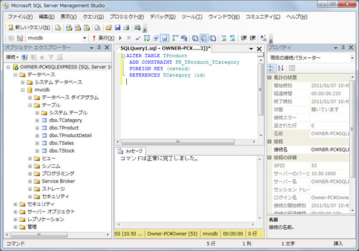

<strong>図 10 SQL Server 2008 R2 Management Studio Express</strong>

ALTER TABLE TProduct  
&nbsp;ADD CONSTRAINT FK_TProduct_TCategory  
&nbsp;FOREIGN KEY (cateid) 
&nbsp;REFERENCES TCategory (id)

新たに設定したリレーションを Entity Data Model に反映させましょう。 
Entity Data Model デザイナーを使うと、既存のデータベースからモデルを更新することが可能です。デザイナーの背景部分を右クリックして、「データベースからモデルを更新」をクリックします。

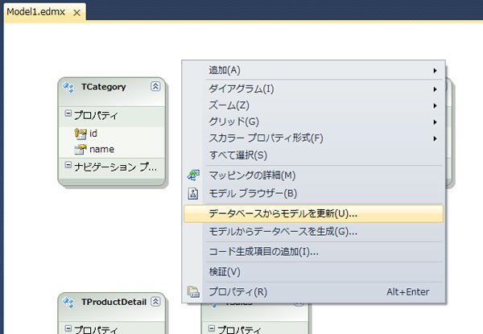

<strong>図 11 データベースからモデルを更新</strong>

更新ウィザード ダイアログ ボックスが開かれるので、データベース オブジェクトの選択から更新のタブをクリックします。 
完了ボタンをクリックすれば、目的のテーブル (TCategory、TProduct） のリレーションが更新されます。

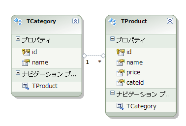

<strong>図 12 更新されたデザイナー</strong>

カテゴリ テーブル (TCategory) と商品テーブル (TProduct) のリレーションがデータベースから更新されていることがわかります。 
そして、商品テーブル (TProduct) のクラスのナビゲーション プロパティに「TCategory」が増えています。これにより、商品テーブルからプロパティとしてカテゴリ テーブルの各列を参照することができるようになりました。 
同じように、カテゴリ テーブル (TCategory) から商品テーブル (TProduct) の各列を参照することも可能です。 
コントローラーとビューで参照ができるように、一度ビルドをしておきます。

<a href="#top"> ページのトップへ</a>

<h2 id="05">5. ビューでカテゴリ名を表示させる</h2>

では、Index.aspx のビューを修正して、カテゴリ ID (cateid) の列のカテゴリ名を表示してみます。

ソリューション エクスプローラーで、Views/Admin/Index.aspx を開いて、「&lt;%: item.cateid %&gt;」の箇所を次のように変更します。

&lt;ソース(C#)&gt;

&lt;td&gt; 
&nbsp;&nbsp;&nbsp;&nbsp;&lt;%: item.TCategory.name %&gt; 
&lt;/td&gt;

TProduct エンティティの TCategory プロパティを使い、カテゴリの名称 (name) を表示させます。

これを実行した結果が次の図になります。

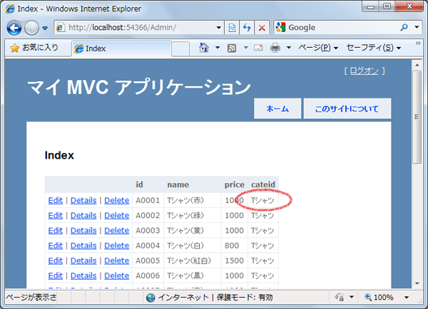

<strong>図 13 実行結果</strong>

このように、データベースのリレーションを利用すると、複数のテーブルを扱うことが容易になります。リレーション先のテーブルがナビゲーション プロパティとして利用できるため、コントローラーで LINQ の記述をするよりもコーディングミスを減らすことができるでしょう。

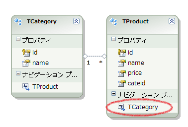

<strong>図 14 ナビゲーション プロパティ</strong>

<a href="#top"> ページのトップへ</a>

<h2 id="06">6.商品の新規作成と更新ページを作る</h2>

更に、商品の新規作成と更新のページを作ってみましょう。 
商品リストと同じように、Entity Data Model を使うと少ないコード行でできあがるので、やってみましょう。

ソリューション エクスプローラーで、AdminController.cs (VB では AdminController.vb) を開きます。 
次のように、2 つの Create メソッドを変更します。

C#

スクリプトの編集

csharp

<pre id="codePreview" class="csharp">//&nbsp; //&nbsp;GET:&nbsp;/Admin/Create&nbsp; &nbsp; public&nbsp;ActionResult&nbsp;Create()&nbsp; {&nbsp; &nbsp;&nbsp;&nbsp;&nbsp;mvcdbEntities&nbsp;ent&nbsp;=&nbsp;new&nbsp;mvcdbEntities();&nbsp; &nbsp;&nbsp;&nbsp;&nbsp;var&nbsp;model&nbsp;=&nbsp;new&nbsp;TProduct();&nbsp; &nbsp;&nbsp;&nbsp;&nbsp;return&nbsp;View(model);&nbsp; }&nbsp;&nbsp; &nbsp; //&nbsp; //&nbsp;POST:&nbsp;/Admin/Create&nbsp; &nbsp; [HttpPost]&nbsp; public&nbsp;ActionResult&nbsp;Create(FormCollection&nbsp;collection)&nbsp; {&nbsp; &nbsp;&nbsp;&nbsp;&nbsp;try&nbsp; &nbsp;&nbsp;&nbsp;&nbsp;{&nbsp; &nbsp;&nbsp;&nbsp;&nbsp;&nbsp;&nbsp;&nbsp;&nbsp;mvcdbEntities&nbsp;ent&nbsp;=&nbsp;new&nbsp;mvcdbEntities();&nbsp; &nbsp;&nbsp;&nbsp;&nbsp;&nbsp;&nbsp;&nbsp;&nbsp;//&nbsp;新しい商品を作成&nbsp; &nbsp;&nbsp;&nbsp;&nbsp;&nbsp;&nbsp;&nbsp;&nbsp;var&nbsp;model&nbsp;=&nbsp;new&nbsp;TProduct();&nbsp; &nbsp;&nbsp;&nbsp;&nbsp;&nbsp;&nbsp;&nbsp;&nbsp;//&nbsp;列の設定をする&nbsp; &nbsp;&nbsp;&nbsp;&nbsp;&nbsp;&nbsp;&nbsp;&nbsp;model.id&nbsp;=&nbsp;collection[&quot;id&quot;];&nbsp; &nbsp;&nbsp;&nbsp;&nbsp;&nbsp;&nbsp;&nbsp;&nbsp;model.name&nbsp;=&nbsp;collection[&quot;name&quot;];&nbsp; &nbsp;&nbsp;&nbsp;&nbsp;&nbsp;&nbsp;&nbsp;&nbsp;model.price&nbsp;=&nbsp;int.Parse(collection[&quot;price&quot;]);&nbsp; &nbsp;&nbsp;&nbsp;&nbsp;&nbsp;&nbsp;&nbsp;&nbsp;model.cateid&nbsp;=&nbsp;int.Parse(collection[&quot;cateid&quot;]);&nbsp; &nbsp;&nbsp;&nbsp;&nbsp;&nbsp;&nbsp;&nbsp;&nbsp;//&nbsp;テーブルに追加する&nbsp; &nbsp;&nbsp;&nbsp;&nbsp;&nbsp;&nbsp;&nbsp;&nbsp;ent.AddToTProduct(model);&nbsp; &nbsp;&nbsp;&nbsp;&nbsp;&nbsp;&nbsp;&nbsp;&nbsp;//&nbsp;更新処理&nbsp; &nbsp;&nbsp;&nbsp;&nbsp;&nbsp;&nbsp;&nbsp;&nbsp;ent.SaveChanges();&nbsp; &nbsp; &nbsp;&nbsp;&nbsp;&nbsp;&nbsp;&nbsp;&nbsp;&nbsp;return&nbsp;RedirectToAction(&quot;Index&quot;);&nbsp; &nbsp;&nbsp;&nbsp;&nbsp;}&nbsp; &nbsp;&nbsp;&nbsp;&nbsp;catch&nbsp; &nbsp;&nbsp;&nbsp;&nbsp;{&nbsp; &nbsp;&nbsp;&nbsp;&nbsp;&nbsp;&nbsp;&nbsp;&nbsp;return&nbsp;View();&nbsp; &nbsp;&nbsp;&nbsp;&nbsp;}&nbsp; }&nbsp; &nbsp; </pre>

&nbsp;

Visual Basic

スクリプトの編集|Remove

vb

<pre id="codePreview" class="vb">'&nbsp;
'&nbsp;GET:&nbsp;/Admin/Create&nbsp;
&nbsp;
Function&nbsp;Create()&nbsp;As&nbsp;ActionResult&nbsp;
&nbsp;&nbsp;&nbsp;&nbsp;Dim&nbsp;ent&nbsp;As&nbsp;New&nbsp;mvcdbEntities&nbsp;
&nbsp;&nbsp;&nbsp;&nbsp;Dim&nbsp;model&nbsp;=&nbsp;New&nbsp;TProduct&nbsp;
&nbsp;&nbsp;&nbsp;&nbsp;Return&nbsp;View(model)&nbsp;
End&nbsp;Function&nbsp;
&nbsp;
'&nbsp;
'&nbsp;POST:&nbsp;/Admin/Create&nbsp;
&nbsp;
&lt;HttpPost&gt;&nbsp;_&nbsp;
Function&nbsp;Create(ByVal&nbsp;collection&nbsp;As&nbsp;FormCollection)&nbsp;As&nbsp;ActionResult&nbsp;
Try&nbsp;
Dim&nbsp;ent&nbsp;As&nbsp;New&nbsp;mvcdbEntities&nbsp;
'&nbsp;新しい商品を作成&nbsp;
Dim&nbsp;model&nbsp;=&nbsp;New&nbsp;TProduct&nbsp;
'&nbsp;列の設定をする&nbsp;
model.id&nbsp;=&nbsp;collection(&quot;id&quot;)&nbsp;
model.name&nbsp;=&nbsp;collection(&quot;name&quot;)&nbsp;
model.price&nbsp;=&nbsp;Integer.Parse(collection(&quot;price&quot;))&nbsp;
model.cateid&nbsp;=&nbsp;Integer.Parse(collection(&quot;cateid&quot;))&nbsp;
'&nbsp;テーブルに追加する&nbsp;
ent.AddToTProduct(model)&nbsp;
'&nbsp;更新処理&nbsp;
ent.SaveChanges()&nbsp;
Return&nbsp;RedirectToAction(&quot;Index&quot;)&nbsp;
Catch&nbsp;
Return&nbsp;View()&nbsp;
End&nbsp;Try</pre>

最初の Create メソッドは、商品の新規作成をするために商品一覧 (Index.aspx) などのビューから Create.aspx ページを表示させたときの動作です。ここでは、TCategory オブジェクトを作成しているだけですが、本来は商品 ID を割り振ったり、価&#26684; (price) の初期値を設定しておくとよいでしょう。 
2 つめの Create メソッドは、新しい商品の情報をブラウザーで入力した後に、作成 (Create) ボタンをクリックしたときの動作です。 
ブラウザーのフォームで入力した値は、FormCollection コレクションに設定されます。数値のエラー処理や空白のチェックはここで行います。 
商品テーブルへの行の追加は AddToTProduct メソッドを使い、オブジェクトを追加します。 
追加したデータの反映は、接続設定エンティティの SaveChanges メソッドを使います。

次に、新規作成用のビューを作りましょう。 
ソリューション エクスプローラーで、Admin フォルダーを右クリックして、ビューの追加ダイアログを表示させます。

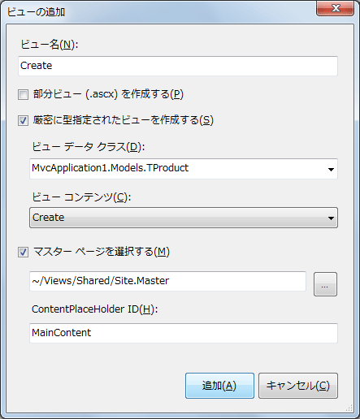

<strong>図 15 ビューの追加</strong>

ビュー名は「Create」にします。 
厳密に型指定されたビューを作成するにチェックを入れて、ビュー データ クラスで「MvcApplication1.Models.TProduct」を選択しておきます。 
ビュー コンテンツは「Create」を選択して、追加のためのテキスト ボックスが表示されるようにします。 
追加ボタンを押すと、Create.aspx が自動生成されるので、そのままビルドします。

実行した結果が次の図です。

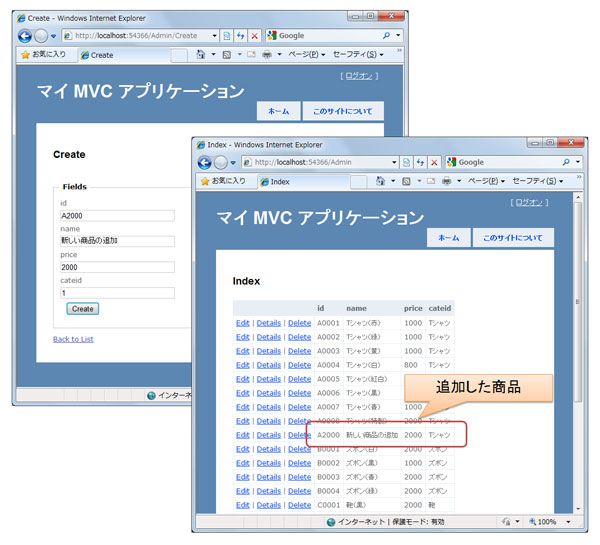

<strong>図 16 実行結果</strong>

商品 ID や商品名を入力して「Create」ボタンをクリックすると、データベースに新しい商品が追加されます。

同じように、商品情報を更新するページを作ってみましょう。

ソリューション エクスプローラーで、AdminController.cs (VB では AdminController.vb) を開き、次のように、2 つの Edit メソッドを変更します。

C#

スクリプトの編集

csharp

<pre id="codePreview" class="csharp">//&nbsp; //&nbsp;GET:&nbsp;/Admin/Edit/5&nbsp; &nbsp;&nbsp; public&nbsp;ActionResult&nbsp;Edit(string&nbsp;id)&nbsp; {&nbsp; &nbsp;&nbsp;&nbsp;&nbsp;mvcdbEntities&nbsp;ent&nbsp;=&nbsp;new&nbsp;mvcdbEntities();&nbsp; &nbsp;&nbsp;&nbsp;&nbsp;var&nbsp;model&nbsp;=&nbsp;ent.TProduct.Where(m&nbsp;=&gt;&nbsp;m.id&nbsp;==&nbsp;id).Single();&nbsp; &nbsp;&nbsp;&nbsp;&nbsp;return&nbsp;View(model);&nbsp; }&nbsp; &nbsp; //&nbsp; //&nbsp;POST:&nbsp;/Admin/Edit/5&nbsp; &nbsp; [HttpPost]&nbsp; public&nbsp;ActionResult&nbsp;Edit(string&nbsp;id,&nbsp;FormCollection&nbsp;collection)&nbsp; {&nbsp; &nbsp;&nbsp;&nbsp;&nbsp;try&nbsp; &nbsp;&nbsp;&nbsp;&nbsp;{&nbsp; &nbsp;&nbsp;&nbsp;&nbsp;&nbsp;&nbsp;&nbsp;&nbsp;mvcdbEntities&nbsp;ent&nbsp;=&nbsp;new&nbsp;mvcdbEntities();&nbsp; &nbsp;&nbsp;&nbsp;&nbsp;&nbsp;&nbsp;&nbsp;&nbsp;//&nbsp;指定した商品&nbsp;ID&nbsp;で検索する&nbsp; &nbsp;&nbsp;&nbsp;&nbsp;&nbsp;&nbsp;&nbsp;&nbsp;var&nbsp;model&nbsp;=&nbsp;ent.TProduct.Where(m&nbsp;=&gt;&nbsp;m.id&nbsp;==&nbsp;id).Single();&nbsp; &nbsp;&nbsp;&nbsp;&nbsp;&nbsp;&nbsp;&nbsp;&nbsp;//&nbsp;商品名と価&#26684;を変更する&nbsp; &nbsp;&nbsp;&nbsp;&nbsp;&nbsp;&nbsp;&nbsp;&nbsp;model.name&nbsp;=&nbsp;collection[&quot;name&quot;];&nbsp; &nbsp;&nbsp;&nbsp;&nbsp;&nbsp;&nbsp;&nbsp;&nbsp;model.price&nbsp;=&nbsp;int.Parse(collection[&quot;price&quot;]);&nbsp; &nbsp;&nbsp;&nbsp;&nbsp;&nbsp;&nbsp;&nbsp;&nbsp;//&nbsp;データベースを更新する&nbsp; &nbsp;&nbsp;&nbsp;&nbsp;&nbsp;&nbsp;&nbsp;&nbsp;ent.SaveChanges();&nbsp; &nbsp;&nbsp;&nbsp;&nbsp;&nbsp;&nbsp;&nbsp;&nbsp;&nbsp;&nbsp;&nbsp;&nbsp;&nbsp;&nbsp;&nbsp;&nbsp;&nbsp; &nbsp;&nbsp;&nbsp;&nbsp;&nbsp;&nbsp;&nbsp;&nbsp;return&nbsp;RedirectToAction(&quot;Index&quot;);&nbsp; &nbsp;&nbsp;&nbsp;&nbsp;}&nbsp; &nbsp;&nbsp;&nbsp;&nbsp;catch&nbsp; &nbsp;&nbsp;&nbsp;&nbsp;{&nbsp; &nbsp;&nbsp;&nbsp;&nbsp;&nbsp;&nbsp;&nbsp;&nbsp;return&nbsp;View();&nbsp; &nbsp;&nbsp;&nbsp;&nbsp;}&nbsp; }&nbsp; &nbsp; </pre>

&nbsp;

Visual Basic

スクリプトの編集

vb

<pre id="codePreview" class="vb">'&nbsp; '&nbsp;GET:&nbsp;/Admin/Edit/5&nbsp; &nbsp; Function&nbsp;Edit(ByVal&nbsp;id&nbsp;As&nbsp;String)&nbsp;As&nbsp;ActionResult&nbsp; &nbsp;&nbsp;&nbsp;&nbsp;Dim&nbsp;ent&nbsp;=&nbsp;New&nbsp;mvcdbEntities&nbsp; &nbsp;&nbsp;&nbsp;&nbsp;Dim&nbsp;model&nbsp;=&nbsp;ent.TProduct.Where(&nbsp; &nbsp;&nbsp;&nbsp;&nbsp;&nbsp;&nbsp;&nbsp;&nbsp;Function(m)&nbsp;m.id&nbsp;=&nbsp;id).Single()&nbsp; &nbsp;&nbsp;&nbsp;&nbsp;Return&nbsp;View(model)&nbsp; End&nbsp;Function&nbsp; &nbsp; '&nbsp; '&nbsp;POST:&nbsp;/Admin/Edit/5&nbsp; &nbsp; &lt;HttpPost()&gt;&nbsp;_&nbsp; Function&nbsp;Edit(ByVal&nbsp;id&nbsp;As&nbsp;String,&nbsp;ByVal&nbsp;collection&nbsp;As&nbsp;FormCollection)&nbsp;As&nbsp;ActionResult&nbsp; &nbsp;&nbsp;&nbsp;&nbsp;Try&nbsp; &nbsp;&nbsp;&nbsp;&nbsp;&nbsp;&nbsp;&nbsp;&nbsp;Dim&nbsp;ent&nbsp;As&nbsp;New&nbsp;mvcdbEntities&nbsp; &nbsp;&nbsp;&nbsp;&nbsp;&nbsp;&nbsp;&nbsp;&nbsp;'&nbsp;指定した商品&nbsp;ID&nbsp;で検索する&nbsp; &nbsp;&nbsp;&nbsp;&nbsp;&nbsp;&nbsp;&nbsp;&nbsp;Dim&nbsp;model&nbsp;=&nbsp;ent.TProduct.Where(&nbsp; &nbsp;&nbsp;&nbsp;&nbsp;&nbsp;&nbsp;&nbsp;&nbsp;&nbsp;&nbsp;&nbsp;&nbsp;Function(m)&nbsp;m.id&nbsp;=&nbsp;id).Single()&nbsp; &nbsp;&nbsp;&nbsp;&nbsp;&nbsp;&nbsp;&nbsp;&nbsp;'&nbsp;商品名と価&#26684;を変更する&nbsp; &nbsp;&nbsp;&nbsp;&nbsp;&nbsp;&nbsp;&nbsp;&nbsp;model.name&nbsp;=&nbsp;collection(&quot;name&quot;)&nbsp; &nbsp;&nbsp;&nbsp;&nbsp;&nbsp;&nbsp;&nbsp;&nbsp;model.price&nbsp;=&nbsp;Integer.Parse(collection(&quot;price&quot;))&nbsp; &nbsp;&nbsp;&nbsp;&nbsp;&nbsp;&nbsp;&nbsp;&nbsp;'&nbsp;データベースを更新する&nbsp; &nbsp;&nbsp;&nbsp;&nbsp;&nbsp;&nbsp;&nbsp;&nbsp;ent.SaveChanges()&nbsp; &nbsp;&nbsp;&nbsp;&nbsp;&nbsp;&nbsp;&nbsp;&nbsp;Return&nbsp;RedirectToAction(&quot;Index&quot;)&nbsp; &nbsp;&nbsp;&nbsp;&nbsp;Catch&nbsp; &nbsp;&nbsp;&nbsp;&nbsp;&nbsp;&nbsp;&nbsp;&nbsp;Return&nbsp;View()&nbsp; &nbsp;&nbsp;&nbsp;&nbsp;End&nbsp;Try&nbsp; End&nbsp;Function&nbsp; &nbsp; </pre>

&nbsp;

最初の Edit メソッドは、指定された商品 ID の情報を表示するためのアクション メソッドです。データベースから商品 ID で検索してモデルに設定しています。 
2 つめの Edit メソッドは、入力した商品情報を更新するメソッドです。 
データを更新するときは、商品 ID で検索した結果に対して値を設定します。その後でデータベースに反映するために SaveChanges メソッドを呼び出します。 
この部分の処理は、新規作成と同じように書くことができます。

さて、更新用のビューを作りましょう。 
ソリューション エクスプローラーで、Admin フォルダーを右クリックして、ビューの追加ダイアログを表示させます。

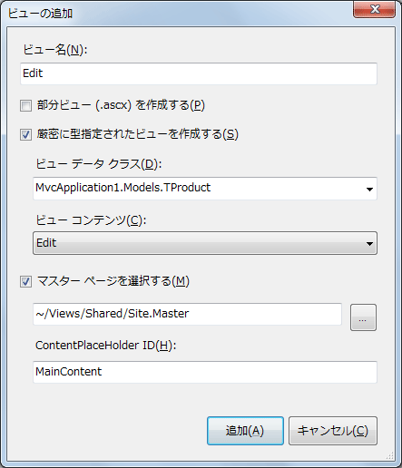

<strong>図 17 ビューの追加</strong>

ビュー名は「Edit」にします。 
ビュー データ クラスで「MvcApplication1.Models.TProduct」になります。 
ビュー コンテンツは「Edit」を選択して、更新のためのテキスト ボックスが表示されるようにします。 
追加ボタンを押すと、Edit.aspx が自動生成されるので、そのままビルドします。

実行した結果が次の図です。

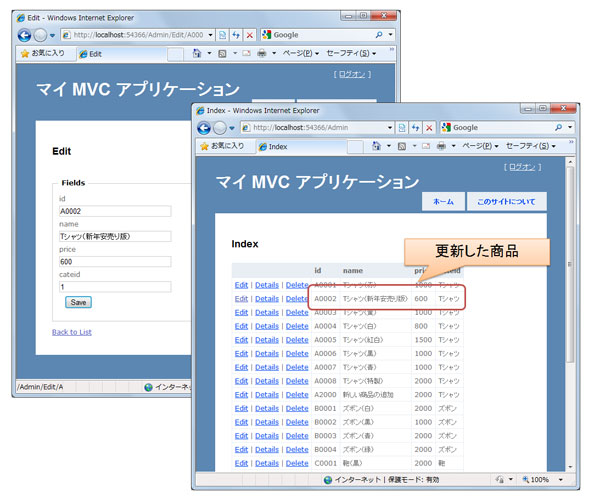

<strong>図 18 実行結果</strong>

このように、Entity Data Model を ASP.NET MVC アプリケーションと組み合わせて使うと、非常に簡単にデータベースを扱うことが可能です。 
ここでは、追加 (Create) と更新 (Edit) のページだけを作りましたが、削除 (Delete) や詳細 (Details) のページも同じように、自動生成の機能を使ってコードを作成することができます。

<a href="#top"> ページのトップへ</a>

<h2 id="07">7. 複雑なテーブルをEntity Data Model で扱う</h2>

では、もう少し入り組んだリレーションを持つテーブルの場合はどうでしょうか?

サンプルのデータベースにある在庫数 (TStock) と販売数 (TSales) のテーブルを連携させて、商品の在庫数と販売数を一覧にして表示させてみます。 
4 つのテーブル (TProduct、TCategory、TStock、TSales) の関係は、以下の ER 図になります。

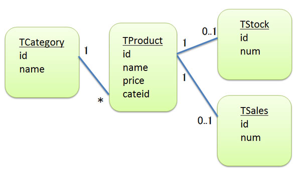

<strong>図 19 ER</strong>

商品テーブル (TProduct) とカテゴリ (TCategory) は内部結合になりますが、商品テーブル (TProduct) と在庫数 (TStock)、販売数 (TSales) は外部結合となります。

外部結合を設定するために、以下の 2 つのクエリを実行しておきます。

ALTER TABLE TStock 
&nbsp;ADD CONSTRAINT FK_TStock_TProduct  
&nbsp;FOREIGN KEY (id) 
&nbsp;REFERENCES TProduct (id) 
 
ALTER TABLE TSales 
&nbsp;ADD CONSTRAINT FK_TSales_TProduct 
&nbsp;FOREIGN KEY (id) 
&nbsp;REFERENCES TProduct (id)

Entity Data Model デザイナーでモデルを更新しておきます。

<strong>図 20 デザイナーの表示</strong>

商品テーブル (TProduct)、在庫数 (TStock)、販売数 (TSales)の 3 つのリレーションが更新されます。

カテゴリ名を一覧に表示したときのように、ナビゲーション プロパティを使って在庫数と販売数を一覧で表示させてみます。

まず、AdminController.cs (VB では AdminController.vb) に一覧を表示するための List アクション メソッドを追加します。

C#

スクリプトの編集

csharp

<pre id="codePreview" class="csharp">public&nbsp;ActionResult&nbsp;List()&nbsp; {&nbsp; &nbsp;&nbsp;&nbsp;&nbsp;mvcdbEntities&nbsp;ent&nbsp;=&nbsp;new&nbsp;mvcdbEntities();&nbsp; &nbsp;&nbsp;&nbsp;&nbsp;var&nbsp;model&nbsp;=&nbsp;ent.TProduct;&nbsp; &nbsp;&nbsp;&nbsp;&nbsp;return&nbsp;View(model);&nbsp; }&nbsp; &nbsp; </pre>

&nbsp;

Visual Basic

スクリプトの編集

vb

<pre id="codePreview" class="vb">Function&nbsp;List()&nbsp; &nbsp;&nbsp;&nbsp;&nbsp;Dim&nbsp;ent&nbsp;As&nbsp;New&nbsp;mvcdbEntities&nbsp; &nbsp;&nbsp;&nbsp;&nbsp;Dim&nbsp;model&nbsp;=&nbsp;ent.TProduct&nbsp; &nbsp;&nbsp;&nbsp;&nbsp;Return&nbsp;View(model)&nbsp; End&nbsp;Function&nbsp; &nbsp; </pre>

次に一覧を表示するためのビューを作成します。 
自動生成をした場合には、カテゴリ名、在庫数、販売数が表示されないので、ビュー (List.aspx) のコードを次のように修正します。

&lt;ソース (C#)&gt;

&lt;%@ Page Title=&quot;&quot; Language=&quot;C#&quot; MasterPageFile=&quot;~/Views/Shared/Site.Master&quot; Inherits=&quot;System.Web.Mvc.ViewPage&lt;IEnumerable&lt;MvcApplication1.Models.TProduct&gt;&gt;&quot; %&gt; 
 
&lt;asp:Content ID=&quot;Content1&quot; ContentPlaceHolderID=&quot;TitleContent&quot; runat=&quot;server&quot;&gt; 
&nbsp;&nbsp;&nbsp; List2 
&lt;/asp:Content&gt; 
 
&lt;asp:Content ID=&quot;Content2&quot; ContentPlaceHolderID=&quot;MainContent&quot; runat=&quot;server&quot;&gt; 
 
&nbsp;&nbsp;&nbsp; &lt;h2&gt;List2&lt;/h2&gt; 
 
&nbsp;&nbsp;&nbsp; &lt;table&gt; 
&nbsp;&nbsp;&nbsp;&nbsp;&nbsp;&nbsp;&nbsp; &lt;tr&gt; 
&nbsp;&nbsp;&nbsp;&nbsp;&nbsp;&nbsp;&nbsp;&nbsp;&nbsp;&nbsp;&nbsp; &lt;th&gt;&lt;/th&gt; 
&nbsp;&nbsp;&nbsp;&nbsp;&nbsp;&nbsp;&nbsp;&nbsp;&nbsp;&nbsp;&nbsp; &lt;th&gt; 
&nbsp;&nbsp;&nbsp;&nbsp;&nbsp;&nbsp;&nbsp;&nbsp;&nbsp;&nbsp;&nbsp;&nbsp;&nbsp;&nbsp;&nbsp; id 
&nbsp;&nbsp;&nbsp;&nbsp;&nbsp;&nbsp;&nbsp;&nbsp;&nbsp;&nbsp;&nbsp; &lt;/th&gt; 
&nbsp;&nbsp;&nbsp;&nbsp;&nbsp;&nbsp;&nbsp;&nbsp;&nbsp;&nbsp;&nbsp; &lt;th&gt; 
&nbsp;&nbsp;&nbsp;&nbsp;&nbsp;&nbsp;&nbsp;&nbsp;&nbsp;&nbsp;&nbsp;&nbsp;&nbsp;&nbsp;&nbsp; name 
&nbsp;&nbsp;&nbsp;&nbsp;&nbsp;&nbsp;&nbsp;&nbsp;&nbsp;&nbsp;&nbsp; &lt;/th&gt; 
&nbsp;&nbsp;&nbsp;&nbsp;&nbsp;&nbsp;&nbsp;&nbsp;&nbsp;&nbsp;&nbsp; &lt;th&gt; 
&nbsp;&nbsp;&nbsp;&nbsp;&nbsp;&nbsp;&nbsp;&nbsp;&nbsp;&nbsp;&nbsp;&nbsp;&nbsp;&nbsp;&nbsp; price 
&nbsp;&nbsp;&nbsp;&nbsp;&nbsp;&nbsp;&nbsp;&nbsp;&nbsp;&nbsp;&nbsp; &lt;/th&gt; 
&nbsp;&nbsp;&nbsp;&nbsp;&nbsp;&nbsp;&nbsp;&nbsp;&nbsp;&nbsp;&nbsp; &lt;th&gt; 
&nbsp;&nbsp;&nbsp;&nbsp;&nbsp;&nbsp;&nbsp;&nbsp;&nbsp;&nbsp;&nbsp;&nbsp;&nbsp;&nbsp;&nbsp; cateid 
&nbsp;&nbsp;&nbsp;&nbsp;&nbsp;&nbsp;&nbsp;&nbsp;&nbsp;&nbsp;&nbsp; &lt;/th&gt; 
&nbsp;&nbsp;&nbsp;&nbsp;&nbsp;&nbsp;&nbsp;&nbsp;&nbsp;&nbsp;&nbsp; &lt;th&gt; 
&nbsp;&nbsp;&nbsp;&nbsp;&nbsp;&nbsp;&nbsp;&nbsp;&nbsp;&nbsp;&nbsp;&nbsp;&nbsp;&nbsp;&nbsp; stock 
&nbsp;&nbsp;&nbsp;&nbsp;&nbsp;&nbsp;&nbsp;&nbsp;&nbsp;&nbsp;&nbsp; &lt;/th&gt; 
&nbsp;&nbsp;&nbsp;&nbsp;&nbsp;&nbsp;&nbsp;&nbsp;&nbsp;&nbsp;&nbsp; &lt;th&gt; 
&nbsp;&nbsp;&nbsp; &nbsp;&nbsp;&nbsp; &nbsp;&nbsp;&nbsp; &nbsp;&nbsp;&nbsp; sales 
&nbsp;&nbsp;&nbsp;&nbsp;&nbsp;&nbsp;&nbsp;&nbsp;&nbsp;&nbsp;&nbsp; &lt;/th&gt; 
&nbsp;&nbsp;&nbsp;&nbsp;&nbsp;&nbsp;&nbsp; &lt;/tr&gt; 
 
&nbsp;&nbsp;&nbsp; &lt;% foreach (var item in Model) { %&gt; 
&nbsp;&nbsp;&nbsp;  
&nbsp;&nbsp;&nbsp;&nbsp;&nbsp;&nbsp;&nbsp; &lt;tr&gt; 
&nbsp;&nbsp;&nbsp;&nbsp;&nbsp;&nbsp;&nbsp;&nbsp;&nbsp;&nbsp;&nbsp; &lt;td&gt; 
&nbsp;&nbsp;&nbsp;&nbsp;&nbsp;&nbsp;&nbsp;&nbsp;&nbsp;&nbsp;&nbsp;&nbsp;&nbsp;&nbsp;&nbsp; &lt;%: Html.ActionLink(&quot;Edit&quot;, &quot;Edit&quot;, new { id=item.id }) %&gt; | 
&nbsp;&nbsp;&nbsp;&nbsp;&nbsp;&nbsp;&nbsp;&nbsp;&nbsp;&nbsp;&nbsp;&nbsp;&nbsp;&nbsp;&nbsp; &lt;%: Html.ActionLink(&quot;Details&quot;, &quot;Details&quot;, new { id=item.id })%&gt; | 
&nbsp;&nbsp;&nbsp;&nbsp;&nbsp;&nbsp;&nbsp;&nbsp;&nbsp;&nbsp;&nbsp;&nbsp;&nbsp;&nbsp;&nbsp; &lt;%: Html.ActionLink(&quot;Delete&quot;, &quot;Delete&quot;, new { id=item.id })%&gt; 
&nbsp;&nbsp;&nbsp;&nbsp;&nbsp;&nbsp;&nbsp;&nbsp;&nbsp;&nbsp;&nbsp; &lt;/td&gt; 
&nbsp;&nbsp;&nbsp;&nbsp;&nbsp;&nbsp;&nbsp;&nbsp;&nbsp;&nbsp;&nbsp; &lt;td&gt; 
&nbsp;&nbsp;&nbsp;&nbsp;&nbsp;&nbsp;&nbsp;&nbsp;&nbsp;&nbsp;&nbsp;&nbsp;&nbsp;&nbsp;&nbsp; &lt;%: item.id %&gt; 
&nbsp;&nbsp;&nbsp;&nbsp;&nbsp;&nbsp;&nbsp;&nbsp;&nbsp;&nbsp;&nbsp; &lt;/td&gt; 
&nbsp;&nbsp;&nbsp;&nbsp;&nbsp;&nbsp;&nbsp;&nbsp;&nbsp;&nbsp;&nbsp; &lt;td&gt; 
&nbsp;&nbsp;&nbsp;&nbsp;&nbsp;&nbsp;&nbsp;&nbsp;&nbsp;&nbsp;&nbsp;&nbsp;&nbsp;&nbsp;&nbsp; &lt;%: item.name %&gt; 
&nbsp;&nbsp;&nbsp;&nbsp;&nbsp;&nbsp;&nbsp;&nbsp;&nbsp;&nbsp;&nbsp; &lt;/td&gt; 
&nbsp;&nbsp;&nbsp;&nbsp;&nbsp;&nbsp;&nbsp;&nbsp;&nbsp;&nbsp;&nbsp; &lt;td&gt; 
&nbsp;&nbsp;&nbsp;&nbsp;&nbsp;&nbsp;&nbsp;&nbsp;&nbsp;&nbsp;&nbsp;&nbsp;&nbsp;&nbsp;&nbsp; &lt;%: item.price %&gt; 
&nbsp;&nbsp;&nbsp;&nbsp;&nbsp;&nbsp;&nbsp;&nbsp;&nbsp;&nbsp;&nbsp; &lt;/td&gt; 
&nbsp;&nbsp;&nbsp;&nbsp;&nbsp;&nbsp;&nbsp;&nbsp;&nbsp;&nbsp;&nbsp; &lt;td&gt; 
&nbsp;&nbsp;&nbsp;&nbsp;&nbsp;&nbsp;&nbsp;&nbsp;&nbsp;&nbsp;&nbsp;&nbsp;&nbsp;&nbsp;&nbsp; &lt;%: item.cateid %&gt; 
&nbsp;&nbsp;&nbsp;&nbsp;&nbsp;&nbsp;&nbsp;&nbsp;&nbsp;&nbsp;&nbsp; &lt;/td&gt; 
&nbsp;&nbsp;&nbsp;&nbsp;&nbsp;&nbsp;&nbsp;&nbsp;&nbsp;&nbsp;&nbsp; &lt;td&gt; 
&nbsp;&nbsp;&nbsp;&nbsp;&nbsp;&nbsp;&nbsp;&nbsp;&nbsp;&nbsp;&nbsp;&nbsp;&nbsp;&nbsp;&nbsp; &lt;%: item.TCategory.name %&gt; 
&nbsp;&nbsp;&nbsp;&nbsp;&nbsp;&nbsp;&nbsp;&nbsp;&nbsp;&nbsp;&nbsp; &lt;/td&gt; 
&nbsp;&nbsp;&nbsp;&nbsp;&nbsp;&nbsp;&nbsp;&nbsp;&nbsp;&nbsp;&nbsp; &lt;td&gt; 
&nbsp;&nbsp;&nbsp;&nbsp;&nbsp;&nbsp;&nbsp;&nbsp;&nbsp;&nbsp;&nbsp;&nbsp;&nbsp;&nbsp;&nbsp; &lt;%: item.TStock.num %&gt; 
&nbsp;&nbsp;&nbsp;&nbsp;&nbsp;&nbsp;&nbsp;&nbsp;&nbsp;&nbsp;&nbsp; &lt;/td&gt; 
&nbsp;&nbsp;&nbsp;&nbsp;&nbsp;&nbsp;&nbsp;&nbsp;&nbsp;&nbsp;&nbsp; &lt;td&gt; 
&nbsp;&nbsp;&nbsp;&nbsp;&nbsp;&nbsp;&nbsp;&nbsp;&nbsp;&nbsp;&nbsp;&nbsp;&nbsp;&nbsp;&nbsp; &lt;%: item.TSales.num %&gt; 
&nbsp;&nbsp;&nbsp;&nbsp;&nbsp;&nbsp;&nbsp;&nbsp;&nbsp;&nbsp;&nbsp; &lt;/td&gt; 
&nbsp;&nbsp;&nbsp;&nbsp;&nbsp;&nbsp;&nbsp; &lt;/tr&gt; 
&nbsp;&nbsp;&nbsp;  
&nbsp;&nbsp;&nbsp; &lt;% } %&gt; 
 
&nbsp;&nbsp;&nbsp; &lt;/table&gt; 
 
&nbsp;&nbsp;&nbsp; &lt;p&gt; 
&nbsp;&nbsp;&nbsp;&nbsp;&nbsp;&nbsp;&nbsp; &lt;%: Html.ActionLink(&quot;Create New&quot;, &quot;Create&quot;) %&gt; 
&nbsp;&nbsp;&nbsp; &lt;/p&gt; 
 
&lt;/asp:Content&gt;

&lt;ソース (VB)&gt;

&lt;%@ Page Title=&quot;&quot; Language=&quot;VB&quot; MasterPageFile=&quot;~/Views/Shared/Site.Master&quot; Inherits=&quot;<a class="libraryLink" href="http://msdn.microsoft.com/ja-JP/library/System.Web.Mvc.ViewPage.aspx" target="_blank" title="Auto generated link to System.Web.Mvc.ViewPage">System.Web.Mvc.ViewPage</a>(Of IEnumerable (Of MvcApplication1.TProduct))&quot; %&gt; 
 
&lt;asp:Content ID=&quot;Content1&quot; ContentPlaceHolderID=&quot;TitleContent&quot; runat=&quot;server&quot;&gt; 
&nbsp;&nbsp;&nbsp; List 
&lt;/asp:Content&gt; 
 
&lt;asp:Content ID=&quot;Content2&quot; ContentPlaceHolderID=&quot;MainContent&quot; runat=&quot;server&quot;&gt; 
 
&nbsp;&nbsp;&nbsp; &lt;h2&gt;List&lt;/h2&gt; 
 
&nbsp;&nbsp;&nbsp; &lt;p&gt; 
&nbsp;&nbsp;&nbsp;&nbsp;&nbsp;&nbsp;&nbsp; &lt;%: Html.ActionLink(&quot;Create New&quot;, &quot;Create&quot;)%&gt; 
&nbsp;&nbsp;&nbsp; &lt;/p&gt; 
&nbsp;&nbsp;&nbsp;  
&nbsp;&nbsp;&nbsp; &lt;table&gt; 
&nbsp;&nbsp;&nbsp;&nbsp;&nbsp;&nbsp;&nbsp; &lt;tr&gt; 
&nbsp;&nbsp;&nbsp;&nbsp;&nbsp;&nbsp;&nbsp;&nbsp;&nbsp;&nbsp;&nbsp; &lt;th&gt;&lt;/th&gt; 
&nbsp;&nbsp;&nbsp;&nbsp;&nbsp;&nbsp;&nbsp;&nbsp;&nbsp;&nbsp;&nbsp; &lt;th&gt; 
&nbsp;&nbsp;&nbsp;&nbsp;&nbsp;&nbsp;&nbsp;&nbsp;&nbsp;&nbsp;&nbsp;&nbsp;&nbsp;&nbsp;&nbsp; id 
&nbsp;&nbsp;&nbsp;&nbsp;&nbsp;&nbsp;&nbsp;&nbsp;&nbsp;&nbsp;&nbsp; &lt;/th&gt; 
&nbsp;&nbsp;&nbsp;&nbsp;&nbsp;&nbsp;&nbsp;&nbsp;&nbsp;&nbsp;&nbsp; &lt;th&gt; 
&nbsp;&nbsp;&nbsp;&nbsp;&nbsp;&nbsp;&nbsp;&nbsp;&nbsp;&nbsp;&nbsp;&nbsp;&nbsp;&nbsp;&nbsp; name 
&nbsp;&nbsp;&nbsp;&nbsp;&nbsp;&nbsp;&nbsp;&nbsp;&nbsp;&nbsp;&nbsp; &lt;/th&gt; 
&nbsp;&nbsp;&nbsp;&nbsp;&nbsp;&nbsp;&nbsp;&nbsp;&nbsp;&nbsp;&nbsp; &lt;th&gt; 
&nbsp;&nbsp;&nbsp;&nbsp;&nbsp;&nbsp;&nbsp;&nbsp;&nbsp;&nbsp;&nbsp;&nbsp;&nbsp;&nbsp;&nbsp; price 
&nbsp;&nbsp;&nbsp;&nbsp;&nbsp;&nbsp;&nbsp;&nbsp;&nbsp;&nbsp;&nbsp; &lt;/th&gt; 
&nbsp;&nbsp;&nbsp;&nbsp;&nbsp;&nbsp;&nbsp;&nbsp;&nbsp;&nbsp;&nbsp; &lt;th&gt; 
&nbsp;&nbsp;&nbsp;&nbsp;&nbsp;&nbsp;&nbsp;&nbsp;&nbsp;&nbsp;&nbsp;&nbsp;&nbsp;&nbsp;&nbsp; cateid 
&nbsp;&nbsp;&nbsp;&nbsp;&nbsp;&nbsp;&nbsp;&nbsp;&nbsp;&nbsp;&nbsp; &lt;/th&gt; 
&nbsp;&nbsp;&nbsp;&nbsp;&nbsp;&nbsp;&nbsp;&nbsp;&nbsp;&nbsp;&nbsp; &lt;th&gt; 
&nbsp;&nbsp;&nbsp;&nbsp;&nbsp;&nbsp;&nbsp;&nbsp;&nbsp;&nbsp;&nbsp;&nbsp;&nbsp;&nbsp;&nbsp; stock 
&nbsp;&nbsp;&nbsp;&nbsp;&nbsp;&nbsp;&nbsp;&nbsp;&nbsp;&nbsp;&nbsp; &lt;/th&gt; 
&nbsp;&nbsp;&nbsp;&nbsp;&nbsp;&nbsp;&nbsp;&nbsp;&nbsp;&nbsp;&nbsp; &lt;th&gt; 
&nbsp;&nbsp;&nbsp;&nbsp;&nbsp;&nbsp;&nbsp;&nbsp;&nbsp;&nbsp;&nbsp;&nbsp;&nbsp;&nbsp;&nbsp; sales 
&nbsp;&nbsp;&nbsp;&nbsp;&nbsp;&nbsp;&nbsp;&nbsp;&nbsp;&nbsp;&nbsp; &lt;/th&gt; 
&nbsp;&nbsp;&nbsp;&nbsp;&nbsp;&nbsp;&nbsp; &lt;/tr&gt; 
 
&nbsp;&nbsp;&nbsp; &lt;% For Each item In Model%&gt; 
&nbsp;&nbsp;&nbsp;  
&nbsp;&nbsp;&nbsp;&nbsp;&nbsp;&nbsp;&nbsp; &lt;tr&gt; 
&nbsp;&nbsp;&nbsp;&nbsp;&nbsp;&nbsp;&nbsp;&nbsp;&nbsp;&nbsp;&nbsp; &lt;td&gt; 
&nbsp;&nbsp;&nbsp;&nbsp;&nbsp;&nbsp;&nbsp;&nbsp;&nbsp;&nbsp;&nbsp;&nbsp;&nbsp;&nbsp;&nbsp; &lt;%: Html.ActionLink(&quot;Edit&quot;, &quot;Edit&quot;, New With {.id = item.id})%&gt; | 
&nbsp;&nbsp;&nbsp;&nbsp;&nbsp;&nbsp;&nbsp;&nbsp;&nbsp;&nbsp;&nbsp;&nbsp;&nbsp;&nbsp;&nbsp; &lt;%: Html.ActionLink(&quot;Details&quot;, &quot;Details&quot;, New With {.id = item.id})%&gt; | 
&nbsp;&nbsp;&nbsp;&nbsp;&nbsp;&nbsp;&nbsp;&nbsp;&nbsp;&nbsp;&nbsp;&nbsp;&nbsp;&nbsp;&nbsp; &lt;%: Html.ActionLink(&quot;Delete&quot;, &quot;Delete&quot;, New With {.id = item.id})%&gt; 
&nbsp;&nbsp;&nbsp;&nbsp;&nbsp;&nbsp;&nbsp;&nbsp;&nbsp;&nbsp;&nbsp; &lt;/td&gt; 
&nbsp;&nbsp;&nbsp;&nbsp;&nbsp;&nbsp;&nbsp;&nbsp;&nbsp;&nbsp;&nbsp; &lt;td&gt; 
&nbsp;&nbsp;&nbsp;&nbsp;&nbsp;&nbsp;&nbsp;&nbsp;&nbsp;&nbsp;&nbsp;&nbsp;&nbsp;&nbsp;&nbsp; &lt;%: item.id %&gt; 
&nbsp;&nbsp;&nbsp;&nbsp;&nbsp;&nbsp;&nbsp;&nbsp;&nbsp;&nbsp;&nbsp; &lt;/td&gt; 
&nbsp;&nbsp;&nbsp;&nbsp;&nbsp;&nbsp;&nbsp;&nbsp;&nbsp;&nbsp;&nbsp; &lt;td&gt; 
&nbsp;&nbsp;&nbsp;&nbsp;&nbsp;&nbsp;&nbsp;&nbsp;&nbsp;&nbsp;&nbsp;&nbsp;&nbsp;&nbsp;&nbsp; &lt;%: item.name %&gt; 
&nbsp;&nbsp;&nbsp;&nbsp;&nbsp;&nbsp;&nbsp;&nbsp;&nbsp;&nbsp;&nbsp; &lt;/td&gt; 
&nbsp;&nbsp;&nbsp;&nbsp;&nbsp;&nbsp;&nbsp;&nbsp;&nbsp;&nbsp;&nbsp; &lt;td&gt; 
&nbsp;&nbsp;&nbsp;&nbsp;&nbsp;&nbsp;&nbsp;&nbsp;&nbsp;&nbsp;&nbsp;&nbsp;&nbsp;&nbsp;&nbsp; &lt;%: item.price %&gt; 
&nbsp;&nbsp;&nbsp;&nbsp;&nbsp;&nbsp;&nbsp;&nbsp;&nbsp;&nbsp;&nbsp; &lt;/td&gt; 
&nbsp;&nbsp;&nbsp;&nbsp;&nbsp;&nbsp;&nbsp;&nbsp;&nbsp;&nbsp;&nbsp; &lt;td&gt; 
&nbsp;&nbsp;&nbsp;&nbsp;&nbsp;&nbsp;&nbsp;&nbsp;&nbsp;&nbsp;&nbsp;&nbsp;&nbsp;&nbsp;&nbsp; &lt;%: item.TCategory.name %&gt; 
&nbsp;&nbsp;&nbsp;&nbsp;&nbsp;&nbsp;&nbsp;&nbsp;&nbsp;&nbsp;&nbsp; &lt;/td&gt; 
&nbsp;&nbsp;&nbsp;&nbsp;&nbsp;&nbsp;&nbsp;&nbsp;&nbsp;&nbsp;&nbsp; &lt;td&gt; 
&nbsp;&nbsp;&nbsp;&nbsp;&nbsp;&nbsp;&nbsp;&nbsp;&nbsp;&nbsp;&nbsp;&nbsp;&nbsp;&nbsp;&nbsp; &lt;%: item.TStock.num %&gt; 
&nbsp;&nbsp;&nbsp;&nbsp;&nbsp;&nbsp;&nbsp;&nbsp;&nbsp;&nbsp;&nbsp; &lt;/td&gt; 
&nbsp;&nbsp;&nbsp;&nbsp;&nbsp;&nbsp;&nbsp;&nbsp;&nbsp;&nbsp;&nbsp; &lt;td&gt; 
&nbsp;&nbsp;&nbsp;&nbsp;&nbsp;&nbsp;&nbsp;&nbsp;&nbsp;&nbsp;&nbsp;&nbsp;&nbsp;&nbsp;&nbsp; &lt;%: item.TSales.num %&gt; 
&nbsp;&nbsp;&nbsp;&nbsp;&nbsp;&nbsp;&nbsp;&nbsp;&nbsp;&nbsp;&nbsp; &lt;/td&gt; 
&nbsp;&nbsp;&nbsp;&nbsp;&nbsp;&nbsp;&nbsp; &lt;/tr&gt; 
&nbsp;&nbsp;&nbsp;  
&nbsp;&nbsp;&nbsp; &lt;% Next%&gt; 
 
&nbsp;&nbsp;&nbsp; &lt;/table&gt; 
 
&lt;/asp:Content&gt;

実はそのままビルドして実行すると、次の図のようにエラーになります。

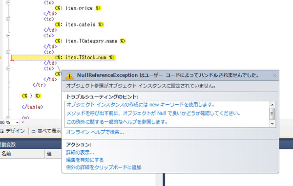

<strong>図 21-1 エラー表示</strong>

ナビゲーション プロパティの TStock と TSales は外部結合のために、結合先のテーブルに行がないときには null (VB の場合は Nothing) となります。このために 例外 (NullReferenceException) が発生しています。 
 
List.aspx の例外が発生している箇所を次のように修正します。

&lt;ソース(C#)&gt;

&lt;td&gt; 
&nbsp;&nbsp;&nbsp; &lt;%: (item.TStock == null)? 0: item.TStock.num %&gt; 
&lt;/td&gt; 
&lt;td&gt; 
&nbsp;&nbsp;&nbsp; &lt;%: (item.TSales == null)? 0: item.TSales.num %&gt; 
&lt;/td&gt;

&lt;ソース(VB)&gt;

&lt;td&gt; 
&lt;%: If(item.TStock Is Nothing, 0, item.TStock.num)%&gt; 
&lt;/td&gt; 
&lt;td&gt; 
&lt;%: If(item.TStock Is Nothing, 0, item.TSales.num)%&gt; 
&lt;/td&gt;

あらかじめ、参照先のナビゲーション プロパティが null (VB では Nothing) でないことをチェックして表示させます。 
こうすると、次のように正常に一覧が表示されます。

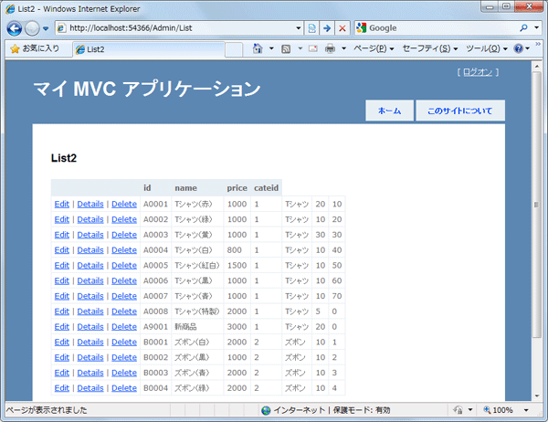

<strong>図 21-2 実行結果</strong>

ただし、このようにビューでプロパティの値を判別するとコーディング ミスが多くなりがちです。 
また、プロパティの値のチェックがビューに散在するために、テーブルの仕様が変更になった場合、多くのビューを変更しなければいけません。

このような場合は、データベースであらかじめ View を作成するとよいでしょう。 
次のような VProduct という View を作成しておきます。

CREATE VIEW VProduct AS  
SELECT  
&nbsp;TProduct.id,  
&nbsp;TProduct.name,  
&nbsp;TProduct.price,  
&nbsp;TProduct.cateid, 
&nbsp;TCategory.name AS cate, 
&nbsp;ISNULL(TStock.num,0) AS stock,  
&nbsp;ISNULL(TSales.num,0) AS sale 
FROM  
TProduct inner join TCategory on TProduct.cateid = TCategory.id 
&nbsp;&nbsp;&nbsp;&nbsp;&nbsp;&nbsp;&nbsp;&nbsp;left outer join TStock on TProduct.id = TStock.id 
&nbsp;&nbsp;&nbsp;&nbsp;&nbsp;&nbsp;&nbsp;&nbsp;left outer join TSales on TProduct.id = TSales.id

在庫数 (TStock) と販売数 (TSales)&nbsp; のテーブル対して、あらかじめ外部結合をした View を作成します。 
列が見つからない場合には、在庫数/販売数を 0 に設定します。 
 
View を作成した状態で、再び Entity Data Model を更新します。 
更新ウィザード ダイアログ ボックスでは、追加のタブを選択してビューの VProduct にチェックを入れます。

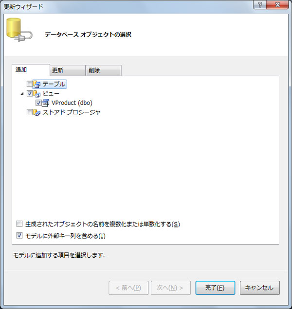

<strong>図 22 更新ウィザード</strong>

完了ボタンをクリックすると、VProduct が Entity Data Model デザイナーに VProduct が追加されます。

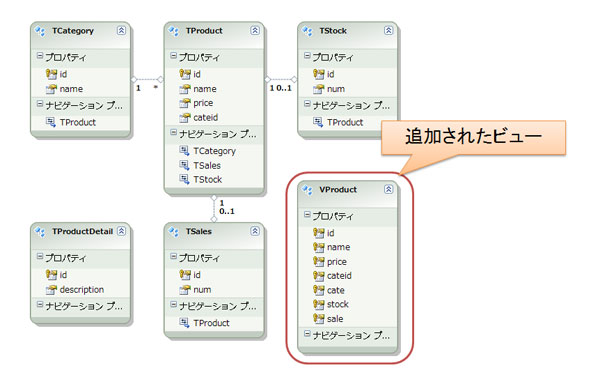

<strong>図 23 デザイナー</strong>

一度ビルドをした後に、コントローラーの List メソッドを以下のように修正します。

C#

スクリプトの編集

csharp

<pre id="codePreview" class="csharp">public&nbsp;ActionResult&nbsp;List()&nbsp; {&nbsp; &nbsp;&nbsp;&nbsp;&nbsp;mvcdbEntities&nbsp;ent&nbsp;=&nbsp;new&nbsp;mvcdbEntities();&nbsp; &nbsp;&nbsp;&nbsp;&nbsp;var&nbsp;model&nbsp;=&nbsp;ent.VProduct;&nbsp; &nbsp;&nbsp;&nbsp;&nbsp;return&nbsp;View(model);&nbsp; }&nbsp; &nbsp; </pre>

&nbsp;

Visual Basic

スクリプトの編集

vb

<pre id="codePreview" class="js">Function&nbsp;List()&nbsp; &nbsp;&nbsp;&nbsp;&nbsp;Dim&nbsp;ent&nbsp;As&nbsp;New&nbsp;mvcdbEntities&nbsp; &nbsp;&nbsp;&nbsp;&nbsp;Dim&nbsp;model&nbsp;=&nbsp;ent.VProduct&nbsp; &nbsp;&nbsp;&nbsp;&nbsp;Return&nbsp;View(model)&nbsp; End&nbsp;Function&nbsp; &nbsp; </pre>

次に List.aspx を削除して、再びビューを作成します。 
ビューの追加ダイアログ ボックスでは、ビュー データ クラスを「MvcApplication1.Models.VProduct」に設定します。

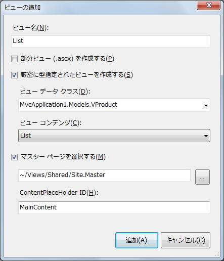

<strong>図 24 ビューの追加</strong>

そのままビルドをして実行した結果が次の図になります。

<strong>図 25 実行結果</strong>

このように Entity Data Model では、テーブルだけではなくデータベースのビューも追加することができます。複数のテーブルからリストを表示する場合はデータベースのビューを活用するとよいでしょう。 
同じように、ストアド プロシージャを Entity Data Model から使うこともできます。データベースへの更新処理をストアド プロシージャに記述することで、データの詳細構造をデータベース側に分離させ、ASP.NET MVC のコントローラーやビューへの影響を少なくすることができます。

<a href="#top"> ページのトップへ</a>

<h2 id="08">8. おわりに</h2>

いかがだったでしょうか。 
ADO.NET Entity Framework には、データベースからモデルの更新 (あるいはモデルからデータベースへの更新) の機能が加わって、よりデータベースを扱いやすくなっています。 
ASP.NET MVC と組み合わせでは、Entity Data Model をそのままモデルとして利用ができ、コントローラーやビューのコードをウィザードを使って自動生成させることが可能です。 
テーブルに対する CRUD 処理が一通り揃っているので、管理用のテーブルをそのまま編集する場合など、ぜひ活用してみてください。

<table>
<tbody>
<tr>
<td></td>
<td></td>
<td>
<ul>
<li>もっと他のコンテンツを見る &gt;&gt; <a href="http://msdn.microsoft.com/ja-jp/asp.net/gg490787" target="_blank">
連載! ASP.NET MVC アプリケーション開発入門一覧へ</a> </li><li>もっと他のレシピを見る &gt;&gt; <a href="http://msdn.microsoft.com/ja-jp/samplecode.recipe" target="_blank">
Code Recipe へ</a> </li><li>もっと ASP.NET の情報を見る &gt;&gt; <a href="http://msdn.microsoft.com/ja-jp/asp.net/" target="_blank">
ASP.NET デベロッパーセンターへ</a> </li></ul>
</td>
</tr>
</tbody>
</table>

<a href="#top">ページのトップへ</a>

