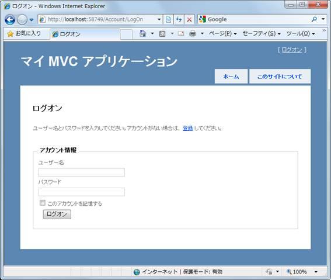
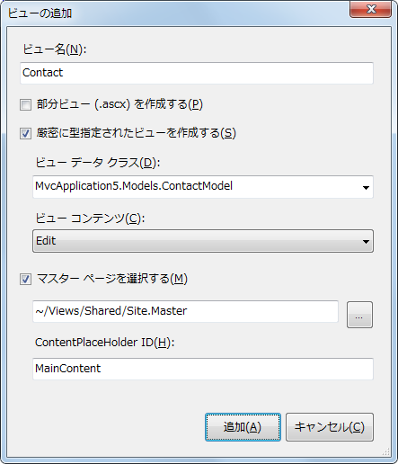
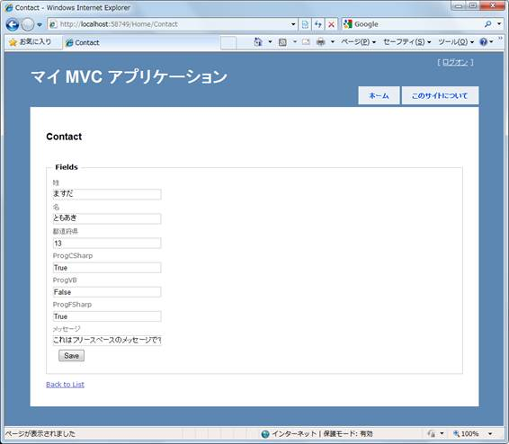
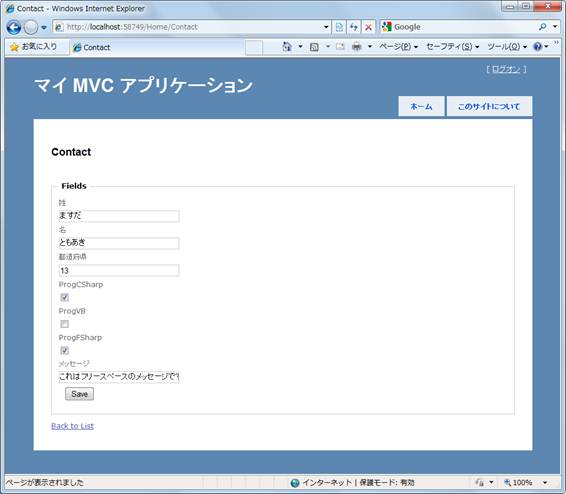
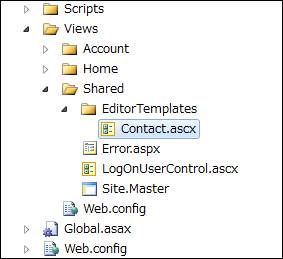
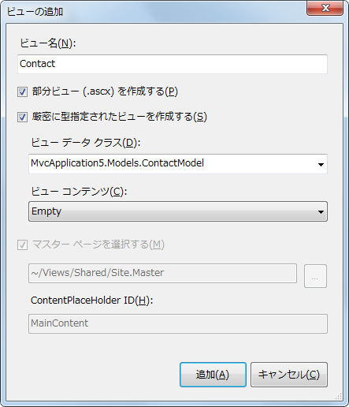
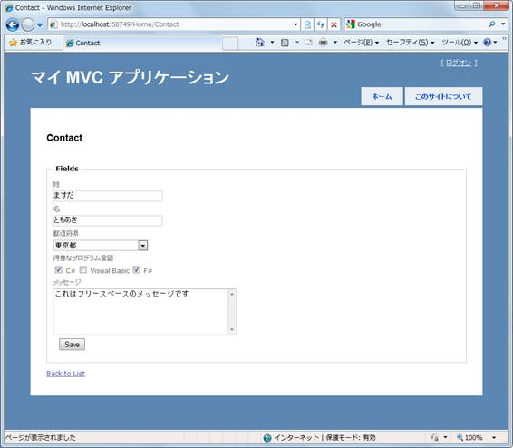
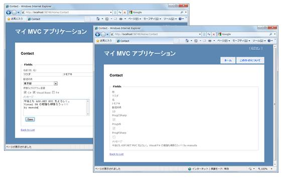
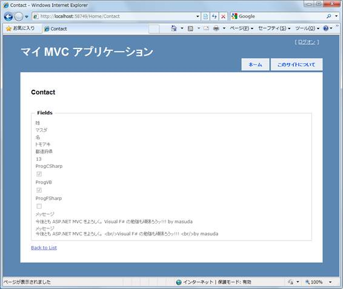
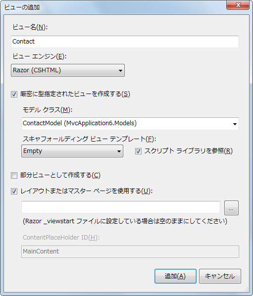

# ASP.NET MVC アプリケーション開発入門: 第 5 回　HTML ヘルパー メソッドを使用する
## Requires
- 
## License
- Apache License, Version 2.0
## Technologies
- Visual Studio 2010
- ASP.NET MVC
## Topics
- ASP.NET MVC アプリケーション
- 連載! ASP.NET MVC
## Updated
- 09/04/2011
## Description

執筆者: <a href="http://msdn.microsoft.com/ja-jp/gg585574#masuda" target="_blank">
moonmile solutions 増田 智明</a>

本連載では、日経 BP 社から発売された<a href="http://ec.nikkeibp.co.jp/item/books/P94380.html" target="_blank">「ひと目でわかる ASP.NET MVC アプリケーション開発入門」</a>をもとにして、執筆時に気づいたことや紙面の都合で書ききれなかった技術を紹介します。

<h3>目次</h3>
<ol style="margin-bottom:0">
<li><a href="#01">はじめに</a> </li><li><a href="#02">モデルとコントローラーの準備</a> </li><li><a href="#03">モデルを表示するビューを自動生成する</a> </li><li><a href="#04">モデルの編集を簡素に記述する</a> </li><li><a href="#05">ドロップ ダウン リストを表示する</a> </li><li><a href="#06">フォームから送られてくるメッセージを表示する</a> </li><li><a href="#07">テキスト エリアの入力を改行付きで表示する</a> </li><li><a href="#08">ASP.NET MVC 3 の新しいビュー エンジン Razor</a> </li><li><a href="#09">おわりに</a> </li></ol>

&nbsp;

<h2 id="01">1. はじめに</h2>

今回は、ASP.NET MVC アプリケーションのビューで使われる HTML ヘルパー メソッドの話をしましょう。HTML ヘルパーとは何か、を詳しく話す前に、先に使われているところを見ていきましょう。Visual Studio 2010 で作成される ASP.NET MVC アプリケーションのひな型に HTML ヘルパーメソッドが使われています。

まずは、Visual Studio 2010 で ASP.NET MVC アプリケーションを作成して、Views/Account/LogOn.aspx のファイルを開いてみてください。

C#

スクリプトの編集|Remove

csharp
<pre class="hidden">using System.ComponentModel;
&lt;% using (Html.BeginForm()) { %&gt;
　　　　　&lt;%: Html.ValidationSummary(true, &quot;ログインに失敗しました。エラーを修正し、再試行してください。&quot;) %&gt;
　　　　　&lt;div&gt;
　　　　　　　　　　&lt;fieldset&gt;
　　　　　　　　　　&lt;legend&gt;アカウント情報&lt;/legend&gt;
                
 　　　　　　　　　　&lt;div class=&quot;editor-label&quot;&gt;
　　　　　　　　　　　　　　　&lt;%: Html.LabelFor(m =&gt; m.UserName) %&gt;
　　　　　　　　　　&lt;/div&gt;
　　　　　　　　　　&lt;div class=&quot;editor-field&quot;&gt;
　　　　　　　　　　　　　　　&lt;%: Html.TextBoxFor(m =&gt; m.UserName) %&gt;
　　　　　　　　　　　　　　　&lt;%: Html.ValidationMessageFor(m =&gt; m.UserName) %&gt;
　　　　　　　　　　&lt;/div&gt;
                
　　　　　　　　　　&lt;div class=&quot;editor-label&quot;&gt;
　　　　　　　　　　　　　　　&lt;%: Html.LabelFor(m =&gt; m.Password) %&gt;
　　　　　　　　　　&lt;/div&gt;
　　　　　　　　　　&lt;div class=&quot;editor-field&quot;&gt;
　　　　　　　　　　　　　　　&lt;%: Html.PasswordFor(m =&gt; m.Password) %&gt;
　　　　　　　　　　　　　　　&lt;%: Html.ValidationMessageFor(m =&gt; m.Password) %&gt;
　　　　　　　　　　&lt;/div&gt;</pre>

<pre id="codePreview" class="csharp">using&nbsp;System.ComponentModel;&nbsp;
&lt;%&nbsp;using&nbsp;(Html.BeginForm())&nbsp;{&nbsp;%&gt;&nbsp;
　　　　　&lt;%:&nbsp;Html.ValidationSummary(true,&nbsp;&quot;ログインに失敗しました。エラーを修正し、再試行してください。&quot;)&nbsp;%&gt;&nbsp;
　　　　　&lt;div&gt;&nbsp;
　　　　　　　　　　&lt;fieldset&gt;&nbsp;
　　　　　　　　　　&lt;legend&gt;アカウント情報&lt;/legend&gt;&nbsp;
&nbsp;&nbsp;&nbsp;&nbsp;&nbsp;&nbsp;&nbsp;&nbsp;&nbsp;&nbsp;&nbsp;&nbsp;&nbsp;&nbsp;&nbsp;&nbsp;&nbsp;
&nbsp;　　　　　　　　　　&lt;div&nbsp;class=&quot;editor-label&quot;&gt;&nbsp;
　　　　　　　　　　　　　　　&lt;%:&nbsp;Html.LabelFor(m&nbsp;=&gt;&nbsp;m.UserName)&nbsp;%&gt;&nbsp;
　　　　　　　　　　&lt;/div&gt;&nbsp;
　　　　　　　　　　&lt;div&nbsp;class=&quot;editor-field&quot;&gt;&nbsp;
　　　　　　　　　　　　　　　&lt;%:&nbsp;Html.TextBoxFor(m&nbsp;=&gt;&nbsp;m.UserName)&nbsp;%&gt;&nbsp;
　　　　　　　　　　　　　　　&lt;%:&nbsp;Html.ValidationMessageFor(m&nbsp;=&gt;&nbsp;m.UserName)&nbsp;%&gt;&nbsp;
　　　　　　　　　　&lt;/div&gt;&nbsp;
&nbsp;&nbsp;&nbsp;&nbsp;&nbsp;&nbsp;&nbsp;&nbsp;&nbsp;&nbsp;&nbsp;&nbsp;&nbsp;&nbsp;&nbsp;&nbsp;&nbsp;
　　　　　　　　　　&lt;div&nbsp;class=&quot;editor-label&quot;&gt;&nbsp;
　　　　　　　　　　　　　　　&lt;%:&nbsp;Html.LabelFor(m&nbsp;=&gt;&nbsp;m.Password)&nbsp;%&gt;&nbsp;
　　　　　　　　　　&lt;/div&gt;&nbsp;
　　　　　　　　　　&lt;div&nbsp;class=&quot;editor-field&quot;&gt;&nbsp;
　　　　　　　　　　　　　　　&lt;%:&nbsp;Html.PasswordFor(m&nbsp;=&gt;&nbsp;m.Password)&nbsp;%&gt;&nbsp;
　　　　　　　　　　　　　　　&lt;%:&nbsp;Html.ValidationMessageFor(m&nbsp;=&gt;&nbsp;m.Password)&nbsp;%&gt;&nbsp;
　　　　　　　　　　&lt;/div&gt;</pre>

&nbsp;

Visual Basic

スクリプトの編集|Remove

vb
<pre class="hidden">Import System.ComponentModel
&lt;% Using Html.BeginForm() %&gt;
　　　　　&lt;%: Html.ValidationSummary(True, &quot;ログインに失敗しました。エラーを修正し、再試行してください。&quot;)%&gt;
　　　　　&lt;div&gt;
　　　　　&lt;fieldset&gt;
　　　　　　　　　　&lt;legend&gt;アカウント情報&lt;/legend&gt;
                
　　　　　　　　　　&lt;div class=&quot;editor-label&quot;&gt;
　　　　　　　　　　　　　　　&lt;%: Html.LabelFor(Function(m) m.UserName) %&gt;
　　　　　　　　　　&lt;/div&gt;
　　　　　　　　　　&lt;div class=&quot;editor-field&quot;&gt;
　　　　　　　　　　　　　　　&lt;%: Html.TextBoxFor(Function(m) m.UserName) %&gt;
　　　　　　　　　　　　　　　&lt;%: Html.ValidationMessageFor(Function(m) m.UserName) %&gt;
　　　　　　　　　　&lt;/div&gt;
                
　　　　　　　　　　&lt;div class=&quot;editor-label&quot;&gt;
　　　　　　　　　　　　　　　&lt;%: Html.LabelFor(Function(m) m.Password) %&gt;
　　　　　　　　　　&lt;/div&gt;
　　　　　　　　　　&lt;div class=&quot;editor-field&quot;&gt;
　　　　　　　　　　　　　　　&lt;%: Html.PasswordFor(Function(m) m.Password) %&gt;
　　　　　　　　　　　　　　　&lt;%: Html.ValidationMessageFor(Function(m) m.Password) %&gt;
　　　　　　　　　　&lt;/div&gt;</pre>

<pre id="codePreview" class="vb">Import&nbsp;System.ComponentModel&nbsp;
&lt;%&nbsp;Using&nbsp;Html.BeginForm()&nbsp;%&gt;&nbsp;
　　　　　&lt;%:&nbsp;Html.ValidationSummary(True,&nbsp;&quot;ログインに失敗しました。エラーを修正し、再試行してください。&quot;)%&gt;&nbsp;
　　　　　&lt;div&gt;&nbsp;
　　　　　&lt;fieldset&gt;&nbsp;
　　　　　　　　　　&lt;legend&gt;アカウント情報&lt;/legend&gt;&nbsp;
&nbsp;&nbsp;&nbsp;&nbsp;&nbsp;&nbsp;&nbsp;&nbsp;&nbsp;&nbsp;&nbsp;&nbsp;&nbsp;&nbsp;&nbsp;&nbsp;&nbsp;
　　　　　　　　　　&lt;div&nbsp;class=&quot;editor-label&quot;&gt;&nbsp;
　　　　　　　　　　　　　　　&lt;%:&nbsp;Html.LabelFor(Function(m)&nbsp;m.UserName)&nbsp;%&gt;&nbsp;
　　　　　　　　　　&lt;/div&gt;&nbsp;
　　　　　　　　　　&lt;div&nbsp;class=&quot;editor-field&quot;&gt;&nbsp;
　　　　　　　　　　　　　　　&lt;%:&nbsp;Html.TextBoxFor(Function(m)&nbsp;m.UserName)&nbsp;%&gt;&nbsp;
　　　　　　　　　　　　　　　&lt;%:&nbsp;Html.ValidationMessageFor(Function(m)&nbsp;m.UserName)&nbsp;%&gt;&nbsp;
　　　　　　　　　　&lt;/div&gt;&nbsp;
&nbsp;&nbsp;&nbsp;&nbsp;&nbsp;&nbsp;&nbsp;&nbsp;&nbsp;&nbsp;&nbsp;&nbsp;&nbsp;&nbsp;&nbsp;&nbsp;&nbsp;
　　　　　　　　　　&lt;div&nbsp;class=&quot;editor-label&quot;&gt;&nbsp;
　　　　　　　　　　　　　　　&lt;%:&nbsp;Html.LabelFor(Function(m)&nbsp;m.Password)&nbsp;%&gt;&nbsp;
　　　　　　　　　　&lt;/div&gt;&nbsp;
　　　　　　　　　　&lt;div&nbsp;class=&quot;editor-field&quot;&gt;&nbsp;
　　　　　　　　　　　　　　　&lt;%:&nbsp;Html.PasswordFor(Function(m)&nbsp;m.Password)&nbsp;%&gt;&nbsp;
　　　　　　　　　　　　　　　&lt;%:&nbsp;Html.ValidationMessageFor(Function(m)&nbsp;m.Password)&nbsp;%&gt;&nbsp;
　　　　　　　　　　&lt;/div&gt;</pre>

aspx の埋め込みコードの箇所に Html.ActionLink メソッドや Html.TextBoxFor メソッドを呼び出しがあります。この「HTML.メソッド名」の部分が、HTML ヘルパー メソッドを使っているところです。

この画面がどうなっているかというと、次の図になります。

<strong>図 1 登録</strong>

ユーザーのログオン画面です。 
ログオン画面は Internet Explorer などのブラウザで表示されているので、ハイパー リンクには a タグが、テキスト ボックスには input タグが使われています。この HTML タグを生成している箇所で HTML ヘルパー メソッドが使われています。

ビューで使える HTML ヘルパー メソッドは、実際には <a href="http://msdn.microsoft.com/ja-jp/library/dd493095.aspx" target="_blank">
HtmlHelper クラス</a>の各メソッドになります。ビューの Html プロパティとして記述されています。

HTML ヘルパー メソッドは HTML タグの出力だけでなく入力テキストの検&#35388; (Validation) や、HTML エンコーディングを行うためのメソッドが用意されています。 
今回の記事では、HTML タグの詳しいところと、HTML エンコードを詳しく見ていきましょう。

<a href="#top"> ページのトップへ</a>

<h2 id="02">2. モデルとコントローラーの準備</h2>

実は、HTML ヘルパー メソッドを使うと、モデルの属性 (Attribute) やプロパティの型を判断して自動的にテキストボックスやチェックボックスを制御してくれます。 
分かりやすいように、最初にアンケートを想定したモデルクラス (ContactModel) を作成しましょう。

C#

スクリプトの編集|Remove

csharp
<pre class="hidden">using System.ComponentModel;
public class ContactModel
{
    [DisplayName(&quot;姓&quot;)]
    public string LastName { get; set; }
    [DisplayName(&quot;名&quot;)]
    public string FirstName { get; set; }
    [DisplayName(&quot;都道府県&quot;)]
    public string State { get; set; }

    /// &lt;summary&gt;
    /// プログラム言語
    /// &lt;/summary&gt;
    public bool ProgCSharp { get; set; }
    public bool ProgVB { get; set; }
    public bool ProgFSharp { get; set; }

    [DisplayName(&quot;メッセージ&quot;)]
    public string Message { get; set; }

    // 都道府県リスト
    private List&lt;SelectListItem&gt; _stateItems;
    public List&lt;SelectListItem&gt; StateItems
    {
        get
        {
            if (_stateItems == null)
            {
                List&lt;SelectListItem&gt; items = new List&lt;SelectListItem&gt;();
                items.Add(new SelectListItem { Value = &quot;01&quot;, Text = &quot;北海道&quot; });
                items.Add(new SelectListItem { Value = &quot;02&quot;, Text = &quot;青森県&quot; });
                items.Add(new SelectListItem { Value = &quot;03&quot;, Text = &quot;岩手県&quot; });
                items.Add(new SelectListItem { Value = &quot;04&quot;, Text = &quot;宮城県&quot; });
                items.Add(new SelectListItem { Value = &quot;05&quot;, Text = &quot;秋田県&quot; });
				// 省略
                items.Add(new SelectListItem { Value = &quot;47&quot;, Text = &quot;沖縄県&quot; });
                _stateItems = items;
            }
            return _stateItems;
        }
    }
}</pre>

<pre id="codePreview" class="csharp">using&nbsp;System.ComponentModel;&nbsp;
public&nbsp;class&nbsp;ContactModel&nbsp;
{&nbsp;
&nbsp;&nbsp;&nbsp;&nbsp;[DisplayName(&quot;姓&quot;)]&nbsp;
&nbsp;&nbsp;&nbsp;&nbsp;public&nbsp;string&nbsp;LastName&nbsp;{&nbsp;get;&nbsp;set;&nbsp;}&nbsp;
&nbsp;&nbsp;&nbsp;&nbsp;[DisplayName(&quot;名&quot;)]&nbsp;
&nbsp;&nbsp;&nbsp;&nbsp;public&nbsp;string&nbsp;FirstName&nbsp;{&nbsp;get;&nbsp;set;&nbsp;}&nbsp;
&nbsp;&nbsp;&nbsp;&nbsp;[DisplayName(&quot;都道府県&quot;)]&nbsp;
&nbsp;&nbsp;&nbsp;&nbsp;public&nbsp;string&nbsp;State&nbsp;{&nbsp;get;&nbsp;set;&nbsp;}&nbsp;
&nbsp;
&nbsp;&nbsp;&nbsp;&nbsp;///&nbsp;&lt;summary&gt;&nbsp;
&nbsp;&nbsp;&nbsp;&nbsp;///&nbsp;プログラム言語&nbsp;
&nbsp;&nbsp;&nbsp;&nbsp;///&nbsp;&lt;/summary&gt;&nbsp;
&nbsp;&nbsp;&nbsp;&nbsp;public&nbsp;bool&nbsp;ProgCSharp&nbsp;{&nbsp;get;&nbsp;set;&nbsp;}&nbsp;
&nbsp;&nbsp;&nbsp;&nbsp;public&nbsp;bool&nbsp;ProgVB&nbsp;{&nbsp;get;&nbsp;set;&nbsp;}&nbsp;
&nbsp;&nbsp;&nbsp;&nbsp;public&nbsp;bool&nbsp;ProgFSharp&nbsp;{&nbsp;get;&nbsp;set;&nbsp;}&nbsp;
&nbsp;
&nbsp;&nbsp;&nbsp;&nbsp;[DisplayName(&quot;メッセージ&quot;)]&nbsp;
&nbsp;&nbsp;&nbsp;&nbsp;public&nbsp;string&nbsp;Message&nbsp;{&nbsp;get;&nbsp;set;&nbsp;}&nbsp;
&nbsp;
&nbsp;&nbsp;&nbsp;&nbsp;//&nbsp;都道府県リスト&nbsp;
&nbsp;&nbsp;&nbsp;&nbsp;private&nbsp;List&lt;SelectListItem&gt;&nbsp;_stateItems;&nbsp;
&nbsp;&nbsp;&nbsp;&nbsp;public&nbsp;List&lt;SelectListItem&gt;&nbsp;StateItems&nbsp;
&nbsp;&nbsp;&nbsp;&nbsp;{&nbsp;
&nbsp;&nbsp;&nbsp;&nbsp;&nbsp;&nbsp;&nbsp;&nbsp;get&nbsp;
&nbsp;&nbsp;&nbsp;&nbsp;&nbsp;&nbsp;&nbsp;&nbsp;{&nbsp;
&nbsp;&nbsp;&nbsp;&nbsp;&nbsp;&nbsp;&nbsp;&nbsp;&nbsp;&nbsp;&nbsp;&nbsp;if&nbsp;(_stateItems&nbsp;==&nbsp;null)&nbsp;
&nbsp;&nbsp;&nbsp;&nbsp;&nbsp;&nbsp;&nbsp;&nbsp;&nbsp;&nbsp;&nbsp;&nbsp;{&nbsp;
&nbsp;&nbsp;&nbsp;&nbsp;&nbsp;&nbsp;&nbsp;&nbsp;&nbsp;&nbsp;&nbsp;&nbsp;&nbsp;&nbsp;&nbsp;&nbsp;List&lt;SelectListItem&gt;&nbsp;items&nbsp;=&nbsp;new&nbsp;List&lt;SelectListItem&gt;();&nbsp;
&nbsp;&nbsp;&nbsp;&nbsp;&nbsp;&nbsp;&nbsp;&nbsp;&nbsp;&nbsp;&nbsp;&nbsp;&nbsp;&nbsp;&nbsp;&nbsp;items.Add(new&nbsp;SelectListItem&nbsp;{&nbsp;Value&nbsp;=&nbsp;&quot;01&quot;,&nbsp;Text&nbsp;=&nbsp;&quot;北海道&quot;&nbsp;});&nbsp;
&nbsp;&nbsp;&nbsp;&nbsp;&nbsp;&nbsp;&nbsp;&nbsp;&nbsp;&nbsp;&nbsp;&nbsp;&nbsp;&nbsp;&nbsp;&nbsp;items.Add(new&nbsp;SelectListItem&nbsp;{&nbsp;Value&nbsp;=&nbsp;&quot;02&quot;,&nbsp;Text&nbsp;=&nbsp;&quot;青森県&quot;&nbsp;});&nbsp;
&nbsp;&nbsp;&nbsp;&nbsp;&nbsp;&nbsp;&nbsp;&nbsp;&nbsp;&nbsp;&nbsp;&nbsp;&nbsp;&nbsp;&nbsp;&nbsp;items.Add(new&nbsp;SelectListItem&nbsp;{&nbsp;Value&nbsp;=&nbsp;&quot;03&quot;,&nbsp;Text&nbsp;=&nbsp;&quot;岩手県&quot;&nbsp;});&nbsp;
&nbsp;&nbsp;&nbsp;&nbsp;&nbsp;&nbsp;&nbsp;&nbsp;&nbsp;&nbsp;&nbsp;&nbsp;&nbsp;&nbsp;&nbsp;&nbsp;items.Add(new&nbsp;SelectListItem&nbsp;{&nbsp;Value&nbsp;=&nbsp;&quot;04&quot;,&nbsp;Text&nbsp;=&nbsp;&quot;宮城県&quot;&nbsp;});&nbsp;
&nbsp;&nbsp;&nbsp;&nbsp;&nbsp;&nbsp;&nbsp;&nbsp;&nbsp;&nbsp;&nbsp;&nbsp;&nbsp;&nbsp;&nbsp;&nbsp;items.Add(new&nbsp;SelectListItem&nbsp;{&nbsp;Value&nbsp;=&nbsp;&quot;05&quot;,&nbsp;Text&nbsp;=&nbsp;&quot;秋田県&quot;&nbsp;});&nbsp;
&nbsp;&nbsp;&nbsp;&nbsp;&nbsp;&nbsp;&nbsp;&nbsp;&nbsp;&nbsp;&nbsp;&nbsp;&nbsp;&nbsp;&nbsp;&nbsp;//&nbsp;省略&nbsp;
&nbsp;&nbsp;&nbsp;&nbsp;&nbsp;&nbsp;&nbsp;&nbsp;&nbsp;&nbsp;&nbsp;&nbsp;&nbsp;&nbsp;&nbsp;&nbsp;items.Add(new&nbsp;SelectListItem&nbsp;{&nbsp;Value&nbsp;=&nbsp;&quot;47&quot;,&nbsp;Text&nbsp;=&nbsp;&quot;沖縄県&quot;&nbsp;});&nbsp;
&nbsp;&nbsp;&nbsp;&nbsp;&nbsp;&nbsp;&nbsp;&nbsp;&nbsp;&nbsp;&nbsp;&nbsp;&nbsp;&nbsp;&nbsp;&nbsp;_stateItems&nbsp;=&nbsp;items;&nbsp;
&nbsp;&nbsp;&nbsp;&nbsp;&nbsp;&nbsp;&nbsp;&nbsp;&nbsp;&nbsp;&nbsp;&nbsp;}&nbsp;
&nbsp;&nbsp;&nbsp;&nbsp;&nbsp;&nbsp;&nbsp;&nbsp;&nbsp;&nbsp;&nbsp;&nbsp;return&nbsp;_stateItems;&nbsp;
&nbsp;&nbsp;&nbsp;&nbsp;&nbsp;&nbsp;&nbsp;&nbsp;}&nbsp;
&nbsp;&nbsp;&nbsp;&nbsp;}&nbsp;
}</pre>

&nbsp;

Visual Basic

スクリプトの編集|Remove

vb
<pre class="hidden">Import System.ComponentModel
Public Class ContactModel

    &lt;DisplayName(&quot;姓&quot;)&gt;
    Public Property LastName As String
    &lt;DisplayName(&quot;名&quot;)&gt;
    Public Property FirstName As String
    &lt;DisplayName(&quot;都道府県&quot;)&gt;
    Public Property State As String

    ''' &lt;summary&gt;
    ''' プログラム言語
    ''' &lt;/summary&gt;
    Public Property ProgCSharp As Boolean
    Public Property ProgVB As Boolean
    Public Property ProgFSharp As Boolean

    &lt;DisplayName(&quot;メッセージ&quot;)&gt;
    Public Property Message As String

    ' 都道府県リスト
    Private _stateItems As List(Of SelectListItem)
    Public ReadOnly Property StateItems As List(Of SelectListItem)
        Get
            If _stateItems Is Nothing Then
                Dim items As New List(Of SelectListItem)
                items.Add(New SelectListItem With {.Value = &quot;01&quot;, .Text = &quot;北海道&quot;})
                items.Add(New SelectListItem With {.Value = &quot;02&quot;, .Text = &quot;青森県&quot;})
                items.Add(New SelectListItem With {.Value = &quot;03&quot;, .Text = &quot;岩手県&quot;})
                items.Add(New SelectListItem With {.Value = &quot;04&quot;, .Text = &quot;宮城県&quot;})
                items.Add(New SelectListItem With {.Value = &quot;05&quot;, .Text = &quot;秋田県&quot;})
                ' 省略
                items.Add(New SelectListItem With {.Value = &quot;47&quot;, .Text = &quot;沖縄県&quot;})
                _stateItems = items
            End If
            Return _stateItems
        End Get
    End Property
End Class</pre>

<pre id="codePreview" class="vb">Import&nbsp;System.ComponentModel&nbsp;
Public&nbsp;Class&nbsp;ContactModel&nbsp;
&nbsp;
&nbsp;&nbsp;&nbsp;&nbsp;&lt;DisplayName(&quot;姓&quot;)&gt;&nbsp;
&nbsp;&nbsp;&nbsp;&nbsp;Public&nbsp;Property&nbsp;LastName&nbsp;As&nbsp;String&nbsp;
&nbsp;&nbsp;&nbsp;&nbsp;&lt;DisplayName(&quot;名&quot;)&gt;&nbsp;
&nbsp;&nbsp;&nbsp;&nbsp;Public&nbsp;Property&nbsp;FirstName&nbsp;As&nbsp;String&nbsp;
&nbsp;&nbsp;&nbsp;&nbsp;&lt;DisplayName(&quot;都道府県&quot;)&gt;&nbsp;
&nbsp;&nbsp;&nbsp;&nbsp;Public&nbsp;Property&nbsp;State&nbsp;As&nbsp;String&nbsp;
&nbsp;
&nbsp;&nbsp;&nbsp;&nbsp;'''&nbsp;&lt;summary&gt;&nbsp;
&nbsp;&nbsp;&nbsp;&nbsp;'''&nbsp;プログラム言語&nbsp;
&nbsp;&nbsp;&nbsp;&nbsp;'''&nbsp;&lt;/summary&gt;&nbsp;
&nbsp;&nbsp;&nbsp;&nbsp;Public&nbsp;Property&nbsp;ProgCSharp&nbsp;As&nbsp;Boolean&nbsp;
&nbsp;&nbsp;&nbsp;&nbsp;Public&nbsp;Property&nbsp;ProgVB&nbsp;As&nbsp;Boolean&nbsp;
&nbsp;&nbsp;&nbsp;&nbsp;Public&nbsp;Property&nbsp;ProgFSharp&nbsp;As&nbsp;Boolean&nbsp;
&nbsp;
&nbsp;&nbsp;&nbsp;&nbsp;&lt;DisplayName(&quot;メッセージ&quot;)&gt;&nbsp;
&nbsp;&nbsp;&nbsp;&nbsp;Public&nbsp;Property&nbsp;Message&nbsp;As&nbsp;String&nbsp;
&nbsp;
&nbsp;&nbsp;&nbsp;&nbsp;'&nbsp;都道府県リスト&nbsp;
&nbsp;&nbsp;&nbsp;&nbsp;Private&nbsp;_stateItems&nbsp;As&nbsp;List(Of&nbsp;SelectListItem)&nbsp;
&nbsp;&nbsp;&nbsp;&nbsp;Public&nbsp;ReadOnly&nbsp;Property&nbsp;StateItems&nbsp;As&nbsp;List(Of&nbsp;SelectListItem)&nbsp;
&nbsp;&nbsp;&nbsp;&nbsp;&nbsp;&nbsp;&nbsp;&nbsp;Get&nbsp;
&nbsp;&nbsp;&nbsp;&nbsp;&nbsp;&nbsp;&nbsp;&nbsp;&nbsp;&nbsp;&nbsp;&nbsp;If&nbsp;_stateItems&nbsp;Is&nbsp;Nothing&nbsp;Then&nbsp;
&nbsp;&nbsp;&nbsp;&nbsp;&nbsp;&nbsp;&nbsp;&nbsp;&nbsp;&nbsp;&nbsp;&nbsp;&nbsp;&nbsp;&nbsp;&nbsp;Dim&nbsp;items&nbsp;As&nbsp;New&nbsp;List(Of&nbsp;SelectListItem)&nbsp;
&nbsp;&nbsp;&nbsp;&nbsp;&nbsp;&nbsp;&nbsp;&nbsp;&nbsp;&nbsp;&nbsp;&nbsp;&nbsp;&nbsp;&nbsp;&nbsp;items.Add(New&nbsp;SelectListItem&nbsp;With&nbsp;{.Value&nbsp;=&nbsp;&quot;01&quot;,&nbsp;.Text&nbsp;=&nbsp;&quot;北海道&quot;})&nbsp;
&nbsp;&nbsp;&nbsp;&nbsp;&nbsp;&nbsp;&nbsp;&nbsp;&nbsp;&nbsp;&nbsp;&nbsp;&nbsp;&nbsp;&nbsp;&nbsp;items.Add(New&nbsp;SelectListItem&nbsp;With&nbsp;{.Value&nbsp;=&nbsp;&quot;02&quot;,&nbsp;.Text&nbsp;=&nbsp;&quot;青森県&quot;})&nbsp;
&nbsp;&nbsp;&nbsp;&nbsp;&nbsp;&nbsp;&nbsp;&nbsp;&nbsp;&nbsp;&nbsp;&nbsp;&nbsp;&nbsp;&nbsp;&nbsp;items.Add(New&nbsp;SelectListItem&nbsp;With&nbsp;{.Value&nbsp;=&nbsp;&quot;03&quot;,&nbsp;.Text&nbsp;=&nbsp;&quot;岩手県&quot;})&nbsp;
&nbsp;&nbsp;&nbsp;&nbsp;&nbsp;&nbsp;&nbsp;&nbsp;&nbsp;&nbsp;&nbsp;&nbsp;&nbsp;&nbsp;&nbsp;&nbsp;items.Add(New&nbsp;SelectListItem&nbsp;With&nbsp;{.Value&nbsp;=&nbsp;&quot;04&quot;,&nbsp;.Text&nbsp;=&nbsp;&quot;宮城県&quot;})&nbsp;
&nbsp;&nbsp;&nbsp;&nbsp;&nbsp;&nbsp;&nbsp;&nbsp;&nbsp;&nbsp;&nbsp;&nbsp;&nbsp;&nbsp;&nbsp;&nbsp;items.Add(New&nbsp;SelectListItem&nbsp;With&nbsp;{.Value&nbsp;=&nbsp;&quot;05&quot;,&nbsp;.Text&nbsp;=&nbsp;&quot;秋田県&quot;})&nbsp;
&nbsp;&nbsp;&nbsp;&nbsp;&nbsp;&nbsp;&nbsp;&nbsp;&nbsp;&nbsp;&nbsp;&nbsp;&nbsp;&nbsp;&nbsp;&nbsp;'&nbsp;省略&nbsp;
&nbsp;&nbsp;&nbsp;&nbsp;&nbsp;&nbsp;&nbsp;&nbsp;&nbsp;&nbsp;&nbsp;&nbsp;&nbsp;&nbsp;&nbsp;&nbsp;items.Add(New&nbsp;SelectListItem&nbsp;With&nbsp;{.Value&nbsp;=&nbsp;&quot;47&quot;,&nbsp;.Text&nbsp;=&nbsp;&quot;沖縄県&quot;})&nbsp;
&nbsp;&nbsp;&nbsp;&nbsp;&nbsp;&nbsp;&nbsp;&nbsp;&nbsp;&nbsp;&nbsp;&nbsp;&nbsp;&nbsp;&nbsp;&nbsp;_stateItems&nbsp;=&nbsp;items&nbsp;
&nbsp;&nbsp;&nbsp;&nbsp;&nbsp;&nbsp;&nbsp;&nbsp;&nbsp;&nbsp;&nbsp;&nbsp;End&nbsp;If&nbsp;
&nbsp;&nbsp;&nbsp;&nbsp;&nbsp;&nbsp;&nbsp;&nbsp;&nbsp;&nbsp;&nbsp;&nbsp;Return&nbsp;_stateItems&nbsp;
&nbsp;&nbsp;&nbsp;&nbsp;&nbsp;&nbsp;&nbsp;&nbsp;End&nbsp;Get&nbsp;
&nbsp;&nbsp;&nbsp;&nbsp;End&nbsp;Property&nbsp;
End&nbsp;Class</pre>

ContactModel クラスでは、次の 4 つのプロパティを扱います。

<ul>
<li>名前 （姓と名） </li><li>都道府県コード </li><li>得意なプログラム言語 (C#、Visual Basic、F# から複数選択可) </li><li>フリース ペースとしてのメッセージ </li></ul>

都道府県コードは、画面でドロップダウン リストから選択するために、SelectListItem クラスのコレクションも用意しておきます。実際にコーディングをする場合は、データベースなどから読み込むと良いでしょう。

そして、コントローラー (HomeController) に、次の Contact メソッドを追加しておきます。

C#

スクリプトの編集|Remove

csharp
<pre class="hidden">using System.ComponentModel;
public ActionResult Contact()
{
    var model = new Models.ContactModel();

    model.LastName = &quot;ますだ&quot;;
    model.FirstName = &quot;ともあき&quot;;
    model.State = &quot;13&quot;;
    model.ProgCSharp = true;
    model.ProgVB = false;
    model.ProgFSharp = true;
    model.Message = &quot;これはフリースペースのメッセージです&quot;;

    return View(model);
}</pre>

<pre id="codePreview" class="csharp">using&nbsp;System.ComponentModel;&nbsp;
public&nbsp;ActionResult&nbsp;Contact()&nbsp;
{&nbsp;
&nbsp;&nbsp;&nbsp;&nbsp;var&nbsp;model&nbsp;=&nbsp;new&nbsp;Models.ContactModel();&nbsp;
&nbsp;
&nbsp;&nbsp;&nbsp;&nbsp;model.LastName&nbsp;=&nbsp;&quot;ますだ&quot;;&nbsp;
&nbsp;&nbsp;&nbsp;&nbsp;model.FirstName&nbsp;=&nbsp;&quot;ともあき&quot;;&nbsp;
&nbsp;&nbsp;&nbsp;&nbsp;model.State&nbsp;=&nbsp;&quot;13&quot;;&nbsp;
&nbsp;&nbsp;&nbsp;&nbsp;model.ProgCSharp&nbsp;=&nbsp;true;&nbsp;
&nbsp;&nbsp;&nbsp;&nbsp;model.ProgVB&nbsp;=&nbsp;false;&nbsp;
&nbsp;&nbsp;&nbsp;&nbsp;model.ProgFSharp&nbsp;=&nbsp;true;&nbsp;
&nbsp;&nbsp;&nbsp;&nbsp;model.Message&nbsp;=&nbsp;&quot;これはフリースペースのメッセージです&quot;;&nbsp;
&nbsp;
&nbsp;&nbsp;&nbsp;&nbsp;return&nbsp;View(model);&nbsp;
}</pre>

&nbsp;

Visual Basic

スクリプトの編集|Remove

vb
<pre class="hidden">Import System.ComponentModel
Function Contact() As ActionResult
    Dim model = New ContactModel

    model.LastName = &quot;ますだ&quot;
    model.FirstName = &quot;ともあき&quot;
    model.State = &quot;13&quot;
    model.ProgCSharp = True
    model.ProgVB = False
    model.ProgFSharp = True
    model.Message = &quot;これはフリースペースのメッセージです&quot;

    Return View(model)
End Function</pre>

<pre id="codePreview" class="vb">Import&nbsp;System.ComponentModel&nbsp;
Function&nbsp;Contact()&nbsp;As&nbsp;ActionResult&nbsp;
&nbsp;&nbsp;&nbsp;&nbsp;Dim&nbsp;model&nbsp;=&nbsp;New&nbsp;ContactModel&nbsp;
&nbsp;
&nbsp;&nbsp;&nbsp;&nbsp;model.LastName&nbsp;=&nbsp;&quot;ますだ&quot;&nbsp;
&nbsp;&nbsp;&nbsp;&nbsp;model.FirstName&nbsp;=&nbsp;&quot;ともあき&quot;&nbsp;
&nbsp;&nbsp;&nbsp;&nbsp;model.State&nbsp;=&nbsp;&quot;13&quot;&nbsp;
&nbsp;&nbsp;&nbsp;&nbsp;model.ProgCSharp&nbsp;=&nbsp;True&nbsp;
&nbsp;&nbsp;&nbsp;&nbsp;model.ProgVB&nbsp;=&nbsp;False&nbsp;
&nbsp;&nbsp;&nbsp;&nbsp;model.ProgFSharp&nbsp;=&nbsp;True&nbsp;
&nbsp;&nbsp;&nbsp;&nbsp;model.Message&nbsp;=&nbsp;&quot;これはフリースペースのメッセージです&quot;&nbsp;
&nbsp;
&nbsp;&nbsp;&nbsp;&nbsp;Return&nbsp;View(model)&nbsp;
End&nbsp;Function</pre>

モデルに初期値を代入しておき、ビューで表示できるようにしておきます。

<a href="#top"> ページのトップへ</a>

<h2 id="03">3. モデルを表示するビューを自動生成する</h2>

準備はできたので、ビュー (Contact.aspx) を作成しましょう。 
ビューは、ソリューション エクスプローラーから自動生成します。次のようにビューの追加ダイアログでは、ビュー コンテンツに「Edit」を選択します。

<strong>図 2 ビューの追加</strong>

自動生成した結果が次の通りです。

C#

スクリプトの編集|Remove

csharp
<pre class="hidden">using System.ComponentModel;
&lt;%@ Page Title=&quot;&quot; Language=&quot;C#&quot; MasterPageFile=&quot;~/Views/Shared/Site.Master&quot; Inherits=&quot;System.Web.Mvc.ViewPage&lt;MvcApplication5.Models.ContactModel&gt;&quot; %&gt;

&lt;asp:Content ID=&quot;Content1&quot; ContentPlaceHolderID=&quot;TitleContent&quot; runat=&quot;server&quot;&gt;
	Contact
&lt;/asp:Content&gt;

&lt;asp:Content ID=&quot;Content2&quot; ContentPlaceHolderID=&quot;MainContent&quot; runat=&quot;server&quot;&gt;

    &lt;h2&gt;Contact&lt;/h2&gt;

    &lt;% using (Html.BeginForm()) {%&gt;
        &lt;%: Html.ValidationSummary(true) %&gt;
        
        &lt;fieldset&gt;
            &lt;legend&gt;Fields&lt;/legend&gt;
            
            &lt;div class=&quot;editor-label&quot;&gt;
                &lt;%: Html.LabelFor(model =&gt; model.LastName) %&gt;
            &lt;/div&gt;
            &lt;div class=&quot;editor-field&quot;&gt;
                &lt;%: Html.TextBoxFor(model =&gt; model.LastName) %&gt;
                &lt;%: Html.ValidationMessageFor(model =&gt; model.LastName) %&gt;
            &lt;/div&gt;
            
            &lt;div class=&quot;editor-label&quot;&gt;
                &lt;%: Html.LabelFor(model =&gt; model.FirstName) %&gt;
            &lt;/div&gt;
            &lt;div class=&quot;editor-field&quot;&gt;
                &lt;%: Html.TextBoxFor(model =&gt; model.FirstName) %&gt;
                &lt;%: Html.ValidationMessageFor(model =&gt; model.FirstName) %&gt;
            &lt;/div&gt;
            
            &lt;div class=&quot;editor-label&quot;&gt;
                &lt;%: Html.LabelFor(model =&gt; model.State) %&gt;
            &lt;/div&gt;
            &lt;div class=&quot;editor-field&quot;&gt;
                &lt;%: Html.TextBoxFor(model =&gt; model.State) %&gt;
                &lt;%: Html.ValidationMessageFor(model =&gt; model.State) %&gt;
            &lt;/div&gt;
            
            &lt;div class=&quot;editor-label&quot;&gt;
                &lt;%: Html.LabelFor(model =&gt; model.ProgCSharp) %&gt;
            &lt;/div&gt;
            &lt;div class=&quot;editor-field&quot;&gt;
                &lt;%: Html.TextBoxFor(model =&gt; model.ProgCSharp) %&gt;
                &lt;%: Html.ValidationMessageFor(model =&gt; model.ProgCSharp) %&gt;
            &lt;/div&gt;
            
            &lt;div class=&quot;editor-label&quot;&gt;
                &lt;%: Html.LabelFor(model =&gt; model.ProgVB) %&gt;
            &lt;/div&gt;
            &lt;div class=&quot;editor-field&quot;&gt;
                &lt;%: Html.TextBoxFor(model =&gt; model.ProgVB) %&gt;
                &lt;%: Html.ValidationMessageFor(model =&gt; model.ProgVB) %&gt;
            &lt;/div&gt;
            
            &lt;div class=&quot;editor-label&quot;&gt;
                &lt;%: Html.LabelFor(model =&gt; model.ProgFSharp) %&gt;
            &lt;/div&gt;
            &lt;div class=&quot;editor-field&quot;&gt;
                &lt;%: Html.TextBoxFor(model =&gt; model.ProgFSharp) %&gt;
                &lt;%: Html.ValidationMessageFor(model =&gt; model.ProgFSharp) %&gt;
            &lt;/div&gt;
            
            &lt;div class=&quot;editor-label&quot;&gt;
                &lt;%: Html.LabelFor(model =&gt; model.Message) %&gt;
            &lt;/div&gt;
            &lt;div class=&quot;editor-field&quot;&gt;
                &lt;%: Html.TextBoxFor(model =&gt; model.Message) %&gt;
                &lt;%: Html.ValidationMessageFor(model =&gt; model.Message) %&gt;
            &lt;/div&gt;
            
            &lt;p&gt;
                &lt;input type=&quot;submit&quot; value=&quot;Save&quot; /&gt;
            &lt;/p&gt;
        &lt;/fieldset&gt;

    &lt;% } %&gt;

    &lt;div&gt;
        &lt;%: Html.ActionLink(&quot;Back to List&quot;, &quot;Index&quot;) %&gt;
    &lt;/div&gt;

&lt;/asp:Content&gt;</pre>

<pre id="codePreview" class="csharp">using&nbsp;System.ComponentModel;&nbsp;
&lt;%@&nbsp;Page&nbsp;Title=&quot;&quot;&nbsp;Language=&quot;C#&quot;&nbsp;MasterPageFile=&quot;~/Views/Shared/Site.Master&quot;&nbsp;Inherits=&quot;System.Web.Mvc.ViewPage&lt;MvcApplication5.Models.ContactModel&gt;&quot;&nbsp;%&gt;&nbsp;
&nbsp;
&lt;asp:Content&nbsp;ID=&quot;Content1&quot;&nbsp;ContentPlaceHolderID=&quot;TitleContent&quot;&nbsp;runat=&quot;server&quot;&gt;&nbsp;
&nbsp;&nbsp;&nbsp;&nbsp;Contact&nbsp;
&lt;/asp:Content&gt;&nbsp;
&nbsp;
&lt;asp:Content&nbsp;ID=&quot;Content2&quot;&nbsp;ContentPlaceHolderID=&quot;MainContent&quot;&nbsp;runat=&quot;server&quot;&gt;&nbsp;
&nbsp;
&nbsp;&nbsp;&nbsp;&nbsp;&lt;h2&gt;Contact&lt;/h2&gt;&nbsp;
&nbsp;
&nbsp;&nbsp;&nbsp;&nbsp;&lt;%&nbsp;using&nbsp;(Html.BeginForm())&nbsp;{%&gt;&nbsp;
&nbsp;&nbsp;&nbsp;&nbsp;&nbsp;&nbsp;&nbsp;&nbsp;&lt;%:&nbsp;Html.ValidationSummary(true)&nbsp;%&gt;&nbsp;
&nbsp;&nbsp;&nbsp;&nbsp;&nbsp;&nbsp;&nbsp;&nbsp;&nbsp;
&nbsp;&nbsp;&nbsp;&nbsp;&nbsp;&nbsp;&nbsp;&nbsp;&lt;fieldset&gt;&nbsp;
&nbsp;&nbsp;&nbsp;&nbsp;&nbsp;&nbsp;&nbsp;&nbsp;&nbsp;&nbsp;&nbsp;&nbsp;&lt;legend&gt;Fields&lt;/legend&gt;&nbsp;
&nbsp;&nbsp;&nbsp;&nbsp;&nbsp;&nbsp;&nbsp;&nbsp;&nbsp;&nbsp;&nbsp;&nbsp;&nbsp;
&nbsp;&nbsp;&nbsp;&nbsp;&nbsp;&nbsp;&nbsp;&nbsp;&nbsp;&nbsp;&nbsp;&nbsp;&lt;div&nbsp;class=&quot;editor-label&quot;&gt;&nbsp;
&nbsp;&nbsp;&nbsp;&nbsp;&nbsp;&nbsp;&nbsp;&nbsp;&nbsp;&nbsp;&nbsp;&nbsp;&nbsp;&nbsp;&nbsp;&nbsp;&lt;%:&nbsp;Html.LabelFor(model&nbsp;=&gt;&nbsp;model.LastName)&nbsp;%&gt;&nbsp;
&nbsp;&nbsp;&nbsp;&nbsp;&nbsp;&nbsp;&nbsp;&nbsp;&nbsp;&nbsp;&nbsp;&nbsp;&lt;/div&gt;&nbsp;
&nbsp;&nbsp;&nbsp;&nbsp;&nbsp;&nbsp;&nbsp;&nbsp;&nbsp;&nbsp;&nbsp;&nbsp;&lt;div&nbsp;class=&quot;editor-field&quot;&gt;&nbsp;
&nbsp;&nbsp;&nbsp;&nbsp;&nbsp;&nbsp;&nbsp;&nbsp;&nbsp;&nbsp;&nbsp;&nbsp;&nbsp;&nbsp;&nbsp;&nbsp;&lt;%:&nbsp;Html.TextBoxFor(model&nbsp;=&gt;&nbsp;model.LastName)&nbsp;%&gt;&nbsp;
&nbsp;&nbsp;&nbsp;&nbsp;&nbsp;&nbsp;&nbsp;&nbsp;&nbsp;&nbsp;&nbsp;&nbsp;&nbsp;&nbsp;&nbsp;&nbsp;&lt;%:&nbsp;Html.ValidationMessageFor(model&nbsp;=&gt;&nbsp;model.LastName)&nbsp;%&gt;&nbsp;
&nbsp;&nbsp;&nbsp;&nbsp;&nbsp;&nbsp;&nbsp;&nbsp;&nbsp;&nbsp;&nbsp;&nbsp;&lt;/div&gt;&nbsp;
&nbsp;&nbsp;&nbsp;&nbsp;&nbsp;&nbsp;&nbsp;&nbsp;&nbsp;&nbsp;&nbsp;&nbsp;&nbsp;
&nbsp;&nbsp;&nbsp;&nbsp;&nbsp;&nbsp;&nbsp;&nbsp;&nbsp;&nbsp;&nbsp;&nbsp;&lt;div&nbsp;class=&quot;editor-label&quot;&gt;&nbsp;
&nbsp;&nbsp;&nbsp;&nbsp;&nbsp;&nbsp;&nbsp;&nbsp;&nbsp;&nbsp;&nbsp;&nbsp;&nbsp;&nbsp;&nbsp;&nbsp;&lt;%:&nbsp;Html.LabelFor(model&nbsp;=&gt;&nbsp;model.FirstName)&nbsp;%&gt;&nbsp;
&nbsp;&nbsp;&nbsp;&nbsp;&nbsp;&nbsp;&nbsp;&nbsp;&nbsp;&nbsp;&nbsp;&nbsp;&lt;/div&gt;&nbsp;
&nbsp;&nbsp;&nbsp;&nbsp;&nbsp;&nbsp;&nbsp;&nbsp;&nbsp;&nbsp;&nbsp;&nbsp;&lt;div&nbsp;class=&quot;editor-field&quot;&gt;&nbsp;
&nbsp;&nbsp;&nbsp;&nbsp;&nbsp;&nbsp;&nbsp;&nbsp;&nbsp;&nbsp;&nbsp;&nbsp;&nbsp;&nbsp;&nbsp;&nbsp;&lt;%:&nbsp;Html.TextBoxFor(model&nbsp;=&gt;&nbsp;model.FirstName)&nbsp;%&gt;&nbsp;
&nbsp;&nbsp;&nbsp;&nbsp;&nbsp;&nbsp;&nbsp;&nbsp;&nbsp;&nbsp;&nbsp;&nbsp;&nbsp;&nbsp;&nbsp;&nbsp;&lt;%:&nbsp;Html.ValidationMessageFor(model&nbsp;=&gt;&nbsp;model.FirstName)&nbsp;%&gt;&nbsp;
&nbsp;&nbsp;&nbsp;&nbsp;&nbsp;&nbsp;&nbsp;&nbsp;&nbsp;&nbsp;&nbsp;&nbsp;&lt;/div&gt;&nbsp;
&nbsp;&nbsp;&nbsp;&nbsp;&nbsp;&nbsp;&nbsp;&nbsp;&nbsp;&nbsp;&nbsp;&nbsp;&nbsp;
&nbsp;&nbsp;&nbsp;&nbsp;&nbsp;&nbsp;&nbsp;&nbsp;&nbsp;&nbsp;&nbsp;&nbsp;&lt;div&nbsp;class=&quot;editor-label&quot;&gt;&nbsp;
&nbsp;&nbsp;&nbsp;&nbsp;&nbsp;&nbsp;&nbsp;&nbsp;&nbsp;&nbsp;&nbsp;&nbsp;&nbsp;&nbsp;&nbsp;&nbsp;&lt;%:&nbsp;Html.LabelFor(model&nbsp;=&gt;&nbsp;model.State)&nbsp;%&gt;&nbsp;
&nbsp;&nbsp;&nbsp;&nbsp;&nbsp;&nbsp;&nbsp;&nbsp;&nbsp;&nbsp;&nbsp;&nbsp;&lt;/div&gt;&nbsp;
&nbsp;&nbsp;&nbsp;&nbsp;&nbsp;&nbsp;&nbsp;&nbsp;&nbsp;&nbsp;&nbsp;&nbsp;&lt;div&nbsp;class=&quot;editor-field&quot;&gt;&nbsp;
&nbsp;&nbsp;&nbsp;&nbsp;&nbsp;&nbsp;&nbsp;&nbsp;&nbsp;&nbsp;&nbsp;&nbsp;&nbsp;&nbsp;&nbsp;&nbsp;&lt;%:&nbsp;Html.TextBoxFor(model&nbsp;=&gt;&nbsp;model.State)&nbsp;%&gt;&nbsp;
&nbsp;&nbsp;&nbsp;&nbsp;&nbsp;&nbsp;&nbsp;&nbsp;&nbsp;&nbsp;&nbsp;&nbsp;&nbsp;&nbsp;&nbsp;&nbsp;&lt;%:&nbsp;Html.ValidationMessageFor(model&nbsp;=&gt;&nbsp;model.State)&nbsp;%&gt;&nbsp;
&nbsp;&nbsp;&nbsp;&nbsp;&nbsp;&nbsp;&nbsp;&nbsp;&nbsp;&nbsp;&nbsp;&nbsp;&lt;/div&gt;&nbsp;
&nbsp;&nbsp;&nbsp;&nbsp;&nbsp;&nbsp;&nbsp;&nbsp;&nbsp;&nbsp;&nbsp;&nbsp;&nbsp;
&nbsp;&nbsp;&nbsp;&nbsp;&nbsp;&nbsp;&nbsp;&nbsp;&nbsp;&nbsp;&nbsp;&nbsp;&lt;div&nbsp;class=&quot;editor-label&quot;&gt;&nbsp;
&nbsp;&nbsp;&nbsp;&nbsp;&nbsp;&nbsp;&nbsp;&nbsp;&nbsp;&nbsp;&nbsp;&nbsp;&nbsp;&nbsp;&nbsp;&nbsp;&lt;%:&nbsp;Html.LabelFor(model&nbsp;=&gt;&nbsp;model.ProgCSharp)&nbsp;%&gt;&nbsp;
&nbsp;&nbsp;&nbsp;&nbsp;&nbsp;&nbsp;&nbsp;&nbsp;&nbsp;&nbsp;&nbsp;&nbsp;&lt;/div&gt;&nbsp;
&nbsp;&nbsp;&nbsp;&nbsp;&nbsp;&nbsp;&nbsp;&nbsp;&nbsp;&nbsp;&nbsp;&nbsp;&lt;div&nbsp;class=&quot;editor-field&quot;&gt;&nbsp;
&nbsp;&nbsp;&nbsp;&nbsp;&nbsp;&nbsp;&nbsp;&nbsp;&nbsp;&nbsp;&nbsp;&nbsp;&nbsp;&nbsp;&nbsp;&nbsp;&lt;%:&nbsp;Html.TextBoxFor(model&nbsp;=&gt;&nbsp;model.ProgCSharp)&nbsp;%&gt;&nbsp;
&nbsp;&nbsp;&nbsp;&nbsp;&nbsp;&nbsp;&nbsp;&nbsp;&nbsp;&nbsp;&nbsp;&nbsp;&nbsp;&nbsp;&nbsp;&nbsp;&lt;%:&nbsp;Html.ValidationMessageFor(model&nbsp;=&gt;&nbsp;model.ProgCSharp)&nbsp;%&gt;&nbsp;
&nbsp;&nbsp;&nbsp;&nbsp;&nbsp;&nbsp;&nbsp;&nbsp;&nbsp;&nbsp;&nbsp;&nbsp;&lt;/div&gt;&nbsp;
&nbsp;&nbsp;&nbsp;&nbsp;&nbsp;&nbsp;&nbsp;&nbsp;&nbsp;&nbsp;&nbsp;&nbsp;&nbsp;
&nbsp;&nbsp;&nbsp;&nbsp;&nbsp;&nbsp;&nbsp;&nbsp;&nbsp;&nbsp;&nbsp;&nbsp;&lt;div&nbsp;class=&quot;editor-label&quot;&gt;&nbsp;
&nbsp;&nbsp;&nbsp;&nbsp;&nbsp;&nbsp;&nbsp;&nbsp;&nbsp;&nbsp;&nbsp;&nbsp;&nbsp;&nbsp;&nbsp;&nbsp;&lt;%:&nbsp;Html.LabelFor(model&nbsp;=&gt;&nbsp;model.ProgVB)&nbsp;%&gt;&nbsp;
&nbsp;&nbsp;&nbsp;&nbsp;&nbsp;&nbsp;&nbsp;&nbsp;&nbsp;&nbsp;&nbsp;&nbsp;&lt;/div&gt;&nbsp;
&nbsp;&nbsp;&nbsp;&nbsp;&nbsp;&nbsp;&nbsp;&nbsp;&nbsp;&nbsp;&nbsp;&nbsp;&lt;div&nbsp;class=&quot;editor-field&quot;&gt;&nbsp;
&nbsp;&nbsp;&nbsp;&nbsp;&nbsp;&nbsp;&nbsp;&nbsp;&nbsp;&nbsp;&nbsp;&nbsp;&nbsp;&nbsp;&nbsp;&nbsp;&lt;%:&nbsp;Html.TextBoxFor(model&nbsp;=&gt;&nbsp;model.ProgVB)&nbsp;%&gt;&nbsp;
&nbsp;&nbsp;&nbsp;&nbsp;&nbsp;&nbsp;&nbsp;&nbsp;&nbsp;&nbsp;&nbsp;&nbsp;&nbsp;&nbsp;&nbsp;&nbsp;&lt;%:&nbsp;Html.ValidationMessageFor(model&nbsp;=&gt;&nbsp;model.ProgVB)&nbsp;%&gt;&nbsp;
&nbsp;&nbsp;&nbsp;&nbsp;&nbsp;&nbsp;&nbsp;&nbsp;&nbsp;&nbsp;&nbsp;&nbsp;&lt;/div&gt;&nbsp;
&nbsp;&nbsp;&nbsp;&nbsp;&nbsp;&nbsp;&nbsp;&nbsp;&nbsp;&nbsp;&nbsp;&nbsp;&nbsp;
&nbsp;&nbsp;&nbsp;&nbsp;&nbsp;&nbsp;&nbsp;&nbsp;&nbsp;&nbsp;&nbsp;&nbsp;&lt;div&nbsp;class=&quot;editor-label&quot;&gt;&nbsp;
&nbsp;&nbsp;&nbsp;&nbsp;&nbsp;&nbsp;&nbsp;&nbsp;&nbsp;&nbsp;&nbsp;&nbsp;&nbsp;&nbsp;&nbsp;&nbsp;&lt;%:&nbsp;Html.LabelFor(model&nbsp;=&gt;&nbsp;model.ProgFSharp)&nbsp;%&gt;&nbsp;
&nbsp;&nbsp;&nbsp;&nbsp;&nbsp;&nbsp;&nbsp;&nbsp;&nbsp;&nbsp;&nbsp;&nbsp;&lt;/div&gt;&nbsp;
&nbsp;&nbsp;&nbsp;&nbsp;&nbsp;&nbsp;&nbsp;&nbsp;&nbsp;&nbsp;&nbsp;&nbsp;&lt;div&nbsp;class=&quot;editor-field&quot;&gt;&nbsp;
&nbsp;&nbsp;&nbsp;&nbsp;&nbsp;&nbsp;&nbsp;&nbsp;&nbsp;&nbsp;&nbsp;&nbsp;&nbsp;&nbsp;&nbsp;&nbsp;&lt;%:&nbsp;Html.TextBoxFor(model&nbsp;=&gt;&nbsp;model.ProgFSharp)&nbsp;%&gt;&nbsp;
&nbsp;&nbsp;&nbsp;&nbsp;&nbsp;&nbsp;&nbsp;&nbsp;&nbsp;&nbsp;&nbsp;&nbsp;&nbsp;&nbsp;&nbsp;&nbsp;&lt;%:&nbsp;Html.ValidationMessageFor(model&nbsp;=&gt;&nbsp;model.ProgFSharp)&nbsp;%&gt;&nbsp;
&nbsp;&nbsp;&nbsp;&nbsp;&nbsp;&nbsp;&nbsp;&nbsp;&nbsp;&nbsp;&nbsp;&nbsp;&lt;/div&gt;&nbsp;
&nbsp;&nbsp;&nbsp;&nbsp;&nbsp;&nbsp;&nbsp;&nbsp;&nbsp;&nbsp;&nbsp;&nbsp;&nbsp;
&nbsp;&nbsp;&nbsp;&nbsp;&nbsp;&nbsp;&nbsp;&nbsp;&nbsp;&nbsp;&nbsp;&nbsp;&lt;div&nbsp;class=&quot;editor-label&quot;&gt;&nbsp;
&nbsp;&nbsp;&nbsp;&nbsp;&nbsp;&nbsp;&nbsp;&nbsp;&nbsp;&nbsp;&nbsp;&nbsp;&nbsp;&nbsp;&nbsp;&nbsp;&lt;%:&nbsp;Html.LabelFor(model&nbsp;=&gt;&nbsp;model.Message)&nbsp;%&gt;&nbsp;
&nbsp;&nbsp;&nbsp;&nbsp;&nbsp;&nbsp;&nbsp;&nbsp;&nbsp;&nbsp;&nbsp;&nbsp;&lt;/div&gt;&nbsp;
&nbsp;&nbsp;&nbsp;&nbsp;&nbsp;&nbsp;&nbsp;&nbsp;&nbsp;&nbsp;&nbsp;&nbsp;&lt;div&nbsp;class=&quot;editor-field&quot;&gt;&nbsp;
&nbsp;&nbsp;&nbsp;&nbsp;&nbsp;&nbsp;&nbsp;&nbsp;&nbsp;&nbsp;&nbsp;&nbsp;&nbsp;&nbsp;&nbsp;&nbsp;&lt;%:&nbsp;Html.TextBoxFor(model&nbsp;=&gt;&nbsp;model.Message)&nbsp;%&gt;&nbsp;
&nbsp;&nbsp;&nbsp;&nbsp;&nbsp;&nbsp;&nbsp;&nbsp;&nbsp;&nbsp;&nbsp;&nbsp;&nbsp;&nbsp;&nbsp;&nbsp;&lt;%:&nbsp;Html.ValidationMessageFor(model&nbsp;=&gt;&nbsp;model.Message)&nbsp;%&gt;&nbsp;
&nbsp;&nbsp;&nbsp;&nbsp;&nbsp;&nbsp;&nbsp;&nbsp;&nbsp;&nbsp;&nbsp;&nbsp;&lt;/div&gt;&nbsp;
&nbsp;&nbsp;&nbsp;&nbsp;&nbsp;&nbsp;&nbsp;&nbsp;&nbsp;&nbsp;&nbsp;&nbsp;&nbsp;
&nbsp;&nbsp;&nbsp;&nbsp;&nbsp;&nbsp;&nbsp;&nbsp;&nbsp;&nbsp;&nbsp;&nbsp;&lt;p&gt;&nbsp;
&nbsp;&nbsp;&nbsp;&nbsp;&nbsp;&nbsp;&nbsp;&nbsp;&nbsp;&nbsp;&nbsp;&nbsp;&nbsp;&nbsp;&nbsp;&nbsp;&lt;input&nbsp;type=&quot;submit&quot;&nbsp;value=&quot;Save&quot;&nbsp;/&gt;&nbsp;
&nbsp;&nbsp;&nbsp;&nbsp;&nbsp;&nbsp;&nbsp;&nbsp;&nbsp;&nbsp;&nbsp;&nbsp;&lt;/p&gt;&nbsp;
&nbsp;&nbsp;&nbsp;&nbsp;&nbsp;&nbsp;&nbsp;&nbsp;&lt;/fieldset&gt;&nbsp;
&nbsp;
&nbsp;&nbsp;&nbsp;&nbsp;&lt;%&nbsp;}&nbsp;%&gt;&nbsp;
&nbsp;
&nbsp;&nbsp;&nbsp;&nbsp;&lt;div&gt;&nbsp;
&nbsp;&nbsp;&nbsp;&nbsp;&nbsp;&nbsp;&nbsp;&nbsp;&lt;%:&nbsp;Html.ActionLink(&quot;Back&nbsp;to&nbsp;List&quot;,&nbsp;&quot;Index&quot;)&nbsp;%&gt;&nbsp;
&nbsp;&nbsp;&nbsp;&nbsp;&lt;/div&gt;&nbsp;
&nbsp;
&lt;/asp:Content&gt;</pre>

&nbsp;

Visual Basic

スクリプトの編集|Remove

vb
<pre class="hidden">Import System.ComponentModel
&lt;%@ Page Title=&quot;&quot; Language=&quot;VB&quot; MasterPageFile=&quot;~/Views/Shared/Site.Master&quot; Inherits=&quot;System.Web.Mvc.ViewPage(Of MvcApplication1.ContactModel)&quot; %&gt;

&lt;asp:Content ID=&quot;Content1&quot; ContentPlaceHolderID=&quot;TitleContent&quot; runat=&quot;server&quot;&gt;
	Contact
&lt;/asp:Content&gt;

&lt;asp:Content ID=&quot;Content2&quot; ContentPlaceHolderID=&quot;MainContent&quot; runat=&quot;server&quot;&gt;

    &lt;h2&gt;Contact&lt;/h2&gt;

    &lt;%-- The following line works around an ASP.NET compiler warning --%&gt;
    &lt;%: &quot;&quot;%&gt;

    &lt;% Using Html.BeginForm() %&gt;
        &lt;%: Html.ValidationSummary(True) %&gt;
        &lt;fieldset&gt;
            &lt;legend&gt;Fields&lt;/legend&gt;
            
            &lt;div class=&quot;editor-label&quot;&gt;
                &lt;%: Html.LabelFor(Function(model) model.LastName) %&gt;
            &lt;/div&gt;
            &lt;div class=&quot;editor-field&quot;&gt;
                &lt;%: Html.TextBoxFor(Function(model) model.LastName) %&gt;
                &lt;%: Html.ValidationMessageFor(Function(model) model.LastName) %&gt;
            &lt;/div&gt;
            
            &lt;div class=&quot;editor-label&quot;&gt;
                &lt;%: Html.LabelFor(Function(model) model.FirstName) %&gt;
            &lt;/div&gt;
            &lt;div class=&quot;editor-field&quot;&gt;
                &lt;%: Html.TextBoxFor(Function(model) model.FirstName) %&gt;
                &lt;%: Html.ValidationMessageFor(Function(model) model.FirstName) %&gt;
            &lt;/div&gt;
            
            &lt;div class=&quot;editor-label&quot;&gt;
                &lt;%: Html.LabelFor(Function(model) model.State) %&gt;
            &lt;/div&gt;
            &lt;div class=&quot;editor-field&quot;&gt;
                &lt;%: Html.TextBoxFor(Function(model) model.State) %&gt;
                &lt;%: Html.ValidationMessageFor(Function(model) model.State) %&gt;
            &lt;/div&gt;
            
            &lt;div class=&quot;editor-label&quot;&gt;
                &lt;%: Html.LabelFor(Function(model) model.ProgCSharp) %&gt;
            &lt;/div&gt;
            &lt;div class=&quot;editor-field&quot;&gt;
                &lt;%: Html.TextBoxFor(Function(model) model.ProgCSharp) %&gt;
                &lt;%: Html.ValidationMessageFor(Function(model) model.ProgCSharp) %&gt;
            &lt;/div&gt;
            
            &lt;div class=&quot;editor-label&quot;&gt;
                &lt;%: Html.LabelFor(Function(model) model.ProgVB) %&gt;
            &lt;/div&gt;
            &lt;div class=&quot;editor-field&quot;&gt;
                &lt;%: Html.TextBoxFor(Function(model) model.ProgVB) %&gt;
                &lt;%: Html.ValidationMessageFor(Function(model) model.ProgVB) %&gt;
            &lt;/div&gt;
            
            &lt;div class=&quot;editor-label&quot;&gt;
                &lt;%: Html.LabelFor(Function(model) model.ProgFSharp) %&gt;
            &lt;/div&gt;
            &lt;div class=&quot;editor-field&quot;&gt;
                &lt;%: Html.TextBoxFor(Function(model) model.ProgFSharp) %&gt;
                &lt;%: Html.ValidationMessageFor(Function(model) model.ProgFSharp) %&gt;
            &lt;/div&gt;
            
            &lt;div class=&quot;editor-label&quot;&gt;
                &lt;%: Html.LabelFor(Function(model) model.Message) %&gt;
            &lt;/div&gt;
            &lt;div class=&quot;editor-field&quot;&gt;
                &lt;%: Html.TextBoxFor(Function(model) model.Message) %&gt;
                &lt;%: Html.ValidationMessageFor(Function(model) model.Message) %&gt;
            &lt;/div&gt;
            
            &lt;p&gt;
                &lt;input type=&quot;submit&quot; value=&quot;Save&quot; /&gt;
            &lt;/p&gt;
        &lt;/fieldset&gt;

    &lt;% End Using %&gt;

    &lt;div&gt;
        &lt;%: Html.ActionLink(&quot;Back to List&quot;, &quot;Index&quot;) %&gt;
    &lt;/div&gt;

&lt;/asp:Content&gt;
</pre>

<pre id="codePreview" class="vb">Import&nbsp;System.ComponentModel&nbsp;
&lt;%@&nbsp;Page&nbsp;Title=&quot;&quot;&nbsp;Language=&quot;VB&quot;&nbsp;MasterPageFile=&quot;~/Views/Shared/Site.Master&quot;&nbsp;Inherits=&quot;System.Web.Mvc.ViewPage(Of&nbsp;MvcApplication1.ContactModel)&quot;&nbsp;%&gt;&nbsp;
&nbsp;
&lt;asp:Content&nbsp;ID=&quot;Content1&quot;&nbsp;ContentPlaceHolderID=&quot;TitleContent&quot;&nbsp;runat=&quot;server&quot;&gt;&nbsp;
&nbsp;&nbsp;&nbsp;&nbsp;Contact&nbsp;
&lt;/asp:Content&gt;&nbsp;
&nbsp;
&lt;asp:Content&nbsp;ID=&quot;Content2&quot;&nbsp;ContentPlaceHolderID=&quot;MainContent&quot;&nbsp;runat=&quot;server&quot;&gt;&nbsp;
&nbsp;
&nbsp;&nbsp;&nbsp;&nbsp;&lt;h2&gt;Contact&lt;/h2&gt;&nbsp;
&nbsp;
&nbsp;&nbsp;&nbsp;&nbsp;&lt;%--&nbsp;The&nbsp;following&nbsp;line&nbsp;works&nbsp;around&nbsp;an&nbsp;ASP.NET&nbsp;compiler&nbsp;warning&nbsp;--%&gt;&nbsp;
&nbsp;&nbsp;&nbsp;&nbsp;&lt;%:&nbsp;&quot;&quot;%&gt;&nbsp;
&nbsp;
&nbsp;&nbsp;&nbsp;&nbsp;&lt;%&nbsp;Using&nbsp;Html.BeginForm()&nbsp;%&gt;&nbsp;
&nbsp;&nbsp;&nbsp;&nbsp;&nbsp;&nbsp;&nbsp;&nbsp;&lt;%:&nbsp;Html.ValidationSummary(True)&nbsp;%&gt;&nbsp;
&nbsp;&nbsp;&nbsp;&nbsp;&nbsp;&nbsp;&nbsp;&nbsp;&lt;fieldset&gt;&nbsp;
&nbsp;&nbsp;&nbsp;&nbsp;&nbsp;&nbsp;&nbsp;&nbsp;&nbsp;&nbsp;&nbsp;&nbsp;&lt;legend&gt;Fields&lt;/legend&gt;&nbsp;
&nbsp;&nbsp;&nbsp;&nbsp;&nbsp;&nbsp;&nbsp;&nbsp;&nbsp;&nbsp;&nbsp;&nbsp;&nbsp;
&nbsp;&nbsp;&nbsp;&nbsp;&nbsp;&nbsp;&nbsp;&nbsp;&nbsp;&nbsp;&nbsp;&nbsp;&lt;div&nbsp;class=&quot;editor-label&quot;&gt;&nbsp;
&nbsp;&nbsp;&nbsp;&nbsp;&nbsp;&nbsp;&nbsp;&nbsp;&nbsp;&nbsp;&nbsp;&nbsp;&nbsp;&nbsp;&nbsp;&nbsp;&lt;%:&nbsp;Html.LabelFor(Function(model)&nbsp;model.LastName)&nbsp;%&gt;&nbsp;
&nbsp;&nbsp;&nbsp;&nbsp;&nbsp;&nbsp;&nbsp;&nbsp;&nbsp;&nbsp;&nbsp;&nbsp;&lt;/div&gt;&nbsp;
&nbsp;&nbsp;&nbsp;&nbsp;&nbsp;&nbsp;&nbsp;&nbsp;&nbsp;&nbsp;&nbsp;&nbsp;&lt;div&nbsp;class=&quot;editor-field&quot;&gt;&nbsp;
&nbsp;&nbsp;&nbsp;&nbsp;&nbsp;&nbsp;&nbsp;&nbsp;&nbsp;&nbsp;&nbsp;&nbsp;&nbsp;&nbsp;&nbsp;&nbsp;&lt;%:&nbsp;Html.TextBoxFor(Function(model)&nbsp;model.LastName)&nbsp;%&gt;&nbsp;
&nbsp;&nbsp;&nbsp;&nbsp;&nbsp;&nbsp;&nbsp;&nbsp;&nbsp;&nbsp;&nbsp;&nbsp;&nbsp;&nbsp;&nbsp;&nbsp;&lt;%:&nbsp;Html.ValidationMessageFor(Function(model)&nbsp;model.LastName)&nbsp;%&gt;&nbsp;
&nbsp;&nbsp;&nbsp;&nbsp;&nbsp;&nbsp;&nbsp;&nbsp;&nbsp;&nbsp;&nbsp;&nbsp;&lt;/div&gt;&nbsp;
&nbsp;&nbsp;&nbsp;&nbsp;&nbsp;&nbsp;&nbsp;&nbsp;&nbsp;&nbsp;&nbsp;&nbsp;&nbsp;
&nbsp;&nbsp;&nbsp;&nbsp;&nbsp;&nbsp;&nbsp;&nbsp;&nbsp;&nbsp;&nbsp;&nbsp;&lt;div&nbsp;class=&quot;editor-label&quot;&gt;&nbsp;
&nbsp;&nbsp;&nbsp;&nbsp;&nbsp;&nbsp;&nbsp;&nbsp;&nbsp;&nbsp;&nbsp;&nbsp;&nbsp;&nbsp;&nbsp;&nbsp;&lt;%:&nbsp;Html.LabelFor(Function(model)&nbsp;model.FirstName)&nbsp;%&gt;&nbsp;
&nbsp;&nbsp;&nbsp;&nbsp;&nbsp;&nbsp;&nbsp;&nbsp;&nbsp;&nbsp;&nbsp;&nbsp;&lt;/div&gt;&nbsp;
&nbsp;&nbsp;&nbsp;&nbsp;&nbsp;&nbsp;&nbsp;&nbsp;&nbsp;&nbsp;&nbsp;&nbsp;&lt;div&nbsp;class=&quot;editor-field&quot;&gt;&nbsp;
&nbsp;&nbsp;&nbsp;&nbsp;&nbsp;&nbsp;&nbsp;&nbsp;&nbsp;&nbsp;&nbsp;&nbsp;&nbsp;&nbsp;&nbsp;&nbsp;&lt;%:&nbsp;Html.TextBoxFor(Function(model)&nbsp;model.FirstName)&nbsp;%&gt;&nbsp;
&nbsp;&nbsp;&nbsp;&nbsp;&nbsp;&nbsp;&nbsp;&nbsp;&nbsp;&nbsp;&nbsp;&nbsp;&nbsp;&nbsp;&nbsp;&nbsp;&lt;%:&nbsp;Html.ValidationMessageFor(Function(model)&nbsp;model.FirstName)&nbsp;%&gt;&nbsp;
&nbsp;&nbsp;&nbsp;&nbsp;&nbsp;&nbsp;&nbsp;&nbsp;&nbsp;&nbsp;&nbsp;&nbsp;&lt;/div&gt;&nbsp;
&nbsp;&nbsp;&nbsp;&nbsp;&nbsp;&nbsp;&nbsp;&nbsp;&nbsp;&nbsp;&nbsp;&nbsp;&nbsp;
&nbsp;&nbsp;&nbsp;&nbsp;&nbsp;&nbsp;&nbsp;&nbsp;&nbsp;&nbsp;&nbsp;&nbsp;&lt;div&nbsp;class=&quot;editor-label&quot;&gt;&nbsp;
&nbsp;&nbsp;&nbsp;&nbsp;&nbsp;&nbsp;&nbsp;&nbsp;&nbsp;&nbsp;&nbsp;&nbsp;&nbsp;&nbsp;&nbsp;&nbsp;&lt;%:&nbsp;Html.LabelFor(Function(model)&nbsp;model.State)&nbsp;%&gt;&nbsp;
&nbsp;&nbsp;&nbsp;&nbsp;&nbsp;&nbsp;&nbsp;&nbsp;&nbsp;&nbsp;&nbsp;&nbsp;&lt;/div&gt;&nbsp;
&nbsp;&nbsp;&nbsp;&nbsp;&nbsp;&nbsp;&nbsp;&nbsp;&nbsp;&nbsp;&nbsp;&nbsp;&lt;div&nbsp;class=&quot;editor-field&quot;&gt;&nbsp;
&nbsp;&nbsp;&nbsp;&nbsp;&nbsp;&nbsp;&nbsp;&nbsp;&nbsp;&nbsp;&nbsp;&nbsp;&nbsp;&nbsp;&nbsp;&nbsp;&lt;%:&nbsp;Html.TextBoxFor(Function(model)&nbsp;model.State)&nbsp;%&gt;&nbsp;
&nbsp;&nbsp;&nbsp;&nbsp;&nbsp;&nbsp;&nbsp;&nbsp;&nbsp;&nbsp;&nbsp;&nbsp;&nbsp;&nbsp;&nbsp;&nbsp;&lt;%:&nbsp;Html.ValidationMessageFor(Function(model)&nbsp;model.State)&nbsp;%&gt;&nbsp;
&nbsp;&nbsp;&nbsp;&nbsp;&nbsp;&nbsp;&nbsp;&nbsp;&nbsp;&nbsp;&nbsp;&nbsp;&lt;/div&gt;&nbsp;
&nbsp;&nbsp;&nbsp;&nbsp;&nbsp;&nbsp;&nbsp;&nbsp;&nbsp;&nbsp;&nbsp;&nbsp;&nbsp;
&nbsp;&nbsp;&nbsp;&nbsp;&nbsp;&nbsp;&nbsp;&nbsp;&nbsp;&nbsp;&nbsp;&nbsp;&lt;div&nbsp;class=&quot;editor-label&quot;&gt;&nbsp;
&nbsp;&nbsp;&nbsp;&nbsp;&nbsp;&nbsp;&nbsp;&nbsp;&nbsp;&nbsp;&nbsp;&nbsp;&nbsp;&nbsp;&nbsp;&nbsp;&lt;%:&nbsp;Html.LabelFor(Function(model)&nbsp;model.ProgCSharp)&nbsp;%&gt;&nbsp;
&nbsp;&nbsp;&nbsp;&nbsp;&nbsp;&nbsp;&nbsp;&nbsp;&nbsp;&nbsp;&nbsp;&nbsp;&lt;/div&gt;&nbsp;
&nbsp;&nbsp;&nbsp;&nbsp;&nbsp;&nbsp;&nbsp;&nbsp;&nbsp;&nbsp;&nbsp;&nbsp;&lt;div&nbsp;class=&quot;editor-field&quot;&gt;&nbsp;
&nbsp;&nbsp;&nbsp;&nbsp;&nbsp;&nbsp;&nbsp;&nbsp;&nbsp;&nbsp;&nbsp;&nbsp;&nbsp;&nbsp;&nbsp;&nbsp;&lt;%:&nbsp;Html.TextBoxFor(Function(model)&nbsp;model.ProgCSharp)&nbsp;%&gt;&nbsp;
&nbsp;&nbsp;&nbsp;&nbsp;&nbsp;&nbsp;&nbsp;&nbsp;&nbsp;&nbsp;&nbsp;&nbsp;&nbsp;&nbsp;&nbsp;&nbsp;&lt;%:&nbsp;Html.ValidationMessageFor(Function(model)&nbsp;model.ProgCSharp)&nbsp;%&gt;&nbsp;
&nbsp;&nbsp;&nbsp;&nbsp;&nbsp;&nbsp;&nbsp;&nbsp;&nbsp;&nbsp;&nbsp;&nbsp;&lt;/div&gt;&nbsp;
&nbsp;&nbsp;&nbsp;&nbsp;&nbsp;&nbsp;&nbsp;&nbsp;&nbsp;&nbsp;&nbsp;&nbsp;&nbsp;
&nbsp;&nbsp;&nbsp;&nbsp;&nbsp;&nbsp;&nbsp;&nbsp;&nbsp;&nbsp;&nbsp;&nbsp;&lt;div&nbsp;class=&quot;editor-label&quot;&gt;&nbsp;
&nbsp;&nbsp;&nbsp;&nbsp;&nbsp;&nbsp;&nbsp;&nbsp;&nbsp;&nbsp;&nbsp;&nbsp;&nbsp;&nbsp;&nbsp;&nbsp;&lt;%:&nbsp;Html.LabelFor(Function(model)&nbsp;model.ProgVB)&nbsp;%&gt;&nbsp;
&nbsp;&nbsp;&nbsp;&nbsp;&nbsp;&nbsp;&nbsp;&nbsp;&nbsp;&nbsp;&nbsp;&nbsp;&lt;/div&gt;&nbsp;
&nbsp;&nbsp;&nbsp;&nbsp;&nbsp;&nbsp;&nbsp;&nbsp;&nbsp;&nbsp;&nbsp;&nbsp;&lt;div&nbsp;class=&quot;editor-field&quot;&gt;&nbsp;
&nbsp;&nbsp;&nbsp;&nbsp;&nbsp;&nbsp;&nbsp;&nbsp;&nbsp;&nbsp;&nbsp;&nbsp;&nbsp;&nbsp;&nbsp;&nbsp;&lt;%:&nbsp;Html.TextBoxFor(Function(model)&nbsp;model.ProgVB)&nbsp;%&gt;&nbsp;
&nbsp;&nbsp;&nbsp;&nbsp;&nbsp;&nbsp;&nbsp;&nbsp;&nbsp;&nbsp;&nbsp;&nbsp;&nbsp;&nbsp;&nbsp;&nbsp;&lt;%:&nbsp;Html.ValidationMessageFor(Function(model)&nbsp;model.ProgVB)&nbsp;%&gt;&nbsp;
&nbsp;&nbsp;&nbsp;&nbsp;&nbsp;&nbsp;&nbsp;&nbsp;&nbsp;&nbsp;&nbsp;&nbsp;&lt;/div&gt;&nbsp;
&nbsp;&nbsp;&nbsp;&nbsp;&nbsp;&nbsp;&nbsp;&nbsp;&nbsp;&nbsp;&nbsp;&nbsp;&nbsp;
&nbsp;&nbsp;&nbsp;&nbsp;&nbsp;&nbsp;&nbsp;&nbsp;&nbsp;&nbsp;&nbsp;&nbsp;&lt;div&nbsp;class=&quot;editor-label&quot;&gt;&nbsp;
&nbsp;&nbsp;&nbsp;&nbsp;&nbsp;&nbsp;&nbsp;&nbsp;&nbsp;&nbsp;&nbsp;&nbsp;&nbsp;&nbsp;&nbsp;&nbsp;&lt;%:&nbsp;Html.LabelFor(Function(model)&nbsp;model.ProgFSharp)&nbsp;%&gt;&nbsp;
&nbsp;&nbsp;&nbsp;&nbsp;&nbsp;&nbsp;&nbsp;&nbsp;&nbsp;&nbsp;&nbsp;&nbsp;&lt;/div&gt;&nbsp;
&nbsp;&nbsp;&nbsp;&nbsp;&nbsp;&nbsp;&nbsp;&nbsp;&nbsp;&nbsp;&nbsp;&nbsp;&lt;div&nbsp;class=&quot;editor-field&quot;&gt;&nbsp;
&nbsp;&nbsp;&nbsp;&nbsp;&nbsp;&nbsp;&nbsp;&nbsp;&nbsp;&nbsp;&nbsp;&nbsp;&nbsp;&nbsp;&nbsp;&nbsp;&lt;%:&nbsp;Html.TextBoxFor(Function(model)&nbsp;model.ProgFSharp)&nbsp;%&gt;&nbsp;
&nbsp;&nbsp;&nbsp;&nbsp;&nbsp;&nbsp;&nbsp;&nbsp;&nbsp;&nbsp;&nbsp;&nbsp;&nbsp;&nbsp;&nbsp;&nbsp;&lt;%:&nbsp;Html.ValidationMessageFor(Function(model)&nbsp;model.ProgFSharp)&nbsp;%&gt;&nbsp;
&nbsp;&nbsp;&nbsp;&nbsp;&nbsp;&nbsp;&nbsp;&nbsp;&nbsp;&nbsp;&nbsp;&nbsp;&lt;/div&gt;&nbsp;
&nbsp;&nbsp;&nbsp;&nbsp;&nbsp;&nbsp;&nbsp;&nbsp;&nbsp;&nbsp;&nbsp;&nbsp;&nbsp;
&nbsp;&nbsp;&nbsp;&nbsp;&nbsp;&nbsp;&nbsp;&nbsp;&nbsp;&nbsp;&nbsp;&nbsp;&lt;div&nbsp;class=&quot;editor-label&quot;&gt;&nbsp;
&nbsp;&nbsp;&nbsp;&nbsp;&nbsp;&nbsp;&nbsp;&nbsp;&nbsp;&nbsp;&nbsp;&nbsp;&nbsp;&nbsp;&nbsp;&nbsp;&lt;%:&nbsp;Html.LabelFor(Function(model)&nbsp;model.Message)&nbsp;%&gt;&nbsp;
&nbsp;&nbsp;&nbsp;&nbsp;&nbsp;&nbsp;&nbsp;&nbsp;&nbsp;&nbsp;&nbsp;&nbsp;&lt;/div&gt;&nbsp;
&nbsp;&nbsp;&nbsp;&nbsp;&nbsp;&nbsp;&nbsp;&nbsp;&nbsp;&nbsp;&nbsp;&nbsp;&lt;div&nbsp;class=&quot;editor-field&quot;&gt;&nbsp;
&nbsp;&nbsp;&nbsp;&nbsp;&nbsp;&nbsp;&nbsp;&nbsp;&nbsp;&nbsp;&nbsp;&nbsp;&nbsp;&nbsp;&nbsp;&nbsp;&lt;%:&nbsp;Html.TextBoxFor(Function(model)&nbsp;model.Message)&nbsp;%&gt;&nbsp;
&nbsp;&nbsp;&nbsp;&nbsp;&nbsp;&nbsp;&nbsp;&nbsp;&nbsp;&nbsp;&nbsp;&nbsp;&nbsp;&nbsp;&nbsp;&nbsp;&lt;%:&nbsp;Html.ValidationMessageFor(Function(model)&nbsp;model.Message)&nbsp;%&gt;&nbsp;
&nbsp;&nbsp;&nbsp;&nbsp;&nbsp;&nbsp;&nbsp;&nbsp;&nbsp;&nbsp;&nbsp;&nbsp;&lt;/div&gt;&nbsp;
&nbsp;&nbsp;&nbsp;&nbsp;&nbsp;&nbsp;&nbsp;&nbsp;&nbsp;&nbsp;&nbsp;&nbsp;&nbsp;
&nbsp;&nbsp;&nbsp;&nbsp;&nbsp;&nbsp;&nbsp;&nbsp;&nbsp;&nbsp;&nbsp;&nbsp;&lt;p&gt;&nbsp;
&nbsp;&nbsp;&nbsp;&nbsp;&nbsp;&nbsp;&nbsp;&nbsp;&nbsp;&nbsp;&nbsp;&nbsp;&nbsp;&nbsp;&nbsp;&nbsp;&lt;input&nbsp;type=&quot;submit&quot;&nbsp;value=&quot;Save&quot;&nbsp;/&gt;&nbsp;
&nbsp;&nbsp;&nbsp;&nbsp;&nbsp;&nbsp;&nbsp;&nbsp;&nbsp;&nbsp;&nbsp;&nbsp;&lt;/p&gt;&nbsp;
&nbsp;&nbsp;&nbsp;&nbsp;&nbsp;&nbsp;&nbsp;&nbsp;&lt;/fieldset&gt;&nbsp;
&nbsp;
&nbsp;&nbsp;&nbsp;&nbsp;&lt;%&nbsp;End&nbsp;Using&nbsp;%&gt;&nbsp;
&nbsp;
&nbsp;&nbsp;&nbsp;&nbsp;&lt;div&gt;&nbsp;
&nbsp;&nbsp;&nbsp;&nbsp;&nbsp;&nbsp;&nbsp;&nbsp;&lt;%:&nbsp;Html.ActionLink(&quot;Back&nbsp;to&nbsp;List&quot;,&nbsp;&quot;Index&quot;)&nbsp;%&gt;&nbsp;
&nbsp;&nbsp;&nbsp;&nbsp;&lt;/div&gt;&nbsp;
&nbsp;
&lt;/asp:Content&gt;&nbsp;
</pre>

この中で既に HTML ヘルパー メソッドがたくさん使われています。実行した結果と見比べて詳しく示してみましょう。

<strong>図 3 実行結果</strong>

入力用のテキスト&nbsp;ボックスなどを使うときには、Html.BeginForm メソッドで form タグを開始します。この時の action 属性が自動的割り振られます。form タグの終了は、自動生成のコードのように using で囲っても良いし、HtmlEndForm メソッドを使い明示的に閉じても構いません。

&lt;div class=&quot;editor-label&quot;&gt;

&nbsp;&nbsp;&nbsp; &lt;%: Html.LabelFor(model =&gt; model.LastName) %&gt;

&lt;/div&gt;

&lt;div class=&quot;editor-field&quot;&gt;

&nbsp;&nbsp;&nbsp; &lt;%: Html.TextBoxFor(model =&gt; model.LastName) %&gt;

&nbsp;&nbsp;&nbsp; &lt;%: Html.ValidationMessageFor(model =&gt; model.LastName) %&gt;

&lt;/div&gt;

自動生成されたビューでは、Html.LabelFor メソッドと Html.TextBoxFor メソッドが使われています。

Html.LabelFor メソッドは、モデル&nbsp;クラス (ContactModel) のプロパティの DisplayName 属性の値を表示します。モデルを作成する時に、次のように指定しているため「姓」が表示されています。

public class ContactModel

{

&nbsp;&nbsp;&nbsp; [DisplayName(&quot;姓&quot;)]

&nbsp;&nbsp;&nbsp; public string LastName { get; set; }

&nbsp;&nbsp;&nbsp; [DisplayName(&quot;名&quot;)]

&nbsp;&nbsp;&nbsp; public string FirstName { get; set; }

入力するためのテキスト&nbsp;ボックスは Html.TextBoxFor メソッドを使って作成されています。自動生成したコードでは、名前 (姓と名) も、都道府県コードも、プログラム言語の選択も全てテキスト&nbsp;ボックスになっています。

また、Html.TextBoxFor メソッドを使うと、ラムダ式使いモデルのプロパティに直接値を代入することができます。

このほかに、Html.ActionLink メソッドを使ってハイパーリンクが表示されています。リンクで表示する文字列とリンク先のアクション メソッドを指定しています。

これらは、コードで input タグなどを使ってビューに記述しても良いのですが、HTML ヘルパー&nbsp;メソッドを使うと簡素に書くことができます。特に、モデル&nbsp;クラスと連携をする場合には、Html.TextBoxFor メソッドなどを使うと間違いが少なくなります。

<a href="#top"> ページのトップへ</a>

<h2 id="04">4. モデルの編集を簡素に記述する</h2>

実は、HTML ヘルパーメソッドには、モデルの表示や編集を簡単にするためのメソッドが既に用意されています。 
先ほどの Contact.aspx を書き換えて次のように記述します。

C#

スクリプトの編集|Remove

csharp
<pre class="hidden">using System.ComponentModel;
&lt;%@ Page Title=&quot;&quot; Language=&quot;C#&quot; MasterPageFile=&quot;~/Views/Shared/Site.Master&quot; Inherits=&quot;System.Web.Mvc.ViewPage&lt;MvcApplication5.Models.ContactModel&gt;&quot; %&gt;

&lt;asp:Content ID=&quot;Content1&quot; ContentPlaceHolderID=&quot;TitleContent&quot; runat=&quot;server&quot;&gt;
	Contact
&lt;/asp:Content&gt;

&lt;asp:Content ID=&quot;Content2&quot; ContentPlaceHolderID=&quot;MainContent&quot; runat=&quot;server&quot;&gt;

    &lt;h2&gt;Contact&lt;/h2&gt;

    &lt;% using (Html.BeginForm()) {%&gt;
        &lt;%: Html.ValidationSummary(true) %&gt;
        
        &lt;fieldset&gt;
            &lt;legend&gt;Fields&lt;/legend&gt;

            &lt;%: Html.EditorForModel() %&gt;

            &lt;p&gt;
                &lt;input type=&quot;submit&quot; value=&quot;Save&quot; /&gt;
            &lt;/p&gt;
        &lt;/fieldset&gt;

    &lt;% } %&gt;

    &lt;div&gt;
        &lt;%: Html.ActionLink(&quot;Back to List&quot;, &quot;Index&quot;) %&gt;
    &lt;/div&gt;

&lt;/asp:Content&gt;</pre>

<pre id="codePreview" class="csharp">using&nbsp;System.ComponentModel;&nbsp;
&lt;%@&nbsp;Page&nbsp;Title=&quot;&quot;&nbsp;Language=&quot;C#&quot;&nbsp;MasterPageFile=&quot;~/Views/Shared/Site.Master&quot;&nbsp;Inherits=&quot;System.Web.Mvc.ViewPage&lt;MvcApplication5.Models.ContactModel&gt;&quot;&nbsp;%&gt;&nbsp;
&nbsp;
&lt;asp:Content&nbsp;ID=&quot;Content1&quot;&nbsp;ContentPlaceHolderID=&quot;TitleContent&quot;&nbsp;runat=&quot;server&quot;&gt;&nbsp;
&nbsp;&nbsp;&nbsp;&nbsp;Contact&nbsp;
&lt;/asp:Content&gt;&nbsp;
&nbsp;
&lt;asp:Content&nbsp;ID=&quot;Content2&quot;&nbsp;ContentPlaceHolderID=&quot;MainContent&quot;&nbsp;runat=&quot;server&quot;&gt;&nbsp;
&nbsp;
&nbsp;&nbsp;&nbsp;&nbsp;&lt;h2&gt;Contact&lt;/h2&gt;&nbsp;
&nbsp;
&nbsp;&nbsp;&nbsp;&nbsp;&lt;%&nbsp;using&nbsp;(Html.BeginForm())&nbsp;{%&gt;&nbsp;
&nbsp;&nbsp;&nbsp;&nbsp;&nbsp;&nbsp;&nbsp;&nbsp;&lt;%:&nbsp;Html.ValidationSummary(true)&nbsp;%&gt;&nbsp;
&nbsp;&nbsp;&nbsp;&nbsp;&nbsp;&nbsp;&nbsp;&nbsp;&nbsp;
&nbsp;&nbsp;&nbsp;&nbsp;&nbsp;&nbsp;&nbsp;&nbsp;&lt;fieldset&gt;&nbsp;
&nbsp;&nbsp;&nbsp;&nbsp;&nbsp;&nbsp;&nbsp;&nbsp;&nbsp;&nbsp;&nbsp;&nbsp;&lt;legend&gt;Fields&lt;/legend&gt;&nbsp;
&nbsp;
&nbsp;&nbsp;&nbsp;&nbsp;&nbsp;&nbsp;&nbsp;&nbsp;&nbsp;&nbsp;&nbsp;&nbsp;&lt;%:&nbsp;Html.EditorForModel()&nbsp;%&gt;&nbsp;
&nbsp;
&nbsp;&nbsp;&nbsp;&nbsp;&nbsp;&nbsp;&nbsp;&nbsp;&nbsp;&nbsp;&nbsp;&nbsp;&lt;p&gt;&nbsp;
&nbsp;&nbsp;&nbsp;&nbsp;&nbsp;&nbsp;&nbsp;&nbsp;&nbsp;&nbsp;&nbsp;&nbsp;&nbsp;&nbsp;&nbsp;&nbsp;&lt;input&nbsp;type=&quot;submit&quot;&nbsp;value=&quot;Save&quot;&nbsp;/&gt;&nbsp;
&nbsp;&nbsp;&nbsp;&nbsp;&nbsp;&nbsp;&nbsp;&nbsp;&nbsp;&nbsp;&nbsp;&nbsp;&lt;/p&gt;&nbsp;
&nbsp;&nbsp;&nbsp;&nbsp;&nbsp;&nbsp;&nbsp;&nbsp;&lt;/fieldset&gt;&nbsp;
&nbsp;
&nbsp;&nbsp;&nbsp;&nbsp;&lt;%&nbsp;}&nbsp;%&gt;&nbsp;
&nbsp;
&nbsp;&nbsp;&nbsp;&nbsp;&lt;div&gt;&nbsp;
&nbsp;&nbsp;&nbsp;&nbsp;&nbsp;&nbsp;&nbsp;&nbsp;&lt;%:&nbsp;Html.ActionLink(&quot;Back&nbsp;to&nbsp;List&quot;,&nbsp;&quot;Index&quot;)&nbsp;%&gt;&nbsp;
&nbsp;&nbsp;&nbsp;&nbsp;&lt;/div&gt;&nbsp;
&nbsp;
&lt;/asp:Content&gt;</pre>

&nbsp;

Visual Basic

スクリプトの編集|Remove

vb
<pre class="hidden">Import System.ComponentModel
&lt;%@ Page Title=&quot;&quot; Language=&quot;VB&quot; MasterPageFile=&quot;~/Views/Shared/Site.Master&quot; Inherits=&quot;System.Web.Mvc.ViewPage(Of MvcApplication1.ContactModel)&quot; %&gt;

&lt;asp:Content ID=&quot;Content1&quot; ContentPlaceHolderID=&quot;TitleContent&quot; runat=&quot;server&quot;&gt;
	Contact
&lt;/asp:Content&gt;

&lt;asp:Content ID=&quot;Content2&quot; ContentPlaceHolderID=&quot;MainContent&quot; runat=&quot;server&quot;&gt;

    &lt;h2&gt;Contact&lt;/h2&gt;

    &lt;% Using Html.BeginForm() %&gt;
        &lt;%: Html.ValidationSummary(True) %&gt;
        &lt;fieldset&gt;
            &lt;legend&gt;Fields&lt;/legend&gt;
            
            &lt;%: Html.EditorForModel() %&gt;
            
            &lt;p&gt;
                &lt;input type=&quot;submit&quot; value=&quot;Save&quot; /&gt;
            &lt;/p&gt;
        &lt;/fieldset&gt;

    &lt;% End Using %&gt;

    &lt;div&gt;
        &lt;%: Html.ActionLink(&quot;Back to List&quot;, &quot;Index&quot;) %&gt;
    &lt;/div&gt;

&lt;/asp:Content&gt;</pre>

<pre id="codePreview" class="vb">Import&nbsp;System.ComponentModel&nbsp;
&lt;%@&nbsp;Page&nbsp;Title=&quot;&quot;&nbsp;Language=&quot;VB&quot;&nbsp;MasterPageFile=&quot;~/Views/Shared/Site.Master&quot;&nbsp;Inherits=&quot;System.Web.Mvc.ViewPage(Of&nbsp;MvcApplication1.ContactModel)&quot;&nbsp;%&gt;&nbsp;
&nbsp;
&lt;asp:Content&nbsp;ID=&quot;Content1&quot;&nbsp;ContentPlaceHolderID=&quot;TitleContent&quot;&nbsp;runat=&quot;server&quot;&gt;&nbsp;
&nbsp;&nbsp;&nbsp;&nbsp;Contact&nbsp;
&lt;/asp:Content&gt;&nbsp;
&nbsp;
&lt;asp:Content&nbsp;ID=&quot;Content2&quot;&nbsp;ContentPlaceHolderID=&quot;MainContent&quot;&nbsp;runat=&quot;server&quot;&gt;&nbsp;
&nbsp;
&nbsp;&nbsp;&nbsp;&nbsp;&lt;h2&gt;Contact&lt;/h2&gt;&nbsp;
&nbsp;
&nbsp;&nbsp;&nbsp;&nbsp;&lt;%&nbsp;Using&nbsp;Html.BeginForm()&nbsp;%&gt;&nbsp;
&nbsp;&nbsp;&nbsp;&nbsp;&nbsp;&nbsp;&nbsp;&nbsp;&lt;%:&nbsp;Html.ValidationSummary(True)&nbsp;%&gt;&nbsp;
&nbsp;&nbsp;&nbsp;&nbsp;&nbsp;&nbsp;&nbsp;&nbsp;&lt;fieldset&gt;&nbsp;
&nbsp;&nbsp;&nbsp;&nbsp;&nbsp;&nbsp;&nbsp;&nbsp;&nbsp;&nbsp;&nbsp;&nbsp;&lt;legend&gt;Fields&lt;/legend&gt;&nbsp;
&nbsp;&nbsp;&nbsp;&nbsp;&nbsp;&nbsp;&nbsp;&nbsp;&nbsp;&nbsp;&nbsp;&nbsp;&nbsp;
&nbsp;&nbsp;&nbsp;&nbsp;&nbsp;&nbsp;&nbsp;&nbsp;&nbsp;&nbsp;&nbsp;&nbsp;&lt;%:&nbsp;Html.EditorForModel()&nbsp;%&gt;&nbsp;
&nbsp;&nbsp;&nbsp;&nbsp;&nbsp;&nbsp;&nbsp;&nbsp;&nbsp;&nbsp;&nbsp;&nbsp;&nbsp;
&nbsp;&nbsp;&nbsp;&nbsp;&nbsp;&nbsp;&nbsp;&nbsp;&nbsp;&nbsp;&nbsp;&nbsp;&lt;p&gt;&nbsp;
&nbsp;&nbsp;&nbsp;&nbsp;&nbsp;&nbsp;&nbsp;&nbsp;&nbsp;&nbsp;&nbsp;&nbsp;&nbsp;&nbsp;&nbsp;&nbsp;&lt;input&nbsp;type=&quot;submit&quot;&nbsp;value=&quot;Save&quot;&nbsp;/&gt;&nbsp;
&nbsp;&nbsp;&nbsp;&nbsp;&nbsp;&nbsp;&nbsp;&nbsp;&nbsp;&nbsp;&nbsp;&nbsp;&lt;/p&gt;&nbsp;
&nbsp;&nbsp;&nbsp;&nbsp;&nbsp;&nbsp;&nbsp;&nbsp;&lt;/fieldset&gt;&nbsp;
&nbsp;
&nbsp;&nbsp;&nbsp;&nbsp;&lt;%&nbsp;End&nbsp;Using&nbsp;%&gt;&nbsp;
&nbsp;
&nbsp;&nbsp;&nbsp;&nbsp;&lt;div&gt;&nbsp;
&nbsp;&nbsp;&nbsp;&nbsp;&nbsp;&nbsp;&nbsp;&nbsp;&lt;%:&nbsp;Html.ActionLink(&quot;Back&nbsp;to&nbsp;List&quot;,&nbsp;&quot;Index&quot;)&nbsp;%&gt;&nbsp;
&nbsp;&nbsp;&nbsp;&nbsp;&lt;/div&gt;&nbsp;
&nbsp;
&lt;/asp:Content&gt;</pre>

自動生成された Html.TextBoxFor メソッドなどの記述を削除して、Html.EditorForModel メソッドを呼び出します。

これを実行すると次の図になります。

<strong>図 4 実行結果</strong>

多少違いがありますが、ほとんど同じ結果が得られます。プログラム言語の選択を指定している部分 (ProgCSharp プロパティなど) は、bool 型であることを判断して、チェックボックスに置き換えられています。

このように編集の場合は Html.EditorForModel メソッド、表示の場合は Html.DisplayForModel メソッドを使い手早く画面を作成することができます。データベースを扱う定型的な管理画面であれば、これらのメソッドでも十分でしょう。

<a href="#top"> ページのトップへ</a>

<h2 id="05">5. ドロップ ダウン リストを表示する</h2>

Html.EditorForModel メソッドを使うと、手早く画面が作成できますが、都道府県コードの入力がテキスト&nbsp;ボックスのままになっています。この部分は、あらかじめ設定された都道府県からドロップ&nbsp;ダウン&nbsp;リストを使って選択したいところです。

<a href="http://msdn.microsoft.com/ja-jp/library/ee430912.aspx" target="_blank">Html.EditorForModel メソッド</a>にはテンプレートを利用して、HTML タグなどを埋め込む機能があります。この機能を利用して、都道府県のドロップ ダウンを使う編集画面を作ってみましょう。

まず、ソリューション エクスプローラーで Views/Shared/EditorTemplates フォルダーを作成します。このフォルダーに「Contact.acsx」という名前でユーザー コントロールを追加します。

<strong>図 4-1 コントロールの追加</strong>

EditorTemplates フォルダーを右クリックして、普通のビューを作るようにビューの追加ダイアログ ボックスを開きます。この時、「部分ビュー (.ascx) を作成する」にチェックをいれて、ユーザー コントロールを作成します。ビュー データ クラスでは、ContactModel クラスを指定します。

<strong>図 4-2 ビューの追加</strong>

このユーザー コントロールに Html.EditorForModel メソッドで使うテンプレートを記述していきます。 
都道府県のドロップ ダウン リストを追加したユーザー コントロールのソース コードは次の通りです。

C#

スクリプトの編集|Remove

csharp
<pre class="hidden">using System.ComponentModel;
&lt;%@ Control Language=&quot;C#&quot; Inherits=&quot;System.Web.Mvc.ViewUserControl&lt;MvcApplication5.Models.ContactModel&gt;&quot; %&gt;

&lt;div class=&quot;editor-label&quot;&gt;
    名前（姓、名）
&lt;/div&gt;
&lt;div class=&quot;editor-field&quot;&gt;
    &lt;%: Html.TextBoxFor(model =&gt; model.LastName) %&gt; 
    &lt;%: Html.TextBoxFor(model =&gt; model.FirstName) %&gt;
&lt;/div&gt;
            
&lt;div class=&quot;editor-label&quot;&gt;
    &lt;%: Html.LabelFor(model =&gt; model.State) %&gt;
&lt;/div&gt;
&lt;div class=&quot;editor-field&quot;&gt;
    &lt;%: Html.DropDownListFor( model =&gt; model.State,
        Model.StateItems,
        &quot;都道府県を選択してください&quot;) %&gt;
&lt;/div&gt;
            
&lt;div class=&quot;editor-label&quot;&gt;
    得意なプログラム言語
&lt;/div&gt;
&lt;div class=&quot;editor-field&quot;&gt;
    &lt;%: Html.CheckBoxFor( model =&gt; model.ProgCSharp ) %&gt; C#
    &lt;%: Html.CheckBoxFor( model =&gt; model.ProgVB ) %&gt; Visual Basic
    &lt;%: Html.CheckBoxFor( model =&gt; model.ProgFSharp ) %&gt; F#
&lt;/div&gt;
            
&lt;div class=&quot;editor-label&quot;&gt;
    &lt;%: Html.LabelFor(model =&gt; model.Message) %&gt;
&lt;/div&gt;
&lt;div class=&quot;editor-field&quot;&gt;
    &lt;%: Html.TextAreaFor( model =&gt; model.Message,5,40,null) %&gt;
    &lt;%: Html.ValidationMessageFor(model =&gt; model.Message) %&gt;
&lt;/div&gt;</pre>

<pre id="codePreview" class="csharp">using&nbsp;System.ComponentModel;&nbsp;
&lt;%@&nbsp;Control&nbsp;Language=&quot;C#&quot;&nbsp;Inherits=&quot;System.Web.Mvc.ViewUserControl&lt;MvcApplication5.Models.ContactModel&gt;&quot;&nbsp;%&gt;&nbsp;
&nbsp;
&lt;div&nbsp;class=&quot;editor-label&quot;&gt;&nbsp;
&nbsp;&nbsp;&nbsp;&nbsp;名前（姓、名）&nbsp;
&lt;/div&gt;&nbsp;
&lt;div&nbsp;class=&quot;editor-field&quot;&gt;&nbsp;
&nbsp;&nbsp;&nbsp;&nbsp;&lt;%:&nbsp;Html.TextBoxFor(model&nbsp;=&gt;&nbsp;model.LastName)&nbsp;%&gt;&nbsp;&nbsp;
&nbsp;&nbsp;&nbsp;&nbsp;&lt;%:&nbsp;Html.TextBoxFor(model&nbsp;=&gt;&nbsp;model.FirstName)&nbsp;%&gt;&nbsp;
&lt;/div&gt;&nbsp;
&nbsp;&nbsp;&nbsp;&nbsp;&nbsp;&nbsp;&nbsp;&nbsp;&nbsp;&nbsp;&nbsp;&nbsp;&nbsp;
&lt;div&nbsp;class=&quot;editor-label&quot;&gt;&nbsp;
&nbsp;&nbsp;&nbsp;&nbsp;&lt;%:&nbsp;Html.LabelFor(model&nbsp;=&gt;&nbsp;model.State)&nbsp;%&gt;&nbsp;
&lt;/div&gt;&nbsp;
&lt;div&nbsp;class=&quot;editor-field&quot;&gt;&nbsp;
&nbsp;&nbsp;&nbsp;&nbsp;&lt;%:&nbsp;Html.DropDownListFor(&nbsp;model&nbsp;=&gt;&nbsp;model.State,&nbsp;
&nbsp;&nbsp;&nbsp;&nbsp;&nbsp;&nbsp;&nbsp;&nbsp;Model.StateItems,&nbsp;
&nbsp;&nbsp;&nbsp;&nbsp;&nbsp;&nbsp;&nbsp;&nbsp;&quot;都道府県を選択してください&quot;)&nbsp;%&gt;&nbsp;
&lt;/div&gt;&nbsp;
&nbsp;&nbsp;&nbsp;&nbsp;&nbsp;&nbsp;&nbsp;&nbsp;&nbsp;&nbsp;&nbsp;&nbsp;&nbsp;
&lt;div&nbsp;class=&quot;editor-label&quot;&gt;&nbsp;
&nbsp;&nbsp;&nbsp;&nbsp;得意なプログラム言語&nbsp;
&lt;/div&gt;&nbsp;
&lt;div&nbsp;class=&quot;editor-field&quot;&gt;&nbsp;
&nbsp;&nbsp;&nbsp;&nbsp;&lt;%:&nbsp;Html.CheckBoxFor(&nbsp;model&nbsp;=&gt;&nbsp;model.ProgCSharp&nbsp;)&nbsp;%&gt;&nbsp;C#&nbsp;
&nbsp;&nbsp;&nbsp;&nbsp;&lt;%:&nbsp;Html.CheckBoxFor(&nbsp;model&nbsp;=&gt;&nbsp;model.ProgVB&nbsp;)&nbsp;%&gt;&nbsp;Visual&nbsp;Basic&nbsp;
&nbsp;&nbsp;&nbsp;&nbsp;&lt;%:&nbsp;Html.CheckBoxFor(&nbsp;model&nbsp;=&gt;&nbsp;model.ProgFSharp&nbsp;)&nbsp;%&gt;&nbsp;F#&nbsp;
&lt;/div&gt;&nbsp;
&nbsp;&nbsp;&nbsp;&nbsp;&nbsp;&nbsp;&nbsp;&nbsp;&nbsp;&nbsp;&nbsp;&nbsp;&nbsp;
&lt;div&nbsp;class=&quot;editor-label&quot;&gt;&nbsp;
&nbsp;&nbsp;&nbsp;&nbsp;&lt;%:&nbsp;Html.LabelFor(model&nbsp;=&gt;&nbsp;model.Message)&nbsp;%&gt;&nbsp;
&lt;/div&gt;&nbsp;
&lt;div&nbsp;class=&quot;editor-field&quot;&gt;&nbsp;
&nbsp;&nbsp;&nbsp;&nbsp;&lt;%:&nbsp;Html.TextAreaFor(&nbsp;model&nbsp;=&gt;&nbsp;model.Message,5,40,null)&nbsp;%&gt;&nbsp;
&nbsp;&nbsp;&nbsp;&nbsp;&lt;%:&nbsp;Html.ValidationMessageFor(model&nbsp;=&gt;&nbsp;model.Message)&nbsp;%&gt;&nbsp;
&lt;/div&gt;</pre>

&nbsp;

Visual Basic

スクリプトの編集|Remove

vb
<pre class="hidden">Import System.ComponentModel
&lt;%@ Control Language=&quot;VB&quot; Inherits=&quot;System.Web.Mvc.ViewUserControl(Of MvcApplication1.ContactModel)&quot; %&gt;

&lt;div class=&quot;editor-label&quot;&gt;
    名前（姓、名）
&lt;/div&gt;
&lt;div class=&quot;editor-field&quot;&gt;
    &lt;%: Html.TextBoxFor(Function(model) model.LastName) %&gt;
    &lt;%: Html.TextBoxFor(Function(model) model.FirstName) %&gt;
&lt;/div&gt;
            
&lt;div class=&quot;editor-label&quot;&gt;
    &lt;%: Html.LabelFor(Function(model) model.State) %&gt;
&lt;/div&gt;
&lt;div class=&quot;editor-field&quot;&gt;
    &lt;%: Html.DropDownListFor(Function(model) model.State,
                Model.StateItems,
                &quot;都道府県を選択してください&quot;, Nothing)%&gt;
&lt;/div&gt;
            
&lt;div class=&quot;editor-label&quot;&gt;
    得意なプログラム言語
&lt;/div&gt;
&lt;div class=&quot;editor-field&quot;&gt;
    &lt;%: Html.CheckBoxFor(Function(model) model.ProgCSharp)%&gt; C#
    &lt;%: Html.CheckBoxFor(Function(model) model.ProgVB)%&gt; Visual Basic
    &lt;%: Html.CheckBoxFor(Function(model) model.ProgFSharp)%&gt; F#
&lt;/div&gt;
            
&lt;div class=&quot;editor-label&quot;&gt;
    &lt;%: Html.LabelFor(Function(model) model.Message) %&gt;
&lt;/div&gt;
&lt;div class=&quot;editor-field&quot;&gt;
    &lt;%: Html.TextAreaFor(Function(model) model.Message, 5, 40, Nothing)%&gt;
    &lt;%: Html.ValidationMessageFor(Function(model) model.Message) %&gt;
&lt;/div&gt;</pre>

<pre id="codePreview" class="vb">Import&nbsp;System.ComponentModel&nbsp;
&lt;%@&nbsp;Control&nbsp;Language=&quot;VB&quot;&nbsp;Inherits=&quot;System.Web.Mvc.ViewUserControl(Of&nbsp;MvcApplication1.ContactModel)&quot;&nbsp;%&gt;&nbsp;
&nbsp;
&lt;div&nbsp;class=&quot;editor-label&quot;&gt;&nbsp;
&nbsp;&nbsp;&nbsp;&nbsp;名前（姓、名）&nbsp;
&lt;/div&gt;&nbsp;
&lt;div&nbsp;class=&quot;editor-field&quot;&gt;&nbsp;
&nbsp;&nbsp;&nbsp;&nbsp;&lt;%:&nbsp;Html.TextBoxFor(Function(model)&nbsp;model.LastName)&nbsp;%&gt;&nbsp;
&nbsp;&nbsp;&nbsp;&nbsp;&lt;%:&nbsp;Html.TextBoxFor(Function(model)&nbsp;model.FirstName)&nbsp;%&gt;&nbsp;
&lt;/div&gt;&nbsp;
&nbsp;&nbsp;&nbsp;&nbsp;&nbsp;&nbsp;&nbsp;&nbsp;&nbsp;&nbsp;&nbsp;&nbsp;&nbsp;
&lt;div&nbsp;class=&quot;editor-label&quot;&gt;&nbsp;
&nbsp;&nbsp;&nbsp;&nbsp;&lt;%:&nbsp;Html.LabelFor(Function(model)&nbsp;model.State)&nbsp;%&gt;&nbsp;
&lt;/div&gt;&nbsp;
&lt;div&nbsp;class=&quot;editor-field&quot;&gt;&nbsp;
&nbsp;&nbsp;&nbsp;&nbsp;&lt;%:&nbsp;Html.DropDownListFor(Function(model)&nbsp;model.State,&nbsp;
&nbsp;&nbsp;&nbsp;&nbsp;&nbsp;&nbsp;&nbsp;&nbsp;&nbsp;&nbsp;&nbsp;&nbsp;&nbsp;&nbsp;&nbsp;&nbsp;Model.StateItems,&nbsp;
&nbsp;&nbsp;&nbsp;&nbsp;&nbsp;&nbsp;&nbsp;&nbsp;&nbsp;&nbsp;&nbsp;&nbsp;&nbsp;&nbsp;&nbsp;&nbsp;&quot;都道府県を選択してください&quot;,&nbsp;Nothing)%&gt;&nbsp;
&lt;/div&gt;&nbsp;
&nbsp;&nbsp;&nbsp;&nbsp;&nbsp;&nbsp;&nbsp;&nbsp;&nbsp;&nbsp;&nbsp;&nbsp;&nbsp;
&lt;div&nbsp;class=&quot;editor-label&quot;&gt;&nbsp;
&nbsp;&nbsp;&nbsp;&nbsp;得意なプログラム言語&nbsp;
&lt;/div&gt;&nbsp;
&lt;div&nbsp;class=&quot;editor-field&quot;&gt;&nbsp;
&nbsp;&nbsp;&nbsp;&nbsp;&lt;%:&nbsp;Html.CheckBoxFor(Function(model)&nbsp;model.ProgCSharp)%&gt;&nbsp;C#&nbsp;
&nbsp;&nbsp;&nbsp;&nbsp;&lt;%:&nbsp;Html.CheckBoxFor(Function(model)&nbsp;model.ProgVB)%&gt;&nbsp;Visual&nbsp;Basic&nbsp;
&nbsp;&nbsp;&nbsp;&nbsp;&lt;%:&nbsp;Html.CheckBoxFor(Function(model)&nbsp;model.ProgFSharp)%&gt;&nbsp;F#&nbsp;
&lt;/div&gt;&nbsp;
&nbsp;&nbsp;&nbsp;&nbsp;&nbsp;&nbsp;&nbsp;&nbsp;&nbsp;&nbsp;&nbsp;&nbsp;&nbsp;
&lt;div&nbsp;class=&quot;editor-label&quot;&gt;&nbsp;
&nbsp;&nbsp;&nbsp;&nbsp;&lt;%:&nbsp;Html.LabelFor(Function(model)&nbsp;model.Message)&nbsp;%&gt;&nbsp;
&lt;/div&gt;&nbsp;
&lt;div&nbsp;class=&quot;editor-field&quot;&gt;&nbsp;
&nbsp;&nbsp;&nbsp;&nbsp;&lt;%:&nbsp;Html.TextAreaFor(Function(model)&nbsp;model.Message,&nbsp;5,&nbsp;40,&nbsp;Nothing)%&gt;&nbsp;
&nbsp;&nbsp;&nbsp;&nbsp;&lt;%:&nbsp;Html.ValidationMessageFor(Function(model)&nbsp;model.Message)&nbsp;%&gt;&nbsp;
&lt;/div&gt;</pre>

この実行結果が次の図です。

<strong>図 5 実行結果</strong>

ドロップ ダウン リストを表示するために、 Html.DropDownListFor メソッドを使っています。リストに表示する項目はあらかじめ SelectListItem オブジェクトのコレクションで作っておいたものです。ここではモデルで指定した都道府県コード (model.State) が選択された状態になります。

チェック ボックスを表示するために、Html.CheckBoxFor メソッドを使っています。プロパティの bool 値により設定されます。 
複数行が入力できるテキスト エリアを表示する場合は、Html.TextAreaFor メソッドを使います。引数に表示させるラムダ式に続いて、行数と横幅の文字数を指定します。最後の null は、HTML タグの属性になります。ここでは、何もしてしないために null (VB の場合は Nothing) を設定しています。

<a href="#top"> ページのトップへ</a>

<h2 id="06">6.フォームから送られてくるメッセージを表示する</h2>

実際にフォームから送られてくるデータを表示させてみましょう。 
画面で Save ボタンをクリックしたときのアクションメソッドを、次のように記述します。

C#

スクリプトの編集|Remove

csharp
<pre class="hidden">using System.ComponentModel;
[HttpPost]
public ActionResult Contact(ContactModel model)
{
    // 入力結果を表示
    return View(&quot;Result&quot;, model);
}</pre>

<pre id="codePreview" class="csharp">using&nbsp;System.ComponentModel;&nbsp;
[HttpPost]&nbsp;
public&nbsp;ActionResult&nbsp;Contact(ContactModel&nbsp;model)&nbsp;
{&nbsp;
&nbsp;&nbsp;&nbsp;&nbsp;//&nbsp;入力結果を表示&nbsp;
&nbsp;&nbsp;&nbsp;&nbsp;return&nbsp;View(&quot;Result&quot;,&nbsp;model);&nbsp;
}</pre>

&nbsp;

Visual Basic

スクリプトの編集|Remove

vb
<pre class="hidden">Import System.ComponentModel
&lt;HttpPost()&gt;
Function Contact(ByVal model As ContactModel) As ActionResult
    ' 入力結果を表示
    Return View(&quot;Result&quot;, model)
End Function</pre>

<pre id="codePreview" class="vb">Import&nbsp;System.ComponentModel&nbsp;
&lt;HttpPost()&gt;&nbsp;
Function&nbsp;Contact(ByVal&nbsp;model&nbsp;As&nbsp;ContactModel)&nbsp;As&nbsp;ActionResult&nbsp;
&nbsp;&nbsp;&nbsp;&nbsp;'&nbsp;入力結果を表示&nbsp;
&nbsp;&nbsp;&nbsp;&nbsp;Return&nbsp;View(&quot;Result&quot;,&nbsp;model)&nbsp;
End&nbsp;Function</pre>

Result.aspx に、入力した結果のモデルをそのまま渡しています。 
入力結果のビューは Html.DisplayForModel メソッドを使うと次のように簡単に記述できます。

C#

スクリプトの編集|Remove

csharp
<pre class="hidden">using System.ComponentModel;
&lt;%@ Page Title=&quot;&quot; Language=&quot;C#&quot; MasterPageFile=&quot;~/Views/Shared/Site.Master&quot; Inherits=&quot;System.Web.Mvc.ViewPage&lt;MvcApplication5.Models.ContactModel&gt;&quot; %&gt;

&lt;asp:Content ID=&quot;Content1&quot; ContentPlaceHolderID=&quot;TitleContent&quot; runat=&quot;server&quot;&gt;
	Result
&lt;/asp:Content&gt;

&lt;asp:Content ID=&quot;Content2&quot; ContentPlaceHolderID=&quot;MainContent&quot; runat=&quot;server&quot;&gt;

    &lt;h2&gt;Result&lt;/h2&gt;

        &lt;fieldset&gt;
            &lt;legend&gt;Fields&lt;/legend&gt;
            
            &lt;%: Html.DisplayForModel() %&gt;

        &lt;/fieldset&gt;

    &lt;div&gt;
        &lt;%: Html.ActionLink(&quot;Back to List&quot;, &quot;Index&quot;) %&gt;
    &lt;/div&gt;

&lt;/asp:Content&gt;</pre>

<pre id="codePreview" class="csharp">using&nbsp;System.ComponentModel;&nbsp;
&lt;%@&nbsp;Page&nbsp;Title=&quot;&quot;&nbsp;Language=&quot;C#&quot;&nbsp;MasterPageFile=&quot;~/Views/Shared/Site.Master&quot;&nbsp;Inherits=&quot;System.Web.Mvc.ViewPage&lt;MvcApplication5.Models.ContactModel&gt;&quot;&nbsp;%&gt;&nbsp;
&nbsp;
&lt;asp:Content&nbsp;ID=&quot;Content1&quot;&nbsp;ContentPlaceHolderID=&quot;TitleContent&quot;&nbsp;runat=&quot;server&quot;&gt;&nbsp;
&nbsp;&nbsp;&nbsp;&nbsp;Result&nbsp;
&lt;/asp:Content&gt;&nbsp;
&nbsp;
&lt;asp:Content&nbsp;ID=&quot;Content2&quot;&nbsp;ContentPlaceHolderID=&quot;MainContent&quot;&nbsp;runat=&quot;server&quot;&gt;&nbsp;
&nbsp;
&nbsp;&nbsp;&nbsp;&nbsp;&lt;h2&gt;Result&lt;/h2&gt;&nbsp;
&nbsp;
&nbsp;&nbsp;&nbsp;&nbsp;&nbsp;&nbsp;&nbsp;&nbsp;&lt;fieldset&gt;&nbsp;
&nbsp;&nbsp;&nbsp;&nbsp;&nbsp;&nbsp;&nbsp;&nbsp;&nbsp;&nbsp;&nbsp;&nbsp;&lt;legend&gt;Fields&lt;/legend&gt;&nbsp;
&nbsp;&nbsp;&nbsp;&nbsp;&nbsp;&nbsp;&nbsp;&nbsp;&nbsp;&nbsp;&nbsp;&nbsp;&nbsp;
&nbsp;&nbsp;&nbsp;&nbsp;&nbsp;&nbsp;&nbsp;&nbsp;&nbsp;&nbsp;&nbsp;&nbsp;&lt;%:&nbsp;Html.DisplayForModel()&nbsp;%&gt;&nbsp;
&nbsp;
&nbsp;&nbsp;&nbsp;&nbsp;&nbsp;&nbsp;&nbsp;&nbsp;&lt;/fieldset&gt;&nbsp;
&nbsp;
&nbsp;&nbsp;&nbsp;&nbsp;&lt;div&gt;&nbsp;
&nbsp;&nbsp;&nbsp;&nbsp;&nbsp;&nbsp;&nbsp;&nbsp;&lt;%:&nbsp;Html.ActionLink(&quot;Back&nbsp;to&nbsp;List&quot;,&nbsp;&quot;Index&quot;)&nbsp;%&gt;&nbsp;
&nbsp;&nbsp;&nbsp;&nbsp;&lt;/div&gt;&nbsp;
&nbsp;
&lt;/asp:Content&gt;</pre>

&nbsp;

Visual Basic

スクリプトの編集|Remove

vb
<pre class="hidden">Import System.ComponentModel
&lt;%@ Page Title=&quot;&quot; Language=&quot;VB&quot; MasterPageFile=&quot;~/Views/Shared/Site.Master&quot; Inherits=&quot;System.Web.Mvc.ViewPage&quot; %&gt;

&lt;asp:Content ID=&quot;Content1&quot; ContentPlaceHolderID=&quot;TitleContent&quot; runat=&quot;server&quot;&gt;
	Result
&lt;/asp:Content&gt;

&lt;asp:Content ID=&quot;Content2&quot; ContentPlaceHolderID=&quot;MainContent&quot; runat=&quot;server&quot;&gt;

    &lt;h2&gt;Result&lt;/h2&gt;

        &lt;fieldset&gt;
            &lt;legend&gt;Fields&lt;/legend&gt;
            
            &lt;%: Html.DisplayForModel() %&gt;

        &lt;/fieldset&gt;

    &lt;div&gt;
        &lt;%: Html.ActionLink(&quot;Back to List&quot;, &quot;Index&quot;) %&gt;
    &lt;/div&gt;

&lt;/asp:Content&gt;</pre>

<pre id="codePreview" class="vb">Import&nbsp;System.ComponentModel&nbsp;
&lt;%@&nbsp;Page&nbsp;Title=&quot;&quot;&nbsp;Language=&quot;VB&quot;&nbsp;MasterPageFile=&quot;~/Views/Shared/Site.Master&quot;&nbsp;Inherits=&quot;System.Web.Mvc.ViewPage&quot;&nbsp;%&gt;&nbsp;
&nbsp;
&lt;asp:Content&nbsp;ID=&quot;Content1&quot;&nbsp;ContentPlaceHolderID=&quot;TitleContent&quot;&nbsp;runat=&quot;server&quot;&gt;&nbsp;
&nbsp;&nbsp;&nbsp;&nbsp;Result&nbsp;
&lt;/asp:Content&gt;&nbsp;
&nbsp;
&lt;asp:Content&nbsp;ID=&quot;Content2&quot;&nbsp;ContentPlaceHolderID=&quot;MainContent&quot;&nbsp;runat=&quot;server&quot;&gt;&nbsp;
&nbsp;
&nbsp;&nbsp;&nbsp;&nbsp;&lt;h2&gt;Result&lt;/h2&gt;&nbsp;
&nbsp;
&nbsp;&nbsp;&nbsp;&nbsp;&nbsp;&nbsp;&nbsp;&nbsp;&lt;fieldset&gt;&nbsp;
&nbsp;&nbsp;&nbsp;&nbsp;&nbsp;&nbsp;&nbsp;&nbsp;&nbsp;&nbsp;&nbsp;&nbsp;&lt;legend&gt;Fields&lt;/legend&gt;&nbsp;
&nbsp;&nbsp;&nbsp;&nbsp;&nbsp;&nbsp;&nbsp;&nbsp;&nbsp;&nbsp;&nbsp;&nbsp;&nbsp;
&nbsp;&nbsp;&nbsp;&nbsp;&nbsp;&nbsp;&nbsp;&nbsp;&nbsp;&nbsp;&nbsp;&nbsp;&lt;%:&nbsp;Html.DisplayForModel()&nbsp;%&gt;&nbsp;
&nbsp;
&nbsp;&nbsp;&nbsp;&nbsp;&nbsp;&nbsp;&nbsp;&nbsp;&lt;/fieldset&gt;&nbsp;
&nbsp;
&nbsp;&nbsp;&nbsp;&nbsp;&lt;div&gt;&nbsp;
&nbsp;&nbsp;&nbsp;&nbsp;&nbsp;&nbsp;&nbsp;&nbsp;&lt;%:&nbsp;Html.ActionLink(&quot;Back&nbsp;to&nbsp;List&quot;,&nbsp;&quot;Index&quot;)&nbsp;%&gt;&nbsp;
&nbsp;&nbsp;&nbsp;&nbsp;&lt;/div&gt;&nbsp;
&nbsp;
&lt;/asp:Content&gt;</pre>

&nbsp;

いくつかの項目を変更して、Save ボタンをクリックした結果が次の図になります。

<strong>図 6 実行結果</strong>

<a href="#top"> ページのトップへ</a>

<h2 id="07">7. テキスト エリアの入力を改行付きで表示する</h2>

さて、先の実行結果をよく見ると、テキスト エリアで入力した結果が 1 行にまとめられています。 
ここは、入力した通りに改行を付けたいところです。 
ですので、モデルの Message プロパティの改行 (\n) を、br タグ (&lt;br/&gt;) に変換する処理をいれて表示させてみましょう。

C#

スクリプトの編集|Remove

csharp
<pre class="hidden">using System.ComponentModel;
&lt;div&gt;メッセージ&lt;/div&gt;
&lt;div&gt;
    &lt;%: Model.Message.Replace(&quot;\n&quot;, &quot;&lt;br/&gt;&quot;) %&gt;
&lt;/div&gt;</pre>

<pre id="codePreview" class="csharp">using&nbsp;System.ComponentModel;&nbsp;
&lt;div&gt;メッセージ&lt;/div&gt;&nbsp;
&lt;div&gt;&nbsp;
&nbsp;&nbsp;&nbsp;&nbsp;&lt;%:&nbsp;Model.Message.Replace(&quot;\n&quot;,&nbsp;&quot;&lt;br/&gt;&quot;)&nbsp;%&gt;&nbsp;
&lt;/div&gt;</pre>

&nbsp;

Visual Basic

スクリプトの編集|Remove

vb
<pre class="hidden">Import System.ComponentModel
&lt;div&gt;メッセージ&lt;/div&gt;
&lt;div&gt;
    &lt;%: Model.Message.Replace(&quot;\n&quot;, &quot;&lt;br/&gt;&quot;) %&gt;
&lt;/div&gt;</pre>

<pre id="codePreview" class="vb">Import&nbsp;System.ComponentModel&nbsp;
&lt;div&gt;メッセージ&lt;/div&gt;&nbsp;
&lt;div&gt;&nbsp;
&nbsp;&nbsp;&nbsp;&nbsp;&lt;%:&nbsp;Model.Message.Replace(&quot;\n&quot;,&nbsp;&quot;&lt;br/&gt;&quot;)&nbsp;%&gt;&nbsp;
&lt;/div&gt;</pre>

&nbsp;

これを実行すると次の結果が得られます。

<strong>図 7 実行結果</strong>

残念ながら、うまく改行されていません。

メッセージの部分で改行を変換したときの br タグが、そのまま表示されています。

これは、「&lt;%: ... %&gt;」の記述は文字列を常に HTML エンコードするためです。具体的には、「&lt;%:」を使った記述は次のコードと同じ動作になります。

&lt;% Response.Write(Html.Encode(Model.Message.Replace(&quot;\n&quot;, &quot;&lt;br/&gt;&quot;))); %&gt;

Response.Write メソッドを、表示するための「&lt;%=」の記述に直して、

&lt;%= Html.Encode(Model.Message.Replace(&quot;\n&quot;, &quot;&lt;br/&gt;&quot;)) %&gt;

&nbsp;Html.Encode メソッドの記述が、「&lt;%:」に置き換わるという具合です。

&lt;%: Model.Message.Replace(&quot;\n&quot;, &quot;&lt;br/&gt;&quot;) %&gt;

ですので、br タグを有効にして HTML エンコードを使わない場合は、従来のように「&lt;%=」で直接記述をします。

C#

スクリプトの編集|Remove

csharp
<pre class="hidden">using System.ComponentModel;
&lt;div&gt;メッセージ&lt;/div&gt;
&lt;div&gt;
    &lt;%= Model.Message.Replace(&quot;\n&quot;, &quot;&lt;br/&gt;&quot;) %&gt;
&lt;/div&gt;</pre>

<pre id="codePreview" class="csharp">using&nbsp;System.ComponentModel;&nbsp;
&lt;div&gt;メッセージ&lt;/div&gt;&nbsp;
&lt;div&gt;&nbsp;
&nbsp;&nbsp;&nbsp;&nbsp;&lt;%=&nbsp;Model.Message.Replace(&quot;\n&quot;,&nbsp;&quot;&lt;br/&gt;&quot;)&nbsp;%&gt;&nbsp;
&lt;/div&gt;</pre>

&nbsp;

Visual Basic

スクリプトの編集|Remove

vb
<pre class="hidden">Import System.ComponentModel
&lt;div&gt;メッセージ&lt;/div&gt;
&lt;div&gt;
    &lt;%= Model.Message.Replace(&quot;\n&quot;, &quot;&lt;br/&gt;&quot;) %&gt;
&lt;/div&gt;</pre>

<pre id="codePreview" class="vb">Import&nbsp;System.ComponentModel&nbsp;
&lt;div&gt;メッセージ&lt;/div&gt;&nbsp;
&lt;div&gt;&nbsp;
&nbsp;&nbsp;&nbsp;&nbsp;&lt;%=&nbsp;Model.Message.Replace(&quot;\n&quot;,&nbsp;&quot;&lt;br/&gt;&quot;)&nbsp;%&gt;&nbsp;
&lt;/div&gt;</pre>

これを実行すると次の結果が得られます。

<strong>図 8 実行結果</strong>

ただし、HTML エンコードをしない場合は、JavaScript を動作させる script タグや iframe タグなどが有効になるので、このようにテキスト エリアの入力をそのまま表示してしまうことは危険です。適切に HTML エンコードをするとよいでしょう。

<a href="#top"> ページのトップへ</a>

<h2 id="08">8. ASP.NET MVC 3 の新しいビューエンジン Razor</h2>

ここまでは、ASP.NET MVC 2 のビューである aspx での HTML ヘルパーメソッドを解説していきましたが、既に2010年2月の時点で、<a href="http://www.microsoft.com/downloads/details.aspx?FamilyID=d2928bc1-f48c-4e95-a064-2a455a22c8f6&displayLang=ja" target="_blank">ASP.NET MVC 3</a> の正式リリースが行われています 。これをダウンロードして、ASP.NET
 MVC 3 の新しいビュー エンジンである Razor では HTML ヘルパー メソッドがどのように使われているか見ておきましょう。

ビューを追加する時に ビュー エンジンで「Razor(CSHTML)」 (VB では、Razor(VBHTML)) を選択します。

<strong>図 9 ビューの追加</strong>

自動生成した Contact.cshtml (VB の場合は Contact.vbhtml) を、ドロップ ダウン リストなどを使うように書き直したのが次のコードになります。

C#

スクリプトの編集|Remove

csharp
<pre class="hidden">using System.ComponentModel;
@model MvcApplication6.Models.ContactModel

@{
    ViewBag.Title = &quot;Contact&quot;;
}

&lt;h2&gt;Contact&lt;/h2&gt;

&lt;script src=&quot;@Url.Content(&quot;~/Scripts/jquery.validate.min.js&quot;)&quot; type=&quot;text/javascript&quot;&gt;&lt;/script&gt;
&lt;script src=&quot;@Url.Content(&quot;~/Scripts/jquery.validate.unobtrusive.min.js&quot;)&quot; type=&quot;text/javascript&quot;&gt;&lt;/script&gt;

@using (Html.BeginForm()) {
    @Html.ValidationSummary(true)
    &lt;fieldset&gt;
        &lt;legend&gt;ContactModel&lt;/legend&gt;

        &lt;div class=&quot;editor-label&quot;&gt;
            名前(姓、名)
        &lt;/div&gt;
        &lt;div class=&quot;editor-field&quot;&gt;
            @Html.EditorFor(model =&gt; model.LastName)
            @Html.EditorFor(model =&gt; model.FirstName)
        &lt;/div&gt;

        &lt;div class=&quot;editor-label&quot;&gt;
            @Html.LabelFor(model =&gt; model.State)
        &lt;/div&gt;
        &lt;div class=&quot;editor-field&quot;&gt;
            @Html.DropDownListFor( model =&gt; model.State,
                Model.StateItems,
                &quot;都道府県を選択してください&quot;)
        &lt;/div&gt;

        &lt;div class=&quot;editor-label&quot;&gt;
            得意なプログラム言語
        &lt;/div&gt;
        &lt;div class=&quot;editor-field&quot;&gt;
            @Html.CheckBoxFor( model =&gt; model.ProgCSharp )  C#
            @Html.CheckBoxFor( model =&gt; model.ProgVB ) Visual Basic
            @Html.CheckBoxFor( model =&gt; model.ProgFSharp ) F#
        &lt;/div&gt;

        &lt;div class=&quot;editor-label&quot;&gt;
            @Html.LabelFor(model =&gt; model.Message)
        &lt;/div&gt;
        &lt;div class=&quot;editor-field&quot;&gt;
            @Html.TextAreaFor( model =&gt; model.Message,5,40,null)
            @Html.ValidationMessageFor(model =&gt; model.Message)
        &lt;/div&gt;

        &lt;p&gt;
            &lt;input type=&quot;submit&quot; value=&quot;Save&quot; /&gt;
        &lt;/p&gt;
    &lt;/fieldset&gt;
}

&lt;div&gt;
    @Html.ActionLink(&quot;Back to List&quot;, &quot;Index&quot;)
&lt;/div&gt;</pre>

<pre id="codePreview" class="csharp">using&nbsp;System.ComponentModel;&nbsp;
@model&nbsp;MvcApplication6.Models.ContactModel&nbsp;
&nbsp;
@{&nbsp;
&nbsp;&nbsp;&nbsp;&nbsp;ViewBag.Title&nbsp;=&nbsp;&quot;Contact&quot;;&nbsp;
}&nbsp;
&nbsp;
&lt;h2&gt;Contact&lt;/h2&gt;&nbsp;
&nbsp;
&lt;script&nbsp;src=&quot;@Url.Content(&quot;~/Scripts/jquery.validate.min.js&quot;)&quot;&nbsp;type=&quot;text/javascript&quot;&gt;&lt;/script&gt;&nbsp;
&lt;script&nbsp;src=&quot;@Url.Content(&quot;~/Scripts/jquery.validate.unobtrusive.min.js&quot;)&quot;&nbsp;type=&quot;text/javascript&quot;&gt;&lt;/script&gt;&nbsp;
&nbsp;
@using&nbsp;(Html.BeginForm())&nbsp;{&nbsp;
&nbsp;&nbsp;&nbsp;&nbsp;@Html.ValidationSummary(true)&nbsp;
&nbsp;&nbsp;&nbsp;&nbsp;&lt;fieldset&gt;&nbsp;
&nbsp;&nbsp;&nbsp;&nbsp;&nbsp;&nbsp;&nbsp;&nbsp;&lt;legend&gt;ContactModel&lt;/legend&gt;&nbsp;
&nbsp;
&nbsp;&nbsp;&nbsp;&nbsp;&nbsp;&nbsp;&nbsp;&nbsp;&lt;div&nbsp;class=&quot;editor-label&quot;&gt;&nbsp;
&nbsp;&nbsp;&nbsp;&nbsp;&nbsp;&nbsp;&nbsp;&nbsp;&nbsp;&nbsp;&nbsp;&nbsp;名前(姓、名)&nbsp;
&nbsp;&nbsp;&nbsp;&nbsp;&nbsp;&nbsp;&nbsp;&nbsp;&lt;/div&gt;&nbsp;
&nbsp;&nbsp;&nbsp;&nbsp;&nbsp;&nbsp;&nbsp;&nbsp;&lt;div&nbsp;class=&quot;editor-field&quot;&gt;&nbsp;
&nbsp;&nbsp;&nbsp;&nbsp;&nbsp;&nbsp;&nbsp;&nbsp;&nbsp;&nbsp;&nbsp;&nbsp;@Html.EditorFor(model&nbsp;=&gt;&nbsp;model.LastName)&nbsp;
&nbsp;&nbsp;&nbsp;&nbsp;&nbsp;&nbsp;&nbsp;&nbsp;&nbsp;&nbsp;&nbsp;&nbsp;@Html.EditorFor(model&nbsp;=&gt;&nbsp;model.FirstName)&nbsp;
&nbsp;&nbsp;&nbsp;&nbsp;&nbsp;&nbsp;&nbsp;&nbsp;&lt;/div&gt;&nbsp;
&nbsp;
&nbsp;&nbsp;&nbsp;&nbsp;&nbsp;&nbsp;&nbsp;&nbsp;&lt;div&nbsp;class=&quot;editor-label&quot;&gt;&nbsp;
&nbsp;&nbsp;&nbsp;&nbsp;&nbsp;&nbsp;&nbsp;&nbsp;&nbsp;&nbsp;&nbsp;&nbsp;@Html.LabelFor(model&nbsp;=&gt;&nbsp;model.State)&nbsp;
&nbsp;&nbsp;&nbsp;&nbsp;&nbsp;&nbsp;&nbsp;&nbsp;&lt;/div&gt;&nbsp;
&nbsp;&nbsp;&nbsp;&nbsp;&nbsp;&nbsp;&nbsp;&nbsp;&lt;div&nbsp;class=&quot;editor-field&quot;&gt;&nbsp;
&nbsp;&nbsp;&nbsp;&nbsp;&nbsp;&nbsp;&nbsp;&nbsp;&nbsp;&nbsp;&nbsp;&nbsp;@Html.DropDownListFor(&nbsp;model&nbsp;=&gt;&nbsp;model.State,&nbsp;
&nbsp;&nbsp;&nbsp;&nbsp;&nbsp;&nbsp;&nbsp;&nbsp;&nbsp;&nbsp;&nbsp;&nbsp;&nbsp;&nbsp;&nbsp;&nbsp;Model.StateItems,&nbsp;
&nbsp;&nbsp;&nbsp;&nbsp;&nbsp;&nbsp;&nbsp;&nbsp;&nbsp;&nbsp;&nbsp;&nbsp;&nbsp;&nbsp;&nbsp;&nbsp;&quot;都道府県を選択してください&quot;)&nbsp;
&nbsp;&nbsp;&nbsp;&nbsp;&nbsp;&nbsp;&nbsp;&nbsp;&lt;/div&gt;&nbsp;
&nbsp;
&nbsp;&nbsp;&nbsp;&nbsp;&nbsp;&nbsp;&nbsp;&nbsp;&lt;div&nbsp;class=&quot;editor-label&quot;&gt;&nbsp;
&nbsp;&nbsp;&nbsp;&nbsp;&nbsp;&nbsp;&nbsp;&nbsp;&nbsp;&nbsp;&nbsp;&nbsp;得意なプログラム言語&nbsp;
&nbsp;&nbsp;&nbsp;&nbsp;&nbsp;&nbsp;&nbsp;&nbsp;&lt;/div&gt;&nbsp;
&nbsp;&nbsp;&nbsp;&nbsp;&nbsp;&nbsp;&nbsp;&nbsp;&lt;div&nbsp;class=&quot;editor-field&quot;&gt;&nbsp;
&nbsp;&nbsp;&nbsp;&nbsp;&nbsp;&nbsp;&nbsp;&nbsp;&nbsp;&nbsp;&nbsp;&nbsp;@Html.CheckBoxFor(&nbsp;model&nbsp;=&gt;&nbsp;model.ProgCSharp&nbsp;)&nbsp;&nbsp;C#&nbsp;
&nbsp;&nbsp;&nbsp;&nbsp;&nbsp;&nbsp;&nbsp;&nbsp;&nbsp;&nbsp;&nbsp;&nbsp;@Html.CheckBoxFor(&nbsp;model&nbsp;=&gt;&nbsp;model.ProgVB&nbsp;)&nbsp;Visual&nbsp;Basic&nbsp;
&nbsp;&nbsp;&nbsp;&nbsp;&nbsp;&nbsp;&nbsp;&nbsp;&nbsp;&nbsp;&nbsp;&nbsp;@Html.CheckBoxFor(&nbsp;model&nbsp;=&gt;&nbsp;model.ProgFSharp&nbsp;)&nbsp;F#&nbsp;
&nbsp;&nbsp;&nbsp;&nbsp;&nbsp;&nbsp;&nbsp;&nbsp;&lt;/div&gt;&nbsp;
&nbsp;
&nbsp;&nbsp;&nbsp;&nbsp;&nbsp;&nbsp;&nbsp;&nbsp;&lt;div&nbsp;class=&quot;editor-label&quot;&gt;&nbsp;
&nbsp;&nbsp;&nbsp;&nbsp;&nbsp;&nbsp;&nbsp;&nbsp;&nbsp;&nbsp;&nbsp;&nbsp;@Html.LabelFor(model&nbsp;=&gt;&nbsp;model.Message)&nbsp;
&nbsp;&nbsp;&nbsp;&nbsp;&nbsp;&nbsp;&nbsp;&nbsp;&lt;/div&gt;&nbsp;
&nbsp;&nbsp;&nbsp;&nbsp;&nbsp;&nbsp;&nbsp;&nbsp;&lt;div&nbsp;class=&quot;editor-field&quot;&gt;&nbsp;
&nbsp;&nbsp;&nbsp;&nbsp;&nbsp;&nbsp;&nbsp;&nbsp;&nbsp;&nbsp;&nbsp;&nbsp;@Html.TextAreaFor(&nbsp;model&nbsp;=&gt;&nbsp;model.Message,5,40,null)&nbsp;
&nbsp;&nbsp;&nbsp;&nbsp;&nbsp;&nbsp;&nbsp;&nbsp;&nbsp;&nbsp;&nbsp;&nbsp;@Html.ValidationMessageFor(model&nbsp;=&gt;&nbsp;model.Message)&nbsp;
&nbsp;&nbsp;&nbsp;&nbsp;&nbsp;&nbsp;&nbsp;&nbsp;&lt;/div&gt;&nbsp;
&nbsp;
&nbsp;&nbsp;&nbsp;&nbsp;&nbsp;&nbsp;&nbsp;&nbsp;&lt;p&gt;&nbsp;
&nbsp;&nbsp;&nbsp;&nbsp;&nbsp;&nbsp;&nbsp;&nbsp;&nbsp;&nbsp;&nbsp;&nbsp;&lt;input&nbsp;type=&quot;submit&quot;&nbsp;value=&quot;Save&quot;&nbsp;/&gt;&nbsp;
&nbsp;&nbsp;&nbsp;&nbsp;&nbsp;&nbsp;&nbsp;&nbsp;&lt;/p&gt;&nbsp;
&nbsp;&nbsp;&nbsp;&nbsp;&lt;/fieldset&gt;&nbsp;
}&nbsp;
&nbsp;
&lt;div&gt;&nbsp;
&nbsp;&nbsp;&nbsp;&nbsp;@Html.ActionLink(&quot;Back&nbsp;to&nbsp;List&quot;,&nbsp;&quot;Index&quot;)&nbsp;
&lt;/div&gt;</pre>

&nbsp;

Visual Basic

スクリプトの編集|Remove

vb
<pre class="hidden">Import System.ComponentModel
@ModelType MvcApplication2.ContactModel

@Code
    ViewData(&quot;Title&quot;) = &quot;Contact&quot;
End Code

&lt;h2&gt;Contact&lt;/h2&gt;

&lt;script src=&quot;@Url.Content(&quot;~/Scripts/jquery.validate.min.js&quot;)&quot; type=&quot;text/javascript&quot;&gt;&lt;/script&gt;
&lt;script src=&quot;@Url.Content(&quot;~/Scripts/jquery.validate.unobtrusive.min.js&quot;)&quot; type=&quot;text/javascript&quot;&gt;&lt;/script&gt;

@Using Html.BeginForm()
@Html.ValidationSummary(True)
&lt;fieldset&gt;
    &lt;legend&gt;ContactModel&lt;/legend&gt;

        &lt;div class=&quot;editor-label&quot;&gt;
            名前(姓、名)
        &lt;/div&gt;
        &lt;div class=&quot;editor-field&quot;&gt;
            @Html.EditorFor(Function(model) model.LastName)
            @Html.EditorFor(function(model)  model.FirstName)
        &lt;/div&gt;

        &lt;div class=&quot;editor-label&quot;&gt;
            @Html.LabelFor(function(model)  model.State)
        &lt;/div&gt;
        &lt;div class=&quot;editor-field&quot;&gt;
            @Html.DropDownListFor( function(model)  model.State,
                Model.StateItems,
                &quot;都道府県を選択してください&quot;)
        &lt;/div&gt;

        &lt;div class=&quot;editor-label&quot;&gt;
            得意なプログラム言語
        &lt;/div&gt;
        &lt;div class=&quot;editor-field&quot;&gt;
            @Html.CheckBoxFor( function(model)  model.ProgCSharp )  C#
            @Html.CheckBoxFor( function(model)  model.ProgVB ) Visual Basic
            @Html.CheckBoxFor( function(model)  model.ProgFSharp ) F#
        &lt;/div&gt;

        &lt;div class=&quot;editor-label&quot;&gt;
            @Html.LabelFor(function(model)  model.Message)
        &lt;/div&gt;
        &lt;div class=&quot;editor-field&quot;&gt;
            @Html.TextAreaFor(Function(model) model.Message, 5, 40, Nothing)
            @Html.ValidationMessageFor(function(model)  model.Message)
        &lt;/div&gt;
        &lt;p&gt;
            &lt;input type=&quot;submit&quot; value=&quot;Create&quot; /&gt;
        &lt;/p&gt;
&lt;/fieldset&gt;
End Using
&lt;div&gt;
    @Html.ActionLink(&quot;Back to List&quot;, &quot;Index&quot;)
&lt;/div&gt;</pre>

<pre id="codePreview" class="vb">Import&nbsp;System.ComponentModel&nbsp;
@ModelType&nbsp;MvcApplication2.ContactModel&nbsp;
&nbsp;
@Code&nbsp;
&nbsp;&nbsp;&nbsp;&nbsp;ViewData(&quot;Title&quot;)&nbsp;=&nbsp;&quot;Contact&quot;&nbsp;
End&nbsp;Code&nbsp;
&nbsp;
&lt;h2&gt;Contact&lt;/h2&gt;&nbsp;
&nbsp;
&lt;script&nbsp;src=&quot;@Url.Content(&quot;~/Scripts/jquery.validate.min.js&quot;)&quot;&nbsp;type=&quot;text/javascript&quot;&gt;&lt;/script&gt;&nbsp;
&lt;script&nbsp;src=&quot;@Url.Content(&quot;~/Scripts/jquery.validate.unobtrusive.min.js&quot;)&quot;&nbsp;type=&quot;text/javascript&quot;&gt;&lt;/script&gt;&nbsp;
&nbsp;
@Using&nbsp;Html.BeginForm()&nbsp;
@Html.ValidationSummary(True)&nbsp;
&lt;fieldset&gt;&nbsp;
&nbsp;&nbsp;&nbsp;&nbsp;&lt;legend&gt;ContactModel&lt;/legend&gt;&nbsp;
&nbsp;
&nbsp;&nbsp;&nbsp;&nbsp;&nbsp;&nbsp;&nbsp;&nbsp;&lt;div&nbsp;class=&quot;editor-label&quot;&gt;&nbsp;
&nbsp;&nbsp;&nbsp;&nbsp;&nbsp;&nbsp;&nbsp;&nbsp;&nbsp;&nbsp;&nbsp;&nbsp;名前(姓、名)&nbsp;
&nbsp;&nbsp;&nbsp;&nbsp;&nbsp;&nbsp;&nbsp;&nbsp;&lt;/div&gt;&nbsp;
&nbsp;&nbsp;&nbsp;&nbsp;&nbsp;&nbsp;&nbsp;&nbsp;&lt;div&nbsp;class=&quot;editor-field&quot;&gt;&nbsp;
&nbsp;&nbsp;&nbsp;&nbsp;&nbsp;&nbsp;&nbsp;&nbsp;&nbsp;&nbsp;&nbsp;&nbsp;@Html.EditorFor(Function(model)&nbsp;model.LastName)&nbsp;
&nbsp;&nbsp;&nbsp;&nbsp;&nbsp;&nbsp;&nbsp;&nbsp;&nbsp;&nbsp;&nbsp;&nbsp;@Html.EditorFor(function(model)&nbsp;&nbsp;model.FirstName)&nbsp;
&nbsp;&nbsp;&nbsp;&nbsp;&nbsp;&nbsp;&nbsp;&nbsp;&lt;/div&gt;&nbsp;
&nbsp;
&nbsp;&nbsp;&nbsp;&nbsp;&nbsp;&nbsp;&nbsp;&nbsp;&lt;div&nbsp;class=&quot;editor-label&quot;&gt;&nbsp;
&nbsp;&nbsp;&nbsp;&nbsp;&nbsp;&nbsp;&nbsp;&nbsp;&nbsp;&nbsp;&nbsp;&nbsp;@Html.LabelFor(function(model)&nbsp;&nbsp;model.State)&nbsp;
&nbsp;&nbsp;&nbsp;&nbsp;&nbsp;&nbsp;&nbsp;&nbsp;&lt;/div&gt;&nbsp;
&nbsp;&nbsp;&nbsp;&nbsp;&nbsp;&nbsp;&nbsp;&nbsp;&lt;div&nbsp;class=&quot;editor-field&quot;&gt;&nbsp;
&nbsp;&nbsp;&nbsp;&nbsp;&nbsp;&nbsp;&nbsp;&nbsp;&nbsp;&nbsp;&nbsp;&nbsp;@Html.DropDownListFor(&nbsp;function(model)&nbsp;&nbsp;model.State,&nbsp;
&nbsp;&nbsp;&nbsp;&nbsp;&nbsp;&nbsp;&nbsp;&nbsp;&nbsp;&nbsp;&nbsp;&nbsp;&nbsp;&nbsp;&nbsp;&nbsp;Model.StateItems,&nbsp;
&nbsp;&nbsp;&nbsp;&nbsp;&nbsp;&nbsp;&nbsp;&nbsp;&nbsp;&nbsp;&nbsp;&nbsp;&nbsp;&nbsp;&nbsp;&nbsp;&quot;都道府県を選択してください&quot;)&nbsp;
&nbsp;&nbsp;&nbsp;&nbsp;&nbsp;&nbsp;&nbsp;&nbsp;&lt;/div&gt;&nbsp;
&nbsp;
&nbsp;&nbsp;&nbsp;&nbsp;&nbsp;&nbsp;&nbsp;&nbsp;&lt;div&nbsp;class=&quot;editor-label&quot;&gt;&nbsp;
&nbsp;&nbsp;&nbsp;&nbsp;&nbsp;&nbsp;&nbsp;&nbsp;&nbsp;&nbsp;&nbsp;&nbsp;得意なプログラム言語&nbsp;
&nbsp;&nbsp;&nbsp;&nbsp;&nbsp;&nbsp;&nbsp;&nbsp;&lt;/div&gt;&nbsp;
&nbsp;&nbsp;&nbsp;&nbsp;&nbsp;&nbsp;&nbsp;&nbsp;&lt;div&nbsp;class=&quot;editor-field&quot;&gt;&nbsp;
&nbsp;&nbsp;&nbsp;&nbsp;&nbsp;&nbsp;&nbsp;&nbsp;&nbsp;&nbsp;&nbsp;&nbsp;@Html.CheckBoxFor(&nbsp;function(model)&nbsp;&nbsp;model.ProgCSharp&nbsp;)&nbsp;&nbsp;C#&nbsp;
&nbsp;&nbsp;&nbsp;&nbsp;&nbsp;&nbsp;&nbsp;&nbsp;&nbsp;&nbsp;&nbsp;&nbsp;@Html.CheckBoxFor(&nbsp;function(model)&nbsp;&nbsp;model.ProgVB&nbsp;)&nbsp;Visual&nbsp;Basic&nbsp;
&nbsp;&nbsp;&nbsp;&nbsp;&nbsp;&nbsp;&nbsp;&nbsp;&nbsp;&nbsp;&nbsp;&nbsp;@Html.CheckBoxFor(&nbsp;function(model)&nbsp;&nbsp;model.ProgFSharp&nbsp;)&nbsp;F#&nbsp;
&nbsp;&nbsp;&nbsp;&nbsp;&nbsp;&nbsp;&nbsp;&nbsp;&lt;/div&gt;&nbsp;
&nbsp;
&nbsp;&nbsp;&nbsp;&nbsp;&nbsp;&nbsp;&nbsp;&nbsp;&lt;div&nbsp;class=&quot;editor-label&quot;&gt;&nbsp;
&nbsp;&nbsp;&nbsp;&nbsp;&nbsp;&nbsp;&nbsp;&nbsp;&nbsp;&nbsp;&nbsp;&nbsp;@Html.LabelFor(function(model)&nbsp;&nbsp;model.Message)&nbsp;
&nbsp;&nbsp;&nbsp;&nbsp;&nbsp;&nbsp;&nbsp;&nbsp;&lt;/div&gt;&nbsp;
&nbsp;&nbsp;&nbsp;&nbsp;&nbsp;&nbsp;&nbsp;&nbsp;&lt;div&nbsp;class=&quot;editor-field&quot;&gt;&nbsp;
&nbsp;&nbsp;&nbsp;&nbsp;&nbsp;&nbsp;&nbsp;&nbsp;&nbsp;&nbsp;&nbsp;&nbsp;@Html.TextAreaFor(Function(model)&nbsp;model.Message,&nbsp;5,&nbsp;40,&nbsp;Nothing)&nbsp;
&nbsp;&nbsp;&nbsp;&nbsp;&nbsp;&nbsp;&nbsp;&nbsp;&nbsp;&nbsp;&nbsp;&nbsp;@Html.ValidationMessageFor(function(model)&nbsp;&nbsp;model.Message)&nbsp;
&nbsp;&nbsp;&nbsp;&nbsp;&nbsp;&nbsp;&nbsp;&nbsp;&lt;/div&gt;&nbsp;
&nbsp;&nbsp;&nbsp;&nbsp;&nbsp;&nbsp;&nbsp;&nbsp;&lt;p&gt;&nbsp;
&nbsp;&nbsp;&nbsp;&nbsp;&nbsp;&nbsp;&nbsp;&nbsp;&nbsp;&nbsp;&nbsp;&nbsp;&lt;input&nbsp;type=&quot;submit&quot;&nbsp;value=&quot;Create&quot;&nbsp;/&gt;&nbsp;
&nbsp;&nbsp;&nbsp;&nbsp;&nbsp;&nbsp;&nbsp;&nbsp;&lt;/p&gt;&nbsp;
&lt;/fieldset&gt;&nbsp;
End&nbsp;Using&nbsp;
&lt;div&gt;&nbsp;
&nbsp;&nbsp;&nbsp;&nbsp;@Html.ActionLink(&quot;Back&nbsp;to&nbsp;List&quot;,&nbsp;&quot;Index&quot;)&nbsp;
&lt;/div&gt;</pre>

これを実行した結果が次の図です。

<strong>図 10 実行結果</strong>

詳しい説明は省きますが、Razor のビュー エンジンを使うと、「@Html.EditorFor(...)」のように、@ の後にコードを記述することができます。単純なプロパティの表示やメソッドの利用、C# や Visual Basic のコードとHTML タグを自然に混在させることができるので、aspx とは違ったビューの記述ができると思います。

また、ASP.NET MVC 3 でも、ビューエンジンとして aspx を選択できますから、従来型の「&lt;% ... %&gt;」を使うこともできます。

<a href="#top">&nbsp;ページのトップへ</a>

<h2 id="09">9. おわりに</h2>

HMTL ヘルパー メソッドを使うと、input タグなど使った複雑な記述から解放されます。また、モデルとの相性が良いように作られているので、ビューとコントローラーとのデータの受け渡しが簡単になります。

テーブル タグ などは HTML ヘルパー メソッドには含まれていませんので、この部分は直接タグを記述する必要があります。使い分けとしては、リストなどを表示する li タグやテーブルを表示する table タグの場合は、普通に HTML タグを利用し、フォームを使った入力項目 (テキスト ボックスやドロップ ダウン リストなど) では HTML ヘルパー メソッドを使うとよいでしょう。

実は、ヘルパー メソッドにはもうひとつ Ajax を扱うためのヘルパー クラスがあります。Ajax のヘルパー メソッドを使った処理は今後の連載の中であらためて紹介していきますので、楽しみにしてください。

<a href="#top"> ページのトップへ</a>

<table>
<tbody>
<tr>
<td></td>
<td></td>
<td>
<ul>
<li>もっと他のコンテンツを見る &gt;&gt; <a href="http://msdn.microsoft.com/ja-jp/asp.net/gg490787" target="_blank">
連載! ASP.NET MVC アプリケーション開発入門一覧へ</a> </li><li>もっと他のレシピを見る &gt;&gt; <a href="http://msdn.microsoft.com/ja-jp/samplecode.recipe" target="_blank">
Code Recipe へ</a> </li><li>もっと ASP.NET の情報を見る &gt;&gt; <a href="http://msdn.microsoft.com/ja-jp/asp.net/" target="_blank">
ASP.NET デベロッパーセンターへ</a> </li></ul>
</td>
</tr>
</tbody>
</table>

<a href="#top">ページのトップへ</a>

