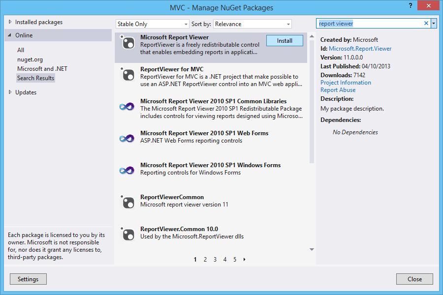
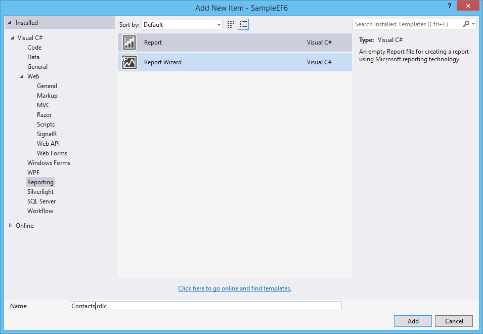
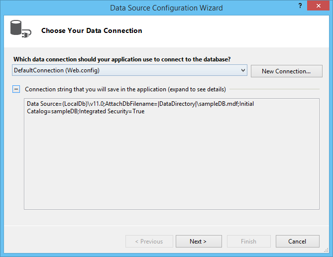
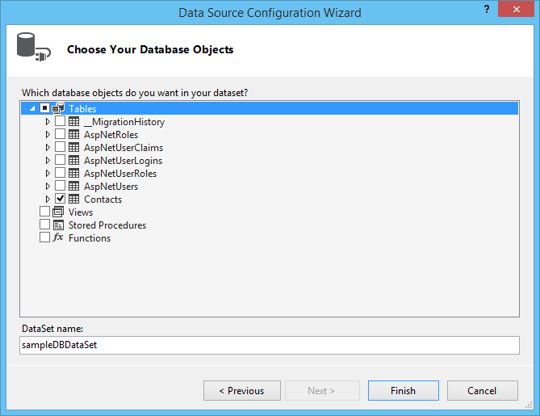
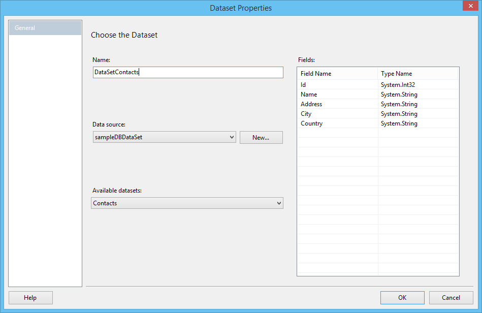
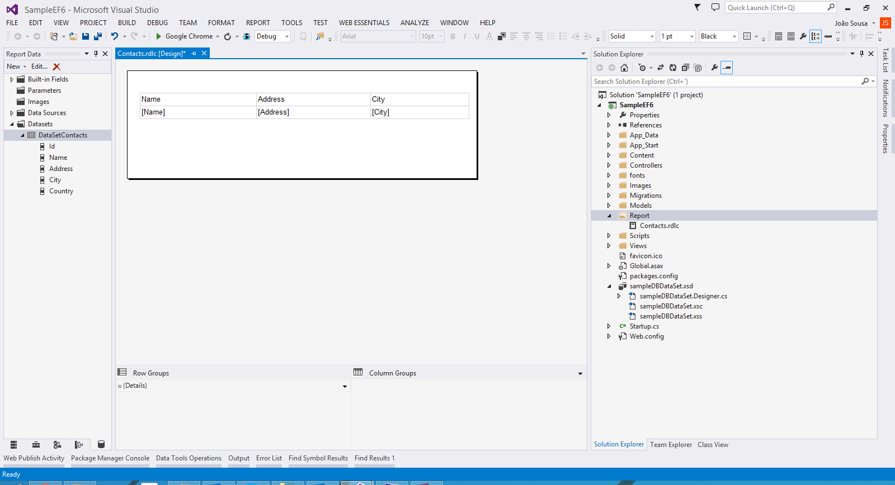
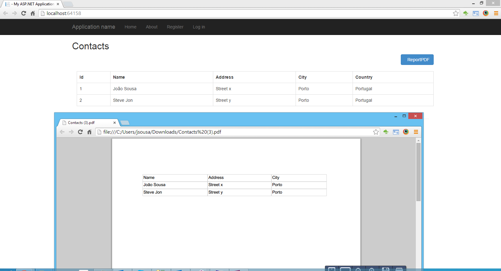

# ASP.NET MVC5 - AngularJS, Create PDF file using Microsoft Report
## Requires
- Visual Studio 2013
## License
- Apache License, Version 2.0
## Technologies
- C#
- ASP.NET
- Entity Framework
- MVC
- WebAPI
- AngularJS
- ReportViewer
## Topics
- C#
- ASP.NET
- MVC
- WebAPI
- AngularJS
- ReportViewer
## Updated
- 11/18/2014
## Description

<strong>Introduction</strong>

This article walks you through the steps for create a report in Word or PDF format using Microsoft Report without using Report Viewer.

&nbsp;

<strong>STEP 1 - Create ASP.NET Web Application</strong>

Check the link below, to see all the steps to create a Web Api wtih Entity Framework code first implementation.

<a href="http://social.technet.microsoft.com/wiki/contents/articles/26795.asp-net-webapi-entity-framework-code-first.aspx">http://social.technet.microsoft.com/wiki/contents/articles/26795.asp-net-webapi-entity-framework-code-first.aspx</a>

&nbsp;

<strong>STEP 2 - Install Microsoft Report Viewer Runtime into Machine</strong>

To have the ability to create reports into your project, you will need to install the Runtime of Microsoft Report Viewer.

Follow the link below and download it according with your visual studio version:

<a href="http://www.microsoft.com/en-us/download/details.aspx?id=35747">http://www.microsoft.com/en-us/download/details.aspx?id=35747</a>

&nbsp;

<strong>STEP 3 - Create Report</strong>

Add new item to our project of type Report.

For that on the left menu select Reporting option and then select Report item like on the image below.

Call it Contacts.rdlc.

Create new datasource associated with our connection string defined on web.config.

Select next button.

On this demo we will use table Contacts defined on our database.

Rename the dataset to DataSetContacts, and press the OK option.

After the creation of dataset we need to design our report.

For that create a table with three columns like on the image below.

This will display the Name, Address and City of each contact existent on the database table.

<strong>STEP 4 - PDF Generate Class</strong>

Create new controller called ReportControllers and had the GetPDFreport method:

&nbsp;

C#

Edit|Remove

csharp
<pre class="hidden">using System;
using System.Collections.Generic;
using System.Data.Entity;
using System.Data.Entity.Infrastructure;
using System.Linq;
using System.Net;
using System.Net.Http;
using System.Web.Http;
using SampleEF6.Models;
using System.Threading.Tasks;
using System.Web;
using System.IO;
using System.Net.Http.Headers;

namespace SampleEF6.Controllers
{
    public class ReportController : ApiController
    {
        // GET api/&lt;controller&gt;
        [HttpGet]
        public async Task&lt;HttpResponseMessage&gt; GetPDFReport()
        {
            string fileName = string.Concat(&quot;Contacts.pdf&quot;);
            string filePath = HttpContext.Current.Server.MapPath(&quot;~/Report/&quot; &#43; fileName);

            ContactController contact = new ContactController();
            List&lt;Contact&gt; contacList = contact.Get().ToList();

            await SampleEF6.Report.ReportGenerator.GeneratePDF(contacList, filePath);

            HttpResponseMessage result = null;
            result = Request.CreateResponse(HttpStatusCode.OK);
            result.Content = new StreamContent(new FileStream(filePath, FileMode.Open));
            result.Content.Headers.ContentDisposition = new ContentDispositionHeaderValue(&quot;attachment&quot;);
            result.Content.Headers.ContentDisposition.FileName = fileName;

            return result;
        }
    }
}</pre>

<pre class="csharp">using&nbsp;System;&nbsp;
using&nbsp;System.Collections.Generic;&nbsp;
using&nbsp;System.Data.Entity;&nbsp;
using&nbsp;System.Data.Entity.Infrastructure;&nbsp;
using&nbsp;System.Linq;&nbsp;
using&nbsp;System.Net;&nbsp;
using&nbsp;System.Net.Http;&nbsp;
using&nbsp;System.Web.Http;&nbsp;
using&nbsp;SampleEF6.Models;&nbsp;
using&nbsp;System.Threading.Tasks;&nbsp;
using&nbsp;System.Web;&nbsp;
using&nbsp;System.IO;&nbsp;
using&nbsp;System.Net.Http.Headers;&nbsp;
&nbsp;
namespace&nbsp;SampleEF6.Controllers&nbsp;
{&nbsp;
&nbsp;&nbsp;&nbsp;&nbsp;public&nbsp;class&nbsp;ReportController&nbsp;:&nbsp;ApiController&nbsp;
&nbsp;&nbsp;&nbsp;&nbsp;{&nbsp;
&nbsp;&nbsp;&nbsp;&nbsp;&nbsp;&nbsp;&nbsp;&nbsp;//&nbsp;GET&nbsp;api/&lt;controller&gt;&nbsp;
&nbsp;&nbsp;&nbsp;&nbsp;&nbsp;&nbsp;&nbsp;&nbsp;[HttpGet]&nbsp;
&nbsp;&nbsp;&nbsp;&nbsp;&nbsp;&nbsp;&nbsp;&nbsp;public&nbsp;async&nbsp;Task&lt;HttpResponseMessage&gt;&nbsp;GetPDFReport()&nbsp;
&nbsp;&nbsp;&nbsp;&nbsp;&nbsp;&nbsp;&nbsp;&nbsp;{&nbsp;
&nbsp;&nbsp;&nbsp;&nbsp;&nbsp;&nbsp;&nbsp;&nbsp;&nbsp;&nbsp;&nbsp;&nbsp;string&nbsp;fileName&nbsp;=&nbsp;string.Concat(&quot;Contacts.pdf&quot;);&nbsp;
&nbsp;&nbsp;&nbsp;&nbsp;&nbsp;&nbsp;&nbsp;&nbsp;&nbsp;&nbsp;&nbsp;&nbsp;string&nbsp;filePath&nbsp;=&nbsp;HttpContext.Current.Server.MapPath(&quot;~/Report/&quot;&nbsp;&#43;&nbsp;fileName);&nbsp;
&nbsp;
&nbsp;&nbsp;&nbsp;&nbsp;&nbsp;&nbsp;&nbsp;&nbsp;&nbsp;&nbsp;&nbsp;&nbsp;ContactController&nbsp;contact&nbsp;=&nbsp;new&nbsp;ContactController();&nbsp;
&nbsp;&nbsp;&nbsp;&nbsp;&nbsp;&nbsp;&nbsp;&nbsp;&nbsp;&nbsp;&nbsp;&nbsp;List&lt;Contact&gt;&nbsp;contacList&nbsp;=&nbsp;contact.Get().ToList();&nbsp;
&nbsp;
&nbsp;&nbsp;&nbsp;&nbsp;&nbsp;&nbsp;&nbsp;&nbsp;&nbsp;&nbsp;&nbsp;&nbsp;await&nbsp;SampleEF6.Report.ReportGenerator.GeneratePDF(contacList,&nbsp;filePath);&nbsp;
&nbsp;
&nbsp;&nbsp;&nbsp;&nbsp;&nbsp;&nbsp;&nbsp;&nbsp;&nbsp;&nbsp;&nbsp;&nbsp;HttpResponseMessage&nbsp;result&nbsp;=&nbsp;null;&nbsp;
&nbsp;&nbsp;&nbsp;&nbsp;&nbsp;&nbsp;&nbsp;&nbsp;&nbsp;&nbsp;&nbsp;&nbsp;result&nbsp;=&nbsp;Request.CreateResponse(HttpStatusCode.OK);&nbsp;
&nbsp;&nbsp;&nbsp;&nbsp;&nbsp;&nbsp;&nbsp;&nbsp;&nbsp;&nbsp;&nbsp;&nbsp;result.Content&nbsp;=&nbsp;new&nbsp;StreamContent(new&nbsp;FileStream(filePath,&nbsp;FileMode.Open));&nbsp;
&nbsp;&nbsp;&nbsp;&nbsp;&nbsp;&nbsp;&nbsp;&nbsp;&nbsp;&nbsp;&nbsp;&nbsp;result.Content.Headers.ContentDisposition&nbsp;=&nbsp;new&nbsp;ContentDispositionHeaderValue(&quot;attachment&quot;);&nbsp;
&nbsp;&nbsp;&nbsp;&nbsp;&nbsp;&nbsp;&nbsp;&nbsp;&nbsp;&nbsp;&nbsp;&nbsp;result.Content.Headers.ContentDisposition.FileName&nbsp;=&nbsp;fileName;&nbsp;
&nbsp;
&nbsp;&nbsp;&nbsp;&nbsp;&nbsp;&nbsp;&nbsp;&nbsp;&nbsp;&nbsp;&nbsp;&nbsp;return&nbsp;result;&nbsp;
&nbsp;&nbsp;&nbsp;&nbsp;&nbsp;&nbsp;&nbsp;&nbsp;}&nbsp;
&nbsp;&nbsp;&nbsp;&nbsp;}&nbsp;
}</pre>

Create the GeneratePDF method like this:

C#

Edit|Remove

csharp
<pre class="hidden">using Microsoft.Reporting.WebForms;
using SampleEF6.Models;
using System;
using System.Collections.Generic;
using System.IO;
using System.Linq;
using System.Reflection;
using System.Threading.Tasks;
using System.Web;

namespace SampleEF6.Report
{
    public class ReportGenerator
    {
        public static string Report = &quot;SampleEF6.Report.Contacts.rdlc&quot;;

        public static Task GeneratePDF(List&lt;Contact&gt; datasource, string filePath)
        {
            return Task.Run(() =&gt;
            {
                string binPath = System.IO.Path.Combine(System.AppDomain.CurrentDomain.BaseDirectory, &quot;bin&quot;);
                var assembly = Assembly.Load(System.IO.File.ReadAllBytes(binPath &#43; &quot;\\SampleEF6.dll&quot;));

                using (Stream stream = assembly.GetManifestResourceStream(Report))
                {
                    var viewer = new ReportViewer();
                    viewer.LocalReport.EnableExternalImages = true;
                    viewer.LocalReport.LoadReportDefinition(stream);

                    Warning[] warnings;
                    string[] streamids;
                    string mimeType;
                    string encoding;
                    string filenameExtension;

                    viewer.LocalReport.DataSources.Add(new ReportDataSource(&quot;DataSetContacts&quot;, datasource));

                    viewer.LocalReport.Refresh();

                    byte[] bytes = viewer.LocalReport.Render(
                        &quot;PDF&quot;, null, out mimeType, out encoding, out filenameExtension,
                        out streamids, out warnings);

                    using (FileStream fs = new FileStream(filePath, FileMode.Create))
                    {
                        fs.Write(bytes, 0, bytes.Length);
                    }
                }
            });
        }
    }
}</pre>

<pre class="js">using&nbsp;Microsoft.Reporting.WebForms;&nbsp;
using&nbsp;SampleEF6.Models;&nbsp;
using&nbsp;System;&nbsp;
using&nbsp;System.Collections.Generic;&nbsp;
using&nbsp;System.IO;&nbsp;
using&nbsp;System.Linq;&nbsp;
using&nbsp;System.Reflection;&nbsp;
using&nbsp;System.Threading.Tasks;&nbsp;
using&nbsp;System.Web;&nbsp;
&nbsp;
namespace&nbsp;SampleEF6.Report&nbsp;
{&nbsp;
&nbsp;&nbsp;&nbsp;&nbsp;public&nbsp;class&nbsp;ReportGenerator&nbsp;
&nbsp;&nbsp;&nbsp;&nbsp;{&nbsp;
&nbsp;&nbsp;&nbsp;&nbsp;&nbsp;&nbsp;&nbsp;&nbsp;public&nbsp;static&nbsp;string&nbsp;Report&nbsp;=&nbsp;&quot;SampleEF6.Report.Contacts.rdlc&quot;;&nbsp;
&nbsp;
&nbsp;&nbsp;&nbsp;&nbsp;&nbsp;&nbsp;&nbsp;&nbsp;public&nbsp;static&nbsp;Task&nbsp;GeneratePDF(List&lt;Contact&gt;&nbsp;datasource,&nbsp;string&nbsp;filePath)&nbsp;
&nbsp;&nbsp;&nbsp;&nbsp;&nbsp;&nbsp;&nbsp;&nbsp;{&nbsp;
&nbsp;&nbsp;&nbsp;&nbsp;&nbsp;&nbsp;&nbsp;&nbsp;&nbsp;&nbsp;&nbsp;&nbsp;return&nbsp;Task.Run(()&nbsp;=&gt;&nbsp;
&nbsp;&nbsp;&nbsp;&nbsp;&nbsp;&nbsp;&nbsp;&nbsp;&nbsp;&nbsp;&nbsp;&nbsp;{&nbsp;
&nbsp;&nbsp;&nbsp;&nbsp;&nbsp;&nbsp;&nbsp;&nbsp;&nbsp;&nbsp;&nbsp;&nbsp;&nbsp;&nbsp;&nbsp;&nbsp;string&nbsp;binPath&nbsp;=&nbsp;System.IO.Path.Combine(System.AppDomain.CurrentDomain.BaseDirectory,&nbsp;&quot;bin&quot;);&nbsp;
&nbsp;&nbsp;&nbsp;&nbsp;&nbsp;&nbsp;&nbsp;&nbsp;&nbsp;&nbsp;&nbsp;&nbsp;&nbsp;&nbsp;&nbsp;&nbsp;var&nbsp;assembly&nbsp;=&nbsp;Assembly.Load(System.IO.File.ReadAllBytes(binPath&nbsp;&#43;&nbsp;&quot;\\SampleEF6.dll&quot;));&nbsp;
&nbsp;
&nbsp;&nbsp;&nbsp;&nbsp;&nbsp;&nbsp;&nbsp;&nbsp;&nbsp;&nbsp;&nbsp;&nbsp;&nbsp;&nbsp;&nbsp;&nbsp;using&nbsp;(Stream&nbsp;stream&nbsp;=&nbsp;assembly.GetManifestResourceStream(Report))&nbsp;
&nbsp;&nbsp;&nbsp;&nbsp;&nbsp;&nbsp;&nbsp;&nbsp;&nbsp;&nbsp;&nbsp;&nbsp;&nbsp;&nbsp;&nbsp;&nbsp;{&nbsp;
&nbsp;&nbsp;&nbsp;&nbsp;&nbsp;&nbsp;&nbsp;&nbsp;&nbsp;&nbsp;&nbsp;&nbsp;&nbsp;&nbsp;&nbsp;&nbsp;&nbsp;&nbsp;&nbsp;&nbsp;var&nbsp;viewer&nbsp;=&nbsp;new&nbsp;ReportViewer();&nbsp;
&nbsp;&nbsp;&nbsp;&nbsp;&nbsp;&nbsp;&nbsp;&nbsp;&nbsp;&nbsp;&nbsp;&nbsp;&nbsp;&nbsp;&nbsp;&nbsp;&nbsp;&nbsp;&nbsp;&nbsp;viewer.LocalReport.EnableExternalImages&nbsp;=&nbsp;true;&nbsp;
&nbsp;&nbsp;&nbsp;&nbsp;&nbsp;&nbsp;&nbsp;&nbsp;&nbsp;&nbsp;&nbsp;&nbsp;&nbsp;&nbsp;&nbsp;&nbsp;&nbsp;&nbsp;&nbsp;&nbsp;viewer.LocalReport.LoadReportDefinition(stream);&nbsp;
&nbsp;
&nbsp;&nbsp;&nbsp;&nbsp;&nbsp;&nbsp;&nbsp;&nbsp;&nbsp;&nbsp;&nbsp;&nbsp;&nbsp;&nbsp;&nbsp;&nbsp;&nbsp;&nbsp;&nbsp;&nbsp;Warning[]&nbsp;warnings;&nbsp;
&nbsp;&nbsp;&nbsp;&nbsp;&nbsp;&nbsp;&nbsp;&nbsp;&nbsp;&nbsp;&nbsp;&nbsp;&nbsp;&nbsp;&nbsp;&nbsp;&nbsp;&nbsp;&nbsp;&nbsp;string[]&nbsp;streamids;&nbsp;
&nbsp;&nbsp;&nbsp;&nbsp;&nbsp;&nbsp;&nbsp;&nbsp;&nbsp;&nbsp;&nbsp;&nbsp;&nbsp;&nbsp;&nbsp;&nbsp;&nbsp;&nbsp;&nbsp;&nbsp;string&nbsp;mimeType;&nbsp;
&nbsp;&nbsp;&nbsp;&nbsp;&nbsp;&nbsp;&nbsp;&nbsp;&nbsp;&nbsp;&nbsp;&nbsp;&nbsp;&nbsp;&nbsp;&nbsp;&nbsp;&nbsp;&nbsp;&nbsp;string&nbsp;encoding;&nbsp;
&nbsp;&nbsp;&nbsp;&nbsp;&nbsp;&nbsp;&nbsp;&nbsp;&nbsp;&nbsp;&nbsp;&nbsp;&nbsp;&nbsp;&nbsp;&nbsp;&nbsp;&nbsp;&nbsp;&nbsp;string&nbsp;filenameExtension;&nbsp;
&nbsp;
&nbsp;&nbsp;&nbsp;&nbsp;&nbsp;&nbsp;&nbsp;&nbsp;&nbsp;&nbsp;&nbsp;&nbsp;&nbsp;&nbsp;&nbsp;&nbsp;&nbsp;&nbsp;&nbsp;&nbsp;viewer.LocalReport.DataSources.Add(new&nbsp;ReportDataSource(&quot;DataSetContacts&quot;,&nbsp;datasource));&nbsp;
&nbsp;
&nbsp;&nbsp;&nbsp;&nbsp;&nbsp;&nbsp;&nbsp;&nbsp;&nbsp;&nbsp;&nbsp;&nbsp;&nbsp;&nbsp;&nbsp;&nbsp;&nbsp;&nbsp;&nbsp;&nbsp;viewer.LocalReport.Refresh();&nbsp;
&nbsp;
&nbsp;&nbsp;&nbsp;&nbsp;&nbsp;&nbsp;&nbsp;&nbsp;&nbsp;&nbsp;&nbsp;&nbsp;&nbsp;&nbsp;&nbsp;&nbsp;&nbsp;&nbsp;&nbsp;&nbsp;byte[]&nbsp;bytes&nbsp;=&nbsp;viewer.LocalReport.Render(&nbsp;
&nbsp;&nbsp;&nbsp;&nbsp;&nbsp;&nbsp;&nbsp;&nbsp;&nbsp;&nbsp;&nbsp;&nbsp;&nbsp;&nbsp;&nbsp;&nbsp;&nbsp;&nbsp;&nbsp;&nbsp;&nbsp;&nbsp;&nbsp;&nbsp;&quot;PDF&quot;,&nbsp;null,&nbsp;out&nbsp;mimeType,&nbsp;out&nbsp;encoding,&nbsp;out&nbsp;filenameExtension,&nbsp;
&nbsp;&nbsp;&nbsp;&nbsp;&nbsp;&nbsp;&nbsp;&nbsp;&nbsp;&nbsp;&nbsp;&nbsp;&nbsp;&nbsp;&nbsp;&nbsp;&nbsp;&nbsp;&nbsp;&nbsp;&nbsp;&nbsp;&nbsp;&nbsp;out&nbsp;streamids,&nbsp;out&nbsp;warnings);&nbsp;
&nbsp;
&nbsp;&nbsp;&nbsp;&nbsp;&nbsp;&nbsp;&nbsp;&nbsp;&nbsp;&nbsp;&nbsp;&nbsp;&nbsp;&nbsp;&nbsp;&nbsp;&nbsp;&nbsp;&nbsp;&nbsp;using&nbsp;(FileStream&nbsp;fs&nbsp;=&nbsp;new&nbsp;FileStream(filePath,&nbsp;FileMode.Create))&nbsp;
&nbsp;&nbsp;&nbsp;&nbsp;&nbsp;&nbsp;&nbsp;&nbsp;&nbsp;&nbsp;&nbsp;&nbsp;&nbsp;&nbsp;&nbsp;&nbsp;&nbsp;&nbsp;&nbsp;&nbsp;{&nbsp;
&nbsp;&nbsp;&nbsp;&nbsp;&nbsp;&nbsp;&nbsp;&nbsp;&nbsp;&nbsp;&nbsp;&nbsp;&nbsp;&nbsp;&nbsp;&nbsp;&nbsp;&nbsp;&nbsp;&nbsp;&nbsp;&nbsp;&nbsp;&nbsp;fs.Write(bytes,&nbsp;0,&nbsp;bytes.Length);&nbsp;
&nbsp;&nbsp;&nbsp;&nbsp;&nbsp;&nbsp;&nbsp;&nbsp;&nbsp;&nbsp;&nbsp;&nbsp;&nbsp;&nbsp;&nbsp;&nbsp;&nbsp;&nbsp;&nbsp;&nbsp;}&nbsp;
&nbsp;&nbsp;&nbsp;&nbsp;&nbsp;&nbsp;&nbsp;&nbsp;&nbsp;&nbsp;&nbsp;&nbsp;&nbsp;&nbsp;&nbsp;&nbsp;}&nbsp;
&nbsp;&nbsp;&nbsp;&nbsp;&nbsp;&nbsp;&nbsp;&nbsp;&nbsp;&nbsp;&nbsp;&nbsp;});&nbsp;
&nbsp;&nbsp;&nbsp;&nbsp;&nbsp;&nbsp;&nbsp;&nbsp;}&nbsp;
&nbsp;&nbsp;&nbsp;&nbsp;}&nbsp;
}</pre>

&nbsp;

&nbsp;

<strong>STEP 5 - Run Application</strong>

<strong>Resources</strong>

<strong>Some good resources about Windows Azure could be found here:</strong>

<ul type="disc">
<li lang="en-US">My personal blog:&nbsp;<a href="http://joaoeduardosousa.wordpress.com/">http://joaoeduardosousa.wordpress.com/ &nbsp; &nbsp; &nbsp;</a>
</li></ul>
