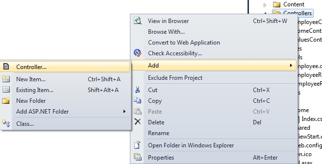
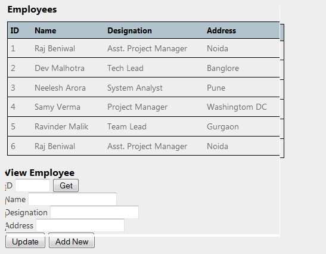
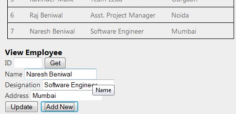
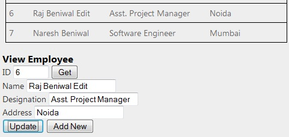

# ASP.NET Web API CRUD Operations
## Requires
- 
## License
- Apache License, Version 2.0
## Technologies
- ASP.NET
- ASP.NET Web API
## Topics
- ASP.NET Web API
- Web API
## Updated
- 05/08/2013
## Description

<h1>Introduction</h1>

This article demonstrates the CRUD operations of ASP.NET Web API.&nbsp;

<h1>Building the Sample</h1>

<strong>Getting Started</strong> &ndash; First of all you need to install .net framework 4.5 and MVC 4 if you are using visual studio 2010. Now create a new project in visual studio 2010 and select ASP.NET MVC 4 Web Application and select Web API template
 and click OK.

Description

What is ASP.NET Web API? ASP.NET Web API is a framework that makes it easy to build HTTP services that reach a broad range of clients, including browsers and mobile devices. ASP.NET Web API is an ideal platform for building RESTful applications on the .NET
 Framework.

&nbsp;

Now add a new claas in Models &ldquo;Employee&rdquo;

namespace WebAPISample1.Models

{

&nbsp;&nbsp;&nbsp; public class Employee

&nbsp;&nbsp;&nbsp; {

&nbsp;&nbsp;&nbsp;&nbsp;&nbsp;&nbsp;&nbsp; public int Id { get; set; }

&nbsp;&nbsp;&nbsp;&nbsp;&nbsp;&nbsp;&nbsp; public string Name { get; set; }

&nbsp;&nbsp;&nbsp;&nbsp;&nbsp;&nbsp;&nbsp; public string Designation { get; set; }

&nbsp;&nbsp;&nbsp;&nbsp;&nbsp;&nbsp;&nbsp; public string Address { get; set; }

&nbsp;&nbsp;&nbsp; }

}

&nbsp;

Now add one more class &ldquo;EmployeeRepository&rdquo;

namespace WebAPISample1.Models

{

&nbsp;&nbsp;&nbsp; public class EmployeeRepository : IEmployeeRepository

&nbsp;&nbsp;&nbsp; {

&nbsp;&nbsp;&nbsp;&nbsp;&nbsp;&nbsp;&nbsp; private List&lt;Employee&gt; _employee = new List&lt;Employee&gt;();

&nbsp;&nbsp;&nbsp;&nbsp;&nbsp;&nbsp;&nbsp; private int _nextId = 1;

&nbsp;

&nbsp;&nbsp;&nbsp;&nbsp;&nbsp;&nbsp;&nbsp; public EmployeeRepository()

&nbsp;&nbsp;&nbsp;&nbsp;&nbsp;&nbsp;&nbsp; {

&nbsp;&nbsp;&nbsp;&nbsp;&nbsp;&nbsp;&nbsp;&nbsp;&nbsp;&nbsp;&nbsp; this.Add(new Employee() { Name = &quot;Raj Beniwal&quot;, Designation = &quot;Asst. Project Manager&quot;, Address= &quot;Noida&quot; });

&nbsp;&nbsp;&nbsp;&nbsp;&nbsp;&nbsp;&nbsp;&nbsp;&nbsp;&nbsp;&nbsp; this.Add(new Employee() { Name = &quot;Dev Malhotra&quot;, Designation = &quot;Tech Lead&quot;, Address = &quot;Banglore&quot; });

&nbsp;&nbsp;&nbsp;&nbsp;&nbsp;&nbsp;&nbsp;&nbsp;&nbsp;&nbsp;&nbsp; this.Add(new Employee() { Name = &quot;Neelesh Arora&quot;, Designation = &quot;System Analyst&quot;, Address= &quot;Pune&quot;});

&nbsp;&nbsp;&nbsp;&nbsp;&nbsp;&nbsp;&nbsp;&nbsp;&nbsp;&nbsp;&nbsp; this.Add(new Employee() { Name = &quot;Samy Verma&quot;, Designation = &quot;Project Manager&quot;, Address = &quot;Washingtom DC&quot; });

&nbsp;&nbsp;&nbsp;&nbsp;&nbsp;&nbsp;&nbsp;&nbsp;&nbsp;&nbsp;&nbsp; this.Add(new Employee() { Name = &quot;Ravinder Malik&quot;, Designation = &quot;Team Lead&quot;, Address = &quot;Gurgaon&quot; });

&nbsp;&nbsp;&nbsp;&nbsp;&nbsp;&nbsp;&nbsp; }&nbsp;

&nbsp;&nbsp;&nbsp;&nbsp;&nbsp;&nbsp;&nbsp; public IQueryable&lt;Employee&gt; GetAll()

&nbsp;&nbsp;&nbsp;&nbsp;&nbsp;&nbsp;&nbsp; {

&nbsp;&nbsp;&nbsp;&nbsp;&nbsp;&nbsp;&nbsp;&nbsp;&nbsp;&nbsp;&nbsp; return _employee.AsQueryable();

&nbsp;&nbsp;&nbsp;&nbsp;&nbsp;&nbsp;&nbsp; }&nbsp;

&nbsp; &nbsp;&nbsp;&nbsp;&nbsp;&nbsp;&nbsp;public Employee Get(int id)

&nbsp;&nbsp;&nbsp;&nbsp;&nbsp;&nbsp;&nbsp; {

&nbsp;&nbsp;&nbsp;&nbsp;&nbsp;&nbsp;&nbsp;&nbsp;&nbsp;&nbsp;&nbsp; return _employee.Find(c =&gt; c.Id == id);

&nbsp;&nbsp;&nbsp;&nbsp;&nbsp;&nbsp;&nbsp; }&nbsp;

&nbsp;&nbsp;&nbsp;&nbsp;&nbsp;&nbsp;&nbsp; public Employee Add(Employee employee)

&nbsp;&nbsp;&nbsp;&nbsp;&nbsp;&nbsp;&nbsp; {

&nbsp;&nbsp;&nbsp;&nbsp;&nbsp;&nbsp;&nbsp;&nbsp;&nbsp;&nbsp;&nbsp; employee.Id = _nextId&#43;&#43;;

&nbsp;&nbsp;&nbsp;&nbsp;&nbsp;&nbsp;&nbsp;&nbsp;&nbsp;&nbsp;&nbsp; _employee.Add(employee);

&nbsp;&nbsp;&nbsp;&nbsp;&nbsp;&nbsp;&nbsp;&nbsp;&nbsp;&nbsp;&nbsp; return employee;

&nbsp;&nbsp;&nbsp;&nbsp;&nbsp;&nbsp;&nbsp; }&nbsp;

&nbsp;&nbsp;&nbsp;&nbsp;&nbsp;&nbsp;&nbsp; public void Remove(int id)

&nbsp;&nbsp;&nbsp;&nbsp;&nbsp;&nbsp;&nbsp; {

&nbsp;&nbsp;&nbsp;&nbsp;&nbsp;&nbsp;&nbsp;&nbsp;&nbsp;&nbsp;&nbsp; Employee employee = _employee.Find(c =&gt; c.Id == id);

&nbsp;&nbsp;&nbsp;&nbsp;&nbsp;&nbsp;&nbsp;&nbsp;&nbsp;&nbsp;&nbsp; _employee.Remove(employee);

&nbsp;&nbsp;&nbsp;&nbsp;&nbsp;&nbsp;&nbsp; }&nbsp;

&nbsp;&nbsp;&nbsp;&nbsp;&nbsp;&nbsp;&nbsp; public bool Update(Employee employee)

&nbsp;&nbsp;&nbsp;&nbsp;&nbsp;&nbsp;&nbsp; {

&nbsp;&nbsp;&nbsp;&nbsp;&nbsp;&nbsp;&nbsp;&nbsp;&nbsp;&nbsp;&nbsp; int index = _employee.FindIndex(c =&gt; c.Id == employee.Id);

&nbsp;&nbsp;&nbsp;&nbsp;&nbsp;&nbsp;&nbsp;&nbsp;&nbsp;&nbsp;&nbsp; if (index == -1)

&nbsp;&nbsp;&nbsp;&nbsp;&nbsp;&nbsp;&nbsp;&nbsp;&nbsp;&nbsp;&nbsp; {

&nbsp;&nbsp;&nbsp;&nbsp;&nbsp;&nbsp;&nbsp;&nbsp;&nbsp;&nbsp;&nbsp;&nbsp;&nbsp;&nbsp;&nbsp; return false;

&nbsp;&nbsp;&nbsp;&nbsp;&nbsp;&nbsp;&nbsp;&nbsp;&nbsp;&nbsp;&nbsp; }

&nbsp;&nbsp;&nbsp;&nbsp;&nbsp;&nbsp;&nbsp;&nbsp;&nbsp;&nbsp;&nbsp; _employee.RemoveAt(index);

&nbsp;&nbsp;&nbsp;&nbsp;&nbsp;&nbsp;&nbsp;&nbsp;&nbsp;&nbsp;&nbsp; _employee.Add(employee);

&nbsp;&nbsp;&nbsp;&nbsp;&nbsp;&nbsp;&nbsp;&nbsp;&nbsp;&nbsp;&nbsp; return true;

&nbsp;&nbsp;&nbsp;&nbsp;&nbsp;&nbsp;&nbsp; }

&nbsp; &nbsp;&nbsp;}

}&nbsp;

&nbsp;

Now add one interface &ldquo;IEmployeeRepository&rdquo;

namespace WebAPISample1.Models

{

&nbsp;&nbsp;&nbsp; public interface IEmployeeRepository

&nbsp;&nbsp;&nbsp; {

&nbsp;&nbsp;&nbsp;&nbsp;&nbsp;&nbsp;&nbsp; IQueryable&lt;Employee&gt; GetAll();

&nbsp;&nbsp;&nbsp;&nbsp;&nbsp;&nbsp;&nbsp; Employee Get(int id);

&nbsp;&nbsp;&nbsp;&nbsp;&nbsp;&nbsp;&nbsp; Employee Add(Employee item);

&nbsp;&nbsp;&nbsp;&nbsp;&nbsp;&nbsp;&nbsp; void Remove(int id);

&nbsp;&nbsp;&nbsp;&nbsp;&nbsp;&nbsp;&nbsp; bool Update(Employee item);

&nbsp;&nbsp;&nbsp; }

}

&nbsp;

Now add a new controller &ldquo;EmployeeController&rdquo; and call all model functions to expose data.

&nbsp;

&nbsp;

Image 1.

&nbsp;

using System;

using System.Collections.Generic;

using System.Linq;

using System.Net;

using System.Net.Http;

using System.Web.Http;

using WebAPISample1.Models;

&nbsp;

namespace WebAPISample1.Controllers

{

&nbsp;&nbsp;&nbsp; public class EmployeeController : ApiController

&nbsp;&nbsp;&nbsp; {

&nbsp;&nbsp;&nbsp;&nbsp;&nbsp;&nbsp;&nbsp; static readonly IEmployeeRepository repository = new EmployeeRepository();&nbsp;

&nbsp;&nbsp;&nbsp;&nbsp;&nbsp; &nbsp;&nbsp;public IEnumerable&lt;Employee&gt; GetAllEmployee()

&nbsp;&nbsp;&nbsp;&nbsp;&nbsp;&nbsp;&nbsp; {

&nbsp;&nbsp;&nbsp;&nbsp;&nbsp;&nbsp;&nbsp;&nbsp;&nbsp;&nbsp;&nbsp; return repository.GetAll();

&nbsp;&nbsp;&nbsp;&nbsp;&nbsp;&nbsp;&nbsp; }&nbsp;

&nbsp;&nbsp;&nbsp;&nbsp;&nbsp;&nbsp;&nbsp; public Employee GetEmployee(int id)

&nbsp;&nbsp;&nbsp;&nbsp;&nbsp;&nbsp;&nbsp; {

&nbsp;&nbsp;&nbsp;&nbsp;&nbsp;&nbsp;&nbsp;&nbsp;&nbsp;&nbsp;&nbsp; Employee item = repository.Get(id);

&nbsp;&nbsp;&nbsp;&nbsp;&nbsp;&nbsp;&nbsp;&nbsp;&nbsp;&nbsp;&nbsp; if (item == null)

&nbsp;&nbsp;&nbsp;&nbsp;&nbsp;&nbsp;&nbsp;&nbsp;&nbsp;&nbsp;&nbsp; {

&nbsp;&nbsp;&nbsp;&nbsp;&nbsp;&nbsp;&nbsp;&nbsp;&nbsp;&nbsp;&nbsp;&nbsp;&nbsp;&nbsp;&nbsp; throw new HttpResponseException(new HttpResponseMessage(HttpStatusCode.NotFound));

&nbsp;&nbsp;&nbsp;&nbsp;&nbsp;&nbsp;&nbsp;&nbsp;&nbsp;&nbsp;&nbsp; }

&nbsp;&nbsp;&nbsp;&nbsp;&nbsp;&nbsp;&nbsp;&nbsp;&nbsp;&nbsp;&nbsp; return item;

&nbsp;&nbsp;&nbsp;&nbsp;&nbsp;&nbsp;&nbsp; }&nbsp;

&nbsp;&nbsp;&nbsp;&nbsp;&nbsp;&nbsp;&nbsp; public IEnumerable&lt;Employee&gt; GetEmployeeByName(string name)

&nbsp;&nbsp;&nbsp;&nbsp;&nbsp;&nbsp;&nbsp; {

&nbsp;&nbsp;&nbsp;&nbsp;&nbsp;&nbsp;&nbsp;&nbsp;&nbsp;&nbsp;&nbsp; return repository.GetAll().Where(

&nbsp;&nbsp;&nbsp;&nbsp;&nbsp;&nbsp;&nbsp;&nbsp;&nbsp;&nbsp;&nbsp;&nbsp;&nbsp;&nbsp;&nbsp; p =&gt; string.Equals(p.Name, name, StringComparison.OrdinalIgnoreCase));

&nbsp;&nbsp;&nbsp;&nbsp;&nbsp;&nbsp;&nbsp; }&nbsp;

&nbsp;&nbsp;&nbsp;&nbsp;&nbsp;&nbsp;&nbsp; public HttpResponseMessage PostEmployee(Employee item)

&nbsp;&nbsp;&nbsp;&nbsp;&nbsp;&nbsp;&nbsp; {

&nbsp;&nbsp;&nbsp;&nbsp;&nbsp;&nbsp;&nbsp;&nbsp;&nbsp;&nbsp;&nbsp; item = repository.Add(item);

&nbsp;&nbsp;&nbsp;&nbsp;&nbsp;&nbsp;&nbsp;&nbsp;&nbsp;&nbsp;&nbsp; var response = Request.CreateResponse&lt;Employee&gt;(HttpStatusCode.Created, item);

&nbsp;&nbsp;&nbsp;&nbsp;&nbsp;&nbsp;&nbsp;&nbsp;&nbsp;&nbsp;&nbsp; string uri = Url.Link(&quot;DefaultApi&quot;, new { id = item.Id });

&nbsp;&nbsp;&nbsp;&nbsp;&nbsp;&nbsp;&nbsp;&nbsp;&nbsp;&nbsp;&nbsp; response.Headers.Location = new Uri(uri);

&nbsp;&nbsp;&nbsp;&nbsp;&nbsp;&nbsp;&nbsp;&nbsp;&nbsp;&nbsp;&nbsp; return response;

&nbsp;&nbsp;&nbsp;&nbsp;&nbsp;&nbsp;&nbsp; }&nbsp;

&nbsp;&nbsp;&nbsp;&nbsp;&nbsp;&nbsp;&nbsp; public void PutEmployee(int id, Employee employee)

&nbsp;&nbsp;&nbsp;&nbsp;&nbsp;&nbsp;&nbsp; {

&nbsp;&nbsp;&nbsp;&nbsp;&nbsp;&nbsp;&nbsp;&nbsp;&nbsp;&nbsp;&nbsp; employee.Id = id;

&nbsp;&nbsp;&nbsp;&nbsp;&nbsp;&nbsp;&nbsp;&nbsp;&nbsp;&nbsp;&nbsp; if (!repository.Update(employee))

&nbsp;&nbsp;&nbsp;&nbsp;&nbsp;&nbsp;&nbsp;&nbsp;&nbsp;&nbsp;&nbsp; {

&nbsp;&nbsp;&nbsp;&nbsp;&nbsp;&nbsp;&nbsp;&nbsp;&nbsp;&nbsp;&nbsp;&nbsp;&nbsp;&nbsp;&nbsp; throw new HttpResponseException(new HttpResponseMessage(HttpStatusCode.NotFound));

&nbsp;&nbsp;&nbsp;&nbsp;&nbsp;&nbsp;&nbsp;&nbsp;&nbsp;&nbsp;&nbsp; }

&nbsp;&nbsp;&nbsp;&nbsp;&nbsp;&nbsp;&nbsp; }&nbsp;

&nbsp;&nbsp;&nbsp;&nbsp;&nbsp;&nbsp;&nbsp; public HttpResponseMessage DeleteEmployee(int id)

&nbsp;&nbsp;&nbsp;&nbsp;&nbsp;&nbsp;&nbsp; {

&nbsp;&nbsp;&nbsp;&nbsp;&nbsp;&nbsp;&nbsp;&nbsp;&nbsp;&nbsp;&nbsp; repository.Remove(id);

&nbsp;&nbsp;&nbsp;&nbsp;&nbsp;&nbsp;&nbsp;&nbsp;&nbsp;&nbsp;&nbsp; return new HttpResponseMessage(HttpStatusCode.NoContent);

&nbsp;&nbsp;&nbsp;&nbsp;&nbsp;&nbsp;&nbsp; }

&nbsp;&nbsp;&nbsp; }

}

&nbsp;

We are done here with models and controller work. now you can see API data like this.&nbsp;

<a href="http://localhost:56065/api/employee">http://localhost:56065/api/employee</a>.&nbsp;

&nbsp;

Let&rsquo;s load the data in view now.&nbsp;

Add a new view in Views/Home folder.&nbsp;

@{

&nbsp;&nbsp;&nbsp; ViewBag.Title = &quot;Employee List&quot;;

}

@section scripts {

&nbsp;&nbsp;&nbsp; &nbsp;

&nbsp;&nbsp;&nbsp; &lt;script src=&quot;@Url.Content(&quot;~/Scripts/jquery-1.6.2.js&quot;)&quot; type=&quot;text/javascript&quot;&gt;&lt;/script&gt;

&nbsp;&nbsp;&nbsp; &lt;script src=&quot;@Url.Content(&quot;~/Scripts/knockout-2.0.0.debug.js&quot;)&quot; type=&quot;text/javascript&quot;&gt;&lt;/script&gt;

&nbsp;&nbsp;&nbsp; &lt;script type=&quot;text/javascript&quot;&gt;

&nbsp;

&nbsp;&nbsp;&nbsp;&nbsp;&nbsp;&nbsp;&nbsp; function clearStatus() {

&nbsp;&nbsp;&nbsp;&nbsp;&nbsp;&nbsp;&nbsp;&nbsp;&nbsp;&nbsp;&nbsp; $('#status').html('');

&nbsp;&nbsp;&nbsp;&nbsp;&nbsp;&nbsp;&nbsp; }

&nbsp;

&nbsp;&nbsp;&nbsp;&nbsp;&nbsp;&nbsp;&nbsp; var detailModel = function () {

&nbsp;&nbsp;&nbsp;&nbsp;&nbsp;&nbsp;&nbsp;&nbsp;&nbsp;&nbsp;&nbsp; this.Name = ko.observable();

&nbsp;&nbsp;&nbsp;&nbsp;&nbsp;&nbsp;&nbsp;&nbsp;&nbsp;&nbsp;&nbsp; this.Designation = ko.observable();

&nbsp;&nbsp;&nbsp;&nbsp;&nbsp;&nbsp;&nbsp;&nbsp; &nbsp;&nbsp;&nbsp;this.Address = ko.observable();

&nbsp;&nbsp;&nbsp;&nbsp;&nbsp;&nbsp;&nbsp; }

&nbsp;

&nbsp;&nbsp;&nbsp;&nbsp;&nbsp;&nbsp;&nbsp; var API_URL = &quot;api/employee/&quot;;

&nbsp;&nbsp;&nbsp;&nbsp;&nbsp;&nbsp;&nbsp; var viewModel = new detailModel();

&nbsp;

&nbsp;&nbsp;&nbsp;&nbsp;&nbsp;&nbsp;&nbsp; //This function used to insert new employee record

&nbsp;&nbsp;&nbsp;&nbsp;&nbsp;&nbsp;&nbsp; function add() {

&nbsp;&nbsp;&nbsp;&nbsp;&nbsp;&nbsp;&nbsp;&nbsp;&nbsp;&nbsp;&nbsp; clearStatus();

&nbsp;&nbsp;&nbsp;&nbsp;&nbsp;&nbsp;&nbsp;&nbsp;&nbsp;&nbsp;&nbsp; var employee = ko.toJS(viewModel);

&nbsp;&nbsp;&nbsp;&nbsp;&nbsp;&nbsp;&nbsp;&nbsp;&nbsp;&nbsp;&nbsp; var json = JSON.stringify(employee);

&nbsp;

&nbsp;&nbsp;&nbsp;&nbsp;&nbsp;&nbsp;&nbsp;&nbsp;&nbsp;&nbsp;&nbsp; $.ajax({

&nbsp;&nbsp;&nbsp;&nbsp;&nbsp;&nbsp;&nbsp;&nbsp;&nbsp;&nbsp;&nbsp;&nbsp;&nbsp;&nbsp;&nbsp; url: API_URL,

&nbsp;&nbsp;&nbsp;&nbsp;&nbsp;&nbsp;&nbsp;&nbsp;&nbsp;&nbsp;&nbsp;&nbsp;&nbsp;&nbsp;&nbsp; cache: false,

&nbsp;&nbsp;&nbsp;&nbsp;&nbsp;&nbsp;&nbsp;&nbsp;&nbsp;&nbsp;&nbsp;&nbsp;&nbsp;&nbsp;&nbsp; type: 'POST',

&nbsp;&nbsp;&nbsp;&nbsp;&nbsp;&nbsp;&nbsp;&nbsp;&nbsp;&nbsp;&nbsp;&nbsp;&nbsp;&nbsp;&nbsp; contentType: 'application/json; charset=utf-8',

&nbsp;&nbsp;&nbsp;&nbsp;&nbsp;&nbsp;&nbsp;&nbsp;&nbsp;&nbsp;&nbsp;&nbsp;&nbsp;&nbsp;&nbsp; data: json,

&nbsp;&nbsp;&nbsp;&nbsp;&nbsp;&nbsp;&nbsp;&nbsp;&nbsp;&nbsp;&nbsp;&nbsp;&nbsp;&nbsp;&nbsp; statusCode: {

&nbsp;&nbsp;&nbsp;&nbsp;&nbsp;&nbsp;&nbsp;&nbsp;&nbsp;&nbsp;&nbsp;&nbsp;&nbsp;&nbsp;&nbsp;&nbsp;&nbsp;&nbsp;&nbsp; 201 /*Created*/: function (data) {

&nbsp;&nbsp;&nbsp;&nbsp;&nbsp;&nbsp;&nbsp;&nbsp;&nbsp;&nbsp;&nbsp;&nbsp;&nbsp;&nbsp;&nbsp;&nbsp;&nbsp;&nbsp;&nbsp;&nbsp;&nbsp;&nbsp;&nbsp; self.employees.push(data);

&nbsp;&nbsp;&nbsp;&nbsp;&nbsp;&nbsp;&nbsp;&nbsp;&nbsp;&nbsp;&nbsp;&nbsp;&nbsp;&nbsp;&nbsp;&nbsp;&nbsp;&nbsp;&nbsp; }

&nbsp;&nbsp;&nbsp;&nbsp;&nbsp;&nbsp;&nbsp;&nbsp;&nbsp;&nbsp;&nbsp;&nbsp;&nbsp;&nbsp;&nbsp; }

&nbsp;&nbsp;&nbsp;&nbsp;&nbsp;&nbsp;&nbsp;&nbsp;&nbsp;&nbsp;&nbsp; });

&nbsp;&nbsp;&nbsp;&nbsp;&nbsp;&nbsp;&nbsp; }

&nbsp;

&nbsp;&nbsp;&nbsp;&nbsp;&nbsp;&nbsp;&nbsp; //This function used to find employee by id

&nbsp;&nbsp;&nbsp;&nbsp;&nbsp;&nbsp;&nbsp; function find() {

&nbsp;&nbsp;&nbsp;&nbsp;&nbsp;&nbsp;&nbsp;&nbsp;&nbsp;&nbsp;&nbsp; clearStatus();

&nbsp;&nbsp;&nbsp;&nbsp;&nbsp;&nbsp;&nbsp;&nbsp;&nbsp;&nbsp;&nbsp; var id = $('#employeeId').val();

&nbsp;&nbsp;&nbsp;&nbsp;&nbsp;&nbsp;&nbsp;&nbsp;&nbsp;&nbsp;&nbsp; $.getJSON(API_URL &#43; id,

&nbsp;&nbsp;&nbsp;&nbsp;&nbsp;&nbsp;&nbsp;&nbsp;&nbsp;&nbsp;&nbsp; function (data) {

&nbsp;&nbsp;&nbsp;&nbsp;&nbsp;&nbsp;&nbsp;&nbsp;&nbsp;&nbsp;&nbsp;&nbsp;&nbsp;&nbsp;&nbsp; viewModel.Name(data.Name);

&nbsp;&nbsp;&nbsp;&nbsp;&nbsp;&nbsp;&nbsp;&nbsp;&nbsp;&nbsp;&nbsp;&nbsp;&nbsp;&nbsp;&nbsp; viewModel.Designation(data.Designation);

&nbsp;&nbsp;&nbsp;&nbsp;&nbsp;&nbsp;&nbsp;&nbsp;&nbsp;&nbsp;&nbsp;&nbsp;&nbsp;&nbsp;&nbsp; viewModel.Address(data.Address);

&nbsp;&nbsp;&nbsp;&nbsp;&nbsp;&nbsp;&nbsp;&nbsp;&nbsp;&nbsp;&nbsp; })

&nbsp;&nbsp;&nbsp;&nbsp;&nbsp;&nbsp;&nbsp; .fail(

&nbsp;&nbsp;&nbsp;&nbsp;&nbsp;&nbsp;&nbsp;&nbsp;&nbsp;&nbsp;&nbsp; function (xhr, textStatus, err) {

&nbsp;&nbsp;&nbsp;&nbsp;&nbsp;&nbsp;&nbsp;&nbsp;&nbsp;&nbsp;&nbsp;&nbsp;&nbsp;&nbsp;&nbsp; $('#status').html('Error: ' &#43; err);

&nbsp;&nbsp;&nbsp;&nbsp;&nbsp;&nbsp;&nbsp;&nbsp;&nbsp;&nbsp;&nbsp; });

&nbsp;&nbsp;&nbsp;&nbsp;&nbsp;&nbsp;&nbsp; }

&nbsp;

&nbsp;&nbsp;&nbsp;&nbsp;&nbsp;&nbsp;&nbsp; //This function used to updated employee based on id

&nbsp;&nbsp;&nbsp;&nbsp;&nbsp;&nbsp;&nbsp; function update() {

&nbsp;&nbsp;&nbsp;&nbsp;&nbsp;&nbsp;&nbsp;&nbsp;&nbsp;&nbsp;&nbsp; clearStatus();

&nbsp;&nbsp;&nbsp;&nbsp;&nbsp;&nbsp;&nbsp;&nbsp;&nbsp;&nbsp;&nbsp; var id = $('#employeeId').val();&nbsp;&nbsp;&nbsp;&nbsp;&nbsp;&nbsp;&nbsp;&nbsp;&nbsp;&nbsp;&nbsp;

&nbsp;&nbsp;&nbsp;&nbsp;&nbsp;&nbsp;&nbsp;&nbsp;&nbsp;&nbsp;&nbsp; var employees = ko.toJS(viewModel);

&nbsp;&nbsp;&nbsp;&nbsp;&nbsp;&nbsp;&nbsp;&nbsp;&nbsp;&nbsp;&nbsp; var json = JSON.stringify(employees);

&nbsp;&nbsp;&nbsp;&nbsp;&nbsp;&nbsp;&nbsp;&nbsp;&nbsp;&nbsp;&nbsp; $.ajax({

&nbsp;&nbsp;&nbsp;&nbsp;&nbsp;&nbsp;&nbsp;&nbsp;&nbsp;&nbsp;&nbsp;&nbsp;&nbsp;&nbsp;&nbsp; url: API_URL &#43; id,

&nbsp;&nbsp;&nbsp;&nbsp;&nbsp;&nbsp;&nbsp;&nbsp;&nbsp;&nbsp;&nbsp;&nbsp;&nbsp;&nbsp;&nbsp; cache: false,

&nbsp;&nbsp;&nbsp;&nbsp;&nbsp;&nbsp;&nbsp;&nbsp;&nbsp;&nbsp;&nbsp;&nbsp;&nbsp;&nbsp;&nbsp; type: 'PUT',

&nbsp;&nbsp;&nbsp;&nbsp;&nbsp;&nbsp;&nbsp;&nbsp;&nbsp;&nbsp;&nbsp;&nbsp;&nbsp;&nbsp;&nbsp; contentType: 'application/json; charset=utf-8',

&nbsp;&nbsp;&nbsp;&nbsp;&nbsp;&nbsp;&nbsp;&nbsp;&nbsp;&nbsp;&nbsp;&nbsp;&nbsp;&nbsp;&nbsp; data: json,

&nbsp;&nbsp;&nbsp;&nbsp;&nbsp;&nbsp;&nbsp;&nbsp;&nbsp;&nbsp;&nbsp;&nbsp;&nbsp;&nbsp;&nbsp; success: function () { $.getJSON(API_URL, self.employees.update); }

&nbsp;&nbsp;&nbsp;&nbsp;&nbsp;&nbsp;&nbsp;&nbsp;&nbsp;&nbsp;&nbsp; })

&nbsp;&nbsp;&nbsp;&nbsp;&nbsp;&nbsp;&nbsp;&nbsp;&nbsp;&nbsp;&nbsp; .fail(

&nbsp;&nbsp;&nbsp;&nbsp;&nbsp;&nbsp;&nbsp;&nbsp;&nbsp;&nbsp;&nbsp; function (xhr, textStatus, err) {

&nbsp;&nbsp;&nbsp;&nbsp;&nbsp;&nbsp;&nbsp;&nbsp;&nbsp;&nbsp;&nbsp;&nbsp;&nbsp;&nbsp;&nbsp; $('#status').html('Error: ' &#43; err);

&nbsp;&nbsp;&nbsp;&nbsp;&nbsp;&nbsp;&nbsp;&nbsp;&nbsp;&nbsp;&nbsp; });

&nbsp;&nbsp;&nbsp;&nbsp;&nbsp;&nbsp;&nbsp; }&nbsp;

&nbsp;&nbsp;&nbsp;&nbsp;&nbsp;&nbsp;&nbsp; $(document).ready(function () {

&nbsp;&nbsp;&nbsp;&nbsp;&nbsp;&nbsp;&nbsp;&nbsp;&nbsp;&nbsp;&nbsp; self.employees = ko.observableArray();

&nbsp;&nbsp;&nbsp;&nbsp;&nbsp;&nbsp;&nbsp;&nbsp;&nbsp;&nbsp;&nbsp; self.employees.update = function (data) {

&nbsp;&nbsp;&nbsp;&nbsp;&nbsp;&nbsp;&nbsp;&nbsp;&nbsp;&nbsp;&nbsp;&nbsp;&nbsp;&nbsp;&nbsp; var c = self.employees;

&nbsp;&nbsp;&nbsp;&nbsp;&nbsp;&nbsp;&nbsp;&nbsp;&nbsp;&nbsp;&nbsp;&nbsp;&nbsp;&nbsp;&nbsp; c.removeAll();

&nbsp;&nbsp;&nbsp;&nbsp;&nbsp;&nbsp;&nbsp;&nbsp;&nbsp;&nbsp;&nbsp;&nbsp;&nbsp;&nbsp;&nbsp; c.push.apply(c, data);

&nbsp;&nbsp;&nbsp;&nbsp;&nbsp;&nbsp;&nbsp;&nbsp;&nbsp;&nbsp;&nbsp;&nbsp;&nbsp;&nbsp;&nbsp; // Sort by ID

&nbsp;&nbsp;&nbsp;&nbsp;&nbsp;&nbsp;&nbsp;&nbsp;&nbsp;&nbsp;&nbsp;&nbsp;&nbsp;&nbsp;&nbsp; c.sort(

&nbsp;&nbsp;&nbsp;&nbsp;&nbsp;&nbsp;&nbsp;&nbsp;&nbsp;&nbsp;&nbsp;&nbsp;&nbsp;&nbsp;&nbsp;&nbsp;&nbsp;&nbsp;&nbsp;&nbsp;&nbsp;&nbsp;&nbsp; function (left, right) { return left.Id - right.Id }

&nbsp;&nbsp;&nbsp;&nbsp;&nbsp;&nbsp;&nbsp;&nbsp;&nbsp;&nbsp;&nbsp;&nbsp;&nbsp;&nbsp;&nbsp;&nbsp;&nbsp;&nbsp;&nbsp;&nbsp;&nbsp;&nbsp;&nbsp; );

&nbsp;&nbsp;&nbsp;&nbsp;&nbsp;&nbsp;&nbsp;&nbsp;&nbsp;&nbsp;&nbsp; };

&nbsp;&nbsp;&nbsp;&nbsp;&nbsp;&nbsp;&nbsp;&nbsp;&nbsp;&nbsp;&nbsp; ko.applyBindings(self.employees, document.getElementById('employees'));

&nbsp;&nbsp;&nbsp;&nbsp;&nbsp;&nbsp;&nbsp;&nbsp;&nbsp;&nbsp;&nbsp; ko.applyBindings(viewModel, document.getElementById('detail'));

&nbsp;&nbsp;&nbsp;&nbsp;&nbsp;&nbsp;&nbsp;&nbsp;&nbsp;&nbsp;&nbsp; $.getJSON(API_URL, self.employees.update);

&nbsp;&nbsp;&nbsp;&nbsp;&nbsp;&nbsp;&nbsp; });&nbsp;

&nbsp;&nbsp;&nbsp; &lt;/script&gt;

}

&lt;div id=&quot;body&quot;&gt;

&nbsp;&nbsp;&nbsp; &lt;section class=&quot;content-wrapper main-content&quot;&gt;

&nbsp;&nbsp;&nbsp;&nbsp;&nbsp;&nbsp;&nbsp; &lt;h3&gt;Employees&lt;/h3&gt;

&nbsp;&nbsp;&nbsp;&nbsp;&nbsp;&nbsp;&nbsp; &lt;table id=&quot;employees&quot;&gt;

&nbsp;&nbsp;&nbsp;&nbsp;&nbsp;&nbsp;&nbsp; &lt;thead&gt;

&nbsp;&nbsp;&nbsp;&nbsp;&nbsp;&nbsp;&nbsp;&nbsp;&nbsp;&nbsp;&nbsp; &lt;tr&gt;&lt;th&gt;ID&lt;/th&gt;&lt;th&gt;Name&lt;/th&gt;&lt;th&gt;Designation&lt;/th&gt;&lt;th&gt;Address&lt;/th&gt;&lt;/tr&gt;

&nbsp;&nbsp;&nbsp;&nbsp;&nbsp;&nbsp;&nbsp; &lt;/thead&gt;

&nbsp;&nbsp;&nbsp;&nbsp;&nbsp;&nbsp;&nbsp; &lt;tbody data-bind=&quot;foreach: employees&quot;&gt;

&nbsp;&nbsp;&nbsp;&nbsp;&nbsp;&nbsp;&nbsp;&nbsp;&nbsp;&nbsp;&nbsp; &lt;tr&gt;

&nbsp;&nbsp;&nbsp;&nbsp;&nbsp;&nbsp;&nbsp;&nbsp;&nbsp;&nbsp;&nbsp;&nbsp;&nbsp;&nbsp;&nbsp; &lt;td data-bind=&quot;text: Id&quot;&gt;&lt;/td&gt;

&nbsp;&nbsp;&nbsp;&nbsp;&nbsp;&nbsp;&nbsp;&nbsp;&nbsp;&nbsp;&nbsp;&nbsp;&nbsp;&nbsp;&nbsp; &lt;td data-bind=&quot;text: Name&quot;&gt;&lt;/td&gt;

&nbsp;&nbsp;&nbsp;&nbsp;&nbsp;&nbsp;&nbsp;&nbsp;&nbsp;&nbsp;&nbsp;&nbsp;&nbsp;&nbsp;&nbsp; &lt;td data-bind=&quot;text: Designation&quot;&gt;&lt;/td&gt;

&nbsp;&nbsp;&nbsp;&nbsp;&nbsp;&nbsp;&nbsp;&nbsp;&nbsp;&nbsp;&nbsp;&nbsp;&nbsp;&nbsp;&nbsp; &lt;td data-bind=&quot;text: Address&quot;&gt;&lt;/td&gt;

&nbsp;&nbsp;&nbsp;&nbsp;&nbsp;&nbsp;&nbsp;&nbsp;&nbsp;&nbsp;&nbsp; &lt;/tr&gt;

&nbsp;&nbsp;&nbsp;&nbsp;&nbsp;&nbsp;&nbsp; &lt;/tbody&gt;

&nbsp;&nbsp;&nbsp;&nbsp;&nbsp;&nbsp;&nbsp; &lt;/table&gt;&nbsp;

&nbsp;&nbsp;&nbsp; &lt;/section&gt;

&nbsp;&nbsp;&nbsp; &lt;section id=&quot;detail&quot; class=&quot;content-wrapper&quot;&gt;

&nbsp;&nbsp;&nbsp;&nbsp;&nbsp;&nbsp;&nbsp; &lt;h3&gt;View Employee&lt;/h3&gt;&nbsp;

&nbsp;&nbsp;&nbsp;&nbsp;&nbsp;&nbsp;&nbsp; &lt;div&gt;

&nbsp;&nbsp;&nbsp;&nbsp;&nbsp;&nbsp;&nbsp; &lt;label for=&quot;employeeId&quot;&gt;ID&lt;/label&gt;

&nbsp;&nbsp;&nbsp;&nbsp;&nbsp;&nbsp;&nbsp; &lt;input type=&quot;text&quot; title=&quot;ID&quot; id=&quot;employeeId&quot; size=&quot;5&quot;/&gt;

&nbsp;&nbsp;&nbsp;&nbsp;&nbsp;&nbsp;&nbsp; &lt;input type=&quot;button&quot; value=&quot;Get&quot; onclick=&quot;find();&quot; /&gt;

&nbsp;&nbsp;&nbsp;&nbsp;&nbsp;&nbsp;&nbsp; &lt;/div&gt;&nbsp;

&nbsp;&nbsp;&nbsp;&nbsp;&nbsp;&nbsp;&nbsp; &lt;div&gt;

&nbsp;&nbsp;&nbsp;&nbsp;&nbsp;&nbsp;&nbsp; &lt;label for=&quot;name&quot;&gt;Name&lt;/label&gt;

&nbsp;&nbsp;&nbsp;&nbsp;&nbsp;&nbsp;&nbsp; &lt;input data-bind=&quot;value: Name&quot; type=&quot;text&quot; title=&quot;Name&quot; id=&quot;name&quot; /&gt;

&nbsp;&nbsp;&nbsp;&nbsp;&nbsp;&nbsp;&nbsp; &lt;/div&gt;&nbsp;

&nbsp;&nbsp;&nbsp;&nbsp;&nbsp;&nbsp;&nbsp; &lt;div&gt;

&nbsp;&nbsp;&nbsp;&nbsp;&nbsp;&nbsp;&nbsp; &lt;label for=&quot;designation&quot;&gt;Designation&lt;/label&gt;

&nbsp;&nbsp;&nbsp;&nbsp;&nbsp;&nbsp;&nbsp; &lt;input data-bind=&quot;value: Designation&quot; type=&quot;text&quot; title=&quot;Designation&quot; id=&quot;designation&quot; /&gt;

&nbsp;&nbsp;&nbsp;&nbsp;&nbsp;&nbsp;&nbsp; &lt;/div&gt;&nbsp;

&nbsp;&nbsp;&nbsp;&nbsp;&nbsp;&nbsp;&nbsp; &lt;div&gt;

&nbsp;&nbsp;&nbsp;&nbsp;&nbsp;&nbsp;&nbsp; &lt;label for=&quot;address&quot;&gt;Address&lt;/label&gt;

&nbsp;&nbsp;&nbsp;&nbsp;&nbsp;&nbsp;&nbsp; &lt;input data-bind=&quot;value: Address&quot; type=&quot;text&quot; title=&quot;Address&quot; id=&quot;address&quot; /&gt;

&nbsp;&nbsp;&nbsp;&nbsp;&nbsp;&nbsp;&nbsp; &lt;/div&gt;&nbsp;

&nbsp;&nbsp;&nbsp;&nbsp;&nbsp;&nbsp;&nbsp; &lt;div&gt;

&nbsp;&nbsp;&nbsp;&nbsp;&nbsp;&nbsp;&nbsp; &lt;input type=&quot;button&quot; value=&quot;Update&quot; onclick=&quot;update();&quot; /&gt;

&nbsp;&nbsp;&nbsp;&nbsp;&nbsp;&nbsp;&nbsp; &lt;input type=&quot;button&quot; value=&quot;Add New&quot; onclick=&quot;add();&quot; /&gt;

&nbsp;&nbsp;&nbsp;&nbsp;&nbsp;&nbsp;&nbsp; &lt;/div&gt;

&nbsp;&nbsp;&nbsp;&nbsp;&nbsp;&nbsp;&nbsp;&nbsp;&nbsp;&nbsp;&nbsp;&nbsp;&nbsp;&nbsp;&nbsp; &lt;div&gt;

&nbsp;&nbsp;&nbsp;&nbsp;&nbsp;&nbsp;&nbsp; &lt;p id=&quot;status&quot;&gt;&lt;/p&gt;

&nbsp;&nbsp;&nbsp;&nbsp;&nbsp;&nbsp;&nbsp; &lt;/div&gt;&nbsp;

&nbsp;&nbsp;&nbsp; &lt;/section&gt;

&lt;/div&gt;&nbsp;

Compile the application to see the result.&nbsp;

&nbsp;

Image 2.

&nbsp;

&nbsp;

Enter name, designation, address to add new record and click Add New.

&nbsp;

&nbsp;&nbsp;

Image 3.&nbsp;

To update and existing record type ID in textbox and click Get and edit text and click Update.&nbsp;

&nbsp;&nbsp;

Image 4.<em>&nbsp;&nbsp;</em>

&nbsp;

C#

Edit|Remove

csharp
<pre class="hidden">namespace WebAPISample1.Models
{
    public class Employee
    {
        public int Id { get; set; }
        public string Name { get; set; }
        public string Designation { get; set; }
        public string Address { get; set; }
    }
}

namespace WebAPISample1.Models
{
    public class EmployeeRepository : IEmployeeRepository
    {
        private List&lt;Employee&gt; _employee = new List&lt;Employee&gt;();
        private int _nextId = 1;

        public EmployeeRepository()
        {
            this.Add(new Employee() { Name = &quot;Raj Beniwal&quot;, Designation = &quot;Asst. Project Manager&quot;, Address= &quot;Noida&quot; });
            this.Add(new Employee() { Name = &quot;Dev Malhotra&quot;, Designation = &quot;Tech Lead&quot;, Address = &quot;Banglore&quot; });
            this.Add(new Employee() { Name = &quot;Neelesh Arora&quot;, Designation = &quot;System Analyst&quot;, Address= &quot;Pune&quot;});
            this.Add(new Employee() { Name = &quot;Samy Verma&quot;, Designation = &quot;Project Manager&quot;, Address = &quot;Washingtom DC&quot; });
            this.Add(new Employee() { Name = &quot;Ravinder Malik&quot;, Designation = &quot;Team Lead&quot;, Address = &quot;Gurgaon&quot; });
        }

        public IQueryable&lt;Employee&gt; GetAll()
        {
            return _employee.AsQueryable();
        }

        public Employee Get(int id)
        {
            return _employee.Find(c =&gt; c.Id == id);
        }

        public Employee Add(Employee employee)
        {
            employee.Id = _nextId&#43;&#43;;
            _employee.Add(employee);
            return employee;
        }

        public void Remove(int id)
        {
            Employee employee = _employee.Find(c =&gt; c.Id == id);
            _employee.Remove(employee);
        }

        public bool Update(Employee employee)
        {
            int index = _employee.FindIndex(c =&gt; c.Id == employee.Id);
            if (index == -1)
            {
                return false;
            }
            _employee.RemoveAt(index);
            _employee.Add(employee);
            return true;
        }
    }
}

namespace WebAPISample1.Models
{
    public interface IEmployeeRepository
    {
        IQueryable&lt;Employee&gt; GetAll();
        Employee Get(int id);
        Employee Add(Employee item);
        void Remove(int id);
        bool Update(Employee item);
    }
}

using System;
using System.Collections.Generic;
using System.Linq;
using System.Net;
using System.Net.Http;
using System.Web.Http;
using WebAPISample1.Models;

namespace WebAPISample1.Controllers
{
    public class EmployeeController : ApiController
    {
        static readonly IEmployeeRepository repository = new EmployeeRepository();

        public IEnumerable&lt;Employee&gt; GetAllEmployee()
        {
            return repository.GetAll();
        }

        public Employee GetEmployee(int id)
        {
            Employee item = repository.Get(id);
            if (item == null)
            {
                throw new HttpResponseException(new HttpResponseMessage(HttpStatusCode.NotFound));
            }
            return item;
        }

        public IEnumerable&lt;Employee&gt; GetEmployeeByName(string name)
        {
            return repository.GetAll().Where(
                p =&gt; string.Equals(p.Name, name, StringComparison.OrdinalIgnoreCase));
        }

        public HttpResponseMessage PostEmployee(Employee item)
        {
            item = repository.Add(item);
            var response = Request.CreateResponse&lt;Employee&gt;(HttpStatusCode.Created, item);
            string uri = Url.Link(&quot;DefaultApi&quot;, new { id = item.Id });
            response.Headers.Location = new Uri(uri);
            return response;
        }

        public void PutEmployee(int id, Employee employee)
        {
            employee.Id = id;
            if (!repository.Update(employee))
            {
                throw new HttpResponseException(new HttpResponseMessage(HttpStatusCode.NotFound));
            }
        }

        public HttpResponseMessage DeleteEmployee(int id)
        {
            repository.Remove(id);
            return new HttpResponseMessage(HttpStatusCode.NoContent);
        }
    }
}

&lt;script type=&quot;text/javascript&quot;&gt;

        function clearStatus() {
            $('#status').html('');
        }

        var detailModel = function () {
            this.Name = ko.observable();
            this.Designation = ko.observable();
            this.Address = ko.observable();
        }

        var API_URL = &quot;api/employee/&quot;;
        var viewModel = new detailModel();

        //This function used to insert new employee record
        function add() {
            clearStatus();
            var employee = ko.toJS(viewModel);
            var json = JSON.stringify(employee);

            $.ajax({
                url: API_URL,
                cache: false,
                type: 'POST',
                contentType: 'application/json; charset=utf-8',
                data: json,
                statusCode: {
                    201 /*Created*/: function (data) {
                        self.employees.push(data);
                    }
                }
            });
        }

        //This function used to find employee by id
        function find() {
            clearStatus();
            var id = $('#employeeId').val();
            $.getJSON(API_URL &#43; id,
            function (data) {
                viewModel.Name(data.Name);
                viewModel.Designation(data.Designation);
                viewModel.Address(data.Address);
            })
        .fail(
            function (xhr, textStatus, err) {
                $('#status').html('Error: ' &#43; err);
            });
        }

        //This function used to updated employee based on id
        function update() {
            clearStatus();
            var id = $('#employeeId').val();            
            var employees = ko.toJS(viewModel);
            var json = JSON.stringify(employees);
            $.ajax({
                url: API_URL &#43; id,
                cache: false,
                type: 'PUT',
                contentType: 'application/json; charset=utf-8',
                data: json,
                success: function () { $.getJSON(API_URL, self.employees.update); }
            })
            .fail(
            function (xhr, textStatus, err) {
                $('#status').html('Error: ' &#43; err);
            });
        }

       

        $(document).ready(function () {
            self.employees = ko.observableArray();
            self.employees.update = function (data) {
                var c = self.employees;
                c.removeAll();
                c.push.apply(c, data);
                // Sort by ID
                c.sort(
                        function (left, right) { return left.Id - right.Id }
                        );
            };
            ko.applyBindings(self.employees, document.getElementById('employees'));
            ko.applyBindings(viewModel, document.getElementById('detail'));
            $.getJSON(API_URL, self.employees.update);
        });

    &lt;/script&gt;
</pre>

<pre class="csharp">namespace&nbsp;WebAPISample1.Models&nbsp;
{&nbsp;
&nbsp;&nbsp;&nbsp;&nbsp;public&nbsp;class&nbsp;Employee&nbsp;
&nbsp;&nbsp;&nbsp;&nbsp;{&nbsp;
&nbsp;&nbsp;&nbsp;&nbsp;&nbsp;&nbsp;&nbsp;&nbsp;public&nbsp;int&nbsp;Id&nbsp;{&nbsp;get;&nbsp;set;&nbsp;}&nbsp;
&nbsp;&nbsp;&nbsp;&nbsp;&nbsp;&nbsp;&nbsp;&nbsp;public&nbsp;string&nbsp;Name&nbsp;{&nbsp;get;&nbsp;set;&nbsp;}&nbsp;
&nbsp;&nbsp;&nbsp;&nbsp;&nbsp;&nbsp;&nbsp;&nbsp;public&nbsp;string&nbsp;Designation&nbsp;{&nbsp;get;&nbsp;set;&nbsp;}&nbsp;
&nbsp;&nbsp;&nbsp;&nbsp;&nbsp;&nbsp;&nbsp;&nbsp;public&nbsp;string&nbsp;Address&nbsp;{&nbsp;get;&nbsp;set;&nbsp;}&nbsp;
&nbsp;&nbsp;&nbsp;&nbsp;}&nbsp;
}&nbsp;
&nbsp;
namespace&nbsp;WebAPISample1.Models&nbsp;
{&nbsp;
&nbsp;&nbsp;&nbsp;&nbsp;public&nbsp;class&nbsp;EmployeeRepository&nbsp;:&nbsp;IEmployeeRepository&nbsp;
&nbsp;&nbsp;&nbsp;&nbsp;{&nbsp;
&nbsp;&nbsp;&nbsp;&nbsp;&nbsp;&nbsp;&nbsp;&nbsp;private&nbsp;List&lt;Employee&gt;&nbsp;_employee&nbsp;=&nbsp;new&nbsp;List&lt;Employee&gt;();&nbsp;
&nbsp;&nbsp;&nbsp;&nbsp;&nbsp;&nbsp;&nbsp;&nbsp;private&nbsp;int&nbsp;_nextId&nbsp;=&nbsp;1;&nbsp;
&nbsp;
&nbsp;&nbsp;&nbsp;&nbsp;&nbsp;&nbsp;&nbsp;&nbsp;public&nbsp;EmployeeRepository()&nbsp;
&nbsp;&nbsp;&nbsp;&nbsp;&nbsp;&nbsp;&nbsp;&nbsp;{&nbsp;
&nbsp;&nbsp;&nbsp;&nbsp;&nbsp;&nbsp;&nbsp;&nbsp;&nbsp;&nbsp;&nbsp;&nbsp;this.Add(new&nbsp;Employee()&nbsp;{&nbsp;Name&nbsp;=&nbsp;&quot;Raj&nbsp;Beniwal&quot;,&nbsp;Designation&nbsp;=&nbsp;&quot;Asst.&nbsp;Project&nbsp;Manager&quot;,&nbsp;Address=&nbsp;&quot;Noida&quot;&nbsp;});&nbsp;
&nbsp;&nbsp;&nbsp;&nbsp;&nbsp;&nbsp;&nbsp;&nbsp;&nbsp;&nbsp;&nbsp;&nbsp;this.Add(new&nbsp;Employee()&nbsp;{&nbsp;Name&nbsp;=&nbsp;&quot;Dev&nbsp;Malhotra&quot;,&nbsp;Designation&nbsp;=&nbsp;&quot;Tech&nbsp;Lead&quot;,&nbsp;Address&nbsp;=&nbsp;&quot;Banglore&quot;&nbsp;});&nbsp;
&nbsp;&nbsp;&nbsp;&nbsp;&nbsp;&nbsp;&nbsp;&nbsp;&nbsp;&nbsp;&nbsp;&nbsp;this.Add(new&nbsp;Employee()&nbsp;{&nbsp;Name&nbsp;=&nbsp;&quot;Neelesh&nbsp;Arora&quot;,&nbsp;Designation&nbsp;=&nbsp;&quot;System&nbsp;Analyst&quot;,&nbsp;Address=&nbsp;&quot;Pune&quot;});&nbsp;
&nbsp;&nbsp;&nbsp;&nbsp;&nbsp;&nbsp;&nbsp;&nbsp;&nbsp;&nbsp;&nbsp;&nbsp;this.Add(new&nbsp;Employee()&nbsp;{&nbsp;Name&nbsp;=&nbsp;&quot;Samy&nbsp;Verma&quot;,&nbsp;Designation&nbsp;=&nbsp;&quot;Project&nbsp;Manager&quot;,&nbsp;Address&nbsp;=&nbsp;&quot;Washingtom&nbsp;DC&quot;&nbsp;});&nbsp;
&nbsp;&nbsp;&nbsp;&nbsp;&nbsp;&nbsp;&nbsp;&nbsp;&nbsp;&nbsp;&nbsp;&nbsp;this.Add(new&nbsp;Employee()&nbsp;{&nbsp;Name&nbsp;=&nbsp;&quot;Ravinder&nbsp;Malik&quot;,&nbsp;Designation&nbsp;=&nbsp;&quot;Team&nbsp;Lead&quot;,&nbsp;Address&nbsp;=&nbsp;&quot;Gurgaon&quot;&nbsp;});&nbsp;
&nbsp;&nbsp;&nbsp;&nbsp;&nbsp;&nbsp;&nbsp;&nbsp;}&nbsp;
&nbsp;
&nbsp;&nbsp;&nbsp;&nbsp;&nbsp;&nbsp;&nbsp;&nbsp;public&nbsp;IQueryable&lt;Employee&gt;&nbsp;GetAll()&nbsp;
&nbsp;&nbsp;&nbsp;&nbsp;&nbsp;&nbsp;&nbsp;&nbsp;{&nbsp;
&nbsp;&nbsp;&nbsp;&nbsp;&nbsp;&nbsp;&nbsp;&nbsp;&nbsp;&nbsp;&nbsp;&nbsp;return&nbsp;_employee.AsQueryable();&nbsp;
&nbsp;&nbsp;&nbsp;&nbsp;&nbsp;&nbsp;&nbsp;&nbsp;}&nbsp;
&nbsp;
&nbsp;&nbsp;&nbsp;&nbsp;&nbsp;&nbsp;&nbsp;&nbsp;public&nbsp;Employee&nbsp;Get(int&nbsp;id)&nbsp;
&nbsp;&nbsp;&nbsp;&nbsp;&nbsp;&nbsp;&nbsp;&nbsp;{&nbsp;
&nbsp;&nbsp;&nbsp;&nbsp;&nbsp;&nbsp;&nbsp;&nbsp;&nbsp;&nbsp;&nbsp;&nbsp;return&nbsp;_employee.Find(c&nbsp;=&gt;&nbsp;c.Id&nbsp;==&nbsp;id);&nbsp;
&nbsp;&nbsp;&nbsp;&nbsp;&nbsp;&nbsp;&nbsp;&nbsp;}&nbsp;
&nbsp;
&nbsp;&nbsp;&nbsp;&nbsp;&nbsp;&nbsp;&nbsp;&nbsp;public&nbsp;Employee&nbsp;Add(Employee&nbsp;employee)&nbsp;
&nbsp;&nbsp;&nbsp;&nbsp;&nbsp;&nbsp;&nbsp;&nbsp;{&nbsp;
&nbsp;&nbsp;&nbsp;&nbsp;&nbsp;&nbsp;&nbsp;&nbsp;&nbsp;&nbsp;&nbsp;&nbsp;employee.Id&nbsp;=&nbsp;_nextId&#43;&#43;;&nbsp;
&nbsp;&nbsp;&nbsp;&nbsp;&nbsp;&nbsp;&nbsp;&nbsp;&nbsp;&nbsp;&nbsp;&nbsp;_employee.Add(employee);&nbsp;
&nbsp;&nbsp;&nbsp;&nbsp;&nbsp;&nbsp;&nbsp;&nbsp;&nbsp;&nbsp;&nbsp;&nbsp;return&nbsp;employee;&nbsp;
&nbsp;&nbsp;&nbsp;&nbsp;&nbsp;&nbsp;&nbsp;&nbsp;}&nbsp;
&nbsp;
&nbsp;&nbsp;&nbsp;&nbsp;&nbsp;&nbsp;&nbsp;&nbsp;public&nbsp;void&nbsp;Remove(int&nbsp;id)&nbsp;
&nbsp;&nbsp;&nbsp;&nbsp;&nbsp;&nbsp;&nbsp;&nbsp;{&nbsp;
&nbsp;&nbsp;&nbsp;&nbsp;&nbsp;&nbsp;&nbsp;&nbsp;&nbsp;&nbsp;&nbsp;&nbsp;Employee&nbsp;employee&nbsp;=&nbsp;_employee.Find(c&nbsp;=&gt;&nbsp;c.Id&nbsp;==&nbsp;id);&nbsp;
&nbsp;&nbsp;&nbsp;&nbsp;&nbsp;&nbsp;&nbsp;&nbsp;&nbsp;&nbsp;&nbsp;&nbsp;_employee.Remove(employee);&nbsp;
&nbsp;&nbsp;&nbsp;&nbsp;&nbsp;&nbsp;&nbsp;&nbsp;}&nbsp;
&nbsp;
&nbsp;&nbsp;&nbsp;&nbsp;&nbsp;&nbsp;&nbsp;&nbsp;public&nbsp;bool&nbsp;Update(Employee&nbsp;employee)&nbsp;
&nbsp;&nbsp;&nbsp;&nbsp;&nbsp;&nbsp;&nbsp;&nbsp;{&nbsp;
&nbsp;&nbsp;&nbsp;&nbsp;&nbsp;&nbsp;&nbsp;&nbsp;&nbsp;&nbsp;&nbsp;&nbsp;int&nbsp;index&nbsp;=&nbsp;_employee.FindIndex(c&nbsp;=&gt;&nbsp;c.Id&nbsp;==&nbsp;employee.Id);&nbsp;
&nbsp;&nbsp;&nbsp;&nbsp;&nbsp;&nbsp;&nbsp;&nbsp;&nbsp;&nbsp;&nbsp;&nbsp;if&nbsp;(index&nbsp;==&nbsp;-1)&nbsp;
&nbsp;&nbsp;&nbsp;&nbsp;&nbsp;&nbsp;&nbsp;&nbsp;&nbsp;&nbsp;&nbsp;&nbsp;{&nbsp;
&nbsp;&nbsp;&nbsp;&nbsp;&nbsp;&nbsp;&nbsp;&nbsp;&nbsp;&nbsp;&nbsp;&nbsp;&nbsp;&nbsp;&nbsp;&nbsp;return&nbsp;false;&nbsp;
&nbsp;&nbsp;&nbsp;&nbsp;&nbsp;&nbsp;&nbsp;&nbsp;&nbsp;&nbsp;&nbsp;&nbsp;}&nbsp;
&nbsp;&nbsp;&nbsp;&nbsp;&nbsp;&nbsp;&nbsp;&nbsp;&nbsp;&nbsp;&nbsp;&nbsp;_employee.RemoveAt(index);&nbsp;
&nbsp;&nbsp;&nbsp;&nbsp;&nbsp;&nbsp;&nbsp;&nbsp;&nbsp;&nbsp;&nbsp;&nbsp;_employee.Add(employee);&nbsp;
&nbsp;&nbsp;&nbsp;&nbsp;&nbsp;&nbsp;&nbsp;&nbsp;&nbsp;&nbsp;&nbsp;&nbsp;return&nbsp;true;&nbsp;
&nbsp;&nbsp;&nbsp;&nbsp;&nbsp;&nbsp;&nbsp;&nbsp;}&nbsp;
&nbsp;&nbsp;&nbsp;&nbsp;}&nbsp;
}&nbsp;
&nbsp;
namespace&nbsp;WebAPISample1.Models&nbsp;
{&nbsp;
&nbsp;&nbsp;&nbsp;&nbsp;public&nbsp;interface&nbsp;IEmployeeRepository&nbsp;
&nbsp;&nbsp;&nbsp;&nbsp;{&nbsp;
&nbsp;&nbsp;&nbsp;&nbsp;&nbsp;&nbsp;&nbsp;&nbsp;IQueryable&lt;Employee&gt;&nbsp;GetAll();&nbsp;
&nbsp;&nbsp;&nbsp;&nbsp;&nbsp;&nbsp;&nbsp;&nbsp;Employee&nbsp;Get(int&nbsp;id);&nbsp;
&nbsp;&nbsp;&nbsp;&nbsp;&nbsp;&nbsp;&nbsp;&nbsp;Employee&nbsp;Add(Employee&nbsp;item);&nbsp;
&nbsp;&nbsp;&nbsp;&nbsp;&nbsp;&nbsp;&nbsp;&nbsp;void&nbsp;Remove(int&nbsp;id);&nbsp;
&nbsp;&nbsp;&nbsp;&nbsp;&nbsp;&nbsp;&nbsp;&nbsp;bool&nbsp;Update(Employee&nbsp;item);&nbsp;
&nbsp;&nbsp;&nbsp;&nbsp;}&nbsp;
}&nbsp;
&nbsp;
&nbsp;
using&nbsp;System;&nbsp;
using&nbsp;System.Collections.Generic;&nbsp;
using&nbsp;System.Linq;&nbsp;
using&nbsp;System.Net;&nbsp;
using&nbsp;System.Net.Http;&nbsp;
using&nbsp;System.Web.Http;&nbsp;
using&nbsp;WebAPISample1.Models;&nbsp;
&nbsp;
namespace&nbsp;WebAPISample1.Controllers&nbsp;
{&nbsp;
&nbsp;&nbsp;&nbsp;&nbsp;public&nbsp;class&nbsp;EmployeeController&nbsp;:&nbsp;ApiController&nbsp;
&nbsp;&nbsp;&nbsp;&nbsp;{&nbsp;
&nbsp;&nbsp;&nbsp;&nbsp;&nbsp;&nbsp;&nbsp;&nbsp;static&nbsp;readonly&nbsp;IEmployeeRepository&nbsp;repository&nbsp;=&nbsp;new&nbsp;EmployeeRepository();&nbsp;
&nbsp;
&nbsp;&nbsp;&nbsp;&nbsp;&nbsp;&nbsp;&nbsp;&nbsp;public&nbsp;IEnumerable&lt;Employee&gt;&nbsp;GetAllEmployee()&nbsp;
&nbsp;&nbsp;&nbsp;&nbsp;&nbsp;&nbsp;&nbsp;&nbsp;{&nbsp;
&nbsp;&nbsp;&nbsp;&nbsp;&nbsp;&nbsp;&nbsp;&nbsp;&nbsp;&nbsp;&nbsp;&nbsp;return&nbsp;repository.GetAll();&nbsp;
&nbsp;&nbsp;&nbsp;&nbsp;&nbsp;&nbsp;&nbsp;&nbsp;}&nbsp;
&nbsp;
&nbsp;&nbsp;&nbsp;&nbsp;&nbsp;&nbsp;&nbsp;&nbsp;public&nbsp;Employee&nbsp;GetEmployee(int&nbsp;id)&nbsp;
&nbsp;&nbsp;&nbsp;&nbsp;&nbsp;&nbsp;&nbsp;&nbsp;{&nbsp;
&nbsp;&nbsp;&nbsp;&nbsp;&nbsp;&nbsp;&nbsp;&nbsp;&nbsp;&nbsp;&nbsp;&nbsp;Employee&nbsp;item&nbsp;=&nbsp;repository.Get(id);&nbsp;
&nbsp;&nbsp;&nbsp;&nbsp;&nbsp;&nbsp;&nbsp;&nbsp;&nbsp;&nbsp;&nbsp;&nbsp;if&nbsp;(item&nbsp;==&nbsp;null)&nbsp;
&nbsp;&nbsp;&nbsp;&nbsp;&nbsp;&nbsp;&nbsp;&nbsp;&nbsp;&nbsp;&nbsp;&nbsp;{&nbsp;
&nbsp;&nbsp;&nbsp;&nbsp;&nbsp;&nbsp;&nbsp;&nbsp;&nbsp;&nbsp;&nbsp;&nbsp;&nbsp;&nbsp;&nbsp;&nbsp;throw&nbsp;new&nbsp;HttpResponseException(new&nbsp;HttpResponseMessage(HttpStatusCode.NotFound));&nbsp;
&nbsp;&nbsp;&nbsp;&nbsp;&nbsp;&nbsp;&nbsp;&nbsp;&nbsp;&nbsp;&nbsp;&nbsp;}&nbsp;
&nbsp;&nbsp;&nbsp;&nbsp;&nbsp;&nbsp;&nbsp;&nbsp;&nbsp;&nbsp;&nbsp;&nbsp;return&nbsp;item;&nbsp;
&nbsp;&nbsp;&nbsp;&nbsp;&nbsp;&nbsp;&nbsp;&nbsp;}&nbsp;
&nbsp;
&nbsp;
&nbsp;&nbsp;&nbsp;&nbsp;&nbsp;&nbsp;&nbsp;&nbsp;public&nbsp;IEnumerable&lt;Employee&gt;&nbsp;GetEmployeeByName(string&nbsp;name)&nbsp;
&nbsp;&nbsp;&nbsp;&nbsp;&nbsp;&nbsp;&nbsp;&nbsp;{&nbsp;
&nbsp;&nbsp;&nbsp;&nbsp;&nbsp;&nbsp;&nbsp;&nbsp;&nbsp;&nbsp;&nbsp;&nbsp;return&nbsp;repository.GetAll().Where(&nbsp;
&nbsp;&nbsp;&nbsp;&nbsp;&nbsp;&nbsp;&nbsp;&nbsp;&nbsp;&nbsp;&nbsp;&nbsp;&nbsp;&nbsp;&nbsp;&nbsp;p&nbsp;=&gt;&nbsp;string.Equals(p.Name,&nbsp;name,&nbsp;StringComparison.OrdinalIgnoreCase));&nbsp;
&nbsp;&nbsp;&nbsp;&nbsp;&nbsp;&nbsp;&nbsp;&nbsp;}&nbsp;
&nbsp;
&nbsp;
&nbsp;&nbsp;&nbsp;&nbsp;&nbsp;&nbsp;&nbsp;&nbsp;public&nbsp;HttpResponseMessage&nbsp;PostEmployee(Employee&nbsp;item)&nbsp;
&nbsp;&nbsp;&nbsp;&nbsp;&nbsp;&nbsp;&nbsp;&nbsp;{&nbsp;
&nbsp;&nbsp;&nbsp;&nbsp;&nbsp;&nbsp;&nbsp;&nbsp;&nbsp;&nbsp;&nbsp;&nbsp;item&nbsp;=&nbsp;repository.Add(item);&nbsp;
&nbsp;&nbsp;&nbsp;&nbsp;&nbsp;&nbsp;&nbsp;&nbsp;&nbsp;&nbsp;&nbsp;&nbsp;var&nbsp;response&nbsp;=&nbsp;Request.CreateResponse&lt;Employee&gt;(HttpStatusCode.Created,&nbsp;item);&nbsp;
&nbsp;&nbsp;&nbsp;&nbsp;&nbsp;&nbsp;&nbsp;&nbsp;&nbsp;&nbsp;&nbsp;&nbsp;string&nbsp;uri&nbsp;=&nbsp;Url.Link(&quot;DefaultApi&quot;,&nbsp;new&nbsp;{&nbsp;id&nbsp;=&nbsp;item.Id&nbsp;});&nbsp;
&nbsp;&nbsp;&nbsp;&nbsp;&nbsp;&nbsp;&nbsp;&nbsp;&nbsp;&nbsp;&nbsp;&nbsp;response.Headers.Location&nbsp;=&nbsp;new&nbsp;Uri(uri);&nbsp;
&nbsp;&nbsp;&nbsp;&nbsp;&nbsp;&nbsp;&nbsp;&nbsp;&nbsp;&nbsp;&nbsp;&nbsp;return&nbsp;response;&nbsp;
&nbsp;&nbsp;&nbsp;&nbsp;&nbsp;&nbsp;&nbsp;&nbsp;}&nbsp;
&nbsp;
&nbsp;
&nbsp;&nbsp;&nbsp;&nbsp;&nbsp;&nbsp;&nbsp;&nbsp;public&nbsp;void&nbsp;PutEmployee(int&nbsp;id,&nbsp;Employee&nbsp;employee)&nbsp;
&nbsp;&nbsp;&nbsp;&nbsp;&nbsp;&nbsp;&nbsp;&nbsp;{&nbsp;
&nbsp;&nbsp;&nbsp;&nbsp;&nbsp;&nbsp;&nbsp;&nbsp;&nbsp;&nbsp;&nbsp;&nbsp;employee.Id&nbsp;=&nbsp;id;&nbsp;
&nbsp;&nbsp;&nbsp;&nbsp;&nbsp;&nbsp;&nbsp;&nbsp;&nbsp;&nbsp;&nbsp;&nbsp;if&nbsp;(!repository.Update(employee))&nbsp;
&nbsp;&nbsp;&nbsp;&nbsp;&nbsp;&nbsp;&nbsp;&nbsp;&nbsp;&nbsp;&nbsp;&nbsp;{&nbsp;
&nbsp;&nbsp;&nbsp;&nbsp;&nbsp;&nbsp;&nbsp;&nbsp;&nbsp;&nbsp;&nbsp;&nbsp;&nbsp;&nbsp;&nbsp;&nbsp;throw&nbsp;new&nbsp;HttpResponseException(new&nbsp;HttpResponseMessage(HttpStatusCode.NotFound));&nbsp;
&nbsp;&nbsp;&nbsp;&nbsp;&nbsp;&nbsp;&nbsp;&nbsp;&nbsp;&nbsp;&nbsp;&nbsp;}&nbsp;
&nbsp;&nbsp;&nbsp;&nbsp;&nbsp;&nbsp;&nbsp;&nbsp;}&nbsp;
&nbsp;
&nbsp;&nbsp;&nbsp;&nbsp;&nbsp;&nbsp;&nbsp;&nbsp;public&nbsp;HttpResponseMessage&nbsp;DeleteEmployee(int&nbsp;id)&nbsp;
&nbsp;&nbsp;&nbsp;&nbsp;&nbsp;&nbsp;&nbsp;&nbsp;{&nbsp;
&nbsp;&nbsp;&nbsp;&nbsp;&nbsp;&nbsp;&nbsp;&nbsp;&nbsp;&nbsp;&nbsp;&nbsp;repository.Remove(id);&nbsp;
&nbsp;&nbsp;&nbsp;&nbsp;&nbsp;&nbsp;&nbsp;&nbsp;&nbsp;&nbsp;&nbsp;&nbsp;return&nbsp;new&nbsp;HttpResponseMessage(HttpStatusCode.NoContent);&nbsp;
&nbsp;&nbsp;&nbsp;&nbsp;&nbsp;&nbsp;&nbsp;&nbsp;}&nbsp;
&nbsp;&nbsp;&nbsp;&nbsp;}&nbsp;
}&nbsp;
&nbsp;
&nbsp;
&lt;script&nbsp;type=&quot;text/javascript&quot;&gt;&nbsp;
&nbsp;
&nbsp;&nbsp;&nbsp;&nbsp;&nbsp;&nbsp;&nbsp;&nbsp;function&nbsp;clearStatus()&nbsp;{&nbsp;
&nbsp;&nbsp;&nbsp;&nbsp;&nbsp;&nbsp;&nbsp;&nbsp;&nbsp;&nbsp;&nbsp;&nbsp;$('#status').html('');&nbsp;
&nbsp;&nbsp;&nbsp;&nbsp;&nbsp;&nbsp;&nbsp;&nbsp;}&nbsp;
&nbsp;
&nbsp;&nbsp;&nbsp;&nbsp;&nbsp;&nbsp;&nbsp;&nbsp;var&nbsp;detailModel&nbsp;=&nbsp;function&nbsp;()&nbsp;{&nbsp;
&nbsp;&nbsp;&nbsp;&nbsp;&nbsp;&nbsp;&nbsp;&nbsp;&nbsp;&nbsp;&nbsp;&nbsp;this.Name&nbsp;=&nbsp;ko.observable();&nbsp;
&nbsp;&nbsp;&nbsp;&nbsp;&nbsp;&nbsp;&nbsp;&nbsp;&nbsp;&nbsp;&nbsp;&nbsp;this.Designation&nbsp;=&nbsp;ko.observable();&nbsp;
&nbsp;&nbsp;&nbsp;&nbsp;&nbsp;&nbsp;&nbsp;&nbsp;&nbsp;&nbsp;&nbsp;&nbsp;this.Address&nbsp;=&nbsp;ko.observable();&nbsp;
&nbsp;&nbsp;&nbsp;&nbsp;&nbsp;&nbsp;&nbsp;&nbsp;}&nbsp;
&nbsp;
&nbsp;&nbsp;&nbsp;&nbsp;&nbsp;&nbsp;&nbsp;&nbsp;var&nbsp;API_URL&nbsp;=&nbsp;&quot;api/employee/&quot;;&nbsp;
&nbsp;&nbsp;&nbsp;&nbsp;&nbsp;&nbsp;&nbsp;&nbsp;var&nbsp;viewModel&nbsp;=&nbsp;new&nbsp;detailModel();&nbsp;
&nbsp;
&nbsp;&nbsp;&nbsp;&nbsp;&nbsp;&nbsp;&nbsp;&nbsp;//This&nbsp;function&nbsp;used&nbsp;to&nbsp;insert&nbsp;new&nbsp;employee&nbsp;record&nbsp;
&nbsp;&nbsp;&nbsp;&nbsp;&nbsp;&nbsp;&nbsp;&nbsp;function&nbsp;add()&nbsp;{&nbsp;
&nbsp;&nbsp;&nbsp;&nbsp;&nbsp;&nbsp;&nbsp;&nbsp;&nbsp;&nbsp;&nbsp;&nbsp;clearStatus();&nbsp;
&nbsp;&nbsp;&nbsp;&nbsp;&nbsp;&nbsp;&nbsp;&nbsp;&nbsp;&nbsp;&nbsp;&nbsp;var&nbsp;employee&nbsp;=&nbsp;ko.toJS(viewModel);&nbsp;
&nbsp;&nbsp;&nbsp;&nbsp;&nbsp;&nbsp;&nbsp;&nbsp;&nbsp;&nbsp;&nbsp;&nbsp;var&nbsp;json&nbsp;=&nbsp;JSON.stringify(employee);&nbsp;
&nbsp;
&nbsp;&nbsp;&nbsp;&nbsp;&nbsp;&nbsp;&nbsp;&nbsp;&nbsp;&nbsp;&nbsp;&nbsp;$.ajax({&nbsp;
&nbsp;&nbsp;&nbsp;&nbsp;&nbsp;&nbsp;&nbsp;&nbsp;&nbsp;&nbsp;&nbsp;&nbsp;&nbsp;&nbsp;&nbsp;&nbsp;url:&nbsp;API_URL,&nbsp;
&nbsp;&nbsp;&nbsp;&nbsp;&nbsp;&nbsp;&nbsp;&nbsp;&nbsp;&nbsp;&nbsp;&nbsp;&nbsp;&nbsp;&nbsp;&nbsp;cache:&nbsp;false,&nbsp;
&nbsp;&nbsp;&nbsp;&nbsp;&nbsp;&nbsp;&nbsp;&nbsp;&nbsp;&nbsp;&nbsp;&nbsp;&nbsp;&nbsp;&nbsp;&nbsp;type:&nbsp;'POST',&nbsp;
&nbsp;&nbsp;&nbsp;&nbsp;&nbsp;&nbsp;&nbsp;&nbsp;&nbsp;&nbsp;&nbsp;&nbsp;&nbsp;&nbsp;&nbsp;&nbsp;contentType:&nbsp;'application/json;&nbsp;charset=utf-8',&nbsp;
&nbsp;&nbsp;&nbsp;&nbsp;&nbsp;&nbsp;&nbsp;&nbsp;&nbsp;&nbsp;&nbsp;&nbsp;&nbsp;&nbsp;&nbsp;&nbsp;data:&nbsp;json,&nbsp;
&nbsp;&nbsp;&nbsp;&nbsp;&nbsp;&nbsp;&nbsp;&nbsp;&nbsp;&nbsp;&nbsp;&nbsp;&nbsp;&nbsp;&nbsp;&nbsp;statusCode:&nbsp;{&nbsp;
&nbsp;&nbsp;&nbsp;&nbsp;&nbsp;&nbsp;&nbsp;&nbsp;&nbsp;&nbsp;&nbsp;&nbsp;&nbsp;&nbsp;&nbsp;&nbsp;&nbsp;&nbsp;&nbsp;&nbsp;201&nbsp;/*Created*/:&nbsp;function&nbsp;(data)&nbsp;{&nbsp;
&nbsp;&nbsp;&nbsp;&nbsp;&nbsp;&nbsp;&nbsp;&nbsp;&nbsp;&nbsp;&nbsp;&nbsp;&nbsp;&nbsp;&nbsp;&nbsp;&nbsp;&nbsp;&nbsp;&nbsp;&nbsp;&nbsp;&nbsp;&nbsp;self.employees.push(data);&nbsp;
&nbsp;&nbsp;&nbsp;&nbsp;&nbsp;&nbsp;&nbsp;&nbsp;&nbsp;&nbsp;&nbsp;&nbsp;&nbsp;&nbsp;&nbsp;&nbsp;&nbsp;&nbsp;&nbsp;&nbsp;}&nbsp;
&nbsp;&nbsp;&nbsp;&nbsp;&nbsp;&nbsp;&nbsp;&nbsp;&nbsp;&nbsp;&nbsp;&nbsp;&nbsp;&nbsp;&nbsp;&nbsp;}&nbsp;
&nbsp;&nbsp;&nbsp;&nbsp;&nbsp;&nbsp;&nbsp;&nbsp;&nbsp;&nbsp;&nbsp;&nbsp;});&nbsp;
&nbsp;&nbsp;&nbsp;&nbsp;&nbsp;&nbsp;&nbsp;&nbsp;}&nbsp;
&nbsp;
&nbsp;&nbsp;&nbsp;&nbsp;&nbsp;&nbsp;&nbsp;&nbsp;//This&nbsp;function&nbsp;used&nbsp;to&nbsp;find&nbsp;employee&nbsp;by&nbsp;id&nbsp;
&nbsp;&nbsp;&nbsp;&nbsp;&nbsp;&nbsp;&nbsp;&nbsp;function&nbsp;find()&nbsp;{&nbsp;
&nbsp;&nbsp;&nbsp;&nbsp;&nbsp;&nbsp;&nbsp;&nbsp;&nbsp;&nbsp;&nbsp;&nbsp;clearStatus();&nbsp;
&nbsp;&nbsp;&nbsp;&nbsp;&nbsp;&nbsp;&nbsp;&nbsp;&nbsp;&nbsp;&nbsp;&nbsp;var&nbsp;id&nbsp;=&nbsp;$('#employeeId').val();&nbsp;
&nbsp;&nbsp;&nbsp;&nbsp;&nbsp;&nbsp;&nbsp;&nbsp;&nbsp;&nbsp;&nbsp;&nbsp;$.getJSON(API_URL&nbsp;&#43;&nbsp;id,&nbsp;
&nbsp;&nbsp;&nbsp;&nbsp;&nbsp;&nbsp;&nbsp;&nbsp;&nbsp;&nbsp;&nbsp;&nbsp;function&nbsp;(data)&nbsp;{&nbsp;
&nbsp;&nbsp;&nbsp;&nbsp;&nbsp;&nbsp;&nbsp;&nbsp;&nbsp;&nbsp;&nbsp;&nbsp;&nbsp;&nbsp;&nbsp;&nbsp;viewModel.Name(data.Name);&nbsp;
&nbsp;&nbsp;&nbsp;&nbsp;&nbsp;&nbsp;&nbsp;&nbsp;&nbsp;&nbsp;&nbsp;&nbsp;&nbsp;&nbsp;&nbsp;&nbsp;viewModel.Designation(data.Designation);&nbsp;
&nbsp;&nbsp;&nbsp;&nbsp;&nbsp;&nbsp;&nbsp;&nbsp;&nbsp;&nbsp;&nbsp;&nbsp;&nbsp;&nbsp;&nbsp;&nbsp;viewModel.Address(data.Address);&nbsp;
&nbsp;&nbsp;&nbsp;&nbsp;&nbsp;&nbsp;&nbsp;&nbsp;&nbsp;&nbsp;&nbsp;&nbsp;})&nbsp;
&nbsp;&nbsp;&nbsp;&nbsp;&nbsp;&nbsp;&nbsp;&nbsp;.fail(&nbsp;
&nbsp;&nbsp;&nbsp;&nbsp;&nbsp;&nbsp;&nbsp;&nbsp;&nbsp;&nbsp;&nbsp;&nbsp;function&nbsp;(xhr,&nbsp;textStatus,&nbsp;err)&nbsp;{&nbsp;
&nbsp;&nbsp;&nbsp;&nbsp;&nbsp;&nbsp;&nbsp;&nbsp;&nbsp;&nbsp;&nbsp;&nbsp;&nbsp;&nbsp;&nbsp;&nbsp;$('#status').html('Error:&nbsp;'&nbsp;&#43;&nbsp;err);&nbsp;
&nbsp;&nbsp;&nbsp;&nbsp;&nbsp;&nbsp;&nbsp;&nbsp;&nbsp;&nbsp;&nbsp;&nbsp;});&nbsp;
&nbsp;&nbsp;&nbsp;&nbsp;&nbsp;&nbsp;&nbsp;&nbsp;}&nbsp;
&nbsp;
&nbsp;&nbsp;&nbsp;&nbsp;&nbsp;&nbsp;&nbsp;&nbsp;//This&nbsp;function&nbsp;used&nbsp;to&nbsp;updated&nbsp;employee&nbsp;based&nbsp;on&nbsp;id&nbsp;
&nbsp;&nbsp;&nbsp;&nbsp;&nbsp;&nbsp;&nbsp;&nbsp;function&nbsp;update()&nbsp;{&nbsp;
&nbsp;&nbsp;&nbsp;&nbsp;&nbsp;&nbsp;&nbsp;&nbsp;&nbsp;&nbsp;&nbsp;&nbsp;clearStatus();&nbsp;
&nbsp;&nbsp;&nbsp;&nbsp;&nbsp;&nbsp;&nbsp;&nbsp;&nbsp;&nbsp;&nbsp;&nbsp;var&nbsp;id&nbsp;=&nbsp;$('#employeeId').val();&nbsp;&nbsp;&nbsp;&nbsp;&nbsp;&nbsp;&nbsp;&nbsp;&nbsp;&nbsp;&nbsp;&nbsp;&nbsp;
&nbsp;&nbsp;&nbsp;&nbsp;&nbsp;&nbsp;&nbsp;&nbsp;&nbsp;&nbsp;&nbsp;&nbsp;var&nbsp;employees&nbsp;=&nbsp;ko.toJS(viewModel);&nbsp;
&nbsp;&nbsp;&nbsp;&nbsp;&nbsp;&nbsp;&nbsp;&nbsp;&nbsp;&nbsp;&nbsp;&nbsp;var&nbsp;json&nbsp;=&nbsp;JSON.stringify(employees);&nbsp;
&nbsp;&nbsp;&nbsp;&nbsp;&nbsp;&nbsp;&nbsp;&nbsp;&nbsp;&nbsp;&nbsp;&nbsp;$.ajax({&nbsp;
&nbsp;&nbsp;&nbsp;&nbsp;&nbsp;&nbsp;&nbsp;&nbsp;&nbsp;&nbsp;&nbsp;&nbsp;&nbsp;&nbsp;&nbsp;&nbsp;url:&nbsp;API_URL&nbsp;&#43;&nbsp;id,&nbsp;
&nbsp;&nbsp;&nbsp;&nbsp;&nbsp;&nbsp;&nbsp;&nbsp;&nbsp;&nbsp;&nbsp;&nbsp;&nbsp;&nbsp;&nbsp;&nbsp;cache:&nbsp;false,&nbsp;
&nbsp;&nbsp;&nbsp;&nbsp;&nbsp;&nbsp;&nbsp;&nbsp;&nbsp;&nbsp;&nbsp;&nbsp;&nbsp;&nbsp;&nbsp;&nbsp;type:&nbsp;'PUT',&nbsp;
&nbsp;&nbsp;&nbsp;&nbsp;&nbsp;&nbsp;&nbsp;&nbsp;&nbsp;&nbsp;&nbsp;&nbsp;&nbsp;&nbsp;&nbsp;&nbsp;contentType:&nbsp;'application/json;&nbsp;charset=utf-8',&nbsp;
&nbsp;&nbsp;&nbsp;&nbsp;&nbsp;&nbsp;&nbsp;&nbsp;&nbsp;&nbsp;&nbsp;&nbsp;&nbsp;&nbsp;&nbsp;&nbsp;data:&nbsp;json,&nbsp;
&nbsp;&nbsp;&nbsp;&nbsp;&nbsp;&nbsp;&nbsp;&nbsp;&nbsp;&nbsp;&nbsp;&nbsp;&nbsp;&nbsp;&nbsp;&nbsp;success:&nbsp;function&nbsp;()&nbsp;{&nbsp;$.getJSON(API_URL,&nbsp;self.employees.update);&nbsp;}&nbsp;
&nbsp;&nbsp;&nbsp;&nbsp;&nbsp;&nbsp;&nbsp;&nbsp;&nbsp;&nbsp;&nbsp;&nbsp;})&nbsp;
&nbsp;&nbsp;&nbsp;&nbsp;&nbsp;&nbsp;&nbsp;&nbsp;&nbsp;&nbsp;&nbsp;&nbsp;.fail(&nbsp;
&nbsp;&nbsp;&nbsp;&nbsp;&nbsp;&nbsp;&nbsp;&nbsp;&nbsp;&nbsp;&nbsp;&nbsp;function&nbsp;(xhr,&nbsp;textStatus,&nbsp;err)&nbsp;{&nbsp;
&nbsp;&nbsp;&nbsp;&nbsp;&nbsp;&nbsp;&nbsp;&nbsp;&nbsp;&nbsp;&nbsp;&nbsp;&nbsp;&nbsp;&nbsp;&nbsp;$('#status').html('Error:&nbsp;'&nbsp;&#43;&nbsp;err);&nbsp;
&nbsp;&nbsp;&nbsp;&nbsp;&nbsp;&nbsp;&nbsp;&nbsp;&nbsp;&nbsp;&nbsp;&nbsp;});&nbsp;
&nbsp;&nbsp;&nbsp;&nbsp;&nbsp;&nbsp;&nbsp;&nbsp;}&nbsp;
&nbsp;
&nbsp;&nbsp;&nbsp;&nbsp;&nbsp;&nbsp;&nbsp;&nbsp;
&nbsp;
&nbsp;&nbsp;&nbsp;&nbsp;&nbsp;&nbsp;&nbsp;&nbsp;$(document).ready(function&nbsp;()&nbsp;{&nbsp;
&nbsp;&nbsp;&nbsp;&nbsp;&nbsp;&nbsp;&nbsp;&nbsp;&nbsp;&nbsp;&nbsp;&nbsp;self.employees&nbsp;=&nbsp;ko.observableArray();&nbsp;
&nbsp;&nbsp;&nbsp;&nbsp;&nbsp;&nbsp;&nbsp;&nbsp;&nbsp;&nbsp;&nbsp;&nbsp;self.employees.update&nbsp;=&nbsp;function&nbsp;(data)&nbsp;{&nbsp;
&nbsp;&nbsp;&nbsp;&nbsp;&nbsp;&nbsp;&nbsp;&nbsp;&nbsp;&nbsp;&nbsp;&nbsp;&nbsp;&nbsp;&nbsp;&nbsp;var&nbsp;c&nbsp;=&nbsp;self.employees;&nbsp;
&nbsp;&nbsp;&nbsp;&nbsp;&nbsp;&nbsp;&nbsp;&nbsp;&nbsp;&nbsp;&nbsp;&nbsp;&nbsp;&nbsp;&nbsp;&nbsp;c.removeAll();&nbsp;
&nbsp;&nbsp;&nbsp;&nbsp;&nbsp;&nbsp;&nbsp;&nbsp;&nbsp;&nbsp;&nbsp;&nbsp;&nbsp;&nbsp;&nbsp;&nbsp;c.push.apply(c,&nbsp;data);&nbsp;
&nbsp;&nbsp;&nbsp;&nbsp;&nbsp;&nbsp;&nbsp;&nbsp;&nbsp;&nbsp;&nbsp;&nbsp;&nbsp;&nbsp;&nbsp;&nbsp;//&nbsp;Sort&nbsp;by&nbsp;ID&nbsp;
&nbsp;&nbsp;&nbsp;&nbsp;&nbsp;&nbsp;&nbsp;&nbsp;&nbsp;&nbsp;&nbsp;&nbsp;&nbsp;&nbsp;&nbsp;&nbsp;c.sort(&nbsp;
&nbsp;&nbsp;&nbsp;&nbsp;&nbsp;&nbsp;&nbsp;&nbsp;&nbsp;&nbsp;&nbsp;&nbsp;&nbsp;&nbsp;&nbsp;&nbsp;&nbsp;&nbsp;&nbsp;&nbsp;&nbsp;&nbsp;&nbsp;&nbsp;function&nbsp;(left,&nbsp;right)&nbsp;{&nbsp;return&nbsp;left.Id&nbsp;-&nbsp;right.Id&nbsp;}&nbsp;
&nbsp;&nbsp;&nbsp;&nbsp;&nbsp;&nbsp;&nbsp;&nbsp;&nbsp;&nbsp;&nbsp;&nbsp;&nbsp;&nbsp;&nbsp;&nbsp;&nbsp;&nbsp;&nbsp;&nbsp;&nbsp;&nbsp;&nbsp;&nbsp;);&nbsp;
&nbsp;&nbsp;&nbsp;&nbsp;&nbsp;&nbsp;&nbsp;&nbsp;&nbsp;&nbsp;&nbsp;&nbsp;};&nbsp;
&nbsp;&nbsp;&nbsp;&nbsp;&nbsp;&nbsp;&nbsp;&nbsp;&nbsp;&nbsp;&nbsp;&nbsp;ko.applyBindings(self.employees,&nbsp;document.getElementById('employees'));&nbsp;
&nbsp;&nbsp;&nbsp;&nbsp;&nbsp;&nbsp;&nbsp;&nbsp;&nbsp;&nbsp;&nbsp;&nbsp;ko.applyBindings(viewModel,&nbsp;document.getElementById('detail'));&nbsp;
&nbsp;&nbsp;&nbsp;&nbsp;&nbsp;&nbsp;&nbsp;&nbsp;&nbsp;&nbsp;&nbsp;&nbsp;$.getJSON(API_URL,&nbsp;self.employees.update);&nbsp;
&nbsp;&nbsp;&nbsp;&nbsp;&nbsp;&nbsp;&nbsp;&nbsp;});&nbsp;
&nbsp;
&nbsp;&nbsp;&nbsp;&nbsp;&lt;/script&gt;&nbsp;
</pre>

