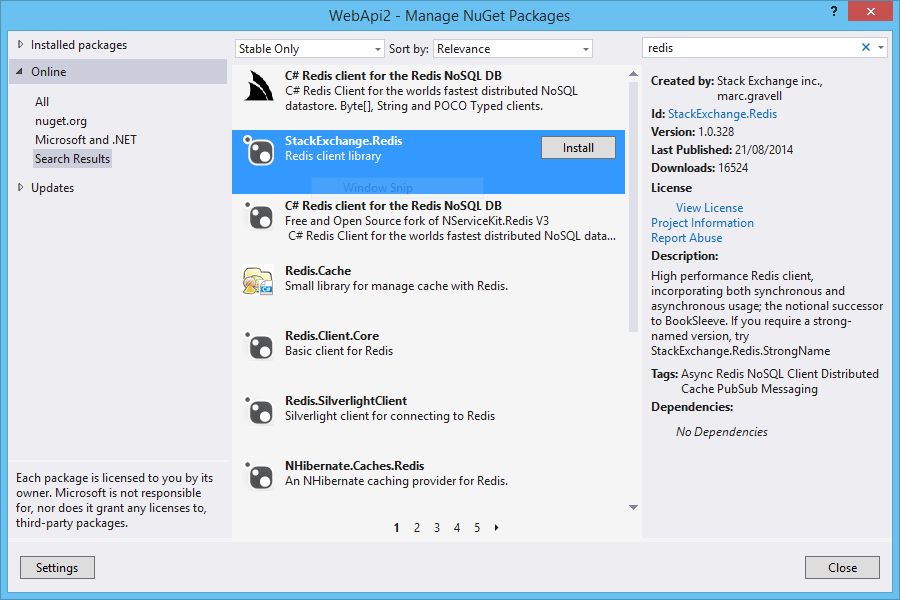
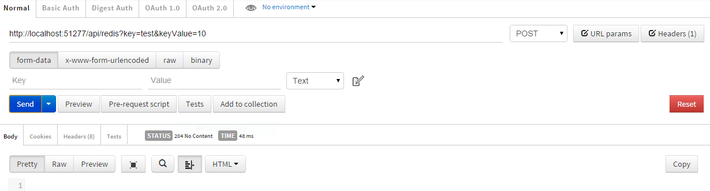
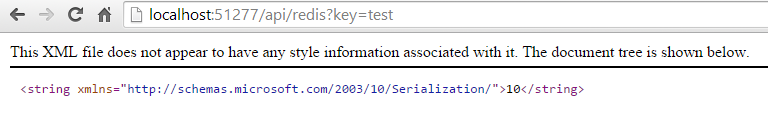

# ASP.NET WebAPI - Basic Redis
## Requires
- Visual Studio 2013
## License
- Apache License, Version 2.0
## Technologies
- C#
- ASP.NET Web API
- WebAPI
- ASP.NET Web API 2
- redis
## Topics
- C#
- ASP.NET Web API
- redis
## Updated
- 09/15/2014
## Description

This article walks you through configuration Redis and made basic operations using .net C# client.

Redis is one of the fastest and feature-rich key-value stores to come from the&nbsp;NoSQL&nbsp;movement. It is similar to memcached but the dataset is not volatile, and values can either be strings lists, sets, sorted sets or hashes.

You can download the Redis Client in any one of the following ways:

<ul type="disc">
<li>Packaged by default in&nbsp;<a href="https://github.com/ServiceStack/ServiceStack/downloads">ServiceStack.dll</a>
</li><li>Available to download separately as a stand-alone&nbsp;<a href="https://github.com/ServiceStack/ServiceStack.Redis/downloads">ServiceStack.Redis.dll</a>
</li><li>As Source Code via Git:&nbsp;git clone git://github.com/ServiceStack/ServiceStack.Redis.git
</li><li>For those interested in having a GUI admin tool to visualize your Redis data should check out the&nbsp;<a href="http://www.servicestack.net/mythz_blog/?p=381">Redis Admin UI</a>
</li></ul>

&nbsp;

<strong>STEP 1 - Create ASP.NET WebAPI 2 Application</strong>

I will be using Visual Studio 2013 as my development environment. Our first step will be to create an ASP.NET Web Application project based on the&nbsp;Web&nbsp;API&nbsp;template.

<ul type="disc">
<li lang="en-US">Open Visual Studio 2013 and create a new project of type ASP.NET Web Application.
</li><li lang="en-US">On this project I create a solution called WebAPI. </li></ul>

&nbsp;&nbsp;

<ul type="disc">
<li>Press OK, and a new screen will appear, with several options of template to use on our project.
</li><li>Select the option WebAPI. </li></ul>

&nbsp;

<ul type="disc">
<li>The solution will be created. </li></ul>

&nbsp;

<strong>STEP 2 - Install Nuget</strong>

Now in order to use Redis as CacheManager we need to install a Nuget package.

So on the Visual Studio 2013, select the follow menu option:

Tools-&gt; Library Package manager -&gt; Manage NuGet Packages for Solution

Search for Redis and select the option Install.

&nbsp;

This option, will install automatically the Nuget Package.

&nbsp;

<strong>STEP 3 - Start Redis</strong>

First&nbsp; download the latest .exe package from here <a href="https://github.com/rgl/redis/downloads">https://github.com/rgl/redis/downloads</a>&nbsp;(choose the appropriate latest 32 or 64 bit version).

Run the redis-server.exe executable file. This will start redis in command line.

As you see the redis is now running on port 6379 on local machine.

&nbsp;

<strong>STEP 4 - Create basic Redis class</strong>

&nbsp;

C#

Edit|Remove

csharp
<pre class="hidden">using ServiceStack.Redis;
using System;
using System.Collections.Generic;
using System.Linq;
using System.Net;
using System.Net.Http;
using System.Web.Http;

namespace WebApi2.Controllers
{
    public class RedisController : ApiController
    {
        // GET: api/Redis/key
        public string Get(string key)
        {
            using (var redis = new RedisClient(&quot;localhost&quot;, 6379))
            {
                return redis.GetEntry(key);
            }  
        }

        // POST: api/Redis
        public void Post(string key, string keyValue)
        {
            using (var redis = new RedisClient(&quot;localhost&quot;, 6379))
            {
                redis.SetEntry(key, keyValue);
            }
        }        
    }
}
</pre>

<pre class="csharp">using&nbsp;ServiceStack.Redis;&nbsp;
using&nbsp;System;&nbsp;
using&nbsp;System.Collections.Generic;&nbsp;
using&nbsp;System.Linq;&nbsp;
using&nbsp;System.Net;&nbsp;
using&nbsp;System.Net.Http;&nbsp;
using&nbsp;System.Web.Http;&nbsp;
&nbsp;
namespace&nbsp;WebApi2.Controllers&nbsp;
{&nbsp;
&nbsp;&nbsp;&nbsp;&nbsp;public&nbsp;class&nbsp;RedisController&nbsp;:&nbsp;ApiController&nbsp;
&nbsp;&nbsp;&nbsp;&nbsp;{&nbsp;
&nbsp;&nbsp;&nbsp;&nbsp;&nbsp;&nbsp;&nbsp;&nbsp;//&nbsp;GET:&nbsp;api/Redis/key&nbsp;
&nbsp;&nbsp;&nbsp;&nbsp;&nbsp;&nbsp;&nbsp;&nbsp;public&nbsp;string&nbsp;Get(string&nbsp;key)&nbsp;
&nbsp;&nbsp;&nbsp;&nbsp;&nbsp;&nbsp;&nbsp;&nbsp;{&nbsp;
&nbsp;&nbsp;&nbsp;&nbsp;&nbsp;&nbsp;&nbsp;&nbsp;&nbsp;&nbsp;&nbsp;&nbsp;using&nbsp;(var&nbsp;redis&nbsp;=&nbsp;new&nbsp;RedisClient(&quot;localhost&quot;,&nbsp;6379))&nbsp;
&nbsp;&nbsp;&nbsp;&nbsp;&nbsp;&nbsp;&nbsp;&nbsp;&nbsp;&nbsp;&nbsp;&nbsp;{&nbsp;
&nbsp;&nbsp;&nbsp;&nbsp;&nbsp;&nbsp;&nbsp;&nbsp;&nbsp;&nbsp;&nbsp;&nbsp;&nbsp;&nbsp;&nbsp;&nbsp;return&nbsp;redis.GetEntry(key);&nbsp;
&nbsp;&nbsp;&nbsp;&nbsp;&nbsp;&nbsp;&nbsp;&nbsp;&nbsp;&nbsp;&nbsp;&nbsp;}&nbsp;&nbsp;&nbsp;
&nbsp;&nbsp;&nbsp;&nbsp;&nbsp;&nbsp;&nbsp;&nbsp;}&nbsp;
&nbsp;
&nbsp;&nbsp;&nbsp;&nbsp;&nbsp;&nbsp;&nbsp;&nbsp;//&nbsp;POST:&nbsp;api/Redis&nbsp;
&nbsp;&nbsp;&nbsp;&nbsp;&nbsp;&nbsp;&nbsp;&nbsp;public&nbsp;void&nbsp;Post(string&nbsp;key,&nbsp;string&nbsp;keyValue)&nbsp;
&nbsp;&nbsp;&nbsp;&nbsp;&nbsp;&nbsp;&nbsp;&nbsp;{&nbsp;
&nbsp;&nbsp;&nbsp;&nbsp;&nbsp;&nbsp;&nbsp;&nbsp;&nbsp;&nbsp;&nbsp;&nbsp;using&nbsp;(var&nbsp;redis&nbsp;=&nbsp;new&nbsp;RedisClient(&quot;localhost&quot;,&nbsp;6379))&nbsp;
&nbsp;&nbsp;&nbsp;&nbsp;&nbsp;&nbsp;&nbsp;&nbsp;&nbsp;&nbsp;&nbsp;&nbsp;{&nbsp;
&nbsp;&nbsp;&nbsp;&nbsp;&nbsp;&nbsp;&nbsp;&nbsp;&nbsp;&nbsp;&nbsp;&nbsp;&nbsp;&nbsp;&nbsp;&nbsp;redis.SetEntry(key,&nbsp;keyValue);&nbsp;
&nbsp;&nbsp;&nbsp;&nbsp;&nbsp;&nbsp;&nbsp;&nbsp;&nbsp;&nbsp;&nbsp;&nbsp;}&nbsp;
&nbsp;&nbsp;&nbsp;&nbsp;&nbsp;&nbsp;&nbsp;&nbsp;}&nbsp;&nbsp;&nbsp;&nbsp;&nbsp;&nbsp;&nbsp;&nbsp;&nbsp;
&nbsp;&nbsp;&nbsp;&nbsp;}&nbsp;
}&nbsp;
</pre>

&nbsp;

&nbsp;&nbsp;

&nbsp;

<strong>STEP 5 - Test aplication</strong>

Use postman to post some values into Redis.

&nbsp;

Call api/Redis and verify that the return is the 10, value send to the key &quot;Test&quot;, on postman.

&nbsp;

<strong>Resources</strong>

Some good resources about Signal could be found here:

<ul type="disc">
<li lang="en-US">My personal blog:&nbsp;<a href="http://joaoeduardosousa.wordpress.com/">http://joaoeduardosousa.wordpress.com/
</a></li><li>ServiceStack: <a href="https://github.com/ServiceStack/ServiceStack.Redis/wiki/IRedisClient">https://github.com/ServiceStack/ServiceStack.Redis/wiki/IRedisClient</a>
</li></ul>

