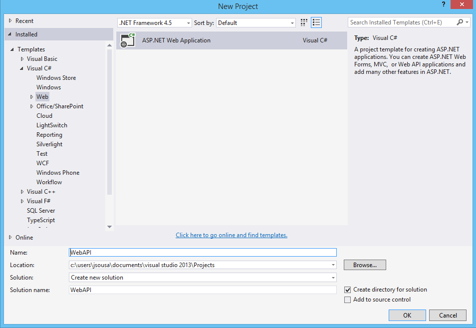
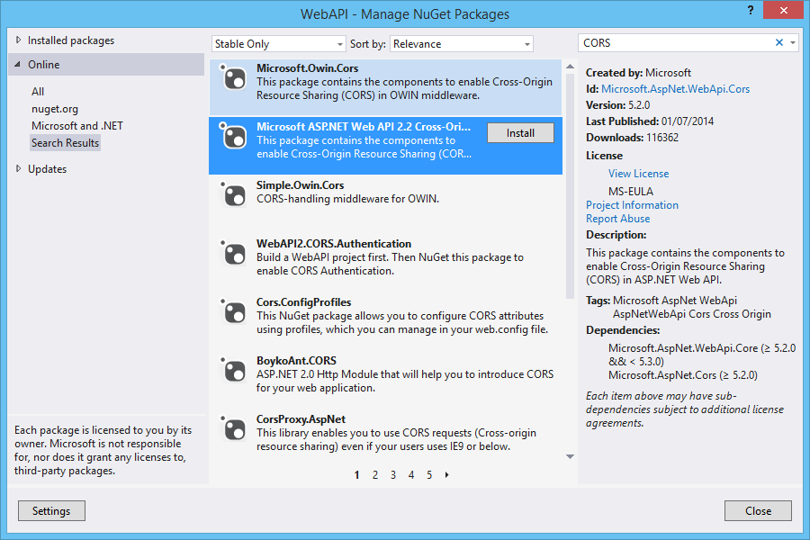
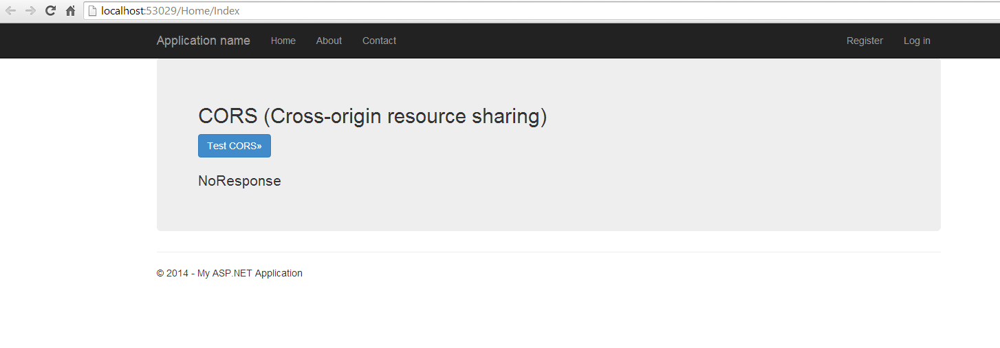
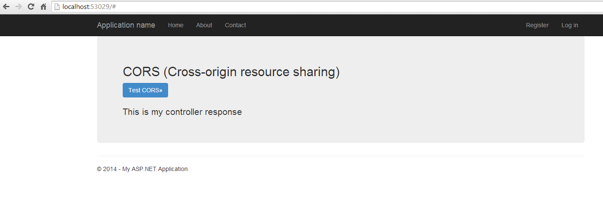

# ASP.NET WebAPI - Enable Cors
## Requires
- Visual Studio 2013
## License
- Apache License, Version 2.0
## Technologies
- C#
- ASP.NET
- ASP.NET Web API
- CORS
- ASP.NET Web API 2
## Topics
- C#
- ASP.NET
- ASP.NET Web API
## Updated
- 08/22/2014
## Description

<h1>Introduction</h1>

This article walks you through configuration of CORS on webapi.

Browser security prevents a web page from making AJAX requests to another domain. This restriction is called the&nbsp;same-origin policy, and prevents a malicious site from reading sentitive data from another site. However, sometimes you might
 want to let other sites call your web API.

<a href="http://www.w3.org/TR/cors/">Cross Origin Resource Sharing</a>&nbsp;(CORS) is a W3C standard that allows a server to relax the same-origin policy. Using CORS, a server can explicitly allow some cross-origin requests while rejecting
 others. CORS is safer and more flexible than earlier techniques such as <a href="http://en.wikipedia.org/wiki/JSONP">JSONP</a>. This tutorial shows how to enable CORS in your Web API application.

 

<strong>STEP 1 - Create ASP.NET WebAPI 2 Application</strong>

I will be using Visual Studio 2013 as my development environment. Our first step will be to create an ASP.NET Web Application project based on the&nbsp;Web&nbsp;API&nbsp;template.

<ul type="disc">
<li lang="en-US">Open Visual Studio 2013 and create a new project of type ASP.NET Web Application.
</li><li lang="en-US">On this project I create a solution called WebAPI. </li></ul>

<ul type="disc">
<li>Press OK, and a new screen will appear, with several options of template to use on our project.
</li><li>Select the option WebAPI. </li></ul>

<ul type="disc">
<li>The solution will be created. </li></ul>

&nbsp;

<strong>STEP 2 - Install Nuget</strong>

&nbsp;

Now in order to use CORS we need to install a Nuget package.

So on the Visual Studio 2013, select the follow menu option:

Tools-&gt; Library Package manager -&gt; Manage NuGet Packages for Solution

Search for CORS and select the option Install.

This option, will install automatically the Nuget Package.

&nbsp;

&nbsp;

<strong>STEP 3 - Enable CORS on solution</strong>

Once all the &quot;ingredients&quot; are ready, it's time to enable CORS.

&nbsp;

C#

Edit|Remove

csharp
<pre class="hidden">using System;
using System.Collections.Generic;
using System.Linq;
using System.Web.Http;

namespace WebApi2
{
    public static class WebApiConfig
    {
        public static void Register(HttpConfiguration config)
        {
            // Web API configuration and services
            config.EnableCors();
            
            // Web API routes
            config.MapHttpAttributeRoutes();

            config.Routes.MapHttpRoute(
                name: &quot;DefaultApi&quot;,
                routeTemplate: &quot;api/{controller}/{id}&quot;,
                defaults: new { id = RouteParameter.Optional }
            );
        }
    }
}
</pre>

<pre class="csharp">using&nbsp;System;&nbsp;
using&nbsp;System.Collections.Generic;&nbsp;
using&nbsp;System.Linq;&nbsp;
using&nbsp;System.Web.Http;&nbsp;
&nbsp;
namespace&nbsp;WebApi2&nbsp;
{&nbsp;
&nbsp;&nbsp;&nbsp;&nbsp;public&nbsp;static&nbsp;class&nbsp;WebApiConfig&nbsp;
&nbsp;&nbsp;&nbsp;&nbsp;{&nbsp;
&nbsp;&nbsp;&nbsp;&nbsp;&nbsp;&nbsp;&nbsp;&nbsp;public&nbsp;static&nbsp;void&nbsp;Register(HttpConfiguration&nbsp;config)&nbsp;
&nbsp;&nbsp;&nbsp;&nbsp;&nbsp;&nbsp;&nbsp;&nbsp;{&nbsp;
&nbsp;&nbsp;&nbsp;&nbsp;&nbsp;&nbsp;&nbsp;&nbsp;&nbsp;&nbsp;&nbsp;&nbsp;//&nbsp;Web&nbsp;API&nbsp;configuration&nbsp;and&nbsp;services&nbsp;
&nbsp;&nbsp;&nbsp;&nbsp;&nbsp;&nbsp;&nbsp;&nbsp;&nbsp;&nbsp;&nbsp;&nbsp;config.EnableCors();&nbsp;
&nbsp;&nbsp;&nbsp;&nbsp;&nbsp;&nbsp;&nbsp;&nbsp;&nbsp;&nbsp;&nbsp;&nbsp;&nbsp;
&nbsp;&nbsp;&nbsp;&nbsp;&nbsp;&nbsp;&nbsp;&nbsp;&nbsp;&nbsp;&nbsp;&nbsp;//&nbsp;Web&nbsp;API&nbsp;routes&nbsp;
&nbsp;&nbsp;&nbsp;&nbsp;&nbsp;&nbsp;&nbsp;&nbsp;&nbsp;&nbsp;&nbsp;&nbsp;config.MapHttpAttributeRoutes();&nbsp;
&nbsp;
&nbsp;&nbsp;&nbsp;&nbsp;&nbsp;&nbsp;&nbsp;&nbsp;&nbsp;&nbsp;&nbsp;&nbsp;config.Routes.MapHttpRoute(&nbsp;
&nbsp;&nbsp;&nbsp;&nbsp;&nbsp;&nbsp;&nbsp;&nbsp;&nbsp;&nbsp;&nbsp;&nbsp;&nbsp;&nbsp;&nbsp;&nbsp;name:&nbsp;&quot;DefaultApi&quot;,&nbsp;
&nbsp;&nbsp;&nbsp;&nbsp;&nbsp;&nbsp;&nbsp;&nbsp;&nbsp;&nbsp;&nbsp;&nbsp;&nbsp;&nbsp;&nbsp;&nbsp;routeTemplate:&nbsp;&quot;api/{controller}/{id}&quot;,&nbsp;
&nbsp;&nbsp;&nbsp;&nbsp;&nbsp;&nbsp;&nbsp;&nbsp;&nbsp;&nbsp;&nbsp;&nbsp;&nbsp;&nbsp;&nbsp;&nbsp;defaults:&nbsp;new&nbsp;{&nbsp;id&nbsp;=&nbsp;RouteParameter.Optional&nbsp;}&nbsp;
&nbsp;&nbsp;&nbsp;&nbsp;&nbsp;&nbsp;&nbsp;&nbsp;&nbsp;&nbsp;&nbsp;&nbsp;);&nbsp;
&nbsp;&nbsp;&nbsp;&nbsp;&nbsp;&nbsp;&nbsp;&nbsp;}&nbsp;
&nbsp;&nbsp;&nbsp;&nbsp;}&nbsp;
}&nbsp;
</pre>

&nbsp;Next, add the&nbsp;[EnableCors]&nbsp;attribute to the&nbsp;Controller&nbsp;class, &nbsp;as follows

C#

Edit|Remove

csharp
<pre class="hidden">using System;
using System.Collections.Generic;
using System.Linq;
using System.Net;
using System.Net.Http;
using System.Web.Http;
using System.Web.Http.Cors;

namespace WebApi2.Controllers
{
    [EnableCors(origins: &quot;http://localhost:53029&quot;, headers: &quot;*&quot;, methods: &quot;*&quot;)]
    public class TestController : ApiController
    {
        public string Get()
        {
            return &quot;This is my controller response&quot;;
        }
    }
}
</pre>

<pre class="csharp">using&nbsp;System;&nbsp;
using&nbsp;System.Collections.Generic;&nbsp;
using&nbsp;System.Linq;&nbsp;
using&nbsp;System.Net;&nbsp;
using&nbsp;System.Net.Http;&nbsp;
using&nbsp;System.Web.Http;&nbsp;
using&nbsp;System.Web.Http.Cors;&nbsp;
&nbsp;
namespace&nbsp;WebApi2.Controllers&nbsp;
{&nbsp;
&nbsp;&nbsp;&nbsp;&nbsp;[EnableCors(origins:&nbsp;&quot;http://localhost:53029&quot;,&nbsp;headers:&nbsp;&quot;*&quot;,&nbsp;methods:&nbsp;&quot;*&quot;)]&nbsp;
&nbsp;&nbsp;&nbsp;&nbsp;public&nbsp;class&nbsp;TestController&nbsp;:&nbsp;ApiController&nbsp;
&nbsp;&nbsp;&nbsp;&nbsp;{&nbsp;
&nbsp;&nbsp;&nbsp;&nbsp;&nbsp;&nbsp;&nbsp;&nbsp;public&nbsp;string&nbsp;Get()&nbsp;
&nbsp;&nbsp;&nbsp;&nbsp;&nbsp;&nbsp;&nbsp;&nbsp;{&nbsp;
&nbsp;&nbsp;&nbsp;&nbsp;&nbsp;&nbsp;&nbsp;&nbsp;&nbsp;&nbsp;&nbsp;&nbsp;return&nbsp;&quot;This&nbsp;is&nbsp;my&nbsp;controller&nbsp;response&quot;;&nbsp;
&nbsp;&nbsp;&nbsp;&nbsp;&nbsp;&nbsp;&nbsp;&nbsp;}&nbsp;
&nbsp;&nbsp;&nbsp;&nbsp;}&nbsp;
}&nbsp;
</pre>

&nbsp;For enable CORS for the entire We Api project you could to this:

&nbsp;

&nbsp;

C#

Edit|Remove

csharp
<pre class="hidden">public static class WebApiConfig
{
    public static void Register(HttpConfiguration config)
    {
        var cors = new EnableCorsAttribute(&quot;http://localhost:53029&quot;, &quot;*&quot;, &quot;*&quot;);
        config.EnableCors(cors);
    }
}</pre>

<pre class="csharp">public&nbsp;static&nbsp;class&nbsp;WebApiConfig&nbsp;
{&nbsp;
&nbsp;&nbsp;&nbsp;&nbsp;public&nbsp;static&nbsp;void&nbsp;Register(HttpConfiguration&nbsp;config)&nbsp;
&nbsp;&nbsp;&nbsp;&nbsp;{&nbsp;
&nbsp;&nbsp;&nbsp;&nbsp;&nbsp;&nbsp;&nbsp;&nbsp;var&nbsp;cors&nbsp;=&nbsp;new&nbsp;EnableCorsAttribute(&quot;http://localhost:53029&quot;,&nbsp;&quot;*&quot;,&nbsp;&quot;*&quot;);&nbsp;
&nbsp;&nbsp;&nbsp;&nbsp;&nbsp;&nbsp;&nbsp;&nbsp;config.EnableCors(cors);&nbsp;
&nbsp;&nbsp;&nbsp;&nbsp;}&nbsp;
}</pre>

&nbsp;

&nbsp;

<strong>STEP 4 - Make call from client</strong>

At this time, the server is ready, it's time to work client side.

&nbsp;

&nbsp;

HTML

Edit|Remove

html
<pre class="hidden">@{
    ViewBag.Title = &quot;Home Page&quot;;
}

&lt;div class=&quot;jumbotron&quot;&gt;
    &lt;h2&gt;CORS (Cross-origin resource sharing)&lt;/h2&gt;
    &lt;p class=&quot;lead&quot;&gt;
        &lt;a href=&quot;#&quot; class=&quot;btn btn-primary btn-large&quot; id=&quot;testButton&quot;&gt;Test CORS&amp;raquo;&lt;/a&gt;
    &lt;/p&gt;
    &lt;p&gt;
    &lt;p id=&quot;response&quot;&gt;
        NoResponse
    &lt;/p&gt;
&lt;/div&gt;

@section scripts {
    &lt;script&gt;
        var response = $('#response');
        $('#testButton')
            .click(function () {
                $.ajax({
                    type: 'GET',
                    url: 'http://localhost:51277/api/test'
                }).done(function (data) {
                    response.html(data);
                }).error(function (jqXHR, textStatus, errorThrown) {
                    response.html(jqXHR.responseText || textStatus);
                });
            });
    &lt;/script&gt;
}</pre>

<pre class="html">@{&nbsp;
&nbsp;&nbsp;&nbsp;&nbsp;ViewBag.Title&nbsp;=&nbsp;&quot;Home&nbsp;Page&quot;;&nbsp;
}&nbsp;
&nbsp;
&lt;div&nbsp;class=&quot;jumbotron&quot;&gt;&nbsp;
&nbsp;&nbsp;&nbsp;&nbsp;&lt;h2&gt;CORS&nbsp;(Cross-origin&nbsp;resource&nbsp;sharing)&lt;/h2&gt;&nbsp;
&nbsp;&nbsp;&nbsp;&nbsp;&lt;p&nbsp;class=&quot;lead&quot;&gt;&nbsp;
&nbsp;&nbsp;&nbsp;&nbsp;&nbsp;&nbsp;&nbsp;&nbsp;&lt;a&nbsp;href=&quot;#&quot;&nbsp;class=&quot;btn&nbsp;btn-primary&nbsp;btn-large&quot;&nbsp;id=&quot;testButton&quot;&gt;Test&nbsp;CORS&amp;raquo;&lt;/a&gt;&nbsp;
&nbsp;&nbsp;&nbsp;&nbsp;&lt;/p&gt;&nbsp;
&nbsp;&nbsp;&nbsp;&nbsp;&lt;p&gt;&nbsp;
&nbsp;&nbsp;&nbsp;&nbsp;&lt;p&nbsp;id=&quot;response&quot;&gt;&nbsp;
&nbsp;&nbsp;&nbsp;&nbsp;&nbsp;&nbsp;&nbsp;&nbsp;NoResponse&nbsp;
&nbsp;&nbsp;&nbsp;&nbsp;&lt;/p&gt;&nbsp;
&lt;/div&gt;&nbsp;
&nbsp;
&nbsp;
@section&nbsp;scripts&nbsp;{&nbsp;
&nbsp;&nbsp;&nbsp;&nbsp;&lt;script&gt;&nbsp;
&nbsp;&nbsp;&nbsp;&nbsp;&nbsp;&nbsp;&nbsp;&nbsp;var&nbsp;response&nbsp;=&nbsp;$('#response');&nbsp;
&nbsp;&nbsp;&nbsp;&nbsp;&nbsp;&nbsp;&nbsp;&nbsp;$('#testButton')&nbsp;
&nbsp;&nbsp;&nbsp;&nbsp;&nbsp;&nbsp;&nbsp;&nbsp;&nbsp;&nbsp;&nbsp;&nbsp;.click(function&nbsp;()&nbsp;{&nbsp;
&nbsp;&nbsp;&nbsp;&nbsp;&nbsp;&nbsp;&nbsp;&nbsp;&nbsp;&nbsp;&nbsp;&nbsp;&nbsp;&nbsp;&nbsp;&nbsp;$.ajax({&nbsp;
&nbsp;&nbsp;&nbsp;&nbsp;&nbsp;&nbsp;&nbsp;&nbsp;&nbsp;&nbsp;&nbsp;&nbsp;&nbsp;&nbsp;&nbsp;&nbsp;&nbsp;&nbsp;&nbsp;&nbsp;type:&nbsp;'GET',&nbsp;
&nbsp;&nbsp;&nbsp;&nbsp;&nbsp;&nbsp;&nbsp;&nbsp;&nbsp;&nbsp;&nbsp;&nbsp;&nbsp;&nbsp;&nbsp;&nbsp;&nbsp;&nbsp;&nbsp;&nbsp;url:&nbsp;'http://localhost:51277/api/test'&nbsp;
&nbsp;&nbsp;&nbsp;&nbsp;&nbsp;&nbsp;&nbsp;&nbsp;&nbsp;&nbsp;&nbsp;&nbsp;&nbsp;&nbsp;&nbsp;&nbsp;}).done(function&nbsp;(data)&nbsp;{&nbsp;
&nbsp;&nbsp;&nbsp;&nbsp;&nbsp;&nbsp;&nbsp;&nbsp;&nbsp;&nbsp;&nbsp;&nbsp;&nbsp;&nbsp;&nbsp;&nbsp;&nbsp;&nbsp;&nbsp;&nbsp;response.html(data);&nbsp;
&nbsp;&nbsp;&nbsp;&nbsp;&nbsp;&nbsp;&nbsp;&nbsp;&nbsp;&nbsp;&nbsp;&nbsp;&nbsp;&nbsp;&nbsp;&nbsp;}).error(function&nbsp;(jqXHR,&nbsp;textStatus,&nbsp;errorThrown)&nbsp;{&nbsp;
&nbsp;&nbsp;&nbsp;&nbsp;&nbsp;&nbsp;&nbsp;&nbsp;&nbsp;&nbsp;&nbsp;&nbsp;&nbsp;&nbsp;&nbsp;&nbsp;&nbsp;&nbsp;&nbsp;&nbsp;response.html(jqXHR.responseText&nbsp;||&nbsp;textStatus);&nbsp;
&nbsp;&nbsp;&nbsp;&nbsp;&nbsp;&nbsp;&nbsp;&nbsp;&nbsp;&nbsp;&nbsp;&nbsp;&nbsp;&nbsp;&nbsp;&nbsp;});&nbsp;
&nbsp;&nbsp;&nbsp;&nbsp;&nbsp;&nbsp;&nbsp;&nbsp;&nbsp;&nbsp;&nbsp;&nbsp;});&nbsp;
&nbsp;&nbsp;&nbsp;&nbsp;&lt;/script&gt;&nbsp;
}</pre>

&nbsp;

&nbsp;

&nbsp;

Press the button, and check the request result to webapi from client side.

<strong>Resources</strong>

Some good resources about Windows Azure could be found here:

<ul type="disc">
<li lang="en-US">My personal blog:&nbsp;<a href="http://joaoeduardosousa.wordpress.com/">http://joaoeduardosousa.wordpress.com/</a>
</li></ul>
