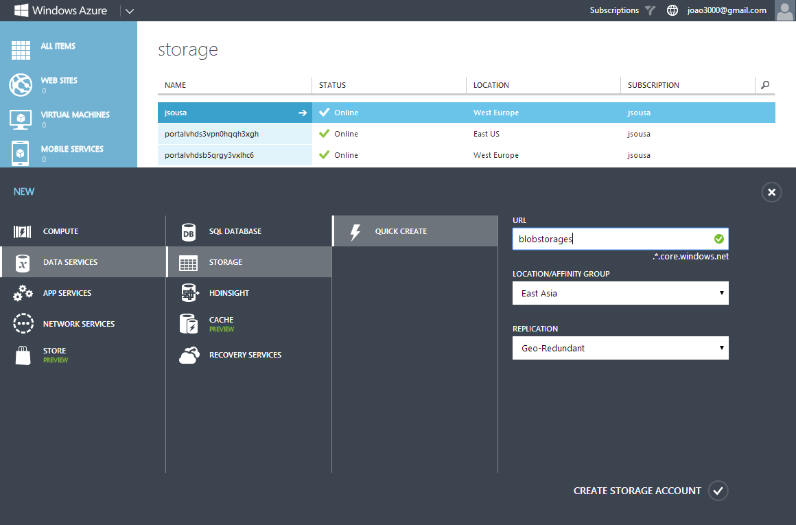
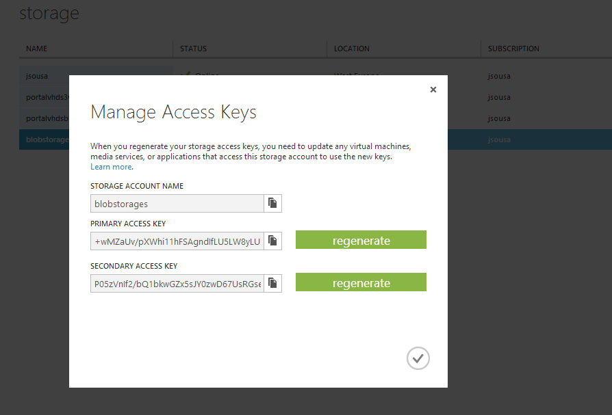
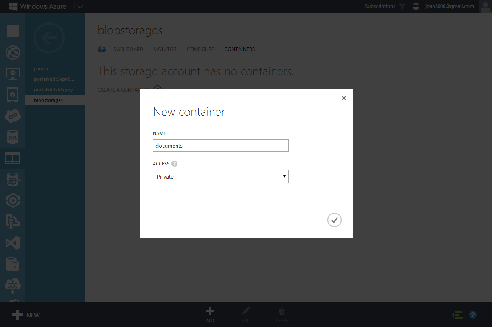
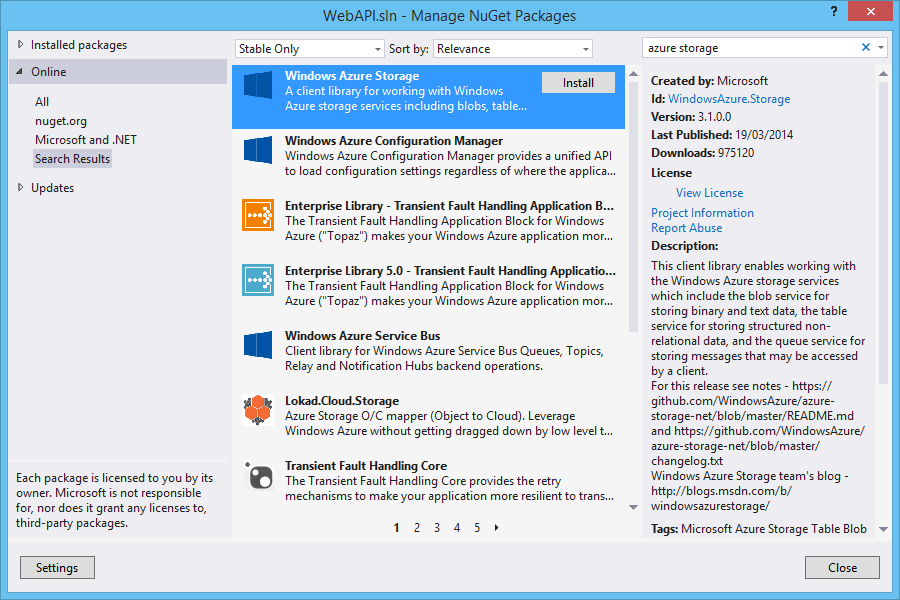
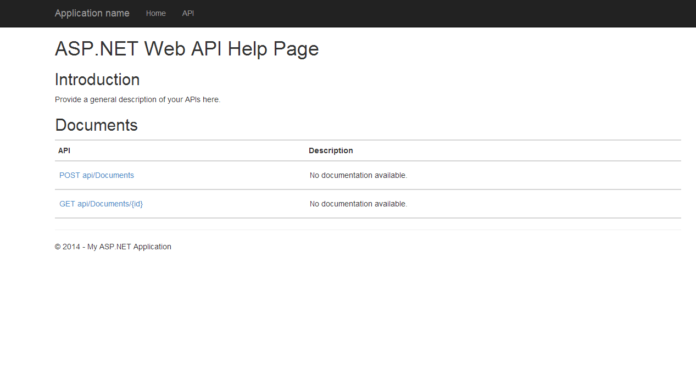

# ASP.NET WebAPI 2 - Stream Windows Azure blobs
## Requires
- Visual Studio 2013
## License
- Apache License, Version 2.0
## Technologies
- Microsoft Azure
- ASP.NET MVC 4
- ASP.NET Web API
- ASP.NET 4.5
- Windows Azure Storage Blobs
- ASP.NET MVC 5
- ASP.NET Web API 2
## Topics
- Microsoft Azure
- ASP.NET MVC
- Azure Blob Storage
- ASP.NET Web API
- ASP.NET MVC 5
## Updated
- 03/29/2014
## Description

With this article, I will show all steps you need to complete to create an ASP.NET WebAPI 2 to upload and download your documents to an Windows Azure Storage.

&nbsp;

<strong>STEP 1 - Install Windows Azure SDK for .NET</strong>

This could be done through Microsoft Web Platform Installer

Select the option Add on item Windows Azure SDK for .NET (VS 2013) -2.2, and the component will be installed on your machine.

&nbsp;

&nbsp;

<strong>STEP 2 - Create Azure Account</strong>

You need to get a Windows Azure account. Everyone can open a Windows Azure account for free.

Check the link below for more information.

<a href="http://www.windowsazure.com/en-us/pricing/free-trial/">http://www.windowsazure.com/en-us/pricing/free-trial/&nbsp;</a>

&nbsp;

<strong>STEP 3 - Create Blob Storage on Windows Azure</strong>

After get access to an Azure Account, we need to create a blob storage.

So for that we need to select the option New on the left bottom of our web page and then select the option Data Services -&gt; Storage -&gt; Quick Create and give a name to your storage.

On this case our blob storage will have the name &quot;blobstorages&quot;.

&nbsp;

&nbsp;

After create the blob storage, we need to get the keys that will be used on Web API to access to storage.

For that, select the created storage and on the bottom of the page check the option Manage Access Keys.

This option, give us the name of our storage and the key.

&nbsp;

&nbsp;

Now that we have our storage and the credentials to connect, the next step will be the creation of a container, where we will put our documents.

Select the option Create Container and give a name to it (on this example, the container will be named &quot;documents&quot;).

&nbsp;

&nbsp;

<strong>STEP 4 - Create ASP.NET WebAPI 2 Application</strong>

I will be using Visual Studio 2013 as my development environment. Our first step will be to create an ASP.NET Web Application project based on the&nbsp;Web&nbsp;API&nbsp;template.

<ul type="disc">
<li lang="en-US">Open Visual Studio 2013 and create a new project of type ASP.NET Web Application.
</li><li lang="en-US">On this project I create a solution called WebAPI. </li></ul>

&nbsp;

&nbsp;

<ul type="disc">
<li>Press OK, and a new screen will appear, with several options of template to use on our project.
</li><li>Select the option WebAPI. </li><li>The solution will be created.&nbsp; </li></ul>

<ul type="disc">
<li>Set the connection string to connect to the Azure blobs. You can just add the following setting to your Web.config.
</li></ul>

&nbsp;

&nbsp;

XML

Editar Script|Remove

xml
<pre class="hidden"> &lt;connectionStrings&gt;
    &lt;add name=&quot;Azure&quot; connectionString=&quot;DefaultEndpointsProtocol=https;AccountName=blobstorages;AccountKey=&#43;wMZaUv/...&quot; /&gt;
  &lt;/connectionStrings&gt;</pre>

<pre class="xml">&nbsp;&lt;connectionStrings&gt;&nbsp;
&nbsp;&nbsp;&nbsp;&nbsp;&lt;add&nbsp;name=&quot;Azure&quot;&nbsp;connectionString=&quot;DefaultEndpointsProtocol=https;AccountName=blobstorages;AccountKey=&#43;wMZaUv/...&quot;&nbsp;/&gt;&nbsp;
&nbsp;&nbsp;&lt;/connectionStrings&gt;</pre>

&nbsp;

&nbsp;

Now in order to interact with the Azure Blobs, you need to add the reference to the following assemblies:

<ul type="disc">
<li>Microsoft.WindowsAzure.Storage </li></ul>

&nbsp;

For that we will install a Nuget Package named Windows Azure Storage, as I show on the next image.

So on the Visual Studio 2013, select the follow menu option:

Tools-&gt; Library Package manager -&gt; Manage NuGet Packages for Solution

Search for Windows Azure Storage and select the option Install.&nbsp;

&nbsp;

&nbsp;

This option, will install automatically the Nuget Package.

The next step will be, the creation of our controller.

ApiController implements an HTTP POST action handling the file upload. Note that the action returns&nbsp;Task&lt;T&gt;&nbsp;as we read the file asynchronously.

The first thing we do is check that the content is indeed &quot;multipart/form-data&quot;. The second thing we do is creating a MultipartFormDataStreamProvider which gives you control over where the content ends up. In this case we save the file in the folder &quot;App_Data&quot;.
 It also contains information about the files stored.

If you want complete control over how the file is written and what file name is used then you can derive from MultipartFormDataStreamProvider, override the functionality you want and use that StreamProvider instead.

Once the read operation has completed we check the at is done we read the content asynchronously and when that task has completed we generate a response.

&nbsp;

Now, let&rsquo;s create the Web API actions. Below, I&rsquo;ve created a simple DocumentController that will support the following actions:

<ul type="disc">
<li>POST: Will upload files, this will only support&nbsp;multipart/form-data&nbsp;format
</li><li>GET: Will list the files that have been uploaded </li></ul>

&nbsp;

C#

Editar Script|Remove

csharp
<pre class="hidden">public async Task&lt;HttpResponseMessage&gt; Post()
        {
            var context = new StorageContext();

            // Check if the request contains multipart/form-data.
            if (!Request.Content.IsMimeMultipartContent())
            {
                throw new HttpResponseException(HttpStatusCode.UnsupportedMediaType);
            }

            // Get and create the container
            var blobContainer = context.BlobClient.GetContainerReference(CONTAINER);
            blobContainer.CreateIfNotExists();

            string root = HttpContext.Current.Server.MapPath(&quot;~/App_Data&quot;);
            var provider = new MultipartFormDataStreamProvider(root);

            try
            {
                // Read the form data and return an async task.
                await Request.Content.ReadAsMultipartAsync(provider);

                // This illustrates how to get the file names for uploaded files.
                foreach (var fileData in provider.FileData)
                {
                    var filename = fileData.LocalFileName;
                    var blob = blobContainer.GetBlockBlobReference(filename);

                    using (var filestream = File.OpenRead(fileData.LocalFileName))
                    {
                        blob.UploadFromStream(filestream);
                    }
                    File.Delete(fileData.LocalFileName);
                }

                return Request.CreateResponse(HttpStatusCode.OK);
            }
            catch (System.Exception e)
            {
                return Request.CreateErrorResponse(HttpStatusCode.InternalServerError, e);
            }
        }</pre>

<pre class="csharp">public&nbsp;async&nbsp;Task&lt;HttpResponseMessage&gt;&nbsp;Post()&nbsp;
&nbsp;&nbsp;&nbsp;&nbsp;&nbsp;&nbsp;&nbsp;&nbsp;{&nbsp;
&nbsp;&nbsp;&nbsp;&nbsp;&nbsp;&nbsp;&nbsp;&nbsp;&nbsp;&nbsp;&nbsp;&nbsp;var&nbsp;context&nbsp;=&nbsp;new&nbsp;StorageContext();&nbsp;
&nbsp;
&nbsp;&nbsp;&nbsp;&nbsp;&nbsp;&nbsp;&nbsp;&nbsp;&nbsp;&nbsp;&nbsp;&nbsp;//&nbsp;Check&nbsp;if&nbsp;the&nbsp;request&nbsp;contains&nbsp;multipart/form-data.&nbsp;
&nbsp;&nbsp;&nbsp;&nbsp;&nbsp;&nbsp;&nbsp;&nbsp;&nbsp;&nbsp;&nbsp;&nbsp;if&nbsp;(!Request.Content.IsMimeMultipartContent())&nbsp;
&nbsp;&nbsp;&nbsp;&nbsp;&nbsp;&nbsp;&nbsp;&nbsp;&nbsp;&nbsp;&nbsp;&nbsp;{&nbsp;
&nbsp;&nbsp;&nbsp;&nbsp;&nbsp;&nbsp;&nbsp;&nbsp;&nbsp;&nbsp;&nbsp;&nbsp;&nbsp;&nbsp;&nbsp;&nbsp;throw&nbsp;new&nbsp;HttpResponseException(HttpStatusCode.UnsupportedMediaType);&nbsp;
&nbsp;&nbsp;&nbsp;&nbsp;&nbsp;&nbsp;&nbsp;&nbsp;&nbsp;&nbsp;&nbsp;&nbsp;}&nbsp;
&nbsp;
&nbsp;&nbsp;&nbsp;&nbsp;&nbsp;&nbsp;&nbsp;&nbsp;&nbsp;&nbsp;&nbsp;&nbsp;//&nbsp;Get&nbsp;and&nbsp;create&nbsp;the&nbsp;container&nbsp;
&nbsp;&nbsp;&nbsp;&nbsp;&nbsp;&nbsp;&nbsp;&nbsp;&nbsp;&nbsp;&nbsp;&nbsp;var&nbsp;blobContainer&nbsp;=&nbsp;context.BlobClient.GetContainerReference(CONTAINER);&nbsp;
&nbsp;&nbsp;&nbsp;&nbsp;&nbsp;&nbsp;&nbsp;&nbsp;&nbsp;&nbsp;&nbsp;&nbsp;blobContainer.CreateIfNotExists();&nbsp;
&nbsp;
&nbsp;&nbsp;&nbsp;&nbsp;&nbsp;&nbsp;&nbsp;&nbsp;&nbsp;&nbsp;&nbsp;&nbsp;string&nbsp;root&nbsp;=&nbsp;HttpContext.Current.Server.MapPath(&quot;~/App_Data&quot;);&nbsp;
&nbsp;&nbsp;&nbsp;&nbsp;&nbsp;&nbsp;&nbsp;&nbsp;&nbsp;&nbsp;&nbsp;&nbsp;var&nbsp;provider&nbsp;=&nbsp;new&nbsp;MultipartFormDataStreamProvider(root);&nbsp;
&nbsp;
&nbsp;&nbsp;&nbsp;&nbsp;&nbsp;&nbsp;&nbsp;&nbsp;&nbsp;&nbsp;&nbsp;&nbsp;try&nbsp;
&nbsp;&nbsp;&nbsp;&nbsp;&nbsp;&nbsp;&nbsp;&nbsp;&nbsp;&nbsp;&nbsp;&nbsp;{&nbsp;
&nbsp;&nbsp;&nbsp;&nbsp;&nbsp;&nbsp;&nbsp;&nbsp;&nbsp;&nbsp;&nbsp;&nbsp;&nbsp;&nbsp;&nbsp;&nbsp;//&nbsp;Read&nbsp;the&nbsp;form&nbsp;data&nbsp;and&nbsp;return&nbsp;an&nbsp;async&nbsp;task.&nbsp;
&nbsp;&nbsp;&nbsp;&nbsp;&nbsp;&nbsp;&nbsp;&nbsp;&nbsp;&nbsp;&nbsp;&nbsp;&nbsp;&nbsp;&nbsp;&nbsp;await&nbsp;Request.Content.ReadAsMultipartAsync(provider);&nbsp;
&nbsp;
&nbsp;&nbsp;&nbsp;&nbsp;&nbsp;&nbsp;&nbsp;&nbsp;&nbsp;&nbsp;&nbsp;&nbsp;&nbsp;&nbsp;&nbsp;&nbsp;//&nbsp;This&nbsp;illustrates&nbsp;how&nbsp;to&nbsp;get&nbsp;the&nbsp;file&nbsp;names&nbsp;for&nbsp;uploaded&nbsp;files.&nbsp;
&nbsp;&nbsp;&nbsp;&nbsp;&nbsp;&nbsp;&nbsp;&nbsp;&nbsp;&nbsp;&nbsp;&nbsp;&nbsp;&nbsp;&nbsp;&nbsp;foreach&nbsp;(var&nbsp;fileData&nbsp;in&nbsp;provider.FileData)&nbsp;
&nbsp;&nbsp;&nbsp;&nbsp;&nbsp;&nbsp;&nbsp;&nbsp;&nbsp;&nbsp;&nbsp;&nbsp;&nbsp;&nbsp;&nbsp;&nbsp;{&nbsp;
&nbsp;&nbsp;&nbsp;&nbsp;&nbsp;&nbsp;&nbsp;&nbsp;&nbsp;&nbsp;&nbsp;&nbsp;&nbsp;&nbsp;&nbsp;&nbsp;&nbsp;&nbsp;&nbsp;&nbsp;var&nbsp;filename&nbsp;=&nbsp;fileData.LocalFileName;&nbsp;
&nbsp;&nbsp;&nbsp;&nbsp;&nbsp;&nbsp;&nbsp;&nbsp;&nbsp;&nbsp;&nbsp;&nbsp;&nbsp;&nbsp;&nbsp;&nbsp;&nbsp;&nbsp;&nbsp;&nbsp;var&nbsp;blob&nbsp;=&nbsp;blobContainer.GetBlockBlobReference(filename);&nbsp;
&nbsp;
&nbsp;&nbsp;&nbsp;&nbsp;&nbsp;&nbsp;&nbsp;&nbsp;&nbsp;&nbsp;&nbsp;&nbsp;&nbsp;&nbsp;&nbsp;&nbsp;&nbsp;&nbsp;&nbsp;&nbsp;using&nbsp;(var&nbsp;filestream&nbsp;=&nbsp;File.OpenRead(fileData.LocalFileName))&nbsp;
&nbsp;&nbsp;&nbsp;&nbsp;&nbsp;&nbsp;&nbsp;&nbsp;&nbsp;&nbsp;&nbsp;&nbsp;&nbsp;&nbsp;&nbsp;&nbsp;&nbsp;&nbsp;&nbsp;&nbsp;{&nbsp;
&nbsp;&nbsp;&nbsp;&nbsp;&nbsp;&nbsp;&nbsp;&nbsp;&nbsp;&nbsp;&nbsp;&nbsp;&nbsp;&nbsp;&nbsp;&nbsp;&nbsp;&nbsp;&nbsp;&nbsp;&nbsp;&nbsp;&nbsp;&nbsp;blob.UploadFromStream(filestream);&nbsp;
&nbsp;&nbsp;&nbsp;&nbsp;&nbsp;&nbsp;&nbsp;&nbsp;&nbsp;&nbsp;&nbsp;&nbsp;&nbsp;&nbsp;&nbsp;&nbsp;&nbsp;&nbsp;&nbsp;&nbsp;}&nbsp;
&nbsp;&nbsp;&nbsp;&nbsp;&nbsp;&nbsp;&nbsp;&nbsp;&nbsp;&nbsp;&nbsp;&nbsp;&nbsp;&nbsp;&nbsp;&nbsp;&nbsp;&nbsp;&nbsp;&nbsp;File.Delete(fileData.LocalFileName);&nbsp;
&nbsp;&nbsp;&nbsp;&nbsp;&nbsp;&nbsp;&nbsp;&nbsp;&nbsp;&nbsp;&nbsp;&nbsp;&nbsp;&nbsp;&nbsp;&nbsp;}&nbsp;
&nbsp;
&nbsp;&nbsp;&nbsp;&nbsp;&nbsp;&nbsp;&nbsp;&nbsp;&nbsp;&nbsp;&nbsp;&nbsp;&nbsp;&nbsp;&nbsp;&nbsp;return&nbsp;Request.CreateResponse(HttpStatusCode.OK);&nbsp;
&nbsp;&nbsp;&nbsp;&nbsp;&nbsp;&nbsp;&nbsp;&nbsp;&nbsp;&nbsp;&nbsp;&nbsp;}&nbsp;
&nbsp;&nbsp;&nbsp;&nbsp;&nbsp;&nbsp;&nbsp;&nbsp;&nbsp;&nbsp;&nbsp;&nbsp;catch&nbsp;(System.Exception&nbsp;e)&nbsp;
&nbsp;&nbsp;&nbsp;&nbsp;&nbsp;&nbsp;&nbsp;&nbsp;&nbsp;&nbsp;&nbsp;&nbsp;{&nbsp;
&nbsp;&nbsp;&nbsp;&nbsp;&nbsp;&nbsp;&nbsp;&nbsp;&nbsp;&nbsp;&nbsp;&nbsp;&nbsp;&nbsp;&nbsp;&nbsp;return&nbsp;Request.CreateErrorResponse(HttpStatusCode.InternalServerError,&nbsp;e);&nbsp;
&nbsp;&nbsp;&nbsp;&nbsp;&nbsp;&nbsp;&nbsp;&nbsp;&nbsp;&nbsp;&nbsp;&nbsp;}&nbsp;
&nbsp;&nbsp;&nbsp;&nbsp;&nbsp;&nbsp;&nbsp;&nbsp;}</pre>

&nbsp;

C#

Editar Script|Remove

csharp
<pre class="hidden">public async Task&lt;HttpResponseMessage&gt; Get(string id)
        {
            var context = new StorageContext();

            // Get and create the container
            var blobContainer = context.BlobClient.GetContainerReference(CONTAINER);
            blobContainer.CreateIfNotExists();

            var blob = blobContainer.GetBlockBlobReference(id);

            var blobExists = await blob.ExistsAsync();
            if (!blobExists)
            {
                return Request.CreateErrorResponse(HttpStatusCode.NotFound, &quot;File not found&quot;);
            }

            HttpResponseMessage message = new HttpResponseMessage(HttpStatusCode.OK);
            Stream blobStream = await blob.OpenReadAsync();

            message.Content = new StreamContent(blobStream);
            message.Content.Headers.ContentLength = blob.Properties.Length;
            message.Content.Headers.ContentType = new System.Net.Http.Headers.MediaTypeHeaderValue(blob.Properties.ContentType);
            message.Content.Headers.ContentDisposition = new System.Net.Http.Headers.ContentDispositionHeaderValue(&quot;attachment&quot;)
            {
                FileName = blob.Name,
                Size = blob.Properties.Length
            };

            return message;
        }</pre>

<pre class="csharp">public&nbsp;async&nbsp;Task&lt;HttpResponseMessage&gt;&nbsp;Get(string&nbsp;id)&nbsp;
&nbsp;&nbsp;&nbsp;&nbsp;&nbsp;&nbsp;&nbsp;&nbsp;{&nbsp;
&nbsp;&nbsp;&nbsp;&nbsp;&nbsp;&nbsp;&nbsp;&nbsp;&nbsp;&nbsp;&nbsp;&nbsp;var&nbsp;context&nbsp;=&nbsp;new&nbsp;StorageContext();&nbsp;
&nbsp;
&nbsp;&nbsp;&nbsp;&nbsp;&nbsp;&nbsp;&nbsp;&nbsp;&nbsp;&nbsp;&nbsp;&nbsp;//&nbsp;Get&nbsp;and&nbsp;create&nbsp;the&nbsp;container&nbsp;
&nbsp;&nbsp;&nbsp;&nbsp;&nbsp;&nbsp;&nbsp;&nbsp;&nbsp;&nbsp;&nbsp;&nbsp;var&nbsp;blobContainer&nbsp;=&nbsp;context.BlobClient.GetContainerReference(CONTAINER);&nbsp;
&nbsp;&nbsp;&nbsp;&nbsp;&nbsp;&nbsp;&nbsp;&nbsp;&nbsp;&nbsp;&nbsp;&nbsp;blobContainer.CreateIfNotExists();&nbsp;
&nbsp;
&nbsp;&nbsp;&nbsp;&nbsp;&nbsp;&nbsp;&nbsp;&nbsp;&nbsp;&nbsp;&nbsp;&nbsp;var&nbsp;blob&nbsp;=&nbsp;blobContainer.GetBlockBlobReference(id);&nbsp;
&nbsp;
&nbsp;&nbsp;&nbsp;&nbsp;&nbsp;&nbsp;&nbsp;&nbsp;&nbsp;&nbsp;&nbsp;&nbsp;var&nbsp;blobExists&nbsp;=&nbsp;await&nbsp;blob.ExistsAsync();&nbsp;
&nbsp;&nbsp;&nbsp;&nbsp;&nbsp;&nbsp;&nbsp;&nbsp;&nbsp;&nbsp;&nbsp;&nbsp;if&nbsp;(!blobExists)&nbsp;
&nbsp;&nbsp;&nbsp;&nbsp;&nbsp;&nbsp;&nbsp;&nbsp;&nbsp;&nbsp;&nbsp;&nbsp;{&nbsp;
&nbsp;&nbsp;&nbsp;&nbsp;&nbsp;&nbsp;&nbsp;&nbsp;&nbsp;&nbsp;&nbsp;&nbsp;&nbsp;&nbsp;&nbsp;&nbsp;return&nbsp;Request.CreateErrorResponse(HttpStatusCode.NotFound,&nbsp;&quot;File&nbsp;not&nbsp;found&quot;);&nbsp;
&nbsp;&nbsp;&nbsp;&nbsp;&nbsp;&nbsp;&nbsp;&nbsp;&nbsp;&nbsp;&nbsp;&nbsp;}&nbsp;
&nbsp;
&nbsp;&nbsp;&nbsp;&nbsp;&nbsp;&nbsp;&nbsp;&nbsp;&nbsp;&nbsp;&nbsp;&nbsp;HttpResponseMessage&nbsp;message&nbsp;=&nbsp;new&nbsp;HttpResponseMessage(HttpStatusCode.OK);&nbsp;
&nbsp;&nbsp;&nbsp;&nbsp;&nbsp;&nbsp;&nbsp;&nbsp;&nbsp;&nbsp;&nbsp;&nbsp;Stream&nbsp;blobStream&nbsp;=&nbsp;await&nbsp;blob.OpenReadAsync();&nbsp;
&nbsp;
&nbsp;&nbsp;&nbsp;&nbsp;&nbsp;&nbsp;&nbsp;&nbsp;&nbsp;&nbsp;&nbsp;&nbsp;message.Content&nbsp;=&nbsp;new&nbsp;StreamContent(blobStream);&nbsp;
&nbsp;&nbsp;&nbsp;&nbsp;&nbsp;&nbsp;&nbsp;&nbsp;&nbsp;&nbsp;&nbsp;&nbsp;message.Content.Headers.ContentLength&nbsp;=&nbsp;blob.Properties.Length;&nbsp;
&nbsp;&nbsp;&nbsp;&nbsp;&nbsp;&nbsp;&nbsp;&nbsp;&nbsp;&nbsp;&nbsp;&nbsp;message.Content.Headers.ContentType&nbsp;=&nbsp;new&nbsp;System.Net.Http.Headers.MediaTypeHeaderValue(blob.Properties.ContentType);&nbsp;
&nbsp;&nbsp;&nbsp;&nbsp;&nbsp;&nbsp;&nbsp;&nbsp;&nbsp;&nbsp;&nbsp;&nbsp;message.Content.Headers.ContentDisposition&nbsp;=&nbsp;new&nbsp;System.Net.Http.Headers.ContentDispositionHeaderValue(&quot;attachment&quot;)&nbsp;
&nbsp;&nbsp;&nbsp;&nbsp;&nbsp;&nbsp;&nbsp;&nbsp;&nbsp;&nbsp;&nbsp;&nbsp;{&nbsp;
&nbsp;&nbsp;&nbsp;&nbsp;&nbsp;&nbsp;&nbsp;&nbsp;&nbsp;&nbsp;&nbsp;&nbsp;&nbsp;&nbsp;&nbsp;&nbsp;FileName&nbsp;=&nbsp;blob.Name,&nbsp;
&nbsp;&nbsp;&nbsp;&nbsp;&nbsp;&nbsp;&nbsp;&nbsp;&nbsp;&nbsp;&nbsp;&nbsp;&nbsp;&nbsp;&nbsp;&nbsp;Size&nbsp;=&nbsp;blob.Properties.Length&nbsp;
&nbsp;&nbsp;&nbsp;&nbsp;&nbsp;&nbsp;&nbsp;&nbsp;&nbsp;&nbsp;&nbsp;&nbsp;};&nbsp;
&nbsp;
&nbsp;&nbsp;&nbsp;&nbsp;&nbsp;&nbsp;&nbsp;&nbsp;&nbsp;&nbsp;&nbsp;&nbsp;return&nbsp;message;&nbsp;
&nbsp;&nbsp;&nbsp;&nbsp;&nbsp;&nbsp;&nbsp;&nbsp;}</pre>

&nbsp;

Running the Web application, this will be our result. On the API menu, exists an help page, with all the actions implemented.

&nbsp;

&nbsp;

<strong>STEP 5 - Test with a client</strong>

HttpClient is an extensible API for accessing any services or web sites exposed over HTTP.

The HttpClient API was introduced as part of the WCF Web API but is now available as part of ASP.NET Web API in.NET Framework 4.5. You can use HttpClient to access Web API methods from a code-behind file and from services such as WCF.

The code snippet shown creates an HttpClient object and uses it for asynchronous access to sample API methods. Refer the code comments to understand the code snippet.

First we need to add a&nbsp;Nuget&nbsp;package named System.Net.HTTP that contains the required classes&nbsp;

With that in place we can start using the HttpClient instead.&nbsp;

&nbsp;

<strong>Windows Azure Resources</strong>

Some good resources about Windows Azure could be found here:

<ul type="disc">
<li lang="en-US"><a href="https://www.windowsazure.com/en-us/">Windows Azure Portal</a>
</li></ul>
<ul type="disc">
<li lang="en-US">My personal blog:&nbsp;<a href="http://joaoeduardosousa.wordpress.com/">http://joaoeduardosousa.wordpress.com/</a>
</li></ul>

 

&nbsp;

