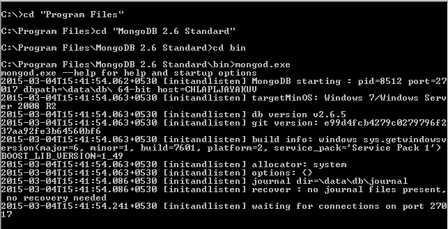
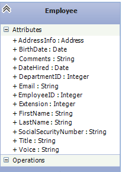
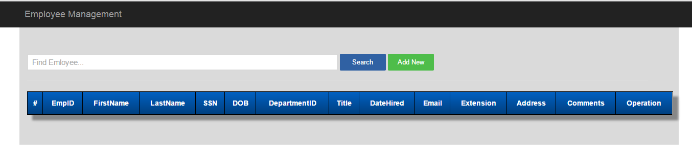
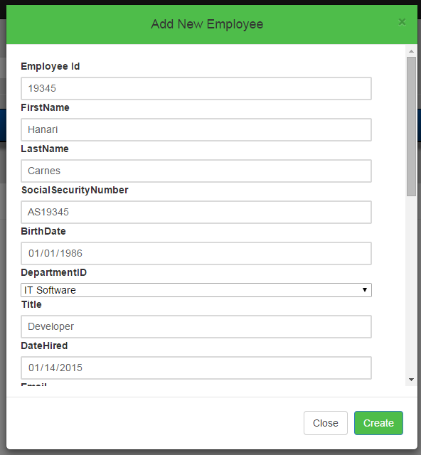
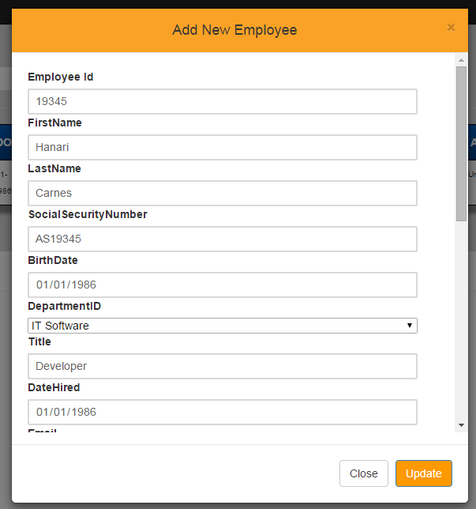
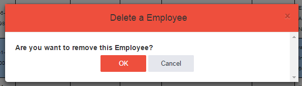
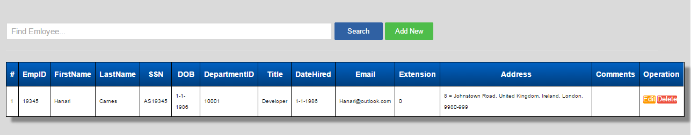

# ASP.Net MVC5 CURD implementation using Web API, Mongo DB
## Requires
- Visual Studio 2013
## License
- MIT
## Technologies
- C#
- ASP.NET MVC 4
- MongoDB
- ASP.NET Web API 2
## Topics
- Architecture and Design
- Generic C# resuable code
- ASP.NET Web API
- Jquery Ajax
- ASP.NET MVC 5
- .net mongo db crud opration
## Updated
- 04/25/2015
## Description

<h1>Web API CURD Operation</h1>

&nbsp;A Visual Studio 2013/2015 project shows how to use the Mongo DB in Web Api, and ASP.Net MVC 5 web application. 
 
&nbsp;This project makes it easy to communicate Mongo DB using C-Sharp Driver. 
Main goal of an application to achieve CURD(Create, Update, Retrieve, Delete) operation. 
 
<strong>Requirement</strong> 
&nbsp;Visual Studio 2015 or Visual Studio 2013, Mongo DB, Fiddler. 
 
<strong>Technologies</strong> 
&nbsp;ASP.Net MVC 5, Web Api, Mongo DB, C#.&nbsp; 
 
<strong>Roadmap</strong> 
Mongo DB communication, Web Api design, ASP.Net MVC 5, Ajax implementation.

<h2>Introduction:</h2>

This project shows how simple Employee management system works(CURD) using Mongo DB, using ASP.Net Web api, MVC5. 
 
Following section we gonna discuss

<ol>
<li>Architecture </li><li>Mongo DB server interaction
<ol>
<li>Download and install Mongo DB server </li><li>Start Mongo DB server </li><li>Mongo DB client editor </li><li>Create database, and table for Employee management
</li></ol>
</li><li>Web api creation </li><li>Client application
<ol>
<li>MVC application </li></ol>
</li><li>Demo screen </li><li>Source Code Overview </li></ol>
<h1>1. Architecture</h1>

Some high level design for communication.

 

<h1></h1>

&nbsp;

* Different client can communicate to ASP.Net web api, just request and response method(json) 
* Once Web api got requested data, then communicate to back-end(Mongo DB), try to update against collection(table) based on request type(Create, Delete,Update). 
* Pass response to respective client 
* client receive the response in XML or JSON formatted date, then populate into native UI screen. 
 
Different client has different methodology&nbsp;to consume REST based service, like C#, Java, Jquery, etc. here am used c# code for the same.

&nbsp;

<h1>2. Mongo DB server interaction</h1>

<strong>1. Download and install Mongo DB server</strong> 
<a href="http://docs.mongodb.org/manual/tutorial/install-mongodb-on-windows/">http://docs.mongodb.org/manual/tutorial/install-mongodb-on-windows/</a> 
<strong>2. Start Mongo DB server&nbsp;</strong> 
Once installation been completed, we gonna start MongoDB server. 
<em>steps</em>:

<blockquote>C:\&gt; cd &quot;Program Files&quot;</blockquote>
<blockquote>C:\Program Files&gt; cd &quot;MongoDB 2.6 Standard&quot;</blockquote>
<blockquote>C:\Program Files\MongoDB 2.6 Standard&gt; cd bin</blockquote>
<blockquote>C:\Program Files\MongoDB 2.6 Standard\bin&gt; Mongod.exe</blockquote>
<blockquote></blockquote>
<blockquote><strong>server initiated successfully.</strong> 
</blockquote>
<blockquote> 
</blockquote>
<blockquote><strong>3. Mongo DB client editor</strong> 
Connect MongoDB server using Robomongo editer or we gonna use command prompt for do the same. 
To download RoboMongo editor :&nbsp;<a href="http://robomongo.org/">http://robomongo.org/</a> 
<strong>&nbsp;</strong></blockquote>
<blockquote><strong>4. Create database</strong> 
</blockquote>
<blockquote>
<blockquote>Create Collection like below</blockquote>
<blockquote>
<blockquote>db.createCollection(&quot;EmployeeDetails&quot;);</blockquote>
</blockquote>
<blockquote>
<blockquote>db.createCollection(&quot;Department&quot;);</blockquote>
<blockquote> 
</blockquote>
</blockquote>
</blockquote>
<blockquote></blockquote>
<blockquote>
<h1>3. Web Api creation</h1>
Following methods has been using in Web api to achieve CURD operation.

C#

Edit|Remove

csharp

<pre class="csharp">&nbsp;&nbsp;&nbsp;&nbsp;&nbsp;&nbsp;&nbsp;&nbsp;public&nbsp;IList&lt;IEmployee&gt;&nbsp;Get(){&nbsp;}&nbsp;
&nbsp;&nbsp;&nbsp;&nbsp;&nbsp;&nbsp;&nbsp;&nbsp;public&nbsp;IEmployee&nbsp;Get(int&nbsp;id){&nbsp;}&nbsp;
&nbsp;&nbsp;&nbsp;&nbsp;&nbsp;&nbsp;&nbsp;&nbsp;public&nbsp;void&nbsp;Post(Employee&nbsp;value)&nbsp;{&nbsp;}&nbsp;
&nbsp;&nbsp;&nbsp;&nbsp;&nbsp;&nbsp;&nbsp;&nbsp;public&nbsp;void&nbsp;Put(int&nbsp;id,&nbsp;Employee&nbsp;value)&nbsp;{&nbsp;}&nbsp;
&nbsp;&nbsp;&nbsp;&nbsp;&nbsp;&nbsp;&nbsp;&nbsp;public&nbsp;void&nbsp;Delete(int&nbsp;id)&nbsp;{&nbsp;}</pre>

&nbsp;

<h1>4. Client application</h1>
Here i would used ASP.net MVC5 web application for consuming Web Api service.

</blockquote>
<blockquote>

C#

Edit|Remove

csharp

<pre class="csharp">&nbsp;&nbsp;&nbsp;&nbsp;[HttpPost]&nbsp;
&nbsp;&nbsp;&nbsp;&nbsp;public&nbsp;ActionResult&nbsp;CreateNewEmployee(Employee&nbsp;postedEmployee)&nbsp;&nbsp;&nbsp;{&nbsp;&nbsp;}&nbsp;
&nbsp;
&nbsp;&nbsp;&nbsp;&nbsp;[HttpPost]&nbsp;
&nbsp;&nbsp;&nbsp;&nbsp;public&nbsp;ActionResult&nbsp;UpdateEmployee(Employee&nbsp;postedEmployee,&nbsp;int&nbsp;employeeId)&nbsp;{&nbsp;&nbsp;}&nbsp;
&nbsp;
&nbsp;&nbsp;&nbsp;&nbsp;[HttpPost]&nbsp;
&nbsp;&nbsp;&nbsp;&nbsp;public&nbsp;ActionResult&nbsp;DeleteEmployee(int&nbsp;empId){&nbsp;}&nbsp;&nbsp;&nbsp;&nbsp;&nbsp;&nbsp;&nbsp;
&nbsp;
&nbsp;&nbsp;&nbsp;&nbsp;[HttpGet]&nbsp;
&nbsp;&nbsp;&nbsp;&nbsp;public&nbsp;ActionResult&nbsp;GetAllEmployeeList()&nbsp;{&nbsp;}</pre>

&nbsp;

<h1>5. Demo screen</h1>
</blockquote>
<blockquote><strong>Initial screen</strong></blockquote>
<blockquote><strong> 
</strong></blockquote>
<blockquote><strong><strong>Add New Employee</strong></strong></blockquote>
<blockquote><strong><strong></strong></strong></blockquote>
<blockquote> 
</blockquote>
<blockquote><strong><strong><strong>Update Employee</strong></strong></strong></blockquote>
<blockquote><strong><strong><strong></strong></strong></strong></blockquote>
<blockquote> 
</blockquote>
<blockquote><strong><strong><strong><strong>Delete Employee</strong></strong></strong></strong></blockquote>
<blockquote><strong><strong><strong><strong></strong></strong></strong></strong></blockquote>
<blockquote> 
</blockquote>
<blockquote><strong><strong><strong><strong><strong>Employee List screen</strong></strong></strong></strong></strong></blockquote>
<blockquote> 
</blockquote>
<blockquote><strong><strong><strong><strong><strong></strong></strong></strong></strong></strong></blockquote>
<blockquote> 
</blockquote>
<blockquote><strong><strong><strong><strong><strong>
<h1>6. Source Code Overview</h1>
</strong></strong></strong></strong></strong></blockquote>
<blockquote><strong>Business</strong>
</blockquote>
<blockquote>

<em>EmployeeManagement.Core(Lib)</em> :
This project has explain how to connect Web Api service.

</blockquote>
<blockquote>

<em>EmployeeManagement.Service(Web Api)
</em>: This is Web Api project, it supposed to expose All HTTP service method's.

</blockquote>
<blockquote><strong>DataAccess</strong></blockquote>
<blockquote><em>EmployeeManagement.Data(Lib) :
</em>This project has to implemented Mongo Db interaction, like insert, update, delete, retrieve through C# driver.</blockquote>
<blockquote><strong>Infrastructure</strong>
</blockquote>
<blockquote><em>EmployeeManagement.SharedLibraries(Lib)</em> : This project used for common libraries class, it used for data communication.</blockquote>
<blockquote><strong>Presentation</strong></blockquote>
<blockquote><strong>&nbsp;</strong><em style="font-size:small; white-space:pre">EmployeeManagement.Web(Web)
</em>: This is ASP.Net MVC 5 project, it used for client presentation like add new record, update, delete.</blockquote>
<blockquote><strong>Execution Process</strong></blockquote>
<blockquote><strong>Build all projects one by one.</strong></blockquote>
<blockquote>1. Need to update current Mongo DB server path, like in Data Access project used MONGO_SERVER appSetting,&nbsp;please update the EmployeeManagement.Service and EmployeeManagement.Data(Optional).</blockquote>
<blockquote> 
</blockquote>
<blockquote>2. Once EmployeeManagement.Service build successfully, publish the content into local server(IIS or Windows server).</blockquote>
<blockquote>&nbsp;3. Configure EmployeeManagement API endpoint into EmployeeManagement.Web and EmployeeManagement.Core(optional).</blockquote>
<blockquote> 
</blockquote>
<blockquote> 
</blockquote>
