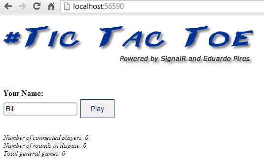
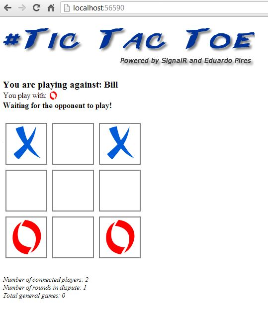

# ASP.Net Tic-Tac-Toe Game Using ASP.Net SignalR
## Requires
- Visual Studio 2012
## License
- Apache License, Version 2.0
## Technologies
- C#
- AJAX
- ASP.NET
- jQuery
- Javascript
- HTML5
- push notifications
- SignalR
- ASP.NET SignalR
- Real Time
## Topics
- Controls
- C#
- AJAX
- ASP.NET
- Games
- jQuery
- Javascript
- Social Games
- HTML5
- SignalR
- Real-time web
- ASP.NET SignalR
## Updated
- 11/01/2013
## Description

<h1>Introdu&ccedil;&atilde;o</h1>

<em>Uma aplica&ccedil;&atilde;o ASP.Net Visual Studio 2012 utilizando SignalR que&nbsp;roda um jogo muito famoso, o Jogo da Velha. 
</em>

<em>Esse jogo permite v&aacute;rios jogadores disputando partidas online e em tempo real.</em>

<em style="font-size:10px">Com essa aplica&ccedil;&atilde;o voc&ecirc; ir&aacute; aprender:</em><em style="font-size:10px">&nbsp;</em>

<ul>
<li><em>Utilizar o ASP.Net SignalR</em> </li><li><em>Utilizar Hubs para atualizar dados para todos usu&aacute;rios conectados</em>
</li><li><em>Como chamar remotamente um m&eacute;todo do servidor a partir do cliente</em>
</li><li><em>Como chamar remotamente um m&eacute;todo de cliente a partir do servidor</em>
</li><li><em>A 'Magica' por tr&aacute;s do ASP.Net SignalR</em> 
<em>&nbsp;</em> </li></ul>

<em>Este aplicativo est&aacute; pronto para receber atualiza&ccedil;&otilde;es para gerenciar os usu&aacute;rios com autentica&ccedil;&atilde;o e armazenar um perfil p&uacute;blico do n&uacute;mero de jogos, vit&oacute;rias, derrotas e empates.</em>

<em></em> 
<em>Este &eacute; um &oacute;timo aplicativo para se divertir e aprender mais sobre esta tecnologia promissora.</em>

<em></em> 
<em>O ASP.Net SignalR &eacute; uma nova tecnologia da fam&iacute;lia ASP.Net e est&aacute; sendo usado no Visual Studio 2013 e Team Foundation Server 2013</em>

<h1>Rodando o aplicativo</h1>

<em>Basta abrir o arquivo de solu&ccedil;&atilde;o e construir a aplica&ccedil;&atilde;o.</em>

<em></em> 
<em>Depois de criar o aplicativo ser&aacute; aberto no navegador.</em>

<em></em>

<em>Duas inst&acirc;ncias do navegador s&atilde;o obrigados a jogar este jogo.</em>

<em></em> 
<em>Encontre o seu advers&aacute;rio</em>

<em></em> 
<em>Divirta-se!</em>

<em> 
</em>

<h1>Descri&ccedil;&atilde;o</h1>

<em>Esta &eacute; uma &oacute;tima maneira de se divertir e aprender sobre ASP.Net SignalR</em> 
 

<ul>
</ul>
<h1>More Information</h1>

<em>Esta foi uma aplica&ccedil;&atilde;o de demonstra&ccedil;&atilde;o usada para mostrar tecnologia ASP.Net SignalR no Visual Studio Summit 2013, no Brasil.</em>

<em> 
Para relatar problemas ou falar sobre esse aplicativo escreva-me em:</em>

<em> 
www.eduardopires.net.br</em>

