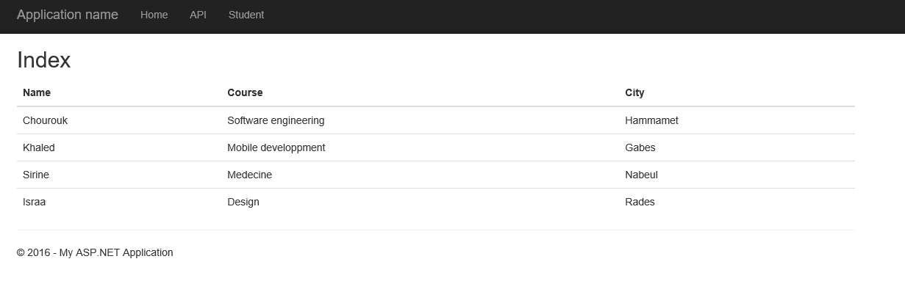

# ASP.Net Web API 2 in ASP.Net MVC 5
## Requires
- Visual Studio 2015
## License
- MIT
## Technologies
- ASP.NET Web API
- ASP.NET MVC 5
## Topics
- ASP.NET Web API
- MVC5
## Updated
- 01/12/2016
## Description

<h1 style="text-align:justify">Introduction</h1>

Today, we'll learn how to access the 
Web API 2 in the ASP.NET MVC 5 application.&nbsp;

<h1 style="text-align:justify">Building the Sample</h1>

To create this application, there are the following prerequisites:

<ul style="text-align:justify">
<li>Visual Studio 2013 or higher. </li><li>ASP.NET MVC 5 </li></ul>

Description

If you are building apps or websites today, the chances are you&rsquo;ll have heard of REST and .net Web API, but you may not be sure what these things are, whether you should use them or how to get started. If this sounds familiar,
 then this article for you. 

ASP.NET Web API is a framework for building web APIs on top of the .NET Framework.&nbsp;This article described how to create the Web API and access that Web API in the ASP.NET MVC 5. We'll show the CRUD operations
 in further articles. Thanks for reading.&nbsp;&nbsp;

A&nbsp;<em>model</em>&nbsp;is an object that represents the data in your application ASP.NET Web API can automatically serialize your model to JSON, XML, or some other format, and then write the serialized data
 into the body of the HTTP response message. As long as a client can read the serialization format, it can deserialize the object. Most clients can parse either XML or JSON. Moreover, the client can indicate which format it wants by setting the Accept header
 in the HTTP request message.

C#

Edit|Remove

csharp

<pre class="csharp">&nbsp;public&nbsp;class&nbsp;StudentRepository&nbsp;:&nbsp;IStudentRepository&nbsp;
&nbsp;&nbsp;&nbsp;&nbsp;{&nbsp;
&nbsp;&nbsp;&nbsp;&nbsp;&nbsp;&nbsp;&nbsp;&nbsp;private&nbsp;List&lt;Student&gt;&nbsp;items&nbsp;=&nbsp;new&nbsp;List&lt;Student&gt;();&nbsp;
&nbsp;&nbsp;&nbsp;&nbsp;&nbsp;&nbsp;&nbsp;&nbsp;private&nbsp;int&nbsp;next&nbsp;=&nbsp;1;&nbsp;
&nbsp;&nbsp;&nbsp;&nbsp;&nbsp;&nbsp;&nbsp;&nbsp;public&nbsp;StudentRepository()&nbsp;
&nbsp;&nbsp;&nbsp;&nbsp;&nbsp;&nbsp;&nbsp;&nbsp;{&nbsp;
&nbsp;&nbsp;&nbsp;&nbsp;&nbsp;&nbsp;&nbsp;&nbsp;&nbsp;&nbsp;&nbsp;&nbsp;AddStudent(new&nbsp;Student&nbsp;{&nbsp;ID&nbsp;=&nbsp;1,&nbsp;Name&nbsp;=&nbsp;&quot;Chourouk&quot;,&nbsp;City&nbsp;=&nbsp;&quot;Hammamet&quot;,&nbsp;Course&nbsp;=&nbsp;&quot;Software&nbsp;engineering&quot;&nbsp;});&nbsp;
&nbsp;&nbsp;&nbsp;&nbsp;&nbsp;&nbsp;&nbsp;&nbsp;&nbsp;&nbsp;&nbsp;&nbsp;AddStudent(new&nbsp;Student&nbsp;{&nbsp;ID&nbsp;=&nbsp;2,&nbsp;Name&nbsp;=&nbsp;&quot;Khaled&quot;,&nbsp;City&nbsp;=&nbsp;&quot;Gabes&quot;,&nbsp;Course&nbsp;=&nbsp;&quot;Mobile&nbsp;development&quot;&nbsp;});&nbsp;
&nbsp;&nbsp;&nbsp;&nbsp;&nbsp;&nbsp;&nbsp;&nbsp;&nbsp;&nbsp;&nbsp;&nbsp;AddStudent(new&nbsp;Student&nbsp;{&nbsp;ID&nbsp;=&nbsp;3,&nbsp;Name&nbsp;=&nbsp;&quot;Sirine&quot;,&nbsp;City&nbsp;=&nbsp;&quot;Nabeul&quot;,&nbsp;Course&nbsp;=&nbsp;&quot;Medecine&quot;&nbsp;});&nbsp;
&nbsp;&nbsp;&nbsp;&nbsp;&nbsp;&nbsp;&nbsp;&nbsp;&nbsp;&nbsp;&nbsp;&nbsp;AddStudent(new&nbsp;Student&nbsp;{&nbsp;ID&nbsp;=&nbsp;4,&nbsp;Name&nbsp;=&nbsp;&quot;Israa&quot;,&nbsp;City&nbsp;=&nbsp;&quot;Rades&quot;,&nbsp;Course&nbsp;=&nbsp;&quot;Design&quot;&nbsp;});&nbsp;
&nbsp;&nbsp;&nbsp;&nbsp;&nbsp;&nbsp;&nbsp;&nbsp;}&nbsp;
&nbsp;
&nbsp;&nbsp;&nbsp;&nbsp;&nbsp;&nbsp;&nbsp;&nbsp;public&nbsp;IEnumerable&lt;Student&gt;&nbsp;GetAllStudents()&nbsp;
&nbsp;&nbsp;&nbsp;&nbsp;&nbsp;&nbsp;&nbsp;&nbsp;{&nbsp;
&nbsp;&nbsp;&nbsp;&nbsp;&nbsp;&nbsp;&nbsp;&nbsp;&nbsp;&nbsp;&nbsp;&nbsp;return&nbsp;items;&nbsp;
&nbsp;&nbsp;&nbsp;&nbsp;&nbsp;&nbsp;&nbsp;&nbsp;}&nbsp;
&nbsp;
&nbsp;&nbsp;&nbsp;&nbsp;&nbsp;&nbsp;&nbsp;&nbsp;public&nbsp;Student&nbsp;AddStudent(Student&nbsp;student)&nbsp;
&nbsp;&nbsp;&nbsp;&nbsp;&nbsp;&nbsp;&nbsp;&nbsp;{&nbsp;
&nbsp;&nbsp;&nbsp;&nbsp;&nbsp;&nbsp;&nbsp;&nbsp;&nbsp;&nbsp;&nbsp;&nbsp;if&nbsp;(items&nbsp;==&nbsp;null)&nbsp;
&nbsp;&nbsp;&nbsp;&nbsp;&nbsp;&nbsp;&nbsp;&nbsp;&nbsp;&nbsp;&nbsp;&nbsp;{&nbsp;
&nbsp;&nbsp;&nbsp;&nbsp;&nbsp;&nbsp;&nbsp;&nbsp;&nbsp;&nbsp;&nbsp;&nbsp;&nbsp;&nbsp;&nbsp;&nbsp;throw&nbsp;new&nbsp;ArgumentNullException(&quot;student&quot;);&nbsp;
&nbsp;&nbsp;&nbsp;&nbsp;&nbsp;&nbsp;&nbsp;&nbsp;&nbsp;&nbsp;&nbsp;&nbsp;}&nbsp;
&nbsp;
&nbsp;&nbsp;&nbsp;&nbsp;&nbsp;&nbsp;&nbsp;&nbsp;&nbsp;&nbsp;&nbsp;&nbsp;student.ID&nbsp;=&nbsp;next&#43;&#43;;&nbsp;
&nbsp;&nbsp;&nbsp;&nbsp;&nbsp;&nbsp;&nbsp;&nbsp;&nbsp;&nbsp;&nbsp;&nbsp;items.Add(student);&nbsp;
&nbsp;&nbsp;&nbsp;&nbsp;&nbsp;&nbsp;&nbsp;&nbsp;&nbsp;&nbsp;&nbsp;&nbsp;return&nbsp;student;&nbsp;
&nbsp;&nbsp;&nbsp;&nbsp;&nbsp;&nbsp;&nbsp;&nbsp;}&nbsp;
&nbsp;&nbsp;&nbsp;&nbsp;}</pre>

<h1>

HTML

Edit|Remove

html

<pre class="csharp">@{&nbsp;
&nbsp;&nbsp;&nbsp;&nbsp;ViewBag.Title&nbsp;=&nbsp;&quot;Data&quot;;&nbsp;
}&nbsp;
&nbsp;
&lt;script&nbsp;src=&quot;~/Scripts/jquery-1.10.2.min.js&quot;&gt;&lt;/script&gt;&nbsp;
&lt;script&nbsp;type=&quot;text/javascript&quot;&gt;&nbsp;
&nbsp;
&nbsp;&nbsp;&nbsp;&nbsp;$(document).ready(function&nbsp;()&nbsp;{&nbsp;
&nbsp;&nbsp;&nbsp;&nbsp;&nbsp;&nbsp;&nbsp;&nbsp;$.ajax({&nbsp;
&nbsp;&nbsp;&nbsp;&nbsp;&nbsp;&nbsp;&nbsp;&nbsp;&nbsp;&nbsp;&nbsp;&nbsp;url:&nbsp;&quot;http://localhost:10689/api/students&quot;,&nbsp;
&nbsp;&nbsp;&nbsp;&nbsp;&nbsp;&nbsp;&nbsp;&nbsp;&nbsp;&nbsp;&nbsp;&nbsp;type:&nbsp;&quot;Get&quot;,&nbsp;
&nbsp;&nbsp;&nbsp;&nbsp;&nbsp;&nbsp;&nbsp;&nbsp;&nbsp;&nbsp;&nbsp;&nbsp;success:&nbsp;function&nbsp;(data)&nbsp;{&nbsp;
&nbsp;&nbsp;&nbsp;&nbsp;&nbsp;&nbsp;&nbsp;&nbsp;&nbsp;&nbsp;&nbsp;&nbsp;&nbsp;&nbsp;&nbsp;&nbsp;for&nbsp;(var&nbsp;i&nbsp;=&nbsp;0;&nbsp;i&nbsp;&lt;&nbsp;data.length;&nbsp;i&#43;&#43;)&nbsp;{&nbsp;
&nbsp;&nbsp;&nbsp;&nbsp;&nbsp;&nbsp;&nbsp;&nbsp;&nbsp;&nbsp;&nbsp;&nbsp;&nbsp;&nbsp;&nbsp;&nbsp;&nbsp;&nbsp;&nbsp;&nbsp;$(&quot;&lt;tr&gt;&lt;td&gt;&quot;&nbsp;&#43;&nbsp;&nbsp;data[i].Name&nbsp;&#43;&nbsp;&quot;&lt;/td&gt;&lt;td&gt;&quot;&nbsp;&#43;&nbsp;data[i].Course&nbsp;&#43;&nbsp;&quot;&lt;/td&gt;&lt;td&gt;&quot;&nbsp;&#43;&nbsp;data[i].City&nbsp;&#43;&nbsp;&quot;&lt;/td&gt;&lt;/tr&gt;&quot;).appendTo(&quot;#students&quot;);&nbsp;
&nbsp;&nbsp;&nbsp;&nbsp;&nbsp;&nbsp;&nbsp;&nbsp;&nbsp;&nbsp;&nbsp;&nbsp;&nbsp;&nbsp;&nbsp;&nbsp;}&nbsp;
&nbsp;&nbsp;&nbsp;&nbsp;&nbsp;&nbsp;&nbsp;&nbsp;&nbsp;&nbsp;&nbsp;&nbsp;},&nbsp;
&nbsp;&nbsp;&nbsp;&nbsp;&nbsp;&nbsp;&nbsp;&nbsp;&nbsp;&nbsp;&nbsp;&nbsp;error:&nbsp;function&nbsp;(msg)&nbsp;{&nbsp;alert(msg);&nbsp;}&nbsp;
&nbsp;&nbsp;&nbsp;&nbsp;&nbsp;&nbsp;&nbsp;&nbsp;});&nbsp;
&nbsp;&nbsp;&nbsp;&nbsp;});&nbsp;
&lt;/script&gt;&nbsp;
&nbsp;
&lt;h2&gt;Index&lt;/h2&gt;&nbsp;
&nbsp;
&lt;div&nbsp;id=&quot;body&quot;&gt;&nbsp;
&nbsp;&nbsp;&nbsp;&nbsp;&lt;section&nbsp;class=&quot;content-wrapper&nbsp;main-content&quot;&gt;&nbsp;
&nbsp;&nbsp;&nbsp;&nbsp;&nbsp;&nbsp;&nbsp;&nbsp;&lt;table&nbsp;id=&quot;students&quot;&nbsp;class=&quot;table&quot;&gt;&nbsp;
&nbsp;&nbsp;&nbsp;&nbsp;&nbsp;&nbsp;&nbsp;&nbsp;&nbsp;&nbsp;&nbsp;&nbsp;&lt;thead&gt;&nbsp;
&nbsp;&nbsp;&nbsp;&nbsp;&nbsp;&nbsp;&nbsp;&nbsp;&nbsp;&nbsp;&nbsp;&nbsp;&nbsp;&nbsp;&nbsp;&nbsp;&lt;tr&gt;&nbsp;
&nbsp;&nbsp;&nbsp;&nbsp;&nbsp;&nbsp;&nbsp;&nbsp;&nbsp;&nbsp;&nbsp;&nbsp;&nbsp;&nbsp;&nbsp;&nbsp;&nbsp;&nbsp;&nbsp;&nbsp;&lt;th&gt;@Html.DisplayName(&quot;Name&quot;)&lt;/th&gt;&nbsp;
&nbsp;
&nbsp;&nbsp;&nbsp;&nbsp;&nbsp;&nbsp;&nbsp;&nbsp;&nbsp;&nbsp;&nbsp;&nbsp;&nbsp;&nbsp;&nbsp;&nbsp;&nbsp;&nbsp;&nbsp;&nbsp;&lt;th&gt;@Html.DisplayName(&quot;Course&quot;)&lt;/th&gt;&nbsp;
&nbsp;
&nbsp;&nbsp;&nbsp;&nbsp;&nbsp;&nbsp;&nbsp;&nbsp;&nbsp;&nbsp;&nbsp;&nbsp;&nbsp;&nbsp;&nbsp;&nbsp;&nbsp;&nbsp;&nbsp;&nbsp;&lt;th&gt;@Html.DisplayName(&quot;City&quot;)&lt;/th&gt;&nbsp;
&nbsp;&nbsp;&nbsp;&nbsp;&nbsp;&nbsp;&nbsp;&nbsp;&nbsp;&nbsp;&nbsp;&nbsp;&nbsp;&nbsp;&nbsp;&nbsp;&lt;/tr&gt;&nbsp;
&nbsp;&nbsp;&nbsp;&nbsp;&nbsp;&nbsp;&nbsp;&nbsp;&nbsp;&nbsp;&nbsp;&nbsp;&lt;/thead&gt;&nbsp;
&nbsp;&nbsp;&nbsp;&nbsp;&nbsp;&nbsp;&nbsp;&nbsp;&lt;/table&gt;&nbsp;
&nbsp;&nbsp;&nbsp;&nbsp;&lt;/section&gt;&nbsp;
&lt;/div&gt;&nbsp;&nbsp;</pre>

</h1>
<ul>
</ul>

Please check the path on the browser when you are accessing your controller.

 

<h1>More Information</h1>

<em>For more information , you can contact me through my website :&nbsp;<a href="http://www.hjaiejchourouk.com/">hjaiejchourouk.com/</a></em>

