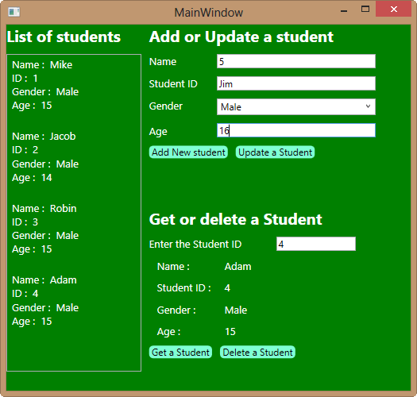

# ASP.net Web API CRUD Operations using WPF Client
## Requires
- Visual Studio 2012
## License
- Apache License, Version 2.0
## Technologies
- ASP.NET
- WPF
- XAML
- ASP.NET MVC
- Visual Studio 2012
## Topics
- AJAX
- ASP.NET
- WPF
- Data Access
- ASP.NET MVC
- WPF Data Binding
- ASP.NET Web API
- Web API
## Updated
- 11/10/2012
## Description

<h2 id="InstallNuGet">Install NuGet Package Manager</h2>

NuGet Package Manager is the easiest way to add the Web API Client library to a project. If you do not have NuGet Package Manager already installed, install it as follows.

<ol>
<li>Start Visual Studio. </li><li>From the&nbsp;<strong>Tools</strong>&nbsp;menu, select&nbsp;<strong>Extensions and Updates</strong>.
</li><li>In the&nbsp;<strong>Extensions and Updates</strong>&nbsp;dialog, select&nbsp;<strong>Online</strong>.
</li><li>If you don't see &quot;NuGet Package Manager&quot;, type &quot;nuget package manager&quot; in the search box.
</li><li>Select the NuGet Package Manager and click&nbsp;<strong>Download</strong>.
</li><li>After the download completes, you will be prompted to install.
</li><li>After the installation completes, you might be prompted to restart Visual Studio.
</li></ol>

<h2 id="InstallClientLib">Install the Web API Client Libraries</h2>

After NuGet Package Manager is installed, add the Web API Client Libraries package to your project.

<ol>
<li>From the&nbsp;<strong>Tools</strong>&nbsp;menu, select&nbsp;<strong>Library Package Manager</strong>.&nbsp;<em>Note</em>: If do you not see this menu item, make sure that NuGet Package Manager installed correctly.
</li><li>Select&nbsp;<strong>Manage NuGet Packages for Solution...</strong>
</li><li>In the&nbsp;<strong>Manage NugGet Packages</strong>&nbsp;dialog, select&nbsp;<strong>Online</strong>.
</li><li>In the search box, type &quot;Microsoft.AspNet.WebApi.Client&quot;.
</li><li>Select the ASP.NET Web API Self Host package and click&nbsp;<strong>Install</strong>.
</li><li>After the package installs, click&nbsp;<strong>Close</strong>&nbsp;to close the dialog.
</li></ol>

<em>&nbsp;&nbsp;</em>

<h2>Asynchronous Calls</h2>

<strong>HttpClient</strong>&nbsp;is designed to be non-blocking. Potentially long-running operations are implemented as asynchonrous methods, such as&nbsp;<strong>GetAsync</strong>&nbsp;and&nbsp;<strong>PostAsync</strong>. These
 methods return without waiting for the operation to complete.&nbsp;The asynchronous methods of&nbsp;<strong>HttpClient</strong>&nbsp;return&nbsp;<strong>Task</strong>&nbsp;objects that represent the asynchronous operation.

<h2>Code: C# (Get a Student in WPF from Web API ASP.net)</h2>

C#

Edit|Remove

csharp

<pre class="csharp">//on&nbsp;button&nbsp;click&nbsp;call&nbsp;Web&nbsp;api&nbsp;Get&nbsp;by&nbsp;ID&nbsp;method&nbsp;
private&nbsp;async&nbsp;void&nbsp;btnGetStudent_Click(object&nbsp;sender,&nbsp;RoutedEventArgs&nbsp;e)&nbsp;
&nbsp;&nbsp;&nbsp;&nbsp;&nbsp;&nbsp;&nbsp;&nbsp;{&nbsp;
//Initialize&nbsp;HTTP&nbsp;Client&nbsp;
&nbsp;
HttpClient&nbsp;client&nbsp;=&nbsp;new&nbsp;HttpClient();&nbsp;
client.BaseAddress&nbsp;=&nbsp;new&nbsp;Uri(&quot;http://localhost:60792&quot;);&nbsp;
&nbsp;&nbsp;&nbsp;&nbsp;&nbsp;&nbsp;&nbsp;&nbsp;&nbsp;&nbsp;&nbsp;&nbsp;client.DefaultRequestHeaders.Accept.Add(new&nbsp;MediaTypeWithQualityHeaderValue(&quot;application/json&quot;));&nbsp;
&nbsp;&nbsp;&nbsp;&nbsp;&nbsp;&nbsp;&nbsp;&nbsp;&nbsp;&nbsp;&nbsp;&nbsp;try&nbsp;
&nbsp;&nbsp;&nbsp;&nbsp;&nbsp;&nbsp;&nbsp;&nbsp;&nbsp;&nbsp;&nbsp;&nbsp;{&nbsp;
&nbsp;&nbsp;&nbsp;&nbsp;&nbsp;&nbsp;&nbsp;&nbsp;&nbsp;&nbsp;&nbsp;&nbsp;&nbsp;&nbsp;&nbsp;&nbsp;HttpResponseMessage&nbsp;response&nbsp;=&nbsp;await&nbsp;client.GetAsync(&quot;/api/student/&quot;&nbsp;&#43;&nbsp;txtID.Text);&nbsp;
&nbsp;&nbsp;&nbsp;&nbsp;&nbsp;&nbsp;&nbsp;&nbsp;&nbsp;&nbsp;&nbsp;&nbsp;&nbsp;&nbsp;&nbsp;&nbsp;response.EnsureSuccessStatusCode();&nbsp;//&nbsp;Throw&nbsp;on&nbsp;error&nbsp;code.&nbsp;
&nbsp;&nbsp;&nbsp;&nbsp;&nbsp;&nbsp;&nbsp;&nbsp;&nbsp;&nbsp;&nbsp;&nbsp;&nbsp;&nbsp;&nbsp;&nbsp;var&nbsp;students&nbsp;=&nbsp;await&nbsp;response.Content.ReadAsAsync&lt;Student&gt;();&nbsp;
&nbsp;&nbsp;&nbsp;&nbsp;&nbsp;&nbsp;&nbsp;&nbsp;&nbsp;&nbsp;&nbsp;&nbsp;&nbsp;&nbsp;&nbsp;&nbsp;studentDetailsPanel.Visibility&nbsp;=&nbsp;Visibility.Visible;&nbsp;
&nbsp;&nbsp;&nbsp;&nbsp;&nbsp;&nbsp;&nbsp;&nbsp;&nbsp;&nbsp;&nbsp;&nbsp;&nbsp;&nbsp;&nbsp;&nbsp;studentDetailsPanel.DataContext&nbsp;=&nbsp;students;&nbsp;
&nbsp;&nbsp;&nbsp;&nbsp;&nbsp;&nbsp;&nbsp;&nbsp;&nbsp;&nbsp;&nbsp;&nbsp;}&nbsp;
&nbsp;&nbsp;&nbsp;&nbsp;&nbsp;&nbsp;&nbsp;&nbsp;&nbsp;&nbsp;&nbsp;&nbsp;catch(Exception)&nbsp;
&nbsp;&nbsp;&nbsp;&nbsp;&nbsp;&nbsp;&nbsp;&nbsp;&nbsp;&nbsp;&nbsp;&nbsp;{&nbsp;
&nbsp;&nbsp;&nbsp;&nbsp;&nbsp;&nbsp;&nbsp;&nbsp;&nbsp;&nbsp;&nbsp;&nbsp;&nbsp;&nbsp;&nbsp;&nbsp;MessageBox.Show(&quot;Student&nbsp;not&nbsp;Found&quot;);&nbsp;
&nbsp;&nbsp;&nbsp;&nbsp;&nbsp;&nbsp;&nbsp;&nbsp;&nbsp;&nbsp;&nbsp;&nbsp;}&nbsp;
&nbsp;&nbsp;&nbsp;&nbsp;&nbsp;&nbsp;&nbsp;&nbsp;}</pre>

<h2>Code: C# (Post a Students from WPF to Web API ASP.net)</h2>

C#

Edit|Remove

csharp

<pre class="csharp">//Post&nbsp;a&nbsp;Student&nbsp;
private&nbsp;async&nbsp;void&nbsp;btnNewStudent_Click(object&nbsp;sender,&nbsp;RoutedEventArgs&nbsp;e)&nbsp;
&nbsp;&nbsp;&nbsp;&nbsp;&nbsp;&nbsp;&nbsp;&nbsp;{&nbsp;
//Initialize&nbsp;HTTP&nbsp;Client&nbsp;
HttpClient&nbsp;client&nbsp;=&nbsp;new&nbsp;HttpClient();&nbsp;
client.BaseAddress&nbsp;=&nbsp;new&nbsp;Uri(&quot;http://localhost:60792&quot;);&nbsp;
&nbsp;&nbsp;&nbsp;&nbsp;&nbsp;&nbsp;&nbsp;&nbsp;&nbsp;&nbsp;&nbsp;&nbsp;client.DefaultRequestHeaders.Accept.Add(new&nbsp;MediaTypeWithQualityHeaderValue(&quot;application/json&quot;));&nbsp;
&nbsp;&nbsp;&nbsp;&nbsp;&nbsp;&nbsp;&nbsp;&nbsp;&nbsp;&nbsp;&nbsp;&nbsp;try&nbsp;
&nbsp;&nbsp;&nbsp;&nbsp;&nbsp;&nbsp;&nbsp;&nbsp;&nbsp;&nbsp;&nbsp;&nbsp;{&nbsp;
&nbsp;&nbsp;&nbsp;&nbsp;&nbsp;&nbsp;&nbsp;&nbsp;&nbsp;&nbsp;&nbsp;&nbsp;&nbsp;&nbsp;&nbsp;&nbsp;var&nbsp;student&nbsp;=&nbsp;new&nbsp;Student()&nbsp;
&nbsp;&nbsp;&nbsp;&nbsp;&nbsp;&nbsp;&nbsp;&nbsp;&nbsp;&nbsp;&nbsp;&nbsp;&nbsp;&nbsp;&nbsp;&nbsp;{&nbsp;
&nbsp;&nbsp;&nbsp;&nbsp;&nbsp;&nbsp;&nbsp;&nbsp;&nbsp;&nbsp;&nbsp;&nbsp;&nbsp;&nbsp;&nbsp;&nbsp;&nbsp;&nbsp;&nbsp;&nbsp;name&nbsp;=&nbsp;txtStudentName.Text,&nbsp;
&nbsp;&nbsp;&nbsp;&nbsp;&nbsp;&nbsp;&nbsp;&nbsp;&nbsp;&nbsp;&nbsp;&nbsp;&nbsp;&nbsp;&nbsp;&nbsp;&nbsp;&nbsp;&nbsp;&nbsp;id&nbsp;=&nbsp;int.Parse(txtStudentID.Text),&nbsp;
&nbsp;&nbsp;&nbsp;&nbsp;&nbsp;&nbsp;&nbsp;&nbsp;&nbsp;&nbsp;&nbsp;&nbsp;&nbsp;&nbsp;&nbsp;&nbsp;&nbsp;&nbsp;&nbsp;&nbsp;gender&nbsp;=&nbsp;cbxGender.SelectedItem.ToString(),&nbsp;
&nbsp;&nbsp;&nbsp;&nbsp;&nbsp;&nbsp;&nbsp;&nbsp;&nbsp;&nbsp;&nbsp;&nbsp;&nbsp;&nbsp;&nbsp;&nbsp;&nbsp;&nbsp;&nbsp;&nbsp;age&nbsp;=&nbsp;int.Parse(txtAge.Text)&nbsp;
&nbsp;&nbsp;&nbsp;&nbsp;&nbsp;&nbsp;&nbsp;&nbsp;&nbsp;&nbsp;&nbsp;&nbsp;&nbsp;&nbsp;&nbsp;&nbsp;};&nbsp;
&nbsp;&nbsp;&nbsp;&nbsp;&nbsp;&nbsp;&nbsp;&nbsp;&nbsp;&nbsp;&nbsp;&nbsp;&nbsp;&nbsp;&nbsp;&nbsp;var&nbsp;response&nbsp;=&nbsp;await&nbsp;client.PostAsJsonAsync(&quot;/api/student/&quot;,&nbsp;student);&nbsp;
&nbsp;&nbsp;&nbsp;&nbsp;&nbsp;&nbsp;&nbsp;&nbsp;&nbsp;&nbsp;&nbsp;&nbsp;&nbsp;&nbsp;&nbsp;&nbsp;response.EnsureSuccessStatusCode();&nbsp;//&nbsp;Throw&nbsp;on&nbsp;error&nbsp;code.&nbsp;
&nbsp;&nbsp;&nbsp;&nbsp;&nbsp;&nbsp;&nbsp;&nbsp;&nbsp;&nbsp;&nbsp;&nbsp;&nbsp;&nbsp;&nbsp;&nbsp;MessageBox.Show(&quot;Student&nbsp;Added&nbsp;Successfully&quot;,&nbsp;&quot;Result&quot;,&nbsp;MessageBoxButton.OK,&nbsp;MessageBoxImage.Information);&nbsp;
&nbsp;&nbsp;&nbsp;&nbsp;&nbsp;&nbsp;&nbsp;&nbsp;&nbsp;&nbsp;&nbsp;&nbsp;&nbsp;&nbsp;&nbsp;&nbsp;studentsListView.ItemsSource&nbsp;=&nbsp;await&nbsp;GetAllStudents();&nbsp;
&nbsp;&nbsp;&nbsp;&nbsp;&nbsp;&nbsp;&nbsp;&nbsp;&nbsp;&nbsp;&nbsp;&nbsp;&nbsp;&nbsp;&nbsp;&nbsp;studentsListView.ScrollIntoView(studentsListView.ItemContainerGenerator.Items[studentsListView.Items.Count&nbsp;-&nbsp;1]);&nbsp;
&nbsp;&nbsp;&nbsp;&nbsp;&nbsp;&nbsp;&nbsp;&nbsp;&nbsp;&nbsp;&nbsp;&nbsp;}&nbsp;
&nbsp;&nbsp;&nbsp;&nbsp;&nbsp;&nbsp;&nbsp;&nbsp;&nbsp;&nbsp;&nbsp;&nbsp;catch&nbsp;(Exception&nbsp;ex)&nbsp;
&nbsp;&nbsp;&nbsp;&nbsp;&nbsp;&nbsp;&nbsp;&nbsp;&nbsp;&nbsp;&nbsp;&nbsp;{&nbsp;
&nbsp;&nbsp;&nbsp;&nbsp;&nbsp;&nbsp;&nbsp;&nbsp;&nbsp;&nbsp;&nbsp;&nbsp;&nbsp;&nbsp;&nbsp;&nbsp;MessageBox.Show(&quot;Student&nbsp;not&nbsp;Added,&nbsp;May&nbsp;be&nbsp;due&nbsp;to&nbsp;Duplicate&nbsp;ID&quot;);&nbsp;
&nbsp;&nbsp;&nbsp;&nbsp;&nbsp;&nbsp;&nbsp;&nbsp;&nbsp;&nbsp;&nbsp;&nbsp;}&nbsp;
&nbsp;&nbsp;&nbsp;&nbsp;&nbsp;&nbsp;&nbsp;&nbsp;}</pre>

<h1 class="endscriptcode">&nbsp;Screenshot of WPF Application:</h1>

&nbsp;

&nbsp;

