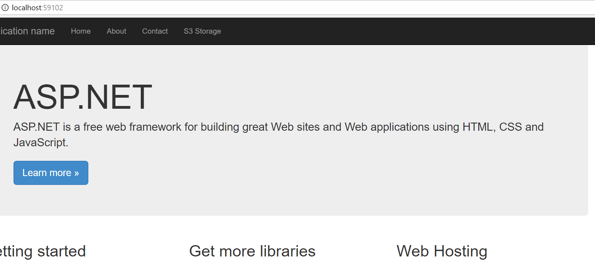
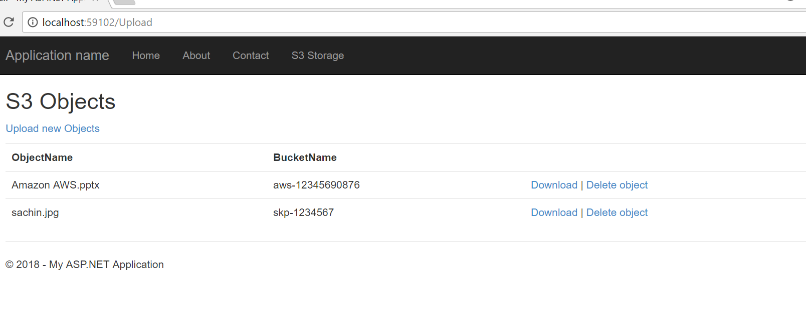
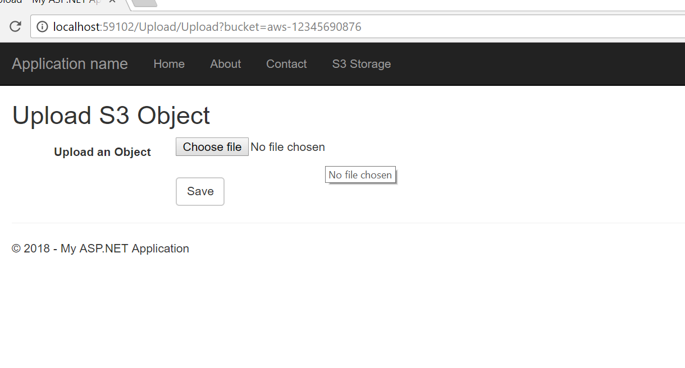
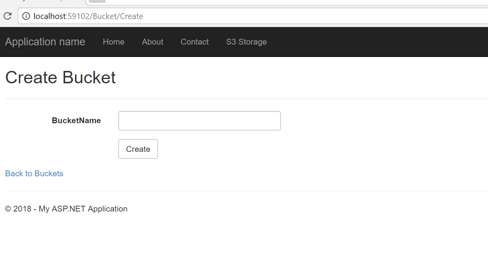

# AWS SDK  S3 Storage using C#
## Requires
- Visual Studio 2017
## License
- MIT
## Technologies
- C#
- autofac
- Dependency Injection
- ASP.NET MVC 5
- Visual Studio 2017
- AWS SDK
- AWS S3
- AWS S3 Bucket
- AWS S3 Object
## Topics
- AWS S3 Storage
- AWS Security
- AWS S3 Bucket Creation using AWS SDk
- AWS S3 Object Creation using AWS SDK
- AWS S3 Bucket URL Creation using AWS SDk
- AWS S3 Download URL Creation using AWS SDK
## Updated
- 04/02/2018
## Description

<h1>Introduction</h1>

<em>I created this sample to access AWS S3 storage using AWS SDK and C#. This sample shows how you can create</em>

<em>Bucket and upload objects into buckets. I used ASP.net MVC 5 to perform all CRUD operations.&nbsp;</em>

<em>This sample also uses dependency injection using Autofac and used it inside controllers to inject.</em>

<h1>Building the Sample</h1>

<em>AWS SDK for .net</em>

<em>Autofac</em>

<em>Visual Studio 2015</em>

<em>.net framework 4.6</em>

Description

This is first time i learned AWS. As per as my understanding , AWS SDK for .net is very easy to use API and Amazon provides rich documentation.&nbsp;

AWS S3 is is robust and fast storage system mostlly used for CDN and static website hosting. AWS S3 is budget friendly and secure .

In this sample , i showed how we can create Bucket and upload file inside it. I tried to make it simple as possible.

I hope it will be very helpful for developers for all level.

<strong style="color:#ff0000">Visit and login&nbsp; <a href="https://www.console.aws.amazon.com/">
https://www.console.aws.amazon.com</a></strong>

&nbsp;

<strong>After Login Click on User Name , showing right side on top.</strong>

&nbsp;

<strong>Click on My Security Credentials</strong>

&nbsp;

<strong>Click Continue to Security Credentials&nbsp; on the Dialog box</strong>

&nbsp;

<strong>Click Create New Access Key on Your Security Credentials Page</strong>

&nbsp;

<strong>Copy Access key and Secret key from Create Access key dialog, you can also download Access key for feature use into your machine.</strong>

&nbsp;

<strong>Add Secret key into Web.Config file</strong>

&nbsp;

&nbsp;

&nbsp;

<strong>Output</strong>

 

&nbsp;

C#

Edit|Remove

csharp
<pre class="hidden">Click here to add your code snippet.using System;
using System.Collections.Generic;
using System.Linq;
using System.Web;
using Amazon;
using Amazon.S3;

namespace TestWeb.Utilities.Common
{
    public class AWSService : IAWSServce
    {
        public AWSService() { }
        //public AWSService(string accessKey,string secretkey,RegionEndpoint regionEndpoint )
        //{
        //    this.AccessKey = accessKey;
        //    this.SecretKey = secretkey;
        //    this.RegionEndpoint = regionEndpoint;
        //}
        public virtual IAmazonS3 Client {
            get { return Amazon.AWSClientFactory.CreateAmazonS3Client(Config.AccessKey,Config.SecretKey,RegionEndpoint.APNortheast1); }
        }

        //public string AccessKey { get; set; }
        //public string SecretKey { get; set; }
        //public RegionEndpoint RegionEndpoint {
        //    get { return RegionEndpoint.APNortheast2; }
        //    set { RegionEndpoint = value; }
        //}
    }
}</pre>

<pre class="csharp">Click&nbsp;here&nbsp;to&nbsp;add&nbsp;your&nbsp;code&nbsp;snippet.using&nbsp;System;&nbsp;
using&nbsp;System.Collections.Generic;&nbsp;
using&nbsp;System.Linq;&nbsp;
using&nbsp;System.Web;&nbsp;
using&nbsp;Amazon;&nbsp;
using&nbsp;Amazon.S3;&nbsp;
&nbsp;
namespace&nbsp;TestWeb.Utilities.Common&nbsp;
{&nbsp;
&nbsp;&nbsp;&nbsp;&nbsp;public&nbsp;class&nbsp;AWSService&nbsp;:&nbsp;IAWSServce&nbsp;
&nbsp;&nbsp;&nbsp;&nbsp;{&nbsp;
&nbsp;&nbsp;&nbsp;&nbsp;&nbsp;&nbsp;&nbsp;&nbsp;public&nbsp;AWSService()&nbsp;{&nbsp;}&nbsp;
&nbsp;&nbsp;&nbsp;&nbsp;&nbsp;&nbsp;&nbsp;&nbsp;//public&nbsp;AWSService(string&nbsp;accessKey,string&nbsp;secretkey,RegionEndpoint&nbsp;regionEndpoint&nbsp;)&nbsp;
&nbsp;&nbsp;&nbsp;&nbsp;&nbsp;&nbsp;&nbsp;&nbsp;//{&nbsp;
&nbsp;&nbsp;&nbsp;&nbsp;&nbsp;&nbsp;&nbsp;&nbsp;//&nbsp;&nbsp;&nbsp;&nbsp;this.AccessKey&nbsp;=&nbsp;accessKey;&nbsp;
&nbsp;&nbsp;&nbsp;&nbsp;&nbsp;&nbsp;&nbsp;&nbsp;//&nbsp;&nbsp;&nbsp;&nbsp;this.SecretKey&nbsp;=&nbsp;secretkey;&nbsp;
&nbsp;&nbsp;&nbsp;&nbsp;&nbsp;&nbsp;&nbsp;&nbsp;//&nbsp;&nbsp;&nbsp;&nbsp;this.RegionEndpoint&nbsp;=&nbsp;regionEndpoint;&nbsp;
&nbsp;&nbsp;&nbsp;&nbsp;&nbsp;&nbsp;&nbsp;&nbsp;//}&nbsp;
&nbsp;&nbsp;&nbsp;&nbsp;&nbsp;&nbsp;&nbsp;&nbsp;public&nbsp;virtual&nbsp;IAmazonS3&nbsp;Client&nbsp;{&nbsp;
&nbsp;&nbsp;&nbsp;&nbsp;&nbsp;&nbsp;&nbsp;&nbsp;&nbsp;&nbsp;&nbsp;&nbsp;get&nbsp;{&nbsp;return&nbsp;Amazon.AWSClientFactory.CreateAmazonS3Client(Config.AccessKey,Config.SecretKey,RegionEndpoint.APNortheast1);&nbsp;}&nbsp;
&nbsp;&nbsp;&nbsp;&nbsp;&nbsp;&nbsp;&nbsp;&nbsp;}&nbsp;
&nbsp;
&nbsp;&nbsp;&nbsp;&nbsp;&nbsp;&nbsp;&nbsp;&nbsp;//public&nbsp;string&nbsp;AccessKey&nbsp;{&nbsp;get;&nbsp;set;&nbsp;}&nbsp;
&nbsp;&nbsp;&nbsp;&nbsp;&nbsp;&nbsp;&nbsp;&nbsp;//public&nbsp;string&nbsp;SecretKey&nbsp;{&nbsp;get;&nbsp;set;&nbsp;}&nbsp;
&nbsp;&nbsp;&nbsp;&nbsp;&nbsp;&nbsp;&nbsp;&nbsp;//public&nbsp;RegionEndpoint&nbsp;RegionEndpoint&nbsp;{&nbsp;
&nbsp;&nbsp;&nbsp;&nbsp;&nbsp;&nbsp;&nbsp;&nbsp;//&nbsp;&nbsp;&nbsp;&nbsp;get&nbsp;{&nbsp;return&nbsp;RegionEndpoint.APNortheast2;&nbsp;}&nbsp;
&nbsp;&nbsp;&nbsp;&nbsp;&nbsp;&nbsp;&nbsp;&nbsp;//&nbsp;&nbsp;&nbsp;&nbsp;set&nbsp;{&nbsp;RegionEndpoint&nbsp;=&nbsp;value;&nbsp;}&nbsp;
&nbsp;&nbsp;&nbsp;&nbsp;&nbsp;&nbsp;&nbsp;&nbsp;//}&nbsp;
&nbsp;&nbsp;&nbsp;&nbsp;}&nbsp;
}</pre>

<h1>Source Code Files</h1>

&nbsp;AWSService.cs

&nbsp;

&nbsp;IAWSService.cs

BucketController

UploadController

<h1>More Information</h1>

<em>For more information on X, see ...?</em>

