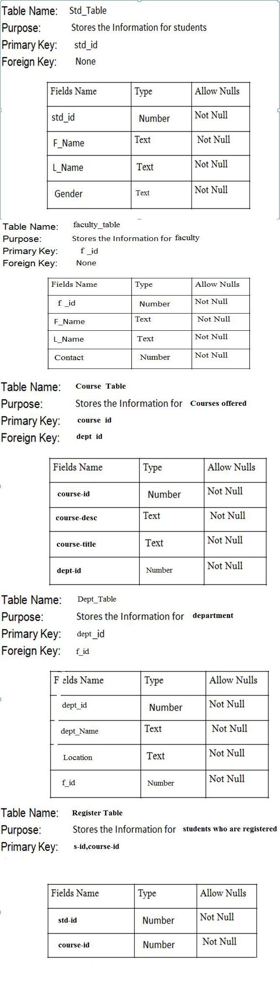
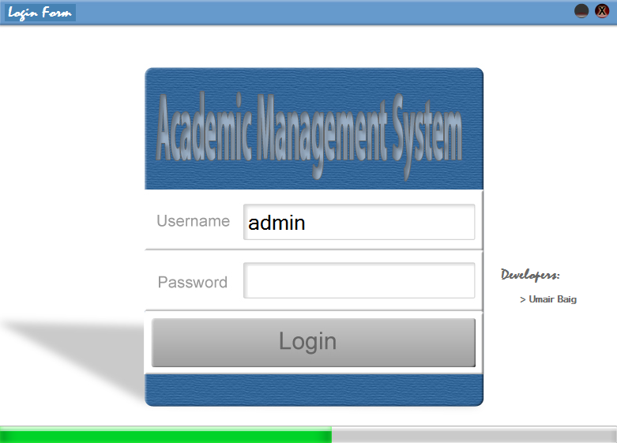
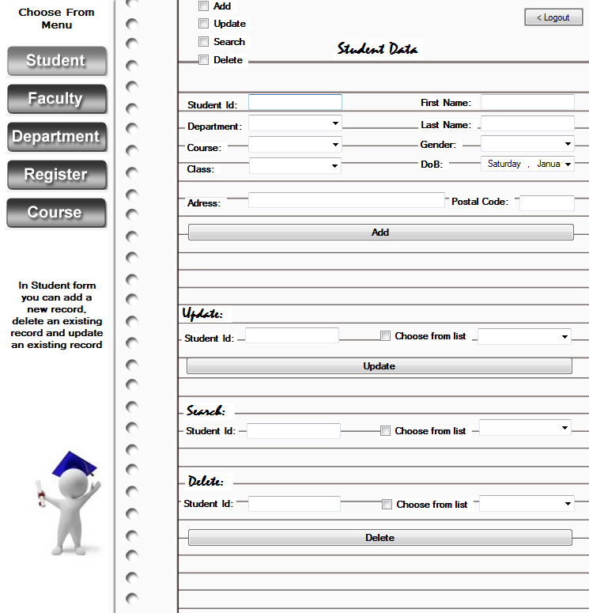

# Academic Management System_MS Visual Studio c#, Windows Form Application
## Requires
- Visual Studio 2010
## License
- Apache License, Version 2.0
## Technologies
- Windows Forms
- Access
- Microsoft Office Access
- Access 2007
## Topics
- Architecture and Design
- Data Access
## Updated
- 05/18/2012
## Description

<a href="csharplanguageontips.blogspot.com"><strong>Academic Management System</strong></a>

<strong>&nbsp;<a href="csharplanguageontips.blogspot.com">Objective</a></strong>

&nbsp;The purpose of this <a href="http://webeasyforall.blogspot.com/" target="_blank">
project</a> is to keep track of student and their main <a href="http://webeasyforall.blogspot.com/" target="_blank">
department</a>, transcripts and registration as well as the university&lsquo;s course offering. The
<a href="csharplanguageontips.blogspot.com">database</a> also keeps track of the sponsored research
<a href="csharplanguageontips.blogspot.com">projects</a> of the faculty and the undergraduate students. It includes data about student, faculty, research laboratories, courses
<a href="csharplanguageontips.blogspot.com">registration</a> and <a href="http://webeasyforall.blogspot.com/" target="_blank">
enrollment</a>. Reflect the &nbsp;state of affairs of<a href="http://webeasyforall.blogspot.com/" target="_blank"> academic</a> aspect of university.

<strong>Analysis</strong>

<strong><a href="http://webeasyforall.blogspot.com/">Existing </a>System</strong>

Most <a href="http://rccars4u.blogspot.com/" target="_blank">universities</a> need to<a href="http://rccars4u.blogspot.com/" target="_blank"> record data</a> to help in the activities of teaching and learning. Most universities need to record, amongst other
 things. We there is no <a href="csharplanguageontips.blogspot.com">database</a> we might face these
<a href="http://rccars4u.blogspot.com/" target="_blank">problems</a>:

<ul>
<li>what<a href="http://rccars4u.blogspot.com/" target="_blank"> students</a> and lecturers they have
</li><li>what <a href="http://rccars4u.blogspot.com/" target="_blank">courses</a> and modules they are running
</li><li>which lecturers are <a href="http://webeasyforall.blogspot.com/" target="_blank">
teaching</a> which modules </li><li>which students are taking which modules </li><li>which <a href="http://rccars4u.blogspot.com/" target="_blank">lecturer</a> is<a href="http://webeasyforall.blogspot.com/" target="_blank"> assessing</a> against which<a href="http://webeasyforall.blogspot.com/" target="_blank"> module
</a></li><li>which students have been <a href="http://webeasyforall.blogspot.com/" target="_blank">
assessed</a> in which <a href="csharplanguageontips.blogspot.com">modules </a></li></ul>

<strong>Drawbacks</strong>

<ul>
<li>Not reliable </li><li>Time <a href="http://webeasyforall.blogspot.com/" target="_blank">consuming </a>
</li><li>Possibility of loss of data </li><li>Information searching is difficult </li><li>No back up available </li><li><a href="http://webeasyforall.blogspot.com/" target="_blank">Wastage </a>of resources in case of back up
</li></ul>

<strong>Proposed System</strong>

Our <a href="csharplanguageontips.blogspot.com">Proposed system</a> said: various<a href="http://rccars4u.blogspot.com/" target="_blank"> members</a> of staff at a
<a href="csharplanguageontips.blogspot.com">university</a> will be entering data such as this into a
<a href="http://rccars4u.blogspot.com/" target="_blank">database system</a>. For instance, data relevant to courses and modules may be entered by administrators in academic departments, course<a href="http://rccars4u.blogspot.com/" target="_blank"> leaders</a>
 may enter data pertaining to lecturers and data relevant to students, particularly their
<a href="http://rccars4u.blogspot.com/" target="_blank">enrolments </a>on courses and modules, may be<a href="http://rccars4u.blogspot.com/" target="_blank"> entered</a> by staff at a central registry.

Once the data is entered into the <a href="csharplanguageontips.blogspot.com">
database</a> it may be utilized in a variety of ways. For example, a complete and accurate list of enrolled students may be used to generate membership records for the learning resources center, it may be used as a claim to
<a href="csharplanguageontips.blogspot.com">educational</a> authorities for student income or as an input into a timetabling system which might attempt to optimize room utilization across a
<a href="csharplanguageontips.blogspot.com">university</a> campus.

<strong><a href="http://webeasyforall.blogspot.com/" target="_blank">Low level Design</a> includes following
<a href="http://rccars4u.blogspot.com/" target="_blank">entities</a></strong>

Student

Faculty

<a href="csharplanguageontips.blogspot.com">Department</a>

<a href="http://webeasyforall.blogspot.com/" target="_blank">Registration</a>

Course

<strong><a href="http://rccars4u.blogspot.com/" target="_blank">Tools</a> Used</strong>

<ul>
<li><a href="csharplanguageontips.blogspot.com">MS Visual Studio c# Express Edition
</a></li><li><a href="csharplanguageontips.blogspot.com">MS Word 2010 </a></li><li><a href="csharplanguageontips.blogspot.com">MS Project 2010 </a></li><li><a href="csharplanguageontips.blogspot.com">MS Excel 2010 </a></li><li>Ascent </li><li><a href="csharplanguageontips.blogspot.com">MS Access 2010 </a></li></ul>

<strong><a href="csharplanguageontips.blogspot.com">Data Structure</a></strong>

<ul>
<li><a href="http://webeasyforall.blogspot.com/" target="_blank">Student_Info = Student_Id &#43; Student_Name &#43; Student_DoB &#43; Student _Class &#43; Student_Course &#43; Student_Department &#43; Student_Address
</a></li><li><a href="http://webeasyforall.blogspot.com/" target="_blank">Faculty_Info = Faculty_Id &#43; Faculty_Name &#43; Faculty_Department &#43; Faculty_DoB &#43; Faculty_Address &#43; Faculty_Contact_Number &#43; Faculty_Salary
</a></li><li><a href="http://webeasyforall.blogspot.com/" target="_blank">Course_Info = Course_Id &#43; Course_Department &#43; Course_Title &#43; Course_Description
</a></li><li><a href="http://webeasyforall.blogspot.com/" target="_blank">Department_Info = Dept_Id &#43; Dept_Name &#43; Dept_Location
</a></li><li><a href="http://webeasyforall.blogspot.com/" target="_blank">Register_Info = Student_Id &#43; Course_Id
</a></li></ul>

<strong><a href="csharplanguageontips.blogspot.com">Data Dictionary</a></strong>

<strong>&nbsp;</strong>

<strong>&nbsp;</strong>

<strong>&nbsp;</strong>

<strong>&nbsp;</strong>

<strong>&nbsp;</strong>

