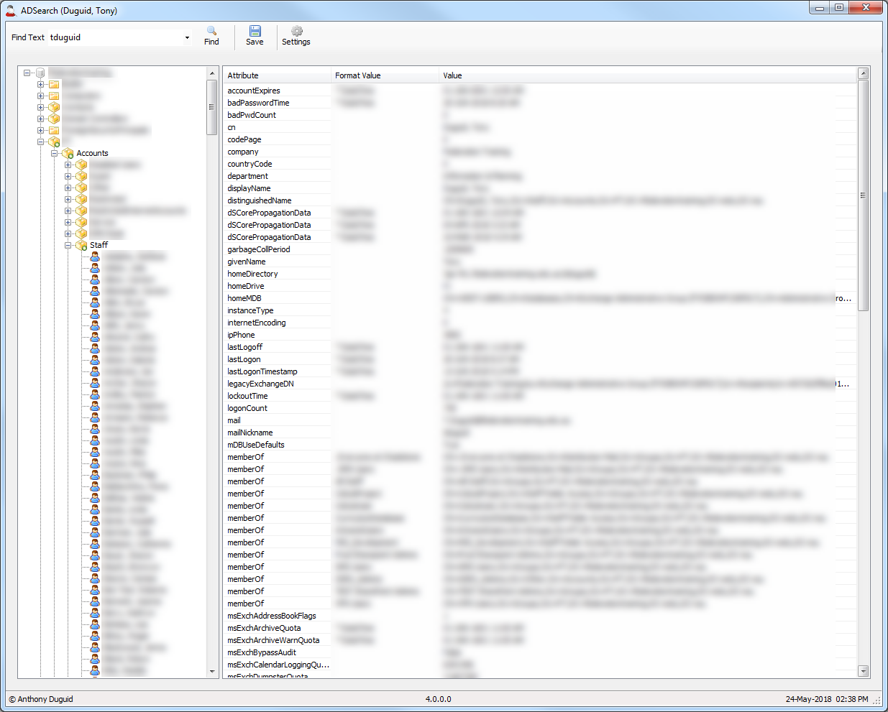

# Active Directory Search & Export Tool
## Requires
- Visual Studio 2017
## License
- MIT
## Technologies
- C#
- CSV
- LDAP
- apps for Office
- Visual Studio 2017
## Topics
- TreeView
- LDAP (Lightweight Directory Access Protocol)
- export grid
## Updated
- 01/24/2019
## Description

<h1></h1>

This Active Directory Search &amp; Export Tool was written in Visual Studio Community 2017 C# Windows Forms and exports the results from LDAP (Lightweight Directory Access Protocol) to csv format. A common use of LDAP is to provide a central place to store
 usernames and passwords. This allows many different applications and services to connect to the LDAP server to validate users. This project is now on
<a href="https://github.com/Visual-Studio-projects/Active-Directory-Search/blob/master/README.md">
GitHub</a>. There is also an older version in <a href="https://code.msdn.microsoft.com/office/Active-Directory-search-5997d18d">
VB.NET</a>

Please rate this code. :)

&nbsp;&nbsp;&nbsp;&nbsp;&nbsp;

Overview

This application uses LDAP (Lightweight Directory Access Protocol) to search Active Directory items from the treeview, the toolbar &quot;Find&quot; button or double clicking on the item in the listview

<strong>Dependencies</strong>

<table border="0" cellspacing="0" cellpadding="0" style="width:0px">
<thead>
<tr style="background-color:#cfd2d3">
<td>

<strong>&nbsp;Software</strong>

</td>
<td>

<strong>&nbsp;Dependency &nbsp; &nbsp;</strong>

</td>
</tr>
</thead>
<tbody>
<tr>
<td>

&nbsp;<a href="https://www.visualstudio.com/vs/whatsnew/">Microsoft Visual Studio Community 2017</a>&nbsp; &nbsp; &nbsp;

</td>
<td>

&nbsp;Solution

</td>
</tr>
<tr>
<td>

&nbsp;<a href="http://www.iconarchive.com/show/silk-icons-by-famfamfam.html">www.IconArchive.com</a>

</td>
<td>

&nbsp;Icons

</td>
</tr>
<tr>
<td>

&nbsp;<a href="http://discover.techsmith.com/snagit-non-brand-desktop/?gclid=CNzQiOTO09UCFVoFKgod9EIB3g">Snagit</a>

</td>
<td>

&nbsp;Read Me

</td>
</tr>
</tbody>
</table>

<strong>Glossary of Terms</strong>

<table border="0" cellspacing="0" cellpadding="0" width="0">
<thead>
<tr style="background-color:#cfd2d3">
<td>

<strong>&nbsp;Term &nbsp; &nbsp;</strong>

</td>
<td>

<strong>&nbsp;Meaning</strong>

</td>
</tr>
</thead>
<tbody>
<tr>
<td>

&nbsp;LDAP

</td>
<td>

&nbsp;Lightweight Directory Access Protocol &nbsp;&nbsp;

</td>
</tr>
<tr>
<td>

&nbsp;CSV

</td>
<td>

&nbsp;Comma-Separated Values

</td>
</tr>
</tbody>
</table>

<strong>Functionality</strong>

Listed below is the detailed functionality of this application and its components.

<h4>Find Text (Dropdown)</h4>
<ul>
<li>Lists all the values searched for in the current session </li></ul>
<h4>Find (Button)</h4>
<ul>
<li>Queries Active Directory for the text in the &quot;Find Text&quot; textbox </li></ul>
<h4>Save (Button)</h4>
<ul>
<li>Saves the current listbox view to a .csv file </li></ul>
<h4>User List (Button)</h4>
<ul>
<li>This will change the layout of the listbox to show more information about each member of a group
</li></ul>
<h4>Settings (Button)</h4>
<ul>
<li>Opens the settings form. The domain name must be updated here. </li></ul>
<h4>About (Button)</h4>
<ul>
<li>Opens the about form </li></ul>
