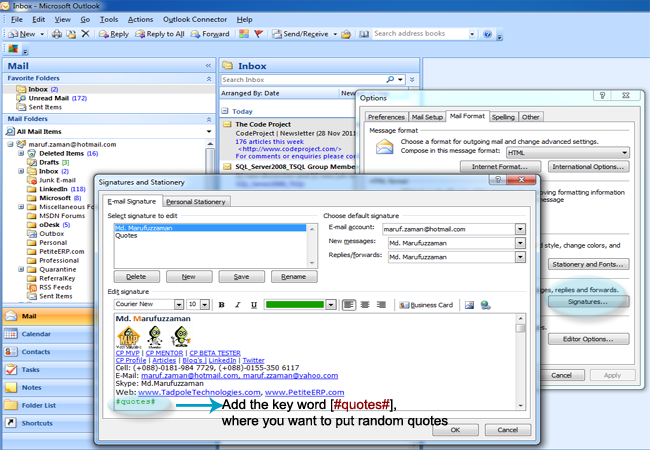
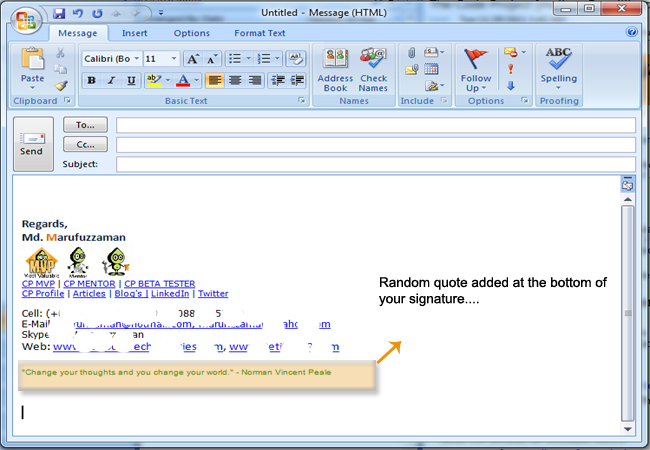
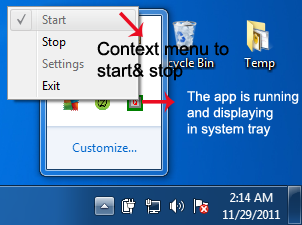

# Add random quotes in your Outlook email signature
## Requires
- 
## License
- Apache License, Version 2.0
## Technologies
- .NET Framework
- C# Language
## Topics
- Outlook
## Updated
- 11/29/2011
## Description

<h2>Introduction</h2>

This article contains few funny things, which I would like to share with you guys. Well we will discuss about how we can add random quotes in our email signature, please note that we will use Microsoft Office Outlook 2007 as our email client software.

<h2>Background</h2>

I love quotes especially inspiration or motivational quotes &amp; I really enjoy using quotes in my email signature.&nbsp; When I &lsquo;m trying to choose quotes for my email signature I stuck! Which one I took, there are huge quotes are available and I
 can&rsquo;t choose one of them. Finally I decided that I will write a program which will randomly add quotes in my Outlook email signature

 
So let&rsquo;s start, from the very beginning when I start writing this program I was little bit confused cause I could not decided which one I use, should I go for Add-In or windows services or a simple win32 Form application. So finally I decided that I will
 go for win32 application. 
 

<h2>How I do that&nbsp;</h2>

I use very basic techniques / ways to do this are listed below:

<ol>
<li>Create a signature in Microsoft Office Outlook. </li><li>Add a key word (#quotes#) at the bottom of the signature. </li><li>Create a template of the current signature. </li><li>Create an Xml document that contains all the quotes. </li><li>Finally add the quotes when Outlook is running. </li></ol>

Let&rsquo;s discuss it with more detail &amp; go thru the list above:

<h3>Create a signature in Microsoft Office Outlook</h3>

Well at first we will create a signature file; it&rsquo;s very simple just open / run Microsoft Office Outlook and selects &ldquo;Option&rdquo; from the tools menu. A single windows Form will appear with multiple tabs ? select &ldquo;Mail Format&rdquo; tab.
 You will be found a button called &ldquo;Signatures&hellip;&rdquo; under this tab click on the button and create you Outlook email signature.
 
 

<h3>Add a key word (#quotes#) at the bottom of the signature</h3>

Great! You create your signature and now add the key word (&ldquo;quotes&rdquo;) at the bottom of your signature.&nbsp; The following figure-A shows the key word with a signature.

&nbsp;

Figure-A shows the key word with a signature

<h2>Create a template of the current signature</h2>

Now we will create the template of the current signature, we will use this template for randomly selected quotes and update the Microsoft Office Outlook signature file.&nbsp; Note that I face a lot of issues when I update the Outlook signature file, for
 example text encoding, getting garbage manipulating the string etc. I would appreciate your idea to resolve this in good manner, actually the current code is a little bit sloppy (my personal opinion).&nbsp;&nbsp; Anyway a sample code snippets is given below
 for the current scenario.

&nbsp;

C#

Edit|Remove

csharp
<pre class="hidden">        public void SignatureRawText(int index, bool isStart)
        {
            applicationDataDir = Environment.GetFolderPath(Environment.SpecialFolder.ApplicationData) &#43; &quot;\\Microsoft\\Signatures&quot;;
            
            signature = string.Empty;
            DirectoryInfo diInfo = new DirectoryInfo(applicationDataDir);
            if (diInfo.Exists)
            {
                FileInfo[] fiSignature = diInfo.GetFiles(&quot;*.htm&quot;);
                if (fiSignature.Length &gt; 0)
                {
                    applicationDir = Environment.CurrentDirectory;
                    fileName = fiSignature[0].Name.Replace(fiSignature[0].Extension, string.Empty);

                    if (File.Exists(applicationDir &#43; @&quot;\template.htm&quot;))
                    {
                        diInfo = null;
                        diInfo = new DirectoryInfo(applicationDir);
                        fiSignature = diInfo.GetFiles(&quot;*.htm&quot;);
                        StreamReader streamReader = new StreamReader(fiSignature[0].FullName, Encoding.Default);
                        signature = streamReader.ReadToEnd();
                        streamReader.Close();
                    }
                    else
                    {
                        File.Copy(fiSignature[0].FullName, applicationDir &#43; &quot;/template.htm&quot;);
                    }
                    if (!string.IsNullOrEmpty(signature))
                    {
                        try
                        {
                            QuotesService32.Class.IQuotesSignature quotesSignature = new QuotesSignature();

                            string strQuotes = Environment.NewLine
                                               &#43; &quot;&lt;p style=&quot;
                                               &#43; Convert.ToChar(34)
                                               &#43; &quot;font-family: Arial, Helvetica, sans-serif; font-size: 10px; font-weight: normal; font-style: normal; color: #008000; text-shadow: 2px 2px 8px #444&quot;
                                               &#43; Convert.ToChar(34)
                                               &#43; &quot;&gt;&quot;
                                               &#43; quotesSignature.GetQuotes(index).Replace(Convert.ToString(index), &quot;&quot;)
                                               &#43; &quot;&lt;/p&gt;&quot;;
                            if (isStart)
                            {
                                signatureText = signature.Replace(&quot;#quotes#&quot;, strQuotes);
                            }
                            else
                            {
                                signatureText = signature.Replace(&quot;#quotes#&quot;, &quot;&quot;);

                            }
                            byte[] seeds = System.Text.Encoding.ASCII.GetBytes(signatureText);
                            FileStream fileStream = new FileStream(applicationDataDir &#43; &quot;/&quot; &#43; fileName &#43; &quot;.htm&quot;, FileMode.Open, FileAccess.ReadWrite, FileShare.ReadWrite);
                            BinaryWriter binaryWriter = new BinaryWriter(fileStream);
                            if (fileStream.CanWrite)
                            {
                                for (int i = 0; i &lt; seeds.Length; i&#43;&#43;)
                                {
                                    if ((seeds[i]) != Convert.ToByte('?'))
                                    {
                                        binaryWriter.Write(seeds[i]);
                                    }

                                }

                                binaryWriter.Flush();
                                binaryWriter.Close();
                            }

                        }
                        catch (Exception exception)
                        {
                            throw exception;
                        }

                    }
                }
            }

        }
</pre>

<pre id="codePreview" class="csharp">publicvoid&nbsp;SignatureRawText(int&nbsp;index,&nbsp;bool&nbsp;isStart)&nbsp;
&nbsp;&nbsp;&nbsp;&nbsp;&nbsp;&nbsp;&nbsp;&nbsp;{&nbsp;
&nbsp;&nbsp;&nbsp;&nbsp;&nbsp;&nbsp;&nbsp;&nbsp;&nbsp;&nbsp;&nbsp;&nbsp;applicationDataDir&nbsp;=&nbsp;Environment.GetFolderPath(Environment.SpecialFolder.ApplicationData)&nbsp;&#43;&nbsp;&quot;\\Microsoft\\Signatures&quot;;&nbsp;
&nbsp;&nbsp;&nbsp;&nbsp;&nbsp;&nbsp;&nbsp;&nbsp;&nbsp;&nbsp;&nbsp;&nbsp;&nbsp;
&nbsp;&nbsp;&nbsp;&nbsp;&nbsp;&nbsp;&nbsp;&nbsp;&nbsp;&nbsp;&nbsp;&nbsp;signature&nbsp;=&nbsp;string.Empty;&nbsp;
&nbsp;&nbsp;&nbsp;&nbsp;&nbsp;&nbsp;&nbsp;&nbsp;&nbsp;&nbsp;&nbsp;&nbsp;DirectoryInfo&nbsp;diInfo&nbsp;=&nbsp;new&nbsp;DirectoryInfo(applicationDataDir);&nbsp;
&nbsp;&nbsp;&nbsp;&nbsp;&nbsp;&nbsp;&nbsp;&nbsp;&nbsp;&nbsp;&nbsp;&nbsp;if&nbsp;(diInfo.Exists)&nbsp;
&nbsp;&nbsp;&nbsp;&nbsp;&nbsp;&nbsp;&nbsp;&nbsp;&nbsp;&nbsp;&nbsp;&nbsp;{&nbsp;
&nbsp;&nbsp;&nbsp;&nbsp;&nbsp;&nbsp;&nbsp;&nbsp;&nbsp;&nbsp;&nbsp;&nbsp;&nbsp;&nbsp;&nbsp;&nbsp;FileInfo[]&nbsp;fiSignature&nbsp;=&nbsp;diInfo.GetFiles(&quot;*.htm&quot;);&nbsp;
&nbsp;&nbsp;&nbsp;&nbsp;&nbsp;&nbsp;&nbsp;&nbsp;&nbsp;&nbsp;&nbsp;&nbsp;&nbsp;&nbsp;&nbsp;&nbsp;if&nbsp;(fiSignature.Length&nbsp;&gt;&nbsp;0)&nbsp;
&nbsp;&nbsp;&nbsp;&nbsp;&nbsp;&nbsp;&nbsp;&nbsp;&nbsp;&nbsp;&nbsp;&nbsp;&nbsp;&nbsp;&nbsp;&nbsp;{&nbsp;
&nbsp;&nbsp;&nbsp;&nbsp;&nbsp;&nbsp;&nbsp;&nbsp;&nbsp;&nbsp;&nbsp;&nbsp;&nbsp;&nbsp;&nbsp;&nbsp;&nbsp;&nbsp;&nbsp;&nbsp;applicationDir&nbsp;=&nbsp;Environment.CurrentDirectory;&nbsp;
&nbsp;&nbsp;&nbsp;&nbsp;&nbsp;&nbsp;&nbsp;&nbsp;&nbsp;&nbsp;&nbsp;&nbsp;&nbsp;&nbsp;&nbsp;&nbsp;&nbsp;&nbsp;&nbsp;&nbsp;fileName&nbsp;=&nbsp;fiSignature[0].Name.Replace(fiSignature[0].Extension,&nbsp;string.Empty);&nbsp;
&nbsp;
&nbsp;&nbsp;&nbsp;&nbsp;&nbsp;&nbsp;&nbsp;&nbsp;&nbsp;&nbsp;&nbsp;&nbsp;&nbsp;&nbsp;&nbsp;&nbsp;&nbsp;&nbsp;&nbsp;&nbsp;if&nbsp;(File.Exists(applicationDir&nbsp;&#43;&nbsp;@&quot;\template.htm&quot;))&nbsp;
&nbsp;&nbsp;&nbsp;&nbsp;&nbsp;&nbsp;&nbsp;&nbsp;&nbsp;&nbsp;&nbsp;&nbsp;&nbsp;&nbsp;&nbsp;&nbsp;&nbsp;&nbsp;&nbsp;&nbsp;{&nbsp;
&nbsp;&nbsp;&nbsp;&nbsp;&nbsp;&nbsp;&nbsp;&nbsp;&nbsp;&nbsp;&nbsp;&nbsp;&nbsp;&nbsp;&nbsp;&nbsp;&nbsp;&nbsp;&nbsp;&nbsp;&nbsp;&nbsp;&nbsp;&nbsp;diInfo&nbsp;=&nbsp;null;&nbsp;
&nbsp;&nbsp;&nbsp;&nbsp;&nbsp;&nbsp;&nbsp;&nbsp;&nbsp;&nbsp;&nbsp;&nbsp;&nbsp;&nbsp;&nbsp;&nbsp;&nbsp;&nbsp;&nbsp;&nbsp;&nbsp;&nbsp;&nbsp;&nbsp;diInfo&nbsp;=&nbsp;new&nbsp;DirectoryInfo(applicationDir);&nbsp;
&nbsp;&nbsp;&nbsp;&nbsp;&nbsp;&nbsp;&nbsp;&nbsp;&nbsp;&nbsp;&nbsp;&nbsp;&nbsp;&nbsp;&nbsp;&nbsp;&nbsp;&nbsp;&nbsp;&nbsp;&nbsp;&nbsp;&nbsp;&nbsp;fiSignature&nbsp;=&nbsp;diInfo.GetFiles(&quot;*.htm&quot;);&nbsp;
&nbsp;&nbsp;&nbsp;&nbsp;&nbsp;&nbsp;&nbsp;&nbsp;&nbsp;&nbsp;&nbsp;&nbsp;&nbsp;&nbsp;&nbsp;&nbsp;&nbsp;&nbsp;&nbsp;&nbsp;&nbsp;&nbsp;&nbsp;&nbsp;StreamReader&nbsp;streamReader&nbsp;=&nbsp;new&nbsp;StreamReader(fiSignature[0].FullName,&nbsp;Encoding.Default);&nbsp;
&nbsp;&nbsp;&nbsp;&nbsp;&nbsp;&nbsp;&nbsp;&nbsp;&nbsp;&nbsp;&nbsp;&nbsp;&nbsp;&nbsp;&nbsp;&nbsp;&nbsp;&nbsp;&nbsp;&nbsp;&nbsp;&nbsp;&nbsp;&nbsp;signature&nbsp;=&nbsp;streamReader.ReadToEnd();&nbsp;
&nbsp;&nbsp;&nbsp;&nbsp;&nbsp;&nbsp;&nbsp;&nbsp;&nbsp;&nbsp;&nbsp;&nbsp;&nbsp;&nbsp;&nbsp;&nbsp;&nbsp;&nbsp;&nbsp;&nbsp;&nbsp;&nbsp;&nbsp;&nbsp;streamReader.Close();&nbsp;
&nbsp;&nbsp;&nbsp;&nbsp;&nbsp;&nbsp;&nbsp;&nbsp;&nbsp;&nbsp;&nbsp;&nbsp;&nbsp;&nbsp;&nbsp;&nbsp;&nbsp;&nbsp;&nbsp;&nbsp;}&nbsp;
&nbsp;&nbsp;&nbsp;&nbsp;&nbsp;&nbsp;&nbsp;&nbsp;&nbsp;&nbsp;&nbsp;&nbsp;&nbsp;&nbsp;&nbsp;&nbsp;&nbsp;&nbsp;&nbsp;&nbsp;else&nbsp;
&nbsp;&nbsp;&nbsp;&nbsp;&nbsp;&nbsp;&nbsp;&nbsp;&nbsp;&nbsp;&nbsp;&nbsp;&nbsp;&nbsp;&nbsp;&nbsp;&nbsp;&nbsp;&nbsp;&nbsp;{&nbsp;
&nbsp;&nbsp;&nbsp;&nbsp;&nbsp;&nbsp;&nbsp;&nbsp;&nbsp;&nbsp;&nbsp;&nbsp;&nbsp;&nbsp;&nbsp;&nbsp;&nbsp;&nbsp;&nbsp;&nbsp;&nbsp;&nbsp;&nbsp;&nbsp;File.Copy(fiSignature[0].FullName,&nbsp;applicationDir&nbsp;&#43;&nbsp;&quot;/template.htm&quot;);&nbsp;
&nbsp;&nbsp;&nbsp;&nbsp;&nbsp;&nbsp;&nbsp;&nbsp;&nbsp;&nbsp;&nbsp;&nbsp;&nbsp;&nbsp;&nbsp;&nbsp;&nbsp;&nbsp;&nbsp;&nbsp;}&nbsp;
&nbsp;&nbsp;&nbsp;&nbsp;&nbsp;&nbsp;&nbsp;&nbsp;&nbsp;&nbsp;&nbsp;&nbsp;&nbsp;&nbsp;&nbsp;&nbsp;&nbsp;&nbsp;&nbsp;&nbsp;if&nbsp;(!string.IsNullOrEmpty(signature))&nbsp;
&nbsp;&nbsp;&nbsp;&nbsp;&nbsp;&nbsp;&nbsp;&nbsp;&nbsp;&nbsp;&nbsp;&nbsp;&nbsp;&nbsp;&nbsp;&nbsp;&nbsp;&nbsp;&nbsp;&nbsp;{&nbsp;
&nbsp;&nbsp;&nbsp;&nbsp;&nbsp;&nbsp;&nbsp;&nbsp;&nbsp;&nbsp;&nbsp;&nbsp;&nbsp;&nbsp;&nbsp;&nbsp;&nbsp;&nbsp;&nbsp;&nbsp;&nbsp;&nbsp;&nbsp;&nbsp;try&nbsp;
&nbsp;&nbsp;&nbsp;&nbsp;&nbsp;&nbsp;&nbsp;&nbsp;&nbsp;&nbsp;&nbsp;&nbsp;&nbsp;&nbsp;&nbsp;&nbsp;&nbsp;&nbsp;&nbsp;&nbsp;&nbsp;&nbsp;&nbsp;&nbsp;{&nbsp;
&nbsp;&nbsp;&nbsp;&nbsp;&nbsp;&nbsp;&nbsp;&nbsp;&nbsp;&nbsp;&nbsp;&nbsp;&nbsp;&nbsp;&nbsp;&nbsp;&nbsp;&nbsp;&nbsp;&nbsp;&nbsp;&nbsp;&nbsp;&nbsp;&nbsp;&nbsp;&nbsp;&nbsp;QuotesService32.Class.IQuotesSignature&nbsp;quotesSignature&nbsp;=&nbsp;new&nbsp;QuotesSignature();&nbsp;
&nbsp;
&nbsp;&nbsp;&nbsp;&nbsp;&nbsp;&nbsp;&nbsp;&nbsp;&nbsp;&nbsp;&nbsp;&nbsp;&nbsp;&nbsp;&nbsp;&nbsp;&nbsp;&nbsp;&nbsp;&nbsp;&nbsp;&nbsp;&nbsp;&nbsp;&nbsp;&nbsp;&nbsp;&nbsp;string&nbsp;strQuotes&nbsp;=&nbsp;Environment.NewLine&nbsp;
&nbsp;&nbsp;&nbsp;&nbsp;&nbsp;&nbsp;&nbsp;&nbsp;&nbsp;&nbsp;&nbsp;&nbsp;&nbsp;&nbsp;&nbsp;&nbsp;&nbsp;&nbsp;&nbsp;&nbsp;&nbsp;&nbsp;&nbsp;&nbsp;&nbsp;&nbsp;&nbsp;&nbsp;&nbsp;&nbsp;&nbsp;&nbsp;&nbsp;&nbsp;&nbsp;&nbsp;&nbsp;&nbsp;&nbsp;&nbsp;&nbsp;&nbsp;&nbsp;&nbsp;&nbsp;&nbsp;&nbsp;&#43;&nbsp;&quot;&lt;p&nbsp;style=&quot;&nbsp;
&nbsp;&nbsp;&nbsp;&nbsp;&nbsp;&nbsp;&nbsp;&nbsp;&nbsp;&nbsp;&nbsp;&nbsp;&nbsp;&nbsp;&nbsp;&nbsp;&nbsp;&nbsp;&nbsp;&nbsp;&nbsp;&nbsp;&nbsp;&nbsp;&nbsp;&nbsp;&nbsp;&nbsp;&nbsp;&nbsp;&nbsp;&nbsp;&nbsp;&nbsp;&nbsp;&nbsp;&nbsp;&nbsp;&nbsp;&nbsp;&nbsp;&nbsp;&nbsp;&nbsp;&nbsp;&nbsp;&nbsp;&#43;&nbsp;Convert.ToChar(34)&nbsp;
&nbsp;&nbsp;&nbsp;&nbsp;&nbsp;&nbsp;&nbsp;&nbsp;&nbsp;&nbsp;&nbsp;&nbsp;&nbsp;&nbsp;&nbsp;&nbsp;&nbsp;&nbsp;&nbsp;&nbsp;&nbsp;&nbsp;&nbsp;&nbsp;&nbsp;&nbsp;&nbsp;&nbsp;&nbsp;&nbsp;&nbsp;&nbsp;&nbsp;&nbsp;&nbsp;&nbsp;&nbsp;&nbsp;&nbsp;&nbsp;&nbsp;&nbsp;&nbsp;&nbsp;&nbsp;&nbsp;&nbsp;&#43;&nbsp;&quot;font-family:&nbsp;Arial,&nbsp;Helvetica,&nbsp;sans-serif;&nbsp;font-size:&nbsp;10px;&nbsp;font-weight:&nbsp;normal;&nbsp;font-style:&nbsp;normal;&nbsp;color:&nbsp;#008000;&nbsp;text-shadow:&nbsp;2px&nbsp;2px&nbsp;8px&nbsp;#444&quot;&nbsp;
&nbsp;&nbsp;&nbsp;&nbsp;&nbsp;&nbsp;&nbsp;&nbsp;&nbsp;&nbsp;&nbsp;&nbsp;&nbsp;&nbsp;&nbsp;&nbsp;&nbsp;&nbsp;&nbsp;&nbsp;&nbsp;&nbsp;&nbsp;&nbsp;&nbsp;&nbsp;&nbsp;&nbsp;&nbsp;&nbsp;&nbsp;&nbsp;&nbsp;&nbsp;&nbsp;&nbsp;&nbsp;&nbsp;&nbsp;&nbsp;&nbsp;&nbsp;&nbsp;&nbsp;&nbsp;&nbsp;&nbsp;&#43;&nbsp;Convert.ToChar(34)&nbsp;
&nbsp;&nbsp;&nbsp;&nbsp;&nbsp;&nbsp;&nbsp;&nbsp;&nbsp;&nbsp;&nbsp;&nbsp;&nbsp;&nbsp;&nbsp;&nbsp;&nbsp;&nbsp;&nbsp;&nbsp;&nbsp;&nbsp;&nbsp;&nbsp;&nbsp;&nbsp;&nbsp;&nbsp;&nbsp;&nbsp;&nbsp;&nbsp;&nbsp;&nbsp;&nbsp;&nbsp;&nbsp;&nbsp;&nbsp;&nbsp;&nbsp;&nbsp;&nbsp;&nbsp;&nbsp;&nbsp;&nbsp;&#43;&nbsp;&quot;&gt;&quot;&nbsp;
&nbsp;&nbsp;&nbsp;&nbsp;&nbsp;&nbsp;&nbsp;&nbsp;&nbsp;&nbsp;&nbsp;&nbsp;&nbsp;&nbsp;&nbsp;&nbsp;&nbsp;&nbsp;&nbsp;&nbsp;&nbsp;&nbsp;&nbsp;&nbsp;&nbsp;&nbsp;&nbsp;&nbsp;&nbsp;&nbsp;&nbsp;&nbsp;&nbsp;&nbsp;&nbsp;&nbsp;&nbsp;&nbsp;&nbsp;&nbsp;&nbsp;&nbsp;&nbsp;&nbsp;&nbsp;&nbsp;&nbsp;&#43;&nbsp;quotesSignature.GetQuotes(index).Replace(Convert.ToString(index),&nbsp;&quot;&quot;)&nbsp;
&nbsp;&nbsp;&nbsp;&nbsp;&nbsp;&nbsp;&nbsp;&nbsp;&nbsp;&nbsp;&nbsp;&nbsp;&nbsp;&nbsp;&nbsp;&nbsp;&nbsp;&nbsp;&nbsp;&nbsp;&nbsp;&nbsp;&nbsp;&nbsp;&nbsp;&nbsp;&nbsp;&nbsp;&nbsp;&nbsp;&nbsp;&nbsp;&nbsp;&nbsp;&nbsp;&nbsp;&nbsp;&nbsp;&nbsp;&nbsp;&nbsp;&nbsp;&nbsp;&nbsp;&nbsp;&nbsp;&nbsp;&#43;&nbsp;&quot;&lt;/p&gt;&quot;;&nbsp;
&nbsp;&nbsp;&nbsp;&nbsp;&nbsp;&nbsp;&nbsp;&nbsp;&nbsp;&nbsp;&nbsp;&nbsp;&nbsp;&nbsp;&nbsp;&nbsp;&nbsp;&nbsp;&nbsp;&nbsp;&nbsp;&nbsp;&nbsp;&nbsp;&nbsp;&nbsp;&nbsp;&nbsp;if&nbsp;(isStart)&nbsp;
&nbsp;&nbsp;&nbsp;&nbsp;&nbsp;&nbsp;&nbsp;&nbsp;&nbsp;&nbsp;&nbsp;&nbsp;&nbsp;&nbsp;&nbsp;&nbsp;&nbsp;&nbsp;&nbsp;&nbsp;&nbsp;&nbsp;&nbsp;&nbsp;&nbsp;&nbsp;&nbsp;&nbsp;{&nbsp;
&nbsp;&nbsp;&nbsp;&nbsp;&nbsp;&nbsp;&nbsp;&nbsp;&nbsp;&nbsp;&nbsp;&nbsp;&nbsp;&nbsp;&nbsp;&nbsp;&nbsp;&nbsp;&nbsp;&nbsp;&nbsp;&nbsp;&nbsp;&nbsp;&nbsp;&nbsp;&nbsp;&nbsp;&nbsp;&nbsp;&nbsp;&nbsp;signatureText&nbsp;=&nbsp;signature.Replace(&quot;#quotes#&quot;,&nbsp;strQuotes);&nbsp;
&nbsp;&nbsp;&nbsp;&nbsp;&nbsp;&nbsp;&nbsp;&nbsp;&nbsp;&nbsp;&nbsp;&nbsp;&nbsp;&nbsp;&nbsp;&nbsp;&nbsp;&nbsp;&nbsp;&nbsp;&nbsp;&nbsp;&nbsp;&nbsp;&nbsp;&nbsp;&nbsp;&nbsp;}&nbsp;
&nbsp;&nbsp;&nbsp;&nbsp;&nbsp;&nbsp;&nbsp;&nbsp;&nbsp;&nbsp;&nbsp;&nbsp;&nbsp;&nbsp;&nbsp;&nbsp;&nbsp;&nbsp;&nbsp;&nbsp;&nbsp;&nbsp;&nbsp;&nbsp;&nbsp;&nbsp;&nbsp;&nbsp;else&nbsp;
&nbsp;&nbsp;&nbsp;&nbsp;&nbsp;&nbsp;&nbsp;&nbsp;&nbsp;&nbsp;&nbsp;&nbsp;&nbsp;&nbsp;&nbsp;&nbsp;&nbsp;&nbsp;&nbsp;&nbsp;&nbsp;&nbsp;&nbsp;&nbsp;&nbsp;&nbsp;&nbsp;&nbsp;{&nbsp;
&nbsp;&nbsp;&nbsp;&nbsp;&nbsp;&nbsp;&nbsp;&nbsp;&nbsp;&nbsp;&nbsp;&nbsp;&nbsp;&nbsp;&nbsp;&nbsp;&nbsp;&nbsp;&nbsp;&nbsp;&nbsp;&nbsp;&nbsp;&nbsp;&nbsp;&nbsp;&nbsp;&nbsp;&nbsp;&nbsp;&nbsp;&nbsp;signatureText&nbsp;=&nbsp;signature.Replace(&quot;#quotes#&quot;,&nbsp;&quot;&quot;);&nbsp;
&nbsp;
&nbsp;&nbsp;&nbsp;&nbsp;&nbsp;&nbsp;&nbsp;&nbsp;&nbsp;&nbsp;&nbsp;&nbsp;&nbsp;&nbsp;&nbsp;&nbsp;&nbsp;&nbsp;&nbsp;&nbsp;&nbsp;&nbsp;&nbsp;&nbsp;&nbsp;&nbsp;&nbsp;&nbsp;}&nbsp;
&nbsp;&nbsp;&nbsp;&nbsp;&nbsp;&nbsp;&nbsp;&nbsp;&nbsp;&nbsp;&nbsp;&nbsp;&nbsp;&nbsp;&nbsp;&nbsp;&nbsp;&nbsp;&nbsp;&nbsp;&nbsp;&nbsp;&nbsp;&nbsp;&nbsp;&nbsp;&nbsp;&nbsp;byte[]&nbsp;seeds&nbsp;=&nbsp;System.Text.Encoding.ASCII.GetBytes(signatureText);&nbsp;
&nbsp;&nbsp;&nbsp;&nbsp;&nbsp;&nbsp;&nbsp;&nbsp;&nbsp;&nbsp;&nbsp;&nbsp;&nbsp;&nbsp;&nbsp;&nbsp;&nbsp;&nbsp;&nbsp;&nbsp;&nbsp;&nbsp;&nbsp;&nbsp;&nbsp;&nbsp;&nbsp;&nbsp;FileStream&nbsp;fileStream&nbsp;=&nbsp;new&nbsp;FileStream(applicationDataDir&nbsp;&#43;&nbsp;&quot;/&quot;&nbsp;&#43;&nbsp;fileName&nbsp;&#43;&nbsp;&quot;.htm&quot;,&nbsp;FileMode.Open,&nbsp;FileAccess.ReadWrite,&nbsp;FileShare.ReadWrite);&nbsp;
&nbsp;&nbsp;&nbsp;&nbsp;&nbsp;&nbsp;&nbsp;&nbsp;&nbsp;&nbsp;&nbsp;&nbsp;&nbsp;&nbsp;&nbsp;&nbsp;&nbsp;&nbsp;&nbsp;&nbsp;&nbsp;&nbsp;&nbsp;&nbsp;&nbsp;&nbsp;&nbsp;&nbsp;BinaryWriter&nbsp;binaryWriter&nbsp;=&nbsp;new&nbsp;BinaryWriter(fileStream);&nbsp;
&nbsp;&nbsp;&nbsp;&nbsp;&nbsp;&nbsp;&nbsp;&nbsp;&nbsp;&nbsp;&nbsp;&nbsp;&nbsp;&nbsp;&nbsp;&nbsp;&nbsp;&nbsp;&nbsp;&nbsp;&nbsp;&nbsp;&nbsp;&nbsp;&nbsp;&nbsp;&nbsp;&nbsp;if&nbsp;(fileStream.CanWrite)&nbsp;
&nbsp;&nbsp;&nbsp;&nbsp;&nbsp;&nbsp;&nbsp;&nbsp;&nbsp;&nbsp;&nbsp;&nbsp;&nbsp;&nbsp;&nbsp;&nbsp;&nbsp;&nbsp;&nbsp;&nbsp;&nbsp;&nbsp;&nbsp;&nbsp;&nbsp;&nbsp;&nbsp;&nbsp;{&nbsp;
&nbsp;&nbsp;&nbsp;&nbsp;&nbsp;&nbsp;&nbsp;&nbsp;&nbsp;&nbsp;&nbsp;&nbsp;&nbsp;&nbsp;&nbsp;&nbsp;&nbsp;&nbsp;&nbsp;&nbsp;&nbsp;&nbsp;&nbsp;&nbsp;&nbsp;&nbsp;&nbsp;&nbsp;&nbsp;&nbsp;&nbsp;&nbsp;for&nbsp;(int&nbsp;i&nbsp;=&nbsp;0;&nbsp;i&nbsp;&lt;&nbsp;seeds.Length;&nbsp;i&#43;&#43;)&nbsp;
&nbsp;&nbsp;&nbsp;&nbsp;&nbsp;&nbsp;&nbsp;&nbsp;&nbsp;&nbsp;&nbsp;&nbsp;&nbsp;&nbsp;&nbsp;&nbsp;&nbsp;&nbsp;&nbsp;&nbsp;&nbsp;&nbsp;&nbsp;&nbsp;&nbsp;&nbsp;&nbsp;&nbsp;&nbsp;&nbsp;&nbsp;&nbsp;{&nbsp;
&nbsp;&nbsp;&nbsp;&nbsp;&nbsp;&nbsp;&nbsp;&nbsp;&nbsp;&nbsp;&nbsp;&nbsp;&nbsp;&nbsp;&nbsp;&nbsp;&nbsp;&nbsp;&nbsp;&nbsp;&nbsp;&nbsp;&nbsp;&nbsp;&nbsp;&nbsp;&nbsp;&nbsp;&nbsp;&nbsp;&nbsp;&nbsp;&nbsp;&nbsp;&nbsp;&nbsp;if&nbsp;((seeds[i])&nbsp;!=&nbsp;Convert.ToByte('?'))&nbsp;
&nbsp;&nbsp;&nbsp;&nbsp;&nbsp;&nbsp;&nbsp;&nbsp;&nbsp;&nbsp;&nbsp;&nbsp;&nbsp;&nbsp;&nbsp;&nbsp;&nbsp;&nbsp;&nbsp;&nbsp;&nbsp;&nbsp;&nbsp;&nbsp;&nbsp;&nbsp;&nbsp;&nbsp;&nbsp;&nbsp;&nbsp;&nbsp;&nbsp;&nbsp;&nbsp;&nbsp;{&nbsp;
&nbsp;&nbsp;&nbsp;&nbsp;&nbsp;&nbsp;&nbsp;&nbsp;&nbsp;&nbsp;&nbsp;&nbsp;&nbsp;&nbsp;&nbsp;&nbsp;&nbsp;&nbsp;&nbsp;&nbsp;&nbsp;&nbsp;&nbsp;&nbsp;&nbsp;&nbsp;&nbsp;&nbsp;&nbsp;&nbsp;&nbsp;&nbsp;&nbsp;&nbsp;&nbsp;&nbsp;&nbsp;&nbsp;&nbsp;&nbsp;binaryWriter.Write(seeds[i]);&nbsp;
&nbsp;&nbsp;&nbsp;&nbsp;&nbsp;&nbsp;&nbsp;&nbsp;&nbsp;&nbsp;&nbsp;&nbsp;&nbsp;&nbsp;&nbsp;&nbsp;&nbsp;&nbsp;&nbsp;&nbsp;&nbsp;&nbsp;&nbsp;&nbsp;&nbsp;&nbsp;&nbsp;&nbsp;&nbsp;&nbsp;&nbsp;&nbsp;&nbsp;&nbsp;&nbsp;&nbsp;}&nbsp;
&nbsp;
&nbsp;&nbsp;&nbsp;&nbsp;&nbsp;&nbsp;&nbsp;&nbsp;&nbsp;&nbsp;&nbsp;&nbsp;&nbsp;&nbsp;&nbsp;&nbsp;&nbsp;&nbsp;&nbsp;&nbsp;&nbsp;&nbsp;&nbsp;&nbsp;&nbsp;&nbsp;&nbsp;&nbsp;&nbsp;&nbsp;&nbsp;&nbsp;}&nbsp;
&nbsp;
&nbsp;&nbsp;&nbsp;&nbsp;&nbsp;&nbsp;&nbsp;&nbsp;&nbsp;&nbsp;&nbsp;&nbsp;&nbsp;&nbsp;&nbsp;&nbsp;&nbsp;&nbsp;&nbsp;&nbsp;&nbsp;&nbsp;&nbsp;&nbsp;&nbsp;&nbsp;&nbsp;&nbsp;&nbsp;&nbsp;&nbsp;&nbsp;binaryWriter.Flush();&nbsp;
&nbsp;&nbsp;&nbsp;&nbsp;&nbsp;&nbsp;&nbsp;&nbsp;&nbsp;&nbsp;&nbsp;&nbsp;&nbsp;&nbsp;&nbsp;&nbsp;&nbsp;&nbsp;&nbsp;&nbsp;&nbsp;&nbsp;&nbsp;&nbsp;&nbsp;&nbsp;&nbsp;&nbsp;&nbsp;&nbsp;&nbsp;&nbsp;binaryWriter.Close();&nbsp;
&nbsp;&nbsp;&nbsp;&nbsp;&nbsp;&nbsp;&nbsp;&nbsp;&nbsp;&nbsp;&nbsp;&nbsp;&nbsp;&nbsp;&nbsp;&nbsp;&nbsp;&nbsp;&nbsp;&nbsp;&nbsp;&nbsp;&nbsp;&nbsp;&nbsp;&nbsp;&nbsp;&nbsp;}&nbsp;
&nbsp;
&nbsp;&nbsp;&nbsp;&nbsp;&nbsp;&nbsp;&nbsp;&nbsp;&nbsp;&nbsp;&nbsp;&nbsp;&nbsp;&nbsp;&nbsp;&nbsp;&nbsp;&nbsp;&nbsp;&nbsp;&nbsp;&nbsp;&nbsp;&nbsp;}&nbsp;
&nbsp;&nbsp;&nbsp;&nbsp;&nbsp;&nbsp;&nbsp;&nbsp;&nbsp;&nbsp;&nbsp;&nbsp;&nbsp;&nbsp;&nbsp;&nbsp;&nbsp;&nbsp;&nbsp;&nbsp;&nbsp;&nbsp;&nbsp;&nbsp;catch&nbsp;(Exception&nbsp;exception)&nbsp;
&nbsp;&nbsp;&nbsp;&nbsp;&nbsp;&nbsp;&nbsp;&nbsp;&nbsp;&nbsp;&nbsp;&nbsp;&nbsp;&nbsp;&nbsp;&nbsp;&nbsp;&nbsp;&nbsp;&nbsp;&nbsp;&nbsp;&nbsp;&nbsp;{&nbsp;
&nbsp;&nbsp;&nbsp;&nbsp;&nbsp;&nbsp;&nbsp;&nbsp;&nbsp;&nbsp;&nbsp;&nbsp;&nbsp;&nbsp;&nbsp;&nbsp;&nbsp;&nbsp;&nbsp;&nbsp;&nbsp;&nbsp;&nbsp;&nbsp;&nbsp;&nbsp;&nbsp;&nbsp;throw&nbsp;exception;&nbsp;
&nbsp;&nbsp;&nbsp;&nbsp;&nbsp;&nbsp;&nbsp;&nbsp;&nbsp;&nbsp;&nbsp;&nbsp;&nbsp;&nbsp;&nbsp;&nbsp;&nbsp;&nbsp;&nbsp;&nbsp;&nbsp;&nbsp;&nbsp;&nbsp;}&nbsp;
&nbsp;
&nbsp;&nbsp;&nbsp;&nbsp;&nbsp;&nbsp;&nbsp;&nbsp;&nbsp;&nbsp;&nbsp;&nbsp;&nbsp;&nbsp;&nbsp;&nbsp;&nbsp;&nbsp;&nbsp;&nbsp;}&nbsp;
&nbsp;&nbsp;&nbsp;&nbsp;&nbsp;&nbsp;&nbsp;&nbsp;&nbsp;&nbsp;&nbsp;&nbsp;&nbsp;&nbsp;&nbsp;&nbsp;}&nbsp;
&nbsp;&nbsp;&nbsp;&nbsp;&nbsp;&nbsp;&nbsp;&nbsp;&nbsp;&nbsp;&nbsp;&nbsp;}&nbsp;
&nbsp;
&nbsp;
&nbsp;&nbsp;&nbsp;&nbsp;&nbsp;&nbsp;&nbsp;&nbsp;}&nbsp;
</pre>

A function to check is your Office Outlook is running or not:

C#

Edit|Remove

csharp
<pre class="hidden">        public bool IsOutlook7Running()
        {
            bool retVal = false;
            try
            {
                foreach (Process availableProcess in Process.GetProcesses(&quot;.&quot;))
                {
                    if (availableProcess.MainWindowTitle.Length &gt; 0)
                    {
                        //Check the available process 
                        if (availableProcess.ProcessName == &quot;OUTLOOK&quot;)
                        {
                            return true;
                        }
                    }
                }
            }
            catch (Exception exception)
            {
                retVal = false;
                throw exception;
            }

            return retVal;
        }</pre>

<pre id="codePreview" class="csharp">publicbool&nbsp;IsOutlook7Running()&nbsp;
&nbsp;&nbsp;&nbsp;&nbsp;&nbsp;&nbsp;&nbsp;&nbsp;{&nbsp;
&nbsp;&nbsp;&nbsp;&nbsp;&nbsp;&nbsp;&nbsp;&nbsp;&nbsp;&nbsp;&nbsp;&nbsp;bool&nbsp;retVal&nbsp;=&nbsp;false;&nbsp;
&nbsp;&nbsp;&nbsp;&nbsp;&nbsp;&nbsp;&nbsp;&nbsp;&nbsp;&nbsp;&nbsp;&nbsp;try&nbsp;
&nbsp;&nbsp;&nbsp;&nbsp;&nbsp;&nbsp;&nbsp;&nbsp;&nbsp;&nbsp;&nbsp;&nbsp;{&nbsp;
&nbsp;&nbsp;&nbsp;&nbsp;&nbsp;&nbsp;&nbsp;&nbsp;&nbsp;&nbsp;&nbsp;&nbsp;&nbsp;&nbsp;&nbsp;&nbsp;foreach&nbsp;(Process&nbsp;availableProcess&nbsp;in&nbsp;Process.GetProcesses(&quot;.&quot;))&nbsp;
&nbsp;&nbsp;&nbsp;&nbsp;&nbsp;&nbsp;&nbsp;&nbsp;&nbsp;&nbsp;&nbsp;&nbsp;&nbsp;&nbsp;&nbsp;&nbsp;{&nbsp;
&nbsp;&nbsp;&nbsp;&nbsp;&nbsp;&nbsp;&nbsp;&nbsp;&nbsp;&nbsp;&nbsp;&nbsp;&nbsp;&nbsp;&nbsp;&nbsp;&nbsp;&nbsp;&nbsp;&nbsp;if&nbsp;(availableProcess.MainWindowTitle.Length&nbsp;&gt;&nbsp;0)&nbsp;
&nbsp;&nbsp;&nbsp;&nbsp;&nbsp;&nbsp;&nbsp;&nbsp;&nbsp;&nbsp;&nbsp;&nbsp;&nbsp;&nbsp;&nbsp;&nbsp;&nbsp;&nbsp;&nbsp;&nbsp;{&nbsp;
&nbsp;&nbsp;&nbsp;&nbsp;&nbsp;&nbsp;&nbsp;&nbsp;&nbsp;&nbsp;&nbsp;&nbsp;&nbsp;&nbsp;&nbsp;&nbsp;&nbsp;&nbsp;&nbsp;&nbsp;&nbsp;&nbsp;&nbsp;&nbsp;//Check&nbsp;the&nbsp;available&nbsp;process&nbsp;if&nbsp;(availableProcess.ProcessName&nbsp;==&nbsp;&quot;OUTLOOK&quot;)&nbsp;
&nbsp;&nbsp;&nbsp;&nbsp;&nbsp;&nbsp;&nbsp;&nbsp;&nbsp;&nbsp;&nbsp;&nbsp;&nbsp;&nbsp;&nbsp;&nbsp;&nbsp;&nbsp;&nbsp;&nbsp;&nbsp;&nbsp;&nbsp;&nbsp;{&nbsp;
&nbsp;&nbsp;&nbsp;&nbsp;&nbsp;&nbsp;&nbsp;&nbsp;&nbsp;&nbsp;&nbsp;&nbsp;&nbsp;&nbsp;&nbsp;&nbsp;&nbsp;&nbsp;&nbsp;&nbsp;&nbsp;&nbsp;&nbsp;&nbsp;&nbsp;&nbsp;&nbsp;&nbsp;returntrue;&nbsp;
&nbsp;&nbsp;&nbsp;&nbsp;&nbsp;&nbsp;&nbsp;&nbsp;&nbsp;&nbsp;&nbsp;&nbsp;&nbsp;&nbsp;&nbsp;&nbsp;&nbsp;&nbsp;&nbsp;&nbsp;&nbsp;&nbsp;&nbsp;&nbsp;}&nbsp;
&nbsp;&nbsp;&nbsp;&nbsp;&nbsp;&nbsp;&nbsp;&nbsp;&nbsp;&nbsp;&nbsp;&nbsp;&nbsp;&nbsp;&nbsp;&nbsp;&nbsp;&nbsp;&nbsp;&nbsp;}&nbsp;
&nbsp;&nbsp;&nbsp;&nbsp;&nbsp;&nbsp;&nbsp;&nbsp;&nbsp;&nbsp;&nbsp;&nbsp;&nbsp;&nbsp;&nbsp;&nbsp;}&nbsp;
&nbsp;&nbsp;&nbsp;&nbsp;&nbsp;&nbsp;&nbsp;&nbsp;&nbsp;&nbsp;&nbsp;&nbsp;}&nbsp;
&nbsp;&nbsp;&nbsp;&nbsp;&nbsp;&nbsp;&nbsp;&nbsp;&nbsp;&nbsp;&nbsp;&nbsp;catch&nbsp;(Exception&nbsp;exception)&nbsp;
&nbsp;&nbsp;&nbsp;&nbsp;&nbsp;&nbsp;&nbsp;&nbsp;&nbsp;&nbsp;&nbsp;&nbsp;{&nbsp;
&nbsp;&nbsp;&nbsp;&nbsp;&nbsp;&nbsp;&nbsp;&nbsp;&nbsp;&nbsp;&nbsp;&nbsp;&nbsp;&nbsp;&nbsp;&nbsp;retVal&nbsp;=&nbsp;false;&nbsp;
&nbsp;&nbsp;&nbsp;&nbsp;&nbsp;&nbsp;&nbsp;&nbsp;&nbsp;&nbsp;&nbsp;&nbsp;&nbsp;&nbsp;&nbsp;&nbsp;throw&nbsp;exception;&nbsp;
&nbsp;&nbsp;&nbsp;&nbsp;&nbsp;&nbsp;&nbsp;&nbsp;&nbsp;&nbsp;&nbsp;&nbsp;}&nbsp;
&nbsp;
&nbsp;&nbsp;&nbsp;&nbsp;&nbsp;&nbsp;&nbsp;&nbsp;&nbsp;&nbsp;&nbsp;&nbsp;return&nbsp;retVal;&nbsp;
&nbsp;&nbsp;&nbsp;&nbsp;&nbsp;&nbsp;&nbsp;&nbsp;}</pre>

<h2>Create an Xml document that contains all the quotes&nbsp;</h2>

We will create a very simple xml file which will contain all the quotes with an ID. I use x-path for retrieve quotes from the xml document.&nbsp; A simple xml template is given below:

XML

Edit|Remove

xml
<pre class="hidden">&lt;?xml version=&quot;1.0&quot; encoding=&quot;UTF-8&quot;?&gt;
&lt;dataroot xmlns:od=&quot;urn:schemas-microsoft-com:officedata&quot; generated=&quot;2011-11-26T15:32:29&quot;&gt;
&lt;T_QUOTES_TEXT&gt;
&lt;id_quotes_key&gt;1&lt;/id_quotes_key&gt;
&lt;tx_quotes&gt;&amp;quot;What lies behind us and what lies before us are tiny matters compared to what lies within us.&amp;quot; - Ralph Waldo Emerson&lt;/tx_quotes&gt;
&lt;/T_QUOTES_TEXT&gt;
&lt;T_QUOTES_TEXT&gt;
&lt;id_quotes_key&gt;2&lt;/id_quotes_key&gt;
&lt;tx_quotes&gt;&amp;quot;God, grant me the serenity to accept the things I cannot change, the courage to change the things I can, and the wisdom to know the difference.&amp;quot; - Reinhold Niebuhr&lt;/tx_quotes&gt;
&lt;/T_QUOTES_TEXT&gt;
&lt;T_QUOTES_TEXT&gt;
&lt;id_quotes_key&gt;3&lt;/id_quotes_key&gt;
&lt;tx_quotes&gt;&amp;quot;Honesty is the first chapter in the book of wisdom.&amp;quot; - Author Unknown&lt;/tx_quotes&gt;
&lt;/T_QUOTES_TEXT&gt;
&lt;T_QUOTES_TEXT&gt;
.........</pre>

<pre id="codePreview" class="xml">&lt;?xmlversion=&quot;1.0&quot;encoding=&quot;UTF-8&quot;?&gt;&lt;datarootxmlns:od=&quot;urn:schemas-microsoft-com:officedata&quot;generated=&quot;2011-11-26T15:32:29&quot;&gt;&nbsp;
&lt;T_QUOTES_TEXT&gt;&nbsp;
&lt;id_quotes_key&gt;1&lt;/id_quotes_key&gt;&lt;tx_quotes&gt;&amp;quot;What&nbsp;lies&nbsp;behind&nbsp;us&nbsp;and&nbsp;what&nbsp;lies&nbsp;before&nbsp;us&nbsp;are&nbsp;tiny&nbsp;matters&nbsp;compared&nbsp;to&nbsp;what&nbsp;lies&nbsp;within&nbsp;us.&amp;quot;&nbsp;-&nbsp;Ralph&nbsp;Waldo&nbsp;Emerson&lt;/tx_quotes&gt;&lt;/T_QUOTES_TEXT&gt;&lt;T_QUOTES_TEXT&gt;&nbsp;
&lt;id_quotes_key&gt;2&lt;/id_quotes_key&gt;&lt;tx_quotes&gt;&amp;quot;God,&nbsp;grant&nbsp;me&nbsp;the&nbsp;serenity&nbsp;to&nbsp;accept&nbsp;the&nbsp;things&nbsp;I&nbsp;cannot&nbsp;change,&nbsp;the&nbsp;courage&nbsp;to&nbsp;change&nbsp;the&nbsp;things&nbsp;I&nbsp;can,&nbsp;and&nbsp;the&nbsp;wisdom&nbsp;to&nbsp;know&nbsp;the&nbsp;difference.&amp;quot;&nbsp;-&nbsp;Reinhold&nbsp;Niebuhr&lt;/tx_quotes&gt;&lt;/T_QUOTES_TEXT&gt;&lt;T_QUOTES_TEXT&gt;&nbsp;
&lt;id_quotes_key&gt;3&lt;/id_quotes_key&gt;&lt;tx_quotes&gt;&amp;quot;Honesty&nbsp;is&nbsp;the&nbsp;first&nbsp;chapter&nbsp;in&nbsp;the&nbsp;book&nbsp;of&nbsp;wisdom.&amp;quot;&nbsp;-&nbsp;Author&nbsp;Unknown&lt;/tx_quotes&gt;&lt;/T_QUOTES_TEXT&gt;&lt;T_QUOTES_TEXT&gt;&nbsp;
.........</pre>

A sample code snippets for retrive the quote from the xml document

C#

Edit|Remove

csharp
<pre class="hidden">        public string GetQuotes(int index)
        {
            string Quotes = string.Empty;

            XPathNavigator xPathNavigator;
            XPathDocument xPathDocument;
            XPathNodeIterator xPathNodeIterator;
            String strExpression;
            applicationDir = Environment.CurrentDirectory;
            try
            {
                xPathDocument = new XPathDocument(applicationDir &#43; @&quot;\Xml\T_QUOTES_TEXT.xml&quot;);
                xPathNavigator = xPathDocument.CreateNavigator();
                strExpression = &quot;/dataroot/T_QUOTES_TEXT[./id_quotes_key=&quot; &#43; Convert.ToString(index) &#43; &quot;]&quot;;
                xPathNodeIterator = xPathNavigator.Select(strExpression);
                while (xPathNodeIterator.MoveNext())
                {
                    Quotes &#43;= xPathNodeIterator.Current.Value;
                };

            }
            catch
            {
                Quotes = string.Empty;
            }

            return Quotes;

        }
</pre>

<pre id="codePreview" class="csharp">publicstring&nbsp;GetQuotes(int&nbsp;index)&nbsp;
&nbsp;&nbsp;&nbsp;&nbsp;&nbsp;&nbsp;&nbsp;&nbsp;{&nbsp;
&nbsp;&nbsp;&nbsp;&nbsp;&nbsp;&nbsp;&nbsp;&nbsp;&nbsp;&nbsp;&nbsp;&nbsp;string&nbsp;Quotes&nbsp;=&nbsp;string.Empty;&nbsp;
&nbsp;
&nbsp;&nbsp;&nbsp;&nbsp;&nbsp;&nbsp;&nbsp;&nbsp;&nbsp;&nbsp;&nbsp;&nbsp;XPathNavigator&nbsp;xPathNavigator;&nbsp;
&nbsp;&nbsp;&nbsp;&nbsp;&nbsp;&nbsp;&nbsp;&nbsp;&nbsp;&nbsp;&nbsp;&nbsp;XPathDocument&nbsp;xPathDocument;&nbsp;
&nbsp;&nbsp;&nbsp;&nbsp;&nbsp;&nbsp;&nbsp;&nbsp;&nbsp;&nbsp;&nbsp;&nbsp;XPathNodeIterator&nbsp;xPathNodeIterator;&nbsp;
&nbsp;&nbsp;&nbsp;&nbsp;&nbsp;&nbsp;&nbsp;&nbsp;&nbsp;&nbsp;&nbsp;&nbsp;String&nbsp;strExpression;&nbsp;
&nbsp;&nbsp;&nbsp;&nbsp;&nbsp;&nbsp;&nbsp;&nbsp;&nbsp;&nbsp;&nbsp;&nbsp;applicationDir&nbsp;=&nbsp;Environment.CurrentDirectory;&nbsp;
&nbsp;&nbsp;&nbsp;&nbsp;&nbsp;&nbsp;&nbsp;&nbsp;&nbsp;&nbsp;&nbsp;&nbsp;try&nbsp;
&nbsp;&nbsp;&nbsp;&nbsp;&nbsp;&nbsp;&nbsp;&nbsp;&nbsp;&nbsp;&nbsp;&nbsp;{&nbsp;
&nbsp;&nbsp;&nbsp;&nbsp;&nbsp;&nbsp;&nbsp;&nbsp;&nbsp;&nbsp;&nbsp;&nbsp;&nbsp;&nbsp;&nbsp;&nbsp;xPathDocument&nbsp;=&nbsp;new&nbsp;XPathDocument(applicationDir&nbsp;&#43;&nbsp;@&quot;\Xml\T_QUOTES_TEXT.xml&quot;);&nbsp;
&nbsp;&nbsp;&nbsp;&nbsp;&nbsp;&nbsp;&nbsp;&nbsp;&nbsp;&nbsp;&nbsp;&nbsp;&nbsp;&nbsp;&nbsp;&nbsp;xPathNavigator&nbsp;=&nbsp;xPathDocument.CreateNavigator();&nbsp;
&nbsp;&nbsp;&nbsp;&nbsp;&nbsp;&nbsp;&nbsp;&nbsp;&nbsp;&nbsp;&nbsp;&nbsp;&nbsp;&nbsp;&nbsp;&nbsp;strExpression&nbsp;=&nbsp;&quot;/dataroot/T_QUOTES_TEXT[./id_quotes_key=&quot;&nbsp;&#43;&nbsp;Convert.ToString(index)&nbsp;&#43;&nbsp;&quot;]&quot;;&nbsp;
&nbsp;&nbsp;&nbsp;&nbsp;&nbsp;&nbsp;&nbsp;&nbsp;&nbsp;&nbsp;&nbsp;&nbsp;&nbsp;&nbsp;&nbsp;&nbsp;xPathNodeIterator&nbsp;=&nbsp;xPathNavigator.Select(strExpression);&nbsp;
&nbsp;&nbsp;&nbsp;&nbsp;&nbsp;&nbsp;&nbsp;&nbsp;&nbsp;&nbsp;&nbsp;&nbsp;&nbsp;&nbsp;&nbsp;&nbsp;while&nbsp;(xPathNodeIterator.MoveNext())&nbsp;
&nbsp;&nbsp;&nbsp;&nbsp;&nbsp;&nbsp;&nbsp;&nbsp;&nbsp;&nbsp;&nbsp;&nbsp;&nbsp;&nbsp;&nbsp;&nbsp;{&nbsp;
&nbsp;&nbsp;&nbsp;&nbsp;&nbsp;&nbsp;&nbsp;&nbsp;&nbsp;&nbsp;&nbsp;&nbsp;&nbsp;&nbsp;&nbsp;&nbsp;&nbsp;&nbsp;&nbsp;&nbsp;Quotes&nbsp;&#43;=&nbsp;xPathNodeIterator.Current.Value;&nbsp;
&nbsp;&nbsp;&nbsp;&nbsp;&nbsp;&nbsp;&nbsp;&nbsp;&nbsp;&nbsp;&nbsp;&nbsp;&nbsp;&nbsp;&nbsp;&nbsp;};&nbsp;
&nbsp;
&nbsp;&nbsp;&nbsp;&nbsp;&nbsp;&nbsp;&nbsp;&nbsp;&nbsp;&nbsp;&nbsp;&nbsp;}&nbsp;
&nbsp;&nbsp;&nbsp;&nbsp;&nbsp;&nbsp;&nbsp;&nbsp;&nbsp;&nbsp;&nbsp;&nbsp;catch&nbsp;
&nbsp;&nbsp;&nbsp;&nbsp;&nbsp;&nbsp;&nbsp;&nbsp;&nbsp;&nbsp;&nbsp;&nbsp;{&nbsp;
&nbsp;&nbsp;&nbsp;&nbsp;&nbsp;&nbsp;&nbsp;&nbsp;&nbsp;&nbsp;&nbsp;&nbsp;&nbsp;&nbsp;&nbsp;&nbsp;Quotes&nbsp;=&nbsp;string.Empty;&nbsp;
&nbsp;&nbsp;&nbsp;&nbsp;&nbsp;&nbsp;&nbsp;&nbsp;&nbsp;&nbsp;&nbsp;&nbsp;}&nbsp;
&nbsp;
&nbsp;
&nbsp;&nbsp;&nbsp;&nbsp;&nbsp;&nbsp;&nbsp;&nbsp;&nbsp;&nbsp;&nbsp;&nbsp;return&nbsp;Quotes;&nbsp;
&nbsp;
&nbsp;&nbsp;&nbsp;&nbsp;&nbsp;&nbsp;&nbsp;&nbsp;}&nbsp;
</pre>

For more about x-path could be found at <a title="x-path" href="http://msdn.microsoft.com/en-us/magazine/cc164116.aspx">
this link</a>.

<h3>Finally add the quotes when Outlook is running&nbsp;</h3>

Well, we are almost done! Now we will create a simple windows application which will be run and display as system tray application with the following menu: 
&nbsp;&nbsp;&nbsp;&nbsp; 1. Start 
&nbsp;&nbsp;&nbsp;&nbsp; 2. Stop 
&nbsp;&nbsp;&nbsp;&nbsp; 3. Settings 
&nbsp;&nbsp;&nbsp;&nbsp; 4. Exit 
Well, the figure-B show the quotes addition and figure-C show the running state of this program:

Figure-B show the output / randomly selected quote in your email signature.

&nbsp;

Figure-B showing the application running state.

<h2>Points of Interest</h2>

Few more things i would do, that is make it geniric, xml data manupulation &amp; some more features.

<h2>Conclusion</h2>

I hope you guys get scenario,&nbsp; So if you want to use quotes in your Outlook email signature now you can create your own application.

<h2>History</h2>
<ul>
<li>Tuesday, November 29, 2011: Initial post. </li></ul>

&nbsp;

