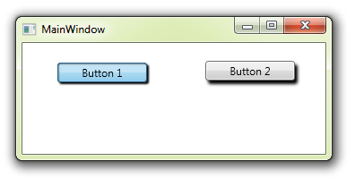

# Adding 3D Button Pressed Effect
## Requires
- Visual Studio 2010
## License
- Apache License, Version 2.0
## Technologies
- WPF
- XAML
## Topics
- XAML Styles
- WPF Styling
- WPF Animation
- ToggleButton
- 3D effects
- Pressed effect
- Property Triggers
## Updated
- 09/19/2012
## Description

<h1>Introduction</h1>

This sample is in response to a <a href="http://social.msdn.microsoft.com/Forums/en/wpf/thread/04dce23e-37a2-4ff0-bdc6-5c61020d15e8">
request for the best way to encapsulate a &quot;3d pressed&quot; effect</a> for a button on the WPF forums.

&nbsp;

&nbsp;

<h1>Building the Sample</h1>

Just download, unzip, open and run!

&nbsp;

<h1>Description</h1>

This example is in response to a <a href="http://social.msdn.microsoft.com/Forums/en/wpf/thread/04dce23e-37a2-4ff0-bdc6-5c61020d15e8">
forum question</a> where the poster wanted to encapsulate the &quot;3D pressed&quot; behaviour into something that was reusable, instead of using the parent page's Visual State Manaager to crerate animations for evrey single button.

In this sample, to create the 3D effect, a shaded effect is added to the template for a ToggleButton.

&nbsp;

XAML

Edit|Remove

xaml

<pre class="js">&lt;Microsoft_Windows_Themes:ButtonChrome.Effect&gt;&nbsp;
&nbsp;&nbsp;&nbsp;&nbsp;&lt;DropShadowEffect/&gt;&nbsp;
&lt;/Microsoft_Windows_Themes:ButtonChrome.Effect&gt;</pre>

&nbsp;

&nbsp;

We then add a Property Trigger to the Control Template, which triggers an animation.

&nbsp;

XAML

Edit|Remove

xaml

<pre class="js">&lt;Trigger&nbsp;Property=&quot;IsChecked&quot;&nbsp;Value=&quot;True&quot;&gt;&nbsp;
&nbsp;&nbsp;&nbsp;&nbsp;&lt;Trigger.ExitActions&gt;&nbsp;
&nbsp;&nbsp;&nbsp;&nbsp;&nbsp;&nbsp;&nbsp;&nbsp;&lt;StopStoryboard&nbsp;BeginStoryboardName=&quot;Storyboard1_BeginStoryboard&quot;/&gt;&nbsp;
&nbsp;&nbsp;&nbsp;&nbsp;&lt;/Trigger.ExitActions&gt;&nbsp;
&nbsp;&nbsp;&nbsp;&nbsp;&lt;Trigger.EnterActions&gt;&nbsp;
&nbsp;&nbsp;&nbsp;&nbsp;&nbsp;&nbsp;&nbsp;&nbsp;&lt;BeginStoryboard&nbsp;x:Name=&quot;Storyboard1_BeginStoryboard&quot;&nbsp;Storyboard=&quot;{StaticResource&nbsp;Storyboard1}&quot;/&gt;&nbsp;
&nbsp;&nbsp;&nbsp;&nbsp;&lt;/Trigger.EnterActions&gt;&nbsp;
&lt;/Trigger&gt;</pre>

&nbsp;

The animation in this sample simply&nbsp;reduces the depth of the shadow and moves the button slightly, to give the effect of a button being pressed.

&nbsp;

&nbsp;

XAML

Edit|Remove

xaml

<pre class="js">&lt;ControlTemplate.Resources&gt;&nbsp;
&nbsp;&nbsp;&nbsp;&nbsp;&lt;Storyboard&nbsp;x:Key=&quot;Storyboard1&quot;&gt;&nbsp;
&nbsp;&nbsp;&nbsp;&nbsp;&nbsp;&nbsp;&nbsp;&nbsp;&lt;DoubleAnimationUsingKeyFrames&nbsp;Storyboard.TargetProperty=&quot;(UIElement.Effect).(DropShadowEffect.BlurRadius)&quot;&nbsp;Storyboard.TargetName=&quot;Chrome&quot;&gt;&nbsp;
&nbsp;&nbsp;&nbsp;&nbsp;&nbsp;&nbsp;&nbsp;&nbsp;&nbsp;&nbsp;&nbsp;&nbsp;&lt;EasingDoubleKeyFrame&nbsp;KeyTime=&quot;0&quot;&nbsp;Value=&quot;3&quot;/&gt;&nbsp;
&nbsp;&nbsp;&nbsp;&nbsp;&nbsp;&nbsp;&nbsp;&nbsp;&lt;/DoubleAnimationUsingKeyFrames&gt;&nbsp;
&nbsp;&nbsp;&nbsp;&nbsp;&nbsp;&nbsp;&nbsp;&nbsp;&lt;DoubleAnimationUsingKeyFrames&nbsp;Storyboard.TargetProperty=&quot;(UIElement.RenderTransform).(TransformGroup.Children)[3].(TranslateTransform.X)&quot;&nbsp;Storyboard.TargetName=&quot;Chrome&quot;&gt;&nbsp;
&nbsp;&nbsp;&nbsp;&nbsp;&nbsp;&nbsp;&nbsp;&nbsp;&nbsp;&nbsp;&nbsp;&nbsp;&lt;EasingDoubleKeyFrame&nbsp;KeyTime=&quot;0&quot;&nbsp;Value=&quot;4&quot;/&gt;&nbsp;
&nbsp;&nbsp;&nbsp;&nbsp;&nbsp;&nbsp;&nbsp;&nbsp;&lt;/DoubleAnimationUsingKeyFrames&gt;&nbsp;
&nbsp;&nbsp;&nbsp;&nbsp;&nbsp;&nbsp;&nbsp;&nbsp;&lt;DoubleAnimationUsingKeyFrames&nbsp;Storyboard.TargetProperty=&quot;(UIElement.RenderTransform).(TransformGroup.Children)[3].(TranslateTransform.Y)&quot;&nbsp;Storyboard.TargetName=&quot;Chrome&quot;&gt;&nbsp;
&nbsp;&nbsp;&nbsp;&nbsp;&nbsp;&nbsp;&nbsp;&nbsp;&nbsp;&nbsp;&nbsp;&nbsp;&lt;EasingDoubleKeyFrame&nbsp;KeyTime=&quot;0&quot;&nbsp;Value=&quot;2&quot;/&gt;&nbsp;
&nbsp;&nbsp;&nbsp;&nbsp;&nbsp;&nbsp;&nbsp;&nbsp;&lt;/DoubleAnimationUsingKeyFrames&gt;&nbsp;
&nbsp;&nbsp;&nbsp;&nbsp;&nbsp;&nbsp;&nbsp;&nbsp;&lt;DoubleAnimationUsingKeyFrames&nbsp;Storyboard.TargetProperty=&quot;(UIElement.Effect).(DropShadowEffect.ShadowDepth)&quot;&nbsp;Storyboard.TargetName=&quot;Chrome&quot;&gt;&nbsp;
&nbsp;&nbsp;&nbsp;&nbsp;&nbsp;&nbsp;&nbsp;&nbsp;&nbsp;&nbsp;&nbsp;&nbsp;&lt;EasingDoubleKeyFrame&nbsp;KeyTime=&quot;0&quot;&nbsp;Value=&quot;3&quot;/&gt;&nbsp;
&nbsp;&nbsp;&nbsp;&nbsp;&nbsp;&nbsp;&nbsp;&nbsp;&lt;/DoubleAnimationUsingKeyFrames&gt;&nbsp;
&nbsp;&nbsp;&nbsp;&nbsp;&lt;/Storyboard&gt;&nbsp;
&lt;/ControlTemplate.Resources&gt;</pre>

&nbsp;

This style, with the animated behaviour can then be used on any button in the application, by assigning the style as follows:

XAML

Edit|Remove

xaml

<pre class="js">&lt;ToggleButton&nbsp;Content=&quot;Button&nbsp;1&quot;&nbsp;Width=&quot;100&quot;&nbsp;VerticalAlignment=&quot;Center&quot;&nbsp;Style=&quot;{DynamicResource&nbsp;ToggleButtonStyle1}&quot;&nbsp;/&gt;</pre>

&nbsp;

If you wanted to group these ToggleButtons together to act as RadioButtons, please see
<strong><a href="http://code.msdn.microsoft.com/Grouping-ToggleButtons-and-aa4838e7">this other sample project</a></strong>.

Creating animations and triggers and encapsulating them into a style or control template&nbsp;is very simple with Microsoft's Expression Blend.

You simply place a button on the page, right click the Button, &quot;Edit style&quot; / &quot;Edit a copy&quot; to get the style and control template. then you can add the shadow, and the trigger.

Blend will automatically create the animation and record your changes like shadow depth and TranslateTransform.

&nbsp;

&nbsp;

