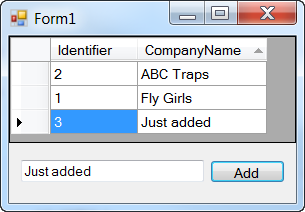

# Adding new records into SQL-Server table and update a DataGridView in real time
## Requires
- Visual Studio 2013
## License
- Apache License, Version 2.0
## Technologies
- SQL
- SQL Server
## Topics
- C#
- SQL Server
- Data Access
- VB.Net
- data and storage
## Updated
- 08/30/2014
## Description

<h1>Description</h1>

This article demonstrates how to add new rows to a Microsoft SQL-Server database table and retrieve the new key while doing the insert via a command with two SQL statements where all operations are done without Visual Studio
 IDE data wizards.

A well designed solution will separate database operations from the user interface thus all data operations are done in a class within the same project.

For preparation I load up a DataGridView with three records, two fields, the primary key (which we pretty much never show in real apps) and a text field. Once the form is up you then enter some text into the TextBox and press
 the Add button. We first validate there has been data entered into the TextBox followed by calling a function which opens a connection to the database then executes the INSERT INTO and a SELECT statement for obtaining the new primary key. If the operation
 succeeds the new primary key value is returned to the caller then we add a new row to the DataSource of a
<a href="http://msdn.microsoft.com/en-us/library/system.windows.forms.bindingsource(v=vs.110).aspx" target="_blank">
BindingSource</a> which is the DataSource of our DataGridView. Finally we move to the new record using the BindingSource Find method which returns a numeric that is then used to re-position to the correct row via BindingSource Position property.

Rather than rewrite what has already been written see the following for alternates to how I have added the new record and obtained the new primary key.
<a href="http://technet.microsoft.com/en-us/library/aa259185(v=sql.80).aspx">MSDN SQL-Server SCOPE_IDENTITY</a>.

If the primary key is not setup properly than this method demostrated here will fail with or without an exception.

<ul>
<li>Primary Key = True </li><li>Allow Nulls = False </li><li>Identity = True </li></ul>

For doing this in MS-Access we are not fortunate to use the same two SQL statements together&nbsp;as done here, see
<a href="http://code.msdn.microsoft.com/Adding-new-records-into-53ce3eb1">Adding new records into Microsoft Access tables and display in a DataGridView</a> for how to do this in MS-Access.&nbsp;&nbsp;&nbsp;

&nbsp;

<strong>IMPORTANT&nbsp;</strong>

The database used here is in the project folder and with each run of the app the database&nbsp;is copied fresh to the Bin\Debug folder. This means if you add a record, stop the app and run again only two rows show as we overwrote
 the database. To prevent this select the database in Solution Explorer, select Copy to output folder and use Copy If newer.&nbsp;&nbsp;

<strong>IMPORTANT</strong>

The Solution is in VS2013 but all projects within will work with VS2010 or VS2012 by changing the Framework.

&nbsp;

C#Visual Basic

Edit|Remove

csharpvb

<pre class="csharp">using&nbsp;System;&nbsp;
using&nbsp;<a class="libraryLink" href="http://msdn.microsoft.com/en-US/library/System.Data.aspx" target="_blank" title="Auto generated link to System.Data">System.Data</a>;&nbsp;
using&nbsp;<a class="libraryLink" href="http://msdn.microsoft.com/en-US/library/System.Data.SqlClient.aspx" target="_blank" title="Auto generated link to System.Data.SqlClient">System.Data.SqlClient</a>;&nbsp;
&nbsp;
namespace&nbsp;WindowsFormsApplication1&nbsp;
{&nbsp;
&nbsp;&nbsp;&nbsp;&nbsp;internal&nbsp;class&nbsp;DataOperations&nbsp;
&nbsp;&nbsp;&nbsp;&nbsp;{&nbsp;
&nbsp;&nbsp;&nbsp;&nbsp;&nbsp;&nbsp;&nbsp;&nbsp;private&nbsp;DataTable&nbsp;CustomerDataTable;&nbsp;
&nbsp;
&nbsp;&nbsp;&nbsp;&nbsp;&nbsp;&nbsp;&nbsp;&nbsp;public&nbsp;DataTable&nbsp;GetCustomers()&nbsp;
&nbsp;&nbsp;&nbsp;&nbsp;&nbsp;&nbsp;&nbsp;&nbsp;{&nbsp;
&nbsp;&nbsp;&nbsp;&nbsp;&nbsp;&nbsp;&nbsp;&nbsp;&nbsp;&nbsp;&nbsp;&nbsp;return&nbsp;CustomerDataTable;&nbsp;
&nbsp;&nbsp;&nbsp;&nbsp;&nbsp;&nbsp;&nbsp;&nbsp;}&nbsp;
&nbsp;
&nbsp;&nbsp;&nbsp;&nbsp;&nbsp;&nbsp;&nbsp;&nbsp;public&nbsp;DataOperations()&nbsp;
&nbsp;&nbsp;&nbsp;&nbsp;&nbsp;&nbsp;&nbsp;&nbsp;{&nbsp;
&nbsp;&nbsp;&nbsp;&nbsp;&nbsp;&nbsp;&nbsp;&nbsp;&nbsp;&nbsp;&nbsp;&nbsp;this.CustomerDataTable&nbsp;=&nbsp;new&nbsp;DataTable();&nbsp;
&nbsp;&nbsp;&nbsp;&nbsp;&nbsp;&nbsp;&nbsp;&nbsp;&nbsp;&nbsp;&nbsp;&nbsp;using&nbsp;(SqlConnection&nbsp;cn&nbsp;=&nbsp;new&nbsp;SqlConnection&nbsp;{&nbsp;ConnectionString&nbsp;=&nbsp;Properties.Settings.Default.ConnectionString&nbsp;})&nbsp;
&nbsp;&nbsp;&nbsp;&nbsp;&nbsp;&nbsp;&nbsp;&nbsp;&nbsp;&nbsp;&nbsp;&nbsp;{&nbsp;
&nbsp;&nbsp;&nbsp;&nbsp;&nbsp;&nbsp;&nbsp;&nbsp;&nbsp;&nbsp;&nbsp;&nbsp;&nbsp;&nbsp;&nbsp;&nbsp;using&nbsp;(SqlCommand&nbsp;cmd&nbsp;=&nbsp;new&nbsp;SqlCommand&nbsp;{&nbsp;Connection&nbsp;=&nbsp;cn&nbsp;})&nbsp;
&nbsp;&nbsp;&nbsp;&nbsp;&nbsp;&nbsp;&nbsp;&nbsp;&nbsp;&nbsp;&nbsp;&nbsp;&nbsp;&nbsp;&nbsp;&nbsp;{&nbsp;
&nbsp;&nbsp;&nbsp;&nbsp;&nbsp;&nbsp;&nbsp;&nbsp;&nbsp;&nbsp;&nbsp;&nbsp;&nbsp;&nbsp;&nbsp;&nbsp;&nbsp;&nbsp;&nbsp;&nbsp;cmd.CommandText&nbsp;=&nbsp;&quot;SELECT&nbsp;Identifier,&nbsp;CompanyName&nbsp;FROM&nbsp;[Customer]&quot;;&nbsp;
&nbsp;&nbsp;&nbsp;&nbsp;&nbsp;&nbsp;&nbsp;&nbsp;&nbsp;&nbsp;&nbsp;&nbsp;&nbsp;&nbsp;&nbsp;&nbsp;&nbsp;&nbsp;&nbsp;&nbsp;cn.Open();&nbsp;
&nbsp;&nbsp;&nbsp;&nbsp;&nbsp;&nbsp;&nbsp;&nbsp;&nbsp;&nbsp;&nbsp;&nbsp;&nbsp;&nbsp;&nbsp;&nbsp;&nbsp;&nbsp;&nbsp;&nbsp;this.CustomerDataTable.Load(cmd.ExecuteReader());&nbsp;
&nbsp;&nbsp;&nbsp;&nbsp;&nbsp;&nbsp;&nbsp;&nbsp;&nbsp;&nbsp;&nbsp;&nbsp;&nbsp;&nbsp;&nbsp;&nbsp;}&nbsp;
&nbsp;&nbsp;&nbsp;&nbsp;&nbsp;&nbsp;&nbsp;&nbsp;&nbsp;&nbsp;&nbsp;&nbsp;}&nbsp;
&nbsp;&nbsp;&nbsp;&nbsp;&nbsp;&nbsp;&nbsp;&nbsp;}&nbsp;
&nbsp;
&nbsp;&nbsp;&nbsp;&nbsp;&nbsp;&nbsp;&nbsp;&nbsp;public&nbsp;bool&nbsp;AddNewCustomer(string&nbsp;Name,&nbsp;ref&nbsp;int&nbsp;NewIdentifier)&nbsp;
&nbsp;&nbsp;&nbsp;&nbsp;&nbsp;&nbsp;&nbsp;&nbsp;{&nbsp;
&nbsp;&nbsp;&nbsp;&nbsp;&nbsp;&nbsp;&nbsp;&nbsp;&nbsp;&nbsp;&nbsp;&nbsp;using&nbsp;(SqlConnection&nbsp;cn&nbsp;=&nbsp;new&nbsp;SqlConnection&nbsp;{&nbsp;ConnectionString&nbsp;=&nbsp;Properties.Settings.Default.ConnectionString&nbsp;})&nbsp;
&nbsp;&nbsp;&nbsp;&nbsp;&nbsp;&nbsp;&nbsp;&nbsp;&nbsp;&nbsp;&nbsp;&nbsp;{&nbsp;
&nbsp;&nbsp;&nbsp;&nbsp;&nbsp;&nbsp;&nbsp;&nbsp;&nbsp;&nbsp;&nbsp;&nbsp;&nbsp;&nbsp;&nbsp;&nbsp;using&nbsp;(SqlCommand&nbsp;cmd&nbsp;=&nbsp;new&nbsp;SqlCommand&nbsp;{&nbsp;Connection&nbsp;=&nbsp;cn&nbsp;})&nbsp;
&nbsp;&nbsp;&nbsp;&nbsp;&nbsp;&nbsp;&nbsp;&nbsp;&nbsp;&nbsp;&nbsp;&nbsp;&nbsp;&nbsp;&nbsp;&nbsp;{&nbsp;
&nbsp;&nbsp;&nbsp;&nbsp;&nbsp;&nbsp;&nbsp;&nbsp;&nbsp;&nbsp;&nbsp;&nbsp;&nbsp;&nbsp;&nbsp;&nbsp;&nbsp;&nbsp;&nbsp;&nbsp;cmd.CommandText&nbsp;=&nbsp;&quot;INSERT&nbsp;INTO&nbsp;[Customer]&nbsp;(CompanyName)&nbsp;VALUES&nbsp;(@CompanyName);&nbsp;SELECT&nbsp;CAST(scope_identity()&nbsp;AS&nbsp;int);&quot;;&nbsp;
&nbsp;&nbsp;&nbsp;&nbsp;&nbsp;&nbsp;&nbsp;&nbsp;&nbsp;&nbsp;&nbsp;&nbsp;&nbsp;&nbsp;&nbsp;&nbsp;&nbsp;&nbsp;&nbsp;&nbsp;cmd.Parameters.AddWithValue(&quot;@CompanyName&quot;,&nbsp;Name);&nbsp;
&nbsp;&nbsp;&nbsp;&nbsp;&nbsp;&nbsp;&nbsp;&nbsp;&nbsp;&nbsp;&nbsp;&nbsp;&nbsp;&nbsp;&nbsp;&nbsp;&nbsp;&nbsp;&nbsp;&nbsp;cn.Open();&nbsp;
&nbsp;&nbsp;&nbsp;&nbsp;&nbsp;&nbsp;&nbsp;&nbsp;&nbsp;&nbsp;&nbsp;&nbsp;&nbsp;&nbsp;&nbsp;&nbsp;&nbsp;&nbsp;&nbsp;&nbsp;try&nbsp;
&nbsp;&nbsp;&nbsp;&nbsp;&nbsp;&nbsp;&nbsp;&nbsp;&nbsp;&nbsp;&nbsp;&nbsp;&nbsp;&nbsp;&nbsp;&nbsp;&nbsp;&nbsp;&nbsp;&nbsp;{&nbsp;
&nbsp;&nbsp;&nbsp;&nbsp;&nbsp;&nbsp;&nbsp;&nbsp;&nbsp;&nbsp;&nbsp;&nbsp;&nbsp;&nbsp;&nbsp;&nbsp;&nbsp;&nbsp;&nbsp;&nbsp;&nbsp;&nbsp;&nbsp;&nbsp;NewIdentifier&nbsp;=&nbsp;Convert.ToInt32(cmd.ExecuteScalar());&nbsp;
&nbsp;&nbsp;&nbsp;&nbsp;&nbsp;&nbsp;&nbsp;&nbsp;&nbsp;&nbsp;&nbsp;&nbsp;&nbsp;&nbsp;&nbsp;&nbsp;&nbsp;&nbsp;&nbsp;&nbsp;&nbsp;&nbsp;&nbsp;&nbsp;return&nbsp;true;&nbsp;
&nbsp;&nbsp;&nbsp;&nbsp;&nbsp;&nbsp;&nbsp;&nbsp;&nbsp;&nbsp;&nbsp;&nbsp;&nbsp;&nbsp;&nbsp;&nbsp;&nbsp;&nbsp;&nbsp;&nbsp;}&nbsp;
&nbsp;&nbsp;&nbsp;&nbsp;&nbsp;&nbsp;&nbsp;&nbsp;&nbsp;&nbsp;&nbsp;&nbsp;&nbsp;&nbsp;&nbsp;&nbsp;&nbsp;&nbsp;&nbsp;&nbsp;catch&nbsp;(Exception)&nbsp;
&nbsp;&nbsp;&nbsp;&nbsp;&nbsp;&nbsp;&nbsp;&nbsp;&nbsp;&nbsp;&nbsp;&nbsp;&nbsp;&nbsp;&nbsp;&nbsp;&nbsp;&nbsp;&nbsp;&nbsp;{&nbsp;
&nbsp;&nbsp;&nbsp;&nbsp;&nbsp;&nbsp;&nbsp;&nbsp;&nbsp;&nbsp;&nbsp;&nbsp;&nbsp;&nbsp;&nbsp;&nbsp;&nbsp;&nbsp;&nbsp;&nbsp;&nbsp;&nbsp;&nbsp;&nbsp;return&nbsp;false;&nbsp;
&nbsp;&nbsp;&nbsp;&nbsp;&nbsp;&nbsp;&nbsp;&nbsp;&nbsp;&nbsp;&nbsp;&nbsp;&nbsp;&nbsp;&nbsp;&nbsp;&nbsp;&nbsp;&nbsp;&nbsp;}&nbsp;
&nbsp;&nbsp;&nbsp;&nbsp;&nbsp;&nbsp;&nbsp;&nbsp;&nbsp;&nbsp;&nbsp;&nbsp;&nbsp;&nbsp;&nbsp;&nbsp;}&nbsp;
&nbsp;&nbsp;&nbsp;&nbsp;&nbsp;&nbsp;&nbsp;&nbsp;&nbsp;&nbsp;&nbsp;&nbsp;}&nbsp;
&nbsp;&nbsp;&nbsp;&nbsp;&nbsp;&nbsp;&nbsp;&nbsp;}&nbsp;
&nbsp;&nbsp;&nbsp;&nbsp;}&nbsp;
}</pre>

<h1><em>&nbsp;</em></h1>
