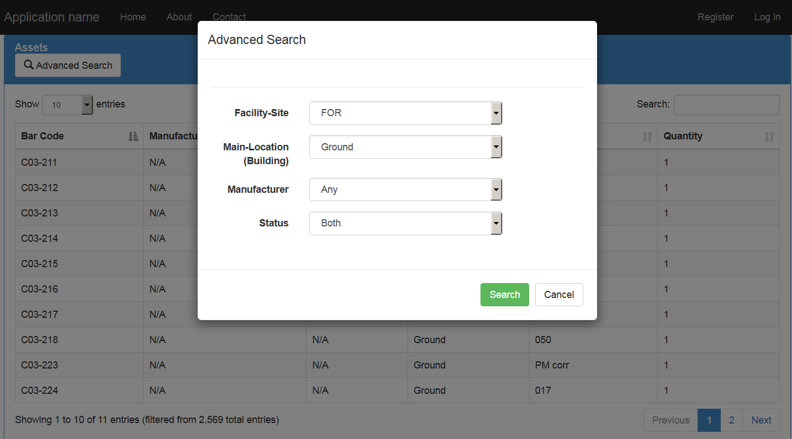

# Advanced Search using JQuery DataTables in ASP.NET MVC
## Requires
- Visual Studio 2015
## License
- MIT
## Technologies
- C#
- ASP.NET MVC
- Javascript
- Entity Framework
- ASP.NET MVC 5
- JQuery DataTables
## Topics
- C#
- ASP.NET MVC
- ASP.NET MVC 5
- JQuery DataTables
- Advanced Search
## Updated
- 06/20/2017
## Description

<h1>Introduction</h1>

<em><em>This sample demonstrates How to Implement <strong>Advanced Search</strong> Functionality in an existing
<strong>Grid </strong>using <strong>JQuery DataTables</strong> in <strong>ASP.NET MVC 5</strong></em></em>

<h1>Database Script</h1>

you can download the datbase script from <a href="https://www.codeproject.com/KB/aspnet/1170086/Sql_Script.zip">
this link location</a>.

&nbsp;

<h1>Building the Sample</h1>

<em><em>There is file named&nbsp;<strong>dbscript.txt,</strong>&nbsp;you would need to create database with reqired tables and some data in the tables using the script which can be found in the solution, and after that you will need to modify the connection
 string of the database in the&nbsp;<strong>web.config</strong>&nbsp;which will be used by
<strong>Entity Framework</strong> to query records :</em></em>

<em><em>&nbsp;</em></em>

<em><em>&nbsp;</em></em>

<em><em>&nbsp;</em></em>

<em><em>

C#

Edit|Remove

csharp

<pre class="csharp">&lt;add&nbsp;name=&quot;DefaultConnection&quot;&nbsp;connectionString=&quot;Data&nbsp;Source=(localdb)\MSSQLLocalDB;Initial&nbsp;Catalog=TrialAssignment-Joseph;Integrated&nbsp;Security=True;MultipleActiveResultSets=true&quot;&nbsp;providerName=&quot;System.Data.SqlClient&quot;&nbsp;/&gt;&nbsp;</pre>

&nbsp;

 
</em></em>

&nbsp;

&nbsp;

&nbsp;

Description

At the end of this post we will have a working grid with server side advanced search, pagination, filtering and sorting and after implementing all of this, our application will look like:

 

In<strong> Solution Explorer</strong>, Expand the&nbsp;<em>Views</em>&nbsp;folder, then again expand the&nbsp;<strong><em>Asset</em></strong>&nbsp;folder and open the&nbsp;<strong><em>Index.cshtml</em></strong>&nbsp;file,
 we will add the HTML for the Advanced Search button that will appear above the grid. Add the following HTML in the view:

&nbsp;

HTML

Edit|Remove

html

<pre class="html">&lt;buttontype=&quot;button&quot;class=&quot;btn&nbsp;btn-default&nbsp;btn-md&quot;data-toggle=&quot;modal&quot;data-target=&quot;#advancedSearchModal&quot;id=&quot;advancedsearch-button&quot;&gt;&nbsp;
&lt;spanclass=&quot;glyphicon&nbsp;glyphicon-search&quot;aria-hidden=&quot;true&quot;&gt;&lt;/span&gt;&nbsp;Advanced&nbsp;Search&nbsp;
&lt;/button&gt;</pre>

If you note, we have some new attributes in the button code, you don't need to worry that those are for bootstrap modal, as clicking the button will open a Modal dialog, and user would be able to select the search criteria
 and search for results. The&nbsp;<strong><code>data-toggle=&quot;modal&quot;</code></strong>&nbsp;attribute dictates that this button will toggle a Modal Dialog and&nbsp;<strong><code>data-target=&quot;#advancedSearchModal&quot;</code></strong>&nbsp;specifies
 the HTML element of the page which would be displayed as Modal Dialog. 
After adding the above HTML code in the&nbsp;<strong><em>Index.cshtml</em></strong>, the view will have the following code in it:

HTML

Edit|Remove

html

<pre class="html">&lt;divclass=&quot;row&quot;&gt;&nbsp;
&lt;divclass=&quot;col-md-12&quot;&gt;&nbsp;
&lt;divclass=&quot;panel&nbsp;panel-primary&nbsp;list-panel&quot;id=&quot;list-panel&quot;&gt;&nbsp;
&lt;divclass=&quot;panel-heading&nbsp;list-panel-heading&quot;&gt;&nbsp;
&lt;h1class=&quot;panel-title&nbsp;list-panel-title&quot;&gt;Assets&lt;/h1&gt;&lt;buttontype=&quot;button&quot;class=&quot;btn&nbsp;btn-default&nbsp;btn-md&quot;data-toggle=&quot;modal&quot;data-target=&quot;#advancedSearchModal&quot;id=&quot;advancedsearch-button&quot;&gt;&nbsp;
&lt;spanclass=&quot;glyphicon&nbsp;glyphicon-search&quot;aria-hidden=&quot;true&quot;&gt;&lt;/span&gt;&nbsp;Advanced&nbsp;Search&nbsp;
&nbsp;&nbsp;&nbsp;&nbsp;&nbsp;&nbsp;&nbsp;&nbsp;&nbsp;&nbsp;&nbsp;&nbsp;&nbsp;&nbsp;&nbsp;&nbsp;&lt;/button&gt;&lt;/div&gt;&lt;divclass=&quot;panel-body&quot;&gt;&nbsp;
&lt;tableid=&quot;assets-data-table&quot;class=&quot;table&nbsp;table-striped&nbsp;table-bordered&quot;style=&quot;width:100%;&quot;&gt;&nbsp;
&lt;/table&gt;&lt;/div&gt;&lt;/div&gt;&lt;/div&gt;&lt;/div&gt;&nbsp;
&nbsp;
@section&nbsp;Scripts&nbsp;
{&nbsp;&nbsp;&nbsp;&nbsp;&nbsp;
&lt;scripttype=&quot;text/javascript&quot;&gt;var&nbsp;assetListVM;&nbsp;
&nbsp;&nbsp;&nbsp;&nbsp;&nbsp;&nbsp;&nbsp;&nbsp;$(function&nbsp;()&nbsp;{&nbsp;
&nbsp;&nbsp;&nbsp;&nbsp;&nbsp;&nbsp;&nbsp;&nbsp;&nbsp;&nbsp;&nbsp;&nbsp;assetListVM&nbsp;=&nbsp;{&nbsp;
&nbsp;&nbsp;&nbsp;&nbsp;&nbsp;&nbsp;&nbsp;&nbsp;&nbsp;&nbsp;&nbsp;&nbsp;&nbsp;&nbsp;&nbsp;&nbsp;dt:&nbsp;null,&nbsp;
&nbsp;
&nbsp;&nbsp;&nbsp;&nbsp;&nbsp;&nbsp;&nbsp;&nbsp;&nbsp;&nbsp;&nbsp;&nbsp;&nbsp;&nbsp;&nbsp;&nbsp;init:&nbsp;function&nbsp;()&nbsp;{&nbsp;
&nbsp;&nbsp;&nbsp;&nbsp;&nbsp;&nbsp;&nbsp;&nbsp;&nbsp;&nbsp;&nbsp;&nbsp;&nbsp;&nbsp;&nbsp;&nbsp;&nbsp;&nbsp;&nbsp;&nbsp;dt&nbsp;=&nbsp;$('#assets-data-table').DataTable({&quot;serverSide&quot;:&nbsp;true,&nbsp;
&nbsp;&nbsp;&nbsp;&nbsp;&nbsp;&nbsp;&nbsp;&nbsp;&nbsp;&nbsp;&nbsp;&nbsp;&nbsp;&nbsp;&nbsp;&nbsp;&nbsp;&nbsp;&nbsp;&nbsp;&nbsp;&nbsp;&nbsp;&nbsp;&quot;processing&quot;:&nbsp;true,&nbsp;
&nbsp;&nbsp;&nbsp;&nbsp;&nbsp;&nbsp;&nbsp;&nbsp;&nbsp;&nbsp;&nbsp;&nbsp;&nbsp;&nbsp;&nbsp;&nbsp;&nbsp;&nbsp;&nbsp;&nbsp;&nbsp;&nbsp;&nbsp;&nbsp;&quot;ajax&quot;:&nbsp;{&quot;url&quot;:&nbsp;&nbsp;
&nbsp;&nbsp;&nbsp;&nbsp;&nbsp;&nbsp;&nbsp;&nbsp;&nbsp;&nbsp;&nbsp;&nbsp;&nbsp;&nbsp;&nbsp;&nbsp;&nbsp;&nbsp;&nbsp;&nbsp;&nbsp;&nbsp;&nbsp;&nbsp;&nbsp;&nbsp;&nbsp;&nbsp;&quot;@Url.Action(&quot;Get&quot;,&quot;Asset&quot;)&quot;},&nbsp;
&nbsp;&nbsp;&nbsp;&nbsp;&nbsp;&nbsp;&nbsp;&nbsp;&nbsp;&nbsp;&nbsp;&nbsp;&nbsp;&nbsp;&nbsp;&nbsp;&nbsp;&nbsp;&nbsp;&nbsp;&nbsp;&nbsp;&nbsp;&nbsp;&quot;columns&quot;:&nbsp;[&nbsp;
&nbsp;&nbsp;&nbsp;&nbsp;&nbsp;&nbsp;&nbsp;&nbsp;&nbsp;&nbsp;&nbsp;&nbsp;&nbsp;&nbsp;&nbsp;&nbsp;&nbsp;&nbsp;&nbsp;&nbsp;&nbsp;&nbsp;&nbsp;&nbsp;&nbsp;&nbsp;&nbsp;&nbsp;{&quot;title&quot;:&nbsp;&quot;Bar&nbsp;Code&quot;,&nbsp;&nbsp;
&nbsp;&nbsp;&nbsp;&nbsp;&nbsp;&nbsp;&nbsp;&nbsp;&nbsp;&nbsp;&nbsp;&nbsp;&nbsp;&nbsp;&nbsp;&nbsp;&nbsp;&nbsp;&nbsp;&nbsp;&nbsp;&nbsp;&nbsp;&nbsp;&nbsp;&nbsp;&nbsp;&nbsp;&quot;data&quot;:&nbsp;&quot;BarCode&quot;,&nbsp;&quot;searchable&quot;:&nbsp;true&nbsp;},&nbsp;
&nbsp;&nbsp;&nbsp;&nbsp;&nbsp;&nbsp;&nbsp;&nbsp;&nbsp;&nbsp;&nbsp;&nbsp;&nbsp;&nbsp;&nbsp;&nbsp;&nbsp;&nbsp;&nbsp;&nbsp;&nbsp;&nbsp;&nbsp;&nbsp;&nbsp;&nbsp;&nbsp;&nbsp;{&quot;title&quot;:&nbsp;&quot;Manufacturer&quot;,&nbsp;&nbsp;
&nbsp;&nbsp;&nbsp;&nbsp;&nbsp;&nbsp;&nbsp;&nbsp;&nbsp;&nbsp;&nbsp;&nbsp;&nbsp;&nbsp;&nbsp;&nbsp;&nbsp;&nbsp;&nbsp;&nbsp;&nbsp;&nbsp;&nbsp;&nbsp;&nbsp;&nbsp;&nbsp;&nbsp;&quot;data&quot;:&nbsp;&quot;Manufacturer&quot;,&nbsp;&quot;searchable&quot;:&nbsp;true&nbsp;},&nbsp;
&nbsp;&nbsp;&nbsp;&nbsp;&nbsp;&nbsp;&nbsp;&nbsp;&nbsp;&nbsp;&nbsp;&nbsp;&nbsp;&nbsp;&nbsp;&nbsp;&nbsp;&nbsp;&nbsp;&nbsp;&nbsp;&nbsp;&nbsp;&nbsp;&nbsp;&nbsp;&nbsp;&nbsp;{&quot;title&quot;:&nbsp;&quot;Model&quot;,&nbsp;&nbsp;
&nbsp;&nbsp;&nbsp;&nbsp;&nbsp;&nbsp;&nbsp;&nbsp;&nbsp;&nbsp;&nbsp;&nbsp;&nbsp;&nbsp;&nbsp;&nbsp;&nbsp;&nbsp;&nbsp;&nbsp;&nbsp;&nbsp;&nbsp;&nbsp;&nbsp;&nbsp;&nbsp;&nbsp;&quot;data&quot;:&nbsp;&quot;ModelNumber&quot;,&nbsp;&nbsp;
&nbsp;&nbsp;&nbsp;&nbsp;&nbsp;&nbsp;&nbsp;&nbsp;&nbsp;&nbsp;&nbsp;&nbsp;&nbsp;&nbsp;&nbsp;&nbsp;&nbsp;&nbsp;&nbsp;&nbsp;&nbsp;&nbsp;&nbsp;&nbsp;&nbsp;&nbsp;&nbsp;&nbsp;&quot;searchable&quot;:&nbsp;true&nbsp;},&nbsp;
&nbsp;&nbsp;&nbsp;&nbsp;&nbsp;&nbsp;&nbsp;&nbsp;&nbsp;&nbsp;&nbsp;&nbsp;&nbsp;&nbsp;&nbsp;&nbsp;&nbsp;&nbsp;&nbsp;&nbsp;&nbsp;&nbsp;&nbsp;&nbsp;&nbsp;&nbsp;&nbsp;&nbsp;{&quot;title&quot;:&nbsp;&quot;Building&quot;,&nbsp;&nbsp;
&nbsp;&nbsp;&nbsp;&nbsp;&nbsp;&nbsp;&nbsp;&nbsp;&nbsp;&nbsp;&nbsp;&nbsp;&nbsp;&nbsp;&nbsp;&nbsp;&nbsp;&nbsp;&nbsp;&nbsp;&nbsp;&nbsp;&nbsp;&nbsp;&nbsp;&nbsp;&nbsp;&nbsp;&quot;data&quot;:&nbsp;&quot;Building&quot;,&nbsp;&nbsp;
&nbsp;&nbsp;&nbsp;&nbsp;&nbsp;&nbsp;&nbsp;&nbsp;&nbsp;&nbsp;&nbsp;&nbsp;&nbsp;&nbsp;&nbsp;&nbsp;&nbsp;&nbsp;&nbsp;&nbsp;&nbsp;&nbsp;&nbsp;&nbsp;&nbsp;&nbsp;&nbsp;&nbsp;&quot;searchable&quot;:&nbsp;true&nbsp;},&nbsp;
&nbsp;&nbsp;&nbsp;&nbsp;&nbsp;&nbsp;&nbsp;&nbsp;&nbsp;&nbsp;&nbsp;&nbsp;&nbsp;&nbsp;&nbsp;&nbsp;&nbsp;&nbsp;&nbsp;&nbsp;&nbsp;&nbsp;&nbsp;&nbsp;&nbsp;&nbsp;&nbsp;&nbsp;{&quot;title&quot;:&nbsp;&quot;Room&nbsp;No&quot;,&nbsp;&nbsp;
&nbsp;&nbsp;&nbsp;&nbsp;&nbsp;&nbsp;&nbsp;&nbsp;&nbsp;&nbsp;&nbsp;&nbsp;&nbsp;&nbsp;&nbsp;&nbsp;&nbsp;&nbsp;&nbsp;&nbsp;&nbsp;&nbsp;&nbsp;&nbsp;&nbsp;&nbsp;&nbsp;&nbsp;&quot;data&quot;:&nbsp;&quot;RoomNo&quot;},&nbsp;
&nbsp;&nbsp;&nbsp;&nbsp;&nbsp;&nbsp;&nbsp;&nbsp;&nbsp;&nbsp;&nbsp;&nbsp;&nbsp;&nbsp;&nbsp;&nbsp;&nbsp;&nbsp;&nbsp;&nbsp;&nbsp;&nbsp;&nbsp;&nbsp;&nbsp;&nbsp;&nbsp;&nbsp;{&quot;title&quot;:&nbsp;&quot;Quantity&quot;,&nbsp;&nbsp;
&nbsp;&nbsp;&nbsp;&nbsp;&nbsp;&nbsp;&nbsp;&nbsp;&nbsp;&nbsp;&nbsp;&nbsp;&nbsp;&nbsp;&nbsp;&nbsp;&nbsp;&nbsp;&nbsp;&nbsp;&nbsp;&nbsp;&nbsp;&nbsp;&nbsp;&nbsp;&nbsp;&nbsp;&quot;data&quot;:&nbsp;&quot;Quantity&quot;}&nbsp;
&nbsp;&nbsp;&nbsp;&nbsp;&nbsp;&nbsp;&nbsp;&nbsp;&nbsp;&nbsp;&nbsp;&nbsp;&nbsp;&nbsp;&nbsp;&nbsp;&nbsp;&nbsp;&nbsp;&nbsp;&nbsp;&nbsp;&nbsp;&nbsp;],&nbsp;
&nbsp;&nbsp;&nbsp;&nbsp;&nbsp;&nbsp;&nbsp;&nbsp;&nbsp;&nbsp;&nbsp;&nbsp;&nbsp;&nbsp;&nbsp;&nbsp;&nbsp;&nbsp;&nbsp;&nbsp;&nbsp;&nbsp;&nbsp;&nbsp;&quot;lengthMenu&quot;:&nbsp;[[10,&nbsp;25,&nbsp;50,&nbsp;100],&nbsp;[10,&nbsp;25,&nbsp;50,&nbsp;100]],&nbsp;
&nbsp;&nbsp;&nbsp;&nbsp;&nbsp;&nbsp;&nbsp;&nbsp;&nbsp;&nbsp;&nbsp;&nbsp;&nbsp;&nbsp;&nbsp;&nbsp;&nbsp;&nbsp;&nbsp;&nbsp;});&nbsp;
&nbsp;&nbsp;&nbsp;&nbsp;&nbsp;&nbsp;&nbsp;&nbsp;&nbsp;&nbsp;&nbsp;&nbsp;&nbsp;&nbsp;&nbsp;&nbsp;}}//&nbsp;initialize&nbsp;the&nbsp;datatables&nbsp;
&nbsp;&nbsp;&nbsp;&nbsp;&nbsp;&nbsp;&nbsp;&nbsp;&nbsp;&nbsp;&nbsp;&nbsp;assetListVM.init();&nbsp;
&nbsp;
&nbsp;&nbsp;&nbsp;&nbsp;&nbsp;&nbsp;&nbsp;&nbsp;});&nbsp;
&nbsp;
&lt;/script&gt;&nbsp;&nbsp;&nbsp;&nbsp;&nbsp;
&nbsp;}</pre>

We will also need to create a&nbsp;<code>ViewModel</code>&nbsp;class which will be used for posting the search criteria to server side which will be controller action for performing the search. Let's add the&nbsp;<code>ViewModel</code>&nbsp;then.
 Following is the code for the&nbsp;<strong><code>AdvancedSearchViewModel</code>&nbsp;</strong>class:

C#

Edit|Remove

csharp

<pre class="csharp">using&nbsp;System;&nbsp;
using&nbsp;<a class="libraryLink" href="https://msdn.microsoft.com/en-US/library/System.ComponentModel.DataAnnotations.aspx" target="_blank" title="Auto generated link to System.ComponentModel.DataAnnotations">System.ComponentModel.DataAnnotations</a>;&nbsp;
using&nbsp;<a class="libraryLink" href="https://msdn.microsoft.com/en-US/library/System.Web.Mvc.aspx" target="_blank" title="Auto generated link to System.Web.Mvc">System.Web.Mvc</a>;&nbsp;
&nbsp;
namespace&nbsp;GridExampleMVC.Models&nbsp;
{&nbsp;
&nbsp;publicclass&nbsp;AdvancedSearchViewModel&nbsp;
&nbsp;{&nbsp;
&nbsp;[Display(Name&nbsp;=&nbsp;&quot;Facility-Site&quot;)]&nbsp;
&nbsp;public&nbsp;Guid&nbsp;FacilitySite&nbsp;{&nbsp;get;&nbsp;set;&nbsp;}&nbsp;
&nbsp;
&nbsp;[Display(Name&nbsp;=&nbsp;&quot;Main-Location&nbsp;(Building)&quot;)]&nbsp;
&nbsp;publicstring&nbsp;Building&nbsp;{&nbsp;get;&nbsp;set;&nbsp;}&nbsp;
&nbsp;
&nbsp;publicstring&nbsp;Manufacturer&nbsp;{&nbsp;get;&nbsp;set;&nbsp;}&nbsp;
&nbsp;
&nbsp;publicstring&nbsp;Status&nbsp;{&nbsp;get;&nbsp;set;&nbsp;}&nbsp;
&nbsp;
&nbsp;public&nbsp;SelectList&nbsp;FacilitySiteList&nbsp;{&nbsp;get;&nbsp;set;&nbsp;}&nbsp;
&nbsp;public&nbsp;SelectList&nbsp;BuildingList&nbsp;{&nbsp;get;&nbsp;set;&nbsp;}&nbsp;
&nbsp;public&nbsp;SelectList&nbsp;ManufacturerList&nbsp;{&nbsp;get;&nbsp;set;&nbsp;}&nbsp;
&nbsp;public&nbsp;SelectList&nbsp;StatusList&nbsp;{&nbsp;get;&nbsp;set;&nbsp;}&nbsp;
&nbsp;}&nbsp;
}</pre>

Navigate to&nbsp;<strong><em>Controllers</em></strong>&nbsp;folder and expand it, and open the&nbsp;<strong><em>AssetController.cs</em></strong>&nbsp;file, we will add a new get action that will be
 used to populate the&nbsp;<strong><code>AdvancedSeachViewModel</code>&nbsp;</strong>and we will be setting the&nbsp;<code>SelectList</code>&nbsp;properties with data from their respective data sources for populating the Dropdown List
 controls on the advanced search modal popup:

C#

Edit|Remove

csharp

<pre class="csharp">[HttpGet]&nbsp;
public&nbsp;ActionResult&nbsp;AdvancedSearch()&nbsp;
{&nbsp;
&nbsp;var&nbsp;advancedSearchViewModel&nbsp;=&nbsp;new&nbsp;AdvancedSearchViewModel();&nbsp;
&nbsp;
&nbsp;advancedSearchViewModel.FacilitySiteList&nbsp;=&nbsp;new&nbsp;SelectList(DbContext.FacilitySites&nbsp;
&nbsp;.Where(facilitySite&nbsp;=&gt;&nbsp;facilitySite.IsActive&nbsp;&amp;&amp;&nbsp;!facilitySite.IsDeleted)&nbsp;
&nbsp;.Select(x&nbsp;=&gt;&nbsp;new&nbsp;{&nbsp;x.FacilitySiteID,&nbsp;x.FacilityName&nbsp;}),&nbsp;
&nbsp;&quot;FacilitySiteID&quot;,&nbsp;
&nbsp;&quot;FacilityName&quot;);&nbsp;
&nbsp;
&nbsp;advancedSearchViewModel.BuildingList&nbsp;=&nbsp;new&nbsp;SelectList(DbContext.Assets&nbsp;
&nbsp;.GroupBy(x&nbsp;=&gt;&nbsp;x.Building)&nbsp;
&nbsp;.Where(x&nbsp;=&gt;&nbsp;x.Key&nbsp;!=&nbsp;null&nbsp;&amp;&amp;&nbsp;!x.Key.Equals(string.Empty))&nbsp;
&nbsp;.Select(x&nbsp;=&gt;&nbsp;new&nbsp;{&nbsp;Building&nbsp;=&nbsp;x.Key&nbsp;}),&nbsp;
&nbsp;&quot;Building&quot;,&nbsp;
&nbsp;&quot;Building&quot;);&nbsp;
&nbsp;
&nbsp;advancedSearchViewModel.ManufacturerList&nbsp;=&nbsp;new&nbsp;SelectList(DbContext.Assets&nbsp;
&nbsp;.GroupBy(x&nbsp;=&gt;&nbsp;x.Manufacturer)&nbsp;
&nbsp;.Where(x&nbsp;=&gt;&nbsp;x.Key&nbsp;!=&nbsp;null&nbsp;&amp;&amp;&nbsp;!x.Key.Equals(string.Empty))&nbsp;
&nbsp;.Select(x&nbsp;=&gt;&nbsp;new&nbsp;{&nbsp;Manufacturer&nbsp;=&nbsp;x.Key&nbsp;}),&nbsp;
&nbsp;&quot;Manufacturer&quot;,&nbsp;
&nbsp;&quot;Manufacturer&quot;);&nbsp;
&nbsp;
&nbsp;advancedSearchViewModel.StatusList&nbsp;=&nbsp;new&nbsp;SelectList(new&nbsp;List&lt;SelectListItem&gt;&nbsp;
&nbsp;{&nbsp;
&nbsp;new&nbsp;SelectListItem&nbsp;{&nbsp;Text=&quot;Issued&quot;,Value=bool.TrueString},&nbsp;
&nbsp;new&nbsp;SelectListItem&nbsp;{&nbsp;Text=&quot;Not&nbsp;Issued&quot;,Value&nbsp;=&nbsp;bool.FalseString}&nbsp;
&nbsp;},&nbsp;
&nbsp;&quot;Value&quot;,&nbsp;
&nbsp;&quot;Text&quot;&nbsp;
&nbsp;);&nbsp;
&nbsp;
&nbsp;return&nbsp;View(&quot;_AdvancedSearchPartial&quot;,&nbsp;advancedSearchViewModel);&nbsp;
}</pre>

&nbsp;

Our&nbsp;<code>AdvancedSearch</code>&nbsp;post action will be almost the same implementation wise as was the implementation of Search action for Server Side Sort, Filter and Paging one, but there will be a small change in action signatures for&nbsp;<code>AdvancedSearch</code>,
 it will now take 2 parameters which is quite obvious, one for maintaining the&nbsp;<code>DataTables</code>state which was already there before as well and the new one will be the instance of&nbsp;<code>AdvancedSearchViewModel</code><strong>&nbsp;</strong>class
 which will have the state of controls of Advanced Search Modal popup.

We need to update the&nbsp;<code>SearchAssets<strong>&nbsp;</strong>private</code>&nbsp;method which we created in the previous post about Grid View Server Side Processing, add the advanced searching database logic in this method, so this method will not
 take another parameter which is we know instance of&nbsp;<code>AdvancedSearchViewModel</code>:

&nbsp;

C#

Edit|Remove

csharp

<pre class="csharp">private&nbsp;IQueryable&lt;Asset&gt;&nbsp;SearchAssets(IDataTablesRequest&nbsp;requestModel,&nbsp;&nbsp;
AdvancedSearchViewModel&nbsp;searchViewModel,&nbsp;IQueryable&lt;Asset&gt;&nbsp;query)&nbsp;
&nbsp;&nbsp;&nbsp;&nbsp;&nbsp;&nbsp;&nbsp;&nbsp;{&nbsp;
&nbsp;&nbsp;&nbsp;&nbsp;&nbsp;&nbsp;&nbsp;&nbsp;&nbsp;&nbsp;&nbsp;&nbsp;//&nbsp;Apply&nbsp;filters&nbsp;
&nbsp;&nbsp;&nbsp;&nbsp;&nbsp;&nbsp;&nbsp;&nbsp;&nbsp;&nbsp;&nbsp;&nbsp;if&nbsp;(requestModel.Search.Value&nbsp;!=&nbsp;string.Empty)&nbsp;
&nbsp;&nbsp;&nbsp;&nbsp;&nbsp;&nbsp;&nbsp;&nbsp;&nbsp;&nbsp;&nbsp;&nbsp;{&nbsp;
&nbsp;&nbsp;&nbsp;&nbsp;&nbsp;&nbsp;&nbsp;&nbsp;&nbsp;&nbsp;&nbsp;&nbsp;&nbsp;&nbsp;&nbsp;&nbsp;var&nbsp;value&nbsp;=&nbsp;requestModel.Search.Value.Trim();&nbsp;
&nbsp;&nbsp;&nbsp;&nbsp;&nbsp;&nbsp;&nbsp;&nbsp;&nbsp;&nbsp;&nbsp;&nbsp;&nbsp;&nbsp;&nbsp;&nbsp;query&nbsp;=&nbsp;query.Where(p&nbsp;=&gt;&nbsp;p.Barcode.Contains(value)&nbsp;||&nbsp;
&nbsp;&nbsp;&nbsp;&nbsp;&nbsp;&nbsp;&nbsp;&nbsp;&nbsp;&nbsp;&nbsp;&nbsp;&nbsp;&nbsp;&nbsp;&nbsp;&nbsp;&nbsp;&nbsp;&nbsp;&nbsp;&nbsp;&nbsp;&nbsp;&nbsp;&nbsp;&nbsp;&nbsp;&nbsp;&nbsp;&nbsp;&nbsp;&nbsp;&nbsp;&nbsp;&nbsp;&nbsp;&nbsp;&nbsp;&nbsp;&nbsp;p.Manufacturer.Contains(value)&nbsp;||&nbsp;
&nbsp;&nbsp;&nbsp;&nbsp;&nbsp;&nbsp;&nbsp;&nbsp;&nbsp;&nbsp;&nbsp;&nbsp;&nbsp;&nbsp;&nbsp;&nbsp;&nbsp;&nbsp;&nbsp;&nbsp;&nbsp;&nbsp;&nbsp;&nbsp;&nbsp;&nbsp;&nbsp;&nbsp;&nbsp;&nbsp;&nbsp;&nbsp;&nbsp;&nbsp;&nbsp;&nbsp;&nbsp;&nbsp;&nbsp;&nbsp;&nbsp;p.ModelNumber.Contains(value)&nbsp;||&nbsp;
&nbsp;&nbsp;&nbsp;&nbsp;&nbsp;&nbsp;&nbsp;&nbsp;&nbsp;&nbsp;&nbsp;&nbsp;&nbsp;&nbsp;&nbsp;&nbsp;&nbsp;&nbsp;&nbsp;&nbsp;&nbsp;&nbsp;&nbsp;&nbsp;&nbsp;&nbsp;&nbsp;&nbsp;&nbsp;&nbsp;&nbsp;&nbsp;&nbsp;&nbsp;&nbsp;&nbsp;&nbsp;&nbsp;&nbsp;&nbsp;&nbsp;p.Building.Contains(value)&nbsp;
&nbsp;&nbsp;&nbsp;&nbsp;&nbsp;&nbsp;&nbsp;&nbsp;&nbsp;&nbsp;&nbsp;&nbsp;&nbsp;&nbsp;&nbsp;&nbsp;&nbsp;&nbsp;&nbsp;&nbsp;&nbsp;&nbsp;&nbsp;&nbsp;&nbsp;&nbsp;&nbsp;&nbsp;&nbsp;&nbsp;&nbsp;&nbsp;&nbsp;&nbsp;&nbsp;);&nbsp;
&nbsp;&nbsp;&nbsp;&nbsp;&nbsp;&nbsp;&nbsp;&nbsp;&nbsp;&nbsp;&nbsp;&nbsp;}&nbsp;
&nbsp;
&nbsp;&nbsp;&nbsp;&nbsp;&nbsp;&nbsp;&nbsp;&nbsp;&nbsp;&nbsp;&nbsp;&nbsp;/*****&nbsp;Advanced&nbsp;Search&nbsp;Starts&nbsp;******/&nbsp;
&nbsp;&nbsp;&nbsp;&nbsp;&nbsp;&nbsp;&nbsp;&nbsp;&nbsp;&nbsp;&nbsp;&nbsp;if&nbsp;(searchViewModel.FacilitySite&nbsp;!=&nbsp;Guid.Empty)&nbsp;
&nbsp;&nbsp;&nbsp;&nbsp;&nbsp;&nbsp;&nbsp;&nbsp;&nbsp;&nbsp;&nbsp;&nbsp;&nbsp;&nbsp;&nbsp;&nbsp;query&nbsp;=&nbsp;query.Where(x&nbsp;=&gt;&nbsp;x.FacilitySiteID&nbsp;==&nbsp;searchViewModel.FacilitySite);&nbsp;
&nbsp;
&nbsp;&nbsp;&nbsp;&nbsp;&nbsp;&nbsp;&nbsp;&nbsp;&nbsp;&nbsp;&nbsp;&nbsp;if&nbsp;(searchViewModel.Building&nbsp;!=&nbsp;null)&nbsp;
&nbsp;&nbsp;&nbsp;&nbsp;&nbsp;&nbsp;&nbsp;&nbsp;&nbsp;&nbsp;&nbsp;&nbsp;&nbsp;&nbsp;&nbsp;&nbsp;query&nbsp;=&nbsp;query.Where(x&nbsp;=&gt;&nbsp;x.Building&nbsp;==&nbsp;searchViewModel.Building);&nbsp;
&nbsp;
&nbsp;&nbsp;&nbsp;&nbsp;&nbsp;&nbsp;&nbsp;&nbsp;&nbsp;&nbsp;&nbsp;&nbsp;if&nbsp;(searchViewModel.Manufacturer&nbsp;!=&nbsp;null)&nbsp;
&nbsp;&nbsp;&nbsp;&nbsp;&nbsp;&nbsp;&nbsp;&nbsp;&nbsp;&nbsp;&nbsp;&nbsp;&nbsp;&nbsp;&nbsp;&nbsp;query&nbsp;=&nbsp;query.Where(x&nbsp;=&gt;&nbsp;x.Manufacturer&nbsp;==&nbsp;searchViewModel.Manufacturer);&nbsp;
&nbsp;
&nbsp;&nbsp;&nbsp;&nbsp;&nbsp;&nbsp;&nbsp;&nbsp;&nbsp;&nbsp;&nbsp;&nbsp;if&nbsp;(searchViewModel.Status&nbsp;!=&nbsp;null)&nbsp;
&nbsp;&nbsp;&nbsp;&nbsp;&nbsp;&nbsp;&nbsp;&nbsp;&nbsp;&nbsp;&nbsp;&nbsp;{&nbsp;
&nbsp;&nbsp;&nbsp;&nbsp;&nbsp;&nbsp;&nbsp;&nbsp;&nbsp;&nbsp;&nbsp;&nbsp;&nbsp;&nbsp;&nbsp;&nbsp;bool&nbsp;Issued&nbsp;=&nbsp;bool.Parse(searchViewModel.Status);&nbsp;
&nbsp;&nbsp;&nbsp;&nbsp;&nbsp;&nbsp;&nbsp;&nbsp;&nbsp;&nbsp;&nbsp;&nbsp;&nbsp;&nbsp;&nbsp;&nbsp;query&nbsp;=&nbsp;query.Where(x&nbsp;=&gt;&nbsp;x.Issued&nbsp;==&nbsp;Issued);&nbsp;
&nbsp;&nbsp;&nbsp;&nbsp;&nbsp;&nbsp;&nbsp;&nbsp;&nbsp;&nbsp;&nbsp;&nbsp;}&nbsp;
&nbsp;
&nbsp;&nbsp;&nbsp;&nbsp;&nbsp;&nbsp;&nbsp;&nbsp;&nbsp;&nbsp;&nbsp;&nbsp;/*****&nbsp;Advanced&nbsp;Search&nbsp;Ends&nbsp;******/&nbsp;
&nbsp;
&nbsp;&nbsp;&nbsp;&nbsp;&nbsp;&nbsp;&nbsp;&nbsp;&nbsp;&nbsp;&nbsp;&nbsp;var&nbsp;filteredCount&nbsp;=&nbsp;query.Count();&nbsp;
&nbsp;
&nbsp;&nbsp;&nbsp;&nbsp;&nbsp;&nbsp;&nbsp;&nbsp;&nbsp;&nbsp;&nbsp;&nbsp;//&nbsp;Sort&nbsp;
&nbsp;&nbsp;&nbsp;&nbsp;&nbsp;&nbsp;&nbsp;&nbsp;&nbsp;&nbsp;&nbsp;&nbsp;var&nbsp;sortedColumns&nbsp;=&nbsp;requestModel.Columns.GetSortedColumns();&nbsp;
&nbsp;&nbsp;&nbsp;&nbsp;&nbsp;&nbsp;&nbsp;&nbsp;&nbsp;&nbsp;&nbsp;&nbsp;var&nbsp;orderByString&nbsp;=&nbsp;String.Empty;&nbsp;
&nbsp;
&nbsp;&nbsp;&nbsp;&nbsp;&nbsp;&nbsp;&nbsp;&nbsp;&nbsp;&nbsp;&nbsp;&nbsp;foreach&nbsp;(var&nbsp;column&nbsp;in&nbsp;sortedColumns)&nbsp;
&nbsp;&nbsp;&nbsp;&nbsp;&nbsp;&nbsp;&nbsp;&nbsp;&nbsp;&nbsp;&nbsp;&nbsp;{&nbsp;
&nbsp;&nbsp;&nbsp;&nbsp;&nbsp;&nbsp;&nbsp;&nbsp;&nbsp;&nbsp;&nbsp;&nbsp;&nbsp;&nbsp;&nbsp;&nbsp;orderByString&nbsp;&#43;=&nbsp;orderByString&nbsp;!=&nbsp;String.Empty&nbsp;?&nbsp;&quot;,&quot;&nbsp;:&nbsp;&quot;&quot;;&nbsp;
&nbsp;&nbsp;&nbsp;&nbsp;&nbsp;&nbsp;&nbsp;&nbsp;&nbsp;&nbsp;&nbsp;&nbsp;&nbsp;&nbsp;&nbsp;&nbsp;orderByString&nbsp;&#43;=&nbsp;(column.Data)&nbsp;&#43;&nbsp;&nbsp;
&nbsp;&nbsp;&nbsp;&nbsp;&nbsp;&nbsp;&nbsp;&nbsp;&nbsp;&nbsp;&nbsp;&nbsp;&nbsp;&nbsp;&nbsp;&nbsp;(column.SortDirection&nbsp;==&nbsp;Column.OrderDirection.Ascendant&nbsp;?&nbsp;&nbsp;
&nbsp;&nbsp;&nbsp;&nbsp;&nbsp;&nbsp;&nbsp;&nbsp;&nbsp;&nbsp;&nbsp;&nbsp;&nbsp;&nbsp;&nbsp;&nbsp;&quot;&nbsp;asc&quot;&nbsp;:&nbsp;&quot;&nbsp;desc&quot;);&nbsp;
&nbsp;&nbsp;&nbsp;&nbsp;&nbsp;&nbsp;&nbsp;&nbsp;&nbsp;&nbsp;&nbsp;&nbsp;}&nbsp;
&nbsp;
&nbsp;&nbsp;&nbsp;&nbsp;&nbsp;&nbsp;&nbsp;&nbsp;&nbsp;&nbsp;&nbsp;&nbsp;query&nbsp;=&nbsp;query.OrderBy(orderByString&nbsp;==&nbsp;&nbsp;
&nbsp;&nbsp;&nbsp;&nbsp;&nbsp;&nbsp;&nbsp;&nbsp;&nbsp;&nbsp;&nbsp;&nbsp;string.Empty&nbsp;?&nbsp;&quot;BarCode&nbsp;asc&quot;&nbsp;:&nbsp;orderByString);&nbsp;
&nbsp;
&nbsp;&nbsp;&nbsp;&nbsp;&nbsp;&nbsp;&nbsp;&nbsp;&nbsp;&nbsp;&nbsp;&nbsp;return&nbsp;query;&nbsp;
&nbsp;&nbsp;&nbsp;&nbsp;&nbsp;&nbsp;&nbsp;&nbsp;}</pre>

&nbsp;Now update the action as well which is called for handles the grid server side processing to accept the advanced search parameter as well and pass them to the&nbsp;<code>SearchAssets</code>&nbsp;method for more granular filtering,
 here is the updated code of the action:

&nbsp;

&nbsp;

C#

Edit|Remove

csharp

<pre class="csharp">public&nbsp;ActionResult&nbsp;Get([ModelBinder(typeof(DataTablesBinder))]&nbsp;&nbsp;
IDataTablesRequest&nbsp;requestModel,&nbsp;AdvancedSearchViewModel&nbsp;searchViewModel)&nbsp;
&nbsp;{&nbsp;
&nbsp;IQueryable&lt;Asset&gt;&nbsp;query&nbsp;=&nbsp;DbContext.Assets;&nbsp;
&nbsp;var&nbsp;totalCount&nbsp;=&nbsp;query.Count();&nbsp;
&nbsp;
&nbsp;//&nbsp;searching&nbsp;and&nbsp;sorting&nbsp;
&nbsp;query&nbsp;=&nbsp;SearchAssets(requestModel,&nbsp;searchViewModel,query);&nbsp;
&nbsp;var&nbsp;filteredCount&nbsp;=&nbsp;query.Count();&nbsp;
&nbsp;
&nbsp;//&nbsp;Paging&nbsp;
&nbsp;query&nbsp;=&nbsp;query.Skip(requestModel.Start).Take(requestModel.Length);&nbsp;
&nbsp;&nbsp;
&nbsp;var&nbsp;data&nbsp;=&nbsp;query.Select(asset&nbsp;=&gt;&nbsp;new&nbsp;
&nbsp;{&nbsp;
&nbsp;AssetID&nbsp;=&nbsp;asset.AssetID,&nbsp;
&nbsp;BarCode&nbsp;=&nbsp;asset.Barcode,&nbsp;
&nbsp;Manufacturer&nbsp;=&nbsp;asset.Manufacturer,&nbsp;
&nbsp;ModelNumber&nbsp;=&nbsp;asset.ModelNumber,&nbsp;
&nbsp;Building&nbsp;=&nbsp;asset.Building,&nbsp;
&nbsp;RoomNo&nbsp;=&nbsp;asset.RoomNo,&nbsp;
&nbsp;Quantity&nbsp;=&nbsp;asset.Quantity&nbsp;
&nbsp;}).ToList();&nbsp;
&nbsp;
&nbsp;return&nbsp;Json(new&nbsp;DataTablesResponse&nbsp;
&nbsp;(requestModel.Draw,&nbsp;data,&nbsp;filteredCount,&nbsp;totalCount),&nbsp;JsonRequestBehavior.AllowGet);&nbsp;
}</pre>

&nbsp;

Create a new Partial View named &nbsp;<em>_AdvancedSearchPartial.cshtml</em>,&nbsp;open the file&nbsp;<em>_AdvancedSearchPartial.cshtml</em>&nbsp;and add the HTML in the partial view that will be displayed as modal popup when the user will click the Advanced
 Search button that we created in the&nbsp;<em>Index.cshtml</em>&nbsp;view, following the code of the advanced search partial view:

&nbsp;

HTML

Edit|Remove

html

<pre class="html">@model&nbsp;TA_UM.ViewModels.AdvancedSearchViewModel&nbsp;
@{&nbsp;
&nbsp;Layout&nbsp;=&nbsp;null;&nbsp;
}&nbsp;
&nbsp;
&lt;div&nbsp;class=&quot;modal&nbsp;fade&quot;&nbsp;id=&quot;advancedSearchModal&quot;&nbsp;&nbsp;
tabindex=&quot;-1&quot;&nbsp;role=&quot;dialog&quot;&nbsp;&nbsp;
aria-labelledby=&quot;myModalLabel&quot;&nbsp;&nbsp;
aria-hidden=&quot;true&quot;&nbsp;data-backdrop=&quot;static&quot;&gt;&nbsp;
&nbsp;&lt;div&nbsp;class=&quot;modal-dialog&quot;&gt;&nbsp;
&nbsp;&lt;div&nbsp;class=&quot;modal-content&quot;&gt;&nbsp;
&nbsp;&lt;div&nbsp;class=&quot;modal-header&quot;&gt;&nbsp;
&nbsp;&lt;h4&nbsp;class=&quot;modal-title&quot;&gt;Advanced&nbsp;Search&lt;/h4&gt;&nbsp;
&nbsp;&lt;/div&gt;&nbsp;
&nbsp;@using&nbsp;(Html.BeginForm(&quot;Get&quot;,&nbsp;&quot;Asset&quot;,&nbsp;&nbsp;
&nbsp;FormMethod.Get,&nbsp;new&nbsp;{&nbsp;id&nbsp;=&nbsp;&quot;frmAdvancedSearch&quot;,&nbsp;&nbsp;
&nbsp;@class&nbsp;=&nbsp;&quot;form-horizontal&quot;,&nbsp;role&nbsp;=&nbsp;&quot;form&quot;&nbsp;}))&nbsp;
&nbsp;{&nbsp;
&nbsp;&lt;div&nbsp;class=&quot;modal-body&quot;&gt;&nbsp;
&nbsp;&lt;div&nbsp;class=&quot;form-horizontal&quot;&gt;&nbsp;
&nbsp;&lt;hr&nbsp;/&gt;&nbsp;
&nbsp;&lt;div&nbsp;class=&quot;form-group&quot;&gt;&nbsp;
&nbsp;@Html.LabelFor(model&nbsp;=&gt;&nbsp;model.FacilitySite,&nbsp;&nbsp;
&nbsp;htmlAttributes:&nbsp;new&nbsp;{&nbsp;@class&nbsp;=&nbsp;&quot;control-label&nbsp;col-md-3&quot;&nbsp;})&nbsp;
&nbsp;&lt;div&nbsp;class=&quot;col-md-8&quot;&gt;&nbsp;
&nbsp;&lt;div&nbsp;class=&quot;dropdown&quot;&gt;&nbsp;
&nbsp;@Html.DropDownListFor(model&nbsp;=&gt;&nbsp;model.FacilitySite,&nbsp;&nbsp;
&nbsp;Model.FacilitySiteList,&nbsp;&quot;Any&quot;,&nbsp;new&nbsp;{&nbsp;@class&nbsp;=&nbsp;&quot;form-control&quot;&nbsp;})&nbsp;
&nbsp;&lt;/div&gt;&nbsp;
&nbsp;&lt;/div&gt;&nbsp;
&nbsp;&lt;/div&gt;&nbsp;
&nbsp;
&nbsp;&lt;div&nbsp;class=&quot;form-group&quot;&gt;&nbsp;
&nbsp;@Html.LabelFor(model&nbsp;=&gt;&nbsp;model.Building,&nbsp;&nbsp;
&nbsp;htmlAttributes:&nbsp;new&nbsp;{&nbsp;@class&nbsp;=&nbsp;&quot;control-label&nbsp;col-md-3&quot;&nbsp;})&nbsp;
&nbsp;&lt;div&nbsp;class=&quot;col-md-8&quot;&gt;&nbsp;
&nbsp;&lt;div&nbsp;class=&quot;dropdown&quot;&gt;&nbsp;
&nbsp;@Html.DropDownListFor(model&nbsp;=&gt;&nbsp;model.Building,&nbsp;&nbsp;
&nbsp;Model.BuildingList,&nbsp;&quot;Any&quot;,&nbsp;new&nbsp;{&nbsp;@class&nbsp;=&nbsp;&quot;form-control&quot;&nbsp;})&nbsp;
&nbsp;&lt;/div&gt;&nbsp;
&nbsp;&lt;/div&gt;&nbsp;
&nbsp;&lt;/div&gt;&nbsp;
&nbsp;
&nbsp;&lt;div&nbsp;class=&quot;form-group&quot;&gt;&nbsp;
&nbsp;@Html.LabelFor(model&nbsp;=&gt;&nbsp;model.Manufacturer,&nbsp;&nbsp;
&nbsp;htmlAttributes:&nbsp;new&nbsp;{&nbsp;@class&nbsp;=&nbsp;&quot;control-label&nbsp;col-md-3&quot;&nbsp;})&nbsp;
&nbsp;&lt;div&nbsp;class=&quot;col-md-8&quot;&gt;&nbsp;
&nbsp;&lt;div&nbsp;class=&quot;dropdown&quot;&gt;&nbsp;
&nbsp;@Html.DropDownListFor(model&nbsp;=&gt;&nbsp;model.Manufacturer,&nbsp;&nbsp;
&nbsp;Model.ManufacturerList,&nbsp;&quot;Any&quot;,&nbsp;new&nbsp;{&nbsp;@class&nbsp;=&nbsp;&quot;form-control&quot;&nbsp;})&nbsp;
&nbsp;&lt;/div&gt;&nbsp;
&nbsp;&lt;/div&gt;&nbsp;
&nbsp;&lt;/div&gt;&nbsp;
&nbsp;
&nbsp;&lt;div&nbsp;class=&quot;form-group&quot;&gt;&nbsp;
&nbsp;@Html.LabelFor(model&nbsp;=&gt;&nbsp;model.Status,&nbsp;&nbsp;
&nbsp;htmlAttributes:&nbsp;new&nbsp;{&nbsp;@class&nbsp;=&nbsp;&quot;control-label&nbsp;col-md-3&quot;&nbsp;})&nbsp;
&nbsp;&lt;div&nbsp;class=&quot;col-md-8&quot;&gt;&nbsp;
&nbsp;&lt;div&nbsp;class=&quot;dropdown&quot;&gt;&nbsp;
&nbsp;@Html.DropDownListFor(model&nbsp;=&gt;&nbsp;model.Status,&nbsp;&nbsp;
&nbsp;Model.StatusList,&nbsp;&quot;Both&quot;,&nbsp;new&nbsp;{&nbsp;@class&nbsp;=&nbsp;&quot;form-control&quot;&nbsp;})&nbsp;
&nbsp;&lt;/div&gt;&nbsp;
&nbsp;&lt;/div&gt;&nbsp;
&nbsp;&lt;/div&gt;&nbsp;
&nbsp;&lt;/div&gt;&nbsp;
&nbsp;&lt;/div&gt;&nbsp;
&nbsp;&lt;div&nbsp;class=&quot;modal-footer&quot;&gt;&nbsp;
&nbsp;&lt;button&nbsp;id=&quot;btnPerformAdvancedSearch&quot;&nbsp;&nbsp;
&nbsp;type=&quot;button&quot;&nbsp;class=&quot;btn&nbsp;btn-default&nbsp;btn-success&quot;&nbsp;&nbsp;
&nbsp;data-dismiss=&quot;modal&quot;&gt;Search&lt;/button&gt;&nbsp;
&nbsp;&lt;button&nbsp;id=&quot;btnCancel&quot;&nbsp;type=&quot;button&quot;&nbsp;&nbsp;
&nbsp;class=&quot;btn&nbsp;btn-default&quot;&nbsp;data-dismiss=&quot;modal&quot;&gt;Cancel&lt;/button&gt;&nbsp;
&nbsp;&lt;/div&gt;&nbsp;
&nbsp;}&nbsp;
&nbsp;&lt;/div&gt;&nbsp;
&nbsp;&lt;/div&gt;&nbsp;
&lt;/div&gt;</pre>

&nbsp;Finally, open the&nbsp;<strong><em>Index.cshtml</em></strong>&nbsp;located in&nbsp;<strong>Views &gt;&gt; Asset</strong>&nbsp;and call the&nbsp;<code>AdvancedSearch</code>&nbsp;get
 action before the&nbsp;<strong><code>&lt;span style=&quot;background-color: yellow&quot;&gt;@section Scripts&lt;/span&gt;</code></strong>&nbsp;start for adding the Advanced Search Modal popup HTML in the browser which will be displayed when button is triggered,
 another thing to note is that we have not specified anywhere about how the dropdown selected values will be posted with&nbsp;<code>DataTables</code>&nbsp;server side processing in the same action, though we have added the parameter in action but
 we haven't changed anything specific to that in View, we will have to update the jquery datatables initialization code for that, and specify the values for posting to the&nbsp;<code>AdvancedSearchViewModel</code><strong>&nbsp;</strong>using data
 property for which we would have to define the property, so add the following code just after the line where we are specifying URL for datatable which is&nbsp;<strong>&quot;url&quot;:&nbsp;&quot;@Url.Action(&quot;Get&quot;,&quot;Asset&quot;)&quot;</strong>,
 and after adding that final Index view, the code should be:

JavaScript

Edit|Remove

js

<pre class="js">&quot;data&quot;:&nbsp;function&nbsp;(data)&nbsp;{&nbsp;
&nbsp;
&nbsp;data.FacilitySite&nbsp;=&nbsp;$(&quot;#FacilitySite&quot;).val();&nbsp;
&nbsp;data.Building&nbsp;=&nbsp;$(&quot;#Building&quot;).val();&nbsp;
&nbsp;data.Manufacturer&nbsp;=&nbsp;$(&quot;#Manufacturer&quot;).val();&nbsp;
&nbsp;data.Status&nbsp;=&nbsp;$(&quot;#Status&quot;).val();&nbsp;
&nbsp;}</pre>

&nbsp;Now build the project, and run it in browser to see the working server side Advanced Search using JQuery datatables and with server side filtering, paging, and sorting as well in action.

 

 

 

