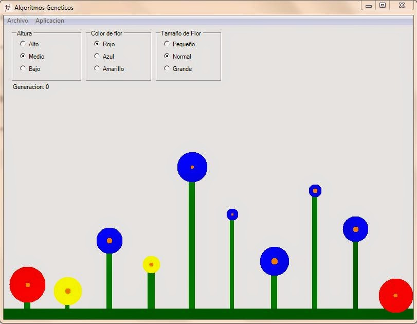

# Algoritmo Genetico
## Requires
- Visual Studio 2017
## License
- MIT
## Technologies
- C#
- Windows Forms
## Topics
- Artificial Intelligence
## Updated
- 03/10/2017
## Description

Los algoritmos gen&eacute;ticos forman parte de la inteligencia artificial y est&aacute;n inspirados en la forma de trabajar de la evoluci&oacute;n y la gen&eacute;tica. Creamos un cromosoma digital, en el cual cada gen es
 una caracter&iacute;stica que necesitamos para la soluci&oacute;n del problema. Las posibles soluciones evolucionan y se seleccionan de forma similar a la selecci&oacute;n natural. Existen diversas formas de llevar a cabo la selecci&oacute;n. A veces, tambi&eacute;n
 suceden mutaciones que pueden ser beneficiosas o perjudiciales. El cruce entre los organismos se usa para crear la generaci&oacute;n siguiente.

Partimos de una poblaci&oacute;n de flores en las que el usuario puede seleccionar algunas caracter&iacute;sticas, color, tama&ntilde;o y altura del tallo. Al inicio las flores crecer&aacute;n al azar. Estas se reproducir&aacute;n entre s&iacute;, e incluso
 habr&aacute; mutaciones. Poco a poco, conforme avancen las generaciones y si todo sale bien, tendremos una poblaci&oacute;n de flores similares a las que solicit&oacute; el usuario. 
 
&nbsp; &nbsp; &nbsp;Tenemos tres Group Boxes y dentro de cada unos de ellos tres Radio Buttons y debajo un Label. 
&nbsp; &nbsp; &nbsp;El grupo de Altura tendr&aacute; los Radio Buttons Alto,Medio y Bajo con los names: rbAlto, rbMedio y rbBajo. 
&nbsp; &nbsp; &nbsp;El grupo Color de la flor tendr&aacute; los Radio Buttons Rojo, Azul y Amarillo con los names: rbRojo, rbAzul y rbAmarillo. 
&nbsp; &nbsp; &nbsp;El grupo Tama&ntilde;o de la flor tendra los Radio Buttons Peque&ntilde;o, Normal y Grande con los names: rbPequeno, rbNormal y rbGrande, a la etiqueta la llamaremos lblGeneracion. 
 
&nbsp; &nbsp; &nbsp;Crearemos la clase Flores y en ella colocaremos la informaci&oacute;n del cromosoma, el valor de adaptaci&oacute;n y la posici&oacute;n de la flor. 
 
&nbsp; &nbsp; &nbsp;La variable X guarda la posici&oacute;n de la flor, en la variable adaptaci&oacute;n se guarda el nivel de adaptaci&oacute;n de la flor. El cromosoma va a tener 6 genes: altura, color, color del tallo, ancho del tallo, tama&ntilde;o de la
 flor, tama&ntilde;o del centro de la flor.

Contamos con un arreglo al que llamamos cromosoma. El cromosoma va a tener seis genes. Cada posici&oacute;n en el arreglo equivale a un cromosoma. El primer gen se encarga de la altura de la flor, y su rango es de 10 a 300. En el segundo codificamos
 el color de la flor. El valor de 0 indicar&aacute; rojo, el valor de 1 es azul, y el valor de 2, amarillo. El color del tallo se asigna en el tercer gen y tiene tres posibles tonos de verde. El ancho del tallo es otra caracter&iacute;stica que podemos colocar;
 para este caso el rango de valores ser&aacute; de 5 a 15. El quinto gen es el tama&ntilde;o de la flor, va desde 20 hasta 80. El ultimo gen es el centro de la flor y el rango es de 5 a 15. 
Una vez definidos los datos creamos dos propiedades CoorX para el dato X y Adaptaci&oacute;n para nuestra variable adaptaci&oacute;n. 
 
&nbsp; &nbsp; &nbsp;El primer dato del arreglo flores, lo llamamos poblaci&oacute;n. En este arreglo colocaremos los objetos que representan a la flores. 
&nbsp; &nbsp; &nbsp;Nuestra poblaci&oacute;n de flores es de 10. La variable generaci&oacute;n lleva la cuenta del n&uacute;mero de generaciones transcurridas de la aplicaci&oacute;n. Ademas, hay dos enteros, los cuales ser&aacute;n usados para guardar los
 &iacute;ndices del arreglo donde se encuentran las flores que se han seleccionado como padres para la siguiente<strong> generaci&oacute;n.</strong> 

<h1><em style="font-size:10px">&nbsp;</em></h1>

C#

Editar script|Remove

csharp

<pre class="csharp">using&nbsp;System;&nbsp;
&nbsp;
namespace&nbsp;AlgoritmosGeneticos&nbsp;
{&nbsp;
&nbsp;///&nbsp;&lt;summary&gt;&nbsp;
&nbsp;///&nbsp;Descripci&oacute;n&nbsp;breve&nbsp;de&nbsp;Flores.&nbsp;
&nbsp;///&nbsp;&lt;/summary&gt;&nbsp;
&nbsp;public&nbsp;class&nbsp;Flores&nbsp;
&nbsp;{&nbsp;
&nbsp;&nbsp;//&nbsp;Variables&nbsp;necesarias&nbsp;para&nbsp;la&nbsp;clase&nbsp;
&nbsp;&nbsp;private&nbsp;int&nbsp;x;&nbsp;//&nbsp;Posici'on&nbsp;en&nbsp;la&nbsp;ventana&nbsp;
&nbsp;&nbsp;private&nbsp;double&nbsp;adaptacion;&nbsp;//&nbsp;Nivel&nbsp;de&nbsp;adaptacion&nbsp;del&nbsp;organismo&nbsp;
&nbsp;&nbsp;&nbsp;
&nbsp;
&nbsp;&nbsp;//&nbsp;Creamos&nbsp;el&nbsp;cromosoma&nbsp;de&nbsp;la&nbsp;flor&nbsp;
&nbsp;&nbsp;//&nbsp;0-Altura&nbsp;
&nbsp;&nbsp;//&nbsp;1-Color&nbsp;de&nbsp;la&nbsp;flor&nbsp;
&nbsp;&nbsp;//&nbsp;2-Color&nbsp;del&nbsp;tallo&nbsp;
&nbsp;&nbsp;//&nbsp;3-Ancho&nbsp;del&nbsp;tallo&nbsp;
&nbsp;&nbsp;//&nbsp;4-Tama&ntilde;o&nbsp;de&nbsp;la&nbsp;flor&nbsp;
&nbsp;&nbsp;//&nbsp;5-Tama&ntilde;o&nbsp;del&nbsp;centro&nbsp;de&nbsp;la&nbsp;flor&nbsp;
&nbsp;
&nbsp;&nbsp;public&nbsp;int[]&nbsp;cromosoma=new&nbsp;int[6];&nbsp;
&nbsp;
&nbsp;&nbsp;//&nbsp;Creamos&nbsp;las&nbsp;propiedades&nbsp;
&nbsp;&nbsp;public&nbsp;int&nbsp;CoordX&nbsp;
&nbsp;&nbsp;{&nbsp;
&nbsp;&nbsp;&nbsp;set&nbsp;{x=value;}&nbsp;
&nbsp;&nbsp;&nbsp;get&nbsp;{return&nbsp;x;}&nbsp;
&nbsp;&nbsp;}&nbsp;
&nbsp;
&nbsp;&nbsp;public&nbsp;double&nbsp;Adaptacion&nbsp;
&nbsp;&nbsp;{&nbsp;
&nbsp;&nbsp;&nbsp;set&nbsp;{adaptacion=value;}&nbsp;
&nbsp;&nbsp;&nbsp;get&nbsp;{return&nbsp;adaptacion;}&nbsp;
&nbsp;&nbsp;}&nbsp;
&nbsp;
&nbsp;
&nbsp;&nbsp;public&nbsp;Flores()&nbsp;
&nbsp;&nbsp;{&nbsp;
&nbsp;&nbsp;&nbsp;//&nbsp;
&nbsp;&nbsp;&nbsp;//&nbsp;TODO:&nbsp;agregar&nbsp;aqu&iacute;&nbsp;la&nbsp;l&oacute;gica&nbsp;del&nbsp;constructor&nbsp;
&nbsp;&nbsp;&nbsp;//&nbsp;
&nbsp;&nbsp;&nbsp;
&nbsp;&nbsp;}&nbsp;
&nbsp;
&nbsp;}&nbsp;
}&nbsp;
&nbsp;
&nbsp;
&nbsp;&nbsp;&nbsp;&nbsp;&nbsp;Creamos&nbsp;un&nbsp;objeto&nbsp;de&nbsp;tipo&nbsp;Random,&nbsp;Luego&nbsp;tenemos&nbsp;un&nbsp;ciclo,&nbsp;donde&nbsp;recorreremos&nbsp;todas&nbsp;las&nbsp;flores&nbsp;de&nbsp;nuestra&nbsp;poblaci&oacute;n.&nbsp;Creamos&nbsp;el&nbsp;objeto&nbsp;flor&nbsp;y&nbsp;asignamos&nbsp;la&nbsp;posici&oacute;n&nbsp;donde&nbsp;le&nbsp;corresponde.&nbsp;Procedemos&nbsp;a&nbsp;rellenar&nbsp;el&nbsp;cromosoma.&nbsp;A&nbsp;cada&nbsp;gen&nbsp;del&nbsp;cromosoma,&nbsp;le&nbsp;colocamos&nbsp;un&nbsp;valor&nbsp;aleatorio&nbsp;de&nbsp;acuerdo&nbsp;con&nbsp;el&nbsp;rango&nbsp;que&nbsp;puede&nbsp;tener.&nbsp;As&iacute;&nbsp;iniciamos&nbsp;una&nbsp;poblaci&oacute;n&nbsp;creada&nbsp;al&nbsp;azar,&nbsp;que&nbsp;deber&aacute;&nbsp;evolucionar&nbsp;hacia&nbsp;el&nbsp;tipo&nbsp;de&nbsp;caracter&iacute;sticas&nbsp;seleccionadas&nbsp;por&nbsp;el&nbsp;usuario.&nbsp;Cuando&nbsp;se&nbsp;ejecute&nbsp;la&nbsp;aplicaci&oacute;n,&nbsp;aparecer&aacute;n&nbsp;diez&nbsp;flores&nbsp;diferentes&nbsp;en&nbsp;la&nbsp;ventana.&nbsp;
&nbsp;
&nbsp;
&nbsp;
//&nbsp;Inicializamos&nbsp;los&nbsp;valores&nbsp;de&nbsp;los&nbsp;cromosomas.&nbsp;
&nbsp;
&nbsp;
&nbsp;
//&nbsp;Arreglo&nbsp;de&nbsp;flores&nbsp;
&nbsp;&nbsp;public&nbsp;Flores[]&nbsp;poblacion=new&nbsp;Flores[10];&nbsp;
&nbsp;&nbsp;private&nbsp;System.Windows.Forms.Label&nbsp;lblGeneracion;&nbsp;
&nbsp;&nbsp;private&nbsp;int&nbsp;generacion=0;&nbsp;
&nbsp;&nbsp;private&nbsp;int&nbsp;iPadreA,iPadreB;&nbsp;
&nbsp;
&nbsp;
public&nbsp;Form1()&nbsp;
&nbsp;&nbsp;{&nbsp;
&nbsp;&nbsp;&nbsp;//&nbsp;
&nbsp;&nbsp;&nbsp;//&nbsp;Necesario&nbsp;para&nbsp;admitir&nbsp;el&nbsp;Dise&ntilde;ador&nbsp;de&nbsp;Windows&nbsp;Forms&nbsp;
&nbsp;&nbsp;&nbsp;//&nbsp;
&nbsp;&nbsp;&nbsp;InitializeComponent();&nbsp;
&nbsp;
&nbsp;&nbsp;&nbsp;//&nbsp;
&nbsp;&nbsp;&nbsp;//&nbsp;TODO:&nbsp;agregar&nbsp;c&oacute;digo&nbsp;de&nbsp;constructor&nbsp;despu&eacute;s&nbsp;de&nbsp;llamar&nbsp;a&nbsp;InitializeComponent&nbsp;
&nbsp;&nbsp;&nbsp;//&nbsp;
&nbsp;
&nbsp;&nbsp;&nbsp;Random&nbsp;random=new&nbsp;Random(unchecked((int)DateTime.Now.Ticks));&nbsp;
&nbsp;&nbsp;&nbsp;for(int&nbsp;n=0;n&lt;10;n&#43;&#43;)&nbsp;
&nbsp;&nbsp;&nbsp;{&nbsp;
&nbsp;&nbsp;&nbsp;&nbsp;Flores&nbsp;temp=new&nbsp;Flores();&nbsp;
&nbsp;&nbsp;&nbsp;&nbsp;poblacion[n]=temp;&nbsp;
&nbsp;&nbsp;&nbsp;&nbsp;poblacion[n].CoordX=n*80&#43;40;&nbsp;
&nbsp;&nbsp;&nbsp;&nbsp;&nbsp;
&nbsp;&nbsp;&nbsp;&nbsp;//&nbsp;Inicializamos&nbsp;el&nbsp;cromosoma&nbsp;con&nbsp;valores&nbsp;al&nbsp;azar&nbsp;
&nbsp;&nbsp;&nbsp;&nbsp;&nbsp;
&nbsp;&nbsp;&nbsp;&nbsp;//&nbsp;La&nbsp;altura&nbsp;va&nbsp;de&nbsp;10&nbsp;a&nbsp;300&nbsp;
&nbsp;&nbsp;&nbsp;&nbsp;poblacion[n].cromosoma[0]=random.Next(10,300);&nbsp;
&nbsp;
&nbsp;&nbsp;&nbsp;&nbsp;//&nbsp;El&nbsp;color&nbsp;de&nbsp;la&nbsp;flor.&nbsp;0-rojo,&nbsp;1-azul,&nbsp;2-amarillo&nbsp;
&nbsp;&nbsp;&nbsp;&nbsp;poblacion[n].cromosoma[1]=random.Next(0,3);&nbsp;
&nbsp;
&nbsp;&nbsp;&nbsp;&nbsp;//&nbsp;El&nbsp;color&nbsp;del&nbsp;tallo.&nbsp;Diferentes&nbsp;tonos&nbsp;de&nbsp;verde&nbsp;
&nbsp;&nbsp;&nbsp;&nbsp;poblacion[n].cromosoma[2]=random.Next(0,3);&nbsp;
&nbsp;
&nbsp;&nbsp;&nbsp;&nbsp;//&nbsp;El&nbsp;ancho&nbsp;del&nbsp;tallo.&nbsp;De&nbsp;5&nbsp;a&nbsp;15&nbsp;
&nbsp;&nbsp;&nbsp;&nbsp;poblacion[n].cromosoma[3]=random.Next(5,15);&nbsp;
&nbsp;
&nbsp;&nbsp;&nbsp;&nbsp;//&nbsp;El&nbsp;tamano&nbsp;de&nbsp;la&nbsp;flor.&nbsp;De&nbsp;20&nbsp;a&nbsp;80&nbsp;
&nbsp;&nbsp;&nbsp;&nbsp;poblacion[n].cromosoma[4]=random.Next(20,80);&nbsp;
&nbsp;
&nbsp;&nbsp;&nbsp;&nbsp;//&nbsp;El&nbsp;tamano&nbsp;del&nbsp;centro&nbsp;de&nbsp;la&nbsp;flor.&nbsp;De&nbsp;5&nbsp;a&nbsp;15&nbsp;
&nbsp;&nbsp;&nbsp;&nbsp;poblacion[n].cromosoma[5]=random.Next(5,15);&nbsp;
&nbsp;&nbsp;&nbsp;}&nbsp;
&nbsp;
&nbsp;&nbsp;}&nbsp;
&nbsp;
&nbsp;
Primero&nbsp;pintamos&nbsp;el&nbsp;suelo.&nbsp;Luego&nbsp;con&nbsp;un&nbsp;ciclo&nbsp;recorremos&nbsp;todas&nbsp;la&nbsp;flores,&nbsp;pintando&nbsp;una&nbsp;por&nbsp;una&nbsp;seg&uacute;n&nbsp;sus&nbsp;caracter&iacute;sticas.&nbsp;Se&nbsp;`pinta&nbsp;el&nbsp;tallo,&nbsp;dependiendo&nbsp;de&nbsp;su&nbsp;color.&nbsp;El&nbsp;color&nbsp;se&nbsp;guarda&nbsp;en&nbsp;el&nbsp;tercer&nbsp;gen,&nbsp;es&nbsp;decir&nbsp;el&nbsp;que&nbsp;se&nbsp;encuentra&nbsp;en&nbsp;el&nbsp;&iacute;ndice&nbsp;2.&nbsp;Al&nbsp;usar&nbsp;el&nbsp;gen&nbsp;en&nbsp;el&nbsp;&iacute;ndice&nbsp;0,&nbsp;vemos&nbsp;su&nbsp;altura,&nbsp;y&nbsp;el&nbsp;valor&nbsp;del&nbsp;gen&nbsp;con&nbsp;&iacute;ndice&nbsp;3&nbsp;nos&nbsp;sirve&nbsp;para&nbsp;colocar&nbsp;el&nbsp;ancho&nbsp;del&nbsp;tallo.&nbsp;
&nbsp;
Para&nbsp;pintar&nbsp;la&nbsp;flor,&nbsp;utilizamos&nbsp;el&nbsp;circulo.&nbsp;Llevamos&nbsp;a&nbsp;cabo&nbsp;la&nbsp;selecci&oacute;n&nbsp;del&nbsp;color&nbsp;usando&nbsp;el&nbsp;el&nbsp;valor&nbsp;contenido&nbsp;en&nbsp;el&nbsp;gen&nbsp;1.&nbsp;Con&nbsp;el&nbsp;valor&nbsp;del&nbsp;gen&nbsp;con&nbsp;&iacute;ndice&nbsp;4,&nbsp;colocamos&nbsp;el&nbsp;tama&ntilde;o.,&nbsp;Todos&nbsp;los&nbsp;centros&nbsp;de&nbsp;las&nbsp;flores&nbsp;se&nbsp;pintan&nbsp;del&nbsp;mismo&nbsp;color,&nbsp;en&nbsp;esta&nbsp;caso,&nbsp;un&nbsp;tono&nbsp;naranja&nbsp;oscuro.&nbsp;El&nbsp;tama&ntilde;o&nbsp;del&nbsp;centro&nbsp;lo&nbsp;obtenemos&nbsp;en&nbsp;el&nbsp;gen&nbsp;con&nbsp;&iacute;ndice&nbsp;5.&nbsp;Despu&eacute;s&nbsp;de&nbsp;pintar&nbsp;todas&nbsp;las&nbsp;flores,&nbsp;actualizamos&nbsp;la&nbsp;etiqueta&nbsp;colocando&nbsp;el&nbsp;valor&nbsp;actual&nbsp;de&nbsp;la&nbsp;generaci&oacute;n.&nbsp;
&nbsp;
&nbsp;
private&nbsp;void&nbsp;Form1_Paint(object&nbsp;sender,&nbsp;System.Windows.Forms.PaintEventArgs&nbsp;e)&nbsp;
&nbsp;&nbsp;{&nbsp;
&nbsp;&nbsp;&nbsp;//&nbsp;Pintamos&nbsp;un&nbsp;suelo&nbsp;
&nbsp;&nbsp;&nbsp;e.Graphics.FillRectangle(Brushes.DarkGreen,0,550,800,50);&nbsp;
&nbsp;
&nbsp;&nbsp;&nbsp;//&nbsp;Pintamos&nbsp;las&nbsp;flores&nbsp;
&nbsp;&nbsp;&nbsp;for(int&nbsp;n=0;n&lt;10;n&#43;&#43;)&nbsp;
&nbsp;&nbsp;&nbsp;{&nbsp;
&nbsp;&nbsp;&nbsp;&nbsp;//&nbsp;0-Altura&nbsp;
&nbsp;&nbsp;&nbsp;&nbsp;//&nbsp;1-Color&nbsp;de&nbsp;la&nbsp;flor&nbsp;
&nbsp;&nbsp;&nbsp;&nbsp;//&nbsp;2-Color&nbsp;del&nbsp;tallo&nbsp;
&nbsp;&nbsp;&nbsp;&nbsp;//&nbsp;3-Ancho&nbsp;del&nbsp;tallo&nbsp;
&nbsp;&nbsp;&nbsp;&nbsp;//&nbsp;4-Tama&ntilde;o&nbsp;de&nbsp;la&nbsp;flor&nbsp;
&nbsp;&nbsp;&nbsp;&nbsp;//&nbsp;5-Tama&ntilde;o&nbsp;del&nbsp;centro&nbsp;de&nbsp;la&nbsp;flor&nbsp;
&nbsp;
&nbsp;&nbsp;&nbsp;&nbsp;//&nbsp;pintamos&nbsp;el&nbsp;tallo&nbsp;
&nbsp;&nbsp;&nbsp;&nbsp;&nbsp;&nbsp;&nbsp;
&nbsp;&nbsp;&nbsp;&nbsp;//&nbsp;vemos&nbsp;el&nbsp;color&nbsp;del&nbsp;tallo&nbsp;
&nbsp;&nbsp;&nbsp;&nbsp;if(poblacion[n].cromosoma[2]==0)&nbsp;
&nbsp;&nbsp;&nbsp;&nbsp;&nbsp;e.Graphics.FillRectangle(Brushes.DarkGreen,&nbsp;
&nbsp;&nbsp;&nbsp;&nbsp;&nbsp;&nbsp;poblacion[n].CoordX,550-poblacion[n].cromosoma[0],&nbsp;
&nbsp;&nbsp;&nbsp;&nbsp;&nbsp;&nbsp;poblacion[n].cromosoma[3],poblacion[n].cromosoma[0]);&nbsp;
&nbsp;&nbsp;&nbsp;&nbsp;else&nbsp;if(poblacion[n].cromosoma[2]==1)&nbsp;
&nbsp;&nbsp;&nbsp;&nbsp;&nbsp;e.Graphics.FillRectangle(Brushes.Green,&nbsp;
&nbsp;&nbsp;&nbsp;&nbsp;&nbsp;&nbsp;poblacion[n].CoordX,550-poblacion[n].cromosoma[0],&nbsp;
&nbsp;&nbsp;&nbsp;&nbsp;&nbsp;&nbsp;poblacion[n].cromosoma[3],poblacion[n].cromosoma[0]);&nbsp;
&nbsp;&nbsp;&nbsp;&nbsp;else&nbsp;if(poblacion[n].cromosoma[2]==2)&nbsp;
&nbsp;&nbsp;&nbsp;&nbsp;&nbsp;e.Graphics.FillRectangle(Brushes.LightGreen,&nbsp;
&nbsp;&nbsp;&nbsp;&nbsp;&nbsp;&nbsp;poblacion[n].CoordX,550-poblacion[n].cromosoma[0],&nbsp;
&nbsp;&nbsp;&nbsp;&nbsp;&nbsp;&nbsp;poblacion[n].cromosoma[3],poblacion[n].cromosoma[0]);&nbsp;
&nbsp;
&nbsp;&nbsp;&nbsp;&nbsp;//&nbsp;Pintamos&nbsp;la&nbsp;flor&nbsp;
&nbsp;&nbsp;&nbsp;&nbsp;//Color&nbsp;cflor=new&nbsp;Color();&nbsp;
&nbsp;&nbsp;&nbsp;&nbsp;Color&nbsp;cflor=new&nbsp;Color();&nbsp;&nbsp;
&nbsp;&nbsp;&nbsp;&nbsp;&nbsp;
&nbsp;&nbsp;&nbsp;&nbsp;if(poblacion[n].cromosoma[1]==0)&nbsp;
&nbsp;&nbsp;&nbsp;&nbsp;&nbsp;cflor=Color.Red;&nbsp;
&nbsp;&nbsp;&nbsp;&nbsp;else&nbsp;if(poblacion[n].cromosoma[1]==1)&nbsp;
&nbsp;&nbsp;&nbsp;&nbsp;&nbsp;cflor=Color.Blue;&nbsp;
&nbsp;&nbsp;&nbsp;&nbsp;else&nbsp;if(poblacion[n].cromosoma[1]==2)&nbsp;
&nbsp;&nbsp;&nbsp;&nbsp;&nbsp;cflor=Color.Yellow;&nbsp;
&nbsp;
&nbsp;&nbsp;&nbsp;&nbsp;e.Graphics.FillEllipse(new&nbsp;SolidBrush(cflor),&nbsp;
&nbsp;&nbsp;&nbsp;&nbsp;&nbsp;poblacion[n].CoordX&#43;poblacion[n].cromosoma[3]/2-poblacion[n].cromosoma[4]/2,&nbsp;
&nbsp;&nbsp;&nbsp;&nbsp;&nbsp;550-poblacion[n].cromosoma[0]-poblacion[n].cromosoma[4]/2,&nbsp;
&nbsp;&nbsp;&nbsp;&nbsp;&nbsp;poblacion[n].cromosoma[4],poblacion[n].cromosoma[4]);&nbsp;
&nbsp;
&nbsp;&nbsp;&nbsp;&nbsp;//Pintamos&nbsp;el&nbsp;centro&nbsp;de&nbsp;la&nbsp;flor&nbsp;
&nbsp;&nbsp;&nbsp;&nbsp;e.Graphics.FillEllipse(Brushes.DarkOrange,&nbsp;
&nbsp;&nbsp;&nbsp;&nbsp;&nbsp;poblacion[n].CoordX&#43;poblacion[n].cromosoma[3]/2-poblacion[n].cromosoma[5]/2,&nbsp;
&nbsp;&nbsp;&nbsp;&nbsp;&nbsp;550-poblacion[n].cromosoma[0]-poblacion[n].cromosoma[5]/2,&nbsp;
&nbsp;&nbsp;&nbsp;&nbsp;&nbsp;poblacion[n].cromosoma[5],poblacion[n].cromosoma[5]);&nbsp;
&nbsp;&nbsp;&nbsp;}&nbsp;
&nbsp;
&nbsp;&nbsp;&nbsp;lblGeneracion.Text=&quot;Generacion:&nbsp;&quot;&#43;generacion.ToString();&nbsp;
&nbsp;&nbsp;}&nbsp;
&nbsp;
&nbsp;
El&nbsp;ciclo&nbsp;en&nbsp;donde&nbsp;se&nbsp;lleva&nbsp;a&nbsp;cabo&nbsp;el&nbsp;proceso&nbsp;de&nbsp;la&nbsp;evoluci&oacute;n&nbsp;se&nbsp;incorpora&nbsp;por&nbsp;medio&nbsp;del&nbsp;Timer.&nbsp;Cada&nbsp;vez&nbsp;que&nbsp;el&nbsp;Timer&nbsp;genere&nbsp;el&nbsp;evento,&nbsp;se&nbsp;realizar&aacute;&nbsp;todo&nbsp;el&nbsp;proceso&nbsp;necesario&nbsp;para&nbsp;crear&nbsp;una&nbsp;nueva&nbsp;generaci&oacute;n.&nbsp;El&nbsp;evento&nbsp;del&nbsp;Timer&nbsp;se&nbsp;llama&nbsp;Tick,&nbsp;y,&nbsp;en&nbsp;su&nbsp;handler,&nbsp;colocamos&nbsp;el&nbsp;siguiente&nbsp;c&oacute;digo:&nbsp;
&nbsp;
private&nbsp;void&nbsp;timer1_Tick(object&nbsp;sender,&nbsp;System.EventArgs&nbsp;e)&nbsp;
&nbsp;&nbsp;{&nbsp;
&nbsp;&nbsp;&nbsp;//&nbsp;Calculamos&nbsp;la&nbsp;adaptacion&nbsp;
&nbsp;&nbsp;&nbsp;CalculaAdaptacion();&nbsp;
&nbsp;
&nbsp;&nbsp;&nbsp;//&nbsp;Seleccionamos&nbsp;a&nbsp;los&nbsp;padres&nbsp;
&nbsp;&nbsp;&nbsp;SeleccionaPadres();&nbsp;
&nbsp;
&nbsp;&nbsp;&nbsp;//&nbsp;Hacemos&nbsp;el&nbsp;crossover&nbsp;y&nbsp;la&nbsp;mutacion&nbsp;
&nbsp;&nbsp;&nbsp;Crossover();&nbsp;
&nbsp;
&nbsp;&nbsp;&nbsp;//&nbsp;Acutalizamos&nbsp;la&nbsp;generacion&nbsp;
&nbsp;&nbsp;&nbsp;generacion&#43;&#43;;&nbsp;
&nbsp;
&nbsp;&nbsp;&nbsp;//&nbsp;Redibujamos&nbsp;la&nbsp;ventana&nbsp;
&nbsp;&nbsp;&nbsp;this.Invalidate();&nbsp;
&nbsp;&nbsp;}&nbsp;
&nbsp;
En&nbsp;esa&nbsp;funci&oacute;n&nbsp;se&nbsp;invocar&aacute;n&nbsp;a&nbsp;varias&nbsp;funciones&nbsp;especializadas&nbsp;que&nbsp;nos&nbsp;ayudan&nbsp;con&nbsp;el&nbsp;proceso.&nbsp;La&nbsp;primera&nbsp;funci&oacute;n&nbsp;CalculaAdaptacion()&nbsp;sirve&nbsp;para&nbsp;que&nbsp;se&nbsp;calcule&nbsp;el&nbsp;nivel&nbsp;de&nbsp;adaptaci&oacute;n&nbsp;de&nbsp;cada&nbsp;flor.&nbsp;Luego&nbsp;SeleccionaPadres()&nbsp;obtiene&nbsp;los&nbsp;dos&nbsp;padres&nbsp;que&nbsp;se&nbsp;utilizar&aacute;n&nbsp;para&nbsp;crear&nbsp;la&nbsp;siguiente&nbsp;generaci&oacute;n.&nbsp;La&nbsp;funci&oacute;n&nbsp;de&nbsp;CrossOver()&nbsp;hace&nbsp;el&nbsp;intercambio&nbsp;gen&eacute;tico&nbsp;y&nbsp;se&nbsp;encarga&nbsp;de&nbsp;la&nbsp;mutaci&oacute;n.&nbsp;Despu&eacute;s,&nbsp;se&nbsp;incrementa&nbsp;la&nbsp;variable&nbsp;de&nbsp;generaci&oacute;n&nbsp;y&nbsp;se&nbsp;manda&nbsp;a&nbsp;redibujar&nbsp;la&nbsp;ventana.&nbsp;
&nbsp;
&nbsp;
No&nbsp;existe&nbsp;una&nbsp;f&oacute;rmula&nbsp;para&nbsp;el&nbsp;c&aacute;lculo&nbsp;de&nbsp;la&nbsp;adaptaci&oacute;n,;&nbsp;cada&nbsp;aplicaci&oacute;n&nbsp;tendr&aacute;&nbsp;su&nbsp;propia&nbsp;forma&nbsp;de&nbsp;llevar&nbsp;a&nbsp;cabo&nbsp;ese&nbsp;c&aacute;lculo.&nbsp;A&nbsp;veces,&nbsp;puede&nbsp;ser&nbsp;tan&nbsp;sencillo&nbsp;como&nbsp;una&nbsp;resta;&nbsp;otras,&nbsp;se&nbsp;necesitar&aacute;n&nbsp;mecanismos&nbsp;m&aacute;s&nbsp;complicados.&nbsp;Nuestra&nbsp;funci&oacute;n&nbsp;CalculaAdaptacion()&nbsp;queda&nbsp;de&nbsp;la&nbsp;siguiente&nbsp;manera:&nbsp;
&nbsp;
private&nbsp;void&nbsp;CalculaAdaptacion()&nbsp;
&nbsp;&nbsp;{&nbsp;
&nbsp;&nbsp;&nbsp;//&nbsp;Variables&nbsp;para&nbsp;las&nbsp;opciones&nbsp;del&nbsp;usuario&nbsp;
&nbsp;&nbsp;&nbsp;int&nbsp;altura,color,tamano;&nbsp;
&nbsp;&nbsp;&nbsp;altura=color=tamano=0;&nbsp;
&nbsp;
&nbsp;&nbsp;&nbsp;//&nbsp;Variables&nbsp;necesarias&nbsp;para&nbsp;el&nbsp;calculo&nbsp;
&nbsp;&nbsp;&nbsp;double&nbsp;Aaltura,Acolor,Atamano;&nbsp;
&nbsp;&nbsp;&nbsp;Aaltura=Acolor=Atamano=0.0;&nbsp;
&nbsp;
&nbsp;&nbsp;&nbsp;//&nbsp;Obtnemos&nbsp;la&nbsp;altura&nbsp;deseada&nbsp;por&nbsp;el&nbsp;usuario&nbsp;
&nbsp;&nbsp;&nbsp;if(rbBajo.Checked==true)&nbsp;
&nbsp;&nbsp;&nbsp;&nbsp;altura=0;&nbsp;
&nbsp;&nbsp;&nbsp;else&nbsp;if(rbMedio.Checked==true)&nbsp;
&nbsp;&nbsp;&nbsp;&nbsp;altura=1;&nbsp;
&nbsp;&nbsp;&nbsp;else&nbsp;if(rbAlto.Checked==true)&nbsp;
&nbsp;&nbsp;&nbsp;&nbsp;altura=2;&nbsp;
&nbsp;
&nbsp;&nbsp;&nbsp;//&nbsp;Obtenemos&nbsp;el&nbsp;color&nbsp;deseado&nbsp;por&nbsp;el&nbsp;usuario&nbsp;
&nbsp;&nbsp;&nbsp;if(rbRojo.Checked==true)&nbsp;
&nbsp;&nbsp;&nbsp;&nbsp;color=0;&nbsp;
&nbsp;&nbsp;&nbsp;else&nbsp;if(rbAzul.Checked==true)&nbsp;
&nbsp;&nbsp;&nbsp;&nbsp;color=1;&nbsp;
&nbsp;&nbsp;&nbsp;else&nbsp;if(rbAmarillo.Checked==true)&nbsp;
&nbsp;&nbsp;&nbsp;&nbsp;color=2;&nbsp;
&nbsp;
&nbsp;&nbsp;&nbsp;//&nbsp;Obtenemos&nbsp;el&nbsp;tama&ntilde;o&nbsp;de&nbsp;la&nbsp;flor&nbsp;deseado&nbsp;por&nbsp;el&nbsp;usuario&nbsp;
&nbsp;&nbsp;&nbsp;if(rbPequeno.Checked==true)&nbsp;
&nbsp;&nbsp;&nbsp;&nbsp;tamano=0;&nbsp;
&nbsp;&nbsp;&nbsp;else&nbsp;if(rbNormal.Checked==true)&nbsp;
&nbsp;&nbsp;&nbsp;&nbsp;tamano=1;&nbsp;
&nbsp;&nbsp;&nbsp;else&nbsp;if(rbGrande.Checked==true)&nbsp;
&nbsp;&nbsp;&nbsp;&nbsp;tamano=2;&nbsp;
&nbsp;
&nbsp;
&nbsp;&nbsp;&nbsp;//&nbsp;Recorremos&nbsp;toda&nbsp;la&nbsp;poblaci&oacute;n&nbsp;para&nbsp;encontrar&nbsp;su&nbsp;adaptaci&oacute;n&nbsp;
&nbsp;&nbsp;&nbsp;for(int&nbsp;n=0;n&lt;10;n&#43;&#43;)&nbsp;
&nbsp;&nbsp;&nbsp;{&nbsp;
&nbsp;&nbsp;&nbsp;&nbsp;//&nbsp;Checamos&nbsp;el&nbsp;nivel&nbsp;de&nbsp;adaptaci&oacute;n&nbsp;para&nbsp;la&nbsp;altura&nbsp;
&nbsp;&nbsp;&nbsp;&nbsp;if(altura==0)&nbsp;//&nbsp;rango&nbsp;10&nbsp;a&nbsp;100&nbsp;
&nbsp;&nbsp;&nbsp;&nbsp;&nbsp;Aaltura=poblacion[n].cromosoma[0]/100;&nbsp;
&nbsp;&nbsp;&nbsp;&nbsp;else&nbsp;if(altura==1)&nbsp;//&nbsp;rango&nbsp;100&nbsp;a&nbsp;200&nbsp;
&nbsp;&nbsp;&nbsp;&nbsp;&nbsp;Aaltura=poblacion[n].cromosoma[0]/200;&nbsp;
&nbsp;&nbsp;&nbsp;&nbsp;else&nbsp;if(altura==2)&nbsp;//&nbsp;rango&nbsp;200&nbsp;a&nbsp;300&nbsp;
&nbsp;&nbsp;&nbsp;&nbsp;&nbsp;Aaltura=poblacion[n].cromosoma[0]/300;&nbsp;
&nbsp;
&nbsp;&nbsp;&nbsp;&nbsp;if(Aaltura&gt;1.0)&nbsp;
&nbsp;&nbsp;&nbsp;&nbsp;&nbsp;Aaltura=1/Aaltura;&nbsp;
&nbsp;
&nbsp;&nbsp;&nbsp;&nbsp;//&nbsp;Checamos&nbsp;el&nbsp;nivel&nbsp;de&nbsp;adaptaci&oacute;n&nbsp;del&nbsp;color&nbsp;
&nbsp;&nbsp;&nbsp;&nbsp;if(color==poblacion[n].cromosoma[1])&nbsp;
&nbsp;&nbsp;&nbsp;&nbsp;&nbsp;Acolor=1.0;&nbsp;
&nbsp;&nbsp;&nbsp;&nbsp;else&nbsp;
&nbsp;&nbsp;&nbsp;&nbsp;&nbsp;Acolor=0.0;&nbsp;
&nbsp;
&nbsp;&nbsp;&nbsp;&nbsp;//&nbsp;Checamos&nbsp;el&nbsp;nivel&nbsp;de&nbsp;adaptaci&oacute;n&nbsp;del&nbsp;tama&ntilde;o&nbsp;de&nbsp;la&nbsp;flor&nbsp;
&nbsp;&nbsp;&nbsp;&nbsp;if(tamano==0)&nbsp;//&nbsp;rango&nbsp;20&nbsp;a&nbsp;40&nbsp;
&nbsp;&nbsp;&nbsp;&nbsp;&nbsp;Atamano=poblacion[n].cromosoma[4]/40;&nbsp;
&nbsp;&nbsp;&nbsp;&nbsp;else&nbsp;if(tamano==1)&nbsp;//&nbsp;rango&nbsp;40&nbsp;a&nbsp;60&nbsp;
&nbsp;&nbsp;&nbsp;&nbsp;&nbsp;Atamano=poblacion[n].cromosoma[4]/60;&nbsp;
&nbsp;&nbsp;&nbsp;&nbsp;else&nbsp;if(tamano==2)&nbsp;//&nbsp;rango&nbsp;60&nbsp;a&nbsp;80&nbsp;
&nbsp;&nbsp;&nbsp;&nbsp;&nbsp;Atamano=poblacion[n].cromosoma[4]/80;&nbsp;
&nbsp;
&nbsp;&nbsp;&nbsp;&nbsp;if(Atamano&gt;1.0)&nbsp;
&nbsp;&nbsp;&nbsp;&nbsp;&nbsp;Atamano=1/Atamano;&nbsp;
&nbsp;
&nbsp;&nbsp;&nbsp;&nbsp;//&nbsp;Calculamos&nbsp;el&nbsp;valor&nbsp;final&nbsp;de&nbsp;adaptaci&oacute;n&nbsp;
&nbsp;&nbsp;&nbsp;&nbsp;poblacion[n].Adaptacion=(Aaltura&#43;Acolor&#43;Atamano)/3.0;&nbsp;
&nbsp;
&nbsp;&nbsp;&nbsp;}&nbsp;
&nbsp;
&nbsp;&nbsp;}&nbsp;
&nbsp;
&nbsp;
Para&nbsp;calcular&nbsp;la&nbsp;adaptaci&oacute;n,se&nbsp;calculan&nbsp;tres&nbsp;valores,&nbsp;uno&nbsp;para&nbsp;cada&nbsp;caracter&iacute;stica&nbsp;que&nbsp;queremos&nbsp;comparar&nbsp;y,&nbsp;luego,&nbsp;se&nbsp;saca&nbsp;el&nbsp;promedio&nbsp;entre&nbsp;ellos,&nbsp;Dentro&nbsp;de&nbsp;la&nbsp;funci&oacute;n,&nbsp;en&nbsp;primer&nbsp;lugar,&nbsp;reconocemos&nbsp;cu&aacute;les&nbsp;son&nbsp;las&nbsp;caracter&iacute;sticas&nbsp;que&nbsp;ha&nbsp;solicitado&nbsp;el&nbsp;usuario,&nbsp;mediante&nbsp;la&nbsp;lectura&nbsp;de&nbsp;los&nbsp;Radio&nbsp;Buttons.&nbsp;Luego&nbsp;recorreremos&nbsp;toda&nbsp;la&nbsp;poblaci&oacute;n&nbsp;y&nbsp;calculamos&nbsp;el&nbsp;valor&nbsp;de&nbsp;adaptaci&oacute;n&nbsp;para&nbsp;cada&nbsp;flor.&nbsp;Como&nbsp;podemos&nbsp;ver,&nbsp;cada&nbsp;caracter&iacute;stica&nbsp;tiene&nbsp;su&nbsp;propia&nbsp;forma&nbsp;de&nbsp;calcular&nbsp;su&nbsp;nivel&nbsp;de&nbsp;adaptaci&oacute;n;&nbsp;luego,&nbsp;sacamos&nbsp;el&nbsp;promedio&nbsp;entre&nbsp;ellos&nbsp;
&nbsp;
La&nbsp;funci&oacute;n&nbsp;para&nbsp;la&nbsp;selecci&oacute;n&nbsp;de&nbsp;los&nbsp;padres&nbsp;es&nbsp;SeleccionaPadres().&nbsp;Esta&nbsp;funci&oacute;n&nbsp;resulta&nbsp;muy&nbsp;sencilla,&nbsp;simplemente,&nbsp;selecciona&nbsp;las&nbsp;dos&nbsp;flores&nbsp;con&nbsp;valor&nbsp;valor&nbsp;de&nbsp;adaptaci&oacute;n.&nbsp;Los&nbsp;&iacute;ndices&nbsp;donse&nbsp;se&nbsp;encuentran&nbsp;son&nbsp;guardados&nbsp;en&nbsp;las&nbsp;variables&nbsp;iPadreA&nbsp;e&nbsp;iPadreB.&nbsp;
&nbsp;
private&nbsp;void&nbsp;SeleccionaPadres()&nbsp;
&nbsp;&nbsp;{&nbsp;
&nbsp;&nbsp;&nbsp;//&nbsp;Seleccionamos&nbsp;los&nbsp;dos&nbsp;mejores&nbsp;
&nbsp;&nbsp;&nbsp;//&nbsp;Modelo&nbsp;elitista&nbsp;
&nbsp;&nbsp;&nbsp;&nbsp;
&nbsp;&nbsp;&nbsp;iPadreA=iPadreB=0;&nbsp;
&nbsp;
&nbsp;&nbsp;&nbsp;//&nbsp;Encontramos&nbsp;el&nbsp;padre&nbsp;A&nbsp;
&nbsp;&nbsp;&nbsp;for(int&nbsp;n=0;n&lt;10;n&#43;&#43;)&nbsp;
&nbsp;&nbsp;&nbsp;{&nbsp;
&nbsp;&nbsp;&nbsp;&nbsp;if(poblacion[n].Adaptacion&gt;poblacion[iPadreA].Adaptacion)&nbsp;
&nbsp;&nbsp;&nbsp;&nbsp;&nbsp;iPadreA=n;&nbsp;
&nbsp;&nbsp;&nbsp;}&nbsp;
&nbsp;
&nbsp;&nbsp;&nbsp;//&nbsp;Encontramos&nbsp;el&nbsp;padre&nbsp;B&nbsp;
&nbsp;&nbsp;&nbsp;for(int&nbsp;n=0;n&lt;10;n&#43;&#43;)&nbsp;
&nbsp;&nbsp;&nbsp;{&nbsp;
&nbsp;&nbsp;&nbsp;&nbsp;if(poblacion[n].Adaptacion&gt;poblacion[iPadreB].Adaptacion&nbsp;&amp;&amp;&nbsp;iPadreA!=n)&nbsp;
&nbsp;&nbsp;&nbsp;&nbsp;&nbsp;iPadreB=n;&nbsp;
&nbsp;&nbsp;&nbsp;}&nbsp;
&nbsp;
&nbsp;&nbsp;}&nbsp;
&nbsp;
La&nbsp;funci&oacute;n&nbsp;para&nbsp;el&nbsp;cruce&nbsp;de&nbsp;los&nbsp;cromosomas.&nbsp;En&nbsp;la&nbsp;funci&oacute;n&nbsp;CrossOver(),&nbsp;tomamos&nbsp;los&nbsp;padres&nbsp;seleccionados&nbsp;y&nbsp;creamos&nbsp;una&nbsp;nueva&nbsp;generaci&oacute;n&nbsp;con&nbsp;sus&nbsp;genes&nbsp;
&nbsp;
&nbsp;
&nbsp;
private&nbsp;void&nbsp;Crossover()&nbsp;
&nbsp;&nbsp;{&nbsp;
&nbsp;&nbsp;&nbsp;//&nbsp;Llevamos&nbsp;a&nbsp;cabo&nbsp;el&nbsp;cross&nbsp;over&nbsp;
&nbsp;
&nbsp;&nbsp;&nbsp;//&nbsp;Copiamos&nbsp;los&nbsp;padres,&nbsp;ya&nbsp;que&nbsp;todo&nbsp;el&nbsp;arreglo&nbsp;sera&nbsp;
&nbsp;&nbsp;&nbsp;//&nbsp;llenado&nbsp;nuevamente&nbsp;con&nbsp;hijos&nbsp;
&nbsp;
&nbsp;&nbsp;&nbsp;Flores&nbsp;PadreA=new&nbsp;Flores();&nbsp;
&nbsp;&nbsp;&nbsp;Flores&nbsp;PadreB=new&nbsp;Flores();&nbsp;
&nbsp;
&nbsp;&nbsp;&nbsp;//&nbsp;Copiamos&nbsp;los&nbsp;padres&nbsp;
&nbsp;&nbsp;&nbsp;for(int&nbsp;n=0;n&lt;6;n&#43;&#43;)&nbsp;
&nbsp;&nbsp;&nbsp;{&nbsp;
&nbsp;&nbsp;&nbsp;&nbsp;PadreA.cromosoma[n]=poblacion[iPadreA].cromosoma[n];&nbsp;
&nbsp;&nbsp;&nbsp;&nbsp;PadreB.cromosoma[n]=poblacion[iPadreB].cromosoma[n];&nbsp;
&nbsp;
&nbsp;&nbsp;&nbsp;}&nbsp;
&nbsp;
&nbsp;&nbsp;&nbsp;//&nbsp;Creamos&nbsp;la&nbsp;siguiente&nbsp;generacion&nbsp;
&nbsp;&nbsp;&nbsp;&nbsp;
&nbsp;&nbsp;&nbsp;Random&nbsp;random=new&nbsp;Random(unchecked((int)DateTime.Now.Ticks));&nbsp;
&nbsp;&nbsp;&nbsp;&nbsp;
&nbsp;
&nbsp;&nbsp;&nbsp;for(int&nbsp;n=0;n&lt;10;n&#43;&#43;)&nbsp;
&nbsp;&nbsp;&nbsp;{&nbsp;
&nbsp;&nbsp;&nbsp;&nbsp;
&nbsp;&nbsp;&nbsp;&nbsp;int&nbsp;desde=random.Next(0,5);&nbsp;
&nbsp;&nbsp;&nbsp;&nbsp;int&nbsp;hasta=random.Next(desde,6);&nbsp;
&nbsp;
&nbsp;&nbsp;&nbsp;&nbsp;for(int&nbsp;c=desde;c&lt;hasta;c&#43;&#43;)&nbsp;
&nbsp;&nbsp;&nbsp;&nbsp;{&nbsp;
&nbsp;&nbsp;&nbsp;&nbsp;&nbsp;//&nbsp;Si&nbsp;el&nbsp;random&nbsp;es&nbsp;0,&nbsp;se&nbsp;copia&nbsp;el&nbsp;gen&nbsp;de&nbsp;PadreA&nbsp;
&nbsp;&nbsp;&nbsp;&nbsp;&nbsp;//&nbsp;si&nbsp;el&nbsp;random&nbsp;es&nbsp;1,&nbsp;se&nbsp;copia&nbsp;el&nbsp;gen&nbsp;de&nbsp;PadreB&nbsp;
&nbsp;&nbsp;&nbsp;&nbsp;&nbsp;if(random.Next(0,2)==0)&nbsp;
&nbsp;&nbsp;&nbsp;&nbsp;&nbsp;&nbsp;poblacion[n].cromosoma[c]=PadreA.cromosoma[c];&nbsp;
&nbsp;&nbsp;&nbsp;&nbsp;&nbsp;else&nbsp;
&nbsp;&nbsp;&nbsp;&nbsp;&nbsp;&nbsp;poblacion[n].cromosoma[c]=PadreB.cromosoma[c];&nbsp;
&nbsp;
&nbsp;&nbsp;&nbsp;&nbsp;&nbsp;//&nbsp;incluimos&nbsp;la&nbsp;mutacion&nbsp;
&nbsp;&nbsp;&nbsp;&nbsp;&nbsp;if(random.Next(0,100)&lt;=5)&nbsp;
&nbsp;&nbsp;&nbsp;&nbsp;&nbsp;{&nbsp;
&nbsp;
&nbsp;&nbsp;&nbsp;&nbsp;&nbsp;&nbsp;if(c==0)&nbsp;
&nbsp;&nbsp;&nbsp;&nbsp;&nbsp;&nbsp;&nbsp;poblacion[n].cromosoma[0]=random.Next(10,300);&nbsp;
&nbsp;
&nbsp;&nbsp;&nbsp;&nbsp;&nbsp;&nbsp;if(c==1)&nbsp;
&nbsp;&nbsp;&nbsp;&nbsp;&nbsp;&nbsp;&nbsp;poblacion[n].cromosoma[1]=random.Next(0,3);&nbsp;
&nbsp;
&nbsp;&nbsp;&nbsp;&nbsp;&nbsp;&nbsp;if(c==2)&nbsp;
&nbsp;&nbsp;&nbsp;&nbsp;&nbsp;&nbsp;&nbsp;poblacion[n].cromosoma[2]=random.Next(0,3);&nbsp;
&nbsp;
&nbsp;&nbsp;&nbsp;&nbsp;&nbsp;&nbsp;if(c==3)&nbsp;
&nbsp;&nbsp;&nbsp;&nbsp;&nbsp;&nbsp;&nbsp;poblacion[n].cromosoma[3]=random.Next(5,15);&nbsp;
&nbsp;
&nbsp;&nbsp;&nbsp;&nbsp;&nbsp;&nbsp;if(c==4)&nbsp;
&nbsp;&nbsp;&nbsp;&nbsp;&nbsp;&nbsp;&nbsp;poblacion[n].cromosoma[4]=random.Next(20,80);&nbsp;
&nbsp;
&nbsp;&nbsp;&nbsp;&nbsp;&nbsp;&nbsp;if(c==5)&nbsp;
&nbsp;&nbsp;&nbsp;&nbsp;&nbsp;&nbsp;&nbsp;poblacion[n].cromosoma[5]=random.Next(5,15);&nbsp;
&nbsp;
&nbsp;&nbsp;&nbsp;&nbsp;&nbsp;&nbsp;&nbsp;&nbsp;&nbsp;&nbsp;&nbsp;&nbsp;}&nbsp;
&nbsp;
&nbsp;&nbsp;&nbsp;&nbsp;&nbsp;&nbsp;&nbsp;&nbsp;}&nbsp;
&nbsp;&nbsp;&nbsp;&nbsp;&nbsp;}&nbsp;
}</pre>

<h1>Source Code Files</h1>

 

<h1>More Information</h1>

<em>For more information on X, see ...?</em>

